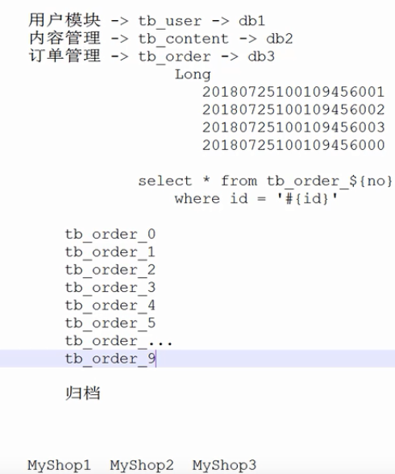
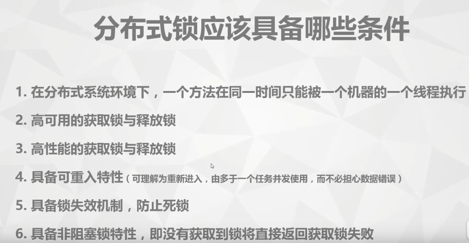
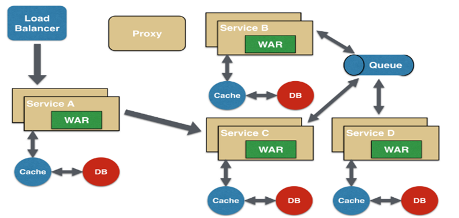

## 概念

IaaS 基础设施即服务

​	Linux

​	Docker

​	Docker Compose 简化Docker开发

PaaS 平台即服务

​	GitLab

​		支持持续集成

​	Nexus 依赖管理平台

​	Registry 镜像管理平台

​		Docker镜像的管理，类似于Nexus的概念

SaaS 软件即服务

3者合一是云计算，云服务，云存储

BaaS 区块链即服务

## 业务拆分

x轴水平拆分

y轴垂直拆分，分库

z轴数据拆分，分表

## 区别

SOA架构和微服务区别

SOA注重重用，微服务注重重写

SOA注重水平服务，微服务注重垂直服务

SOA注重从上而下，微服务注重从下而上

## 分布式锁

## 微服务设计模式

- API Gateway
- 服务间调用
- 服务发现
- 服务容错
- 服务部署
- 数据调用

### 聚合器微服务设计模式

这是一种最常见也最简单的设计模式

聚合器调用多个服务实现应用程序所需的功能。它可以是一个简单的 WEB 页面，将检索到的数据进行处理展示。它也可以是一个更高层次的组合微服务，对检索到的数据增加业务逻辑后进一步发布成一个新的微服务，这符合 **DRY** 原则。另外，每个服务都有自己的缓存和数据库。如果聚合器是一个组合服务，那么它也有自己的缓存和数据库。聚合器可以沿 `X轴` 和 `Z轴` 独立扩展

### 代理微服务设计模式

这是聚合模式的一个变种，如下图所示

在这种情况下，客户端并不聚合数据，但会根据业务需求的差别调用不同的微服务。代理可以仅仅委派请求，也可以进行数据转换工作

### 链式微服务设计模式

这种模式在接收到请求后会产生一个经过合并的响应，如下图所示

在这种情况下，`服务A` 接收到请求后会与 `服务B` 进行通信，类似地，`服务B` 会同 `服务C` 进行通信。所有服务都使用同步消息传递。在整个链式调用完成之前，客户端会一直阻塞。因此，服务调用链不宜过长，以免客户端长时间等待

### 分支微服务设计模式

这种模式是聚合器模式的扩展，允许同时调用两个微服务链，如下图所示

### 数据共享微服务设计模式

自治是微服务的设计原则之一，就是说微服务是全栈式服务。但在重构现有的“单体应用（Monolithic Application）”时，SQL 数据库反规范化可能会导致数据重复和不一致。因此，在单体应用到微服务架构的过渡阶段，可以使用这种设计模式，如下图所示

在这种情况下，部分微服务可能会共享缓存和数据库存储。不过，这只有在两个服务之间存在强耦合关系时才可以。对于基于微服务的新建应用程序而言，这是一种反模式

### 异步消息传递微服务设计模式

虽然 REST 设计模式非常流行，但它是同步的，会造成阻塞。因此部分基于微服务的架构可能会选择使用消息队列代替 REST 请求/响应，如下图所示

spring 5.x 支持异步非阻塞请求

## 阻塞非阻塞，同步与异步

**故事：小A烧开水。**

出场人物：小A出场道具：普通水壶（放在煤气灶上的那种，为了方便简称：水壶）；会响的水壶（水烧开了会响的那种，简称：响壶）。故事目的：小A要拿开水泡咖啡

小A为了实现目的，指定了4个计划：

1、用水壶烧水，并且站在煤气灶旁边，啥事不干，两眼直勾勾的盯着水壶，等水烧开。烧开后就去泡咖啡。**同步阻塞**

假设烧水和泡咖啡是在同一个线程中执行。

2、仍然用水壶煮水，不过此时不再傻傻得站在那里看水开没开，而是去玩局LOL，每当自己死了，就过来看看水开了没有。如果水开了就去泡咖啡。**同步非阻塞**

假设这里玩LOL，是另一个线程运行的。

3、动用响壶烧水，仍然站在煤气灶旁边，不过此时不两眼直勾勾的盯着壶了，而是听响，因为响壶水开时会用响声通知小A。**异步阻塞**

4、在计划3的基础上，小A不站在煤气灶旁边了，而是去玩局LOL，等听到响壶的声音提醒后，再去跑咖啡。**异步非阻塞**

有了上边的故事铺垫，我们再来看一看概念

**同步：**

同步这个词在很多场合下都会被使用，如果单从字面意思来看：相同的步骤。但是在编程的领域里讲，字面意思就不那么准确了。

对于编程领域来说，同步就是发起一个请求，直到请求返回结果之后，才进行下一步操作。简单来说，同步就是必须一件事一件事的做，等前一件做完了，才能做下一件事。

例子：此种模式很常见，比如我发起一个网络请求查询一个人的身份证，然后根据身份证查看这个人的详细信息。那么我查询详细信息的操作需要等待查询身份证的操作，那么此时查询身份证的操作就是一个同步操作。

**异步：**

异步很明显是与同步相对，二者的区别在于是否需要等待某操作的返回结果。简单来说，我们还是一个网络请求，如果我们此时不需要依赖这个请求的结果就能进行后续操作，那么此时这个网络请求就是一个异步操作。

当一个异步操作发出后，调用者在没有得到结果之前，可以继续执行后续操作。这就是异步。

**同步和异步的区别：**

二者的区别还是很明显的：请求发出后，是否需要等待请求结果，才能继续执行其他操作。

**阻塞**

阻塞的概念往往伴随着线程。阻塞一般是指：在调用结果返回之前，当前线程会被挂起。调用线程只有在得到结果之后才会被唤醒执行后续的操作。

**非阻塞**

那么非阻塞，毫无疑问是阻塞的反向操作。非阻塞式的调用指：在结果没有返回之前，该调用不会阻塞住当前线程。

是不是感觉阻塞/非阻塞和同步/异步有异曲同工的地方？

其实，这两者存在本质的区别，面向的对象是不同的。

阻塞/非阻塞：进程/线程需要操作的数据如果尚未就绪，是否妨碍了当前进程/线程的后续操作。同步/异步：数据如果尚未就绪，是否需要等待数据结果。

**并发和并行**

二者的区分度非常的高，就在于四个字：是否同时。

并发：当有多个线程在操作时，如果系统只有一个CPU，操作系统只能把CPU运行时间划分成若干个时间段,再将时间段分配给各个线程执行，在一个时间段的快速的切换不同的线程代码运行。

并行：当系统有多个CPU时，可以存在当一个CPU执行一个线程时，另一个CPU可以执行另一个线程，两个线程互不抢占CPU资源，可以同时进行。

**举个小例子**

小A吃饭吃到一半，电话来了，小A一直到吃完了以后才去接。**既不支持并发也不支持并行**

小A吃饭吃到一半，电话来了，小A停了下来接了电话，接完后继续吃饭。**支持并发**

小A吃饭吃到一半，电话来了，小A一边打电话一边吃饭。**支持并行**

启动顺序

1.分布式配置中心

2.服务注册与发现

3.服务提供者

4.服务消费者

5.api网关

## 关于通信

- Http
  - 应用层
  - 跨防火墙
  - 在不同的局域网内通信
- RPC
  - 远程过程调用
  - TCP，第四层，传输层
  - 优点，速度快
  - 缺点，不能跨防火墙，只支持局域网通信

- 对内RPC，对外Rest