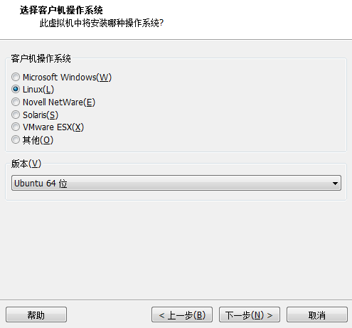
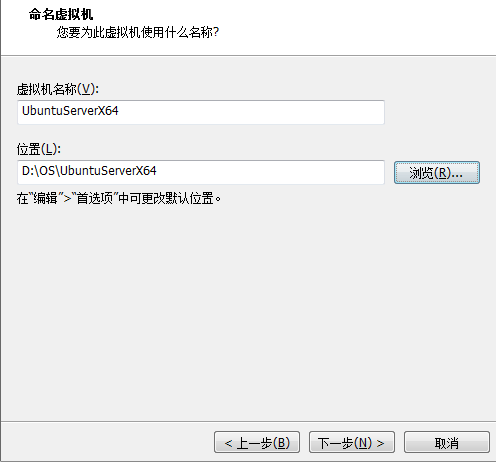
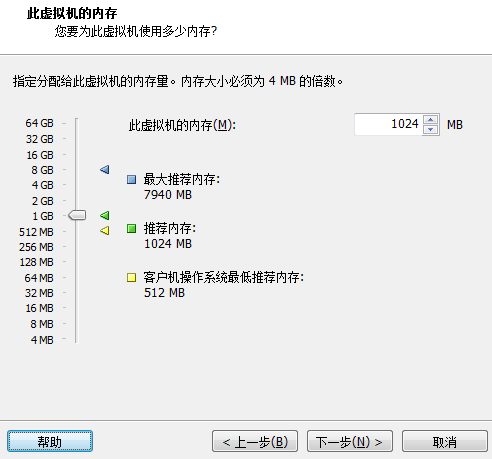
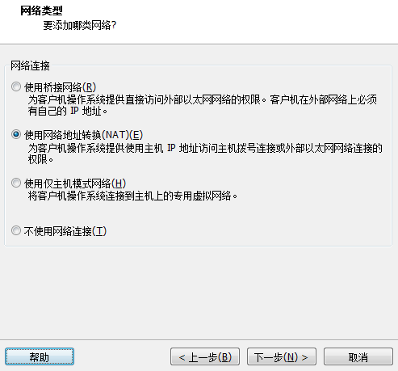
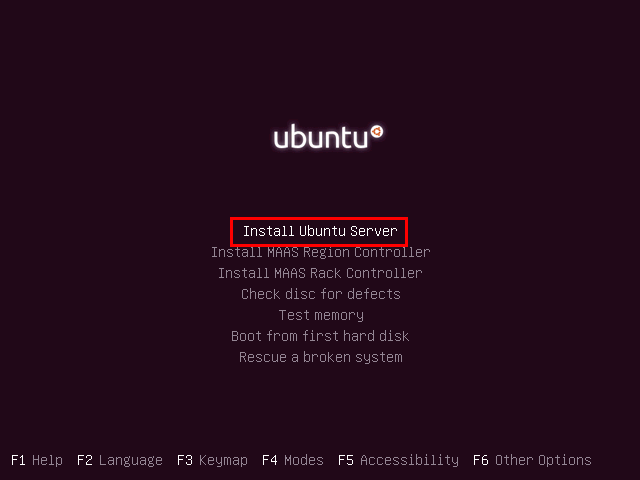
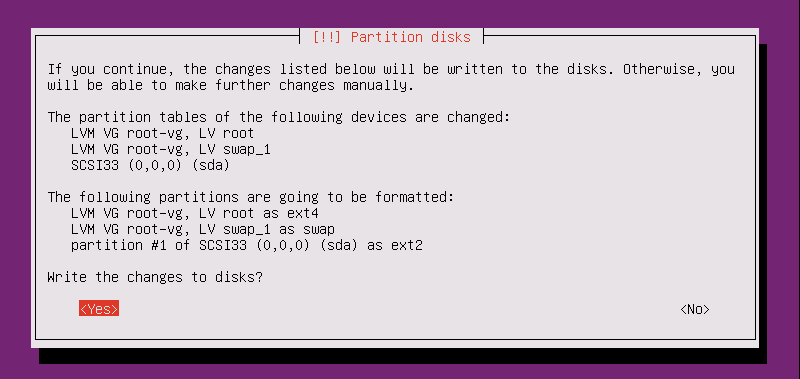
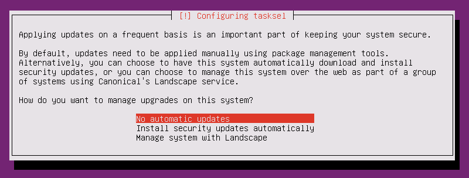
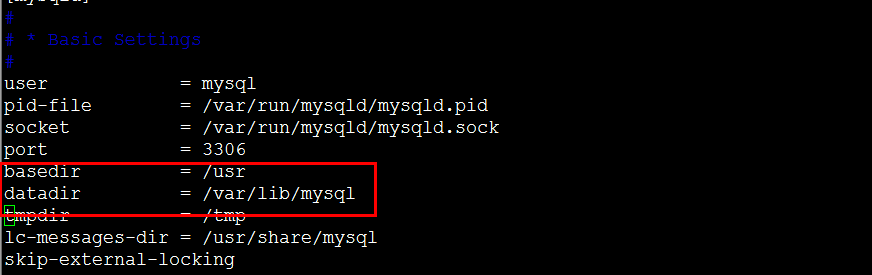

# Linux-Ubuntu学习

CentOS 更新版本满，求稳定，一般公司使用

Ubuntu 社区产物，更新较快，一个月1个版本，6个月一个稳定版本，注意要基于LTS版本

RedHat 政府使用

下载：http://www.ubuntu.org.cn/download

注意下载server版本，这里下载的是Ubuntu Server 16.04 LTS版本，只能使用LTS版本（稳定版本）

安装虚拟机

安装server，注意选择稍后手动安装，否则自动安装会有问题


## 安装

选择新建虚拟机


注意这里选择稍后安装


注意重命名




暂时先1G内存

一直下一步完成

编辑，选择ISO镜像文件

注意选择英文，中文简体在该版本有bug，注意镜像文件的目录要是全英文





选择完之后，选择other，然后找到Asia=>china，然后本地化选择United States

键盘布局：no，不检测

选择键盘，English US

**注意：安装ubuntu需要联网**

主机名：ubuntu

用户名：stt

密码：123456

是否加密主目录：no


**注意：无论手动还是自动，都要选择LVM**

==LVM：磁盘扩容技术==

- 当磁盘空间不足，扩展一块磁盘时，逻辑分区可以自动与之前的分区合并（需要敲命令）
- 一开始就需要选择，否则后期无法扩容




代理服务器没有，则continue

联网开始下载依赖

注：**设置不要自动更新**，因为版本会经常更新，导致系统不稳定



按空格勾选，需要一个SSH服务


操作系统的引导模式的安装，等于是系统启动的入口

windows：MBR，UEFI

linux：GRUB


安装完成后选择continue重启完成安装

登录，输入ifconfig，查看ip


## 目录说明

etc 配置文件目录

usr/local 自己安装的程序的目录

var 存放数据的目录


## 安装卸载

apt 软件包管理程序，ubuntu下软件安装

- yum centOS中使用

==注意，没有权限可以使用sudo + 命令的方式执行==

### 修改数据源

由于国内的网络环境问题，我们需要将 Ubuntu 的数据源修改为国内数据源，操作步骤如下：

查看系统版本

```text
lsb_release -a
```

输出结果为

```text
No LSB modules are available.
Distributor ID:	Ubuntu
Description:	Ubuntu 16.04 LTS
Release:	16.04
Codename:	xenial
```

**注：** Codename 为 `xenial`，该名称为我们 Ubuntu 系统的名称，修改数据源需要用到该名称

### 编辑数据源

- **如果没有权限添加sudo再执行命令**

```text
vi /etc/apt/sources.list
```

删除全部内容并修改为

```text
deb http://mirrors.aliyun.com/ubuntu/ xenial main restricted universe multiverse
deb http://mirrors.aliyun.com/ubuntu/ xenial-security main restricted universe multiverse
deb http://mirrors.aliyun.com/ubuntu/ xenial-updates main restricted universe multiverse
deb http://mirrors.aliyun.com/ubuntu/ xenial-backports main restricted universe multiverse
```

### 更新数据源

```text
apt-get update
```

常用 APT 命令

### 安装软件包

```text
apt-get install packagename
```

### 删除软件包

```text
apt-get remove packagename
apt-get autoremove packagename # 纯净卸载，对依赖也进行删除
```

### 更新软件包列表

```text
apt-get update 
```

### 升级有可用更新的系统（慎用）

```text
apt-get upgrade
```

其它 APT 命令

### 搜索

```text
apt-cache search package
```

### 获取包信息

```text
apt-cache show package
```

### 删除包及配置文件

```text
apt-get remove package --purge
```

### 了解使用依赖

```text
apt-cache depends package
```

### 查看被哪些包依赖

```text
apt-cache rdepends package
```

### 安装相关的编译环境

```text
apt-get build-dep package
```

### 下载源代码

```text
apt-get source package
```

### 清理无用的包

```text
apt-get clean && apt-get autoclean
```

### 检查是否有损坏的依赖

```text
apt-get check
```


## 权限

### 提权

给当前用户管理员的权限

```shell
sudo passwd root
#切换到管理员
su root
```


### 设置允许远程登录 Root

```text
nano /etc/ssh/sshd_config

# Authentication:
LoginGraceTime 120
#PermitRootLogin without-password     //注释此行
PermitRootLogin yes                             //加入此行
StrictModes yes

重启服务
service ssh restart
```


## 克隆

使用链接克隆节省空间，只要被克隆的不被删除，克隆的系统就存在


## 安装JDK

配置系统环境变量

```shell
vim /etc/environment
# 添加如下配置
export JAVA_HOME=/usr/local/java/jdk1.8.0_152
export JRE_HOME=/usr/local/java/jdk1.8.0_152/jre
export CLASSPATH=$CLASSPATH:$JAVA_HOME/lib:$JAVA_HOME/jre/lib
```

配置用户环境变量

```shell
nano /etc/profile

if [ "$PS1" ]; then
  if [ "$BASH" ] && [ "$BASH" != "/bin/sh" ]; then
    # The file bash.bashrc already sets the default PS1.
    # PS1='\h:\w\$ '
    if [ -f /etc/bash.bashrc ]; then
      . /etc/bash.bashrc
    fi
  else
    if [ "`id -u`" -eq 0 ]; then
      PS1='# '
    else
      PS1='$ '
    fi
  fi
fi

#添加如下部分---
export JAVA_HOME=/usr/local/java/jdk1.8.0_152
export JRE_HOME=/usr/local/java/jdk1.8.0_152/jre
export CLASSPATH=$CLASSPATH:$JAVA_HOME/lib:$JAVA_HOME/jre/lib
export PATH=$JAVA_HOME/bin:$JAVA_HOME/jre/bin:$PATH:$HOME/bin
#------

if [ -d /etc/profile.d ]; then
  for i in /etc/profile.d/*.sh; do
    if [ -r $i ]; then
      . $i
    fi
  done
  unset i
fi
```

生效

```shell
source /etc/profile
```

为其他用户更新环境变量

```shell
su stt
source /etc/profile
```


## 安装tomcat

解压，重命名tomcat，移动到usr/local下

### 常用命令

启动

```text
/usr/local/tomcat/bin/startup.sh
```

停止

```text
/usr/local/tomcat/bin/shutdown.sh
```

目录内执行脚本

```text
./startup.sh
```


## 安装MySQL

```shell
apt-get install mysql-server
```

安装到哪了

```shell
root@root:/usr/local/tomcat/bin# whereis mysql
mysql: /usr/bin/mysql /usr/lib/mysql /etc/mysql /usr/share/mysql /usr/share/man/man1/mysql.1.gz
```

查看配置

```shell
root@root:/etc/mysql/mysql.conf.d# pwd
/etc/mysql/mysql.conf.d
root@root:/etc/mysql/mysql.conf.d# vi mysqld.cnf
```

数据存储的位置


测试

```shell
lusifer@ubuntu:~$ systemctl status mysql.service
● mysql.service - MySQL Community Server
   Loaded: loaded (/lib/systemd/system/mysql.service; enabled; vendor preset: enabled)
   Active: active (running) since Tue 2017-11-21 13:04:34 CST; 3min 24s ago
 Main PID: 2169 (mysqld)
   CGroup: /system.slice/mysql.service
           └─2169 /usr/sbin/mysqld

Nov 21 13:04:33 ubuntu systemd[1]: Starting MySQL Community Server...
Nov 21 13:04:34 ubuntu systemd[1]: Started MySQL Community Server.
```

查看版本

```shell
mysqladmin -p -u root version
```

### 远程访问

```shell
nano /etc/mysql/mysql.conf.d/mysqld.cnf
# 在该句上添加注释
bind-address = 127.0.0.1
# 重启
service mysql restart
# 登录
mysql -u root -p
# show databases 输入查看表是否成功
# 授权 root 用户允许所有人连接，在mysql命令行中输入
grant all privileges on *.* to 'root'@'%' identified by '123456'; #最后是你的 mysql root 账户密码
```


SQLyog秘钥

```shell
姓名（Name）：cr173
序列号（Code）：8d8120df-a5c3-4989-8f47-5afc79c56e7c
```


### 常用命令

启动

```text
service mysql start
```

停止

```text
service mysql stop
```

重启

```text
service mysql restart
```

### 其它配置

修改配置 `mysqld.cnf` 配置文件

```text
vi /etc/mysql/mysql.conf.d/mysqld.cnf
```

配置默认字符集

在 `[mysqld]` 节点上增加如下配置

```text
[client]
default-character-set=utf8
```

在 `[mysqld]` 节点底部增加如下配置

```text
default-storage-engine=INNODB
character-set-server=utf8
collation-server=utf8_general_ci
```

配置忽略数据库大小写敏感

在 `[mysqld]` 节点底部增加如下配置

```text
lower-case-table-names = 1
```


### 卸载MySql

```shell
sudo apt-get autoremove --purge mysql-server-5.7 
#sudo apt-get remove mysql-server         # 没用到,已经没有mysql-server
#sudo apt-get autoremove mysql-server  # 没用到,已经没有mysql-server
sudo apt-get remove mysql-common
sudo rm -rf /etc/mysql/  /var/lib/mysql    #很重要
#清理残留数据
dpkg -l |grep ^rc|awk '{print $2}' |sudo xargs dpkg -P  
sudo apt autoremove
sudo apt autoreclean
```


## 安装maven

