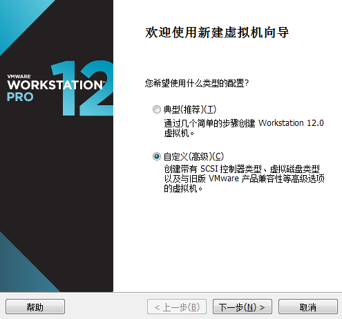
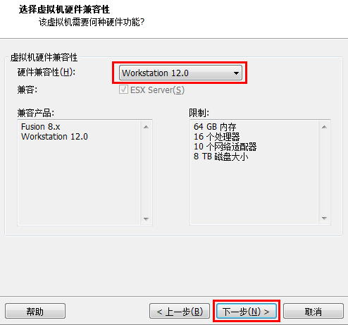
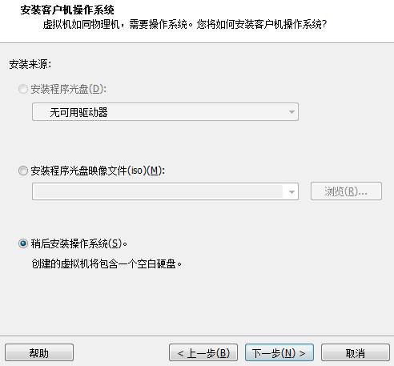
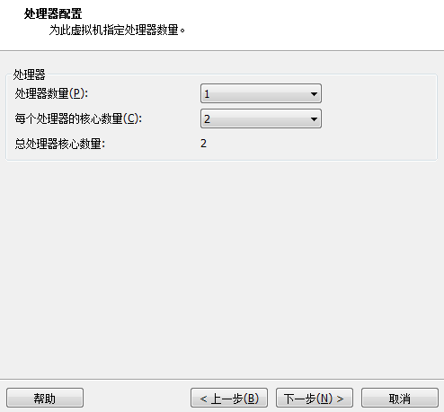
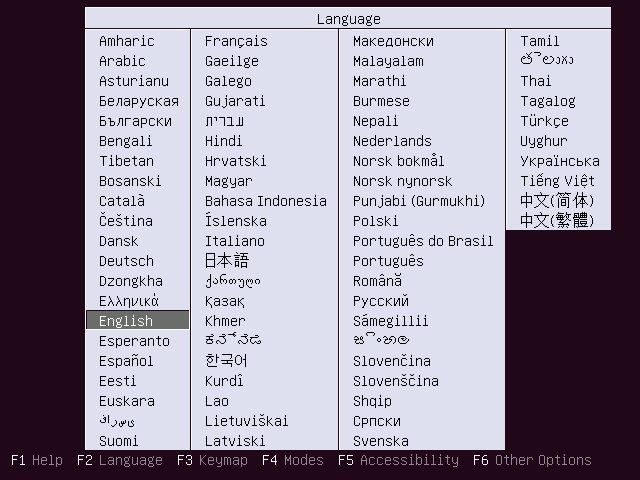
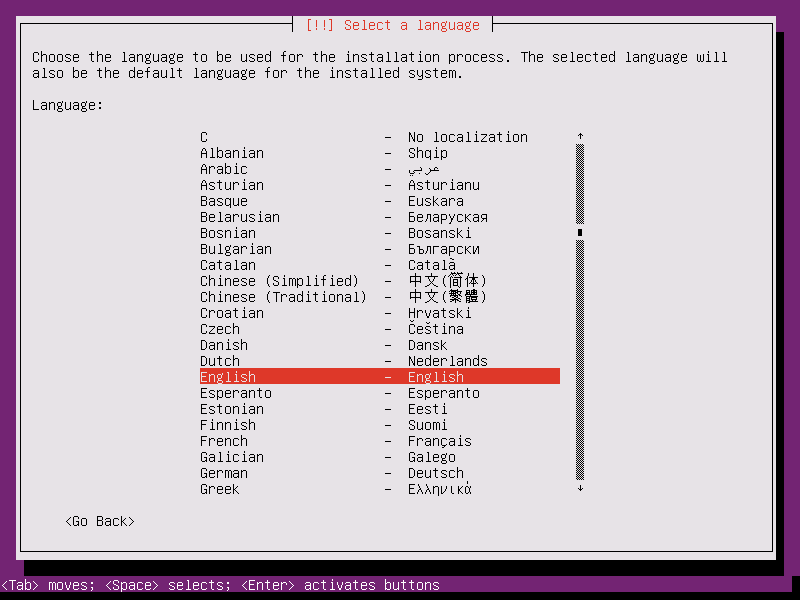
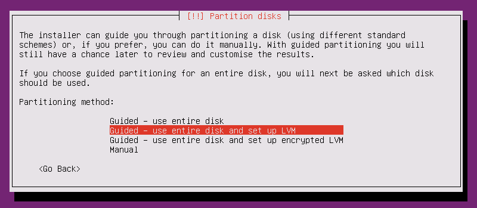
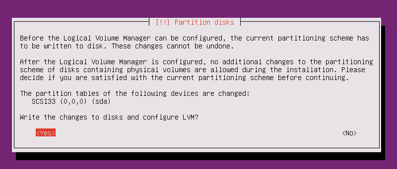

# Linux-Ubuntu学习

CentOS 更新版本满，求稳定，一般公司使用

Ubuntu 社区产物，更新较快，一个月1个版本，6个月一个稳定版本，注意要基于LTS版本

RedHat 政府使用

下载：http://www.ubuntu.org.cn/download

注意下载server版本，这里下载的是Ubuntu Server 16.04 LTS版本，只能使用LTS版本（稳定版本）

安装虚拟机

安装server，注意选择稍后手动安装，否则自动安装会有问题

## 安装

选择新建虚拟机

注意这里选择稍后安装

注意重命名

暂时先1G内存

一直下一步完成

编辑，选择ISO镜像文件

注意选择英文，中文简体在该版本有bug，注意镜像文件的目录要是全英文

选择完之后，选择other，然后找到Asia=>china，然后本地化选择United States

键盘布局：no，不检测

选择键盘，English US

**注意：安装ubuntu需要联网**

root

用户名：stt

密码：123456

是否加密主目录：no

**注意：无论手动还是自动，都要选择LVM**

==LVM：磁盘扩容技术==

- 当磁盘空间不足，扩展一块磁盘时，逻辑分区可以自动与之前的分区合并（需要敲命令）
- 一开始就需要选择，否则后期无法扩容

代理服务器没有，则continue

联网开始下载依赖

注：**设置不要自动更新**，因为版本会经常更新，导致系统不稳定

按空格勾选，需要一个SSH服务

