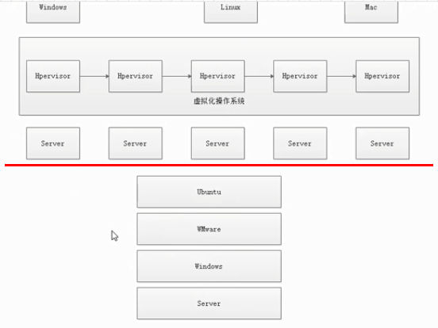
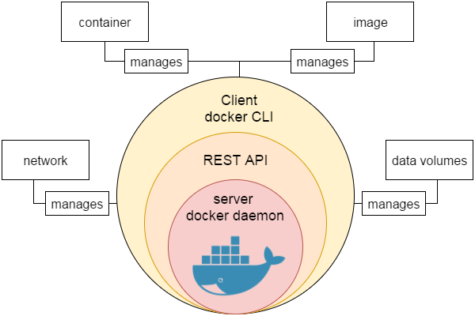
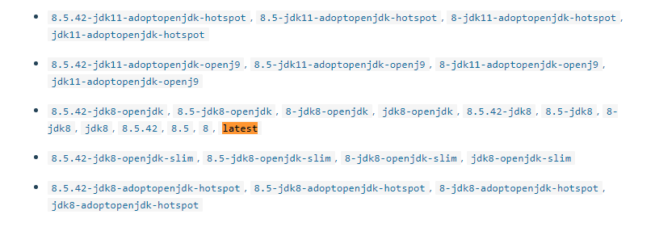
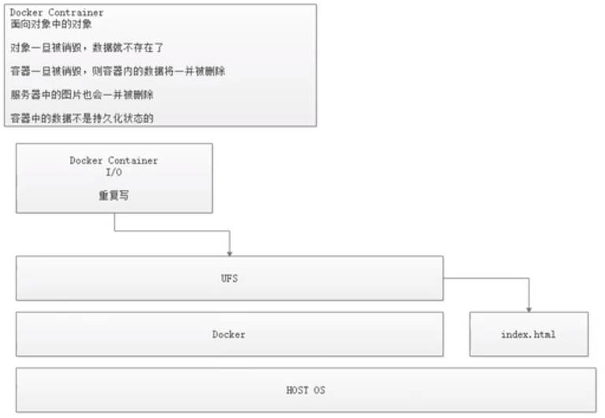
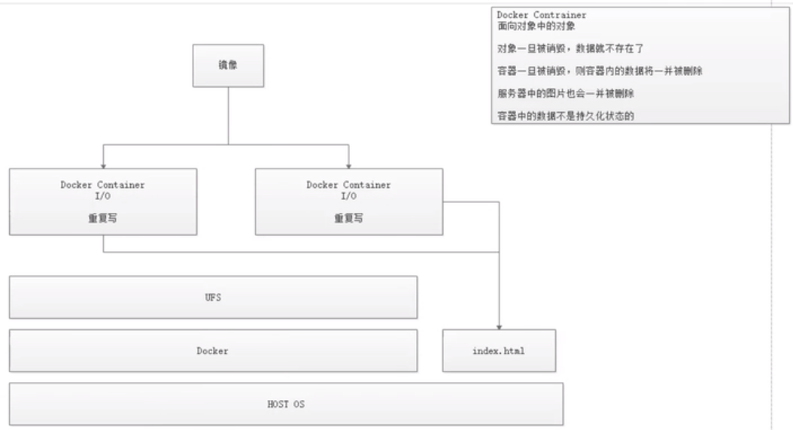

# Docker学习

参考：https://docs.docker.com

一次编译，到处运行

1.11->1.12里程碑版本

传统虚拟机


Hypervisor是一个虚拟化的操作系统，将底层server进行串联，合并成一个操作系统进行资源的分配



这里Hpervisor等价于VMware


传统的虚拟机技术的短板：

- 需要在Hpervisor建立的串联虚拟系统上再安装虚拟机，每个虚拟机上运行app，那么虚拟机大小资源大小就是app可以设置的大小
- 同时有些app不需要使用太多的资源，但是虚拟机配置了额外的资源，导致了资源的浪费
- 虚拟机也耗费系统的资源，增加了成本


docker


## 引擎

Docker 引擎是一个包含以下主要组件的客户端服务器应用程序。

- 一种服务器，它是一种称为守护进程并且长时间运行的程序。
- REST API用于指定程序可以用来与守护进程通信的接口，并指示它做什么。
- 一个有命令行界面 (CLI) 工具的客户端。




## 架构

Docker 使用客户端-服务器 (C/S) 架构模式，使用远程 API 来管理和创建 Docker 容器。

Docker 容器通过 Docker 镜像来创建。

容器与镜像的关系类似于面向对象编程中的对象与类。

| Docker | 面向对象 |
| :----- | :------- |
| 容器   | 对象     |
| 镜像   | 类       |


注意上图中的不同虚线一一对应的走向。

| 标题            | 说明                                                         |
| :-------------- | :----------------------------------------------------------- |
| 镜像(Images)    | Docker 镜像是用于创建 Docker 容器的模板。==镜像之间可以通过继承复用配置== |
| 容器(Container) | 容器是独立运行的一个或一组应用。                             |
| 客户端(Client)  | Docker 客户端通过命令行或者其他工具使用 Docker API (<https://docs.docker.com/reference/api/docker_remote_api>) 与 Docker 的守护进程通信。 |
| 主机(Host)      | 一个物理或者虚拟的机器用于执行 Docker 守护进程和容器。       |
| 仓库(Registry)  | Docker 仓库用来保存镜像，可以理解为代码控制中的代码仓库。Docker Hub([https://hub.docker.com](https://hub.docker.com/)) 提供了庞大的镜像集合供使用。 |
| Docker Machine  | Docker Machine是一个简化Docker安装的命令行工具，通过一个简单的命令行即可在相应的平台上安装Docker，比如VirtualBox、 Digital Ocean、Microsoft Azure。 |

分层存储

前一层构建是后一层的基础

## 镜像

我们都知道，操作系统分为内核和用户空间。对于 Linux 而言，内核启动后，会挂载 `root` 文件系统为其提供用户空间支持。而 Docker 镜像（Image），就相当于是一个 `root` 文件系统。比如官方镜像 `ubuntu:16.04` 就包含了完整的一套 Ubuntu 16.04 最小系统的 `root` 文件系统。

Docker 镜像是一个特殊的文件系统，除了提供容器运行时所需的程序、库、资源、配置等文件外，还包含了一些为运行时准备的一些配置参数（如匿名卷、环境变量、用户等）。镜像不包含任何动态数据，其内容在构建之后也不会被改变。

### 分层存储

因为镜像包含操作系统完整的 `root` 文件系统，其体积往往是庞大的，因此在 Docker 设计时，就充分利用 [Union FS](https://en.wikipedia.org/wiki/Union_mount) 的技术，将其设计为分层存储的架构。所以严格来说，镜像并非是像一个 ISO 那样的打包文件，镜像只是一个虚拟的概念，其实际体现并非由一个文件组成，而是由一组文件系统组成，或者说，由多层文件系统联合组成。

镜像构建时，会一层层构建，前一层是后一层的基础。每一层构建完就不会再发生改变，后一层上的任何改变只发生在自己这一层。比如，删除前一层文件的操作，实际不是真的删除前一层的文件，而是仅在当前层标记为该文件已删除。在最终容器运行的时候，虽然不会看到这个文件，但是实际上该文件会一直跟随镜像。因此，在构建镜像的时候，需要额外小心，每一层尽量只包含该层需要添加的东西，任何额外的东西应该在该层构建结束前清理掉。

分层存储的特征还使得镜像的复用、定制变的更为容易。甚至可以用之前构建好的镜像作为基础层，然后进一步添加新的层，以定制自己所需的内容，构建新的镜像。


## 容器

镜像（`Image`）和容器（`Container`）的关系，就像是面向对象程序设计中的 `类` 和 `实例` 一样，镜像是静态的定义，容器是镜像运行时的实体。容器可以被创建、启动、停止、删除、暂停等。

容器的实质是进程，但与直接在宿主执行的进程不同，容器进程运行于属于自己的独立的 [命名空间](https://en.wikipedia.org/wiki/Linux_namespaces)。因此容器可以拥有自己的 `root` 文件系统、自己的网络配置、自己的进程空间，甚至自己的用户 ID 空间。容器内的进程是运行在一个隔离的环境里，使用起来，就好像是在一个独立于宿主的系统下操作一样。这种特性使得容器封装的应用比直接在宿主运行更加安全。也因为这种隔离的特性，很多人初学 Docker 时常常会混淆容器和虚拟机。

前面讲过镜像使用的是分层存储，容器也是如此。每一个容器运行时，是以镜像为基础层，在其上创建一个当前容器的存储层，我们可以称这个为容器运行时读写而准备的存储层为**容器存储层**。

容器存储层的生存周期和容器一样，容器消亡时，容器存储层也随之消亡。因此，任何保存于容器存储层的信息都会随容器删除而丢失。

### 数据卷

按照 Docker 最佳实践的要求，容器不应该向其存储层内写入任何数据，容器存储层要保持无状态化。所有的文件写入操作，都应该使用 `数据卷（Volume）`、或者绑定宿主目录，在这些位置的读写会跳过容器存储层，直接对宿主（或网络存储）发生读写，其性能和稳定性更高。

传统虚拟机的方式对数据的处理，会有重复写的问题


## 仓库

类似于maven repository的服务器

镜像构建完成后，可以很容易的在当前宿主机上运行，但是，如果需要在其它服务器上使用这个镜像，我们就需要一个集中的存储、分发镜像的服务，`Docker Registry` 就是这样的服务。

一个 **Docker Registry** 中可以包含多个**仓库**（`Repository`）；每个仓库可以包含多个**标签**（`Tag`）；每个标签对应一个镜像。

通常，一个仓库会包含同一个软件不同版本的镜像，而标签就常用于对应该软件的各个版本。我们可以通过 `<仓库名>:<标签>` 的格式来指定具体是这个软件哪个版本的镜像。如果不给出标签，将以 `latest` 作为默认标签。

以 [Ubuntu 镜像](https://store.docker.com/images/ubuntu) 为例，`ubuntu` 是仓库的名字，其内包含有不同的版本标签，如，`14.04`, `16.04`。我们可以通过 `ubuntu:14.04`，或者 `ubuntu:16.04` 来具体指定所需哪个版本的镜像。如果忽略了标签，比如 `ubuntu`，那将视为 `ubuntu:latest`。

仓库名经常以 *两段式路径* 形式出现，比如 `jwilder/nginx-proxy`，前者往往意味着 Docker Registry 多用户环境下的用户名，后者则往往是对应的软件名。但这并非绝对，取决于所使用的具体 Docker Registry 的软件或服务

### 公有

Docker Registry 公开服务是开放给用户使用、允许用户管理镜像的 Registry 服务。一般这类公开服务允许用户免费上传、下载公开的镜像，并可能提供收费服务供用户管理私有镜像。

最常使用的 Registry 公开服务是官方的 [Docker Hub](https://hub.docker.com/)，这也是默认的 Registry，并拥有大量的高质量的官方镜像。除此以外，还有 [CoreOS](https://coreos.com/) 的 [Quay.io](https://quay.io/repository/)，CoreOS 相关的镜像存储在这里；Google 的 [Google Container Registry](https://cloud.google.com/container-registry/)，[Kubernetes](http://kubernetes.io/) 的镜像使用的就是这个服务。

由于某些原因，在国内访问这些服务可能会比较慢。国内的一些云服务商提供了针对 Docker Hub 的镜像服务（`Registry Mirror`），这些镜像服务被称为**加速器**。常见的有 [阿里云加速器](https://cr.console.aliyun.com/#/accelerator)、[DaoCloud 加速器](https://www.daocloud.io/mirror#accelerator-doc) 等。使用加速器会直接从国内的地址下载 Docker Hub 的镜像，比直接从 Docker Hub 下载速度会提高很多。

国内也有一些云服务商提供类似于 Docker Hub 的公开服务。比如 [时速云镜像仓库](https://hub.tenxcloud.com/)、[网易云镜像服务](https://c.163.com/hub#/m/library/)、[DaoCloud 镜像市场](https://hub.daocloud.io/)、[阿里云镜像库](https://cr.console.aliyun.com/) 等。


### 私有

除了使用公开服务外，用户还可以在本地搭建私有 Docker Registry。Docker 官方提供了 [Docker Registry](https://store.docker.com/images/registry/) 镜像，可以直接使用做为私有 Registry 服务。

开源的 Docker Registry 镜像只提供了 [Docker Registry API](https://docs.docker.com/registry/spec/api/) 的服务端实现，足以支持 `docker` 命令，不影响使用。但不包含图形界面，以及镜像维护、用户管理、访问控制等高级功能。在官方的商业化版本 [Docker Trusted Registry](https://docs.docker.com/datacenter/dtr/2.0/) 中，提供了这些高级功能。

除了官方的 Docker Registry 外，还有第三方软件实现了 Docker Registry API，甚至提供了用户界面以及一些高级功能。比如，[VMWare Harbor](https://github.com/vmware/harbor) 和 [Sonatype Nexus](https://www.sonatype.com/docker)。


## 安装

==警告：切勿在没有配置 Docker APT 源的情况下直接使用 apt 命令安装 Docker==

### 系统要求

Docker CE 支持以下版本的 [Ubuntu](https://www.ubuntu.com/server) 操作系统：

- Artful 17.10 (Docker CE 17.11 Edge +)
- Xenial 16.04 (LTS)
- Trusty 14.04 (LTS)

Docker CE 可以安装在 64 位的 x86 平台或 ARM 平台上。Ubuntu 发行版中，LTS（Long-Term-Support）长期支持版本，会获得 5 年的升级维护支持，这样的版本会更稳定，因此在生产环境中推荐使用 LTS 版本,当前最新的 LTS 版本为 Ubuntu 16.04

企业版Docker EE要钱

### 卸载旧版本

```sh
$ sudo apt-get remove docker \
               docker-engine \
               docker.io
```


### 使用脚本自动安装

```sh
$ curl -fsSL get.docker.com -o get-docker.sh
# 可能会出现 404 错误，请移步下面的特别说明
$ sudo sh get-docker.sh --mirror Aliyun
```

执行这个命令后，脚本就会自动的将一切准备工作做好，并且把 Docker CE 的 Edge 版本安装在系统中。

特别说明

2018 年 7 月 21 日，貌似阿里云这边在做调整，故导致 Docker 的 Aliyun 安装脚本不可用，是永久性还是临时性的尚不清除，如果你已经按照之前的操作安装 Docker，请按以下步骤进行修复并重新安装

- 如果已经使用了 Aliyun 脚本安装并成功的
  - 请先卸载 Docker，命令为：`apt-get autoremove docker-ce`
  - 删除 `/etc/apt/sources.list.d` 目录下的 `docker.list` 文件
- 使用 `AzureChinaCloud` 镜像脚本重新安装，命令为：`sudo sh get-docker.sh --mirror AzureChinaCloud`


### 传统APT安装

#### Ubuntu 14.04 可选内核模块

从 Ubuntu 14.04 开始，一部分内核模块移到了可选内核模块包 (`linux-image-extra-*`) ，以减少内核软件包的体积。正常安装的系统应该会包含可选内核模块包，而一些裁剪后的系统可能会将其精简掉。`AUFS` 内核驱动属于可选内核模块的一部分，作为推荐的 Docker 存储层驱动，一般建议安装可选内核模块包以使用 `AUFS`。

如果系统没有安装可选内核模块的话，可以执行下面的命令来安装可选内核模块包：

```bash
$ sudo apt-get update

$ sudo apt-get install \
    linux-image-extra-$(uname -r) \
    linux-image-extra-virtual
```

#### Ubuntu 16.04 +

Ubuntu 16.04 + 上的 Docker CE 默认使用 `overlay2` 存储层驱动,无需手动配置。

#### 使用 APT 安装

#### 安装必要的一些系统工具

```text
sudo apt-get update
sudo apt-get -y install apt-transport-https ca-certificates curl software-properties-common
```

#### 安装 GPG 证书

```text
curl -fsSL http://mirrors.aliyun.com/docker-ce/linux/ubuntu/gpg | sudo apt-key add -
```

#### 写入软件源信息

```text
sudo add-apt-repository "deb [arch=amd64] http://mirrors.aliyun.com/docker-ce/linux/ubuntu $(lsb_release -cs) stable"
```

#### 更新并安装 Docker CE

```text
sudo apt-get -y update
sudo apt-get -y install docker-ce
```

> 以上命令会添加稳定版本的 Docker CE APT 镜像源，如果需要最新或者测试版本的 Docker CE 请将 stable 改为 edge 或者 test。从 Docker 17.06 开始，edge test 版本的 APT 镜像源也会包含稳定版本的 Docker


### 查看版本

```sh
root@root:~# docker version
Client:
 Version:           18.09.6
 API version:       1.39 # 接口版本>1.12
 Go version:        go1.10.8
 Git commit:        481bc77
 Built:             Sat May  4 02:35:27 2019
 OS/Arch:           linux/amd64
 Experimental:      false

Server: Docker Engine - Community
 Engine:
  Version:          18.09.6
  API version:      1.39 (minimum version 1.12)
  Go version:       go1.10.8
  Git commit:       481bc77
  Built:            Sat May  4 01:59:36 2019
  OS/Arch:          linux/amd64
  Experimental:     false
```

可以发现docker安装后，本身==即是服务端又是客户端==


### 配置Docker镜像加速器

国内从 Docker Hub 拉取镜像有时会遇到困难，此时可以配置镜像加速器。Docker 官方和国内很多云服务商都提供了国内加速器服务，例如：

- [Docker 官方提供的中国 registry mirror](https://docs.docker.com/registry/recipes/mirror/#use-case-the-china-registry-mirror)
- [阿里云加速器](https://cr.console.aliyun.com/#/accelerator)
- [DaoCloud 加速器](https://www.daocloud.io/mirror#accelerator-doc)

我们以 Docker 官方加速器为例进行介绍。

#### Ubuntu 16.04+、Debian 8+、CentOS 7

对于使用 [systemd](https://www.freedesktop.org/wiki/Software/systemd/) 的系统，请在 `/etc/docker/daemon.json` 中写入如下内容（如果文件不存在请新建该文件）

```json
{
  "registry-mirrors": [
    "https://registry.docker-cn.com"
  ]
}
```

> 注意，一定要保证该文件符合 json 规范，否则 Docker 将不能启动。
> 可以登录阿里云加速器，获取私人镜像加速器网址 https://o2qwaqgd.mirror.aliyuncs.com 配置完成后重启服务


之后重新启动服务。

```bash
$ sudo systemctl daemon-reload
$ sudo systemctl restart docker
```


#### Windows 10

对于使用 Windows 10 的系统，在系统右下角托盘 Docker 图标内右键菜单选择 `Settings`，打开配置窗口后左侧导航菜单选择 `Daemon`。在 `Registry mirrors` 一栏中填写加速器地址 `https://registry.docker-cn.com`，之后点击 `Apply` 保存后 Docker 就会重启并应用配置的镜像地址了。

#### macOS

对于使用 macOS 的用户，在任务栏点击 Docker for mac 应用图标 -> Perferences... -> Daemon -> Registry mirrors。在列表中填写加速器地址 `https://registry.docker-cn.com`。修改完成之后，点击 `Apply & Restart` 按钮，Docker 就会重启并应用配置的镜像地址了。

#### 检查加速器是否生效

配置加速器之后，如果拉取镜像仍然十分缓慢，请手动检查加速器配置是否生效，在命令行执行 `docker info`，如果从结果中看到了如下内容，说明配置成功。

```bash
Registry Mirrors:
 https://registry.docker-cn.com/
```


## 镜像操作

Docker 运行容器前需要本地存在对应的镜像，如果本地不存在该镜像，Docker 会从镜像仓库下载该镜像。

本章将介绍更多关于镜像的内容，包括：

- 从仓库获取镜像；
- 管理本地主机上的镜像；
- 介绍镜像实现的基本原理。


### 获取镜像 docker pull


之前提到过，[Docker Hub](https://hub.docker.com/explore/) 上有大量的高质量的镜像可以用，这里我们就说一下怎么获取这些镜像。

从 Docker 镜像仓库获取镜像的命令是 `docker pull`。其命令格式为：

```sh
docker pull [选项] [Docker Registry 地址[:端口号]/]仓库名[:标签]
如：
docker pull ip:port/tomcat:latest # ip 和 port 是官方镜像，或者是加速器配置的ip与port
```

具体的选项可以通过 `docker pull --help` 命令看到，这里我们说一下镜像名称的格式。

- Docker 镜像仓库地址：地址的格式一般是 `<域名/IP>[:端口号]`。默认地址是 Docker Hub。
- 仓库名：如之前所说，这里的仓库名是两段式名称，即 `<用户名>/<软件名>`。对于 Docker Hub，如果不给出用户名，则默认为 `library`，也就是官方镜像

如

```sh
$ docker pull ubuntu:16.04
16.04: Pulling from library/ubuntu
bf5d46315322: Pull complete # 每一层进行下载，如果拉取其他镜像时，层id相同，那么可以直接跳过
9f13e0ac480c: Pull complete
e8988b5b3097: Pull complete
40af181810e7: Pull complete
e6f7c7e5c03e: Pull complete
Digest: sha256:147913621d9cdea08853f6ba9116c2e27a3ceffecf3b492983ae97c3d643fbbe
Status: Downloaded newer image for ubuntu:16.04
```

上面的命令中没有给出 Docker 镜像仓库地址，因此将会从 Docker Hub 获取镜像。而镜像名称是 `ubuntu:16.04`，因此将会获取官方镜像 `library/ubuntu` 仓库中标签为 `16.04` 的镜像。

从下载过程中可以看到我们之前提及的==分层存储==的概念，镜像是由多层存储所构成。下载也是一层层的去下载，并非单一文件。下载过程中给出了每一层的 ID 的前 12 位。并且下载结束后，给出该镜像完整的 `sha256` 的摘要，以确保下载一致性。

在使用上面命令的时候，你可能会发现，你所看到的层 ID 以及 `sha256` 的摘要和这里的不一样。这是因为官方镜像是一直在维护的，有任何新的 bug，或者版本更新，都会进行修复再以原来的标签发布，这样可以确保任何使用这个标签的用户可以获得更安全、更稳定的镜像。


示例：拉取tomcat

```sh
docker pull tomcat
#拉取完成后测试运行
root@root:~# docker run -p 8080:8080 tomcat
```

默认拉取最新的版本latest，当前是8.5，可以在Docker Hub上查看



同样可以拉取指定版本

```sh
docker pull tomcat:9-jre8
```


### 运行镜像 docker run

有了镜像后，我们就能够以这个镜像为基础启动并运行一个容器。以上面的 `ubuntu:16.04` 为例，如果我们打算启动里面的 `bash` 并且进行交互式操作的话，可以执行下面的命令。

```sh
$ docker run -it --rm \ # \ 表示换行
    ubuntu:16.04 \
    bash

root@e7009c6ce357:/# cat /etc/os-release
NAME="Ubuntu"
VERSION="16.04.4 LTS, Trusty Tahr"
ID=ubuntu
ID_LIKE=debian
PRETTY_NAME="Ubuntu 16.04.4 LTS"
VERSION_ID="16.04"
HOME_URL="http://www.ubuntu.com/"
SUPPORT_URL="http://help.ubuntu.com/"
BUG_REPORT_URL="http://bugs.launchpad.net/ubuntu/"
```

`docker run` 就是运行容器的命令，我们这里简要的说明一下上面用到的参数。

- `-it`：这是两个参数，一个是 `-i`：交互式操作，一个是 `-t` 终端。我们这里打算进入 `bash` 执行一些命令并查看返回结果，因此我们需要交互式终端。
- `--rm`：这个参数是说容器退出后随之将其删除。默认情况下，为了排障需求，退出的容器并不会立即删除，除非手动 `docker rm`。我们这里只是随便执行个命令，看看结果，不需要排障和保留结果，因此使用 `--rm` 可以避免浪费空间。
- `ubuntu:16.04`：这是指用 `ubuntu:16.04` 镜像为基础来启动容器。
- `bash`：放在镜像名后的是**命令**，这里我们希望有个交互式 Shell，因此用的是 `bash`。

进入容器后，我们可以在 Shell 下操作，执行任何所需的命令。这里，我们执行了 `cat /etc/os-release`，这是 Linux 常用的查看当前系统版本的命令，从返回的结果可以看到容器内是 `Ubuntu 16.04.4 LTS` 系统。

最后我们通过 `exit` 退出了这个容器。

在其他客户端执行命令

```sh
docker ps -a # 查看所有容器
docker ps # 查看正在运行的容器
# 在不点击exit可以看到ubuntu容器的存在
```

docker特点

- ==沙箱机制==
- 隔离机制

- 镜像产生的各个容器之间互不影响，容器的损坏和异常不会影响其他容器
- 满足了高可用特性，多个app容器不会相互影响


### 列出镜像 docker images

命令

```sh
docker images 
docker image ls
```

- 镜像体积

  - docker hub 显示的大小是压缩的大小

    - 说明下载后需要解压

  - docker images命令后显示的大小，是本地展开的大小

    - 显示体积并非所有镜像实际占用

    - docker是多层存储，可继承，复用

    - 不同的镜像可以使用相同的层，从而体积会减少

    - docker使用Union FS，相同的层只需要保存一份

      

#### 查看镜像，容器，数据卷所占用的空间

```sh
root@root:~# docker system df
TYPE                TOTAL               ACTIVE              SIZE                RECLAIMABLE
Images              1                   1                   505.8MB             0B (0%)
Containers          2                   0                   57.56kB             57.56kB (100%)
Local Volumes       0                   0                   0B                  0B
Build Cache         0                   0                   0B                  0B
```


#### 虚悬镜像 

标签为<none>的镜像，表示使用docker pull 或者docker build 的时候，原镜像更新，新旧镜像同名，名称会移动到最新的镜像上，原先的镜像就显示<none>

可以使用命令删除

```sh
docker image prune
```


#### 中间层镜像

一些镜像所依赖的共用镜像，没有标签，只存储一份

添加`-a`参数可以查看

```sh
docker image ls -a
```


#### 列出部分镜像

查询特定的镜像，如查询tomcat的镜像

```sh
docker image ls tomcat
```


### 删除镜像 docker image rm

```sh
docker image rm 镜像id
```


### 创建镜像 docker build


#### Dockerfile

- 使用Dockerfile脚本文件

  - 类似于Linux的sh脚本概念
  - 文本文件
  - 每一条指令构建一层（FROM，COPY，RUN等）

  

- 以tomcat为例搭建一个镜像

  - 创建一个docker目录（在/usr/local/下，一般的镜像规范都是在该目录下）
  - 在docker目录中创建一个tomcat文件夹，并创建Dockerfile文件
  - 查看tomcat镜像的内容，注意，不能使用vim在镜像文件中编辑，只能使用echo
  
  ```sh
  root@root:/usr/local/docker/tomcat# docker run -it tomcat bash
  root@e0af48090585:/usr/local/tomcat# ls -l
  total 152
  -rw-r--r-- 1 root root  19534 Jun  4 20:31 BUILDING.txt
  -rw-r--r-- 1 root root   5407 Jun  4 20:31 CONTRIBUTING.md
  -rw-r--r-- 1 root root  57011 Jun  4 20:31 LICENSE
  -rw-r--r-- 1 root root   1726 Jun  4 20:31 NOTICE
  ```
  
  - 找到要修改镜像的文件路径：/usr/local/tomcat/webapps/ROOT（官方的镜像路径都是/usr/local/下的）
  - Dockerfile的内容
  
  ```sh
  FROM tomcat
  RUN echo "hello docker" > /usr/local/tomcat/webapps/ROOT/index.html
  ```
  
  - 生成镜像
  
  ```sh
  root@root:/usr/local/docker/tomcat# docker build -t mytomcat:v1 . # 最后的点，表示当前文件夹下的Dockerfile文件
  Sending build context to Docker daemon  2.048kB
  Step 1/2 : FROM tomcat # 表示2层构建
   ---> 5377fd8533c3
  Step 2/2 : RUN echo "hello docker" > /usr/local/tomcat/webapps/ROOT/index.html
   ---> Running in 8c065bf11822
  Removing intermediate container 8c065bf11822
   ---> 455e10835a9e
  Successfully built 455e10835a9e
  Successfully tagged mytomcat:v1
  
  root@root:/usr/local/docker/tomcat# docker images
  REPOSITORY          TAG                 IMAGE ID            CREATED             SIZE
  mytomcat            v1                  455e10835a9e        41 seconds ago      506MB
  tomcat              latest              5377fd8533c3        2 days ago          506MB
  ubuntu              16.04               2a697363a870        4 weeks ago         119MB
  ```
  
  - 尝试删除ROOT目录下的文件，再次构建
  
  ```sh
  FROM tomcat
  WORKDIR /usr/local/tomcat/webapps/ROOT/ #切换到目录，等价于cd
  RUN rm -rf *
  RUN echo "hello docker" > /usr/local/tomcat/webapps/ROOT/index.html
  ```
  
  - 构建运行，注意删除原先的容器
  
  ```sh
  root@root:/usr/local/docker/tomcat# docker build -t mytomcat:v2 .
  root@root:/usr/local/docker/tomcat# docker run -p 8080:8080 mytomcat:v2
  ```
  
  

##### 命令

###### FROM

- Dockerfile的第一条指令
- 指定基础镜像，以一个镜像为基础
  - 有服务类镜像[`nginx`](https://store.docker.com/images/nginx/)、[`redis`](https://store.docker.com/images/redis/)、[`mongo`](https://store.docker.com/images/mongo/)、[`mysql`](https://store.docker.com/images/mysql/)、[`httpd`](https://store.docker.com/images/httpd/)、[`php`](https://store.docker.com/images/php/)、[`tomcat`](https://store.docker.com/images/tomcat/) 等
  - 有语言类镜像[`node`](https://store.docker.com/images/node)、[`openjdk`](https://store.docker.com/images/openjdk/)、[`python`](https://store.docker.com/images/python/)、[`ruby`](https://store.docker.com/images/ruby/)、[`golang`](https://store.docker.com/images/golang/) 等
  - 操作系统镜像 [`ubuntu`](https://store.docker.com/images/ubuntu/)、[`debian`](https://store.docker.com/images/debian/)、[`centos`](https://store.docker.com/images/centos/)、[`fedora`](https://store.docker.com/images/fedora/)、[`alpine`](https://store.docker.com/images/alpine/) 等
  - 空白镜像 `scratch` ，虚拟的概念
    - 不需要操作系统提供运行时支持
    - 一切库都包含在可执行文件中
    - 体积小
    - go语言很多使用空白镜像

###### RUN

- 运行shell命令

- shell格式：`RUN <命令>`

   ```sh
    RUN echo '<h1>Hello, Docker!</h1>' > /usr/share/nginx/html/index.html
   ```

- exec格式：`RUN ["可执行文件", "参数1", "参数2"]`

- 每写一行RUN，构建一层镜像

   - Union FS 是有最大层数限制的
   - AUFS 不超过127层

   - 错误写法

   ```sh
   FROM debian:jessie
   
   RUN apt-get update
   RUN apt-get install -y gcc libc6-dev make
   RUN wget -O redis.tar.gz "http://download.redis.io/releases/redis-3.2.5.tar.gz"
   RUN mkdir -p /usr/src/redis
   RUN tar -xzf redis.tar.gz -C /usr/src/redis --strip-components=1
   RUN make -C /usr/src/redis
   RUN make -C /usr/src/redis install
   ```

   - 正确写法

   ```sh
   FROM debian:jessie
   
   RUN buildDeps='gcc libc6-dev make' \
       && apt-get update \
       && apt-get install -y $buildDeps \
       && wget -O redis.tar.gz "http://download.redis.io/releases/redis-3.2.5.tar.gz" \
       && mkdir -p /usr/src/redis \
       && tar -xzf redis.tar.gz -C /usr/src/redis --strip-components=1 \
       && make -C /usr/src/redis \
       && make -C /usr/src/redis install
   ```


##### 构建镜像

注意：RUN命令会启动一个容器，然后做出修改后删除该容器并构建该层镜像

```bash
docker build [选项] <上下文路径/URL/->

root@root:/usr/local/docker/tomcat# docker build -t mytomcat:v1 . # 最后的点，表示当前文件夹下的Dockerfile文件
Sending build context to Docker daemon  2.048kB
Step 1/2 : FROM tomcat # 表示2层构建
 ---> 5377fd8533c3
Step 2/2 : RUN echo "hello docker" > /usr/local/tomcat/webapps/ROOT/index.html
 ---> Running in 8c065bf11822  # 启动一个容器，修改之后
Removing intermediate container 8c065bf11822 # 关闭这个容器
 ---> 455e10835a9e # 生成一层镜像文件
Successfully built 455e10835a9e
Successfully tagged mytomcat:v1
```

指定了最终镜像的名称 `-t mytomcat:v1`


##### 构建上下文

- 使用`docker build`的时候最后有一个 `.`
- 该`.` 就是上下文
- docker 是C/S架构，在安装docker后，可以发现安装了服务端和客户端
- 使用`docker build`构建镜像在服务端docker引擎构建，而非客户端
- 客户端输入构建命令，将路径下的所有内容打包，上传给docker引擎
- 引擎收到内容后展开，获取需要的文件
- 那么build输入的`.`是指当前路径下为==上下文路径==，将当前路径下的文件打包给docker引擎
- 分析命令

```sh
COPY ./package.json /app/
```

- 该命令中的./package.json文件指的是上下文路径中的package.json文件，而非本地客户端当前文件夹的文件

- Dockerfile文件默认在构建的当前目录下，也可指定路径`docker build -f /path/to/a/Dockerfile .`

  

##### 其他命令

###### COPY

- 格式

```sh
COPY <源路径>... <目标路径>
COPY ["<源路径1>",... "<目标路径>"]
```

- ==从上下文目录==中的**源路径**的文件拷贝到镜像内的**目标路径**
  - 通配符规则要满足 Go 的 [`filepath.Match`](https://golang.org/pkg/path/filepath/#Match) 规则

```sh
COPY package.json /usr/src/app/
COPY hom* /mydir/
COPY hom?.txt /mydir/
```

- 特点
  - 源文件的各种元数据都会保留。比如读、写、执行权限、文件变更时间等
  - 目标路径不需要事先创建，如果目录不存在会在复制文件前先行创建缺失目录
  - 可以是容器内的绝对路径，也可是相对于工作目录的相对路径（工作目录可以用 `WORKDIR`指令来指定）

###### ADD

- 性质与COPY相似

- 增加的功能

  - `<源路径>`可以是一个URL，Docker引擎会去下载链接的文件到`<目标路径>`

    - 设置默认权限600
    - 如果需要修改权限，需要RUN进行修改
    - 如果下载的是压缩包，需要RUN进行解压
    - 一般不推荐使用，而是先通过RUN wget下载后，解压，权限处理完成后ADD

  - `<源路径>`是一个tar文件，压缩格式为 `gzip`, `bzip2` 以及 `xz` ，`ADD`会自动解压到`<目标路径>`

    - 很实用，可以将官方镜像进行解压

    ```sh
    FROM scratch
    ADD ubuntu-xenial-core-cloudimg-amd64-root.tar.gz /
    ...
    ```

    - 如果不希望进行解压，那么就不能使用`ADD`

- 适合的场景：带有压缩包的源文件需要自动解压缩（解压缩后会删除原压缩包）

  - ADD包含了更多复杂的功能，行为不清晰，操作场景相同时推荐用COPY操作


###### WORKDIR

```sh
WORKDIR <工作目录路径>
```

- 指定工作路径，以后==各层的当前目录==修改为指定的目录
- 目录不存在会创建目录

错误示范

```sh
RUN cd /app
RUN echo "hello" > world.txt
```

- Dockerfile不等同于shell
- 每一个RUN会启动一个容器，那么cd只是RUN的那层容器内的操作，第二个RUN又是一个容器了


###### EXPOSE

```sh
EXPOSE <端口1>[<端口2>...]
```

- 声明运行时，容器提供服务的守护端口
- 注意：运行时，不会因为声明就开启这个端口的服务
- 好处
  - 方便使用者配置映射
  - 使用`docker run -P`时会自动映射`EXPOSE`端口（注意是P）

- 与`-p <宿主端口>:<容器端口>`区分
  - `EXPOSE`只是声明容器打算使用什么端口，不会自动在宿主进行端口映射

###### CMD

- 格式

```sh
CMD <命令>
CMD ["可执行文件", "参数1", "参数2"...] # 推荐使用
```

- Docker容器不是虚拟机，是一个进程，进程在启动的时候可添加初始参数
- 用于指定默认容器主进程启动的命令
- ubuntu镜像默认的CMD是/bin/bash，那么执行如下命令

```sh
CMD echo $HOME
# 在执行时会转变为
CMD [ "sh", "-c", "echo $HOME" ]
# shell命令的环境变量可以使用，会被sh解析处理
```

- 更换默认CMD命令

```sh
docker run -it ubuntu cat /etc/os-release # 将/bin/bash替换为 cat /etc/os-release
```

- Docker容器中的程序都是前台执行的，不能后台执行

```sh
CMD service nginx start # 执行失败，会直接退出容器进程，会被理解为如下命令
CMD [ "sh", "-c", "service nginx start"] # 执行失败，正确的应该执行nginx的命令
CMD ["nginx", "-g", "daemon off;"] # nginx在前台执行
```


###### ENV


###### ENTRYPOINT


#### 示例：app解压到tomcat

部署一个war包到tomcat，设置80端口启动


##### 尝试1

修改Dockerfile拷贝xxx.zip到ROOT下并解压

Dockerfile

```sh
FROM tomcat

COPY xxx.zip /usr/local/tomcat/webapps/ROOT
RUN unzip xxx.zip
```

编译：失败了，找不到相应的文件

```sh
root@root:/usr/local/docker/tomcat# docker build -t xxx .
Sending build context to Docker daemon  29.18kB
Step 1/3 : FROM tomcat
 ---> 5377fd8533c3
Step 2/3 : COPY xxx.zip /usr/local/tomcat/webapps/ROOT
 ---> a711e95945d8
Step 3/3 : RUN unzip xxx.zip
 ---> Running in a3deab6a19cc
unzip:  cannot find or open xxx.zip, xxx.zip.zip or xxx.zip.ZIP. # 路径不对，此时依然是上下文路径
The command '/bin/sh -c unzip xxx.zip' returned a non-zero code: 9
```

- 注意上下文路径

  - COPY后工作路径仍然是/usr/local/tomcat，因此在此文件夹下是找不到的

  - docker是一层一层镜像构建

  - 需要使用WORKDIR切换路径

    

- 注意编译失败会产生虚悬镜像

  - ==RUN命令时会创建容器，如果该命令顺利执行，容器会删除，否则会保留==

  - 执行删除虚悬镜像时，需要删除RUN运行失败的容器，否则删除不了

  - 最后执行docker image prune，去除虚悬镜像

    

##### 尝试2

切换路径在COPY，解压

```sh
root@root:/usr/local/docker/tomcat# cat Dockerfile 
FROM tomcat

WORKDIR /usr/local/tomcat/webapps/ROOT # 切换工作目录
RUN rm -rf * # 先删除ROOT中的其他文件，防止重名
COPY xxx.zip .
RUN unzip xxx.zip
RUN rm -f xxx.zip # 去除已压缩的文件
WORKDIR /usr/local/tomcat # 将工作目录切换回来
```

##### 尝试3

使用ADD命令，将tar包解压

如果使用ADD命令，那么需要将zip包打成tar.gz文件

```sh
FROM tomcat

WORKDIR /usr/local/tomcat/webapps/ROOT # 切换工作目录
RUN rm -rf * # 先删除ROOT中的其他文件，防止重名

ADD xxx.tar.gz /usr/local/tomcat/webapps/ROOT #包含了COPY 解压，删除压缩原文件的功能

WORKDIR /usr/local/tomcat # 将工作目录切换回来
```


##### 尝试4

使用8080端口启动服务

```sh
docker run -p 8080:8080 tomcat
```

配置8080暴露端口

```sh
FROM tomcat

WORKDIR /usr/local/tomcat/webapps/ROOT
RUN rm -rf *
COPY xxx.zip .
RUN unzip xxx.zip
RUN rm -f xxx.zip
WORKDIR /usr/local/tomcat
EXPOSE 8990 # 此处容器的端口
```

运行：可以看到服务器配置的随机端口访问8990端口

==必须通过宿主机访问，宿主机隔离，安全性提升==

```sh
root@root:/usr/local/docker/tomcat# docker run -P xxx
root@root:~# docker ps 
CONTAINER ID        IMAGE               COMMAND             CREATED             STATUS              PORTS                                              NAMES
5cb38eb699ff        xxx                 "catalina.sh run"   10 seconds ago      Up 9 seconds        0.0.0.0:32771->8080/tcp, 0.0.0.0:32770->8990/tcp   nostalgic_easle
```


## 容器操作

- docker ps -a 
  
  - 等同于docker container ls -a
  
- docker restart containerId
  
  - docker restart containerName
  
- docker stop containerId
  
  - docker stop containerName
  
- docker run -p 8080:8080 --name myTomcat tomcat
  - --name 后添加容器名称
  - 最后是镜像名
  
- docker run -p 8080:8080 --name myTomcat -d tomcat
  - -d表示守护态运行
  - 采用这个命令可以启动多个容器

- docker rm containerId

  - docker rm containerName
  - docker rm -f containerId 强制删除

- docker exec -it containerId bash

  - 交互的方式进入已经启动的容器
  
- docker container ls -a 
  
- 显示所有容器
  
- docker container prune
  
- 清除所有处于终止状态的容器
  

  

### 启动容器 

#### 新建并启动 docker run

>  基于镜像新建一个容器并启动

```sh
$ docker run ubuntu:14.04 /bin/echo 'Hello world'
Hello world
$ docker run -t -i ubuntu:14.04 /bin/bash
root@af8bae53bdd3:/#
```

`-t` 选项让Docker分配一个伪终端（pseudo-tty）并绑定到容器的标准输入上， `-i` 则让容器的标准输入保持打开


执行流程

- 检查本地是否存在指定的镜像，不存在就从公有仓库下载
- 利用镜像创建并启动一个容器
- 分配一个文件系统，并在只读的镜像层外面挂载一层可读写层
- 从宿主主机配置的网桥接口中桥接一个虚拟接口到容器中去
- 从地址池配置一个 ip 地址给容器
- 执行用户指定的应用程序
- 执行完毕后容器被终止


#### 启动已终止容器 docker container start

> 将终止状态`stoped`的容器启动

直接将一个已经终止的容器启动运行


### 终止容器

- 使用`docker container stop`终止容器
- 在容器启动后`exit`或者`ctrl+d`退出终端

- 使用`docker container ls -a`查看容器状态
- 使用`docker container start`启动终止的容器
- 使用`docker container restart`重启容器


### 进入容器

- 使用`-d`参数，容器启动后会进入后台	

某些时候需要进入容器进行操作，包括使用 `docker attach` 命令或 `docker exec` 命令，推荐大家使用 `docker exec` 命令，原因会在下面说明。


#### `attach` 命令

`docker attach` 是 Docker 自带的命令。下面示例如何使用该命令。

```bash
$ docker run -dit ubuntu
243c32535da7d142fb0e6df616a3c3ada0b8ab417937c853a9e1c251f499f550

$ docker container ls
CONTAINER ID        IMAGE               COMMAND             CREATED             STATUS              PORTS               NAMES
243c32535da7        ubuntu:latest       "/bin/bash"         18 seconds ago      Up 17 seconds                           nostalgic_hypatia

$ docker attach 243c
root@243c32535da7:/#
```

*注意：* 如果从这个 stdin 中 exit，会导致容器的停止。


#### `exec` 命令

##### -i -t 参数

`docker exec` 后边可以跟多个参数，这里主要说明 `-i` `-t` 参数。

只用 `-i` 参数时，由于没有分配伪终端，界面没有我们熟悉的 Linux 命令提示符，但命令执行结果仍然可以返回。

当 `-i` `-t` 参数一起使用时，则可以看到我们熟悉的 Linux 命令提示符。

```bash
$ docker run -dit ubuntu
69d137adef7a8a689cbcb059e94da5489d3cddd240ff675c640c8d96e84fe1f6

$ docker container ls
CONTAINER ID        IMAGE               COMMAND             CREATED             STATUS              PORTS               NAMES
69d137adef7a        ubuntu:latest       "/bin/bash"         18 seconds ago      Up 17 seconds                           zealous_swirles

$ docker exec -i 69d1 bash
ls
bin
boot
dev
...

$ docker exec -it 69d1 bash
root@69d137adef7a:/#
```


如果从这个 stdin 中 exit，不会导致容器的停止。这就是为什么推荐大家使用 `docker exec` 的原因。

更多参数说明请使用 `docker exec --help` 查看


### 守护态运行

run 后添加-d，等价于后台运行容器，当前线程操作不会中断已经启动的容器


## 数据卷

`数据卷` 是一个可供一个或多个容器使用的特殊目录，它绕过 UFS，可以提供很多有用的特性：

- `数据卷` 可以在容器之间共享和重用
- 对 `数据卷` 的修改会立马生效
- 对 `数据卷` 的更新，不会影响镜像
- `数据卷` 默认会一直存在，即使容器被删除

> 注意：`数据卷` 的使用，类似于 Linux 下对目录或文件进行 mount，镜像中的被指定为挂载点的目录中的文件会隐藏掉，能显示看的是挂载的 `数据卷`。


通常情况下

- docker容器中的数据是非持久化的，容器消失，数据消失
- docker容器和底层的IO交互通过UFS进行，UFS会在本地存储一份，然后将本地文件写入到容器中，就有了重复写的问题。



数据卷的方式

- 绕过UFS
- 多个容器可共享数据卷




### 示例

以tomcat为例，使用宿主机目录代替容器目录

```sh
root@root:~# docker run -p 8080:8080 --name mytomcat -d -v /usr/local/docker/tomcat/ROOT:/usr/local/tomcat/webapps/ROOT tomcat
360f8b754703a30368332e2df2ba8f6aa6531122e6bde623c853619a14e77b07

-d 表示后台运行
-v 表示数据卷挂载，第一个是宿主机目录，第二个是容器内目录
```


### 命令

- `docker run -p 8080:8080 --name mytomcat -d -v <宿主目录>:<对应的容器目录> tomcat`
  - 使用-v，在启动容器的时候进行挂载
  - ==注意：如果宿主目录不存在，-v 命令会自动创建文件夹==
- 


## 构建MySQL

配合数据卷，构建MySQL

- 下载mysql镜像`docker pull mysql`
  - 当前latest版本是8.0
    - 取消了MyISAM引擎，不支持事务
    - InnoDB 支持事务，效率提升了
    - 分布式系统，现在数据库（5.7 支持nosql）的分布式都是第三方
    - 8.0支持原生数据库分布式解决方案

- 下载msql5.7.22版本，`docker pull mysql:5.7.22`
- 运行mysql镜像

```sh
docker run -p 3306:3306 --name mysql -d \
-v /usr/local/docker/mysql/conf:/etc/mysql \
-v /usr/local/docker/mysql/logs:/var/log/mysql \
-v /usr/local/docker/mysql/data:/var/lib/mysql \
-e MYSQL_ROOT_PASSWORD=123456 \ # 设置环境变量
mysql
# 注意最新版本的启动方式有区别,上面的命令启动最新版本是失败的

docker run -p 3306:3306 --name mysql -d \
-v /usr/local/docker/mysql/conf:/etc/mysql \
-v /usr/local/docker/mysql/logs:/var/log/mysql \
-v /usr/local/docker/mysql/data:/var/lib/mysql \
-e MYSQL_ROOT_PASSWORD=123456 \
mysql:5.7.22
```

- 问题：mysql导入脚本的 默认设置是16M，但是配置文件在容器内部，如何处理

  - 需要复制配置文件到外部conf文件，用数据卷的方式给mysql读取，达到外部自定义配置的目的
  - 运行一个没有配置数据卷关联/etc/mysql目录的数据库容器
  - 复制容器内部文件操作

  ```sh
  docker cp ecd9a5c25ba1:/etc/mysql /usr/local/docker/mysql/conf
  # 这里是容器id，也可以是容器名称，注意将conf下mysql文件夹的内容全部拷贝到conf中
  root@root:/usr/local/docker/mysql/conf/mysql# mv *.* ..
  root@root:/usr/local/docker/mysql/conf# rm -rf mysql
  ```

  - 修改配置文件

  ```sh
  root@root:/usr/local/docker/mysql/conf/mysql.conf.d# vim mysqld.cnf 
  [mysqld]
  pid-file        = /var/run/mysqld/mysqld.pid
  socket          = /var/run/mysqld/mysqld.sock
  datadir         = /var/lib/mysql
  #log-error      = /var/log/mysql/error.log
  # By default we only accept connections from localhost
  #bind-address   = 127.0.0.1
  max_allowed_packet = 128M # 此处配置
  ```

  - 重启容器


## 项目容器化部署

```sh
docker run -p 8080:8080 
--name myshop \
-v /usr/local/docker/tomcat/ROOT/:/usr/local/tomcat/webapps/ROOT \
-d tomcat
```

查看日志

```sh
docker logs myshop 
docker logs -f myshop # 等价于tail -f
```

