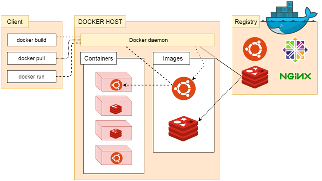

# Docker学习

参考：https://docs.docker.com

一次编译，到处运行

1.11->1.12里程碑版本

传统虚拟机


Hypervisor是一个虚拟化的操作系统，将底层server进行串联，合并成一个操作系统进行资源的分配


这里Hpervisor等价于VMware


传统的虚拟机技术的短板：

- 需要在Hpervisor建立的串联虚拟系统上再安装虚拟机，每个虚拟机上运行app，那么虚拟机大小资源大小就是app可以设置的大小
- 同时有些app不需要使用太多的资源，但是虚拟机配置了额外的资源，导致了资源的浪费
- 虚拟机也耗费系统的资源，增加了成本


docker


## 引擎

Docker 引擎是一个包含以下主要组件的客户端服务器应用程序。

- 一种服务器，它是一种称为守护进程并且长时间运行的程序。
- REST API用于指定程序可以用来与守护进程通信的接口，并指示它做什么。
- 一个有命令行界面 (CLI) 工具的客户端。


## 架构

Docker 使用客户端-服务器 (C/S) 架构模式，使用远程 API 来管理和创建 Docker 容器。

Docker 容器通过 Docker 镜像来创建。

容器与镜像的关系类似于面向对象编程中的对象与类。

| Docker | 面向对象 |
| :----- | :------- |
| 容器   | 对象     |
| 镜像   | 类       |




注意上图中的不同虚线一一对应的走向。

| 标题            | 说明                                                         |
| :-------------- | :----------------------------------------------------------- |
| 镜像(Images)    | Docker 镜像是用于创建 Docker 容器的模板。==镜像之间可以通过继承复用配置== |
| 容器(Container) | 容器是独立运行的一个或一组应用。                             |
| 客户端(Client)  | Docker 客户端通过命令行或者其他工具使用 Docker API (<https://docs.docker.com/reference/api/docker_remote_api>) 与 Docker 的守护进程通信。 |
| 主机(Host)      | 一个物理或者虚拟的机器用于执行 Docker 守护进程和容器。       |
| 仓库(Registry)  | Docker 仓库用来保存镜像，可以理解为代码控制中的代码仓库。Docker Hub([https://hub.docker.com](https://hub.docker.com/)) 提供了庞大的镜像集合供使用。 |
| Docker Machine  | Docker Machine是一个简化Docker安装的命令行工具，通过一个简单的命令行即可在相应的平台上安装Docker，比如VirtualBox、 Digital Ocean、Microsoft Azure。 |

分层存储

前一层构建是后一层的基础

## 镜像

我们都知道，操作系统分为内核和用户空间。对于 Linux 而言，内核启动后，会挂载 `root` 文件系统为其提供用户空间支持。而 Docker 镜像（Image），就相当于是一个 `root` 文件系统。比如官方镜像 `ubuntu:16.04` 就包含了完整的一套 Ubuntu 16.04 最小系统的 `root` 文件系统。

Docker 镜像是一个特殊的文件系统，除了提供容器运行时所需的程序、库、资源、配置等文件外，还包含了一些为运行时准备的一些配置参数（如匿名卷、环境变量、用户等）。镜像不包含任何动态数据，其内容在构建之后也不会被改变。

### 分层存储

因为镜像包含操作系统完整的 `root` 文件系统，其体积往往是庞大的，因此在 Docker 设计时，就充分利用 [Union FS](https://en.wikipedia.org/wiki/Union_mount) 的技术，将其设计为分层存储的架构。所以严格来说，镜像并非是像一个 ISO 那样的打包文件，镜像只是一个虚拟的概念，其实际体现并非由一个文件组成，而是由一组文件系统组成，或者说，由多层文件系统联合组成。

镜像构建时，会一层层构建，前一层是后一层的基础。每一层构建完就不会再发生改变，后一层上的任何改变只发生在自己这一层。比如，删除前一层文件的操作，实际不是真的删除前一层的文件，而是仅在当前层标记为该文件已删除。在最终容器运行的时候，虽然不会看到这个文件，但是实际上该文件会一直跟随镜像。因此，在构建镜像的时候，需要额外小心，每一层尽量只包含该层需要添加的东西，任何额外的东西应该在该层构建结束前清理掉。

分层存储的特征还使得镜像的复用、定制变的更为容易。甚至可以用之前构建好的镜像作为基础层，然后进一步添加新的层，以定制自己所需的内容，构建新的镜像。


## 容器

镜像（`Image`）和容器（`Container`）的关系，就像是面向对象程序设计中的 `类` 和 `实例` 一样，镜像是静态的定义，容器是镜像运行时的实体。容器可以被创建、启动、停止、删除、暂停等。

容器的实质是进程，但与直接在宿主执行的进程不同，容器进程运行于属于自己的独立的 [命名空间](https://en.wikipedia.org/wiki/Linux_namespaces)。因此容器可以拥有自己的 `root` 文件系统、自己的网络配置、自己的进程空间，甚至自己的用户 ID 空间。容器内的进程是运行在一个隔离的环境里，使用起来，就好像是在一个独立于宿主的系统下操作一样。这种特性使得容器封装的应用比直接在宿主运行更加安全。也因为这种隔离的特性，很多人初学 Docker 时常常会混淆容器和虚拟机。

前面讲过镜像使用的是分层存储，容器也是如此。每一个容器运行时，是以镜像为基础层，在其上创建一个当前容器的存储层，我们可以称这个为容器运行时读写而准备的存储层为**容器存储层**。

容器存储层的生存周期和容器一样，容器消亡时，容器存储层也随之消亡。因此，任何保存于容器存储层的信息都会随容器删除而丢失。

### 数据卷

按照 Docker 最佳实践的要求，容器不应该向其存储层内写入任何数据，容器存储层要保持无状态化。所有的文件写入操作，都应该使用 `数据卷（Volume）`、或者绑定宿主目录，在这些位置的读写会跳过容器存储层，直接对宿主（或网络存储）发生读写，其性能和稳定性更高。

传统虚拟机的方式对数据的处理，会有重复写的问题


## 仓库

类似于maven repository的服务器

镜像构建完成后，可以很容易的在当前宿主机上运行，但是，如果需要在其它服务器上使用这个镜像，我们就需要一个集中的存储、分发镜像的服务，`Docker Registry` 就是这样的服务。

一个 **Docker Registry** 中可以包含多个**仓库**（`Repository`）；每个仓库可以包含多个**标签**（`Tag`）；每个标签对应一个镜像。

通常，一个仓库会包含同一个软件不同版本的镜像，而标签就常用于对应该软件的各个版本。我们可以通过 `<仓库名>:<标签>` 的格式来指定具体是这个软件哪个版本的镜像。如果不给出标签，将以 `latest` 作为默认标签。

以 [Ubuntu 镜像](https://store.docker.com/images/ubuntu) 为例，`ubuntu` 是仓库的名字，其内包含有不同的版本标签，如，`14.04`, `16.04`。我们可以通过 `ubuntu:14.04`，或者 `ubuntu:16.04` 来具体指定所需哪个版本的镜像。如果忽略了标签，比如 `ubuntu`，那将视为 `ubuntu:latest`。

仓库名经常以 *两段式路径* 形式出现，比如 `jwilder/nginx-proxy`，前者往往意味着 Docker Registry 多用户环境下的用户名，后者则往往是对应的软件名。但这并非绝对，取决于所使用的具体 Docker Registry 的软件或服务

### 公有

Docker Registry 公开服务是开放给用户使用、允许用户管理镜像的 Registry 服务。一般这类公开服务允许用户免费上传、下载公开的镜像，并可能提供收费服务供用户管理私有镜像。

最常使用的 Registry 公开服务是官方的 [Docker Hub](https://hub.docker.com/)，这也是默认的 Registry，并拥有大量的高质量的官方镜像。除此以外，还有 [CoreOS](https://coreos.com/) 的 [Quay.io](https://quay.io/repository/)，CoreOS 相关的镜像存储在这里；Google 的 [Google Container Registry](https://cloud.google.com/container-registry/)，[Kubernetes](http://kubernetes.io/) 的镜像使用的就是这个服务。

由于某些原因，在国内访问这些服务可能会比较慢。国内的一些云服务商提供了针对 Docker Hub 的镜像服务（`Registry Mirror`），这些镜像服务被称为**加速器**。常见的有 [阿里云加速器](https://cr.console.aliyun.com/#/accelerator)、[DaoCloud 加速器](https://www.daocloud.io/mirror#accelerator-doc) 等。使用加速器会直接从国内的地址下载 Docker Hub 的镜像，比直接从 Docker Hub 下载速度会提高很多。

国内也有一些云服务商提供类似于 Docker Hub 的公开服务。比如 [时速云镜像仓库](https://hub.tenxcloud.com/)、[网易云镜像服务](https://c.163.com/hub#/m/library/)、[DaoCloud 镜像市场](https://hub.daocloud.io/)、[阿里云镜像库](https://cr.console.aliyun.com/) 等。


### 私有

除了使用公开服务外，用户还可以在本地搭建私有 Docker Registry。Docker 官方提供了 [Docker Registry](https://store.docker.com/images/registry/) 镜像，可以直接使用做为私有 Registry 服务。

开源的 Docker Registry 镜像只提供了 [Docker Registry API](https://docs.docker.com/registry/spec/api/) 的服务端实现，足以支持 `docker` 命令，不影响使用。但不包含图形界面，以及镜像维护、用户管理、访问控制等高级功能。在官方的商业化版本 [Docker Trusted Registry](https://docs.docker.com/datacenter/dtr/2.0/) 中，提供了这些高级功能。

除了官方的 Docker Registry 外，还有第三方软件实现了 Docker Registry API，甚至提供了用户界面以及一些高级功能。比如，[VMWare Harbor](https://github.com/vmware/harbor) 和 [Sonatype Nexus](https://www.sonatype.com/docker)。


## 安装

==警告：切勿在没有配置 Docker APT 源的情况下直接使用 apt 命令安装 Docker==

### 系统要求

Docker CE 支持以下版本的 [Ubuntu](https://www.ubuntu.com/server) 操作系统：

- Artful 17.10 (Docker CE 17.11 Edge +)
- Xenial 16.04 (LTS)
- Trusty 14.04 (LTS)

Docker CE 可以安装在 64 位的 x86 平台或 ARM 平台上。Ubuntu 发行版中，LTS（Long-Term-Support）长期支持版本，会获得 5 年的升级维护支持，这样的版本会更稳定，因此在生产环境中推荐使用 LTS 版本,当前最新的 LTS 版本为 Ubuntu 16.04

企业版Docker EE要钱

### 卸载旧版本

```sh
$ sudo apt-get remove docker \
               docker-engine \
               docker.io
```


### 使用脚本自动安装

```sh
$ curl -fsSL get.docker.com -o get-docker.sh
# 可能会出现 404 错误，请移步下面的特别说明
$ sudo sh get-docker.sh --mirror Aliyun
```

执行这个命令后，脚本就会自动的将一切准备工作做好，并且把 Docker CE 的 Edge 版本安装在系统中。

特别说明

2018 年 7 月 21 日，貌似阿里云这边在做调整，故导致 Docker 的 Aliyun 安装脚本不可用，是永久性还是临时性的尚不清除，如果你已经按照之前的操作安装 Docker，请按以下步骤进行修复并重新安装

- 如果已经使用了 Aliyun 脚本安装并成功的
  - 请先卸载 Docker，命令为：`apt-get autoremove docker-ce`
  - 删除 `/etc/apt/sources.list.d` 目录下的 `docker.list` 文件
- 使用 `AzureChinaCloud` 镜像脚本重新安装，命令为：`sudo sh get-docker.sh --mirror AzureChinaCloud`


### 传统APT安装

#### Ubuntu 14.04 可选内核模块

从 Ubuntu 14.04 开始，一部分内核模块移到了可选内核模块包 (`linux-image-extra-*`) ，以减少内核软件包的体积。正常安装的系统应该会包含可选内核模块包，而一些裁剪后的系统可能会将其精简掉。`AUFS` 内核驱动属于可选内核模块的一部分，作为推荐的 Docker 存储层驱动，一般建议安装可选内核模块包以使用 `AUFS`。

如果系统没有安装可选内核模块的话，可以执行下面的命令来安装可选内核模块包：

```bash
$ sudo apt-get update

$ sudo apt-get install \
    linux-image-extra-$(uname -r) \
    linux-image-extra-virtual
```

#### Ubuntu 16.04 +

Ubuntu 16.04 + 上的 Docker CE 默认使用 `overlay2` 存储层驱动,无需手动配置。

#### 使用 APT 安装

#### 安装必要的一些系统工具

```text
sudo apt-get update
sudo apt-get -y install apt-transport-https ca-certificates curl software-properties-common
```

#### 安装 GPG 证书

```text
curl -fsSL http://mirrors.aliyun.com/docker-ce/linux/ubuntu/gpg | sudo apt-key add -
```

#### 写入软件源信息

```text
sudo add-apt-repository "deb [arch=amd64] http://mirrors.aliyun.com/docker-ce/linux/ubuntu $(lsb_release -cs) stable"
```

#### 更新并安装 Docker CE

```text
sudo apt-get -y update
sudo apt-get -y install docker-ce
```

> 以上命令会添加稳定版本的 Docker CE APT 镜像源，如果需要最新或者测试版本的 Docker CE 请将 stable 改为 edge 或者 test。从 Docker 17.06 开始，edge test 版本的 APT 镜像源也会包含稳定版本的 Docker


### 查看版本

```sh
root@root:~# docker version
Client:
 Version:           18.09.6
 API version:       1.39 # 接口版本>1.12
 Go version:        go1.10.8
 Git commit:        481bc77
 Built:             Sat May  4 02:35:27 2019
 OS/Arch:           linux/amd64
 Experimental:      false

Server: Docker Engine - Community
 Engine:
  Version:          18.09.6
  API version:      1.39 (minimum version 1.12)
  Go version:       go1.10.8
  Git commit:       481bc77
  Built:            Sat May  4 01:59:36 2019
  OS/Arch:          linux/amd64
  Experimental:     false
```

可以发现docker安装后，本身==即是服务端又是客户端==


### 配置Docker镜像加速器

国内从 Docker Hub 拉取镜像有时会遇到困难，此时可以配置镜像加速器。Docker 官方和国内很多云服务商都提供了国内加速器服务，例如：

- [Docker 官方提供的中国 registry mirror](https://docs.docker.com/registry/recipes/mirror/#use-case-the-china-registry-mirror)
- [阿里云加速器](https://cr.console.aliyun.com/#/accelerator)
- [DaoCloud 加速器](https://www.daocloud.io/mirror#accelerator-doc)

我们以 Docker 官方加速器为例进行介绍。

#### Ubuntu 16.04+、Debian 8+、CentOS 7

对于使用 [systemd](https://www.freedesktop.org/wiki/Software/systemd/) 的系统，请在 `/etc/docker/daemon.json` 中写入如下内容（如果文件不存在请新建该文件）

```json
{
  "registry-mirrors": [
    "https://registry.docker-cn.com"
  ]
}
```

> 注意，一定要保证该文件符合 json 规范，否则 Docker 将不能启动。
> 可以登录阿里云加速器，获取私人镜像加速器网址 https://o2qwaqgd.mirror.aliyuncs.com 配置完成后重启服务


之后重新启动服务。

```bash
$ sudo systemctl daemon-reload
$ sudo systemctl restart docker
```


#### Windows 10

对于使用 Windows 10 的系统，在系统右下角托盘 Docker 图标内右键菜单选择 `Settings`，打开配置窗口后左侧导航菜单选择 `Daemon`。在 `Registry mirrors` 一栏中填写加速器地址 `https://registry.docker-cn.com`，之后点击 `Apply` 保存后 Docker 就会重启并应用配置的镜像地址了。

#### macOS

对于使用 macOS 的用户，在任务栏点击 Docker for mac 应用图标 -> Perferences... -> Daemon -> Registry mirrors。在列表中填写加速器地址 `https://registry.docker-cn.com`。修改完成之后，点击 `Apply & Restart` 按钮，Docker 就会重启并应用配置的镜像地址了。

#### 检查加速器是否生效

配置加速器之后，如果拉取镜像仍然十分缓慢，请手动检查加速器配置是否生效，在命令行执行 `docker info`，如果从结果中看到了如下内容，说明配置成功。

```bash
Registry Mirrors:
 https://registry.docker-cn.com/
```


## 镜像命令

Docker 运行容器前需要本地存在对应的镜像，如果本地不存在该镜像，Docker 会从镜像仓库下载该镜像。

本章将介绍更多关于镜像的内容，包括：

- 从仓库获取镜像；
- 管理本地主机上的镜像；
- 介绍镜像实现的基本原理。


### 获取镜像 docker pull


之前提到过，[Docker Hub](https://hub.docker.com/explore/) 上有大量的高质量的镜像可以用，这里我们就说一下怎么获取这些镜像。

从 Docker 镜像仓库获取镜像的命令是 `docker pull`。其命令格式为：

```sh
docker pull [选项] [Docker Registry 地址[:端口号]/]仓库名[:标签]
如：
docker pull ip:port/tomcat:latest # ip 和 port 是官方镜像，或者是加速器配置的ip与port
```

具体的选项可以通过 `docker pull --help` 命令看到，这里我们说一下镜像名称的格式。

- Docker 镜像仓库地址：地址的格式一般是 `<域名/IP>[:端口号]`。默认地址是 Docker Hub。
- 仓库名：如之前所说，这里的仓库名是两段式名称，即 `<用户名>/<软件名>`。对于 Docker Hub，如果不给出用户名，则默认为 `library`，也就是官方镜像

如

```sh
$ docker pull ubuntu:16.04
16.04: Pulling from library/ubuntu
bf5d46315322: Pull complete # 每一层进行下载，如果拉取其他镜像时，层id相同，那么可以直接跳过
9f13e0ac480c: Pull complete
e8988b5b3097: Pull complete
40af181810e7: Pull complete
e6f7c7e5c03e: Pull complete
Digest: sha256:147913621d9cdea08853f6ba9116c2e27a3ceffecf3b492983ae97c3d643fbbe
Status: Downloaded newer image for ubuntu:16.04
```

上面的命令中没有给出 Docker 镜像仓库地址，因此将会从 Docker Hub 获取镜像。而镜像名称是 `ubuntu:16.04`，因此将会获取官方镜像 `library/ubuntu` 仓库中标签为 `16.04` 的镜像。

从下载过程中可以看到我们之前提及的==分层存储==的概念，镜像是由多层存储所构成。下载也是一层层的去下载，并非单一文件。下载过程中给出了每一层的 ID 的前 12 位。并且下载结束后，给出该镜像完整的 `sha256` 的摘要，以确保下载一致性。

在使用上面命令的时候，你可能会发现，你所看到的层 ID 以及 `sha256` 的摘要和这里的不一样。这是因为官方镜像是一直在维护的，有任何新的 bug，或者版本更新，都会进行修复再以原来的标签发布，这样可以确保任何使用这个标签的用户可以获得更安全、更稳定的镜像。


示例：拉取tomcat

```sh
docker pull tomcat
#拉取完成后测试运行
root@root:~# docker run -p 8080:8080 tomcat
```

默认拉取最新的版本latest，当前是8.5，可以在Docker Hub上查看


同样可以拉取指定版本

```sh
docker pull tomcat:9-jre8
```


### 运行镜像 docker run

有了镜像后，我们就能够以这个镜像为基础启动并运行一个容器。以上面的 `ubuntu:16.04` 为例，如果我们打算启动里面的 `bash` 并且进行交互式操作的话，可以执行下面的命令。

```sh
$ docker run -it --rm \ # \ 表示换行
    ubuntu:16.04 \
    bash

root@e7009c6ce357:/# cat /etc/os-release
NAME="Ubuntu"
VERSION="16.04.4 LTS, Trusty Tahr"
ID=ubuntu
ID_LIKE=debian
PRETTY_NAME="Ubuntu 16.04.4 LTS"
VERSION_ID="16.04"
HOME_URL="http://www.ubuntu.com/"
SUPPORT_URL="http://help.ubuntu.com/"
BUG_REPORT_URL="http://bugs.launchpad.net/ubuntu/"
```

`docker run` 就是运行容器的命令，我们这里简要的说明一下上面用到的参数。

- `-it`：这是两个参数，一个是 `-i`：交互式操作，一个是 `-t` 终端。我们这里打算进入 `bash` 执行一些命令并查看返回结果，因此我们需要交互式终端。
- `--rm`：这个参数是说容器退出后随之将其删除。默认情况下，为了排障需求，退出的容器并不会立即删除，除非手动 `docker rm`。我们这里只是随便执行个命令，看看结果，不需要排障和保留结果，因此使用 `--rm` 可以避免浪费空间。
- `ubuntu:16.04`：这是指用 `ubuntu:16.04` 镜像为基础来启动容器。
- `bash`：放在镜像名后的是**命令**，这里我们希望有个交互式 Shell，因此用的是 `bash`。

进入容器后，我们可以在 Shell 下操作，执行任何所需的命令。这里，我们执行了 `cat /etc/os-release`，这是 Linux 常用的查看当前系统版本的命令，从返回的结果可以看到容器内是 `Ubuntu 16.04.4 LTS` 系统。

最后我们通过 `exit` 退出了这个容器。

在其他客户端执行命令

```sh
docker ps -a # 查看所有容器
docker ps # 查看正在运行的容器
# 在不点击exit可以看到ubuntu容器的存在
```

docker特点

- 沙箱机制
- 隔离机制

- 镜像产生的各个容器之间互不影响，容器的损坏和异常不会影响其他容器
- 满足了高可用特性，多个app容器不会相互影响

