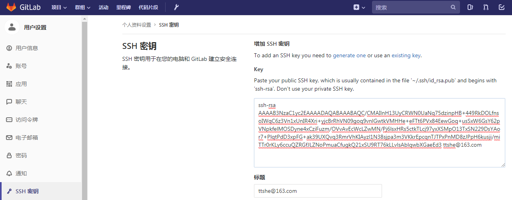
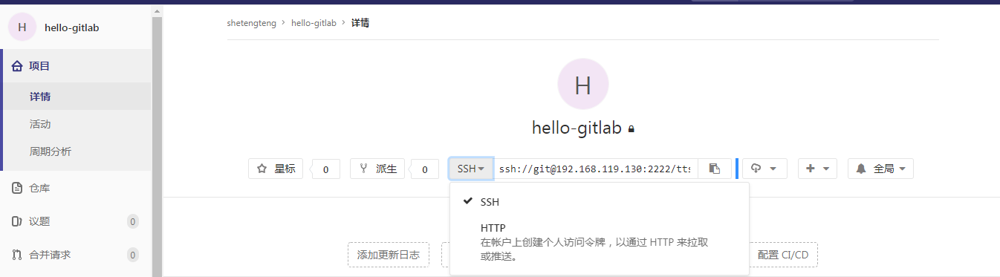

# GitLab 使用

安装Git

操作Git

…

## 安装GitLab

下载中文社区版 https://hub.docker.com/r/twang2218/gitlab-ce-zh

注意gitLab运行环境至少2G内存

```sh
version: '3'
services:
    web:
      image: 'twang2218/gitlab-ce-zh:10.5' # 后面的版本号，不填写使用最新版本
      restart: always
      hostname: '192.168.75.145'
      environment:
        TZ: 'Asia/Shanghai'
        GITLAB_OMNIBUS_CONFIG: |
          external_url 'http://192.168.75.145:8080'
          gitlab_rails['gitlab_shell_ssh_port'] = 2222
          unicorn['port'] = 8888
          nginx['listen_port'] = 8080
      ports:
        - '8080:8080'
        - '8443:443'
        - '2222:22'
      volumes:
        - /usr/local/docker/gitlab/config:/etc/gitlab
        - /usr/local/docker/gitlab/data:/var/opt/gitlab
        - /usr/local/docker/gitlab/logs:/var/log/gitlab
```


## 使用SSH的方式拉取推送项目

用途：为了之后的持续集成做准备

生成SSH-KEY，在D:\Program Files\Git\usr\bin

```sh
ssh-keygen -t rsa -C "your_email@example.com"
ssh-keygen -t rsa -C "ttshe@163.com"
```

生成结果

```sh
Microsoft Windows [版本 6.1.7601]
版权所有 (c) 2009 Microsoft Corporation。保留所有权利。
D:\Program Files\Git\usr\bin>ssh-keygen -t rsa -C "ttshe@163.com"
Generating public/private rsa key pair.
Enter file in which to save the key (/c/Users/Administrator/.ssh/id_rsa):
Enter passphrase (empty for no passphrase):
Enter same passphrase again:
Your identification has been saved in /c/Users/Administrator/.ssh/id_rsa.
Your public key has been saved in /c/Users/Administrator/.ssh/id_rsa.pub.
The key fingerprint is:
SHA256:Aj2NrnF0vqD4ZH0t/MBbLpxpuxUBlDWkSFQ65KHBYa8 ttshe@163.com
The key's randomart image is:
+---[RSA 2048]----+
|   .+o=o+++      |
|   ..O *.o .     |
|    o @ + .      |
|     = =   .     |
|    E = S .      |
|   . * = o .     |
|  . = ..Bo+      |
|   +   .*O       |
|    .  .++o      |
+----[SHA256]-----+
D:\Program Files\Git\usr\bin>
```

秘钥位置在：`C:\Users\你的用户名\.ssh` 目录下，找到 `id_rsa.pub` 并使用编辑器打开，如：

```text
ssh-rsa AAAAB3NzaC1yc2EAAAADAQABAAABAQC/CMAIlnH13UyCRWN0UaNq75dzinpHB+449RkDOLfnsoIWqC6z3Vn1xUnIR4Xri+yjcBrRhVN09goq9vnlGwtkVMHHe+eFTt6PVx84EewGoq+usSxW6GsY62pVNpkfelMOSDyne4xCziFuzm/OVvAvEcWcLZwMN/Pj6lsxHRs5ctkTLcj97yxXSMpO13TxSN229DsYAor7+PlqtPdD3xpFG+ak39UXQvq3RmrVhKIAyzl1N38sjpa3m3VKkrEpcqnTJTPxPnMD8zJPpH6kusji/miTTr0rKLy6ccuQZRGfJLZNoPmuaCfugkQ21xSU9RT76kLLvlsAblqwbXGaeEd3 ttshe@163.com
```

在服务器上配置公钥

登录 GitLab，点击“用户头像”-->“设置”-->“SSH 密钥”



在项目上设置SSH的方式访问



重新clone项目，然后可以免密推送了

