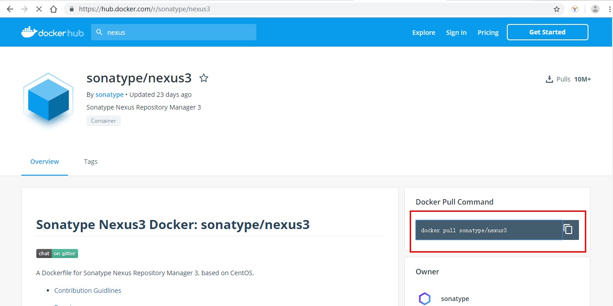
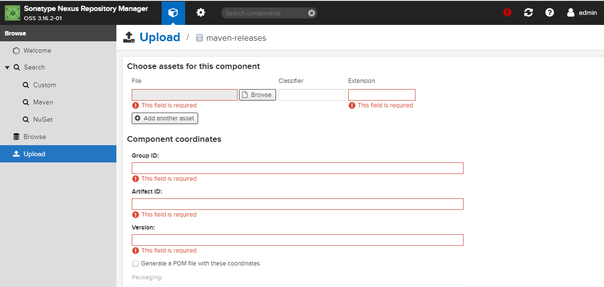
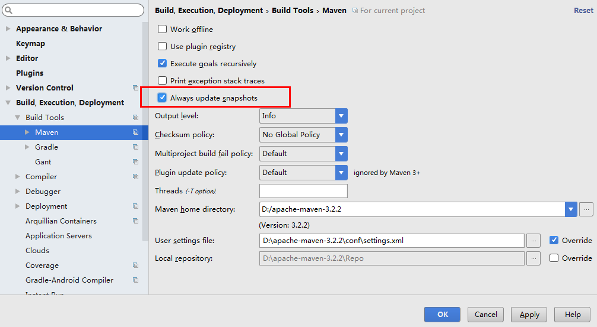

# Nexus学习

Nexus 是一个强大的仓库管理器，极大地简化了内部仓库的维护和外部仓库的访问。

2016 年 4 月 6 日 Nexus 3.0 版本发布，相较 2.x 版本有了很大的改变：

- 对低层代码进行了大规模重构，提升性能，增加可扩展性以及改善用户体验。
- 升级界面，极大的简化了用户界面的操作和管理。
- 提供新的安装包，让部署更加简单。
- 增加对 Docker, NeGet, npm, Bower 的支持。
- 提供新的管理接口，以及增强对自动任务的管理。

- 阿里云私服镜像
  - https://maven.aliyun.com/mvn/view
  - 可以上传自己的jar包




## 安装

拉取镜像

```sh
docker pull sonatype/nexus3
```

docker-compose.yml

```sh
version: '3.1'
services:
  nexus:
    restart: always
    image: sonatype/nexus3
    container_name: nexus
    ports:
      - 8081:8081
    volumes:
      - /usr/local/docker/nexus/data:/nexus-data
```

- 启动时如果出现权限问题可以使用：`chmod 777 /usr/local/docker/nexus/data` 赋予数据卷目录可读可写的权限，如创建文件失败（nexus    | Unable to update instance pid: Unable to create directory /nexus-data/instances）
- 注意配置2G内存，否则启动较慢
- 访问http://192.168.119.133:8081/

- 默认用户名admin，密码admin123


## 使用

私服的好处：项目拉取jar包顺序> 本地 > 私服 > 官服

- 私服没有的jar包从官服获取，再从私服下载给本地


### 配置

#### 认证信息

在settings.xml中配置Nexus认证信息，在servers节点下

```sh
<server>
  <id>nexus-releases</id>
  <username>admin</username>
  <password>admin123</password>
</server>

<server>
  <id>nexus-snapshots</id>
  <username>admin</username>
  <password>admin123</password>
</server>
```


#### 自动化部署

在pom.xml中添加配置（一般在父pom中添加）

```sh
<distributionManagement>  
  <repository>  
    <id>nexus-releases</id>  
    <name>Nexus Release Repository</name>  
    <url>http://127.0.0.1:8081/repository/maven-releases/</url>  
  </repository>  
  <snapshotRepository>  
    <id>nexus-snapshots</id>  
    <name>Nexus Snapshot Repository</name>  
    <url>http://127.0.0.1:8081/repository/maven-snapshots/</url>  
  </snapshotRepository>  
</distributionManagement> 
```

注意

- ID 名称必须要与 `settings.xml` 中 Servers 配置的 ID 名称保持一致。
- 项目版本号中有 `SNAPSHOT` 标识的，会发布到 Nexus Snapshots Repository, 否则发布到 Nexus Release Repository，并根据 ID 去匹配授权账号。


#### 代理仓库

配置代理仓库后，从代理仓库拉取jar包，代理仓库没有该jar包则从官服拉取后返回给代理服务器，再由代理服务给本地服务

```sh
<repositories>
    <repository>
        <id>nexus</id>
        <name>Nexus Repository</name>
        <url>http://127.0.0.1:8081/repository/maven-public/</url>
        <snapshots>
            <enabled>true</enabled>
        </snapshots>
        <releases>
            <enabled>true</enabled>
        </releases>
    </repository>
</repositories>
<pluginRepositories>
    <pluginRepository>
        <id>nexus</id>
        <name>Nexus Plugin Repository</name>
        <url>http://127.0.0.1:8081/repository/maven-public/</url>
        <snapshots>
            <enabled>true</enabled>
        </snapshots>
        <releases>
            <enabled>true</enabled>
        </releases>
    </pluginRepository>
</pluginRepositories>
```


### 上传第三方jar包

Nexus 3.13之前的版本 不支持页面上传，可使用 maven 命令：

如第三方JAR包：aliyun-sdk-oss-2.2.3.jar

```text
mvn deploy:deploy-file -DgroupId=com.aliyun.oss -DartifactId=aliyun-sdk-oss -Dversion=2.2.3 -Dpackaging=jar -Dfile=D:\aliyun-sdk-oss-2.2.3.jar -Durl=http://127.0.0.1:8081/repository/maven-3rd/ -DrepositoryId=nexus-releases
```

注意

- 配置MAVEN_HOME

- 建议在上传第三方 JAR 包时，创建单独的第三方 JAR 包管理仓库，便于管理有维护。（maven-3rd）
- `-DrepositoryId=nexus-releases` 对应的是 `settings.xml` 中 Servers 配置的 ID 名称。（授权）

在3.13之后的版本支持




### Snapshots 与 Releases 的区别

- nexus-releases: 用于发布 Release 版本
- nexus-snapshots: 用于发布 Snapshot 版本（快照版）

Release 版本与 Snapshot 定义如下：

```text
Release: 1.0.0/1.0.0-RELEASE
Snapshot: 1.0.0-SNAPSHOT
```

- 在项目 `pom.xml` 中设置的版本号添加 `SNAPSHOT` 标识的都会发布为 `SNAPSHOT` 版本，没有 `SNAPSHOT` 标识的都会发布为 `RELEASE` 版本。
- `SNAPSHOT` 版本会自动加一个时间作为标识，如：`1.0.0-SNAPSHOT` 发布后为变成 `1.0.0-SNAPSHOT-20180522.123456-1.jar`
- ==快照版本在被他人修改上传后，本地会有提示是否更新使用，提升开发效率，当版本稳定后，改为release版本==
- 快照版本可以多次上传，发布版本只能发布一次，再次发布必须更改版本号
- 需要开启自动更新

