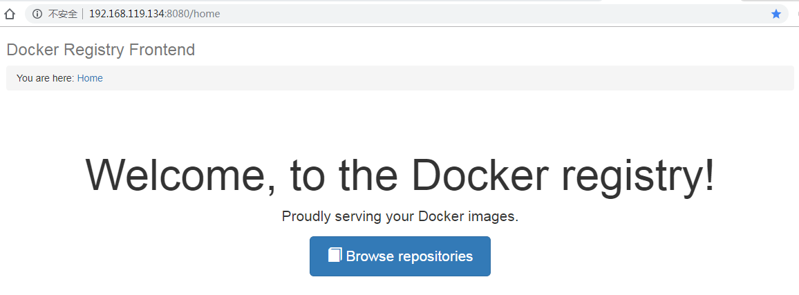

# Registry 学习

官方的 Docker Hub 是一个用于管理公共镜像的地方，我们可以在上面找到我们想要的镜像，也可以把我们自己的镜像推送上去。但是，有时候我们的服务器无法访问互联网，或者你不希望将自己的镜像放到公网当中，那么你就需要 Docker Registry，它可以用来存储和管理自己的镜像


## 安装

### 服务端

docker-compose.yml文件

```sh
version: '3.1'
services:
  registry:
    image: registry
    restart: always
    container_name: registry
    ports:
      - 5000:5000
    volumes:
      - /usr/local/docker/registry/data:/var/lib/registry
```

访问：返回{} 表示成功

http://192.168.119.134:5000/v2/


### 客户端

单独起一个虚拟机部署

使用Ubuntu Server 16.04 LTS 版本，属于 `systemd` 系统，需要在 `/etc/docker/daemon.json` 中增加如下内容（如果文件不存在请新建该文件）

```sh
{
  "registry-mirrors": [
    "https://registry.docker-cn.com"
  ],
  "insecure-registries": [
    "ip:5000"
  ]
}
```

之后重新启动服务。

```sh
$ sudo systemctl daemon-reload
$ sudo systemctl restart docker
```

检查是否成功

```sh
root@root:/etc/docker# docker info

Insecure Registries:
 192.168.119.134:5000
 127.0.0.0/8
```


#### 镜像上传测试

使用tomcat拉取测试

```sh
# 拉取一个镜像
docker pull tomcat

## 查看全部镜像
docker images

## 标记本地镜像并指向目标仓库（ip:port/image_name:tag，该格式为标记版本号）
docker tag tomcat 192.168.119.134:5000/tomcat

## 提交镜像到仓库
docker push 192.168.119.134:5000/tomcat
```

查看registry镜像是否上传成功

```sh
curl -XGET http://192.168.119.134:5000/v2/_catalog
{"repositories":["tomcat"]}
```

查看指定镜像

```sh
curl -XGET http://192.168.119.134:5000/v2/tomcat/tags/list
```

测试拉取镜像，先删除原有的，再拉取

```sh
docker rmi tomcat
docker rmi 192.168.119.134:5000/tomcat
docker pull 192.168.119.134:5000/tomcat
```


### 安装服务端UI

有2种UI，操作类似

- [docker-registry-frontend](https://github.com/kwk/docker-registry-frontend)
- [docker-registry-web](https://hub.docker.com/r/hyper/docker-registry-web/)

#### docker-registry-frontend

在docker-registry是上安装，docker-compose.yml如下

```sh
version: '3.1'
services:
  frontend:
    image: konradkleine/docker-registry-frontend:v2
    ports:
      - 8080:80
    volumes:
      - ./certs/frontend.crt:/etc/apache2/server.crt:ro
      - ./certs/frontend.key:/etc/apache2/server.key:ro
    environment:
      - ENV_DOCKER_REGISTRY_HOST=192.168.119.134
      - ENV_DOCKER_REGISTRY_PORT=5000
```

可以将docker-registry的docker-compose.yml文件和该yml合并，变成一个项目

```sh
version: '3.1'
services:
  registry:
    image: registry
    restart: always
    container_name: registry
    ports:
      - 5000:5000
    volumes:
      - /usr/local/docker/registry/data:/var/lib/registry

  frontend:
    image: konradkleine/docker-registry-frontend:v2
    ports:
      - 8080:80
    volumes:
      - ./certs/frontend.crt:/etc/apache2/server.crt:ro
      - ./certs/frontend.key:/etc/apache2/server.key:ro
    environment:
      - ENV_DOCKER_REGISTRY_HOST=192.168.119.134
      - ENV_DOCKER_REGISTRY_PORT=5000
```



# 综合练习

- 上传代码到gitLab上

- 在docker-deploy上使用git
  - 虚拟机默认安装了git
  - 使用SSH免密登录，生成公钥进行配置

- 安装maven进行编译打包

  - 拷贝maven的jar包到/usr/local/maven目录下

  ```sh
  root@root:/usr/local/maven# ll
  total 8932
  drwxr-xr-x  2 root root    4096 Jun 24 16:35 ./
  drwxr-xr-x 11 root root    4096 Jun 24 16:34 ../
  -rw-r--r--  1 root root 9136463 Jun 16 09:15 apache-maven-3.6.1-bin.tar.gz
  ```

  - 解压，后期移动了目录到local下，删除了maven目录

  ```shell
  root@root:/usr/local/maven# tar -zxvf apache-maven-3.6.1-bin.tar.gz
  ```

  - 配置环境变量
    - maven依赖java，需要安装java
    - 打开/etc/profile添加如下
    
    ```sh
        fi
      fi
      # 增加如下配置 -----
      export MAVEN_HOME=/usr/local/apache-maven-3.6.1
      export JAVA_HOME=/usr/local/jdk1.8.0_152
      export JRE_HOME=/usr/local/jdk1.8.0_152/jre
      export CLASSPATH=$CLASSPATH:$JAVA_HOME/lib:$JAVA_HOME/jre/lib
      export PATH=$JAVA_HOME/bin:$JAVA_HOME/jre/bin:$MAVEN_HOME/bin:$PATH:$HOME/bin
      # -------
      if [ -d /etc/profile.d ]; then
        for i in /etc/profile.d/*.sh; do
    ```
    
    - 重置配置
    
    ```shell
    root@root:/usr/local# source /etc/profile
    ```
    
    - 测试
    
    ```sh
    java -version
    mvn -v
    ```
    
  - 使用mvn命令打包
  
  ```sh
  mvn clean package -Dmaven.test.skip=true
  ```
  
  - maven的默认仓库在~/.m2/repository下
  
- 使用git拉取代码，注意配置SSH

- 在拉取的项目中建立image文件夹，编写Dockerfile文件

- 将项目编译成镜像上传到registry

