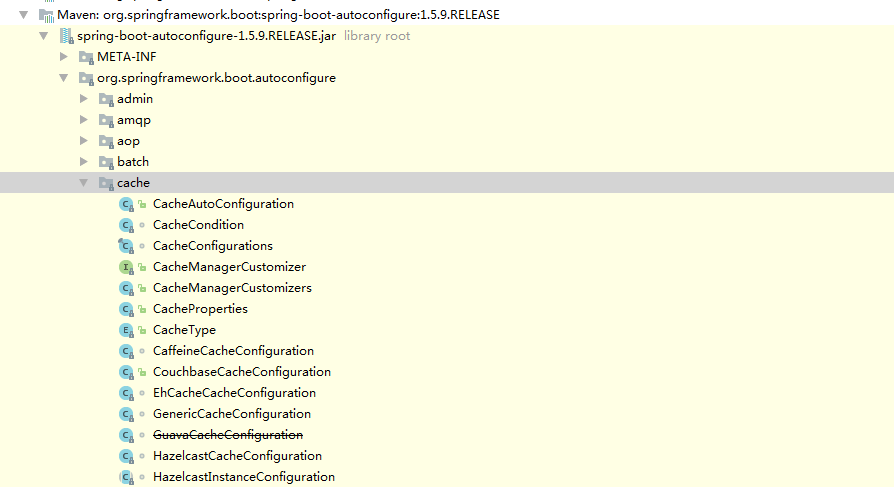
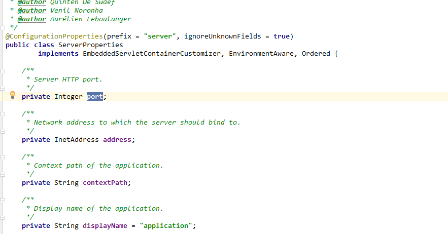
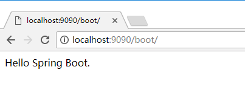

# SpringBoot 学习

使用“习惯优于配置”（项目中存在大量的配置，此外还内置了一个习惯性的配置，让你无需手动进行配置）的理念让你的项目快速的运行起来。使用 Spring Boot 很容易创建一个独立运行（运行 Jar，内嵌 Servlet 容器）准生产级别的基于 Spring 框架的项目，使用 Spring Boot 你可以不用或者只需很少的 Spring 配置

## 概述

- 优点
  - 快速构建项目
  - 对主流开发框架的无配置集成
  - 项目可独立运行，无需外部依赖 Servlet 容器
  - 提供运行时的应用监控
  - 极大地提高了开发、部署效率
  - 与云计算的天然集成

- 缺点

  - 版本迭代速度很快，一些模块改动很大
  - 由于不用自己做配置，报错时很难定位
  - 网上现成的解决方案比较少

  

## 测试


```sh
package com.funtl.hello.spring.boot;

import org.junit.Before;
import org.junit.Test;
import org.junit.runner.RunWith;
import org.springframework.beans.factory.annotation.Autowired;
import org.springframework.boot.test.context.SpringBootTest;
import org.springframework.boot.test.web.client.TestRestTemplate;
import org.springframework.boot.web.server.LocalServerPort;
import org.springframework.http.ResponseEntity;
import org.springframework.test.context.junit4.SpringRunner;

import java.net.URL;

import static org.hamcrest.CoreMatchers.equalTo;
import static org.junit.Assert.assertThat;

@RunWith(SpringRunner.class)
// 读取application.yml配置
@SpringBootTest(classes = HelloSpringBootApplication.class, webEnvironment = SpringBootTest.WebEnvironment.RANDOM_PORT)
public class HelloSpringBootApplicationTests {

    @LocalServerPort
    private int port;

    private URL base;

    @Autowired
    private TestRestTemplate template;

    @Before
    public void setUp() throws Exception {
        this.base = new URL("http://localhost:" + port + "/");
    }

    @Test
    public void contextLoads() {
        ResponseEntity<String> response = template.getForEntity(base.toString(), String.class);
        assertThat(response.getBody(), equalTo("Hello Spring Boot"));
    }

}
```


## 常用配置

可以在spring-boot-autoconfigure下查看常用配置



查看web下的serverProperties.java配置




Spring Boot 项目使用一个全局的配置文件 `application.properties` 或者是 `application.yml`，在 `resources` 目录下或者类路径下的 `/config` 下，一般我们放到 `resources` 下。

修改 Tomcat 的端口为 9090，并将默认的访问路径 "/" 修改为 "boot"，可以在 `application.properties`中添加：

```text
server.port=9090
server.context-path=/boot
```


或在 application.yml 中添加：

```text
server:
  port: 9090
  context-path: /boot
```


测试效果：


### 日志配置

Spring Boot 对各种日志框架都做了支持，我们可以通过配置来修改默认的日志的配置

默认情况下，Spring Boot 使用 Logback 作为日志框架

```sh
logging:
  file: ../logs/spring-boot-hello.log
  level.org.springframework.web: DEBUG
```


### 关闭特定的配置

关闭特定的自动配置使用 `@SpringBootApplication` 注解的 `exclude` 参数即可，这里以关闭数据源的自动配置为例

```java
@SpringBootApplication(exclude = {DataSourceAutoConfiguration.class})
```


## 整合Mybatis

### pom

添加依赖

```sh
<dependency>
    <groupId>com.alibaba</groupId>
    <artifactId>druid-spring-boot-starter</artifactId>
    <version>1.1.10</version>
</dependency>

<dependency>
    <groupId>mysql</groupId>
    <artifactId>mysql-connector-java</artifactId>
    <scope>runtime</scope>
</dependency>
```


### yml

```sh
spring:
  datasource:
    druid:
      url: jdbc:mysql://ip:port/dbname?useUnicode=true&characterEncoding=utf-8&useSSL=false
      username: root
      password: 123456
      initial-size: 1
      min-idle: 1
      max-active: 20
      test-on-borrow: true
      # MySQL 8.x: com.mysql.cj.jdbc.Driver
      driver-class-name: com.mysql.jdbc.Driver
```


### 插件

#### 配置tk.mybatis

```sh
<dependency>
    <groupId>tk.mybatis</groupId>
    <artifactId>mapper-spring-boot-starter</artifactId>
    <version>2.0.2</version>
</dependency>
```

#### 配置分页插件

PageHelper 是 Mybatis 的分页插件，支持多数据库、多数据源。可以简化数据库的分页查询操作，整合过程也极其简单，只需引入依赖即可

```sh
<dependency>
    <groupId>com.github.pagehelper</groupId>
    <artifactId>pagehelper-spring-boot-starter</artifactId>
    <version>1.2.5</version>
</dependency>
```

#### 配置自动生成mapper插件

```sh
    <plugins>
        <plugin>
            <groupId>org.mybatis.generator</groupId>
            <artifactId>mybatis-generator-maven-plugin</artifactId>
            <version>1.3.5</version>
            <configuration>
                <configurationFile>${basedir}/src/main/resources/generator/generatorConfig.xml</configurationFile>
                <overwrite>true</overwrite>
                <verbose>true</verbose>
            </configuration>
            <dependencies>
                <dependency>
                    <groupId>mysql</groupId>
                    <artifactId>mysql-connector-java</artifactId>
                    <version>${mysql.version}</version>
                </dependency>
                <dependency>
                    <groupId>tk.mybatis</groupId>
                    <artifactId>mapper</artifactId>
                    <version>3.4.4</version>
                </dependency>
            </dependencies>
        </plugin>
    </plugins>
</build>
```

配置generatorConfig.xml

在 `src/main/resources/generator/` 目录下创建 `generatorConfig.xml` 配置文件：

```sh
<?xml version="1.0" encoding="UTF-8"?>
<!DOCTYPE generatorConfiguration
        PUBLIC "-//mybatis.org//DTD MyBatis Generator Configuration 1.0//EN"
        "http://mybatis.org/dtd/mybatis-generator-config_1_0.dtd">

<generatorConfiguration>
    <!-- 引入数据库连接配置 -->
    <properties resource="jdbc.properties"/>

    <context id="Mysql" targetRuntime="MyBatis3Simple" defaultModelType="flat">
        <property name="beginningDelimiter" value="`"/>
        <property name="endingDelimiter" value="`"/>
        
        <!-- 配置 tk.mybatis 插件 -->
        <plugin type="tk.mybatis.mapper.generator.MapperPlugin">
            <property name="mappers" value="com.funtl.utils.MyMapper"/>
        </plugin>

        <!-- 配置数据库连接 -->
        <jdbcConnection
                driverClass="${jdbc.driverClass}"
                connectionURL="${jdbc.connectionURL}"
                userId="${jdbc.username}"
                password="${jdbc.password}">
        </jdbcConnection>

        <!-- 配置实体类存放路径 -->
        <javaModelGenerator targetPackage="com.funtl.hello.spring.boot.entity" targetProject="src/main/java"/>

        <!-- 配置 XML 存放路径 -->
        <sqlMapGenerator targetPackage="mapper" targetProject="src/main/resources"/>

        <!-- 配置 DAO 存放路径 -->
        <javaClientGenerator
                targetPackage="com.funtl.hello.spring.boot.mapper"
                targetProject="src/main/java"
                type="XMLMAPPER"/>

        <!-- 配置需要指定生成的数据库和表，% 代表所有表 -->
        <table catalog="myshop" tableName="%">
            <!-- mysql 配置 -->
            <generatedKey column="id" sqlStatement="Mysql" identity="true"/>
        </table>
    </context>
</generatorConfiguration>
```

配置数据源

在 `src/main/resources` 目录下创建 `jdbc.properties` 数据源配置：

```sh
# MySQL 8.x: com.mysql.cj.jdbc.Driver
jdbc.driverClass=com.mysql.jdbc.Driver
jdbc.connectionURL=jdbc:mysql://ip:port/dbname?useUnicode=true&characterEncoding=utf-8&useSSL=false
jdbc.username=root
jdbc.password=123456
```

命令

```sh
mvn mybatis-generator:generate
```

完全配置参数

<http://www.mybatis.org/generator/usage/mysql.html>

```sh
<?xml version="1.0" encoding="UTF-8"?>
<!DOCTYPE generatorConfiguration
  PUBLIC "-//mybatis.org//DTD MyBatis Generator Configuration 1.0//EN"
"http://mybatis.org/dtd/mybatis-generator-config_1_0.dtd">
<!-- 配置生成器 -->
<generatorConfiguration>
<!-- 可以用于加载配置项或者配置文件，在整个配置文件中就可以使用${propertyKey}的方式来引用配置项
    resource：配置资源加载地址，使用resource，MBG从classpath开始找，比如com/myproject/generatorConfig.properties        
    url：配置资源加载地质，使用URL的方式，比如file:///C:/myfolder/generatorConfig.properties.
    注意，两个属性只能选址一个;
    另外，如果使用了mybatis-generator-maven-plugin，那么在pom.xml中定义的properties都可以直接在generatorConfig.xml中使用
<properties resource="" url="" />
 -->
 
 <!-- 在MBG工作的时候，需要额外加载的依赖包
     location属性指明加载jar/zip包的全路径
<classPathEntry location="/Program Files/IBM/SQLLIB/java/db2java.zip" />
  -->
 
<!-- 
    context:生成一组对象的环境 
    id:必选，上下文id，用于在生成错误时提示
    defaultModelType:指定生成对象的样式
        1，conditional：类似hierarchical；
        2，flat：所有内容（主键，blob）等全部生成在一个对象中；
        3，hierarchical：主键生成一个XXKey对象(key class)，Blob等单独生成一个对象，其他简单属性在一个对象中(record class)
    targetRuntime:
        1，MyBatis3：默认的值，生成基于MyBatis3.x以上版本的内容，包括XXXBySample；
        2，MyBatis3Simple：类似MyBatis3，只是不生成XXXBySample；
    introspectedColumnImpl：类全限定名，用于扩展MBG
-->
<context id="mysql" defaultModelType="hierarchical" targetRuntime="MyBatis3Simple" >
 
    <!-- 自动识别数据库关键字，默认false，如果设置为true，根据SqlReservedWords中定义的关键字列表；
        一般保留默认值，遇到数据库关键字（Java关键字），使用columnOverride覆盖
     -->
    <property name="autoDelimitKeywords" value="false"/>
    <!-- 生成的Java文件的编码 -->
    <property name="javaFileEncoding" value="UTF-8"/>
    <!-- 格式化java代码 -->
    <property name="javaFormatter" value="org.mybatis.generator.api.dom.DefaultJavaFormatter"/>
    <!-- 格式化XML代码 -->
    <property name="xmlFormatter" value="org.mybatis.generator.api.dom.DefaultXmlFormatter"/>
 
    <!-- beginningDelimiter和endingDelimiter：指明数据库的用于标记数据库对象名的符号，比如ORACLE就是双引号，MYSQL默认是`反引号； -->
    <property name="beginningDelimiter" value="`"/>
    <property name="endingDelimiter" value="`"/>
 
    <!-- 必须要有的，使用这个配置链接数据库
        @TODO:是否可以扩展
        # MySQL 8.x: com.mysql.cj.jdbc.Driver
     -->
    <jdbcConnection driverClass="com.mysql.jdbc.Driver" connectionURL="jdbc:mysql:///pss" userId="root" password="admin">
        <!-- 这里面可以设置property属性，每一个property属性都设置到配置的Driver上 -->
    </jdbcConnection>
 
    <!-- java类型处理器 
        用于处理DB中的类型到Java中的类型，默认使用JavaTypeResolverDefaultImpl；
        注意一点，默认会先尝试使用Integer，Long，Short等来对应DECIMAL和 NUMERIC数据类型； 
    -->
    <javaTypeResolver type="org.mybatis.generator.internal.types.JavaTypeResolverDefaultImpl">
        <!-- 
            true：使用BigDecimal对应DECIMAL和 NUMERIC数据类型
            false：默认,
                scale>0;length>18：使用BigDecimal;
                scale=0;length[10,18]：使用Long；
                scale=0;length[5,9]：使用Integer；
                scale=0;length<5：使用Short；
         -->
        <property name="forceBigDecimals" value="false"/>
    </javaTypeResolver>
 
 
    <!-- java模型创建器，是必须要的元素
        负责：1，key类（见context的defaultModelType）；2，java类；3，查询类
        targetPackage：生成的类要放的包，真实的包受enableSubPackages属性控制；
        targetProject：目标项目，指定一个存在的目录下，生成的内容会放到指定目录中，如果目录不存在，MBG不会自动建目录
     -->
    <javaModelGenerator targetPackage="com._520it.mybatis.domain" targetProject="src/main/java">
        <!--  for MyBatis3/MyBatis3Simple
            自动为每一个生成的类创建一个构造方法，构造方法包含了所有的field；而不是使用setter；
         -->
        <property name="constructorBased" value="false"/>
 
        <!-- 在targetPackage的基础上，根据数据库的schema再生成一层package，最终生成的类放在这个package下，默认为false -->
        <property name="enableSubPackages" value="true"/>
 
        <!-- for MyBatis3 / MyBatis3Simple
            是否创建一个不可变的类，如果为true，
            那么MBG会创建一个没有setter方法的类，取而代之的是类似constructorBased的类
         -->
        <property name="immutable" value="false"/>
 
        <!-- 设置一个根对象，
            如果设置了这个根对象，那么生成的keyClass或者recordClass会继承这个类；在Table的rootClass属性中可以覆盖该选项
            注意：如果在key class或者record class中有root class相同的属性，MBG就不会重新生成这些属性了，包括：
                1，属性名相同，类型相同，有相同的getter/setter方法；
         -->
        <property name="rootClass" value="com._520it.mybatis.domain.BaseDomain"/>
 
        <!-- 设置是否在getter方法中，对String类型字段调用trim()方法 -->
        <property name="trimStrings" value="true"/>
    </javaModelGenerator>
 
 
    <!-- 生成SQL map的XML文件生成器，
        注意，在Mybatis3之后，我们可以使用mapper.xml文件+Mapper接口（或者不用mapper接口），
            或者只使用Mapper接口+Annotation，所以，如果 javaClientGenerator配置中配置了需要生成XML的话，这个元素就必须配置
        targetPackage/targetProject:同javaModelGenerator
     -->
    <sqlMapGenerator targetPackage="com._520it.mybatis.mapper" targetProject="src/main/resources">
        <!-- 在targetPackage的基础上，根据数据库的schema再生成一层package，最终生成的类放在这个package下，默认为false -->
        <property name="enableSubPackages" value="true"/>
    </sqlMapGenerator>
 
 
    <!-- 对于mybatis来说，即生成Mapper接口，注意，如果没有配置该元素，那么默认不会生成Mapper接口 
        targetPackage/targetProject:同javaModelGenerator
        type：选择怎么生成mapper接口（在MyBatis3/MyBatis3Simple下）：
            1，ANNOTATEDMAPPER：会生成使用Mapper接口+Annotation的方式创建（SQL生成在annotation中），不会生成对应的XML；
            2，MIXEDMAPPER：使用混合配置，会生成Mapper接口，并适当添加合适的Annotation，但是XML会生成在XML中；
            3，XMLMAPPER：会生成Mapper接口，接口完全依赖XML；
        注意，如果context是MyBatis3Simple：只支持ANNOTATEDMAPPER和XMLMAPPER
    -->
    <javaClientGenerator targetPackage="com._520it.mybatis.mapper" type="ANNOTATEDMAPPER" targetProject="src/main/java">
        <!-- 在targetPackage的基础上，根据数据库的schema再生成一层package，最终生成的类放在这个package下，默认为false -->
        <property name="enableSubPackages" value="true"/>
 
        <!-- 可以为所有生成的接口添加一个父接口，但是MBG只负责生成，不负责检查
        <property name="rootInterface" value=""/>
         -->
    </javaClientGenerator>
 
    <!-- 选择一个table来生成相关文件，可以有一个或多个table，必须要有table元素
        选择的table会生成一下文件：
        1，SQL map文件
        2，生成一个主键类；
        3，除了BLOB和主键的其他字段的类；
        4，包含BLOB的类；
        5，一个用户生成动态查询的条件类（selectByExample, deleteByExample），可选；
        6，Mapper接口（可选）
        tableName（必要）：要生成对象的表名；
        注意：大小写敏感问题。正常情况下，MBG会自动的去识别数据库标识符的大小写敏感度，在一般情况下，MBG会
            根据设置的schema，catalog或tablename去查询数据表，按照下面的流程：
            1，如果schema，catalog或tablename中有空格，那么设置的是什么格式，就精确的使用指定的大小写格式去查询；
            2，否则，如果数据库的标识符使用大写的，那么MBG自动把表名变成大写再查找；
            3，否则，如果数据库的标识符使用小写的，那么MBG自动把表名变成小写再查找；
            4，否则，使用指定的大小写格式查询；
        另外的，如果在创建表的时候，使用的""把数据库对象规定大小写，就算数据库标识符是使用的大写，在这种情况下也会使用给定的大小写来创建表名；
        这个时候，请设置delimitIdentifiers="true"即可保留大小写格式；
        可选：
        1，schema：数据库的schema；
        2，catalog：数据库的catalog；
        3，alias：为数据表设置的别名，如果设置了alias，那么生成的所有的SELECT SQL语句中，列名会变成：alias_actualColumnName
        4，domainObjectName：生成的domain类的名字，如果不设置，直接使用表名作为domain类的名字；可以设置为somepck.domainName，那么会自动把domainName类再放到somepck包里面；
        5，enableInsert（默认true）：指定是否生成insert语句；
        6，enableSelectByPrimaryKey（默认true）：指定是否生成按照主键查询对象的语句（就是getById或get）；
        7，enableSelectByExample（默认true）：MyBatis3Simple为false，指定是否生成动态查询语句；
        8，enableUpdateByPrimaryKey（默认true）：指定是否生成按照主键修改对象的语句（即update)；
        9，enableDeleteByPrimaryKey（默认true）：指定是否生成按照主键删除对象的语句（即delete）；
        10，enableDeleteByExample（默认true）：MyBatis3Simple为false，指定是否生成动态删除语句；
        11，enableCountByExample（默认true）：MyBatis3Simple为false，指定是否生成动态查询总条数语句（用于分页的总条数查询）；
        12，enableUpdateByExample（默认true）：MyBatis3Simple为false，指定是否生成动态修改语句（只修改对象中不为空的属性）；
        13，modelType：参考context元素的defaultModelType，相当于覆盖；
        14，delimitIdentifiers：参考tableName的解释，注意，默认的delimitIdentifiers是双引号，如果类似MYSQL这样的数据库，使用的是`（反引号，那么还需要设置context的beginningDelimiter和endingDelimiter属性）
        15，delimitAllColumns：设置是否所有生成的SQL中的列名都使用标识符引起来。默认为false，delimitIdentifiers参考context的属性
        注意，table里面很多参数都是对javaModelGenerator，context等元素的默认属性的一个复写；
     -->
    <table tableName="userinfo" >
 
        <!-- 参考 javaModelGenerator 的 constructorBased属性-->
        <property name="constructorBased" value="false"/>
 
        <!-- 默认为false，如果设置为true，在生成的SQL中，table名字不会加上catalog或schema； -->
        <property name="ignoreQualifiersAtRuntime" value="false"/>
 
        <!-- 参考 javaModelGenerator 的 immutable 属性 -->
        <property name="immutable" value="false"/>
 
        <!-- 指定是否只生成domain类，如果设置为true，只生成domain类，如果还配置了sqlMapGenerator，那么在mapper XML文件中，只生成resultMap元素 -->
        <property name="modelOnly" value="false"/>
 
        <!-- 参考 javaModelGenerator 的 rootClass 属性 
        <property name="rootClass" value=""/>
         -->
 
        <!-- 参考javaClientGenerator 的  rootInterface 属性
        <property name="rootInterface" value=""/>
        -->
 
        <!-- 如果设置了runtimeCatalog，那么在生成的SQL中，使用该指定的catalog，而不是table元素上的catalog 
        <property name="runtimeCatalog" value=""/>
        -->
 
        <!-- 如果设置了runtimeSchema，那么在生成的SQL中，使用该指定的schema，而不是table元素上的schema 
        <property name="runtimeSchema" value=""/>
        -->
 
        <!-- 如果设置了runtimeTableName，那么在生成的SQL中，使用该指定的tablename，而不是table元素上的tablename 
        <property name="runtimeTableName" value=""/>
        -->
 
        <!-- 注意，该属性只针对MyBatis3Simple有用；
            如果选择的runtime是MyBatis3Simple，那么会生成一个SelectAll方法，如果指定了selectAllOrderByClause，那么会在该SQL中添加指定的这个order条件；
         -->
        <property name="selectAllOrderByClause" value="age desc,username asc"/>
 
        <!-- 如果设置为true，生成的model类会直接使用column本身的名字，而不会再使用驼峰命名方法，比如BORN_DATE，生成的属性名字就是BORN_DATE,而不会是bornDate -->
        <property name="useActualColumnNames" value="false"/>
 
 
        <!-- generatedKey用于生成生成主键的方法，
            如果设置了该元素，MBG会在生成的<insert>元素中生成一条正确的<selectKey>元素，该元素可选
            column:主键的列名；
            sqlStatement：要生成的selectKey语句，有以下可选项：
                Cloudscape:相当于selectKey的SQL为： VALUES IDENTITY_VAL_LOCAL()
                DB2       :相当于selectKey的SQL为： VALUES IDENTITY_VAL_LOCAL()
                DB2_MF    :相当于selectKey的SQL为：SELECT IDENTITY_VAL_LOCAL() FROM SYSIBM.SYSDUMMY1
                Derby      :相当于selectKey的SQL为：VALUES IDENTITY_VAL_LOCAL()
                HSQLDB      :相当于selectKey的SQL为：CALL IDENTITY()
                Informix  :相当于selectKey的SQL为：select dbinfo('sqlca.sqlerrd1') from systables where tabid=1
                MySql      :相当于selectKey的SQL为：SELECT LAST_INSERT_ID()
                SqlServer :相当于selectKey的SQL为：SELECT SCOPE_IDENTITY()
                SYBASE      :相当于selectKey的SQL为：SELECT @@IDENTITY
                JDBC      :相当于在生成的insert元素上添加useGeneratedKeys="true"和keyProperty属性
        <generatedKey column="" sqlStatement=""/>
         -->
 
        <!-- 
            该元素会在根据表中列名计算对象属性名之前先重命名列名，非常适合用于表中的列都有公用的前缀字符串的时候，
            比如列名为：CUST_ID,CUST_NAME,CUST_EMAIL,CUST_ADDRESS等；
            那么就可以设置searchString为"^CUST_"，并使用空白替换，那么生成的Customer对象中的属性名称就不是
            custId,custName等，而是先被替换为ID,NAME,EMAIL,然后变成属性：id，name，email；
            注意，MBG是使用java.util.regex.Matcher.replaceAll来替换searchString和replaceString的，
            如果使用了columnOverride元素，该属性无效；
        <columnRenamingRule searchString="" replaceString=""/>
         -->
 
 
         <!-- 用来修改表中某个列的属性，MBG会使用修改后的列来生成domain的属性；
             column:要重新设置的列名；
             注意，一个table元素中可以有多个columnOverride元素哈~
          -->
         <columnOverride column="username">
             <!-- 使用property属性来指定列要生成的属性名称 -->
             <property name="property" value="userName"/>
 
             <!-- javaType用于指定生成的domain的属性类型，使用类型的全限定名
             <property name="javaType" value=""/>
              -->
 
             <!-- jdbcType用于指定该列的JDBC类型 
             <property name="jdbcType" value=""/>
              -->
 
             <!-- typeHandler 用于指定该列使用到的TypeHandler，如果要指定，配置类型处理器的全限定名
                 注意，mybatis中，不会生成到mybatis-config.xml中的typeHandler
                 只会生成类似：where id = #{id,jdbcType=BIGINT,typeHandler=com._520it.mybatis.MyTypeHandler}的参数描述
             <property name="jdbcType" value=""/>
             -->
 
             <!-- 参考table元素的delimitAllColumns配置，默认为false
             <property name="delimitedColumnName" value=""/>
              -->
         </columnOverride>
 
         <!-- ignoreColumn设置一个MGB忽略的列，如果设置了改列，那么在生成的domain中，生成的SQL中，都不会有该列出现 
             column:指定要忽略的列的名字；
             delimitedColumnName：参考table元素的delimitAllColumns配置，默认为false
             注意，一个table元素中可以有多个ignoreColumn元素
         <ignoreColumn column="deptId" delimitedColumnName=""/>
         -->
    </table>
 
</context>
 
</generatorConfiguration>
```

- 注意：生成的entity中的表名称多了个点，需要去除


## 整合thymeleaf

### pom

```xml
<dependency>
    <groupId>org.springframework.boot</groupId>
    <artifactId>spring-boot-starter-thymeleaf</artifactId>
</dependency>
<dependency>
    <groupId>org.springframework.boot</groupId>
    <artifactId>spring-boot-starter-web</artifactId>
</dependency>
```

### yml

```yaml
spring:
  thymeleaf:
    cache: false # 开发时关闭缓存,不然没法看到实时页面
    mode: LEGACYHTML5 # 用非严格的 HTML 需要添加 nekohtml 依赖
    encoding: UTF-8
    servlet:
      content-type: text/html
```

### html

在resources/templates文件夹下创建index.html

```html
<!--用于支持thymeleaf引擎-->
<!DOCTYPE html SYSTEM "http://www.thymeleaf.org/dtd/xhtml1-strict-thymeleaf-spring4-4.dtd">
<html xmlns="http://www.w3.org/1999/xhtml" xmlns:th="http://www.thymeleaf.org">

<head>
    <meta charset="UTF-8">
    <title>Title</title>
</head>
<body>
    <div>
        <span>访问model：</span><span th:text="${person.name}"></span>
    </div>
    <div>
        <span>访问列表</span>
        <table>
            <thead>
                <tr>
                    <th>姓名</th>
                    <th>年龄</th>
                </tr>
            </thead>
            <tbody>
                <tr th:each="item : ${people}">
                    <td th:text="${item.name}"></td>
                    <td th:text="${item.age}"></td>
                </tr>
            </tbody>
        </table>
    </div>
</body>
</html>
```

### controller

```java
package com.stt.spring.boot.thymeleaf.controller;

import com.google.common.collect.Lists;
import com.stt.spring.boot.thymeleaf.entity.PersonBean;
import org.springframework.stereotype.Controller;
import org.springframework.ui.Model;
import org.springframework.web.bind.annotation.RequestMapping;
import org.springframework.web.bind.annotation.RequestMethod;

@Controller
@RequestMapping(value = "thymeleaf")
public class IndexController {

	@RequestMapping(value = "index",method = RequestMethod.GET)
	public String index(Model model){
		model.addAttribute("person",
				PersonBean.builder().name("stt").age(19).build());

		model.addAttribute("people", Lists.newArrayList(
				PersonBean.builder().name("people1").age(10).build(),
				PersonBean.builder().name("people2").age(12).build(),
				PersonBean.builder().name("people3").age(13).build()
		));
		return "index";
	}
}
```

