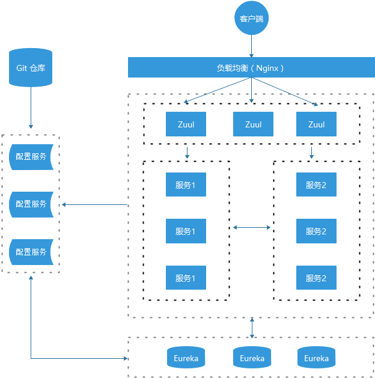

# Spring Cloud Netflix 学习

Spring Cloud 是一个相对比较新的微服务框架，2016 才推出 1.0 的 Release 版本. 但是其更新特别快，几乎每 1-2 个月就有一次更新，虽然 Spring Cloud 时间最短, 但是相比 Dubbo 等 RPC 框架, Spring Cloud 提供的全套的分布式系统解决方案。

Spring Cloud 为开发者提供了在分布式系统（配置管理，服务发现，熔断，路由，微代理，控制总线，一次性 Token，全居琐，Leader 选举，分布式 Session，集群状态）中快速构建的工具，使用 Spring Cloud 的开发者可以快速的启动服务或构建应用、同时能够快速和云平台资源进行对接。


## 统一的依赖管理

Spring Cloud 项目都是基于 Spring Boot 进行开发，并且都是使用 Maven 做项目管理工具。在实际开发中，我们一般都会创建一个依赖管理项目作为 Maven 的 Parent 项目使用，这样做可以极大的方便我们对 Jar 包版本的统一管理

创建一个工程名为 `hello-spring-cloud-dependencies` 的项目，`pom.xml` 配置文件如下

```xml
<?xml version="1.0" encoding="UTF-8"?>
<project xmlns="http://maven.apache.org/POM/4.0.0" xmlns:xsi="http://www.w3.org/2001/XMLSchema-instance"
         xsi:schemaLocation="http://maven.apache.org/POM/4.0.0 http://maven.apache.org/xsd/maven-4.0.0.xsd">
    <modelVer创建一个工程名为 hello-spring-cloud-dependencies 的项目，pom.xml 配置文件如下sion>4.0.0</modelVersion>

    <parent>
        <groupId>org.springframework.boot</groupId>
        <artifactId>spring-boot-starter-parent</artifactId>
        <version>2.0.2.RELEASE</version>
    </parent>

    <groupId>com.funtl</groupId>
    <artifactId>hello-spring-cloud-dependencies</artifactId>
    <version>1.0.0-SNAPSHOT</version>
    <packaging>pom</packaging>

    <name>hello-spring-cloud-dependencies</name>
    <url>http://www.funtl.com</url>
    <inceptionYear>2018-Now</inceptionYear>

    <properties>
        <!-- Environment Settings -->
        <java.version>1.8</java.version>
        <project.build.sourceEncoding>UTF-8</project.build.sourceEncoding>
        <project.reporting.outputEncoding>UTF-8</project.reporting.outputEncoding>

        <!-- Spring Settings -->
        <spring-cloud.version>Finchley.RELEASE</spring-cloud.version>
    </properties>

    <dependencyManagement>
        <dependencies>
            <dependency>
                <groupId>org.springframework.cloud</groupId>
                <artifactId>spring-cloud-dependencies</artifactId>
                <version>${spring-cloud.version}</version>
                <type>pom</type>
                <scope>import</scope>
            </dependency>
        </dependencies>
    </dependencyManagement>

    <build>
        <plugins>
            <!-- Compiler 插件, 设定 JDK 版本 -->
            <plugin>
                <groupId>org.apache.maven.plugins</groupId>
                <artifactId>maven-compiler-plugin</artifactId>
                <configuration>
                    <showWarnings>true</showWarnings>
                </configuration>
            </plugin>

            <!-- 打包 jar 文件时，配置 manifest 文件，加入 lib 包的 jar 依赖 -->
            <plugin>
                <groupId>org.apache.maven.plugins</groupId>
                <artifactId>maven-jar-plugin</artifactId>
                <configuration>
                    <archive>
                        <addMavenDescriptor>false</addMavenDescriptor>
                    </archive>
                </configuration>
                <executions>
                    <execution>
                        <configuration>
                            <archive>
                                <manifest>
                                    <!-- Add directory entries -->
                                    <addDefaultImplementationEntries>true</addDefaultImplementationEntries>
                                    <addDefaultSpecificationEntries>true</addDefaultSpecificationEntries>
                                    <addClasspath>true</addClasspath>
                                </manifest>
                            </archive>
                        </configuration>
                    </execution>
                </executions>
            </plugin>

            <!-- resource -->
            <plugin>
                <groupId>org.apache.maven.plugins</groupId>
                <artifactId>maven-resources-plugin</artifactId>
            </plugin>

            <!-- install -->
            <plugin>
                <groupId>org.apache.maven.plugins</groupId>
                <artifactId>maven-install-plugin</artifactId>
            </plugin>

            <!-- clean -->
            <plugin>
                <groupId>org.apache.maven.plugins</groupId>
                <artifactId>maven-clean-plugin</artifactId>
            </plugin>

            <!-- ant -->
            <plugin>
                <groupId>org.apache.maven.plugins</groupId>
                <artifactId>maven-antrun-plugin</artifactId>
            </plugin>

            <!-- dependency -->
            <plugin>
                <groupId>org.apache.maven.plugins</groupId>
                <artifactId>maven-dependency-plugin</artifactId>
            </plugin>
        </plugins>

        <pluginManagement>
            <plugins>
                <!-- Java Document Generate -->
                <plugin>
                    <groupId>org.apache.maven.plugins</groupId>
                    <artifactId>maven-javadoc-plugin</artifactId>
                    <executions>
                        <execution>
                            <phase>prepare-package</phase>
                            <goals>
                                <goal>jar</goal>
                            </goals>
                        </execution>
                    </executions>
                </plugin>

                <!-- YUI Compressor (CSS/JS压缩) -->
                <plugin>
                    <groupId>net.alchim31.maven</groupId>
                    <artifactId>yuicompressor-maven-plugin</artifactId>
                    <version>1.5.1</version>
                    <executions>
                        <execution>
                            <phase>prepare-package</phase>
                            <goals>
                                <goal>compress</goal>
                            </goals>
                        </execution>
                    </executions>
                    <configuration>
                        <encoding>UTF-8</encoding>
                        <jswarn>false</jswarn>
                        <nosuffix>true</nosuffix>
                        <linebreakpos>30000</linebreakpos>
                        <force>true</force>
                        <includes>
                            <include>**/*.js</include>
                            <include>**/*.css</include>
                        </includes>
                        <excludes>
                            <exclude>**/*.min.js</exclude>
                            <exclude>**/*.min.css</exclude>
                        </excludes>
                    </configuration>
                </plugin>
            </plugins>
        </pluginManagement>

        <!-- 资源文件配置 -->
        <resources>
            <resource>
                <directory>src/main/java</directory>
                <excludes>
                    <exclude>**/*.java</exclude>
                </excludes>
            </resource>
            <resource>
                <directory>src/main/resources</directory>
            </resource>
        </resources>
    </build>

    <repositories>
        <repository>
            <id>aliyun-repos</id>
            <name>Aliyun Repository</name>
            <url>http://maven.aliyun.com/nexus/content/groups/public</url>
            <releases>
                <enabled>true</enabled>
            </releases>
            <snapshots>
                <enabled>false</enabled>
            </snapshots>
        </repository>

        <repository>
            <id>sonatype-repos</id>
            <name>Sonatype Repository</name>
            <url>https://oss.sonatype.org/content/groups/public</url>
            <releases>
                <enabled>true</enabled>
            </releases>
            <snapshots>
                <enabled>false</enabled>
            </snapshots>
        </repository>
        <repository>
            <id>sonatype-repos-s</id>
            <name>Sonatype Repository</name>
            <url>https://oss.sonatype.org/content/repositories/snapshots</url>
            <releases>
                <enabled>false</enabled>
            </releases>
            <snapshots>
                <enabled>true</enabled>
            </snapshots>
        </repository>

        <repository>
            <id>spring-snapshots</id>
            <name>Spring Snapshots</name>
            <url>https://repo.spring.io/snapshot</url>
            <snapshots>
                <enabled>true</enabled>
            </snapshots>
        </repository>
        <repository>
            <id>spring-milestones</id>
            <name>Spring Milestones</name>
            <url>https://repo.spring.io/milestone</url>
            <snapshots>
                <enabled>false</enabled>
            </snapshots>
        </repository>
    </repositories>

    <pluginRepositories>
        <pluginRepository>
            <id>aliyun-repos</id>
            <name>Aliyun Repository</name>
            <url>http://maven.aliyun.com/nexus/content/groups/public</url>
            <releases>
                <enabled>true</enabled>
            </releases>
            <snapshots>
                <enabled>false</enabled>
            </snapshots>
        </pluginRepository>
    </pluginRepositories>
</project>
```

- parent：继承了 Spring Boot 的 Parent，表示我们是一个 Spring Boot 工程
- package：`pom`，表示该项目仅当做依赖项目，没有具体的实现代码
- `spring-cloud-dependencies`：在 `properties` 配置中预定义了版本号为 `Finchley.RC1` ，表示我们的 Spring Cloud 使用的是 F 版
- build：配置了项目所需的各种插件
- repositories：配置项目下载依赖时的第三方库

在实际开发中，我们所有的项目都会依赖这个 `dependencies` 项目，整个项目周期中的所有第三方依赖的版本也都由该项目进行管理。


## 服务注册于发现

组件 Spring Cloud Netflix 的 Eureka 是一个服务注册和发现模块

### 创建服务注册中心

- pom

```xml
<?xml version="1.0" encoding="UTF-8"?>
<project xmlns="http://maven.apache.org/POM/4.0.0" xmlns:xsi="http://www.w3.org/2001/XMLSchema-instance"
         xsi:schemaLocation="http://maven.apache.org/POM/4.0.0 http://maven.apache.org/xsd/maven-4.0.0.xsd">
    <modelVersion>4.0.0</modelVersion>

    <parent>
        <groupId>com.funtl</groupId>
        <artifactId>hello-spring-cloud-dependencies</artifactId>
        <version>1.0.0-SNAPSHOT</version>
        <relativePath>../hello-spring-cloud-dependencies/pom.xml</relativePath>
    </parent>

    <artifactId>hello-spring-cloud-eureka</artifactId>
    <packaging>jar</packaging>

    <name>hello-spring-cloud-eureka</name>
    <url>http://www.funtl.com</url>
    <inceptionYear>2018-Now</inceptionYear>

    <dependencies>
        <!-- Spring Boot Begin -->
        <dependency>
            <groupId>org.springframework.boot</groupId>
            <artifactId>spring-boot-starter-test</artifactId>
            <scope>test</scope>
        </dependency>
        <!-- Spring Boot End -->

        <!-- Spring Cloud Begin -->
        <dependency>
            <groupId>org.springframework.cloud</groupId>
            <artifactId>spring-cloud-starter-netflix-eureka-server</artifactId>
        </dependency>
        <!-- Spring Cloud End -->
    </dependencies>

    <build>
        <plugins>
            <plugin>
                <groupId>org.springframework.boot</groupId>
                <artifactId>spring-boot-maven-plugin</artifactId>
                <configuration>
               		<mainClass>
                   		com.funtl.hello.spring.cloud.eureka.EurekaApplication
                    </mainClass>
                </configuration>
            </plugin>
        </plugins>
    </build>
</project>
```

- application.yml

```yaml
spring:
  application:
    name: hello-spring-cloud-eureka

server:
  port: 8761

eureka:
  instance:
    hostname: localhost
  client:
    registerWithEureka: false
    fetchRegistry: false
    serviceUrl:
      defaultZone: http://${eureka.instance.hostname}:${server.port}/eureka/
```

Eureka 是一个高可用的组件，它没有后端缓存，每一个实例注册之后需要向注册中心发送心跳（因此可以在内存中完成），在默认情况下 Erureka Server 也是一个 Eureka Client ,必须要指定一个 Server。

通过 `eureka.client.registerWithEureka:false` 和 `fetchRegistry:false` 来表明自己是一个 Eureka Server.


- Application.java

```java
package com.funtl.hello.spring.cloud.eureka;

import org.springframework.boot.SpringApplication;
import org.springframework.boot.autoconfigure.SpringBootApplication;
import org.springframework.cloud.netflix.eureka.server.EnableEurekaServer;

@SpringBootApplication
@EnableEurekaServer
public class EurekaApplication {
    public static void main(String[] args) {
        SpringApplication.run(EurekaApplication.class, args);
    }
}
```

- 操作页面

Eureka Server 是有界面的，启动工程，打开浏览器访问：

http://localhost:8761


## 服务提供者

当 Client 向 Server 注册时，它会提供一些元数据，例如主机和端口，URL，主页等。Eureka Server 从每个 Client 实例接收心跳消息。 如果心跳超时，则通常将该实例从注册 Server 中删除


### pom

```xml
<?xml version="1.0" encoding="UTF-8"?>
<project xmlns="http://maven.apache.org/POM/4.0.0" xmlns:xsi="http://www.w3.org/2001/XMLSchema-instance"
         xsi:schemaLocation="http://maven.apache.org/POM/4.0.0 http://maven.apache.org/xsd/maven-4.0.0.xsd">
    <modelVersion>4.0.0</modelVersion>

    <parent>
        <groupId>com.funtl</groupId>
        <artifactId>hello-spring-cloud-dependencies</artifactId>
        <version>1.0.0-SNAPSHOT</version>
        <relativePath>../hello-spring-cloud-dependencies/pom.xml</relativePath>
    </parent>

    <artifactId>hello-spring-cloud-service-admin</artifactId>
    <packaging>jar</packaging>

    <name>hello-spring-cloud-service-admin</name>
    <url>http://www.funtl.com</url>
    <inceptionYear>2018-Now</inceptionYear>

    <dependencies>
        <!-- Spring Boot Begin -->
        <dependency>
            <groupId>org.springframework.boot</groupId>
            <artifactId>spring-boot-starter-test</artifactId>
            <scope>test</scope>
        </dependency>
        <!-- Spring Boot End -->

        <!-- Spring Cloud Begin -->
        <dependency>
            <groupId>org.springframework.cloud</groupId>
            <artifactId>spring-cloud-starter-netflix-eureka-server</artifactId>
        </dependency>
        <!-- Spring Cloud End -->
    </dependencies>

    <build>
        <plugins>
            <plugin>
                <groupId>org.springframework.boot</groupId>
                <artifactId>spring-boot-maven-plugin</artifactId>
                <configuration>
                    <mainClass>
                        com.funtl.hello.spring.cloud.service.admin.ServiceAdminApplication
                    </mainClass>
                </configuration>
            </plugin>
        </plugins>
    </build>
</project>
```


### application

```java
package com.funtl.hello.spring.cloud.service.admin;

import org.springframework.boot.SpringApplication;
import org.springframework.boot.autoconfigure.SpringBootApplication;
import org.springframework.cloud.netflix.eureka.EnableEurekaClient;

@SpringBootApplication
@EnableEurekaClient
public class ServiceAdminApplication {
    public static void main(String[] args) {
        SpringApplication.run(ServiceAdminApplication.class, args);
    }
}
```

通过注解 `@EnableEurekaClient` 表明自己是一个 Eureka Client.


### yml

```yaml
spring:
  application:
    name: hello-spring-cloud-service-admin

server:
  port: 8762

eureka:
  client:
    serviceUrl:
      defaultZone: http://localhost:8761/eureka/
```

**注意：** 需要指明 `spring.application.name`，这个很重要，这在以后的服务与服务之间相互调用一般都是根据这个 `name`


### controller

```java
package com.funtl.hello.spring.cloud.service.admin.controller;

import org.springframework.beans.factory.annotation.Value;
import org.springframework.web.bind.annotation.RequestMapping;
import org.springframework.web.bind.annotation.RequestMethod;
import org.springframework.web.bind.annotation.RequestParam;
import org.springframework.web.bind.annotation.RestController;

@RestController
public class AdminController {

    @Value("${server.port}")
    private String port;

    @RequestMapping(value = "hi", method = RequestMethod.GET)
    public String sayHi(@RequestParam(value = "message") String message) {
        return String.format("Hi，your message is : %s i am from port : %s", message, port);
    }
}
```


## 服务消费者 Ribbon

在微服务架构中，业务都会被拆分成一个独立的服务，服务与服务的通讯是基于 http restful 的。Spring cloud 有两种服务调用方式，一种是 ribbon + restTemplate，另一种是 feign。在这一篇文章首先讲解下基于 ribbon + rest

Ribbon 是一个负载均衡客户端，可以很好的控制 `http` 和 `tcp` 的一些行为

### 前期工作

- 启动服务提供者（本教程案例工程为：`hello-spring-cloud-service-admin`），端口号为：`8762`
- 修改配置文件的端口号为：`8763`，启动后在 Eureka 中会注册两个实例，这相当于一个小集群


### pom

```xml
<?xml version="1.0" encoding="UTF-8"?>
<project xmlns="http://maven.apache.org/POM/4.0.0" xmlns:xsi="http://www.w3.org/2001/XMLSchema-instance"
         xsi:schemaLocation="http://maven.apache.org/POM/4.0.0 http://maven.apache.org/xsd/maven-4.0.0.xsd">
    <modelVersion>4.0.0</modelVersion>

    <parent>
        <groupId>com.funtl</groupId>
        <artifactId>hello-spring-cloud-dependencies</artifactId>
        <version>1.0.0-SNAPSHOT</version>
        <relativePath>../hello-spring-cloud-dependencies/pom.xml</relativePath>
    </parent>

    <artifactId>hello-spring-cloud-web-admin-ribbon</artifactId>
    <packaging>jar</packaging>

    <name>hello-spring-cloud-web-admin-ribbon</name>
    <url>http://www.funtl.com</url>
    <inceptionYear>2018-Now</inceptionYear>

    <dependencies>
        <!-- Spring Boot Begin -->
        <dependency>
            <groupId>org.springframework.boot</groupId>
            <artifactId>spring-boot-starter-web</artifactId>
        </dependency>
        <dependency>
            <groupId>org.springframework.boot</groupId>
            <artifactId>spring-boot-starter-tomcat</artifactId>
        </dependency>
        <dependency>
            <groupId>org.springframework.boot</groupId>
            <artifactId>spring-boot-starter-thymeleaf</artifactId>
        </dependency>
        <dependency>
            <groupId>org.springframework.boot</groupId>
            <artifactId>spring-boot-starter-actuator</artifactId>
        </dependency>
        <dependency>
            <groupId>org.springframework.boot</groupId>
            <artifactId>spring-boot-starter-test</artifactId>
            <scope>test</scope>
        </dependency>
        <!-- Spring Boot End -->

        <!-- Spring Cloud Begin -->
        <dependency>
            <groupId>org.springframework.cloud</groupId>
            <artifactId>spring-cloud-starter-netflix-eureka-server</artifactId>
        </dependency>
        <dependency>
            <groupId>org.springframework.cloud</groupId>
            <artifactId>spring-cloud-starter-netflix-ribbon</artifactId>
        </dependency>
        <!-- Spring Cloud End -->

        <!-- 解决 thymeleaf 模板引擎一定要执行严格的 html5 格式校验问题 -->
        <dependency>
            <groupId>net.sourceforge.nekohtml</groupId>
            <artifactId>nekohtml</artifactId>
        </dependency>
    </dependencies>

    <build>
        <plugins>
            <plugin>
                <groupId>org.springframework.boot</groupId>
                <artifactId>spring-boot-maven-plugin</artifactId>
                <configuration>
                    <mainClass>com.funtl.hello.spring.cloud.web.admin.ribbon.WebAdminRibbonApplication</mainClass>
                </configuration>
            </plugin>
        </plugins>
    </build>
</project>
```

主要是增加依赖

```xml
<dependency>
    <groupId>org.springframework.cloud</groupId>
    <artifactId>spring-cloud-starter-netflix-ribbon</artifactId>
</dependency>
```

### application

```java
package com.funtl.hello.spring.cloud.web.admin.ribbon;

import org.springframework.boot.SpringApplication;
import org.springframework.boot.autoconfigure.SpringBootApplication;
import org.springframework.cloud.client.discovery.EnableDiscoveryClient;

@SpringBootApplication
@EnableDiscoveryClient
public class WebAdminRibbonApplication {
    public static void main(String[] args) {
        SpringApplication.run(WebAdminRibbonApplication.class, args);
    }
}
```

### yml

```yaml
spring:
  application:
    name: hello-spring-cloud-web-admin-ribbon
  thymeleaf:
    cache: false
    mode: LEGACYHTML5
    encoding: UTF-8
    servlet:
      content-type: text/html

server:
  port: 8764

eureka:
  client:
    serviceUrl:
      defaultZone: http://localhost:8761/eureka/
```

### configuration

配置注入 `RestTemplate` 的 Bean，并通过 `@LoadBalanced` 注解表明开启负载均衡功能，注意，一定要添加该注解

```java
package com.funtl.hello.spring.cloud.web.admin.ribbon.config;

import org.springframework.cloud.client.loadbalancer.LoadBalanced;
import org.springframework.context.annotation.Bean;
import org.springframework.context.annotation.Configuration;
import org.springframework.web.client.RestTemplate;

@Configuration
public class RestTemplateConfiguration {

    @Bean
    @LoadBalanced
    public RestTemplate restTemplate() {
        return new RestTemplate();
    }
}
```

### service

在这里我们直接用的程序名替代了具体的 URL 地址，在 Ribbon 中它会根据服务名来选择具体的服务实例，根据服务实例在请求的时候会用具体的 URL 替换掉服务名，代码如下：

```java
package com.funtl.hello.spring.cloud.web.admin.ribbon.service;

import org.springframework.beans.factory.annotation.Autowired;
import org.springframework.stereotype.Service;
import org.springframework.web.client.RestTemplate;

@Service
public class AdminService {

    @Autowired
    private RestTemplate restTemplate;

    public String sayHi(String message) {
        return restTemplate.getForObject("http://HELLO-SPRING-CLOUD-SERVICE-ADMIN/hi?message=" + message, String.class);
    }
}
```

### controller

```java
package com.funtl.hello.spring.cloud.web.admin.ribbon.controller;

import com.funtl.hello.spring.cloud.web.admin.ribbon.service.AdminService;
import org.springframework.beans.factory.annotation.Autowired;
import org.springframework.web.bind.annotation.RequestMapping;
import org.springframework.web.bind.annotation.RequestMethod;
import org.springframework.web.bind.annotation.RequestParam;
import org.springframework.web.bind.annotation.RestController;

@RestController
public class AdminController {

    @Autowired
    private AdminService adminService;

    @RequestMapping(value = "hi", method = RequestMethod.GET)
    public String sayHi(@RequestParam String message) {
        return adminService.sayHi(message);
    }
}
```

### 测试

在浏览器上多次访问 http://localhost:8764/hi?message=HelloRibbon

浏览器交替显示：

```text
Hi，your message is :"HelloRibbon" i am from port：8762
Hi，your message is :"HelloRibbon" i am from port：8763
```

### 架构分析


- 一个服务注册中心，Eureka Server，端口号为：`8761`
- `service-admin` 工程运行了两个实例，端口号分别为：`8762`，`8763`
- `web-admin-ribbon` 工程端口号为：`8764`
- `web-admin-ribbon` 通过 `RestTemplate` 调用 `service-admin` 接口时因为启用了负载均衡功能故会轮流调用它的 `8762` 和 `8763` 端口

开启多个运行示例，参考tools中idea笔记


## 服务消费者 Feign

Feign 是一个声明式的伪 Http 客户端，它使得写 Http 客户端变得更简单。使用 Feign，只需要创建一个接口并注解。它具有可插拔的注解特性，可使用 Feign 注解和 JAX-RS 注解。Feign 支持可插拔的编码器和解码器。Feign 默认集成了 Ribbon，并和 Eureka 结合，默认实现了负载均衡的效果

- Feign 采用的是基于接口的注解
- Feign 整合了 ribbon

### pom

```xml
<?xml version="1.0" encoding="UTF-8"?>
<project xmlns="http://maven.apache.org/POM/4.0.0" xmlns:xsi="http://www.w3.org/2001/XMLSchema-instance"
         xsi:schemaLocation="http://maven.apache.org/POM/4.0.0 http://maven.apache.org/xsd/maven-4.0.0.xsd">
    <modelVersion>4.0.0</modelVersion>

    <parent>
        <groupId>com.funtl</groupId>
        <artifactId>hello-spring-cloud-dependencies</artifactId>
        <version>1.0.0-SNAPSHOT</version>
        <relativePath>../hello-spring-cloud-dependencies/pom.xml</relativePath>
    </parent>

    <artifactId>hello-spring-cloud-web-admin-feign</artifactId>
    <packaging>jar</packaging>

    <name>hello-spring-cloud-web-admin-feign</name>
    <url>http://www.funtl.com</url>
    <inceptionYear>2018-Now</inceptionYear>

    <dependencies>
        <!-- Spring Boot Begin -->
        <dependency>
            <groupId>org.springframework.boot</groupId>
            <artifactId>spring-boot-starter-web</artifactId>
        </dependency>
        <dependency>
            <groupId>org.springframework.boot</groupId>
            <artifactId>spring-boot-starter-tomcat</artifactId>
        </dependency>
        <dependency>
            <groupId>org.springframework.boot</groupId>
            <artifactId>spring-boot-starter-thymeleaf</artifactId>
        </dependency>
        <dependency>
            <groupId>org.springframework.boot</groupId>
            <artifactId>spring-boot-starter-actuator</artifactId>
        </dependency>
        <dependency>
            <groupId>org.springframework.boot</groupId>
            <artifactId>spring-boot-starter-test</artifactId>
            <scope>test</scope>
        </dependency>
        <!-- Spring Boot End -->

        <!-- Spring Cloud Begin -->
        <dependency>
            <groupId>org.springframework.cloud</groupId>
            <artifactId>spring-cloud-starter-netflix-eureka-server</artifactId>
        </dependency>
        <dependency>
            <groupId>org.springframework.cloud</groupId>
            <artifactId>spring-cloud-starter-openfeign</artifactId>
        </dependency>
        <!-- Spring Cloud End -->

        <!-- 解决 thymeleaf 模板引擎一定要执行严格的 html5 格式校验问题 -->
        <dependency>
            <groupId>net.sourceforge.nekohtml</groupId>
            <artifactId>nekohtml</artifactId>
        </dependency>
    </dependencies>

    <build>
        <plugins>
            <plugin>
                <groupId>org.springframework.boot</groupId>
                <artifactId>spring-boot-maven-plugin</artifactId>
                <configuration>
                    <mainClass>
                 	com.funtl.hello.spring.cloud.web.admin.feign.WebAdminFeignApplication
                    </mainClass>
                </configuration>
            </plugin>
        </plugins>
    </build>
</project>
```

主要增加了feign的配置

- 注意，该配置下的包含ribbon的jar包

```xml
<dependency>
    <groupId>org.springframework.cloud</groupId>
    <artifactId>spring-cloud-starter-openfeign</artifactId>
</dependency>
```

### application

通过 `@EnableFeignClients` 注解开启 Feign 功能

```java
package com.funtl.hello.spring.cloud.web.admin.feign;

import org.springframework.boot.SpringApplication;
import org.springframework.boot.autoconfigure.SpringBootApplication;
import org.springframework.cloud.client.discovery.EnableDiscoveryClient;
import org.springframework.cloud.openfeign.EnableFeignClients;

@SpringBootApplication
@EnableDiscoveryClient
@EnableFeignClients
public class WebAdminFeignApplication {
    public static void main(String[] args) {
        SpringApplication.run(WebAdminFeignApplication.class, args);
    }
}
```

### yml

```yaml
spring:
  application:
    name: hello-spring-cloud-web-admin-feign
  thymeleaf:
    cache: false
    mode: LEGACYHTML5
    encoding: UTF-8
    servlet:
      content-type: text/html

server:
  port: 8765

eureka:
  client:
    serviceUrl:
      defaultZone: http://localhost:8761/eureka/
```

### feign接口

通过 `@FeignClient("服务名")` 注解来指定调用哪个服务。代码如下：

```java
package com.funtl.hello.spring.cloud.web.admin.feign.service;

import org.springframework.cloud.openfeign.FeignClient;
import org.springframework.web.bind.annotation.RequestMapping;
import org.springframework.web.bind.annotation.RequestMethod;
import org.springframework.web.bind.annotation.RequestParam;

@FeignClient(value = "hello-spring-cloud-service-admin")
public interface AdminService {

    @RequestMapping(value = "hi", method = RequestMethod.GET)
    public String sayHi(@RequestParam(value = "message") String message);
}
```

### controller

```java
package com.funtl.hello.spring.cloud.web.admin.feign.controller;

import com.funtl.hello.spring.cloud.web.admin.feign.service.AdminService;
import org.springframework.beans.factory.annotation.Autowired;
import org.springframework.web.bind.annotation.RequestMapping;
import org.springframework.web.bind.annotation.RequestMethod;
import org.springframework.web.bind.annotation.RequestParam;
import org.springframework.web.bind.annotation.RestController;

@RestController
public class AdminController {

    @Autowired
    private AdminService adminService;

    @RequestMapping(value = "hi", method = RequestMethod.GET)
    public String sayHi(@RequestParam String message) {
        return adminService.sayHi(message);
    }
}
```


### 测试

在浏览器上多次访问 http://localhost:8765/hi?message=HelloFeign

浏览器交替显示：

```text
Hi，your message is :"HelloFeign" i am from port：8762
Hi，your message is :"HelloFeign" i am from port：8763
```

请求成功则表示我们已经成功实现了 Feign 功能来访问不同端口的实例


## 熔断器 Hystrix 

在微服务架构中，根据业务来拆分成一个个的服务，服务与服务之间可以通过 `RPC` 相互调用，在 Spring Cloud 中可以用 `RestTemplate + Ribbon` 和 `Feign` 来调用。为了保证其高可用，单个服务通常会集群部署。由于网络原因或者自身的原因，服务并不能保证 100% 可用，如果单个服务出现问题，调用这个服务就会出现线程阻塞，此时若有大量的请求涌入，`Servlet` 容器的线程资源会被消耗完毕，导致服务瘫痪。服务与服务之间的依赖性，故障会传播，会对整个微服务系统造成灾难性的严重后果，这就是服务故障的 **“雪崩”** 效应。

为了解决这个问题，业界提出了熔断器模型。

Netflix 开源了 Hystrix 组件，实现了熔断器模式，Spring Cloud 对这一组件进行了整合。在微服务架构中，一个请求需要调用多个服务是非常常见的，如下图：


较底层的服务如果出现故障，会导致连锁故障。当对特定的服务的调用的不可用达到一个阀值（Hystrix 是 **5 秒 20 次**） 熔断器将会被打开。


熔断器打开后，为了避免连锁故障，通过 `fallback` 方法可以直接返回一个固定值


### Ribbon中使用熔断器

#### pom

添加依赖，依赖好像有问题

```xml
<dependency>
    <groupId>org.springframework.cloud</groupId>
    <artifactId>spring-cloud-starter-netflix-hystrix</artifactId>
</dependency>
```

使用如下代替

```xml
<dependency>
    <groupId>com.netflix.hystrix</groupId>
    <artifactId>hystrix-javanica</artifactId>
</dependency>
<dependency>
    <groupId>org.springframework.cloud</groupId>
    <artifactId>spring-cloud-starter-netflix-hystrix-dashboard</artifactId>
</dependency>
```


#### application

增加`@EnableHystrix`注解

```java
package com.funtl.hello.spring.cloud.web.admin.ribbon;

import org.springframework.boot.SpringApplication;
import org.springframework.boot.autoconfigure.SpringBootApplication;
import org.springframework.cloud.client.discovery.EnableDiscoveryClient;
import org.springframework.cloud.netflix.hystrix.EnableHystrix;

@SpringBootApplication
@EnableDiscoveryClient
@EnableHystrix
public class WebAdminRibbonApplication {
    public static void main(String[] args) {
        SpringApplication.run(WebAdminRibbonApplication.class, args);
    }
}
```

#### service

在 Ribbon 调用方法上增加 `@HystrixCommand` 注解并指定 `fallbackMethod` 熔断方法

```java
package com.funtl.hello.spring.cloud.web.admin.ribbon.service;

import com.netflix.hystrix.contrib.javanica.annotation.HystrixCommand;
import org.springframework.beans.factory.annotation.Autowired;
import org.springframework.stereotype.Service;
import org.springframework.web.client.RestTemplate;

@Service
public class AdminService {

    @Autowired
    private RestTemplate restTemplate;

    @HystrixCommand(fallbackMethod = "hiError")
    public String sayHi(String message) {
        return restTemplate.getForObject("http://HELLO-SPRING-CLOUD-SERVICE-ADMIN/hi?message=" + message, String.class);
    }

    public String hiError(String message) {
        return "Hi，your message is :\"" + message + "\" but request error.";
    }
}
```

#### 测试

此时我们关闭服务提供者，再次请求 http://localhost:8764/hi?message=HelloRibbon 浏览器会显示：

```java
Hi，your message is :"HelloRibbon" but request error.
```


#### 关于负载均衡策略

- 对调用的某个服务启用某种负载策略

1）通过配置文件配置

```
hello:
    ribbon:
     NFLoadBalancerRuleClassName:com.netflix.loadbalancer.RandomRule
```

2）通过java注解配置

```
@Configuration
public class RibbonConfiguration{
      @Bean
      public IRule ribbonRule(){
          //随机负载
          return new RandomRule();
     }
}
```

通过注解`@RibbonClient`为特定的服务配置负载均衡策略

```
@Configuration
@RibbonClient(name="hello", configuration=RibbonConfiguration.class)
public class TestRibbonConfiguration{
}
```

以上配置都是在服务消费者中配置。


### Feign中使用熔断器

Feign 是自带熔断器的，但默认是关闭的。需要在配置文件中配置打开它，在配置文件增加以下代码

#### yml

```yaml
feign:
  hystrix:
    enabled: true
```

#### service

增加指定的熔断类

```java
package com.funtl.hello.spring.cloud.web.admin.feign.service;

import com.funtl.hello.spring.cloud.web.admin.feign.service.hystrix.AdminServiceHystrix;
import org.springframework.cloud.openfeign.FeignClient;
import org.springframework.web.bind.annotation.RequestMapping;
import org.springframework.web.bind.annotation.RequestMethod;
import org.springframework.web.bind.annotation.RequestParam;

@FeignClient(value = "hello-spring-cloud-service-admin", fallback = AdminServiceHystrix.class)
public interface AdminService {

    @RequestMapping(value = "hi", method = RequestMethod.GET)
    public String sayHi(@RequestParam(value = "message") String message);
}
```

创建熔断器类并实现要熔断的接口

```java
package com.funtl.hello.spring.cloud.web.admin.feign.service.hystrix;

import com.funtl.hello.spring.cloud.web.admin.feign.service.AdminService;
import org.springframework.stereotype.Component;

@Component
public class AdminServiceHystrix implements AdminService {

    @Override
    public String sayHi(String message) {
        return "Hi，your message is :\"" + message + "\" but request error.";
    }
}
```

测试同ribbon


### 熔断器监控面板

在服务端，feign或ribbon都可以，添加如下依赖

```xml
<dependency>
    <groupId>org.springframework.cloud</groupId>
    <artifactId>spring-cloud-starter-netflix-hystrix-dashboard</artifactId>
</dependency>
```

在application中添加`@EnableHystrixDashboard` 

#### 配置servlet

Spring Boot 2.x 版本开启 Hystrix Dashboard 与 Spring Boot 1.x 的方式略有不同，需要增加一个 `HystrixMetricsStreamServlet` 的配置，代码如下：

```java
package com.funtl.hello.spring.cloud.web.admin.ribbon.config;

import com.netflix.hystrix.contrib.metrics.eventstream.HystrixMetricsStreamServlet;
import org.springframework.boot.web.servlet.ServletRegistrationBean;
import org.springframework.context.annotation.Bean;
import org.springframework.context.annotation.Configuration;

@Configuration
public class HystrixDashboardConfiguration {

    @Bean
    public ServletRegistrationBean getServlet() {
        HystrixMetricsStreamServlet streamServlet = new HystrixMetricsStreamServlet();
        ServletRegistrationBean registrationBean = new ServletRegistrationBean(streamServlet);
        registrationBean.setLoadOnStartup(1);
        registrationBean.addUrlMappings("/hystrix.stream"); // 面板上第一行输入的访问的地址
        registrationBean.setName("HystrixMetricsStreamServlet");
        return registrationBean;
    }
}
```

熔断器的servlet在有熔断操作的服务上都需要添加，然后在监控面板上输入相应的地址才能被监控


#### 测试

http://localhost:8764/hystrix


#### 参数说明

##### 什么情况下会触发 `fallback` 方法

| 名字                 | 描述                               | 触发fallback |
| -------------------- | ---------------------------------- | ------------ |
| EMIT                 | 值传递                             | NO           |
| SUCCESS              | 执行完成，没有错误                 | NO           |
| FAILURE              | 执行抛出异常                       | YES          |
| TIMEOUT              | 执行开始，但没有在允许的时间内完成 | YES          |
| BAD_REQUEST          | 执行抛出HystrixBadRequestException | NO           |
| SHORT_CIRCUITED      | 断路器打开，不尝试执行             | YES          |
| THREAD_POOL_REJECTED | 线程池拒绝，不尝试执行             | YES          |
| SEMAPHORE_REJECTED   | 信号量拒绝，不尝试执行             | YES          |

##### fallback 方法在什么情况下会抛出异常

| 名字              | 描述                           | 抛异常 |
| ----------------- | ------------------------------ | ------ |
| FALLBACK_EMIT     | Fallback值传递                 | NO     |
| FALLBACK_SUCCESS  | Fallback执行完成，没有错误     | NO     |
| FALLBACK_FAILURE  | Fallback执行抛出出错           | YES    |
| FALLBACK_REJECTED | Fallback信号量拒绝，不尝试执行 | YES    |
| FALLBACK_MISSING  | 没有Fallback实例               | YES    |

##### Hystrix Dashboard 界面监控参数


#### 常用配置

##### 超时时间（默认1000ms，单位：ms）

- `hystrix.command.default.execution.isolation.thread.timeoutInMilliseconds`：在调用方配置，被该调用方的所有方法的超时时间都是该值，优先级低于下边的指定配置
- `hystrix.command.HystrixCommandKey.execution.isolation.thread.timeoutInMilliseconds`：在调用方配置，被该调用方的指定方法（HystrixCommandKey 方法名）的超时时间是该值

##### 线程池核心线程数

- `hystrix.threadpool.default.coreSize`：默认为 10

##### Queue

- `hystrix.threadpool.default.maxQueueSize`：最大排队长度。默认 -1，使用 `SynchronousQueue`。其他值则使用 `LinkedBlockingQueue`。如果要从 -1 换成其他值则需重启，即该值不能动态调整，若要动态调整，需要使用到下边这个配置
- `hystrix.threadpool.default.queueSizeRejectionThreshold`：排队线程数量阈值，默认为 5，达到时拒绝，如果配置了该选项，队列的大小是该队列

- 如果 `maxQueueSize=-1` 的话，则该选项不起作用

##### 断路器

- `hystrix.command.default.circuitBreaker.requestVolumeThreshold`：当在配置时间窗口内达到此数量的失败后，进行短路。默认 20 个（10s 内请求失败数量达到 20 个，断路器开）
- `hystrix.command.default.circuitBreaker.sleepWindowInMilliseconds`：短路多久以后开始尝试是否恢复，默认 5s
- `hystrix.command.default.circuitBreaker.errorThresholdPercentage`：出错百分比阈值，当达到此阈值后，开始短路。默认 50%

##### fallback

- `hystrix.command.default.fallback.isolation.semaphore.maxConcurrentRequests`：调用线程允许请求 `HystrixCommand.GetFallback()` 的最大数量，默认 10。超出时将会有异常抛出，注意：该项配置对于 THREAD 隔离模式也起作用

##### 属性配置参数

- 参数说明：https://github.com/Netflix/Hystrix/wiki/Configuration
- HystrixProperty 参考代码：http://www.programcreek.com/java-api-examples/index.php?source_dir=Hystrix-master/hystrix-contrib/hystrix-javanica/src/test/java/com/netflix/hystrix/contrib/javanica/test/common/configuration/command/BasicCommandPropertiesTest.java


## 路由网关 Zuul

> 使用路由网关统一访问接口

在微服务架构中，需要几个基础的服务治理组件，包括服务注册与发现、服务消费、负载均衡、熔断器、智能路由、配置管理等，由这几个基础组件相互协作，共同组建了一个简单的微服务系统。一个简单的微服务系统如下图：



在 Spring Cloud 微服务系统中，一种常见的负载均衡方式是，客户端的请求首先经过负载均衡（Zuul、Ngnix），再到达服务网关（Zuul 集群），然后再到具体的服。服务统一注册到高可用的服务注册中心集群，服务的所有的配置文件由配置服务管理，配置服务的配置文件放在 GIT 仓库，方便开发人员随时改配置

Zuul 的主要功能是路由转发和过滤器。路由功能是微服务的一部分，比如 `/api/user` 转发到到 User 服务，`/api/shop` 转发到到 Shop 服务。==Zuul 默认和 Ribbon 结合实现了负载均衡的功能==

### 创建路由网关

#### pom

```xml
<?xml version="1.0" encoding="UTF-8"?>
<project xmlns="http://maven.apache.org/POM/4.0.0" xmlns:xsi="http://www.w3.org/2001/XMLSchema-instance"
         xsi:schemaLocation="http://maven.apache.org/POM/4.0.0 http://maven.apache.org/xsd/maven-4.0.0.xsd">
    <modelVersion>4.0.0</modelVersion>

    <parent>
        <groupId>com.funtl</groupId>
        <artifactId>hello-spring-cloud-dependencies</artifactId>
        <version>1.0.0-SNAPSHOT</version>
        <relativePath>../hello-spring-cloud-dependencies/pom.xml</relativePath>
    </parent>

    <artifactId>hello-spring-cloud-zuul</artifactId>
    <packaging>jar</packaging>

    <name>hello-spring-cloud-zuul</name>
    <url>http://www.funtl.com</url>
    <inceptionYear>2018-Now</inceptionYear>

    <dependencies>
        <!-- Spring Boot Begin -->
        <dependency>
            <groupId>org.springframework.boot</groupId>
            <artifactId>spring-boot-starter-web</artifactId>
        </dependency>
        <dependency>
            <groupId>org.springframework.boot</groupId>
            <artifactId>spring-boot-starter-tomcat</artifactId>
        </dependency>
        <dependency>
            <groupId>org.springframework.boot</groupId>
            <artifactId>spring-boot-starter-actuator</artifactId>
        </dependency>
        <dependency>
            <groupId>org.springframework.boot</groupId>
            <artifactId>spring-boot-starter-test</artifactId>
            <scope>test</scope>
        </dependency>
        <!-- Spring Boot End -->

        <!-- Spring Cloud Begin -->
        <dependency>
            <groupId>org.springframework.cloud</groupId>
            <artifactId>spring-cloud-starter-netflix-eureka-server</artifactId>
        </dependency>
        <dependency>
            <groupId>org.springframework.cloud</groupId>
            <artifactId>spring-cloud-starter-netflix-zuul</artifactId>
        </dependency>
        <!-- Spring Cloud End -->
    </dependencies>

    <build>
        <plugins>
            <plugin>
                <groupId>org.springframework.boot</groupId>
                <artifactId>spring-boot-maven-plugin</artifactId>
                <configuration>
                    <mainClass>com.funtl.hello.spring.cloud.zuul.ZuulApplication</mainClass>
                </configuration>
            </plugin>
        </plugins>
    </build>
</project>
```

增加zuul依赖

```pom
<dependency>
    <groupId>org.springframework.cloud</groupId>
    <artifactId>spring-cloud-starter-netflix-zuul</artifactId>
</dependency>
```


#### application

增加 `@EnableZuulProxy` 注解开启 Zuul 功能

```java
package com.funtl.hello.spring.cloud.zuul;

import org.springframework.boot.SpringApplication;
import org.springframework.boot.autoconfigure.SpringBootApplication;
import org.springframework.cloud.netflix.eureka.EnableEurekaClient;
import org.springframework.cloud.netflix.zuul.EnableZuulProxy;

@SpringBootApplication
@EnableEurekaClient
@EnableZuulProxy
public class ZuulApplication {
    public static void main(String[] args) {
        SpringApplication.run(ZuulApplication.class, args);
    }
}
```

#### yml

- 设置端口号为：`8769`
- 增加 Zuul 配置

```yaml
spring:
  application:
    name: hello-spring-cloud-zuul

server:
  port: 8769

eureka:
  client:
    serviceUrl:
      defaultZone: http://localhost:8761/eureka/

zuul:
  routes:
    api-a:
      path: /api/a/**
      serviceId: hello-spring-cloud-web-admin-ribbon
    api-b:
      path: /api/b/**
      serviceId: hello-spring-cloud-web-admin-feign
```

路由说明：

- 以 `/api/a` 开头的请求都转发给 `hello-spring-cloud-web-admin-ribbon` 服务
- 以 `/api/b` 开头的请求都转发给 `hello-spring-cloud-web-admin-feign` 服务


#### 测试

依次运行 `EurekaApplication`、`ServiceAdminApplication`、`WebAdminRibbonApplication`、`WebAdminFeignApplication`、`ZuulApplication`

打开浏览器访问：http://localhost:8769/api/a/hi?message=HelloZuul 浏览器显示

```text
Hi，your message is :"HelloZuul" i am from port：8763
```

打开浏览器访问：http://localhost:8769/api/b/hi?message=HelloZuul 浏览器显示

```text
Hi，your message is :"HelloZuul" i am from port：8763
```

至此说明 Zuul 的路由功能配置成功


### 路由失败回调

```java
package com.funtl.hello.spring.cloud.zuul.fallback;

import com.fasterxml.jackson.databind.ObjectMapper;
import org.springframework.cloud.netflix.zuul.filters.route.FallbackProvider;
import org.springframework.http.HttpHeaders;
import org.springframework.http.HttpStatus;
import org.springframework.http.MediaType;
import org.springframework.http.client.ClientHttpResponse;
import org.springframework.stereotype.Component;

import java.io.ByteArrayInputStream;
import java.io.IOException;
import java.io.InputStream;
import java.util.HashMap;
import java.util.Map;

/**
 * 路由 hello-spring-cloud-web-admin-feign 失败时的回调
 * <p>Title: WebAdminFeignFallbackProvider</p>
 * <p>Description: </p>
 *
 * @author Lusifer
 * @version 1.0.0
 * @date 2018/7/27 6:55
 */
@Component
public class WebAdminFeignFallbackProvider implements FallbackProvider {

    @Override
    public String getRoute() {
        // ServiceId，如果需要所有调用都支持回退，则 return "*" 或 return null
        return "hello-spring-cloud-web-admin-feign";
    }

    /**
     * 如果请求服务失败，则返回指定的信息给调用者
     * @param route
     * @param cause
     * @return
     */
    @Override
    public ClientHttpResponse fallbackResponse(String route, Throwable cause) {
        return new ClientHttpResponse() {
            /**
             * 网关向 api 服务请求失败了，但是消费者客户端向网关发起的请求是成功的，
             * 不应该把 api 的 404,500 等问题抛给客户端
             * 网关和 api 服务集群对于客户端来说是黑盒
             * @return
             * @throws IOException
             */
            @Override
            public HttpStatus getStatusCode() throws IOException {
                return HttpStatus.OK;
            }

            @Override
            public int getRawStatusCode() throws IOException {
                return HttpStatus.OK.value();
            }

            @Override
            public String getStatusText() throws IOException {
                return HttpStatus.OK.getReasonPhrase();
            }

            @Override
            public void close() {

            }

            @Override
            public InputStream getBody() throws IOException {
                ObjectMapper objectMapper = new ObjectMapper();
                Map<String, Object> map = new HashMap<>();
                map.put("status", 200);
                map.put("message", "无法连接，请检查您的网络");
                return new ByteArrayInputStream(objectMapper.writeValueAsString(map).getBytes("UTF-8"));
            }

            @Override
            public HttpHeaders getHeaders() {
                HttpHeaders headers = new HttpHeaders();
                // 和 getBody 中的内容编码一致
                headers.setContentType(MediaType.APPLICATION_JSON_UTF8);
                return headers;
            }
        };
    }
}
```


### 路由过滤

Zuul 不仅仅只是路由，还有很多强大的功能，本节演示一下它的服务过滤功能，比如用在安全验证方面

继承 `ZuulFilter` 类并在类上增加 `@Component` 注解就可以使用服务过滤功能了，非常简单方便

```java
package com.funtl.hello.spring.cloud.zuul.filter;

import com.netflix.zuul.ZuulFilter;
import com.netflix.zuul.context.RequestContext;
import com.netflix.zuul.exception.ZuulException;
import org.slf4j.Logger;
import org.slf4j.LoggerFactory;
import org.springframework.stereotype.Component;

import javax.servlet.http.HttpServletRequest;
import java.io.IOException;

/**
 * Zuul 的服务过滤演示
 * <p>Title: LoginFilter</p>
 * <p>Description: </p>
 *
 * @author Lusifer
 * @version 1.0.0
 * @date 2018/5/29 22:02
 */
@Component
public class LoginFilter extends ZuulFilter {

    private static final Logger logger = LoggerFactory.getLogger(LoginFilter.class);

    /**
     * 配置过滤类型，有四种不同生命周期的过滤器类型
     * 1. pre：路由之前
     * 2. routing：路由之时
     * 3. post：路由之后
     * 4. error：发送错误调用
     * @return
     */
    @Override
    public String filterType() {
        return "pre";
    }

    /**
     * 配置过滤的顺序
     * @return
     */
    @Override
    public int filterOrder() {
        return 0;
    }

    /**
     * 配置是否需要过滤：true/需要，false/不需要
     * @return
     */
    @Override
    public boolean shouldFilter() {
        return true;
    }

    /**
     * 过滤器的具体业务代码
     * @return
     * @throws ZuulException
     */
    @Override
    public Object run() throws ZuulException {
        RequestContext context = RequestContext.getCurrentContext();
        HttpServletRequest request = context.getRequest();
        logger.info("{} >>> {}", request.getMethod(), request.getRequestURL().toString());
        String token = request.getParameter("token");
        if (token == null) {
            logger.warn("Token is empty");
            context.setSendZuulResponse(false);
            context.setResponseStatusCode(401);
            try {
                context.getResponse().getWriter().write("Token is empty");
            } catch (IOException e) {
            }
        } else {
            logger.info("OK");
        }
        return null;
    }
}
```


#### 参数说明

##### filterType

返回一个字符串代表过滤器的类型，在 Zuul 中定义了四种不同生命周期的过滤器类型

- pre：路由之前
- routing：路由之时
- post： 路由之后
- error：发送错误调用

##### filterOrder

过滤的顺序

##### shouldFilter

是否需要过滤，这里是 `true`，需要过滤

##### run

过滤器的具体业务代码


#### 测试

浏览器访问：http://localhost:8769/api/a/hi?message=HelloZuul 网页显示

```text
Token is empty
```

浏览器访问：http://localhost:8769/api/b/hi?message=HelloZuul&token=123 网页显示

```text
Hi，your message is :"HelloZuul" i am from port：8763
```