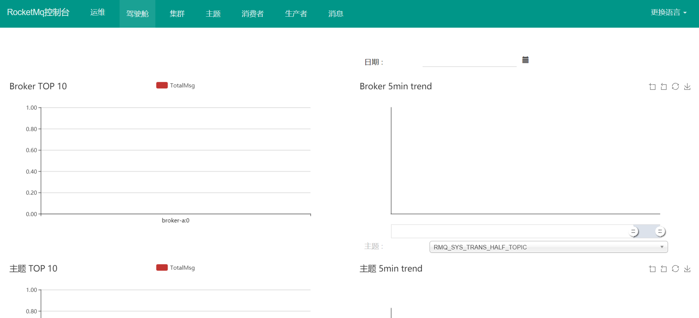
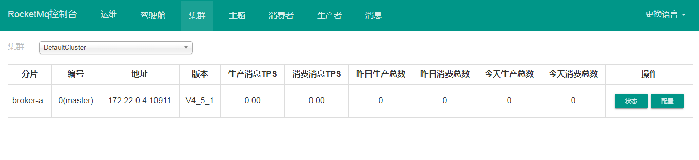
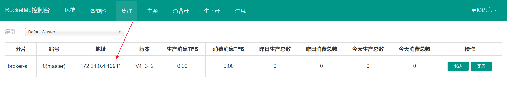

# RocketMQ 使用

> Apache Alibaba RocketMQ 是一个消息中间件。消息中间件中有两个角色：消息生产者和消息消费者。RocketMQ 里同样有这两个概念，消息生产者负责创建消息并发送到 RocketMQ 服务器，RocketMQ 服务器会将消息持久化到磁盘，消息消费者从 RocketMQ 服务器拉取消息并提交给应用消费


## 概述

消息队列作为高并发系统的核心组件之一，能够帮助业务系统解构提升开发效率和系统稳定性。主要具有以下优势：

- **削峰填谷：** 主要解决瞬时写压力大于应用服务能力导致消息丢失、系统奔溃等问题
- **系统解耦：** 解决不同重要程度、不同能力级别系统之间依赖导致一死全死
- **提升性能：** 当存在一对多调用时，可以发一条消息给消息系统，让消息系统通知相关系统
- **蓄流压测：** 线上有些链路不好压测，可以通过堆积一定量消息再放开来压测


## 特点

RocketMQ 是一款分布式、队列模型的消息中间件，具有以下特点：

- 支持严格的消息顺序
- 支持 Topic 与 Queue 两种模式
- 亿级消息堆积能力
- 比较友好的分布式特性
- 同时支持 Push 与 Pull 方式消费消息
- **历经多次天猫双十一海量消息考验**


## 优势

目前主流的 MQ 主要是 RocketMQ、kafka、RabbitMQ，其主要优势有：

- 支持事务型消息（消息发送和 DB 操作保持两方的最终一致性，RabbitMQ 和 Kafka 不支持）
- 支持结合 RocketMQ 的多个系统之间数据最终一致性（多方事务，二方事务是前提）
- 支持 18 个级别的延迟消息（RabbitMQ 和 Kafka 不支持）
- 支持指定次数和时间间隔的失败消息重发（Kafka 不支持，RabbitMQ 需要手动确认）
- 支持 Consumer 端 Tag 过滤，减少不必要的网络传输（RabbitMQ 和 Kafka 不支持）
- 支持重复消费（RabbitMQ 不支持，Kafka 支持）


## 消息队列对比参照表


## 安装

**注意：启动 RocketMQ Server + Broker + Console 至少需要 2G 内存**

### docker-compose.yml

```yaml
version: '3.5'
services:
  rmqnamesrv: # name server
    image: foxiswho/rocketmq:server
    container_name: rmqnamesrv
    ports:
      - 9876:9876
    volumes:
      - ./data/logs:/opt/logs
      - ./data/store:/opt/store
    networks:
        rmq:
          aliases:
            - rmqnamesrv

  rmqbroker: # broker
    image: foxiswho/rocketmq:broker
    container_name: rmqbroker
    ports:
      - 10909:10909
      - 10911:10911
    volumes:
      - ./data/logs:/opt/logs
      - ./data/store:/opt/store
      - ./data/brokerconf/broker.conf:/etc/rocketmq/broker.conf # 将配置提出，方便修改
    environment:
        NAMESRV_ADDR: "rmqnamesrv:9876" # 此处可以发现broker连接到server
        JAVA_OPTS: " -Duser.home=/opt"
        JAVA_OPT_EXT: "-server -Xms128m -Xmx128m -Xmn128m"
    command: mqbroker -c /etc/rocketmq/broker.conf
    depends_on:
      - rmqnamesrv
    networks:
      rmq:
        aliases:
          - rmqbroker

  rmqconsole: # rocketMQ ui
    image: styletang/rocketmq-console-ng
    container_name: rmqconsole
    ports:
      - 8080:8080
    environment:
        JAVA_OPTS: "-Drocketmq.namesrv.addr=rmqnamesrv:9876 -Dcom.rocketmq.sendMessageWithVIPChannel=false"
    depends_on:
      - rmqnamesrv
    networks:
      rmq:
        aliases:
          - rmqconsole

networks:
  rmq:
    name: rmq
    driver: bridge
```


### broker.conf

RocketMQ Broker 需要一个配置文件，按照上面的 Compose 配置，我们需要在 `./data/brokerconf/` 目录下创建一个名为 `broker.conf` 的配置文件，内容如下：

```shell
# Licensed to the Apache Software Foundation (ASF) under one or more
# contributor license agreements.  See the NOTICE file distributed with
# this work for additional information regarding copyright ownership.
# The ASF licenses this file to You under the Apache License, Version 2.0
# (the "License"); you may not use this file except in compliance with
# the License.  You may obtain a copy of the License at
#
#     http://www.apache.org/licenses/LICENSE-2.0
#
#  Unless required by applicable law or agreed to in writing, software
#  distributed under the License is distributed on an "AS IS" BASIS,
#  WITHOUT WARRANTIES OR CONDITIONS OF ANY KIND, either express or implied.
#  See the License for the specific language governing permissions and
#  limitations under the License.


# 所属集群名字
brokerClusterName=DefaultCluster

# broker 名字，注意此处不同的配置文件填写的不一样，如果在 broker-a.properties 使用: broker-a,
# 在 broker-b.properties 使用: broker-b
brokerName=broker-a

# 0 表示 Master，> 0 表示 Slave
brokerId=0

# nameServer地址，分号分割
# namesrvAddr=rocketmq-nameserver1:9876;rocketmq-nameserver2:9876

# 启动IP,如果 docker 报 com.alibaba.rocketmq.remoting.exception.RemotingConnectException: connect to <192.168.0.120:10909> failed
# 解决方式1 加上一句 producer.setVipChannelEnabled(false);，解决方式2 brokerIP1 设置宿主机IP，不要使用docker 内部IP
# brokerIP1=192.168.0.253

# 在发送消息时，自动创建服务器不存在的topic，默认创建的队列数
defaultTopicQueueNums=4

# 是否允许 Broker 自动创建 Topic，建议线下开启，线上关闭 ！！！这里仔细看是 false，false，false
autoCreateTopicEnable=true

# 是否允许 Broker 自动创建订阅组，建议线下开启，线上关闭
autoCreateSubscriptionGroup=true

# Broker 对外服务的监听端口
listenPort=10911

# 删除文件时间点，默认凌晨4点
deleteWhen=04

# 文件保留时间，默认48小时
fileReservedTime=120

# commitLog 每个文件的大小默认1G
mapedFileSizeCommitLog=1073741824

# ConsumeQueue 每个文件默认存 30W 条，根据业务情况调整
mapedFileSizeConsumeQueue=300000

# destroyMapedFileIntervalForcibly=120000
# redeleteHangedFileInterval=120000
# 检测物理文件磁盘空间
diskMaxUsedSpaceRatio=88
# 存储路径
# storePathRootDir=/home/ztztdata/rocketmq-all-4.1.0-incubating/store
# commitLog 存储路径
# storePathCommitLog=/home/ztztdata/rocketmq-all-4.1.0-incubating/store/commitlog
# 消费队列存储
# storePathConsumeQueue=/home/ztztdata/rocketmq-all-4.1.0-incubating/store/consumequeue
# 消息索引存储路径
# storePathIndex=/home/ztztdata/rocketmq-all-4.1.0-incubating/store/index
# checkpoint 文件存储路径
# storeCheckpoint=/home/ztztdata/rocketmq-all-4.1.0-incubating/store/checkpoint
# abort 文件存储路径
# abortFile=/home/ztztdata/rocketmq-all-4.1.0-incubating/store/abort
# 限制的消息大小
maxMessageSize=65536

# flushCommitLogLeastPages=4
# flushConsumeQueueLeastPages=2
# flushCommitLogThoroughInterval=10000
# flushConsumeQueueThoroughInterval=60000

# Broker 的角色
# - ASYNC_MASTER 异步复制Master
# - SYNC_MASTER 同步双写Master
# - SLAVE
brokerRole=ASYNC_MASTER

# 刷盘方式
# - ASYNC_FLUSH 异步刷盘
# - SYNC_FLUSH 同步刷盘
flushDiskType=ASYNC_FLUSH

# 发消息线程池数量
# sendMessageThreadPoolNums=128
# 拉消息线程池数量
# pullMessageThreadPoolNums=128
```


### 访问

- 访问控制台http://192.168.119.132:8080/ 




- 集群有地址，表示启动成功



### 连接超时问题解决

采用 Docker 部署了 RocketMQ 服务，此时 RocketMQ Broker 暴露的地址和端口(10909，10911)是基于容器的，会导致我们开发机无法连接，从而引发 `org.apache.rocketmq.remoting.exception.RemotingTooMuchRequestException: sendDefaultImpl call timeout` 异常

注意下图中的 IP 地址，这个是容器的 IP，开发机与容器不在一个局域网所以无法连接。



解决方案是在 `broker.conf` 配置文件中增加 `brokerIP1=宿主机IP` 即可


## 生产者

https://github.com/alibaba/spring-cloud-alibaba/blob/master/spring-cloud-alibaba-examples/rocketmq-example/readme-zh.md


### 关于Spring Cloud Stream

本项目演示如何使用 RocketMQ Binder 完成 Spring Cloud 应用消息的订阅和发布。

[RocketMQ](https://rocketmq.apache.org/) 是一款开源的分布式消息系统，基于高可用分布式集群技术，提供低延时的、高可靠的消息发布与订阅服务。

在说明 RocketMQ 的示例之前，我们先了解一下 Spring Cloud Stream。

这是官方对 Spring Cloud Stream 的一段介绍：

Spring Cloud Stream 是一个用于构建基于消息的微服务应用框架。它基于 SpringBoot 来创建具有生产级别的单机 Spring 应用，并且使用 `Spring Integration` 与 Broker 进行连接。

Spring Cloud Stream 提供了消息中间件配置的统一抽象，推出了 publish-subscribe、consumer groups、partition 这些统一的概念。

Spring Cloud Stream 内部有两个概念：Binder 和 Binding。

- Binder: 跟外部消息中间件集成的组件，用来创建 Binding，各消息中间件都有自己的 Binder 实现。

比如 `Kafka` 的实现 `KafkaMessageChannelBinder`，`RabbitMQ` 的实现 `RabbitMessageChannelBinder` 以及 `RocketMQ` 的实现 `RocketMQMessageChannelBinder`。

- Binding: 包括 Input Binding 和 Output Binding。

Binding 在消息中间件与应用程序提供的 Provider 和 Consumer 之间提供了一个桥梁，实现了开发者只需使用应用程序的 Provider 或 Consumer 生产或消费数据即可，屏蔽了开发者与底层消息中间件的接触。

下图是 Spring Cloud Stream 的架构设计。


### pom

添加依赖`spring-cloud-starter-stream-rocketmq`

```xml
<?xml version="1.0" encoding="UTF-8"?>
<project xmlns="http://maven.apache.org/POM/4.0.0" xmlns:xsi="http://www.w3.org/2001/XMLSchema-instance"
         xsi:schemaLocation="http://maven.apache.org/POM/4.0.0 http://maven.apache.org/xsd/maven-4.0.0.xsd">
    <modelVersion>4.0.0</modelVersion>

    <parent>
        <groupId>com.stt</groupId>
        <artifactId>common-dependencies</artifactId>
        <version>1.0.0-SNAPSHOT</version>
        <relativePath>../common-dependencies/pom.xml</relativePath>
    </parent>

    <artifactId>rocketmq-provider</artifactId>
    <name>rocketmq-provider</name>
    <packaging>jar</packaging>

    <dependencies>
        <!-- Spring Boot Begin -->
        <dependency>
            <groupId>org.springframework.boot</groupId>
            <artifactId>spring-boot-starter-web</artifactId>
        </dependency>
        <dependency>
            <groupId>org.springframework.boot</groupId>
            <artifactId>spring-boot-starter-actuator</artifactId>
        </dependency>
        <dependency>
            <groupId>org.springframework.boot</groupId>
            <artifactId>spring-boot-starter-test</artifactId>
            <scope>test</scope>
        </dependency>
        <!-- Spring Boot End -->

        <dependency>
            <groupId>org.springframework.cloud</groupId>
            <artifactId>spring-cloud-starter-stream-rocketmq</artifactId>
        </dependency>


    </dependencies>

    <build>
        <plugins>
            <plugin>
                <groupId>org.springframework.boot</groupId>
                <artifactId>spring-boot-maven-plugin</artifactId>
                <configuration>
                    <mainClass>com.stt.rocketmq.provider.RocketMQProviderApplicatoin</mainClass>
                </configuration>
            </plugin>
        </plugins>
    </build>
</project>
```


### application

```java
package com.stt.rocketmq.provider;

import org.apache.rocketmq.client.producer.DefaultMQProducer;
import org.apache.rocketmq.common.message.MessageConst;
import org.springframework.beans.factory.annotation.Autowired;
import org.springframework.boot.CommandLineRunner;
import org.springframework.boot.SpringApplication;
import org.springframework.boot.autoconfigure.SpringBootApplication;
import org.springframework.cloud.stream.annotation.EnableBinding;
import org.springframework.cloud.stream.messaging.Source;
import org.springframework.messaging.Message;
import org.springframework.messaging.MessageChannel;
import org.springframework.messaging.MessageHeaders;
import org.springframework.messaging.support.MessageBuilder;

import java.util.HashMap;
import java.util.Map;

@SpringBootApplication
@EnableBinding({ Source.class }) // source 表示发送消息，sink表示接收消息
public class RocketMQProviderApplicatoin implements CommandLineRunner{
	public static void main(String[] args) {
		SpringApplication.run(RocketMQProviderApplicatoin.class,args);
	}

	@Autowired
	private MessageChannel output; // 获取name为output的binding

	@Override
	public void run(String... args) throws Exception {
		Map<String, Object> headers = new HashMap<>();
		headers.put(MessageConst.PROPERTY_TAGS, "tagStr");
		Message msg = MessageBuilder.createMessage("hello rocketMQ7", new MessageHeaders(headers));
		output.send(msg);
//		 直接发送
//		output.send(MessageBuilder.withPayload("hello rocketMQ4").build());
//
//		DefaultMQProducer producer = new DefaultMQProducer("producer_group");
//		producer.setNamesrvAddr("192.168.119.132:9876");
//		producer.start();
//
//		Message msg = new Message("test-topic", "tagStr", "message from rocketmq producer".getBytes());
//		producer.send(msg);

	}
}
```


### yml

```yaml
spring:
  application:
    name: rocket-provider
  cloud:
    stream:
      bindings: # 值是map
        output: {destination: test-topic2,content-type: application/json}
#       output写法2
#       output: # 发送消息绑定的信息
#         destination: test-topic2
#         content-type: application/json
      rocketmq:
        binder:
          namesrv-addr: 192.168.119.132:9876

server:
  port: 9094
```


## 消费者

### pom

主要增加了 `org.springframework.cloud:spring-cloud-starter-stream-rocketmq` 依赖

```xml
<?xml version="1.0" encoding="UTF-8"?>
<project xmlns="http://maven.apache.org/POM/4.0.0" xmlns:xsi="http://www.w3.org/2001/XMLSchema-instance"
         xsi:schemaLocation="http://maven.apache.org/POM/4.0.0 http://maven.apache.org/xsd/maven-4.0.0.xsd">
    <modelVersion>4.0.0</modelVersion>

    <parent>
        <groupId>com.stt</groupId>
        <artifactId>common-dependencies</artifactId>
        <version>1.0.0-SNAPSHOT</version>
        <relativePath>../common-dependencies/pom.xml</relativePath>
    </parent>

    <artifactId>rocketmq-consumer</artifactId>
    <name>rocketmq-consumer</name>
    <packaging>jar</packaging>

    <dependencies>
        <!-- Spring Boot Begin -->
        <dependency>
            <groupId>org.springframework.boot</groupId>
            <artifactId>spring-boot-starter-web</artifactId>
        </dependency>
        <dependency>
            <groupId>org.springframework.boot</groupId>
            <artifactId>spring-boot-starter-actuator</artifactId>
        </dependency>
        <dependency>
            <groupId>org.springframework.boot</groupId>
            <artifactId>spring-boot-starter-test</artifactId>
            <scope>test</scope>
        </dependency>
        <!-- Spring Boot End -->

        <dependency>
            <groupId>org.springframework.cloud</groupId>
            <artifactId>spring-cloud-starter-stream-rocketmq</artifactId>
        </dependency>
    </dependencies>
    <build>
        <plugins>
            <plugin>
                <groupId>org.springframework.boot</groupId>
                <artifactId>spring-boot-maven-plugin</artifactId>
                <configuration>
                    <mainClass>com.stt.consumer.RocketMQConsumerApplication</mainClass>
                </configuration>
            </plugin>
        </plugins>
    </build>
</project>
```


### yml

```yaml
spring:
  application:
    name: rocketmq-consumer
  cloud:
    stream:
      rocketmq:
        binder:
          namesrv-addr: 192.168.10.149:9876
        bindings:
          input: {consumer.orderly: true}
      bindings:
        input: {destination: test-topic, content-type: text/plain, group: test-group, consumer.maxAttempts: 1}

server:
  port: 9094
```

### application

```java
package com.stt.rocketmq.consumer;

import org.springframework.boot.SpringApplication;
import org.springframework.boot.autoconfigure.SpringBootApplication;
import org.springframework.cloud.stream.annotation.EnableBinding;
import org.springframework.cloud.stream.messaging.Sink;

@SpringBootApplication
@EnableBinding({Sink.class})
public class RocketMQConsumerApplication {
	public static void main(String[] args) {
		SpringApplication.run(RocketMQConsumerApplication.class,args);
	}
}
```

### service

```java
package com.stt.rocketmq.consumer;

import org.springframework.cloud.stream.annotation.StreamListener;
import org.springframework.stereotype.Service;

@Service
public class ConsumerReceive {

    @StreamListener("input") // 读取bindings的name是input的配置项
    public void receiveInput(String message) {
        System.out.println("Receive input: " + message);
    }
}
```

运行成功后即可在控制台接收到消息


## 自定义binding

在实际生产中，我们需要发布和订阅的消息可能不止一种 Topic ，故此时就需要使用自定义 Binding 来帮我们实现多 Topic 的发布和订阅功能


使用`@Input`和`@Output`注解，就可以自定义binding信息，查看`Source.class`类源码

```java
package org.springframework.cloud.stream.messaging;

import org.springframework.cloud.stream.annotation.Output;
import org.springframework.messaging.MessageChannel;

public interface Source {
    String OUTPUT = "output";

    @Output("output") // 从配置中读取output名称的mq配置信息
    MessageChannel output();
}
```


### 生产者

#### 自定义Output接口

自定义 Output 接口，代码如下：

```java
public interface MySource {
    @Output("output1")
    MessageChannel output1();

    @Output("output2")
    MessageChannel output2();
}
```

发布消息的案例代码如下：

```java
@Autowired
private MySource source;

public void send(String msg) throws Exception {
    source.output1().send(MessageBuilder.withPayload(msg).build());
}
```

#### yml

```yaml
spring:
  application:
    name: rocketmq-provider
  cloud:
    stream:
      rocketmq:
        binder:
          namesrv-addr: 192.168.10.149:9876
      bindings:
        output1: {destination: test-topic1, content-type: application/json}
        output2: {destination: test-topic2, content-type: application/json}
```


### 消费者

#### 自定义接口

自定义 Input 接口，代码如下：

```java
public interface MySink {
    @Input("input1")
    SubscribableChannel input1();

    @Input("input2")
    SubscribableChannel input2();

    @Input("input3")
    SubscribableChannel input3();

    @Input("input4")
    SubscribableChannel input4();
}
```

接收消息的案例代码如下：

```java
@StreamListener("input1")
public void receiveInput1(String receiveMsg) {
    System.out.println("input1 receive: " + receiveMsg);
}
```


#### application

```java
@SpringBootApplication
@EnableBinding({ MySource.class, MySink.class })
public class RocketMQApplication {
	public static void main(String[] args) {
		SpringApplication.run(RocketMQApplication.class, args);
	}
}
```


#### yml

```yaml
spring:
  application:
    name: rocketmq-consumer
  cloud:
    stream:
      rocketmq:
        binder:
          namesrv-addr: 192.168.10.149:9876
        bindings:
          input: {consumer.orderly: true}
      bindings:
        input1: {destination: test-topic1, content-type: text/plain, group: test-group, consumer.maxAttempts: 1}
        input2: {destination: test-topic1, content-type: text/plain, group: test-group, consumer.maxAttempts: 1}
        input3: {destination: test-topic2, content-type: text/plain, group: test-group, consumer.maxAttempts: 1}
        input4: {destination: test-topic2, content-type: text/plain, group: test-group, consumer.maxAttempts: 1}
```

