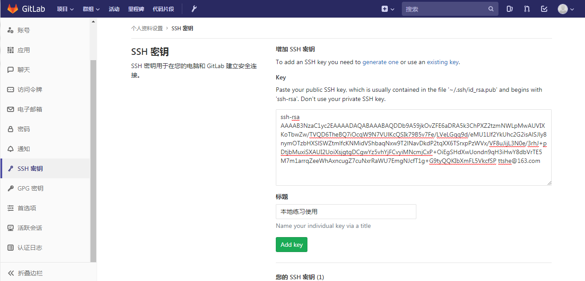

# 部署项目

部署环境要求

安装java

安装maven

安装git

安装docker

所有的服务都部署在192.168.119.132 上，注意配置内存2G以上


## 配置gitLab的SSH免密登录


### 创建公钥

```shell
root@root:~# ssh-keygen -t rsa -C "ttshe@163.com"
Generating public/private rsa key pair.
Enter file in which to save the key (/root/.ssh/id_rsa): 
Created directory '/root/.ssh'.
Enter passphrase (empty for no passphrase): 
Enter same passphrase again: 
Your identification has been saved in /root/.ssh/id_rsa.
Your public key has been saved in /root/.ssh/id_rsa.pub.
The key fingerprint is:
SHA256:D2qEJ+RSJQG+FbHjklpS50MSVvy441+haPJ/01vEBik ttshe@163.com
The key's randomart image is:
+---[RSA 2048]----+
|  ++*o.          |
| o ..=     .     |
|  + Oo  E o      |
| . &.o.  . o     |
|. * B.o S   +    |
| + oo* o + o     |
|. ..o.+ ... .    |
|   +.. .o ..     |
|    .oo. ...     |
+----[SHA256]-----+
root@root:~# 
```


### 拷贝公钥

```shell
root@root:~/.ssh# pwd
/root/.ssh
root@root:~/.ssh# cat id_rsa.pub
ssh-rsa AAAAB3NzaC1yc2EAAAADAQABAAABAQDDb9A59jkOvZFE6aDRA5k3ChPXZ2tzmNWLpMwAUVIXKoTbwZw/TVQD6TheBQ7iOcqW9N7VUlKcQSIk79B5v7Fe/LVeLGqq9d/eMU1Llf2YkUhc2G2isAlSJly8nymOTzbHXSlSWZtmlfcKNMidVShbaqNxw9T2lNavDkdP2tqXX6TSrxpPzWVx/VF8uJijL3N0e/3rhJ+pDtjbMuxiSXAUI2UoiXsjgtgDCgwYz5vhYjFCvyiMNcmjCxP+OiEgSHdXwUondn9qH3iHwY8dbVrTE5M7m1arrqZeeWhAxncugZ7cuNxrRaWU7EmgNJcfT1g+G9tyQQKIbXmFL5VkcfSP ttshe@163.com
```


### 在gitLab上粘贴公钥信息




## 手动方式部署

### 将公共依赖打包到nexus私服

- 需要将公共依赖deploy到私服上

在各个服务的pom中添加私服节点，用于获取公共依赖的jar包

```xml
<repositories>
    <repository>
        <id>mynexus</id>
        <name>Nexus Repository</name>
        <url>http://192.168.119.133:8081/repository/maven-public/</url>
        <snapshots>
            <enabled>true</enabled>
        </snapshots>
        <releases>
            <enabled>true</enabled>
        </releases>
    </repository>
</repositories>
```


### 部署分布式配置中心

#### 添加application-prod.yml

- 将localhost替换为部署的主机的ip，如192.168.119.132

```yml
spring:
  application:
    name: itoken-config
  zipkin:
    base-url: http://192.168.119.132:9411
  boot:
    admin:
      client:
        url: http://192.168.119.132:8084
  cloud:
    config:
      label: master # 分支的名称
      server:
        git:
          uri: http://192.168.119.130:8080/itoken/itoken-config.git # 仓库的名称
          search-paths: respo # 存放配置的文件夹的名称
          username: ttshe
          password: 12345678

server:
  port: 8888 # 默认配置必须是8888，如果要更改需要添加bootstrap.yml，该yml会优先加载

eureka:
  client:
    serviceUrl:
      defaultZone: http://192.168.119.132:8761/eureka/

# 健康检查配置
management:
  endpoint:
    health:
      show-details: always
  endpoints:
    web:
      exposure:
        include: health,info
```


#### 使用git在部署服务器上clone

- 注意将最新的代码推送到gitLab服务器上

```shell
root@root:/usr/local/docker# pwd
/usr/local/docker
root@root:/usr/local/docker# git clone ssh://git@192.168.119.130:2222/itoken/itoken-config.git
```


#### 使用maven命令打包

```shell
root@root:/usr/local/docker/itoken-config# mvn clean package
```


#### 启动jar包测试

```shell
root@root:/usr/local/docker/itoken-config/target# java -jar itoken-config-1.0.0-SNAPSHOT.jar
```

http://192.168.119.132:8888/itoken-admin/dev


#### 编写Dockerfile 并生成镜像

- 先测试拉取镜像openjdk:8-jre 是否成功

```shell
docker pull openjdk:8-jre
```

- 查看私服地址可以使用docker info
- 创建docker文件夹，将jar包拷贝到docker文件夹中

```shell
root@root:/usr/local/docker/itoken-config# mkdir docker
root@root:/usr/local/docker/itoken-config/target# cp itoken-config-1.0.0-SNAPSHOT.jar ../docker/
```

- 在docker文件夹下编写Dockerfile文件

```shell
root@root:/usr/local/docker/itoken-config/docker# cat Dockerfile 
FROM openjdk:8-jre

RUN mkdir /app

COPY itoken-config-1.0.0-SNAPSHOT.jar /app/ # 为什么要拷贝，因为在容器里面的当前文件夹和linux的当前文件夹不是同一个文件夹，需要将jar包拷贝到容器内部文件夹中，执行该文件夹中的jar包

CMD java -jar /app/itoken-config-1.0.0-SNAPSHOT.jar --spring.profiles.active=prod # 与RUN不同，RUN是直接运行，CMD是容器启动后运行

EXPOSE 8888
```

- 生成镜像

```shell
root@root:/usr/local/docker/itoken-config/docker# docker build -t 192.168.119.134:5000/itoken-config .
Sending build context to Docker daemon   49.5MB
Step 1/5 : FROM openjdk:8-jre
 ---> ad64853179c1
Step 2/5 : RUN mkdir /app
 ---> Running in f375e013e2f1
Removing intermediate container f375e013e2f1
 ---> ec8f54538985
Step 3/5 : COPY itoken-config-1.0.0-SNAPSHOT.jar /app/
 ---> 2b406431b7e5
Step 4/5 : CMD java -jar itoken-config-1.0.0-SNAPSHOT.jar --spring.profiles.active=prod
 ---> Running in f86b33aa35df
Removing intermediate container f86b33aa35df
 ---> 5894ca89852e
Step 5/5 : EXPOSE 8888
 ---> Running in 3c92ac5af596
Removing intermediate container 3c92ac5af596
 ---> 17daf3dfafc4
Successfully built 17daf3dfafc4
Successfully tagged 192.168.119.134:5000/itoken-config:latest
```


#### 启动容器测试

```shell
root@root:/usr/local/docker/itoken-config/docker# docker run -p 8888:8888 192.168.119.134:5000/itoken-config
```

- 如果启动失败，查看镜像内部，从内部执行命令启动，看看问题出在哪里

```shell
root@root:/usr/local/docker/itoken-config/docker# docker run -it 192.168.119.134:5000/itoken-config bash
root@5da493a9855e:/app# java -jar itoken-config-1.0.0-SNAPSHOT.jar --spring.profiles.active=prod
```


#### 编写docker-compose.yml

- 在项目的docker文件夹下编写docker-compose.yml文件

```yaml
root@root:/usr/local/docker/itoken-config/docker# cat docker-compose.yml 
version: '3.1'
services: 
  itoken-config:
    restart: always
    image: 192.168.119.134:5000/itoken-config
    container_name: itoken-config
    ports:
      - 8888:8888
```


### 部署服务注册与发现

- 集群最少要有3台
- 难点：eureka的配置主要是端口，如何启动3台使用不同的端口

#### 添加bootstrap-prod.yml

- 需要将原先的application-prod.yml文件修改为bootstrap-prod.yml文件，否则读取不到配置

```yaml
spring:
  cloud: # 通过spring-cloud-config进行获取配置
    config:
      uri: http://192.168.119.132:8888
      name: itoken-eureka
      label: master
      profile: prod
```

在分布式配置中心的respo文件夹下添加itoken-eureka-prod.yml文件

```yaml
spring:
  application:
    name: itoken-eureka
  boot:
    admin:
      client:
        url: http://192.168.119.132:8084
  zipkin:
    base-url: http://192.168.119.132:9411

server:
  port: 8761

eureka:
  instance:
    hostname: 192.168.119.132
  client:
    registerWithEureka: true # 表示自己是否注册到eureka，因为是集群环境，需要自己注册到集群，要开启
    fetchRegistry: true # 表示是否从eureka获取注册信息，如果是单一节点，不需要同步其他eureka节点，可以设置为false，此处是集群，需要设置true
    serviceUrl: # 设置端口，端口设置为区间
      defaultZone: http://192.168.119.132:8761/eureka/,http://192.168.119.132:8861/eureka/,http://192.168.119.132:8961/eureka/

management:
  endpoint:
    health:
      show-details: always
  endpoints:
    web:
      exposure:
        include: health,info
```


#### 打包

先clone项目到本地`git clone ssh://git@192.168.119.130:2222/itoken/itoken-eureka.git`

在项目目录中创建docker文件夹

进行maven打包`mvn clean package`

拷贝jar包到docker文件夹下


#### 编写Dockerfile 并生成镜像

```shell
root@root:/usr/local/docker/itoken-eureka/docker# cat Dockerfile 
FROM openjdk:8-jre

RUN mkdir /app/

COPY itoken-eureka-1.0.0-SNAPSHOT.jar /app/

CMD java -jar /app/itoken-eureka-1.0.0-SNAPSHOT.jar --spring.profiles.active=prod

EXPOSE 8761

root@root:/usr/local/docker/itoken-eureka/docker# docker build -t 192.168.119.134:5000/itoken-eureka .
```


#### 编写docker-compose.yml

- 注意ports是数组，并且数组元素的：号前后不能有空格，但是yaml的格式要求在定义属性时后面要有个空格

```yaml
root@root:/usr/local/docker/itoken-eureka/docker# cat docker-compose.yml 
version: '3.1'
services:
  itoken-eureka-1:
    restart: always
    image: 192.168.119.134:5000/itoken-eureka
    container_name: itoken-eureka-1
    ports:
      - 8761:8761
  
  itoken-eureka-2:
    restart: always
    image: 192.168.119.134:5000/itoken-eureka
    container_name: itoken-eureka-2
    ports:
      - 8861:8761
  
  itoken-eureka-3:
    restart: always
    image: 192.168.119.134:5000/itoken-eureka
    container_name: itoken-eureka-3
    ports:
      - 8961:8761  
```


#### 镜像上传到私服

…