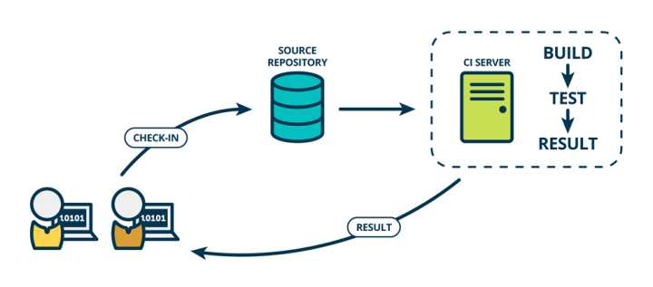

# CICD

互联网软件的开发和发布，已经形成了一套标准流程，最重要的组成部分就是持续集成（Continuous integration，简称 CI）

- 持续集成指的是，频繁地（一天多次）将代码集成到主干
- 持续交付（Continuous delivery）指的是，频繁地将软件的新版本，交付给质量团队或者用户，以供评审。如果评审通过，代码就进入生产阶段。


## 持续集成

持续集成指的是，频繁地（一天多次）将代码集成到主干。它的好处主要有两个：

- 快速发现错误。每完成一点更新，就集成到主干，可以快速发现错误，定位错误也比较容易。
- 防止分支大幅偏离主干。如果不是经常集成，主干又在不断更新，会导致以后集成的难度变大，甚至难以集成。

Martin Fowler 说过，"持续集成并不能消除 Bug，而是让它们非常容易发现和改正。




## 持续交付

持续交付（Continuous delivery）指的是，频繁地将软件的新版本，交付给质量团队或者用户，以供评审。如果评审通过，代码就进入生产阶段。

持续交付可以看作持续集成的下一步。它强调的是，不管怎么更新，软件是随时随地可以交付的。


持续交付在持续集成的基础上，将集成后的代码部署到更贴近真实运行环境的「类生产环境」（production-like environments）中。比如，我们完成单元测试后，可以把代码部署到连接数据库的 Staging 环境中更多的测试。如果代码没有问题，可以继续手动部署到生产环境中。


## 持续部署

持续部署（continuous deployment）是持续交付的下一步，指的是代码通过评审以后，自动部署到生产环境。

持续部署的目标是，代码在任何时刻都是可部署的，可以进入生产阶段。

持续部署的前提是能自动化完成测试、构建、部署等步骤


## 操作流程

### 提交

流程的第一步，是开发者向代码仓库提交代码。所有后面的步骤都始于本地代码的一次提交（commit）


### 测试

代码仓库对 commit 操作配置了钩子（hook），只要提交代码或者合并进主干，就会跑自动化测试。

测试的种类：

- 单元测试：针对函数或模块的测试
- 集成测试：针对整体产品的某个功能的测试，又称功能测试
- 端对端测试：从用户界面直达数据库的全链路测试

第一轮至少要跑单元测试


### 构建

通过第一轮测试，代码就可以合并进主干，就算可以交付了。

交付后，就先进行构建（build），再进入第二轮测试。所谓构建，指的是将源码转换为可以运行的实际代码，比如安装依赖，配置各种资源（样式表、JS脚本、图片）等等。

常用的构建工具如下：

- **Jenkins**
- Travis
- Codeship
- Strider

Jenkins 和 Strider 是开源软件，Travis 和 Codeship 对于开源项目可以免费使用。它们都会将构建和测试，在一次运行中执行完成。


### 测试，第二次

构建完成，就要进行第二轮测试。如果第一轮已经涵盖了所有测试内容，第二轮可以省略，当然，这时构建步骤也要移到第一轮测试前面。

第二轮是全面测试，单元测试和集成测试都会跑，有条件的话，也要做端对端测试。所有测试以自动化为主，少数无法自动化的测试用例，就要人工跑。

需要强调的是，新版本的每一个更新点都必须测试到。如果测试的覆盖率不高，进入后面的部署阶段后，很可能会出现严重的问题。


### 部署

通过了第二轮测试，当前代码就是一个可以直接部署的版本（artifact）。将这个版本的所有文件打包（ tar filename.tar * ）存档，发到生产服务器。

生产服务器将打包文件，解包成本地的一个目录，再将运行路径的符号链接（symlink）指向这个目录，然后重新启动应用。这方面的部署工具有Ansible，Chef，Puppet等。


### 回滚

一旦当前版本发生问题，就要回滚到上一个版本的构建结果。最简单的做法就是修改一下符号链接，指向上一个版本的目录。

在没有docker的情况下，传统方式回滚使用软连接的方式指定对应的目录

docker时，对上线版本打tag，可以回滚到对应的版本


# 使用GitLab持续集成

从 GitLab 8.0 开始，GitLab CI 就已经集成在 GitLab 中，我们只要在项目中添加一个 `.gitlab-ci.yml` 文件，然后添加一个 Runner，即可进行持续集成。 而且随着 GitLab 的升级，GitLab CI 变得越来越强大


## 概念

### 管道 Pipeline 

一次 Pipeline 其实相当于一次构建任务，里面可以包含多个流程，如安装依赖、运行测试、编译、部署测试服务器、部署生产服务器等流程。

任何提交或者 Merge Request 的合并都可以触发 Pipeline，如下所示：

```text
+------------------+           +----------------+
|                  |  trigger  |                |
|   Commit / MR    +---------->+    Pipeline    |
|                  |           |                |
+------------------+           +----------------+
```


### 阶段 Stages 

Stages 表示构建阶段，说白了就是上面提到的流程。我们可以在一次 Pipeline 中定义多个 Stages，这些 Stages 会有以下特点：

- 所有 Stages 会按照顺序运行，即当一个 Stage 完成后，下一个 Stage 才会开始
- 只有当所有 Stages 完成后，该构建任务 (Pipeline) 才会成功
- 如果任何一个 Stage 失败，那么后面的 Stages 不会执行，该构建任务 (Pipeline) 失败

因此，Stages 和 Pipeline 的关系就是

```text
+--------------------------------------------------------+
|                                                        |
|  Pipeline                                              |
|                                                        |
|  +-----------+     +------------+      +------------+  |
|  |  Stage 1  |---->|   Stage 2  |----->|   Stage 3  |  |
|  +-----------+     +------------+      +------------+  |
|                                                        |
+--------------------------------------------------------+
```


### 任务 Job

Jobs 表示构建工作，表示某个 Stage 里面执行的工作。我们可以在 Stages 里面定义多个 Jobs，这些 Jobs 会有以下特点：

- 相同 Stage 中的 Jobs 会并行执行
- 相同 Stage 中的 Jobs 都执行成功时，该 Stage 才会成功
- 如果任何一个 Job 失败，那么该 Stage 失败，即该构建任务 (Pipeline) 失败

所以，Jobs 和 Stage 的关系图就是：

```text
+------------------------------------------+
|                                          |
|  Stage 1                                 |
|                                          |
|  +---------+  +---------+  +---------+   |
|  |  Job 1  |  |  Job 2  |  |  Job 3  |   |
|  +---------+  +---------+  +---------+   |
|                                          |
+------------------------------------------+
```


## 使用 GitLab Runner

理解了上面的基本概念之后，有没有觉得少了些什么东西 —— 由谁来执行这些构建任务呢？ 答案就是 GitLab Runner 了！

想问为什么不是 GitLab CI 来运行那些构建任务？

一般来说，构建任务都会占用很多的系统资源 (譬如编译代码)，而 GitLab CI 又是 GitLab 的一部分，如果由 GitLab CI 来运行构建任务的话，在执行构建任务的时候，GitLab 的性能会大幅下降。

GitLab CI 最大的作用是管理各个项目的构建状态，因此，运行构建任务这种浪费资源的事情就交给 GitLab Runner 来做拉！

因为 GitLab Runner 可以安装到不同的机器上，所以在构建任务运行期间并不会影响到 GitLab 的性能


### docker 部署 GitLab Runner

- 创建工作目录 `/usr/local/docker/runner`
- 创建构建目录 `/usr/local/docker/runner/environment`
- 下载 `jdk-8u152-linux-x64.tar.gz` 并复制到 `/usr/local/docker/runner/environment`

- 检查版本 Runner的版本要与GitLab的版本保持一致
- 在 https://hub.docker.com/r/gitlab/gitlab-runner/tags 选择相近的版本 v11.1.0 


- 在一台虚拟机上创建一个runner目录：/usr/local/docker/runner


#### docker-compose.yml

- 在runner文件夹下创建yml文件

```yaml
version: '3.1'
services:
  gitlab-runner:
    build: environment # environment-->目录的名称
    restart: always
    container_name: gitlab-runner
    privileged: true # 在docker容器中以root角色进行操作
    volumes:
      - /usr/local/docker/runner/config:/etc/gitlab-runner
      - /var/run/docker.sock:/var/run/docker.sock
```

- 在runner目录下添加environment 目录，用于拉取environment目录下的文件生成镜像

- 安装成功后，进入容器，在路径`/home/gitlab-runner/builds/`下查看下载的代码文件


#### Dockerfile

- 在environment 内添加 Dockerfile

```text
FROM gitlab/gitlab-runner:v11.1.0
MAINTAINER stt <stt@qq.com>

# 修改软件源
RUN echo 'deb http://mirrors.aliyun.com/ubuntu/ xenial main restricted universe multiverse' > /etc/apt/sources.list && \
    echo 'deb http://mirrors.aliyun.com/ubuntu/ xenial-security main restricted universe multiverse' >> /etc/apt/sources.list && \
    echo 'deb http://mirrors.aliyun.com/ubuntu/ xenial-updates main restricted universe multiverse' >> /etc/apt/sources.list && \
    echo 'deb http://mirrors.aliyun.com/ubuntu/ xenial-backports main restricted universe multiverse' >> /etc/apt/sources.list && \
    apt-get update -y && \
    apt-get clean

# 安装 Docker
RUN apt-get -y install apt-transport-https ca-certificates curl software-properties-common && \
    curl -fsSL http://mirrors.aliyun.com/docker-ce/linux/ubuntu/gpg | apt-key add - && \
    add-apt-repository "deb [arch=amd64] http://mirrors.aliyun.com/docker-ce/linux/ubuntu $(lsb_release -cs) stable" && \
    apt-get update -y && \
    apt-get install -y docker-ce
COPY daemon.json /etc/docker/daemon.json

# 安装 Docker Compose
WORKDIR /usr/local/bin
RUN wget https://raw.githubusercontent.com/topsale/resources/master/docker/docker-compose
RUN chmod +x docker-compose

# 安装 Java
RUN mkdir -p /usr/local/java
WORKDIR /usr/local/java
COPY jdk-8u152-linux-x64.tar.gz /usr/local/java
RUN tar -zxvf jdk-8u152-linux-x64.tar.gz && \
    rm -fr jdk-8u152-linux-x64.tar.gz

# 安装 Maven
RUN mkdir -p /usr/local/maven
WORKDIR /usr/local/maven
RUN wget https://raw.githubusercontent.com/topsale/resources/master/maven/apache-maven-3.5.3-bin.tar.gz
# COPY apache-maven-3.5.3-bin.tar.gz /usr/local/maven
RUN tar -zxvf apache-maven-3.5.3-bin.tar.gz && \
    rm -fr apache-maven-3.5.3-bin.tar.gz
COPY settings.xml /usr/local/maven/apache-maven-3.5.3/conf/settings.xml # 替换配置文件

# 配置环境变量
ENV JAVA_HOME /usr/local/java/jdk1.8.0_152
ENV MAVEN_HOME /usr/local/maven/apache-maven-3.5.3
ENV PATH $PATH:$JAVA_HOME/bin:$MAVEN_HOME/bin

WORKDIR /
```


#### daemon.json

在 `/usr/local/docker/runner/environment` 目录下创建 `daemon.json`，用于配置加速器和仓库地址

```json
{
  "registry-mirrors": [
    "https://o2qwaqgd.mirror.aliyuncs.com"
  ],
  "insecure-registries": [
    "192.168.119.134:5000"
  ]	
}
```


#### 构建

现有 environment 下的文件如下

```shell
root@root:/usr/local/docker/runner/environment# ll
total 185356
drwxr-xr-x 2 root root      4096 Jul 11 15:33 ./
drwxr-xr-x 3 root root      4096 Jul 11 15:21 ../
-rw-r--r-- 1 root root       135 Jul 11 15:29 daemon.json
-rw-r--r-- 1 root root      2003 Jul 11 15:32 Dockerfile
-rw-r--r-- 1 root root 189784266 Jun 16 09:28 jdk-8u152-linux-x64.tar.gz
```

在 runner文件夹下执行命令

```shell
root@root:/usr/local/docker/runner# docker-compose up -d
```


#### 注册 Runner

- 注册runner信息，使用gitlab-runner命令，参数 register
- 需要给每个项目做集成
- 示例模板如下

```shell
docker exec -it gitlab-runner gitlab-runner register

# 输入 GitLab 地址
Please enter the gitlab-ci coordinator URL (e.g. https://gitlab.com/):
http://192.168.75.146:8080/

# 输入 GitLab Token
Please enter the gitlab-ci token for this runner:
1Lxq_f1NRfCfeNbE5WRh

# 输入 Runner 的说明
Please enter the gitlab-ci description for this runner:
可以为空

# 设置 Tag，可以用于指定在构建规定的 tag 时触发 ci
Please enter the gitlab-ci tags for this runner (comma separated):
deploy

# 这里选择 true ，可以用于代码上传后直接执行
Whether to run untagged builds [true/false]:
true

# 这里选择 false，可以直接回车，默认为 false
Whether to lock Runner to current project [true/false]:
false

# 选择 runner 执行器，这里我们选择的是 shell
Please enter the executor: virtualbox, docker+machine, parallels, shell, ssh, docker-ssh+machine, kubernetes, docker, docker-ssh:
shell
```


##### 集成itoken-eureka

- 打开gitLab选择itoken-eureka项目，进行设置


- 按照要求输入如下

```shell
root@root:/usr/local/docker/runner# docker exec -it gitlab-runner gitlab-runner register
Running in system-mode.                            
                                                   
Please enter the gitlab-ci coordinator URL (e.g. https://gitlab.com/):
http://192.168.119.130:8080/
Please enter the gitlab-ci token for this runner:
NxdjHJRD5pnuAZBB-tkb
Please enter the gitlab-ci description for this runner:
[4ffb19d3d8f2]: 
Please enter the gitlab-ci tags for this runner (comma separated):

Registering runner... succeeded                     runner=NxdjHJRD
Please enter the executor: virtualbox, docker+machine, docker-ssh+machine, kubernetes, docker, docker-ssh, parallels, shell, ssh:
shell
Runner registered successfully. Feel free to start it, but if it's running already the config should be automatically reloaded! 
```

- 设置完成之后可以看到变化


##### 集成itoken-config

同上

##### 集成itoken-dependencies

同上


### 编写.gitlab-ci.yml

- 在itoken-config工程目录下，添加.gitlab-ci.yml文件，示例模板如下

```yaml
stages: # 定义阶段
  - install_deps
  - test
  - build
  - deploy_test
  - deploy_production

cache:
  key: ${CI_BUILD_REF_NAME}
  paths:
    - node_modules/
    - dist/

# 安装依赖
install_deps:
  stage: install_deps
  only:
    - develop
    - master
  script:
    - npm install

# 运行测试用例
test:
  stage: test
  only:
    - develop
    - master
  script:
    - npm run test

# 编译
build:
  stage: build
  only:
    - develop
    - master
  script:
    - npm run clean
    - npm run build:client
    - npm run build:server

# 部署测试服务器
deploy_test:
  stage: deploy_test
  only:
    - develop
  script:
    - pm2 delete app || true
    - pm2 start app.js --name app

# 部署生产服务器
deploy_production:
  stage: deploy_production
  only:
    - master
  script:
    - bash scripts/deploy/deploy.sh
```


#### 入门helloworld

- 添加.gitlab-ci.yml，进行简单测试

```shell
stages: # 定义阶段
  - test

stages-1: # 定义节点对象，自定义名称
  stage: test # 阶段名称，stages依据该名称找到
  script: # 输入执行脚本，该脚本的类型与创建runner时定义保持一致，这里是shell脚本
    - echo "hello world runner"
```

- 提交项目，push项目，在gitLab上查看CI/CD中的流水线


- 点击已通过可以看到执行明细信息
  - 显示项目clone信息到/home/gitlab-runner/builds
  - 注意，这里的目录是在容器中，需要进入容器查看 docker exec -it gitlab-runner bash


```shell
root@root:/home/stt# docker exec -it gitlab-runner bash
root@4ffb19d3d8f2:/home/gitlab-runner/builds/3639250e/0/itoken/itoken-config# ls -l
total 40
-rw-rw-r-- 1 gitlab-runner gitlab-runner    21 Jul 12 06:13 README.md
-rw-rw-r-- 1 gitlab-runner gitlab-runner 20886 Jul 12 06:13 itoken-config.iml
-rw-rw-r-- 1 gitlab-runner gitlab-runner  2613 Jul 12 06:13 pom.xml
drwxrwxr-x 2 gitlab-runner gitlab-runner  4096 Jul 12 06:13 respo
drwxrwxr-x 3 gitlab-runner gitlab-runner  4096 Jul 12 06:13 src
```

- 说明：每次执行push操作后，ci会自动帮助clone最新的代码


#### 自动部署itoken-config


##### 打包

- 修改.gitlab-ci.yml文件

```shell
stages: # 定义阶段
  - package

package: # 定义节点对象，自定义名称
  stage: package # 阶段名称，stages依据该名称找到
  script: # 输入执行脚本，该脚本的类型与创建runner时定义保持一致，这里是shell脚本
    - mvn clean package
```

- 执行结果报错，缺少mvn命令

```shell
Running with gitlab-runner 11.1.0 (081978aa)
  on 4ffb19d3d8f2 3639250e
Using Shell executor...
Running on 4ffb19d3d8f2...
Fetching changes...
HEAD is now at b87fb31 init
From http://192.168.119.130:8080/itoken/itoken-config
   b87fb31..7a34130  master     -> origin/master
Checking out 7a341303 as master...
Skipping Git submodules setup
$ mvn clean package
bash: line 58: mvn: command not found
ERROR: Job failed: exit status 1
```

- 进入容器查看发现安装的mvn是存在的，那么命令没有定义环境变量，因此可以使用全局路径指定命令

```shell
root@4ffb19d3d8f2:/usr/local/maven/apache-maven-3.5.3/bin# pwd
/usr/local/maven/apache-maven-3.5.3/bin
```

- 修改后的.gitlab-ci.yml文件，可以运行成功

```yaml
stages: # 定义阶段
  - package

package: # 定义节点对象，自定义名称
  stage: package # 阶段名称，stages依据该名称找到
  script: # 输入执行脚本，该脚本的类型与创建runner时定义保持一致，这里是shell脚本
    - /usr/local/maven/apache-maven-3.5.3/bin/mvn clean package
```


##### Dockerfile 

- 在项目中创建docker文件夹，在该文件夹中添加该项目的Dockerfile文件

###### 模板

```shell
FROM openjdk:8-jre

MAINTAINER stt <stt@qq.com>

ENV APP_VERSION 1.0.0-SNAPSHOT
ENV DOCKERIZE_VERSION v0.6.1
RUN wget https://github.com/jwilder/dockerize/releases/download/$DOCKERIZE_VERSION/dockerize-linux-amd64-$DOCKERIZE_VERSION.tar.gz \
    && tar -C /usr/local/bin -xzvf dockerize-linux-amd64-$DOCKERIZE_VERSION.tar.gz \
    && rm dockerize-linux-amd64-$DOCKERIZE_VERSION.tar.gz

RUN mkdir /app

COPY itoken-eureka-$APP_VERSION.jar /app/app.jar
ENTRYPOINT ["dockerize", "-timeout", "5m", "-wait", "tcp://192.168.75.128:8888", "java", "-Djava.security.egd=file:/dev/./urandom", "-jar", "/app/app.jar", "--spring.profiles.active=prod"]

EXPOSE 8761
```


###### 关于dockerize

- 监听其他服务有没有启动，用于服务间启动的顺序依赖，等待其他服务启动完成后，再启动指定的服务

- docker-compose有一个depends_on的命令，也是用于定义启动的先后顺序的问题，但是，该命令有一个问题是只关心启动，但是不关心是否启动完成，因此使用dockerize比较好


###### 编写Dockerfile文件

```shell
FROM openjdk:8-jre

MAINTAINER stt <stt@qq.com>

ENV APP_VERSION 1.0.0-SNAPSHOT

RUN mkdir /app

COPY itoken-config-$APP_VERSION.jar /app/app.jar
ENTRYPOINT ["java", "-Djava.security.egd=file:/dev/./urandom", "-jar", "/app/app.jar", "--spring.profiles.active=prod"] # egd表示文件上传时使用的安全参数

EXPOSE 8888
```


##### 编译

```yaml
stages: # 定义阶段
  - package

package: # 定义节点对象，自定义名称
  stage: package # 阶段名称，stages依据该名称找到
  script: # 输入执行脚本，该脚本的类型与创建runner时定义保持一致，这里是shell脚本
    - /usr/local/maven/apache-maven-3.5.3/bin/mvn clean package
    - cp target/itoken-config-1.0.0-SNAPSHOT.jar docker # 当前stage执行完毕，target目录会被删除，需要在当前stage复制jar包
    - cd docker # 生成镜像也必须在该stage完成，再开一个stage时，cp的jar包会被删除
    - docker build -t 192.168.119.134:5000/itoken-config .
```


##### 推送

```yml
stages: # 定义阶段
  - package
  - push

package: # 定义节点对象，自定义名称
  stage: package # 阶段名称，stages依据该名称找到
  script: # 输入执行脚本，该脚本的类型与创建runner时定义保持一致，这里是shell脚本
    - /usr/local/maven/apache-maven-3.5.3/bin/mvn clean package
    - cp target/itoken-config-1.0.0-SNAPSHOT.jar docker # 当前stage执行完毕，target目录会被删除，需要在当前stage复制jar包
    - cd docker # 生成镜像也必须在该stage完成，再开一个stage时，cp的jar包会被删除
    - docker build -t 192.168.119.134:5000/itoken-config .

push:
  stage: push
  script:
    - docker push 192.168.119.134:5000/itoken-config
```

 

##### 运行

###### 编写docker-compose.yml

```yaml
version: '3.1'
services:
  itoken-config:
    restart: always
    image: 192.168.119.134:5000/itoken-config
    container_name: itoken-config
    ports:
      - 8888:8888
```

###### 修改.gitlab-ci.yml

```yaml
stages: # 定义阶段
  - package
  - push
  - run

package: # 定义节点对象，自定义名称
  stage: package # 阶段名称，stages依据该名称找到
  script: # 输入执行脚本，该脚本的类型与创建runner时定义保持一致，这里是shell脚本
    - /usr/local/maven/apache-maven-3.5.3/bin/mvn clean package
    - cp target/itoken-config-1.0.0-SNAPSHOT.jar docker # 当前stage执行完毕，target目录会被删除，需要在当前stage复制jar包
    - cd docker # 生成镜像也必须在该stage完成，再开一个stage时，cp的jar包会被删除
    - docker build -t 192.168.119.134:5000/itoken-config .

push:
  stage: push
  script:
    - docker push 192.168.119.134:5000/itoken-config

run:
  stage: run
  script:
    - cd docker
    - docker-compose down
    - docker-compose up -d
```

- 注意：运行时，需要关闭其他运行的容器，网络ip需要修改

  

##### 清理虚悬镜像

- 在yml中，不能使用`docker image prune`，因为需要交互输入y
- 需要使用`docker rmi $(docker images -q -f dangling=true)`

```yaml
stages: # 定义阶段
  - package
  - push
  - run
  - clean

package: # 定义节点对象，自定义名称
  stage: package # 阶段名称，stages依据该名称找到
  script: # 输入执行脚本，该脚本的类型与创建runner时定义保持一致，这里是shell脚本
    - /usr/local/maven/apache-maven-3.5.3/bin/mvn clean package
    - cp target/itoken-config-1.0.0-SNAPSHOT.jar docker # 当前stage执行完毕，target目录会被删除，需要在当前stage复制jar包
    - cd docker # 生成镜像也必须在该stage完成，再开一个stage时，cp的jar包会被删除
    - docker build -t 192.168.119.134:5000/itoken-config .

push:
  stage: push
  script:
    - docker push 192.168.119.134:5000/itoken-config

run:
  stage: run
  script:
    - cd docker
    - docker-compose down
    - docker-compose up -d

clean:
  stage: clean
  script:
    - docker rmi $(docker images -qf dangling=true)
```


#### 自动部署itoken-eureka

- 在项目目录下建立一个docker文件夹
- 在docker文件夹下创建Dockerfile文件
- 在docker文件夹下创建docker-compose.yml文件
- 在项目目录下创建.gitlab-ci.yml文件


##### Dockerfile

```yaml
FROM openjdk:8-jre

MAINTAINER stt <stt@qq.com>

ENV APP_VERSION 1.0.0-SNAPSHOT

ENV DOCKERIZE_VERSION v0.6.1

RUN wget https://github.com/jwilder/dockerize/releases/download/$DOCKERIZE_VERSION/dockerize-linux-amd64-$DOCKERIZE_VERSION.tar.gz \
    && tar -C /usr/local/bin -xzvf dockerize-linux-amd64-$DOCKERIZE_VERSION.tar.gz \
    && rm dockerize-linux-amd64-$DOCKERIZE_VERSION.tar.gz

RUN mkdir /app

COPY itoken-eureka-$APP_VERSION.jar /app/app.jar

# egd表示文件上传时使用的安全参数
# 查看分布式配置中心是否启动完成
ENTRYPOINT ["dockerize", "-timeout", "5m", "-wait", "http://192.168.119.132:8888/itoken-eureka/master", "java", "-Djava.security.egd=file:/dev/./urandom", "-jar", "/app/app.jar", "--spring.profiles.active=prod"]

EXPOSE 8761
```


##### docker-compose.yml

```yaml
version: '3.1'
services:
  itoken-eureka-1:
    restart: always
    image: 192.168.119.134:5000/itoken-eureka
    container_name: itoken-eureka-1
    ports:
      - 8761:8761
    networks:
      - eureka-network-1

  itoken-eureka-2:
    restart: always
    image: 192.168.119.134:5000/itoken-eureka
    container_name: itoken-eureka-2
    ports:
      - 8861:8761
    networks:
      - eureka-network-2

  itoken-eureka-3:
    restart: always
    image: 192.168.119.134:5000/itoken-eureka
    container_name: itoken-eureka-3
    ports:
      - 8961:8761
    networks:
      - eureka-network-3

networks:
  eureka-network-1:
  eureka-network-2:
  eureka-network-3:

```


##### .gitlab-ci.yml

```yaml
stages: # 定义阶段
  - package
  - push
  - run
  - clean

package: # 定义节点对象，自定义名称
  stage: package # 阶段名称，stages依据该名称找到
  script: # 输入执行脚本，该脚本的类型与创建runner时定义保持一致，这里是shell脚本
    - /usr/local/maven/apache-maven-3.5.3/bin/mvn clean package
    - cp target/itoken-eureka-1.0.0-SNAPSHOT.jar docker # 当前stage执行完毕，target目录会被删除，需要在当前stage复制jar包
    - cd docker # 生成镜像也必须在该stage完成，再开一个stage时，cp的jar包会被删除
    - docker build -t 192.168.119.134:5000/itoken-eureka .

push:
  stage: push
  script:
    - docker push 192.168.119.134:5000/itoken-eureka

run:
  stage: run
  script:
    - cd docker
    - docker-compose down
    - docker-compose up -d

clean:
  stage: clean
  script:
    - docker rmi $(docker images -qf dangling=true)
```


##### 问题：启动失败

- 在容器中启动eureka，可以发现访问http://192.168.119.132:8888 不通
- 需要修改http://192.168.119.132:8888为http://192.168.119.132:8888/itoken-eureka/master确保可以访问

```shell
root@4ffb19d3d8f2:/home/gitlab-runner/builds/1d326cdb/0/itoken/itoken-eureka/docker# docker-compose up 
WARNING: Found orphan containers (itoken-config) for this project. If you removed or renamed this service in your compose file, you can run this command with the --remove-orphans flag to clean it up.
Creating itoken-eureka-2 ... done
Creating itoken-eureka-1 ... done
Creating itoken-eureka-3 ... done
Attaching to itoken-eureka-2, itoken-eureka-1, itoken-eureka-3
itoken-eureka-2    | 2019/07/12 09:22:50 Waiting for: http://192.168.119.132:8888
itoken-eureka-2    | 2019/07/12 09:22:50 Received 404 from http://192.168.119.132:8888. Sleeping 1s
itoken-eureka-1    | 2019/07/12 09:22:50 Waiting for: http://192.168.119.132:8888
itoken-eureka-1    | 2019/07/12 09:22:50 Received 404 from http://192.168.119.132:8888. Sleeping 1s
itoken-eureka-3    | 2019/07/12 09:22:50 Waiting for: http://192.168.119.132:8888
itoken-eureka-3    | 2019/07/12 09:22:50 Received 404 from http://192.168.119.132:8888. Sleeping 1s
itoken-eureka-1    | 2019/07/12 09:22:51 Received 404 from http://192.168.119.132:8888. Sleeping 1s
itoken-eureka-2    | 2019/07/12 09:22:51 Received 404 from http://192.168.119.132:8888. Sleeping 1s
```

- 在执行`docker-compose down`的时候报错
  - 每个docker都会有一个默认的网络名称，docker_default
  - 需要每个docker要设置一个网络名称，在docker-compose.yml文件中配置networks

```shell
$ docker-compose down
Found orphan containers (itoken-config) for this project. If you removed or renamed this service in your compose file, you can run this command with the --remove-orphans flag to clean it up.
Removing network docker_default
error while removing network: network docker_default id 597448da856e61c0a8f65675850ae8462d8639a653d91114430a3de61264aab6 has active endpoints
ERROR: Job failed: exit status 1
```


#### 自动部署itoken-dependencies

- 注意：这里是jar包，不是docker容器部署

- 首先runner和gitLab要关联上

- 编写.gitlab-ci.yml
- 注意maven的settings.xml需要配置私服的密码和用户

```yaml
stages:
  - deploy

deploy:
  stage: deploy
  script:
    - /usr/local/maven/apache-maven-3.5.3/bin/mvn clean deploy
```

