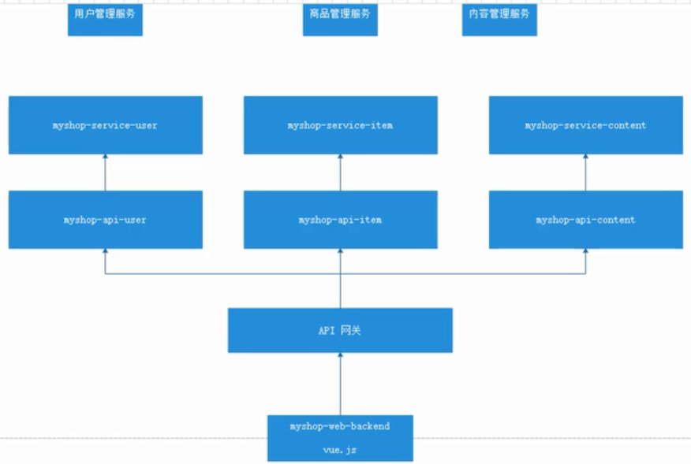

# 服务划分与搭建

实现架构：

动静分离



用户管理

- service-user 用户服务提供者
- web-user 用户服务消费者

商品管理

- web-item 

内容管理

- web-content

网关

- zuul
  - web-content
  - web-item
  - web-user


# 管理员服务

- itoken-service-admin
  - 服务提供者

- itoken-web-admin
  - 服务消费者，动静结合，含有页面

- itoken-api-admin
  - 服务消费者，动静分离，只提供json数据

- itoken-web-backend

  - 管理员服务汇总显示


## 创建服务提供者

- 创建一个名为 `itoken-service-admin` 的服务提供者项目
- 需要使用mybatis自动生成插件生成代码

### pom

```xml
<?xml version="1.0" encoding="UTF-8"?>
<project xmlns="http://maven.apache.org/POM/4.0.0" xmlns:xsi="http://www.w3.org/2001/XMLSchema-instance"
         xsi:schemaLocation="http://maven.apache.org/POM/4.0.0 http://maven.apache.org/xsd/maven-4.0.0.xsd">
    <modelVersion>4.0.0</modelVersion>

    <parent>
        <groupId>com.stt</groupId>
        <artifactId>itoken-dependencies</artifactId>
        <version>1.0.0-SNAPSHOT</version>
        <relativePath>../itoken-dependencies/pom.xml</relativePath>
    </parent>

    <artifactId>itoken-service-admin</artifactId>
    <packaging>jar</packaging>
    <name>${artifactId}</name>

    <dependencies>
        <dependency>
            <groupId>com.stt</groupId>
            <artifactId>itoken-common-service</artifactId>
            <version>${project.parent.version}</version>
        </dependency>
        <dependency>
            <groupId>org.springframework.boot</groupId>
            <artifactId>spring-boot-starter-test</artifactId>
            <scope>test</scope>
        </dependency>
    </dependencies>

    <build>
        <plugins>
            <plugin>
                <groupId>org.springframework.boot</groupId>
                <artifactId>spring-boot-maven-plugin</artifactId>
                <configuration>
                    <mainClass>com.stt.itoken.service.admin.ServiceAdminApplication</mainClass>
                </configuration>
            </plugin>
            <plugin>
                <groupId>org.mybatis.generator</groupId>
                <artifactId>mybatis-generator-maven-plugin</artifactId>
                <version>1.3.7</version>
                <configuration>
                    <configurationFile>${basedir}/src/main/resources/generator/generatorConfig.xml</configurationFile>
                    <overwrite>true</overwrite>
                    <verbose>true</verbose>
                </configuration>
                <dependencies>
                    <dependency>
                        <groupId>mysql</groupId>
                        <artifactId>mysql-connector-java</artifactId>
                        <version>${mysql.version}</version>
                    </dependency>
                    <dependency>
                        <groupId>tk.mybatis</groupId>
                        <artifactId>mapper</artifactId>
                        <version>3.4.4</version>
                    </dependency>
                </dependencies>
            </plugin>
        </plugins>
    </build>
</project>
```


### 编写mysql-compose.yml

- 需要给每个服务创建数据库
- 注意compose配置的服务名，容器名，以及数据卷的路径

```yaml
version: '3.1'
services:
  mysql-itoken-service-admin:
    restart: always
    image: mysql:5.7.22
    container_name: mysql-itoken-service-admin
    ports:
      - 3306:3306
    environment:
      TZ: Asia/Shanghai
      MYSQL_ROOT_PASSWORD: 123456
    command:
      --character-set-server=utf8mb4
      --collation-server=utf8mb4_general_ci
      --explicit_defaults_for_timestamp=true
      --lower_case_table_names=1
      --max_allowed_packet=128M
      --sql-mode="STRICT_TRANS_TABLES,NO_AUTO_CREATE_USER,NO_ENGINE_SUBSTITUTION,NO_ZERO_DATE,NO_ZERO_IN_DATE,ERROR_FOR_DIVISION_BY_ZERO"
    volumes:
      - /usr/local/docker/mysql/itoken-serivce-admin/data:/var/lib/mysql
```


### 数据库脚本

```sql
/*
SQLyog  v12.2.6 (64 bit)
MySQL - 5.7.22 : Database - itoken-service-admin
*********************************************************************
*/


/*!40101 SET NAMES utf8 */;

/*!40101 SET SQL_MODE=''*/;

/*!40014 SET @OLD_UNIQUE_CHECKS=@@UNIQUE_CHECKS, UNIQUE_CHECKS=0 */;
/*!40014 SET @OLD_FOREIGN_KEY_CHECKS=@@FOREIGN_KEY_CHECKS, FOREIGN_KEY_CHECKS=0 */;
/*!40101 SET @OLD_SQL_MODE=@@SQL_MODE, SQL_MODE='NO_AUTO_VALUE_ON_ZERO' */;
/*!40111 SET @OLD_SQL_NOTES=@@SQL_NOTES, SQL_NOTES=0 */;
CREATE DATABASE /*!32312 IF NOT EXISTS*/`itoken-service-admin` /*!40100 DEFAULT CHARACTER SET utf8mb4 */;

USE `itoken-service-admin`;

DROP TABLE IF EXISTS tb_sys_user;

-- 管理员表
CREATE TABLE tb_sys_user
(
	user_code varchar(100) NOT NULL COMMENT '用户编码',
	login_code varchar(100) NOT NULL COMMENT '登录账号',
	user_name varchar(100) NOT NULL COMMENT '用户昵称',
	password varchar(100) NOT NULL COMMENT '登录密码',
	email varchar(300) COMMENT '电子邮箱',
	mobile varchar(100) COMMENT '手机号码',
	phone varchar(100) COMMENT '办公电话',
	sex char(1) COMMENT '用户性别',
	avatar varchar(1000) COMMENT '头像路径',
	sign varchar(200) COMMENT '个性签名',
	wx_openid varchar(100) COMMENT '绑定的微信号',
	mobile_imei varchar(100) COMMENT '绑定的手机串号',
	user_type varchar(16) NOT NULL COMMENT '用户类型',
	ref_code varchar(64) COMMENT '用户类型引用编号',
	ref_name varchar(100) COMMENT '用户类型引用姓名',
	mgr_type char(1) NOT NULL COMMENT '管理员类型（0非管理员 1系统管理员  2二级管理员）',
	pwd_security_level decimal(1) COMMENT '密码安全级别（0初始 1很弱 2弱 3安全 4很安全）',
	pwd_update_date datetime COMMENT '密码最后更新时间',
	pwd_update_record varchar(1000) COMMENT '密码修改记录',
	pwd_question varchar(200) COMMENT '密保问题',
	pwd_question_answer varchar(200) COMMENT '密保问题答案',
	pwd_question_2 varchar(200) COMMENT '密保问题2',
	pwd_question_answer_2 varchar(200) COMMENT '密保问题答案2',
	pwd_question_3 varchar(200) COMMENT '密保问题3',
	pwd_question_answer_3 varchar(200) COMMENT '密保问题答案3',
	pwd_quest_update_date datetime COMMENT '密码问题修改时间',
	last_login_ip varchar(100) COMMENT '最后登陆IP',
	last_login_date datetime COMMENT '最后登陆时间',
	freeze_date datetime COMMENT '冻结时间',
	freeze_cause varchar(200) COMMENT '冻结原因',
	user_weight decimal(8) DEFAULT 0 COMMENT '用户权重（降序）',
	status char NOT NULL COMMENT '状态（0正常 1删除 2停用 3冻结）',
	create_by varchar(64) NOT NULL COMMENT '创建者',
	create_date datetime NOT NULL COMMENT '创建时间',
	update_by varchar(64) NOT NULL COMMENT '更新者',
	update_date datetime NOT NULL COMMENT '更新时间',
	remarks varchar(500) COMMENT '备注信息',
	corp_code varchar(64) DEFAULT '0' NOT NULL COMMENT '归属集团Code',
	corp_name varchar(100) DEFAULT 'iToken' NOT NULL COMMENT '归属集团Name',
	extend_s1 varchar(500) COMMENT '扩展 String 1',
	extend_s2 varchar(500) COMMENT '扩展 String 2',
	extend_s3 varchar(500) COMMENT '扩展 String 3',
	extend_s4 varchar(500) COMMENT '扩展 String 4',
	extend_s5 varchar(500) COMMENT '扩展 String 5',
	extend_s6 varchar(500) COMMENT '扩展 String 6',
	extend_s7 varchar(500) COMMENT '扩展 String 7',
	extend_s8 varchar(500) COMMENT '扩展 String 8',
	extend_i1 decimal(19) COMMENT '扩展 Integer 1',
	extend_i2 decimal(19) COMMENT '扩展 Integer 2',
	extend_i3 decimal(19) COMMENT '扩展 Integer 3',
	extend_i4 decimal(19) COMMENT '扩展 Integer 4',
	extend_f1 decimal(19,4) COMMENT '扩展 Float 1',
	extend_f2 decimal(19,4) COMMENT '扩展 Float 2',
	extend_f3 decimal(19,4) COMMENT '扩展 Float 3',
	extend_f4 decimal(19,4) COMMENT '扩展 Float 4',
	extend_d1 datetime COMMENT '扩展 Date 1',
	extend_d2 datetime COMMENT '扩展 Date 2',
	extend_d3 datetime COMMENT '扩展 Date 3',
	extend_d4 datetime COMMENT '扩展 Date 4',
	PRIMARY KEY (user_code)
) COMMENT = '用户表';

CREATE INDEX idx_sys_user_lc ON tb_sys_user (login_code ASC);
CREATE INDEX idx_sys_user_email ON tb_sys_user (email ASC);
CREATE INDEX idx_sys_user_mobile ON tb_sys_user (mobile ASC);
CREATE INDEX idx_sys_user_wo ON tb_sys_user (wx_openid ASC);
CREATE INDEX idx_sys_user_imei ON tb_sys_user (mobile_imei ASC);
CREATE INDEX idx_sys_user_rt ON tb_sys_user (user_type ASC);
CREATE INDEX idx_sys_user_rc ON tb_sys_user (ref_code ASC);
CREATE INDEX idx_sys_user_mt ON tb_sys_user (mgr_type ASC);
CREATE INDEX idx_sys_user_us ON tb_sys_user (user_weight ASC);
CREATE INDEX idx_sys_user_ud ON tb_sys_user (update_date ASC);
CREATE INDEX idx_sys_user_status ON tb_sys_user (status ASC);
CREATE INDEX idx_sys_user_cc ON tb_sys_user (corp_code ASC);
```


### application

```java
package com.stt.itoken.service.admin;

import org.springframework.boot.SpringApplication;
import org.springframework.boot.autoconfigure.SpringBootApplication;
import org.springframework.cloud.netflix.eureka.EnableEurekaClient;
import tk.mybatis.spring.annotation.MapperScan;

/**
 * Created by Administrator on 2019/7/14.
 */
@SpringBootApplication
@EnableEurekaClient
@MapperScan(basePackages = "com.stt.itoken.service.admin.mapper")
public class ServiceAdminApplication {
	public static void main(String[] args) {
		SpringApplication.run(ServiceAdminApplication.class,args);
	}
}
```


### controller

```java
package com.stt.itoken.service.admin.controller;

import com.google.common.collect.Lists;
import com.stt.itoken.common.dto.BaseResult;
import com.stt.itoken.service.admin.domain.TbSysUser;
import com.stt.itoken.service.admin.service.AdminService;
import org.springframework.beans.factory.annotation.Autowired;
import org.springframework.util.StringUtils;
import org.springframework.web.bind.annotation.GetMapping;
import org.springframework.web.bind.annotation.RestController;

import java.util.Objects;
import java.util.Optional;

/**
 * Created by Administrator on 2019/7/14.
 */

@RestController
public class AdminController {

	@Autowired
	private AdminService adminService;

	@GetMapping("login")
	public BaseResult login(String loginCode,String password){
		Optional<BaseResult> re = checkLogin(loginCode,password);
		if(re.isPresent()){
			return re.get();
		}

		TbSysUser user = adminService.login(loginCode, password);
		if(!Objects.isNull(user)){
			return BaseResult.ok(user);
		}
		return BaseResult.notOk(
					Lists.newArrayList(
						BaseResult.Error.builder().field("").message("登录失败").build()));
	}

	private Optional<BaseResult> checkLogin(String loginCode, String password) {
		return StringUtils.isEmpty(loginCode) || StringUtils.isEmpty(password) ?
				Optional.ofNullable(BaseResult.notOk(
					Lists.newArrayList(
							new BaseResult.Error("loginCode","用户名或密码错误"),
							new BaseResult.Error("password","用户名或密码错误")
					))) : Optional.empty();
	}

}
```

### service

```java
package com.stt.itoken.service.admin.service;

import com.stt.itoken.service.admin.domain.TbSysUser;
import com.stt.itoken.service.admin.mapper.TbSysUserMapper;
import org.springframework.beans.factory.annotation.Autowired;
import org.springframework.stereotype.Service;
import org.springframework.transaction.annotation.Transactional;
import org.springframework.util.DigestUtils;
import tk.mybatis.mapper.entity.Example;

import java.util.Objects;


/**
 * Created by Administrator on 2019/7/14.
 */
@Service
public class AdminService {


	@Autowired
	private TbSysUserMapper userMapper;

	/**
	 * 注册
	 * @param user
	 */
	@Transactional(rollbackFor = Throwable.class)
	public void register(TbSysUser user){
		user.setPassword(DigestUtils.md5DigestAsHex(user.getPassword().getBytes()));
		userMapper.insert(user);
	}

	/**
	 * 登录
	 * @param loginCode 账号
	 * @param plantPassword 明文密码
	 * @return
	 */
	public TbSysUser login(String loginCode,String plantPassword){

		Example example = new Example(TbSysUser.class);
		example.createCriteria().andEqualTo("loginCode", loginCode);

		TbSysUser user = userMapper.selectOneByExample(example);
		if(Objects.isNull(user)){
			return null;
		}
		if(Objects.equals(DigestUtils.md5DigestAsHex(plantPassword.getBytes()),user.getPassword())){
			return user;
		}
		return null;
	}
}
```

### bootstrap.yml

- dev

```yaml
spring:
  cloud: # 通过spring-cloud-config进行获取配置
    config:
      uri: http://localhost:8888
      name: itoken-service-admin
      label: master
      profile: dev
```

- prod

```yaml
spring:
  cloud: # 通过spring-cloud-config进行获取配置
    config:
      uri: http://192.168.119.132:8888
      name: itoken-service-admin
      label: master
      profile: prod
```


## 创建common-service

- 服务提供者需要和数据库打交道，需要在common中集成数据库的操作

### pom

```xml
<?xml version="1.0" encoding="UTF-8"?>
<project xmlns="http://maven.apache.org/POM/4.0.0" xmlns:xsi="http://www.w3.org/2001/XMLSchema-instance"
         xsi:schemaLocation="http://maven.apache.org/POM/4.0.0 http://maven.apache.org/xsd/maven-4.0.0.xsd">
    <modelVersion>4.0.0</modelVersion>

    <parent>
        <groupId>com.stt</groupId>
        <artifactId>itoken-dependencies</artifactId>
        <version>1.0.0-SNAPSHOT</version>
        <relativePath>../itoken-dependencies/pom.xml</relativePath>
    </parent>

    <artifactId>itoken-common-service</artifactId>
    <packaging>jar</packaging>
    <name>${artifactId}</name>

    <dependencies>

        <dependency>
            <groupId>com.stt</groupId>
            <artifactId>itoken-common</artifactId>
            <version>${project.parent.version}</version>
        </dependency>

        <!-- Spring Boot Begin -->
        <dependency>
            <groupId>org.springframework.boot</groupId>
            <artifactId>spring-boot-starter-test</artifactId>
            <scope>test</scope>
        </dependency>
        <dependency>
            <groupId>org.springframework.boot</groupId>
            <artifactId>spring-boot-starter-actuator</artifactId>
        </dependency>
        <!-- Spring Boot End -->

        <!-- Spring Cloud Begin -->
        <dependency>
            <groupId>org.springframework.cloud</groupId>
            <artifactId>spring-cloud-starter-netflix-eureka-server</artifactId>
        </dependency>
        <dependency>
            <groupId>org.springframework.cloud</groupId>
            <artifactId>spring-cloud-starter-zipkin</artifactId>
        </dependency>
        <dependency>
            <groupId>de.codecentric</groupId>
            <artifactId>spring-boot-admin-starter-client</artifactId>
        </dependency>
        <dependency>
            <groupId>org.springframework.cloud</groupId>
            <artifactId>spring-cloud-starter-config</artifactId>
        </dependency>
        <!-- Spring Cloud End -->

        <!--database conifg-->
        <dependency>
            <groupId>com.alibaba</groupId>
            <artifactId>druid-spring-boot-starter</artifactId>
        </dependency>

        <dependency>
            <groupId>mysql</groupId>
            <artifactId>mysql-connector-java</artifactId>
            <scope>runtime</scope>
        </dependency>

        <dependency>
            <groupId>tk.mybatis</groupId>
            <artifactId>mapper-spring-boot-starter</artifactId>
        </dependency>

        <dependency>
            <groupId>com.github.pagehelper</groupId>
            <artifactId>pagehelper-spring-boot-starter</artifactId>
        </dependency>
    </dependencies>

</project>
```

添加一个tk.mybaits的公共mapper

```java
package tk.mybatis.mapper;

import tk.mybatis.mapper.common.Mapper;
import tk.mybatis.mapper.common.MySqlMapper;

/**
 * 自己的 Mapper
 * 特别注意，该接口不能被扫描到，否则会出错
 */
public interface TkMapper<T> extends
		Mapper<T>,
		MySqlMapper<T> {
}
```


## 创建common

- 存放工具类，公用组件

### pom

```xml
<?xml version="1.0" encoding="UTF-8"?>
<project xmlns="http://maven.apache.org/POM/4.0.0" xmlns:xsi="http://www.w3.org/2001/XMLSchema-instance"
         xsi:schemaLocation="http://maven.apache.org/POM/4.0.0 http://maven.apache.org/xsd/maven-4.0.0.xsd">
    <modelVersion>4.0.0</modelVersion>

    <parent>
        <groupId>com.stt</groupId>
        <artifactId>itoken-dependencies</artifactId>
        <version>1.0.0-SNAPSHOT</version>
        <relativePath>../itoken-dependencies/pom.xml</relativePath>
    </parent>

    <artifactId>itoken-common</artifactId>
    <packaging>jar</packaging>
    <name>${artifactId}</name>

    <dependencies>
        <dependency>
            <groupId>org.projectlombok</groupId>
            <artifactId>lombok</artifactId>
        </dependency>

        <dependency>
            <groupId>com.google.guava</groupId>
            <artifactId>guava</artifactId>
        </dependency>

        <dependency>
            <groupId>com.fasterxml.jackson.core</groupId>
            <artifactId>jackson-databind</artifactId>
        </dependency>

        <dependency>
            <groupId>javax.servlet</groupId>
            <artifactId>javax.servlet-api</artifactId>
        </dependency>

    </dependencies>

</project>
```


### BaseResult

- 用于返回通用结果

```java
package com.stt.itoken.common.dto;

import com.stt.itoken.common.constants.HttpStatusConstant;
import lombok.AllArgsConstructor;
import lombok.Builder;
import lombok.Data;
import java.util.List;

@Data
@Builder
public class BaseResult {

	// ok / not_ok
	private String result;
	private Object data;
	private String success;
	private List<Error> errors;

	public static BaseResult createResult(String result,Object data,String success,List<Error> errors){
		return BaseResult.builder()
				.result(result)
				.data(data)
				.success(success)
				.errors(errors)
				.build();
	}

	public static BaseResult ok(Object data){
		return BaseResult.createResult("ok",data,"成功操作",null);
	}

	public static BaseResult ok(){
		return BaseResult.ok(null);
	}

	public static BaseResult notOk(List<Error> errors){
		return BaseResult.createResult("not_ok",null,"",errors);
	}

	@Data
	@Builder
	@AllArgsConstructor
	public static class Cursor {
		private int total;
		private int offset;
		private int limit;
	}

	@Data
	@Builder
	@AllArgsConstructor
	public static class Error {
		private String field;
		private String message;

		public static Error fromHttpStatus(HttpStatusConstant s){
			return new Error(s.getStatus()+"",s.getContent());
		}

	}
}
```


### CookieUtils

```java
package com.stt.itoken.common.utils;

import java.net.URLDecoder;
import javax.servlet.http.Cookie;
import javax.servlet.http.HttpServletRequest;
import javax.servlet.http.HttpServletResponse;
import java.io.UnsupportedEncodingException;
import java.net.URLDecoder;
import java.net.URLEncoder;

public final class CookieUtils {

    /**
     * 得到Cookie的值, 不编码
     *
     * @param request
     * @param cookieName
     * @return
     */
    public static String getCookieValue(HttpServletRequest request, String cookieName) {
        return getCookieValue(request, cookieName, false);
    }

    /**
     * 得到Cookie的值,
     *
     * @param request
     * @param cookieName
     * @return
     */
    public static String getCookieValue(HttpServletRequest request, String cookieName, boolean isDecoder) {
        Cookie[] cookieList = request.getCookies();
        if (cookieList == null || cookieName == null) {
            return null;
        }
        String retValue = null;
        try {
            for (int i = 0; i < cookieList.length; i++) {
                if (cookieList[i].getName().equals(cookieName)) {
                    if (isDecoder) {
                        retValue = URLDecoder.decode(cookieList[i].getValue(), "UTF-8");
                    } else {
                        retValue = cookieList[i].getValue();
                    }
                    break;
                }
            }
        } catch (UnsupportedEncodingException e) {
            e.printStackTrace();
        }
        return retValue;
    }

    /**
     * 得到Cookie的值,
     *
     * @param request
     * @param cookieName
     * @return
     */
    public static String getCookieValue(HttpServletRequest request, String cookieName, String encodeString) {
        Cookie[] cookieList = request.getCookies();
        if (cookieList == null || cookieName == null) {
            return null;
        }
        String retValue = null;
        try {
            for (int i = 0; i < cookieList.length; i++) {
                if (cookieList[i].getName().equals(cookieName)) {
                    retValue = URLDecoder.decode(cookieList[i].getValue(), encodeString);
                    break;
                }
            }
        } catch (UnsupportedEncodingException e) {
            e.printStackTrace();
        }
        return retValue;
    }

    /**
     * 设置Cookie的值 不设置生效时间默认浏览器关闭即失效,也不编码
     */
    public static void setCookie(HttpServletRequest request, HttpServletResponse response, String cookieName,
                                 String cookieValue) {
        setCookie(request, response, cookieName, cookieValue, -1);
    }

    /**
     * 设置Cookie的值 在指定时间内生效,但不编码
     */
    public static void setCookie(HttpServletRequest request, HttpServletResponse response, String cookieName,
                                 String cookieValue, int cookieMaxage) {
        setCookie(request, response, cookieName, cookieValue, cookieMaxage, false);
    }

    /**
     * 设置Cookie的值 不设置生效时间,但编码
     */
    public static void setCookie(HttpServletRequest request, HttpServletResponse response, String cookieName,
                                 String cookieValue, boolean isEncode) {
        setCookie(request, response, cookieName, cookieValue, -1, isEncode);
    }

    /**
     * 设置Cookie的值 在指定时间内生效, 编码参数
     */
    public static void setCookie(HttpServletRequest request, HttpServletResponse response, String cookieName,
                                 String cookieValue, int cookieMaxage, boolean isEncode) {
        doSetCookie(request, response, cookieName, cookieValue, cookieMaxage, isEncode);
    }

    /**
     * 设置Cookie的值 在指定时间内生效, 编码参数(指定编码)
     */
    public static void setCookie(HttpServletRequest request, HttpServletResponse response, String cookieName,
                                 String cookieValue, int cookieMaxage, String encodeString) {
        doSetCookie(request, response, cookieName, cookieValue, cookieMaxage, encodeString);
    }

    /**
     * 删除Cookie带cookie域名
     */
    public static void deleteCookie(HttpServletRequest request, HttpServletResponse response,
                                    String cookieName) {
        doSetCookie(request, response, cookieName, "", -1, false);
    }

    /**
     * 设置Cookie的值，并使其在指定时间内生效
     *
     * @param cookieMaxage cookie生效的最大秒数
     */
    private static final void doSetCookie(HttpServletRequest request, HttpServletResponse response,
                                          String cookieName, String cookieValue, int cookieMaxage, boolean isEncode) {
        try {
            if (cookieValue == null) {
                cookieValue = "";
            } else if (isEncode) {
                cookieValue = URLEncoder.encode(cookieValue, "utf-8");
            }
            Cookie cookie = new Cookie(cookieName, cookieValue);
            if (cookieMaxage > 0)
                cookie.setMaxAge(cookieMaxage);
            if (null != request) {// 设置域名的cookie
                String domainName = getDomainName(request);
//                System.out.println(domainName);
                if (!"localhost".equals(domainName)) {
                    cookie.setDomain(domainName);
                }
            }
            cookie.setPath("/");
            response.addCookie(cookie);
        } catch (Exception e) {
            e.printStackTrace();
        }
    }

    /**
     * 设置Cookie的值，并使其在指定时间内生效
     *
     * @param cookieMaxage cookie生效的最大秒数
     */
    private static final void doSetCookie(HttpServletRequest request, HttpServletResponse response,
                                          String cookieName, String cookieValue, int cookieMaxage, String encodeString) {
        try {
            if (cookieValue == null) {
                cookieValue = "";
            } else {
                cookieValue = URLEncoder.encode(cookieValue, encodeString);
            }
            Cookie cookie = new Cookie(cookieName, cookieValue);
            if (cookieMaxage > 0)
                cookie.setMaxAge(cookieMaxage);
            if (null != request) {// 设置域名的cookie
                String domainName = getDomainName(request);
//                System.out.println(domainName);
                if (!"localhost".equals(domainName)) {
                    cookie.setDomain(domainName);
                }
            }
            cookie.setPath("/");
            response.addCookie(cookie);
        } catch (Exception e) {
            e.printStackTrace();
        }
    }

    /**
     * 得到cookie的域名
     */
    private static final String getDomainName(HttpServletRequest request) {
        String domainName = null;

        String serverName = request.getRequestURL().toString();
        if (serverName == null || serverName.equals("")) {
            domainName = "";
        } else {
            serverName = serverName.toLowerCase();
            serverName = serverName.substring(7);
            final int end = serverName.indexOf("/");
            serverName = serverName.substring(0, end);
            final String[] domains = serverName.split("\\.");
            int len = domains.length;
            if (len > 3) {
                // www.xxx.com.cn
                domainName = "." + domains[len - 3] + "." + domains[len - 2] + "." + domains[len - 1];
            } else if (len <= 3 && len > 1) {
                // xxx.com or xxx.cn
                domainName = "." + domains[len - 2] + "." + domains[len - 1];
            } else {
                domainName = serverName;
            }
        }

        if (domainName != null && domainName.indexOf(":") > 0) {
            String[] ary = domainName.split("\\:");
            domainName = ary[0];
        }
        return domainName;
    }

}
```


### MapperUtils

```java
package com.stt.itoken.common.utils;

import com.fasterxml.jackson.annotation.JsonInclude;
import com.fasterxml.jackson.core.type.TypeReference;
import com.fasterxml.jackson.databind.DeserializationFeature;
import com.fasterxml.jackson.databind.JavaType;
import com.fasterxml.jackson.databind.ObjectMapper;

import java.util.ArrayList;
import java.util.HashMap;
import java.util.List;
import java.util.Map;

/**
 * Jackson 工具类
 * <p>Title: MapperUtils</p>
 * <p>Description: </p>
 *
 * @author Lusifer
 * @version 1.0.0
 * @date 2018/3/4 21:50
 */
public class MapperUtils {
    private final static ObjectMapper objectMapper = new ObjectMapper();

    public static ObjectMapper getInstance() {
        return objectMapper;
    }

    /**
     * 转换为 JSON 字符串
     *
     * @param obj
     * @return
     * @throws Exception
     */
    public static String obj2json(Object obj) throws Exception {
        return objectMapper.writeValueAsString(obj);
    }

    /**
     * 转换为 JSON 字符串，忽略空值
     *
     * @param obj
     * @return
     * @throws Exception
     */
    public static String obj2jsonIgnoreNull(Object obj) throws Exception {
        ObjectMapper mapper = new ObjectMapper();
        mapper.setSerializationInclusion(JsonInclude.Include.NON_NULL);
        return mapper.writeValueAsString(obj);
    }

    /**
     * 转换为 JavaBean
     *
     * @param jsonString
     * @param clazz
     * @return
     * @throws Exception
     */
    public static <T> T json2pojo(String jsonString, Class<T> clazz) throws Exception {
        objectMapper.configure(DeserializationFeature.ACCEPT_SINGLE_VALUE_AS_ARRAY, true);
        return objectMapper.readValue(jsonString, clazz);
    }

    /**
     * 字符串转换为 Map<String, Object>
     *
     * @param jsonString
     * @return
     * @throws Exception
     */
    public static <T> Map<String, Object> json2map(String jsonString) throws Exception {
        ObjectMapper mapper = new ObjectMapper();
        mapper.setSerializationInclusion(JsonInclude.Include.NON_NULL);
        return mapper.readValue(jsonString, Map.class);
    }

    /**
     * 字符串转换为 Map<String, T>
     */
    public static <T> Map<String, T> json2map(String jsonString, Class<T> clazz) throws Exception {
        Map<String, Map<String, Object>> map = objectMapper.readValue(jsonString, new TypeReference<Map<String, T>>() {
        });
        Map<String, T> result = new HashMap<String, T>();
        for (Map.Entry<String, Map<String, Object>> entry : map.entrySet()) {
            result.put(entry.getKey(), map2pojo(entry.getValue(), clazz));
        }
        return result;
    }

    /**
     * 深度转换 JSON 成 Map
     *
     * @param json
     * @return
     */
    public static Map<String, Object> json2mapDeeply(String json) throws Exception {
        return json2MapRecursion(json, objectMapper);
    }

    /**
     * 把 JSON 解析成 List，如果 List 内部的元素存在 jsonString，继续解析
     *
     * @param json
     * @param mapper 解析工具
     * @return
     * @throws Exception
     */
    private static List<Object> json2ListRecursion(String json, ObjectMapper mapper) throws Exception {
        if (json == null) {
            return null;
        }

        List<Object> list = mapper.readValue(json, List.class);

        for (Object obj : list) {
            if (obj != null && obj instanceof String) {
                String str = (String) obj;
                if (str.startsWith("[")) {
                    obj = json2ListRecursion(str, mapper);
                } else if (obj.toString().startsWith("{")) {
                    obj = json2MapRecursion(str, mapper);
                }
            }
        }

        return list;
    }

    /**
     * 把 JSON 解析成 Map，如果 Map 内部的 Value 存在 jsonString，继续解析
     *
     * @param json
     * @param mapper
     * @return
     * @throws Exception
     */
    private static Map<String, Object> json2MapRecursion(String json, ObjectMapper mapper) throws Exception {
        if (json == null) {
            return null;
        }

        Map<String, Object> map = mapper.readValue(json, Map.class);

        for (Map.Entry<String, Object> entry : map.entrySet()) {
            Object obj = entry.getValue();
            if (obj != null && obj instanceof String) {
                String str = ((String) obj);

                if (str.startsWith("[")) {
                    List<?> list = json2ListRecursion(str, mapper);
                    map.put(entry.getKey(), list);
                } else if (str.startsWith("{")) {
                    Map<String, Object> mapRecursion = json2MapRecursion(str, mapper);
                    map.put(entry.getKey(), mapRecursion);
                }
            }
        }

        return map;
    }

    /**
     * 将 JSON 数组转换为集合
     *
     * @param jsonArrayStr
     * @param clazz
     * @return
     * @throws Exception
     */
    public static <T> List<T> json2list(String jsonArrayStr, Class<T> clazz) throws Exception {
        JavaType javaType = getCollectionType(ArrayList.class, clazz);
        List<T> list = (List<T>) objectMapper.readValue(jsonArrayStr, javaType);
        return list;
    }


    /**
     * 获取泛型的 Collection Type
     *
     * @param collectionClass 泛型的Collection
     * @param elementClasses  元素类
     * @return JavaType Java类型
     * @since 1.0
     */
    public static JavaType getCollectionType(Class<?> collectionClass, Class<?>... elementClasses) {
        return objectMapper.getTypeFactory().constructParametricType(collectionClass, elementClasses);
    }

    /**
     * 将 Map 转换为 JavaBean
     *
     * @param map
     * @param clazz
     * @return
     */
    public static <T> T map2pojo(Map map, Class<T> clazz) {
        return objectMapper.convertValue(map, clazz);
    }

    /**
     * 将 Map 转换为 JSON
     *
     * @param map
     * @return
     */
    public static String mapToJson(Map map) {
        try {
            return objectMapper.writeValueAsString(map);
        } catch (Exception e) {
            e.printStackTrace();
        }
        return "";
    }

    /**
     * 将 JSON 对象转换为 JavaBean
     *
     * @param obj
     * @param clazz
     * @return
     */
    public static <T> T obj2pojo(Object obj, Class<T> clazz) {
        return objectMapper.convertValue(obj, clazz);
    }
}
```


### RegexpUtils

```java
package com.stt.itoken.common.utils;

/**
 * 正则表达式工具类
 * <p>Title: RegexpUtils</p>
 * <p>Description: </p>
 *
 * @author Lusifer
 * @version 1.0.0
 * @date 2018/6/16 23:48
 */
public class RegexpUtils {
    /**
     * 验证手机号
     */
    public static final String PHONE = "^((13[0-9])|(15[^4,\\D])|(18[0,5-9]))\\d{8}$";

    /**
     * 验证邮箱地址
     */
    public static final String EMAIL = "\\w+(\\.\\w)*@\\w+(\\.\\w{2,3}){1,3}";

    /**
     * 验证手机号
     * @param phone
     * @return
     */
    public static boolean checkPhone(String phone) {
        return phone.matches(PHONE);
    }

    /**
     * 验证邮箱
     * @param email
     * @return
     */
    public static boolean checkEmail(String email) {
        return email.matches(EMAIL);
    }
}
```


## 创建服务消费者

创建项目`itoken-web-admin`

### pom

```xml
<?xml version="1.0" encoding="UTF-8"?>
<project xmlns="http://maven.apache.org/POM/4.0.0" xmlns:xsi="http://www.w3.org/2001/XMLSchema-instance"
         xsi:schemaLocation="http://maven.apache.org/POM/4.0.0 http://maven.apache.org/xsd/maven-4.0.0.xsd">
    <modelVersion>4.0.0</modelVersion>

    <parent>
        <groupId>com.stt</groupId>
        <artifactId>itoken-dependencies</artifactId>
        <version>1.0.0-SNAPSHOT</version>
        <relativePath>../itoken-dependencies/pom.xml</relativePath>
    </parent>

    <artifactId>itoken-web-admin</artifactId>
    <packaging>jar</packaging>
    <name>${artifactId}</name>

    <dependencies>
        <dependency>
            <groupId>com.stt</groupId>
            <artifactId>itoken-common-web</artifactId>
            <version>${project.parent.version}</version>
        </dependency>
        <dependency>
            <groupId>org.springframework.boot</groupId>
            <artifactId>spring-boot-starter-test</artifactId>
            <scope>test</scope>
        </dependency>
    </dependencies>

    <build>
        <plugins>
            <plugin>
                <groupId>org.springframework.boot</groupId>
                <artifactId>spring-boot-maven-plugin</artifactId>
                <configuration>
                    <mainClass>com.stt.itoken.web.admin.WebAdminApplication</mainClass>
                </configuration>
            </plugin>
        </plugins>
    </build>
</project>
```

### application

```java
package com.stt.itoken.web.admin;

import org.springframework.boot.SpringApplication;
import org.springframework.boot.autoconfigure.SpringBootApplication;
import org.springframework.cloud.client.discovery.EnableDiscoveryClient;
import org.springframework.cloud.netflix.hystrix.EnableHystrix;
import org.springframework.cloud.openfeign.EnableFeignClients;

/**
 * Created by Administrator on 2019/7/14.
 */
@EnableFeignClients
@EnableDiscoveryClient
@SpringBootApplication
public class WebAdminApplication {
	public static void main(String[] args) {
		SpringApplication.run(WebAdminApplication.class,args);
	}
}
```

### yml

bootstrap.yml

```yaml
spring:
  cloud: # 通过spring-cloud-config进行获取配置
    config:
      uri: http://localhost:8888
      name: itoken-web-admin
      label: master
      profile: dev
```

bootstrap-prod.yml

```yaml
spring:
  cloud: # 通过spring-cloud-config进行获取配置
    config:
      uri: http://192.168.119.132:8888
      name: itoken-web-admin
      label: master
      profile: prod
```

### index.html

```html
<!DOCTYPE html SYSTEM "http://www.thymeleaf.org/dtd/xhtml1-strict-thymeleaf-spring4-4.dtd">
<html xmlns="http://www.w3.org/1999/xhtml" xmlns:th="http://www.thymeleaf.org">
<head>
    <meta charset="UTF-8">
    <title>Title</title>
</head>
<body>
    itoken-web-admin
</body>
</html>
```

### controller

- AdminController

```java
package com.stt.itoken.web.admin.controller;

import com.stt.itoken.common.dto.BaseResult;
import com.stt.itoken.web.admin.feign.AdminFeignService;
import org.springframework.beans.factory.annotation.Autowired;
import org.springframework.stereotype.Controller;
import org.springframework.web.bind.annotation.GetMapping;

/**
 * Created by Administrator on 2019/7/15.
 */
@Controller
public class AdminController {

	@Autowired
	private AdminFeignService adminFeignService;

	// 跳转到index
	@GetMapping(value = {"","login"})
	public String login(){
		BaseResult login = adminFeignService.login("stt@qq.com", "123456");
		System.out.println(login);
		return "index";
	}

}
```

### feign

- AdminFeignService

```java
package com.stt.itoken.web.admin.feign;

import com.stt.itoken.common.dto.BaseResult;
import com.stt.itoken.web.admin.feign.fallback.AdminServiceFallback;
import org.springframework.cloud.openfeign.FeignClient;
import org.springframework.web.bind.annotation.GetMapping;
import org.springframework.web.bind.annotation.RequestParam;

/**
 * Created by Administrator on 2019/7/15.
 */
@FeignClient(value = "itoken-service-admin",fallback = AdminServiceFallback.class)
public interface AdminFeignService {

	@GetMapping("login")
	public BaseResult login(@RequestParam("loginCode") String loginCode,
	                        @RequestParam("password") String password);

}
```

- AdminServiceFallback

```java
package com.stt.itoken.web.admin.feign.fallback;

import com.google.common.collect.Lists;
import com.stt.itoken.common.constants.HttpStatusConstant;
import com.stt.itoken.common.dto.BaseResult;
import com.stt.itoken.web.admin.feign.AdminFeignService;
import org.springframework.stereotype.Component;

// 注意必须要加入到容器中，使用Component注解
@Component
public class AdminServiceFallback implements AdminFeignService {
	@Override
	public BaseResult login(String loginCode, String password) {
		return BaseResult.notOk(	Lists.newArrayList(BaseResult.Error.fromHttpStatus(HttpStatusConstant.BAD_GATEWAY)));
	}
}
```


## 当前itoken-dependencies

### pom

```xml
<?xml version="1.0" encoding="UTF-8"?>
<project xmlns="http://maven.apache.org/POM/4.0.0"
         xmlns:xsi="http://www.w3.org/2001/XMLSchema-instance"
         xsi:schemaLocation="http://maven.apache.org/POM/4.0.0 http://maven.apache.org/xsd/maven-4.0.0.xsd">
    <parent>
        <groupId>org.springframework.boot</groupId>
        <artifactId>spring-boot-starter-parent</artifactId>
        <version>2.0.3.RELEASE</version>
    </parent>
    <modelVersion>4.0.0</modelVersion>

    <groupId>com.stt</groupId>
    <artifactId>itoken-dependencies</artifactId>
    <version>1.0.0-SNAPSHOT</version>
    <packaging>pom</packaging>
    <name>${artifactId}</name>

    <properties>
        <!-- Environment Settings -->
        <java.version>1.8</java.version>
        <project.build.sourceEncoding>UTF-8</project.build.sourceEncoding>
        <project.reporting.outputEncoding>UTF-8</project.reporting.outputEncoding>

        <!-- Spring Settings -->
        <spring-cloud.version>Finchley.RELEASE</spring-cloud.version>
        <admin.version>2.0.1</admin.version>
        <zipkin.version>2.10.1</zipkin.version>

        <spring-alibaba-druid.version>1.1.10</spring-alibaba-druid.version>
        <mysql.version>5.1.46</mysql.version>
        <tk.mybatis.version>2.0.2</tk.mybatis.version>
        <pagehelper.version>1.2.5</pagehelper.version>

        <lombok.version>1.16.22</lombok.version>
        <guava.version>26.0-jre</guava.version>

        <nekohtml.version>1.9.22</nekohtml.version>
        <jackson.version>2.9.6</jackson.version>

    </properties>

    <dependencyManagement>
        <dependencies>

            <dependency>
                <groupId>org.springframework.cloud</groupId>
                <artifactId>spring-cloud-dependencies</artifactId>
                <version>${spring-cloud.version}</version>
                <type>pom</type>
                <scope>import</scope>
            </dependency>

            <!-- ZipKin Begin -->
            <dependency>
                <groupId>io.zipkin.java</groupId>
                <artifactId>zipkin</artifactId>
                <version>${zipkin.version}</version>
            </dependency>
            <dependency>
                <groupId>io.zipkin.java</groupId>
                <artifactId>zipkin-server</artifactId>
                <version>${zipkin.version}</version>
            </dependency>
            <dependency>
                <groupId>io.zipkin.java</groupId>
                <artifactId>zipkin-autoconfigure-ui</artifactId>
                <version>${zipkin.version}</version>
            </dependency>
            <!-- ZipKin End -->

            <!-- Spring Boot Admin Begin -->
            <dependency>
                <groupId>de.codecentric</groupId>
                <artifactId>spring-boot-admin-starter-server</artifactId>
                <version>${admin.version}</version>
            </dependency>
            <dependency>
                <groupId>de.codecentric</groupId>
                <artifactId>spring-boot-admin-starter-client</artifactId>
                <version>${admin.version}</version>
            </dependency>
            <!-- Spring Boot Admin End -->

            <!--mybatis config begin-->
            <dependency>
                <groupId>com.alibaba</groupId>
                <artifactId>druid-spring-boot-starter</artifactId>
                <version>${spring-alibaba-druid.version}</version>
            </dependency>

            <dependency>
                <groupId>mysql</groupId>
                <artifactId>mysql-connector-java</artifactId>
                <version>${mysql.version}</version>
                <scope>runtime</scope>
            </dependency>

            <dependency>
                <groupId>tk.mybatis</groupId>
                <artifactId>mapper-spring-boot-starter</artifactId>
                <version>${tk.mybatis.version}</version>
            </dependency>

            <dependency>
                <groupId>com.github.pagehelper</groupId>
                <artifactId>pagehelper-spring-boot-starter</artifactId>
                <version>${pagehelper.version}</version>
            </dependency>

            <!--mybatis config end-->

            <dependency>
                <groupId>org.projectlombok</groupId>
                <artifactId>lombok</artifactId>
                <version>${lombok.version}</version>
            </dependency>

            <dependency>
                <groupId>com.google.guava</groupId>
                <artifactId>guava</artifactId>
                <version>${guava.version}</version>
            </dependency>

            <dependency>
                <groupId>net.sourceforge.nekohtml</groupId>
                <artifactId>nekohtml</artifactId>
                <version>${nekohtml.version}</version>
            </dependency>

            <dependency>
                <groupId>com.fasterxml.jackson.core</groupId>
                <artifactId>jackson-core</artifactId>
                <version>${jackson.version}</version>
            </dependency>

            <dependency>
                <groupId>com.fasterxml.jackson.core</groupId>
                <artifactId>jackson-databind</artifactId>
                <version>${jackson.version}</version>
            </dependency>

        </dependencies>
    </dependencyManagement>

    <build>
        <plugins>
            <!-- Compiler 插件, 设定 JDK 版本 -->
            <plugin>
                <groupId>org.apache.maven.plugins</groupId>
                <artifactId>maven-compiler-plugin</artifactId>
                <configuration>
                    <showWarnings>true</showWarnings>
                </configuration>
            </plugin>

            <!-- 打包 jar 文件时，配置 manifest 文件，加入 lib 包的 jar 依赖 -->
            <plugin>
                <groupId>org.apache.maven.plugins</groupId>
                <artifactId>maven-jar-plugin</artifactId>
                <configuration>
                    <archive>
                        <addMavenDescriptor>false</addMavenDescriptor>
                    </archive>
                </configuration>
                <executions>
                    <execution>
                        <configuration>
                            <!--<archive>-->
                            <!--<manifest>-->
                            <!--<addDefaultImplementationEntries>true</addDefaultImplementationEntries>-->
                            <!--<addDefaultSpecificationEntries>true</addDefaultSpecificationEntries>-->
                            <!--<addClasspath>true</addClasspath>-->
                            <!--</manifest>-->
                            <!--</archive>-->
                        </configuration>
                    </execution>
                </executions>
            </plugin>

            <!-- resource -->
            <plugin>
                <groupId>org.apache.maven.plugins</groupId>
                <artifactId>maven-resources-plugin</artifactId>
            </plugin>

            <!--这里配置install clean 等，是根据springboot中的最新版本，兼容性最好-->
            <!-- install -->
            <plugin>
                <groupId>org.apache.maven.plugins</groupId>
                <artifactId>maven-install-plugin</artifactId>
            </plugin>

            <!-- clean -->
            <plugin>
                <groupId>org.apache.maven.plugins</groupId>
                <artifactId>maven-clean-plugin</artifactId>
            </plugin>

            <!-- ant -->
            <plugin>
                <groupId>org.apache.maven.plugins</groupId>
                <artifactId>maven-antrun-plugin</artifactId>
            </plugin>

            <!-- dependency -->
            <plugin>
                <groupId>org.apache.maven.plugins</groupId>
                <artifactId>maven-dependency-plugin</artifactId>
            </plugin>
        </plugins>

        <pluginManagement>

            <plugins>
                <!-- Java Document Generate -->
                <plugin>
                    <groupId>org.apache.maven.plugins</groupId>
                    <artifactId>maven-javadoc-plugin</artifactId>
                    <executions>
                        <execution>
                            <phase>prepare-package</phase>
                            <goals>
                                <goal>jar</goal>
                            </goals>
                        </execution>
                    </executions>
                </plugin>

                <!-- YUI Compressor (CSS/JS压缩) -->
                <plugin>
                    <groupId>net.alchim31.maven</groupId>
                    <artifactId>yuicompressor-maven-plugin</artifactId>
                    <version>1.5.1</version>
                    <executions>
                        <execution>
                            <phase>prepare-package</phase>
                            <goals>
                                <goal>compress</goal>
                            </goals>
                        </execution>
                    </executions>
                    <configuration>
                        <encoding>UTF-8</encoding>
                        <jswarn>false</jswarn>
                        <nosuffix>true</nosuffix>
                        <linebreakpos>30000</linebreakpos>
                        <force>true</force>
                        <includes>
                            <include>**/*.js</include>
                            <include>**/*.css</include>
                        </includes>
                        <excludes>
                            <exclude>**/*.min.js</exclude>
                            <exclude>**/*.min.css</exclude>
                        </excludes>
                    </configuration>
                </plugin>

            </plugins>

        </pluginManagement>

        <!-- 资源文件配置 css html 等需要打包 -->
        <resources>
            <resource>
                <directory>src/main/java</directory>
                <excludes>
                    <exclude>**/*.java</exclude>
                </excludes>
            </resource>
            <resource>
                <directory>src/main/resources</directory>
            </resource>
        </resources>

    </build>

    <!--推送发布地址-->
    <distributionManagement>
        <repository>
            <id>nexus-releases</id>
            <name>Nexus Release Repository</name>
            <url>http://192.168.119.133:8081/repository/maven-releases/</url>
        </repository>
        <snapshotRepository>
            <id>nexus-snapshots</id>
            <name>Nexus Snapshot Repository</name>
            <url>http://192.168.119.133:8081/repository/maven-snapshots/</url>
        </snapshotRepository>
    </distributionManagement>

    <!--资源服务获取-->
    <repositories>
        <!--本地搭建的私服 -->
        <repository>
            <id>mynexus</id>
            <name>Nexus Repository</name>
            <url>http://192.168.119.133:8081/repository/maven-public/</url>
            <snapshots>
                <enabled>true</enabled>
            </snapshots>
            <releases>
                <enabled>true</enabled>
            </releases>
        </repository>

        <repository>
            <id>nexus</id>
            <name>local private nexus</name>
            <url>http://maven.oschina.net/content/groups/public/</url>
            <releases>
                <enabled>true</enabled>
            </releases>
            <snapshots>
                <enabled>false</enabled>
            </snapshots>
        </repository>
        <repository>
            <id>aliyun-repos</id>
            <name>Aliyun Repository</name>
            <url>http://maven.aliyun.com/nexus/content/groups/public</url>
            <releases>
                <enabled>true</enabled>
            </releases>
            <snapshots>
                <enabled>false</enabled>
            </snapshots>
        </repository>
        <repository>
            <id>sonatype-repos</id>
            <name>Sonatype Repository</name>
            <url>https://oss.sonatype.org/content/groups/public</url>
            <releases>
                <enabled>true</enabled>
            </releases>
            <snapshots>
                <enabled>false</enabled>
            </snapshots>
        </repository>

        <repository>
            <id>sonatype-repos-s</id>
            <name>Sonatype Repository</name>
            <url>https://oss.sonatype.org/content/repositories/snapshots</url>
            <releases>
                <enabled>false</enabled>
            </releases>
            <snapshots>
                <enabled>true</enabled>
            </snapshots>
        </repository>

        <!--配置spring官服仓库，有些spring的jar包更新很快只能从官方仓库获取-->
        <repository>
            <id>spring-snapshots</id>
            <name>Spring Snapshots</name>
            <url>https://repo.spring.io/snapshot</url>
            <snapshots>
                <enabled>true</enabled>
            </snapshots>
        </repository>

        <repository>
            <id>spring-milestones</id>
            <name>Spring Milestones</name>
            <url>https://repo.spring.io/milestone</url>
            <snapshots>
                <enabled>false</enabled>
            </snapshots>
        </repository>

    </repositories>

    <!--插件版本私服获取-->
    <pluginRepositories>

        <pluginRepository>
            <id>nexus</id>
            <name>Nexus Plugin Repository</name>
            <url>http://192.168.119.133:8081/repository/maven-public/</url>
            <snapshots>
                <enabled>true</enabled>
            </snapshots>
            <releases>
                <enabled>true</enabled>
            </releases>
        </pluginRepository>

        <pluginRepository>
            <id>aliyun-repos</id>
            <name>Aliyun Repository</name>
            <url>http://maven.aliyun.com/nexus/content/groups/public</url>
            <releases>
                <enabled>true</enabled>
            </releases>
            <snapshots>
                <enabled>false</enabled>
            </snapshots>
        </pluginRepository>

    </pluginRepositories>

</project>
```

