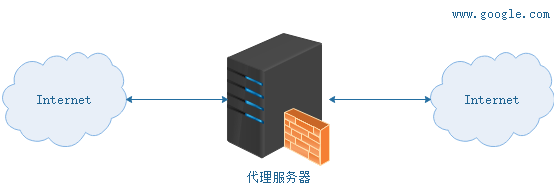
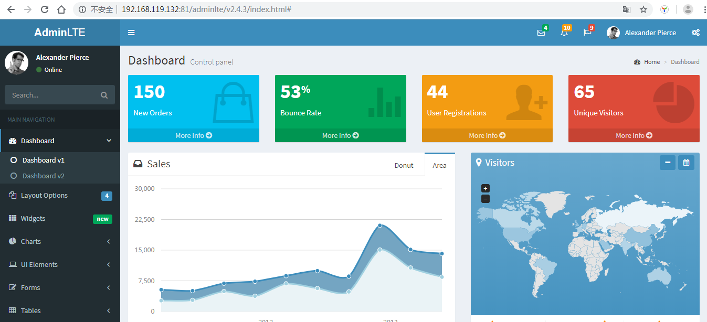

# Nginx学习

- Nginx 是一款高性能的 HTTP 服务器/反向代理服务器及电子邮件（IMAP/POP3）代理服务器
- 由俄罗斯的程序设计师 Igor Sysoev 所开发

- 官方测试 Nginx 能够支支撑 5 万并发链接
- CPU、内存等资源消耗却非常低，运行非常稳定


## 应用场景

- HTTP 服务器：Nginx 是一个 HTTP 服务可以独立提供 HTTP 服务。可以做网页静态服务器。
- 虚拟主机：可以实现在一台服务器虚拟出多个网站。例如个人网站使用的虚拟主机。
- 反向代理，负载均衡：当网站的访问量达到一定程度后，单台服务器不能满足用户的请求时，需要用多台服务器集群可以使用 Nginx 做反向代理。并且多台服务器可以平均分担负载，不会因为某台服务器负载高宕机而某台服务器闲置的情况


## 安装

### docker-compose.yml

```yaml
version: '3.1'
services:
  nginx:
    restart: always
    image: nginx
    container_name: nginx
    ports:
      - 81:80
      - 8080:8080 # 可以配置多个端口
    volumes:
      - ./conf/nginx.conf:/etc/nginx/nginx.conf
      - ./wwwroot:/usr/share/nginx/wwwroot
```


## 虚拟主机

虚拟主机是一种特殊的软硬件技术，它可以将网络上的每一台计算机分成多个虚拟主机，每个虚拟主机可以独立对外提供 www 服务，这样就可以实现一台主机对外提供多个 web 服务，每个虚拟主机之间是独立的，互不影响的。

通过 Nginx 可以实现虚拟主机的配置，Nginx 支持三种类型的虚拟主机配置

- 基于 IP 的虚拟主机
- 基于域名的虚拟主机
- 基于端口的虚拟主机


## 配置文件结构

```json
# ...
events {
	# ...
}

http {
	# ...
	server{
		# ...
	}
	
	# ...
	server{
		# ...
	}
}
```

-  每个 server 就是一个虚拟主机


## 基于端口的虚拟主机配置

- Nginx 对外提供 80 和 8080 两个端口监听服务

- 请求 80 端口则请求 html80 目录下的 html

- 请求 8080 端口则请求 html8080 目录下的 html

  

### 创建目录与文件

- 在 `/usr/local/docker/nginx/wwwroot` 目录下创建 `html80` 和 `html8080` 两个目录

- 分别创建两个 index.html 文件


### 配置主机 conf

修改 `/usr/local/docker/nginx/conf` 目录下的 nginx.conf 配置文件：

```shell
worker_processes  1; # 依据cpu核数确定，此处是虚拟机，核数是1

events {
    worker_connections  1024; # 1个worker_processes 下的连接数
}

http {
    include       mime.types;
    default_type  application/octet-stream;
    sendfile        on;
    keepalive_timeout  65;
   
    server {
        listen       80; # 监听的ip和端口，配置 192.168.75.145:80
        server_name  192.168.119.132; # 虚拟主机名称这里配置ip地址
        location / { # 所有的请求都以 / 开始，所有的请求都可以匹配此 location
	    # 使用 root 指令指定虚拟主机目录即网页存放目录， 如访问 http://ip/index.html 将找到 /usr/local/docker/nginx/wwwroot/html80/index.html，如访问 http://ip/item/index.html 将找到/usr/local/docker/nginx/wwwroot/html80/item/index.html
            root   /usr/share/nginx/wwwroot/html80;
            index  index.html index.htm;  # 指定欢迎页面，按从左到右顺序查找
        }
    }
    server {
        listen       8080;
        server_name  192.168.119.132;
        location / {
            root   /usr/share/nginx/wwwroot/html8080;
            index  index.html index.htm;
        }
    }
}
```


## 基于域名的虚拟主机配置

- 两个域名指向同一台 Nginx 服务器，用户访问不同的域名显示不同的网页内容
- 两个域名是 admin.service.itoken.funtl.com 和 admin.web.itoken.funtl.com
- Nginx 服务器使用虚拟机 192.168.75.145


### 配置window hosts文件

- 通过 host 文件指定 admin.service.itoken.funtl.com 和 admin.web.itoken.funtl.com 对应 192.168.75.145 虚拟机：
- 修改 window 的 hosts 文件：（C:\Windows\System32\drivers\etc）


### 创建目录与文件

在 `/usr/local/docker/nginx/wwwroot` 目录下创建 `htmlservice` 和 `htmlweb` 两个目录，并分辨创建两个 index.html 文件


### 配置主机 conf

```text
user  nginx;
worker_processes  1;

events {
    worker_connections  1024;
}

http {
    include       mime.types;
    default_type  application/octet-stream;

    sendfile        on;

    keepalive_timeout  65;
    server {
        listen       80;
        server_name  www.stt.com;
        location / {
            root   /usr/share/nginx/wwwroot/htmlservice;
            index  index.html index.htm;
        }
    }
    server {
        listen       80;
        server_name  www.stt.com;
        location / {
            root   /usr/share/nginx/wwwroot/htmlweb;
            index  index.html index.htm;
        }
    }
}
```


## 惊群问题

- nginx 采用多核编程技术
- cpu 任务调度
  - 公平调度
    - 应用依次按顺序调度
- 惊群问题
  - 如果nginx配置多核，每个核都闲置
  - 当一个请求访问nginx时，每个核都会进行处理
  - 造成cpu资源的浪费
  - nginx的1.11.3以后的版本解决了这个问题（里程碑版本）


## 反向代理

### 代理服务器

- 客户机在发送请求时，不会直接发送给目的主机，而是先发送给代理服务器，代理服务接受客户机请求之后，再向主机发出，并接收目的主机返回的数据，存放在代理服务器的硬盘中，再发送给客户机
  

#### 优点

- 提高访问速度

  - 由于目标主机返回的数据会存放在代理服务器的硬盘中，因此下一次客户再访问相同的站点数据时，会直接从代理服务器的硬盘中读取，起到了缓存的作用，尤其对于热门站点能明显提高请求速度
- 防火墙

  - 由于所有的客户机请求都必须通过代理服务器访问远程站点，因此可在代理服务器上设限，过滤某些不安全信息。
- 通过代理服务器访问不能访问的目标站点
  - 互联网上有许多开放的代理服务器，客户机在访问受限时，可通过不受限的代理服务器访问目标站点，通俗说，我们使用的翻墙浏览器就是利用了代理服务器，虽然不能出国，但也可直接访问外网


### 正向代理（客户端设置）

正向代理，架设在客户机与目标主机之间，只用于代理内部网络对 Internet 的连接请求，客户机必须指定代理服务器,并将本来要直接发送到 Web 服务器上的 Http 请求发送到代理服务器中。


### 反向代理（服务端设置）

反向代理服务器架设在服务器端，通过缓冲经常被请求的页面来缓解服务器的工作量，将客户机请求转发给内部网络上的目标服务器；并将从服务器上得到的结果返回给 Internet 上请求连接的客户端，此时代理服务器与目标主机一起对外表现为一个服务器


#### 应用

现在许多大型 web 网站都用到反向代理。除了可以防止外网对内网服务器的恶性攻击、缓存以减少服务器的压力和访问安全控制之外，还可以进行负载均衡，将用户请求分配给多个服务器。


#### 使用nginx反向代理 tomcat

- 两个 tomcat 服务通过 nginx 反向代理
- nginx 服务器：192.168.75.145:80
- tomcat1 服务器：192.168.75.145:9090
- tomcat2 服务器：192.168.75.145:9091

##### 启动tomcat容器

```yaml
version: '3'
services:
  tomcat1:
    image: tomcat
    container_name: tomcat1
    ports:
      - 9090:8080

  tomcat2:
    image: tomcat
    container_name: tomcat2
    ports:
      - 9091:8080
```

- docker exec -it tomcat1 bash 进入tomcat 在/usr/local/tomcat/webapps/ROOT/index.jsp追加字段以示区别
  - echo  “tomcat9090”  >> index.jsp

##### 配置nginx.conf

修改 `/usr/local/docker/nginx/conf` 目录下的 nginx.conf 配置文件：

```shell
user  nginx;
worker_processes  1;

events {
    worker_connections  1024;
}

http {
    include       mime.types;
    default_type  application/octet-stream;
    sendfile        on;
    keepalive_timeout  65;
	
	upstream tomcatServer1 { # 配置一个代理即 tomcat1 服务器
		server 192.168.75.145:9090;
	}
	
	server { # 配置一个虚拟主机
		listen 80;
		server_name www.stt.com;
		location / { # 域名 www.stt.com 的请求全部转发到 tomcat_server1 即 tomcat1 服务上
			proxy_pass http://tomcatServer1;
			index index.jsp index.html index.htm;
		}
	}
	server {
		listen 80;
		server_name www.stt2.com;
		location / { # 域名 www.stt2.com 的请求全部转发到 tomcat_server2 服务上
			proxy_pass http://192.168.75.145:9091;
			index index.jsp index.html index.htm;
		}
	}
}
```

**注意：新版 Nginx 的 upstream 配置中的名称不可以有下划线("_")，否则会报 400 错误**


## 负载均衡

负载均衡建立在现有网络结构之上，它提供了一种廉价有效透明的方法扩展网络设备和服务器的带宽、增加吞吐量、加强网络数据处理能力、提高网络的灵活性和可用性。

负载均衡，英文名称为 Load Balance，其意思就是分摊到多个操作单元上进行执行，例如 Web 服务器、FTP 服务器、企业关键应用服务器和其它关键任务服务器等，从而共同完成工作任务

### 实现

- nginx 作为负载均衡服务器，用户请求先到达 nginx，再由 nginx 根据负载配置将请求转发至 tomcat 服务器
- nginx 负载均衡服务器：192.168.75.145:80
- tomcat1 服务器：192.168.75.145:9090
- tomcat2 服务器：192.168.75.145:9091

### 配置nginx.conf

修改 `/usr/local/docker/nginx/conf` 目录下的 nginx.conf 配置文件：

```shell
user  nginx;
worker_processes  1;

events {
    worker_connections  1024;
}

http {
    include       mime.types;
    default_type  application/octet-stream;
    sendfile        on;
    keepalive_timeout  65;
	
	upstream myapp1 {
		server 192.168.75.145:9090 weight=10;
		server 192.168.75.145:9091 weight=10;
	}

	server {
		listen 80;
		server_name nginx.funtl.com;
		location / {
			proxy_pass http://myapp1;
			index index.jsp index.html index.htm;
		}
	}
}
```

#### 配置说明

```shell
# 定义负载均衡设备的 Ip及设备状态 
upstream myServer {
    server 127.0.0.1:9090 down;
    server 127.0.0.1:8080 weight=2;
    server 127.0.0.1:6060;
    server 127.0.0.1:7070 backup;
}
```

在需要使用负载的 Server 节点下添加

```text
proxy_pass http://myServer;
```

- `upstream`：每个设备的状态:
- `down`：表示当前的 `server` 暂时不参与负载
- `weight`：默认为 1 `weight` 越大，负载的权重就越大。
- `max_fails`：允许请求失败的次数默认为 1 当超过最大次数时，返回 `proxy_next_upstream` 模块定义的错误
- `fail_timeout`:`max_fails` 次失败后，暂停的时间。
- `backup`：其它所有的非 `backup` 机器 `down` 或者忙的时候，请求 `backup` 机器。所以这台机器压力会最轻


# 搭建伪CDN


## nginx.conf

```shell
root@root:/usr/local/docker/nginx/conf# cat nginx.conf 
worker_processes  1;

events {
    worker_connections  1024;
}

http {
    include       mime.types;
    default_type  application/octet-stream;
    sendfile        on;
    keepalive_timeout  65;
    
    server {
        listen       80;
        server_name  192.168.119.132;
        location / {
            # 解决跨域问题
            add_header Access-Control-Allow-Origin *;
            add_header Access-Control-Allow-Headers X-Requested-With;
            add_header Access-Control-Allow-Methods GET,POST,OPTIONS;
            
            root /usr/share/nginx/wwwroot/cdn;
            index  index.html index.htm;
        }

    }
}
```


## 复制资源

```shell
root@root:/usr/local/docker/nginx/wwwroot/cdn/adminlte/v2.4.3# ll
total 20004
drwxr-xr-x 2 root root     4096 Jul 16 21:17 ./
drwxr-xr-x 3 root root     4096 Jul 16 21:16 ../
-rw-r--r-- 1 root root 20474428 Jun 16 09:23 AdminLTE-2.4.3.zip
```

- 解压资源

```shell
root@root:/usr/local/docker/nginx/wwwroot/cdn/adminlte/v2.4.3# apt-get install unzip
root@root:/usr/local/docker/nginx/wwwroot/cdn/adminlte/v2.4.3# unzip AdminLTE-2.4.3.zip 
```


## 访问资源

- <http://192.168.119.132:81/adminlte/v2.4.3/index.html>



