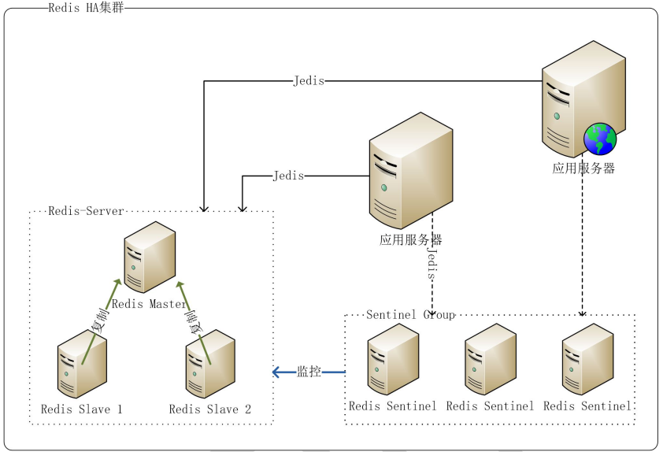

# Redis学习

Redis 是用 C 语言开发的一个开源的高性能键值对（key-value）数据库。它通过提供多种键值数据类型来适应不同场景下的存储需求，目前为止 Redis 支持的键值数据类型如下：

- 字符串类型

- 散列类型

- 列表类型

- 集合类型

- 有序集合类型

  

## 应用场景

- 缓存（数据查询、短连接、新闻内容、商品内容等等）
- 分布式集群架构中的 session 分离
- 聊天室的在线好友列表
- 任务队列（秒杀、抢购、12306 等等）
- 应用排行榜
- 网站访问统计
- 数据过期处理（可以精确到毫秒）


## HA

HA(High Available，高可用性群集)机集群系统简称，是保证业务连续性的有效解决方案，一般有两个或两个以上的节点，且分为活动节点及备用节点。通常把正在执行业务的称为活动节点，而作为活动节点的一个备份的则称为备用节点。当活动节点出现问题，导致正在运行的业务（任务）不能正常运行时，备用节点此时就会侦测到，并立即接续活动节点来执行业务。从而实现业务的不中断或短暂中断。

Redis 一般以主/从方式部署（这里讨论的应用从实例主要用于备份，主实例提供读写）该方式要实现 HA 主要有如下几种方案：

- **keepalived：** 通过 keepalived 的虚拟 IP，提供主从的统一访问，在主出现问题时， 通过 keepalived 运行脚本将从提升为主，待主恢复后先同步后自动变为主，
  - 优点：主从切换后，应用程序不需要知道(因为访问的虚拟 IP 不变)
  - 缺点：引入 keepalived 增加部署复杂性，在有些情况下会导致数据丢失
- **zookeeper：** 通过 zookeeper 来监控主从实例， 维护最新有效的 IP， 应用通过 zookeeper 取得 IP，对 Redis 进行访问，该方案需要编写大量的监控代码
- **sentinel：** 通过 Sentinel 监控主从实例，自动进行故障恢复
  - 缺点：主从实例地址( IP & PORT )是不同的，当故障发生进行主从切换后，应用程序无法知道新地址，故在 Jedis2.2.2 中新增了对 Sentinel 的支持，通过 `redis.clients.jedis.JedisSentinelPool.getResource()` 取得的 Jedis 实例会及时更新到新的主实例地址



- 数据走向
  - 服务器 -> 访问sentinel -> sentinel访问redis-server -> 查询到数据之后->redis-server返回数据给服务器

**注意：** sentinel 是解决 HA 问题的，cluster 是解决主从复制问题的，不重复，并且经常一起用


## Sentinel 集群部署

Redis 集群可以在一组 redis 节点之间实现高可用性和 sharding。在集群中会有 1 个 master 和多个 slave 节点。当 master 节点失效时，应选举出一个 slave 节点作为新的 master。然而 Redis 本身(包括它的很多客户端)没有实现自动故障发现并进行主备切换的能力，需要外部的监控方案来实现自动故障恢复。

Redis Sentinel 是官方推荐的高可用性解决方案。它是 Redis 集群的监控管理工具，可以提供节点监控、通知、自动故障恢复和客户端配置发现服务


### 核心配置

- 用于参考配置上的注释

```shell
# Example sentinel.conf

# *** IMPORTANT ***
#
# By default Sentinel will not be reachable from interfaces different than
# localhost, either use the 'bind' directive to bind to a list of network
# interfaces, or disable protected mode with "protected-mode no" by
# adding it to this configuration file.
#
# Before doing that MAKE SURE the instance is protected from the outside
# world via firewalling or other means.
#
# For example you may use one of the following:
#
# bind 127.0.0.1 192.168.1.1
#
# protected-mode no

# port <sentinel-port>
# The port that this sentinel instance will run on
port 26379

# sentinel announce-ip <ip>
# sentinel announce-port <port>
#
# The above two configuration directives are useful in environments where,
# because of NAT, Sentinel is reachable from outside via a non-local address.
#
# When announce-ip is provided, the Sentinel will claim the specified IP address
# in HELLO messages used to gossip its presence, instead of auto-detecting the
# local address as it usually does.
#
# Similarly when announce-port is provided and is valid and non-zero, Sentinel
# will announce the specified TCP port.
#
# The two options don't need to be used together, if only announce-ip is
# provided, the Sentinel will announce the specified IP and the server port
# as specified by the "port" option. If only announce-port is provided, the
# Sentinel will announce the auto-detected local IP and the specified port.
#
# Example:
#
# sentinel announce-ip 1.2.3.4

# dir <working-directory>
# Every long running process should have a well-defined working directory.
# For Redis Sentinel to chdir to /tmp at startup is the simplest thing
# for the process to don't interfere with administrative tasks such as
# unmounting filesystems.
dir /tmp

# sentinel monitor <master-name> <ip> <redis-port> <quorum>
#
# Tells Sentinel to monitor this master, and to consider it in O_DOWN
# (Objectively Down) state only if at least <quorum> sentinels agree.
#
# Note that whatever is the ODOWN quorum, a Sentinel will require to
# be elected by the majority of the known Sentinels in order to
# start a failover, so no failover can be performed in minority.
#
# Slaves are auto-discovered, so you don't need to specify slaves in
# any way. Sentinel itself will rewrite this configuration file adding
# the slaves using additional configuration options.
# Also note that the configuration file is rewritten when a
# slave is promoted to master.
#
# Note: master name should not include special characters or spaces.
# The valid charset is A-z 0-9 and the three characters ".-_".
sentinel monitor mymaster 127.0.0.1 6379 2

# sentinel auth-pass <master-name> <password>
#
# Set the password to use to authenticate with the master and slaves.
# Useful if there is a password set in the Redis instances to monitor.
#
# Note that the master password is also used for slaves, so it is not
# possible to set a different password in masters and slaves instances
# if you want to be able to monitor these instances with Sentinel.
#
# However you can have Redis instances without the authentication enabled
# mixed with Redis instances requiring the authentication (as long as the
# password set is the same for all the instances requiring the password) as
# the AUTH command will have no effect in Redis instances with authentication
# switched off.
#
# Example:
#
# sentinel auth-pass mymaster MySUPER--secret-0123passw0rd

# sentinel down-after-milliseconds <master-name> <milliseconds>
#
# Number of milliseconds the master (or any attached slave or sentinel) should
# be unreachable (as in, not acceptable reply to PING, continuously, for the
# specified period) in order to consider it in S_DOWN state (Subjectively
# Down).
#
# Default is 30 seconds.
sentinel down-after-milliseconds mymaster 30000

# sentinel parallel-syncs <master-name> <numslaves>
#
# How many slaves we can reconfigure to point to the new slave simultaneously
# during the failover. Use a low number if you use the slaves to serve query
# to avoid that all the slaves will be unreachable at about the same
# time while performing the synchronization with the master.
sentinel parallel-syncs mymaster 1

# sentinel failover-timeout <master-name> <milliseconds>
#
# Specifies the failover timeout in milliseconds. It is used in many ways:
#
# - The time needed to re-start a failover after a previous failover was
#   already tried against the same master by a given Sentinel, is two
#   times the failover timeout.
#
# - The time needed for a slave replicating to a wrong master according
#   to a Sentinel current configuration, to be forced to replicate
#   with the right master, is exactly the failover timeout (counting since
#   the moment a Sentinel detected the misconfiguration).
#
# - The time needed to cancel a failover that is already in progress but
#   did not produced any configuration change (SLAVEOF NO ONE yet not
#   acknowledged by the promoted slave).
#
# - The maximum time a failover in progress waits for all the slaves to be
#   reconfigured as slaves of the new master. However even after this time
#   the slaves will be reconfigured by the Sentinels anyway, but not with
#   the exact parallel-syncs progression as specified.
#
# Default is 3 minutes.
sentinel failover-timeout mymaster 180000

# SCRIPTS EXECUTION
#
# sentinel notification-script and sentinel reconfig-script are used in order
# to configure scripts that are called to notify the system administrator
# or to reconfigure clients after a failover. The scripts are executed
# with the following rules for error handling:
#
# If script exits with "1" the execution is retried later (up to a maximum
# number of times currently set to 10).
#
# If script exits with "2" (or an higher value) the script execution is
# not retried.
#
# If script terminates because it receives a signal the behavior is the same
# as exit code 1.
#
# A script has a maximum running time of 60 seconds. After this limit is
# reached the script is terminated with a SIGKILL and the execution retried.

# NOTIFICATION SCRIPT
#
# sentinel notification-script <master-name> <script-path>
# 
# Call the specified notification script for any sentinel event that is
# generated in the WARNING level (for instance -sdown, -odown, and so forth).
# This script should notify the system administrator via email, SMS, or any
# other messaging system, that there is something wrong with the monitored
# Redis systems.
#
# The script is called with just two arguments: the first is the event type
# and the second the event description.
#
# The script must exist and be executable in order for sentinel to start if
# this option is provided.
#
# Example:
#
# sentinel notification-script mymaster /var/redis/notify.sh

# CLIENTS RECONFIGURATION SCRIPT
#
# sentinel client-reconfig-script <master-name> <script-path>
#
# When the master changed because of a failover a script can be called in
# order to perform application-specific tasks to notify the clients that the
# configuration has changed and the master is at a different address.
# 
# The following arguments are passed to the script:
#
# <master-name> <role> <state> <from-ip> <from-port> <to-ip> <to-port>
#
# <state> is currently always "failover"
# <role> is either "leader" or "observer"
# 
# The arguments from-ip, from-port, to-ip, to-port are used to communicate
# the old address of the master and the new address of the elected slave
# (now a master).
#
# This script should be resistant to multiple invocations.
#
# Example:
#
# sentinel client-reconfig-script mymaster /var/redis/reconfig.sh

# SECURITY
#
# By default SENTINEL SET will not be able to change the notification-script
# and client-reconfig-script at runtime. This avoids a trivial security issue
# where clients can set the script to anything and trigger a failover in order
# to get the program executed.

sentinel deny-scripts-reconfig yes
```


### 搭建redis集群

- 1主2从

#### docker-compose.yml

```yaml
version: '3.1'
services:
  master:
    image: redis
    container_name: redis-master
    ports:
      - 6379:6379

  slave1:
    image: redis
    container_name: redis-slave-1
    ports:
      - 6380:6379
    command: redis-server --slaveof redis-master 6379 
    # 由于在一个局域网中，可以使用容器名代替ip

  slave2:
    image: redis
    container_name: redis-slave-2
    ports:
      - 6381:6379
    command: redis-server --slaveof redis-master 6379
```

- 启动完成后使用redis客户端进行连接
  - 客户端0.9版本增加了redis监控


### 搭建sentinel集群

- 创建/usr/local/docker/sentinel文件夹

- 至少需要创建三个 Sentinel 服务，docker-compose.yml 配置如下

  

#### docker-compose.yml

```yaml
version: '3.1'
services:
  sentinel1:
    image: redis
    container_name: redis-sentinel-1
    ports:
      - 26379:26379
    command: redis-sentinel /usr/local/etc/redis/sentinel.conf
    volumes:
      - ./sentinel1.conf:/usr/local/etc/redis/sentinel.conf # ./表示当前文件夹

  sentinel2:
    image: redis
    container_name: redis-sentinel-2
    ports:
      - 26380:26379
    command: redis-sentinel /usr/local/etc/redis/sentinel.conf
    volumes:
      - ./sentinel2.conf:/usr/local/etc/redis/sentinel.conf

  sentinel3:
    image: redis
    container_name: redis-sentinel-3
    ports:
      - 26381:26379
    command: redis-sentinel /usr/local/etc/redis/sentinel.conf
    volumes:
      - ./sentinel3.conf:/usr/local/etc/redis/sentinel.conf
```


#### 修改sentinel配置文件

需要三份 sentinel.conf 配置文件，分别为 `sentinel1.conf`，`sentinel2.conf`，`sentinel3.conf`，配置文件内容相同

```shell
port 26379
dir /tmp
# 自定义集群名，其中 192.168.119.136 6379为 redis-master 的ip和端口，2 为最小投票数（因为有 3 台 Sentinel 所以可以设置成 2）
sentinel monitor mymaster 192.168.119.136 6379 2 # 注意ip不要写127.0.0.1，否则java客户端使用的就是127.0.0.1，如果在本地安装redis是可以的，否则访问会有问题。
sentinel down-after-milliseconds mymaster 30000
sentinel parallel-syncs mymaster 1
sentinel failover-timeout mymaster 180000
sentinel deny-scripts-reconfig yes
```


#### 验证

验证是否生效，进入 Sentinel 容器，使用 Sentinel API 查看监控情况，命令如下

```shell
docker exec -it redis-sentinel-1 /bin/bash
redis-cli -p 26379
sentinel master mymaster
sentinel slaves mymaster
```

结果


#### 桌面客户端连接

- 注意图标的变化


## 服务端调用

创建一个名为 `itoken-service-redis` 的服务提供者项目

### pom

```xml
<?xml version="1.0" encoding="UTF-8"?>
<project xmlns="http://maven.apache.org/POM/4.0.0" xmlns:xsi="http://www.w3.org/2001/XMLSchema-instance"
         xsi:schemaLocation="http://maven.apache.org/POM/4.0.0 http://maven.apache.org/xsd/maven-4.0.0.xsd">
    <modelVersion>4.0.0</modelVersion>

    <parent>
        <groupId>com.funtl</groupId>
        <artifactId>itoken-dependencies</artifactId>
        <version>1.0.0-SNAPSHOT</version>
        <relativePath>../itoken-dependencies/pom.xml</relativePath>
    </parent>

    <artifactId>itoken-service-redis</artifactId>
    <packaging>jar</packaging>

    <name>itoken-service-redis</name>
    <url>http://www.funtl.com</url>
    <inceptionYear>2018-Now</inceptionYear>

    <dependencies>
        <!-- Project Begin -->
        <dependency>
            <groupId>com.funtl</groupId>
            <artifactId>itoken-common</artifactId>
            <version>${project.parent.version}</version>
        </dependency>
        <!-- Project End -->

        <!-- Spring Cloud Begin -->
        <dependency>
            <groupId>org.springframework.cloud</groupId>
            <artifactId>spring-cloud-starter-zipkin</artifactId>
        </dependency>
        <dependency>
            <groupId>org.springframework.cloud</groupId>
            <artifactId>spring-cloud-starter-config</artifactId>
        </dependency>
        <dependency>
            <groupId>org.springframework.cloud</groupId>
            <artifactId>spring-cloud-starter-netflix-eureka-server</artifactId>
        </dependency>
        <!-- Spring Cloud End -->

        <!-- Spring Boot Admin Begin -->
        <dependency>
            <groupId>de.codecentric</groupId>
            <artifactId>spring-boot-admin-starter-client</artifactId>
        </dependency>
        <!-- Spring Boot Admin End -->

        <dependency>
            <groupId>org.apache.commons</groupId>
            <artifactId>commons-pool2</artifactId>
        </dependency>
        <dependency>
            <groupId>org.springframework.boot</groupId>
            <artifactId>spring-boot-starter-data-redis</artifactId>
        </dependency>
        <dependency>
            <groupId>org.springframework.boot</groupId>
            <artifactId>spring-boot-starter-test</artifactId>
            <scope>test</scope>
        </dependency>
    </dependencies>

    <build>
        <plugins>
            <plugin>
                <groupId>org.springframework.boot</groupId>
                <artifactId>spring-boot-maven-plugin</artifactId>
                <configuration>
                    <mainClass>com.funtl.itoken.service.redis.RedisApplication</mainClass>
                </configuration>
            </plugin>
        </plugins>
    </build>
</project>
```

主要增加了 `org.springframework.boot:spring-boot-starter-data-redis`，`org.apache.commons:commons-pool2` 两个依赖


### application

```java
package com.funtl.itoken.service.redis;

import org.springframework.boot.SpringApplication;
import org.springframework.boot.autoconfigure.SpringBootApplication;
import org.springframework.cloud.netflix.eureka.EnableEurekaClient;

@EnableEurekaClient
@SpringBootApplication
public class RedisApplication {
    public static void main(String[] args) {
        SpringApplication.run(RedisApplication.class, args);
    }
}
```

### yml

- bootstrap.yml

```yaml
spring:
  cloud:
    config:
      uri: http://localhost:8888
      name: itoken-service-redis
      label: master
      profile: dev
```

- bootstrap-prod.yml

```yaml
spring:
  cloud:
    config:
      uri: http://192.168.119.132:8888
      name: itoken-service-redis
      label: master
      profile: prod
```

- itoken-service-redis-dev.yml

```yaml
spring:
  application:
    name: itoken-service-redis
  boot:
    admin:
      client:
        url: http://localhost:8084
  zipkin:
    base-url: http://localhost:9411
  redis:
    lettuce:
      pool:
        max-active: 8
        max-idle: 8
        max-wait: -1ms
        min-idle: 0
    sentinel:
      master: mymaster
      nodes: 192.168.75.140:26379

server:
  port: 8502

eureka:
  client:
    serviceUrl:
      defaultZone: http://localhost:8761/eureka/

management:
  endpoint:
    health:
      show-details: always
  endpoints:
    web:
      exposure:
        include: health,info
```

- itoken-service-redis-prod.yml

```yaml
spring:
  application:
    name: itoken-service-redis
  boot:
    admin:
      client:
        url: http://192.168.119.132:8084
  zipkin:
    base-url: http://192.168.119.132:9411

  redis:
    lettuce:
      pool:
        max-active: 8
        max-idle: 8
        max-wait: -1ms
        min-idle: 0
    sentinel:
      master: mymaster
      nodes: 192.168.119.136:26379, 192.168.119.136:26380, 192.168.119.136:26381

server:
  port: 8502

eureka:
  client:
    serviceUrl:
      defaultZone: http://192.168.119.132:8761/eureka/,http://192.168.119.132:8861/eureka/,http://192.168.119.132:8961/eureka/

management:
  endpoint:
    health:
      show-details: always
  endpoints:
    web:
      exposure:
        include: health,info
```

### service

```java
package com.stt.itoken.service.redis.service;
import org.springframework.beans.factory.annotation.Autowired;
import org.springframework.data.redis.core.RedisTemplate;
import org.springframework.stereotype.Service;
import java.util.concurrent.TimeUnit;

@Service
public class RedisService {

	@Autowired
	private RedisTemplate redisTemplate;

	public void put(String key,Object value,long seconds){
		redisTemplate.opsForValue().set(key,value,seconds, TimeUnit.SECONDS);
	}

	public Object get(String key){
		return redisTemplate.opsForValue().get(key);
	}
}
```


## 命令汇总

- http://redisdoc.com/
- http://redis.io/commands

### 连接操作

- ping：测试连接是否存活如果正常会返回 pong

- echo：打印

- select：切换到指定的数据库，数据库索引号 index 用数字值指定，以 0 作为起始索引值

- quit：关闭连接（connection）

- auth：简单密码认证

  

### 服务端操作

- time：返回当前服务器时间
- client list: 返回所有连接到服务器的客户端信息和统计数据 参见 http://redisdoc.com/server/client_list.html
- client kill ip:port：关闭地址为 ip:port 的客户端
- save：将数据同步保存到磁盘
- bgsave：将数据异步保存到磁盘
- lastsave：返回上次成功将数据保存到磁盘的Unix时戳
- shundown：将数据同步保存到磁盘，然后关闭服务
- info：提供服务器的信息和统计
- config resetstat：重置 info 命令中的某些统计数据
- config get：获取配置文件信息
- config set：动态地调整 Redis 服务器的配置(configuration)而无须重启，可以修改的配置参数可以使用命令 CONFIG GET * 来列出
- config rewrite：Redis 服务器时所指定的 redis.conf 文件进行改写
- monitor：实时转储收到的请求
- slaveof：改变复制策略设置


### 发布订阅

- psubscribe：订阅一个或多个符合给定模式的频道 例如 psubscribe news.* tweet.*
- publish：将信息 message 发送到指定的频道 channel 例如 publish msg "good morning"
- pubsub channels：列出当前的活跃频道 例如 PUBSUB CHANNELS news.i*
- pubsub numsub：返回给定频道的订阅者数量 例如 PUBSUB NUMSUB news.it news.internet news.sport news.music
- pubsub numpat：返回客户端订阅的所有模式的数量总和
- punsubscribe：指示客户端退订所有给定模式。
- subscribe：订阅给定的一个或多个频道的信息。例如 subscribe msg chat_room
- unsubscribe：指示客户端退订给定的频道


### KEY操作

- exists(key)：确认一个 key 是否存在
- del(key)：删除一个 key
- type(key)：返回值的类型
- keys(pattern)：返回满足给定 pattern 的所有 key
- randomkey：随机返回 key 空间的一个
- keyrename(oldname, newname)：重命名 key
- dbsize：返回当前数据库中 key 的数目
- expire：设定一个 key 的活动时间（s）
- ttl：获得一个 key 的活动时间
- move(key, dbindex)：移动当前数据库中的 key 到 dbindex 数据库
- flushdb：删除当前选择数据库中的所有 key
- flushall：删除所有数据库中的所有 key


### String 操作

- set(key, value)：给数据库中名称为 key 的 string 赋予值 value
- get(key)：返回数据库中名称为 key 的 string 的 value
- getset(key, value)：给名称为 key 的 string 赋予上一次的 value
- mget(key1, key2,…, key N)：返回库中多个 string 的 value
- setnx(key, value)：添加 string，名称为 key，值为 value
- setex(key, time, value)：向库中添加 string，设定过期时间 time
- mset(key N, value N)：批量设置多个 string 的值
- msetnx(key N, value N)：如果所有名称为 key i 的 string 都不存在
- incr(key)：名称为 key 的 string 增 1 操作
- incrby(key, integer)：名称为 key 的 string 增加 integer
- decr(key)：名称为 key 的 string 减 1 操作
- decrby(key, integer)：名称为 key 的 string 减少 integer
- append(key, value)：名称为 key 的 string 的值附加 value
- substr(key, start, end)：返回名称为 key 的 string 的 value 的子串


### List操作

- rpush(key, value)：在名称为 key 的 list 尾添加一个值为 value 的元素
- lpush(key, value)：在名称为 key 的 list 头添加一个值为 value 的元素
- llen(key)：返回名称为 key 的 list 的长度
- lrange(key, start, end)：返回名称为 key 的 list 中 start 至 end 之间的元素
- ltrim(key, start, end)：截取名称为 key 的 list
- lindex(key, index)：返回名称为 key 的 list 中 index 位置的元素
- lset(key, index, value)：给名称为 key 的 list 中 index 位置的元素赋值
- lrem(key, count, value)：删除 count 个 key 的 list 中值为 value 的元素
- lpop(key)：返回并删除名称为 key 的 list 中的首元素
- rpop(key)：返回并删除名称为 key 的 list 中的尾元素
- blpop(key1, key2,… key N, timeout)：lpop 命令的 block 版本。
- brpop(key1, key2,… key N, timeout)：rpop 的 block 版本。
- rpoplpush(srckey, dstkey)：返回并删除名称为 srckey 的 list 的尾元素，并将该元素添加到名称为 dstkey 的 list 的头部


### Set操作

- sadd(key, member)：向名称为 key 的 set 中添加元素 member
- srem(key, member) ：删除名称为 key 的 set 中的元素 member
- spop(key) ：随机返回并删除名称为 key 的 set 中一个元素
- smove(srckey, dstkey, member) ：移到集合元素
- scard(key) ：返回名称为 key 的 set 的基数
- sismember(key, member) ：member 是否是名称为 key 的 set 的元素
- sinter(key1, key2,…key N) ：求交集
- sinterstore(dstkey, (keys)) ：求交集并将交集保存到 dstkey 的集合
- sunion(key1, (keys)) ：求并集
- sunionstore(dstkey, (keys)) ：求并集并将并集保存到 dstkey 的集合
- sdiff(key1, (keys)) ：求差集
- sdiffstore(dstkey, (keys)) ：求差集并将差集保存到 dstkey 的集合
- smembers(key) ：返回名称为 key 的 set 的所有元素
- srandmember(key) ：随机返回名称为 key 的 set 的一个元素


### Hash操作

- hset(key, field, value)：向名称为 key 的 hash 中添加元素 field
- hget(key, field)：返回名称为 key 的 hash 中 field 对应的 value
- hmget(key, (fields))：返回名称为 key 的 hash 中 field i 对应的 value
- hmset(key, (fields))：向名称为 key 的 hash 中添加元素 field
- hincrby(key, field, integer)：将名称为 key 的 hash 中 field 的 value 增加 integer
- hexists(key, field)：名称为 key 的 hash 中是否存在键为 field 的域
- hdel(key, field)：删除名称为 key 的 hash 中键为 field 的域
- hlen(key)：返回名称为 key 的 hash 中元素个数
- hkeys(key)：返回名称为 key 的 hash 中所有键
- hvals(key)：返回名称为 key 的 hash 中所有键对应的 value
- hgetall(key)：返回名称为 key 的 hash 中所有的键（field）及其对应的 value


### Sentinel操作

- ping ：返回 pong
- sentinel masters ：列出所有被监视的主服务器，以及这些主服务器的当前状态。
- sentinel slaves：列出给定主服务器的所有从服务器，以及这些从服务器的当前状态。
- sentinel get-master-addr-by-name：返回给定名字的主服务器的 IP 地址和端口号。如果这个主服务器正在执行故障转移操作，或者针对这个主服务器的故障转移操作已经完成，那么这个命令返回新的主服务器的 IP 地址和端口号。
- sentinel reset：重置所有名字和给定模式 pattern 相匹配的主服务器。pattern 参数是一个 Glob 风格的模式 重置操作清楚主服务器目前的所有状态，包括正在执行中的故障转移，并移除目前已经发现和关联的，主服务器的所有从服务器和 Sentinel 。
- sentinel failover：当主服务器失效时，在不询问其他 Sentinel 意见的情况下，强制开始一次自动故障迁移（不过发起故障转移的 Sentinel 会向其他 Sentinel 发送一个新的配置，其他 Sentinel 会根据这个配置进行相应的更新）。


# 单点登录原理


## Http无状态协议

`web` 应用采用 `browser/server` 架构，`http` 作为通信协议。`http` 是无状态协议，浏览器的每一次请求，服务器会独立处理，不与之前或之后的请求产生关联，这个过程用下图说明，三次请求/响应对之间没有任何联系


但这也同时意味着，任何用户都能通过浏览器访问服务器资源，如果想保护服务器的某些资源，必须限制浏览器请求；要限制浏览器请求，必须鉴别浏览器请求，响应合法请求，忽略非法请求；要鉴别浏览器请求，必须清楚浏览器请求状态。既然 `http` 协议无状态，那就让服务器和浏览器共同维护一个状态吧！这就是会话机制


## 会话机制

浏览器第一次请求服务器，服务器创建一个会话，并将会话的 `id` 作为响应的一部分发送给浏览器，浏览器存储会话 `id`，并在后续第二次和第三次请求中带上会话 `id`，服务器取得请求中的会话 `id` 就知道是不是同一个用户了，这个过程用下图说明，后续请求与第一次请求产生了关联


服务器在内存中保存会话的两种方式

- 请求参数
- Cookie

将会话 `id` 作为每一个请求的参数，服务器接收请求自然能解析参数获得会话 `id`，并借此判断是否来自同一会话，很明显，这种方式不靠谱。那就浏览器自己来维护这个会话 `id` 吧，每次发送 `http` 请求时浏览器自动发送会话 `id`，`cookie` 机制正好用来做这件事。`cookie` 是浏览器用来存储少量数据的一种机制，数据以 `key/value` 形式存储，浏览器发送 `http` 请求时自动附带 `cookie` 信息

`tomcat` 会话机制当然也实现了 `cookie`，访问 `tomcat` 服务器时，浏览器中可以看到一个名为 `JSESSIONID` 的 `cookie`，这就是 `tomcat` 会话机制维护的会话 `id`，使用了 `cookie` 的请求响应过程如下图


## 登录状态

有了会话机制，登录状态就好明白了，我们假设浏览器第一次请求服务器需要输入用户名与密码验证身份，服务器拿到用户名密码去数据库比对，正确的话说明当前持有这个会话的用户是合法用户，应该将这个会话标记为“已授权”或者“已登录”等等之类的状态，既然是会话的状态，自然要保存在会话对象中，`tomcat` 在会话对象中设置登录状态如下

```java
HttpSession session = request.getSession();
session.setAttribute("isLogin", true);
```

用户再次访问时，`tomcat` 在会话对象中查看登录状态

```java
HttpSession session = request.getSession();
session.getAttribute("isLogin");
```

实现了登录状态的浏览器请求服务器模型如下图描述


每次请求受保护资源时都会检查会话对象中的登录状态，只有 `isLogin=true` 的会话才能访问，登录机制因此而实现


## 多系统登录

`web` 系统早已从久远的单系统发展成为如今由多系统组成的应用群，面对如此众多的系统，用户难道要一个一个登录、然后一个一个注销吗？就像下图描述的这样


`web` 系统由单系统发展成多系统组成的应用群，复杂性应该由系统内部承担，而不是用户。无论 `web`系统内部多么复杂，对用户而言，都是一个统一的整体，也就是说，用户访问 `web` 系统的整个应用群与访问单个系统一样，登录/注销只要一次就够了


虽然单系统的登录解决方案很完美，但对于多系统应用群已经不再适用了，为什么呢？

单系统登录解决方案的核心是 `cookie`，`cookie` 携带会话 `id` 在浏览器与服务器之间维护会话状态。但 `cookie` 是有限制的，这个限制就是 `cookie` 的域（通常对应网站的域名），浏览器发送 `http` 请求时会自动携带与该域匹配的 `cookie`，而不是所有 `cookie`


既然这样，为什么不将 `web` 应用群中所有子系统的域名统一在一个顶级域名下，例如 `*.baidu.com`，然后将它们的 `cookie` 域设置为 `baidu.com`，这种做法理论上是可以的，甚至早期很多多系统登录就采用这种同域名共享 `cookie` 的方式。

然而，可行并不代表好，共享 `cookie` 的方式存在众多局限。

- 首先，应用群域名得统一；
- 其次，应用群各系统使用的技术（至少是 `web` 服务器）要相同，不然 `cookie` 的 `key` 值（`tomcat` 为 `JSESSIONID`）不同，无法维持会话，共享 `cookie` 的方式是无法实现跨语言技术平台登录的，比如`java`、`php`、`python` 系统之间；
- 第三，`cookie` 本身不安全。

因此，我们需要一种全新的登录方式来实现多系统应用群的登录，这就是 **单点登录**


## 单点登录系统

> 单点登录全称 Single Sign On（以下简称 SSO），是指在多系统应用群中登录一个系统，便可在其他所有系统中得到授权而无需再次登录，包括单点登录与单点注销两部分


### 单点登录流程

相比于单系统登录，`sso` 需要一个独立的认证中心，只有认证中心能接受用户的用户名密码等安全信息，其他系统不提供登录入口，只接受认证中心的间接授权。间接授权通过令牌实现，`sso` 认证中心验证用户的用户名密码没问题，创建授权令牌，在接下来的跳转过程中，授权令牌作为参数发送给各个子系统，子系统拿到令牌，即得到了授权，可以借此创建局部会话，局部会话登录方式与单系统的登录方式相同。这个过程，也就是单点登录的原理，用下图说明


下面对上图简要描述

- 用户访问系统 1 的受保护资源，系统1发现用户未登录，跳转至 `sso` 认证中心，并将自己的地址作为参数
- `sso` 认证中心发现用户未登录，将用户引导至登录页面
- 用户输入用户名密码提交登录申请
- `sso` 认证中心校验用户信息，创建用户与 `sso` 认证中心之间的会话，称为全局会话，同时创建授权令牌
- `sso` 认证中心带着令牌跳转会最初的请求地址（系统1）
- 系统1拿到令牌，去 `sso` 认证中心校验令牌是否有效
- `sso` 认证中心校验令牌，返回有效，注册系统 1
- 系统 1 使用该令牌创建与用户的会话，称为局部会话，返回受保护资源
- 用户访问系统 2 的受保护资源
- 系统2发现用户未登录，跳转至 `sso` 认证中心，并将自己的地址作为参数
- `sso` 认证中心发现用户已登录，跳转回系统 2 的地址，并附上令牌
- 系统 2 拿到令牌，去 `sso` 认证中心校验令牌是否有效
- `sso` 认证中心校验令牌，返回有效，注册系统 2
- 系统 2 使用该令牌创建与用户的局部会话，返回受保护资源

用户登录成功之后，会与 `sso` 认证中心及各个子系统建立会话，用户与 `sso` 认证中心建立的会话称为全局会话，用户与各个子系统建立的会话称为局部会话，局部会话建立之后，用户访问子系统受保护资源将不再通过 `sso` 认证中心，全局会话与局部会话有如下约束关系

- 局部会话存在，全局会话一定存在
- 全局会话存在，局部会话不一定存在
- 全局会话销毁，局部会话必须销毁


### 单点注销流程

单点登录自然也要单点注销，在一个子系统中注销，所有子系统的会话都将被销毁，用下面的图来说明


`sso` 认证中心一直监听全局会话的状态，一旦全局会话销毁，监听器将通知所有注册系统执行注销操作

- 用户向系统 1 发起注销请求
- 系统1根据用户与系统1建立的会话 `id` 拿到令牌，向 `sso` 认证中心发起注销请求
- `sso` 认证中心校验令牌有效，销毁全局会话，同时取出所有用此令牌注册的系统地址
- `sso` 认证中心向所有注册系统发起注销请求
- 各注册系统接收 `sso` 认证中心的注销请求，销毁局部会话
- `sso` 认证中心引导用户至登录页面