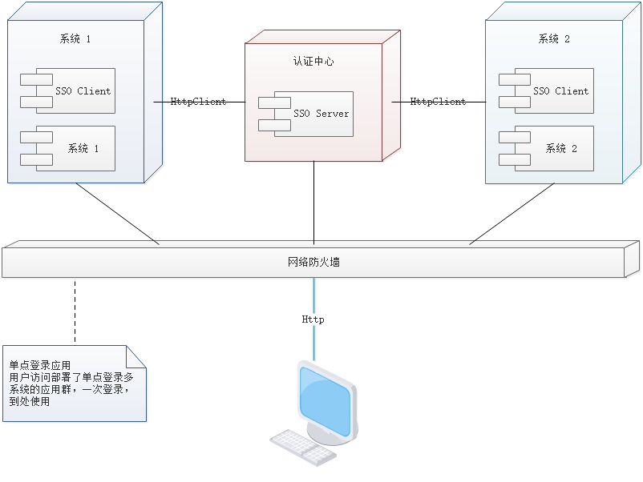

# 单点登录服务

## 部署与流程

单点登录涉及 `sso` 认证中心与众子系统，子系统与 `sso` 认证中心需要通信以交换令牌、校验令牌及发起注销请求，因而子系统必须集成 `sso` 的客户端，`sso` 认证中心则是 `sso` 服务端，整个单点登录过程实质是 `sso` 客户端与服务端通信的过程，用下图描述



`sso` 认证中心与 `sso` 客户端通信方式有多种，`HttpClient`，`WebService`、`rpc`、`restful api` 都可以


## 实现原理

### SSO Client

- 拦截子系统未登录用户请求，跳转至 `sso` 认证中心
- 接收并存储 `sso` 认证中心发送的令牌
- 与 `SSO Server` 通信，校验令牌的有效性
- 建立局部会话
- 拦截用户注销请求，向 `sso` 认证中心发送注销请求
- 接收 `sso` 认证中心发出的注销请求，销毁局部会话

### SSO Server

- 验证用户的登录信息
- 创建全局会话
- 创建授权令牌
- 与 `SSO Client` 通信发送令牌
- 校验 `SSO Client` 令牌有效性
- 系统注册
- 接收 `SSO Client` 注销请求，注销所有会话


## 单点登录项目

- 创建项目itoken-service-sso

### pom

```xml
<?xml version="1.0" encoding="UTF-8"?>
<project xmlns="http://maven.apache.org/POM/4.0.0" xmlns:xsi="http://www.w3.org/2001/XMLSchema-instance"
         xsi:schemaLocation="http://maven.apache.org/POM/4.0.0 http://maven.apache.org/xsd/maven-4.0.0.xsd">
    <modelVersion>4.0.0</modelVersion>

    <parent>
        <groupId>com.stt</groupId>
        <artifactId>itoken-dependencies</artifactId>
        <version>1.0.0-SNAPSHOT</version>
        <relativePath>../itoken-dependencies/pom.xml</relativePath>
    </parent>

    <artifactId>itoken-service-sso</artifactId>
    <packaging>jar</packaging>
    <name>${artifactId}</name>

    <dependencies>
        <dependency>
            <groupId>com.stt</groupId>
            <artifactId>itoken-common-domain</artifactId>
            <version>${project.parent.version}</version>
        </dependency>
        <dependency>
            <groupId>com.stt</groupId>
            <artifactId>itoken-common-service</artifactId>
            <version>${project.parent.version}</version>
        </dependency>
        <dependency>
            <groupId>com.stt</groupId>
            <artifactId>itoken-common-web</artifactId>
            <version>${project.parent.version}</version>
        </dependency>
        <dependency>
            <groupId>org.springframework.boot</groupId>
            <artifactId>spring-boot-starter-test</artifactId>
            <scope>test</scope>
        </dependency>
    </dependencies>

    <build>
        <plugins>
            <plugin>
                <groupId>org.springframework.boot</groupId>
                <artifactId>spring-boot-maven-plugin</artifactId>
                <configuration>
                    <mainClass>com.stt.itoken.service.sso.ServiceSSOApplication</mainClass>
                </configuration>
            </plugin>
        </plugins>
    </build>
</project>
```

### application

- 即是服务提供者，又是服务消费者

```java
package com.stt.itoken.service.sso;

import org.springframework.boot.SpringApplication;
import org.springframework.boot.autoconfigure.SpringBootApplication;
import org.springframework.cloud.client.discovery.EnableDiscoveryClient;
import org.springframework.cloud.netflix.eureka.EnableEurekaClient;
import org.springframework.cloud.openfeign.EnableFeignClients;
import tk.mybatis.spring.annotation.MapperScan;

@SpringBootApplication
// 服务消费者
@EnableDiscoveryClient
@EnableFeignClients
// 服务提供者
@EnableEurekaClient
@MapperScan(basePackages = "com.stt.itoken.service.sso.mapper")
public class ServiceSSOApplication {
	public static void main(String[] args) {
		SpringApplication.run(ServiceSSOApplication.class,args);
	}
}
```

### controller

```java
package com.stt.itoken.service.sso.controller;

import com.stt.itoken.common.domain.TbSysUser;
import com.stt.itoken.common.utils.CookieUtils;
import com.stt.itoken.common.utils.MapperUtils;
import com.stt.itoken.service.sso.consumer.RedisService;
import com.stt.itoken.service.sso.service.LoginService;
import org.springframework.beans.factory.annotation.Autowired;
import org.springframework.stereotype.Controller;
import org.springframework.ui.Model;
import org.springframework.util.StringUtils;
import org.springframework.web.bind.annotation.GetMapping;
import org.springframework.web.bind.annotation.PostMapping;
import org.springframework.web.bind.annotation.RequestParam;
import org.springframework.web.servlet.mvc.support.RedirectAttributes;

import javax.servlet.http.HttpServletRequest;
import javax.servlet.http.HttpServletResponse;
import java.util.Objects;
import java.util.UUID;

@Controller
public class LoginController {

	private static final String REDIRECT = "redirect:";
	private static final String MSG = "message";
	private static final String LOGIN = "login";
	private static final String TOKEN = "token";

	@Autowired
	private LoginService loginService;

	@Autowired
	private RedisService redisService;

	/**
	 * 跳转到登录页面,判断是否登录
	 * @return
	 */
	@GetMapping(LOGIN)
	public String login(@RequestParam(required = false) String url,
	                    HttpServletRequest request,
	                    Model model){
		String token = CookieUtils.getCookieValue(request,TOKEN);
		if(!StringUtils.isEmpty(token)){
			String loginCode = redisService.get(token);
			if(!StringUtils.isEmpty(loginCode)){
				String userJson = redisService.get(loginCode);
				if(!StringUtils.isEmpty(userJson)){
					try {
						// 登录成功后返回登录者的信息，如头像，昵称等
						TbSysUser tbSysUser = 
                            MapperUtils.json2pojo(userJson, TbSysUser.class);
						if(!Objects.isNull(tbSysUser)){
							model.addAttribute("user",tbSysUser);
							if(!StringUtils.isEmpty(url)){
								return REDIRECT + url;
							}
						}
					}catch (Exception e){
                        e.printStackTrace();
					}
				}
			}
		}

		// 如果url不为空，需要放在隐藏的input框中，下次提交带过来
		if(!StringUtils.isEmpty(url)){
			model.addAttribute("url",url);
		}

		// 通过token判断是否登录过
		return "login.html"; // 返回login.html
	}

	/**
	 * 登录操作，产生一个token放入redis和cookie中，下次查询登录信息带上token查询
	 */
	@PostMapping("doLogin")
	public String submitLogin(@RequestParam String loginCode,
	                    @RequestParam String password,
	                    @RequestParam(required = false) String url,
	                    HttpServletRequest request,
	                    HttpServletResponse response,
						RedirectAttributes attributes, // 重定向使用
						Model model // 直接跳转使用
						) throws Exception {

		TbSysUser login = loginService.login(loginCode, password);

		if(Objects.isNull(login)){
//			model.addAttribute(MSG,"用户名或密码错误");
			attributes.addFlashAttribute(MSG,"用户名或密码错误");
			return REDIRECT+LOGIN;
		}

		String token = UUID.randomUUID().toString();
		// 在redis中存储一个 token--> loginCode
		String re =	redisService.put(token,loginCode,3600);
		if("ok".equals(re)){
		    // 在cookie中放置token
			CookieUtils.setCookie(request,response,"token",token,3600);
			if(!StringUtils.isEmpty(url)){
				return REDIRECT + url;
			}
		}else {
			// 熔断
//			model.addAttribute(MSG","服务异常");
			attributes.addFlashAttribute(MSG,"服务异常");
		}

		return REDIRECT+LOGIN;
	}

	/**
	 * 单点注销，将cookie中的token删除
	 * @param request
	 * @return
	 */
	@GetMapping("/logout")
	public String logout(@RequestParam(required = false) String url,
	                     HttpServletRequest request,
	                     HttpServletResponse response,
	                     Model model){

		CookieUtils.deleteCookie(request,response,TOKEN);
		// 应该将redis中的token删除
		return login(url,request,model);
	}
}
```

### service

- LoginService 进行登录操作

```java
package com.stt.itoken.service.sso.service;

import com.stt.itoken.common.domain.TbSysUser;
import com.stt.itoken.common.utils.MapperUtils;
import com.stt.itoken.service.sso.consumer.RedisService;
import com.stt.itoken.service.sso.mapper.TbSysUserMapper;
import lombok.extern.slf4j.Slf4j;
import org.slf4j.Logger;
import org.slf4j.LoggerFactory;
import org.springframework.beans.factory.annotation.Autowired;
import org.springframework.stereotype.Service;
import org.springframework.util.DigestUtils;
import tk.mybatis.mapper.entity.Example;

import java.util.Objects;

@Slf4j
@Service
public class LoginService {
//	private static final Logger log = LoggerFactory.getLogger(LoginService.class);

	@Autowired
	private RedisService redisService;

	@Autowired
	private TbSysUserMapper userMapper;

	public TbSysUser login(String loginCode,String plantPassword) throws Exception {

		String json= redisService.get(loginCode);

		if(json == null){
			Example example = new Example(TbSysUser.class);
			example.createCriteria().andEqualTo("loginCode", loginCode);

			TbSysUser user = userMapper.selectOneByExample(example);
			if(Objects.isNull(user)){
				return null;
			}
			if(Objects.equals(DigestUtils.md5DigestAsHex(plantPassword.getBytes()),user.getPassword())){
				redisService.put(loginCode,MapperUtils.obj2json(user),3600);
				return user;
			}
		}

		try {
			return MapperUtils.json2pojo(json, TbSysUser.class);
		} catch (Exception e) {
			// 触发了熔断
			log.error("loginCode:{} error:{}",loginCode,e);
		}
		return null;
	}
}
```

- redisService 调用redis服务

```java
package com.stt.itoken.service.sso.consumer;

import com.stt.itoken.service.sso.consumer.fallback.RedisServiceFallback;
import org.springframework.cloud.openfeign.FeignClient;
import org.springframework.web.bind.annotation.GetMapping;
import org.springframework.web.bind.annotation.PostMapping;
import org.springframework.web.bind.annotation.RequestParam;

@FeignClient(value = "itoken-service-redis",fallback = RedisServiceFallback.class)
public interface RedisService {

	@PostMapping("put")
	public String put(@RequestParam("key") String key,
	                  @RequestParam("value") String value,
	                  @RequestParam("seconds") long seconds);

	@GetMapping("get")
	public String get(@RequestParam("key") String key);
}
```

- fallback 

```java
package com.stt.itoken.service.sso.consumer.fallback;

import com.stt.itoken.common.hystrix.Fallback;
import com.stt.itoken.service.sso.consumer.RedisService;
import org.springframework.stereotype.Component;

@Component
public class RedisServiceFallback implements RedisService{
	@Override
	public String put(String key, String value, long seconds) {
		return Fallback.badGatewayJson();
	}

	@Override
	public String get(String key) {
		return Fallback.badGatewayJson();
	}
}
```

### html

```html
<!DOCTYPE html SYSTEM "http://www.thymeleaf.org/dtd/xhtml1-strict-thymeleaf-spring4-4.dtd">
<html xmlns="http://www.w3.org/1999/xhtml" xmlns:th="http://www.thymeleaf.org">

<!-- Head Begin -->
<head>
    <meta charset="utf-8">
    <meta http-equiv="X-UA-Compatible" content="IE=edge">
    <title>itoken | 登录</title>
    <!-- Tell the browser to be responsive to screen width -->
    <meta content="width=device-width, initial-scale=1, maximum-scale=1, user-scalable=no" name="viewport"/>
    <!-- Bootstrap 3.3.7 -->
    <link rel="stylesheet" th:href="@{{adminlte}/bower_components/bootstrap/dist/css/bootstrap.min.css(adminlte=${adminlte})}"/>
    <!-- Font Awesome -->
    <link rel="stylesheet" th:href="@{{adminlte}/bower_components/font-awesome/css/font-awesome.min.css(adminlte=${adminlte})}"/>
    <!-- Ionicons -->
    <link rel="stylesheet" href="http://192.168.119.132:81/adminlte/v2.4.3/bower_components/Ionicons/css/ionicons.min.css"/>
    <!-- Theme style -->
    <link rel="stylesheet" href="http://192.168.119.132:81/adminlte/v2.4.3/dist/css/AdminLTE.min.css">
    <!-- iCheck -->
    <link rel="stylesheet" href="http://192.168.119.132:81/adminlte/v2.4.3/plugins/iCheck/square/blue.css">
</head>
<!-- ./Head End -->

<body class="hold-transition login-page">
<div class="login-box">
    <div class="login-logo">
        <a href="#">itoken</a>
    </div>
    <!-- /.login-logo -->

    <div class="login-box-body">
        <th:block th:if="${user != null}">
            <p class="login-box-msg">欢迎<span th:text="${user.userName}"></span>录</p>
        </th:block>
        <th:block th:if="${user == null}">
            <p class="login-box-msg">欢迎管理员登录</p>
            <form action="/doLogin" method="post">
                <!-- 跳转的url 隐藏域带过来 -->
                <input type="hidden" name="url" th:value="${url}">

                <div class="alert alert-danger alert-dismissible" th:if="${message != null}">
                    <button type="button" class="close" data-dismiss="alert" aria-hidden="true">&times;</button>
                    <span th:text="${message}"></span>
                </div>
                <div class="form-group has-feedback">
                    <input name="loginCode" type="email" class="form-control" placeholder="邮箱" value="">
                    <span class="glyphicon glyphicon-envelope form-control-feedback"></span>
                </div>
                <div class="form-group has-feedback">
                    <input name="password" type="password" class="form-control" placeholder="密码" value="">
                    <span class="glyphicon glyphicon-lock form-control-feedback"></span>
                </div>
                <div class="row">
                    <div class="col-xs-8">
                        <div class="checkbox icheck">
                            <label>
                                <input name="isRemember" type="checkbox"> 记住我
                            </label>
                        </div>
                    </div>
                    <!-- /.col -->
                    <div class="col-xs-4">
                        <button type="submit" class="btn btn-primary btn-block btn-flat">登录</button>
                    </div>
                    <!-- /.col -->
                </div>
            </form>
            <a href="#">忘记密码？</a><br>
        </th:block>
    </div>
</div>

<script src="http://192.168.119.132:81/adminlte/v2.4.3/bower_components/jquery/dist/jquery.min.js"></script>
<!-- Bootstrap 3.3.7 -->
<script src="http://192.168.119.132:81/adminlte/v2.4.3/bower_components/bootstrap/dist/js/bootstrap.min.js"></script>
<!-- iCheck -->
<script src="http://192.168.119.132:81/adminlte/v2.4.3/plugins/iCheck/icheck.min.js"></script>
<script>
    $(function () {
        $('input').iCheck({
            checkboxClass: 'icheckbox_square-blue',
            radioClass: 'iradio_square-blue',
            increaseArea: '20%' /* optional */
        });
    });
</script>
</body>
</html>
```


## 客户端服务改造

- 针对itoken-web-admin修改

### interceptor

```java
package com.stt.itoken.web.admin.interceptor;

import com.stt.itoken.common.domain.TbSysUser;
import com.stt.itoken.common.utils.CookieUtils;
import com.stt.itoken.common.utils.MapperUtils;
import com.stt.itoken.web.admin.consumer.RedisService;
import org.springframework.beans.factory.annotation.Autowired;
import org.springframework.lang.Nullable;
import org.springframework.util.StringUtils;
import org.springframework.web.servlet.HandlerInterceptor;
import org.springframework.web.servlet.ModelAndView;

import javax.servlet.http.HttpServletRequest;
import javax.servlet.http.HttpServletResponse;
import javax.servlet.http.HttpSession;
import java.util.Objects;

public class WebAdminInterceptor implements HandlerInterceptor {

	@Autowired
	private RedisService redisService;

	@Override
	public boolean preHandle(HttpServletRequest request, HttpServletResponse response, Object handler) throws Exception {
		String token = CookieUtils.getCookieValue(request,"token");
		if (StringUtils.isEmpty(token)){
			// 表示没有登录，进行单点登录
			response.sendRedirect("http://localhost:8503/login?url=http://localhost:8601");
			return false;
		}
		return true;
	}

	@Override
	public void postHandle(HttpServletRequest request, HttpServletResponse response, Object handler, @Nullable ModelAndView modelAndView) throws Exception {
		HttpSession session = request.getSession();
		TbSysUser user = (TbSysUser) session.getAttribute("user");

		// 已登录状态，在本地session中存在
		if(!Objects.isNull(user)){
			if(modelAndView != null){
				modelAndView.addObject("user",user);
			}
		}else{
			// 未登录状态
			String token = CookieUtils.getCookieValue(request,"token");
			if(!StringUtils.isEmpty(token)){
				String loginCode = redisService.get(token);
				if(!StringUtils.isEmpty(loginCode)){
					String json = redisService.get(loginCode);
					if(!StringUtils.isEmpty(json)){
						// 已登录状态
						user = MapperUtils.json2pojo(json,TbSysUser.class);
						if(!Objects.isNull(user)){
							// 放入session中，创建局部会话
							request.getSession().setAttribute("user",user);
							if(modelAndView!=null){
								modelAndView.addObject("user",user);
							}
						}
					}
				}
			}
		}
		// 二次确认是否有user
		if(Objects.isNull(user)){
			response.sendRedirect("http://localhost:8503/login?url=http://localhost:8601");
		}
	}

	@Override
	public void afterCompletion(HttpServletRequest request, HttpServletResponse response, Object handler, @Nullable Exception ex) throws Exception {

	}

}
```

### config

```java
package com.stt.itoken.web.admin.config;

import com.stt.itoken.web.admin.interceptor.WebAdminInterceptor;
import org.springframework.context.annotation.Bean;
import org.springframework.context.annotation.Configuration;
import org.springframework.web.servlet.config.annotation.InterceptorRegistry;
import org.springframework.web.servlet.config.annotation.WebMvcConfigurer;

@Configuration
public class WebAdminInterceptorConfig implements WebMvcConfigurer {

	/**
	 * 由于WebAdminInterceptor 需要使用redisService，需要放在容器中
	 * @return
	 */
	@Bean
	public WebAdminInterceptor webAdminInterceptor(){
		return new WebAdminInterceptor();
	}

	@Override
	public void addInterceptors(InterceptorRegistry registry) {
		registry.addInterceptor(webAdminInterceptor())
				.addPathPatterns("/**")
				.excludePathPatterns("/static"); // 排除static文件夹中的文件，不进行拦截
	}
}
```


