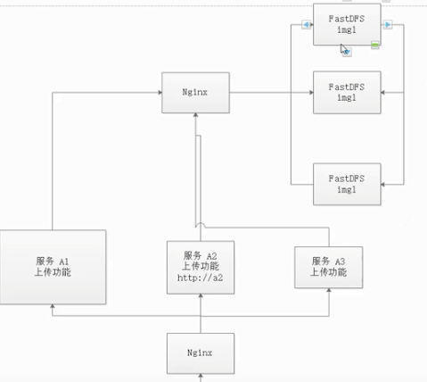
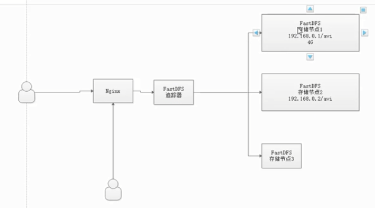

# FastDFS 学习

## 简介

FastDFS是一个开源的轻量级分布式文件系统，它对文件进行管理，功能包括：文件存储、文件同步、文件访问（文件上传、文件下载）等，解决了大容量存储和负载均衡的问题。特别适合以文件为载体的在线服务，如相册网站、视频网站等等。

FastDFS为互联网量身定制，充分考虑了冗余备份、负载均衡、线性扩容等机制，并注重高可用、高性能等指标，使用FastDFS很容易搭建一套高性能的文件服务器集群提供文件上传、下载等服务

FastDFS服务端有两个角色：

- 跟踪器（tracker）
  - 调度工作，在访问上起负载均衡的作用
- 存储节点（storage）

存储节点存储文件，完成文件管理的所有功能：就是这样的存储、同步和提供存取接口，FastDFS同时对文件的metadata进行管理。所谓文件的meta data就是文件的相关属性，以键值对（key valuepair）方式表示，如：width=1024，其中的key为width，value为1024。文件metadata是文件属性列表，可以包含多个键值对。

跟踪器和存储节点都可以由一台或多台服务器构成。跟踪器和存储节点中的服务器均可以随时增加或下线而不会影响线上服务。其中跟踪器中的所有服务器都是对等的，可以根据服务器的压力情况随时增加或减少。

为了支持大容量，存储节点（服务器）采用了分卷（或分组）的组织方式。存储系统由一个或多个卷组成，卷与卷之间的文件是相互独立的，所有卷的文件容量累加就是整个存储系统中的文件容量。一个卷可以由一台或多台存储服务器组成，一个卷下的存储服务器中的文件都是相同的，卷中的多台存储服务器起到了冗余备份和负载均衡的作用。

在卷中增加服务器时，同步已有的文件由系统自动完成，同步完成后，系统自动将新增服务器切换到线上提供服务。

当存储空间不足或即将耗尽时，可以动态添加卷。只需要增加一台或多台服务器，并将它们配置为一个新的卷，这样就扩大了存储系统的容量。

FastDFS中的文件标识分为两个部分：==卷名和文件名，二者缺一不可==


上传FastDFS后，各个FastDFS节点进行文件的同步工作




### 上传过程

- client 询问 tracker 上传到的 storage，不需要附加参数
- tracker 返回一台可用的 storage
- client 直接和 storage 通讯完成文件上传


### 下载过程

- client 询问 tracker 下载文件的 storage，参数为文件标识（卷名和文件名）
- tracker 返回一台可用的 storage
- client 直接和 storage 通讯完成文件下载

需要说明的是，client 为使用 FastDFS 服务的调用方，client 也应该是一台服务器，它对 tracker 和 storage 的调用均为服务器间的调用


### 为什么要结合Nignx使用

在使用 FastDFS 部署一个分布式文件系统的时候，通过 FastDFS 的客户端 API 来进行文件的上传、下载、删除等操作。同时通过 FastDFS 的 HTTP 服务器来提供 HTTP 服务。但是 FastDFS 的 HTTP 服务较为简单，无法提供负载均衡等高性能的服务，我们使用 FastDFS 的 Nginx 模块来弥补这一缺陷。

FastDFS 通过 Tracker 服务器，将文件放在 Storage 服务器存储,但是同组之间的服务器需要复制文件,有延迟的问题.假设 Tracker 服务器将文件上传到了 192.168.1.80,文件ID已经返回客户端,这时,后台会将这个文件复制到 192.168.1.30,如果复制没有完成,客户端就用这个 ID 在 192.168.1.30 取文件,肯定会出现错误

解决：

- fastdfs-nginx-module 可以重定向连接到源服务器取文件,避免客户端由于复制延迟的问题,出现错误





### 其他资源

- 主要参考源码地址：https://github.com/happyfish100 
- 下载地址：http://sourceforge.net/projects/fastdfs/files/
- 官方论坛：http://bbs.chinaunix.net/forum-240-1.html


## 安装

> 使用docker安装

普通安装：https://segmentfault.com/a/1190000018251300?utm_source=tag-newest


在 Linux 服务器上创建 `/usr/local/docker/fastdfs/environment` 目录

说明：

- `/usr/local/docker/fastdfs`：用于存放 `docker-compose.yml` 配置文件及 FastDFS 的数据卷
- `/usr/local/docker/fastdfs/environment`：用于存放 `Dockerfile` 镜像配置文件及 FastDFS 所需环境

### docker-compose.yml

```yaml
version: '3.1'
services:
  fastdfs:
    build: environment
    restart: always
    container_name: fastdfs
    volumes:
      - ./storage:/fastdfs/storage
    network_mode: host # 表示主机模式，容器所有端口都暴露出来，外部可以调用
```


### Dockerfile

在environment目录下创建该文件

```shell
FROM ubuntu:xenial
MAINTAINER stt@qq.com

# 更新数据源
WORKDIR /etc/apt
RUN echo 'deb http://mirrors.aliyun.com/ubuntu/ xenial main restricted universe multiverse' > sources.list
RUN echo 'deb http://mirrors.aliyun.com/ubuntu/ xenial-security main restricted universe multiverse' >> sources.list
RUN echo 'deb http://mirrors.aliyun.com/ubuntu/ xenial-updates main restricted universe multiverse' >> sources.list
RUN echo 'deb http://mirrors.aliyun.com/ubuntu/ xenial-backports main restricted universe multiverse' >> sources.list
RUN apt-get update

# 安装依赖
RUN apt-get install make gcc libpcre3-dev zlib1g-dev --assume-yes

# 复制工具包
ADD fastdfs-5.11.tar.gz /usr/local/src
ADD fastdfs-nginx-module_v1.16.tar.gz /usr/local/src
ADD libfastcommon.tar.gz /usr/local/src
ADD nginx-1.13.6.tar.gz /usr/local/src

# 安装 libfastcommon
WORKDIR /usr/local/src/libfastcommon
RUN ./make.sh && ./make.sh install

# 安装 FastDFS
WORKDIR /usr/local/src/fastdfs-5.11
RUN ./make.sh && ./make.sh install

# 配置 FastDFS 跟踪器
ADD tracker.conf /etc/fdfs
RUN mkdir -p /fastdfs/tracker

# 配置 FastDFS 存储
ADD storage.conf /etc/fdfs
RUN mkdir -p /fastdfs/storage

# 配置 FastDFS 客户端
ADD client.conf /etc/fdfs

# 配置 fastdfs-nginx-module
ADD config /usr/local/src/fastdfs-nginx-module/src

# FastDFS 与 Nginx 集成
WORKDIR /usr/local/src/nginx-1.13.6
RUN ./configure --add-module=/usr/local/src/fastdfs-nginx-module/src
RUN make && make install
ADD mod_fastdfs.conf /etc/fdfs

WORKDIR /usr/local/src/fastdfs-5.11/conf
RUN cp http.conf mime.types /etc/fdfs/

# 配置 Nginx
ADD nginx.conf /usr/local/nginx/conf

COPY entrypoint.sh /usr/local/bin/
ENTRYPOINT ["/usr/local/bin/entrypoint.sh"]

WORKDIR /
EXPOSE 8888
CMD ["/bin/bash"]
```


### entrypoint.sh

注：Shell 创建后是无法直接使用的，需要赋予执行的权限，使用 `chmod +x entrypoint.sh` 命令

```shell
#!/bin/sh
/etc/init.d/fdfs_trackerd start
/etc/init.d/fdfs_storaged start
/usr/local/nginx/sbin/nginx -g 'daemon off;'
```


## 配置文件

### tracker.conf

FastDFS 跟踪器配置，容器中路径为：/etc/fdfs，修改为：

```shell
base_path=/fastdfs/tracker
```


### storage.conf

FastDFS 存储配置，容器中路径为：/etc/fdfs，修改为：

```shell
base_path=/fastdfs/storage
store_path0=/fastdfs/storage
tracker_server=192.168.75.128:22122
http.server_port=8888
```


### client.conf

FastDFS 客户端配置，容器中路径为：/etc/fdfs，修改为：

```shell
base_path=/fastdfs/tracker
tracker_server=192.168.75.128:22122
```


### config

fastdfs-nginx-module 配置文件，容器中路径为：/usr/local/src/fastdfs-nginx-module/src，修改为：

```shell
# 修改前
CORE_INCS="$CORE_INCS /usr/local/include/fastdfs /usr/local/include/fastcommon/"
CORE_LIBS="$CORE_LIBS -L/usr/local/lib -lfastcommon -lfdfsclient"

# 修改后
CORE_INCS="$CORE_INCS /usr/include/fastdfs /usr/include/fastcommon/"
CORE_LIBS="$CORE_LIBS -L/usr/lib -lfastcommon -lfdfsclient"
```


### mod_fastdfs.conf

fastdfs-nginx-module 配置文件，容器中路径为：/usr/local/src/fastdfs-nginx-module/src，修改为

```shell
connect_timeout=10
tracker_server=192.168.75.128:22122
url_have_group_name = true
store_path0=/fastdfs/storage
```


### nginx.conf

Nginx 配置文件，容器中路径为：/usr/local/src/nginx-1.13.6/conf，修改为：

```shell
user  root;
worker_processes  1;

events {
    worker_connections  1024;
}

http {
    include       mime.types;
    default_type  application/octet-stream;
    sendfile        on;
    keepalive_timeout  65;

    server {
        listen       8888;
        server_name  localhost;

        location ~/group([0-9])/M00 {
            ngx_fastdfs_module;
        }

        error_page   500 502 503 504  /50x.html;
        location = /50x.html {
            root   html;
        }
    }
}
```


## 操作

### 编译

```shell
docker-compose build
```


### 启动容器

```shell
docker-compose up -d
```


### 测试上传

- 交互式进入容器

```shell
docker exec -it fastdfs /bin/bash
```

- 测试文件上传

```shell
/usr/bin/fdfs_upload_file /etc/fdfs/client.conf /usr/local/src/fastdfs-5.11/INSTALL
```

- 服务器返回上传地址

```shell
group1/M00/00/00/wKhLi1oHVMCAT2vrAAAeSwu9TgM3976771
```


### 测试Nignx访问

```shell
http://192.168.75.128:8888/group1/M00/00/00/wKhLi1oHVMCAT2vrAAAeSwu9TgM3976771
```


## java客户端调用

创建一个名为 `itoken-service-upload` 的服务提供者项目


### 安装FastDFS java客户端

#### 克隆源码

```shell
git clone https://github.com/happyfish100/fastdfs-client-java.git
```

#### 安装源码并部署

部署前别忘记在 `pom.xml` 中增加 Nexus 相关配置，配置代码如下：

```xml
<!--推送发布地址-->
<distributionManagement>
    <repository>
        <id>nexus-releases</id>
        <name>Nexus Release Repository</name>
        <url>http://192.168.119.133:8081/repository/maven-releases/</url>
    </repository>
    <snapshotRepository>
        <id>nexus-snapshots</id>
        <name>Nexus Snapshot Repository</name>
        <url>http://192.168.119.133:8081/repository/maven-snapshots/</url>
    </snapshotRepository>
</distributionManagement>
```

命令

```shell
mvn clean install deploy
```


### 在项目中添加依赖

```xml
<!-- FastDFS Begin -->
<dependency>
    <groupId>org.csource</groupId>
    <artifactId>fastdfs-client-java</artifactId>
    <version>1.27-SNAPSHOT</version>
</dependency>
<!-- FastDFS End -->
```


### 工具类

#### 接口

```java
package com.funtl.itoken.service.upload.fastdfs;

/**
 * 文件存储服务接口
 * <p>Title: StorageService</p>
 * <p>Description: </p>
 *
 * @author Lusifer
 * @version 1.0.0
 * @date 2018/8/14 5:22
 */
public interface StorageService {
    /**
     * 上传文件
     *
     * @param data    文件的二进制内容
     * @param extName 扩展名
     * @return 上传成功后返回生成的文件id；失败，返回null
     */
    public String upload(byte[] data, String extName);

    /**
     * 删除文件
     *
     * @param fileId 被删除的文件id
     * @return 删除成功后返回0，失败后返回错误代码
     */
    public int delete(String fileId);
}
```


#### 实现类

```java
package com.funtl.itoken.service.upload.fastdfs;

import org.csource.common.NameValuePair;
import org.csource.fastdfs.ClientGlobal;
import org.csource.fastdfs.StorageClient1;
import org.csource.fastdfs.StorageServer;
import org.csource.fastdfs.TrackerClient;
import org.csource.fastdfs.TrackerGroup;
import org.csource.fastdfs.TrackerServer;
import org.slf4j.Logger;
import org.slf4j.LoggerFactory;
import org.springframework.beans.factory.InitializingBean;
import org.springframework.beans.factory.annotation.Value;

import java.io.File;
import java.io.FileWriter;
import java.io.IOException;
import java.io.PrintWriter;

/**
 * 文件存储服务实现
 * <p>Title: FastDFSStorageService</p>
 * <p>Description: </p>
 *
 * @author Lusifer
 * @version 1.0.0
 * @date 2018/8/14 5:27
 */
public class FastDFSStorageService implements StorageService, InitializingBean {
    private static final Logger logger = LoggerFactory.getLogger(FastDFSStorageService.class);

    private TrackerClient trackerClient;

    @Value("${storage.fastdfs.tracker_server}")
    private String trackerServer;

    @Override
    public String upload(byte[] data, String extName) {
        TrackerServer trackerServer = null;
        StorageServer storageServer = null;
        StorageClient1 storageClient1 = null;
        try {
            NameValuePair[] meta_list = null; // new NameValuePair[0];

            trackerServer = trackerClient.getConnection();
            if (trackerServer == null) {
                logger.error("getConnection return null");
            }
            storageServer = trackerClient.getStoreStorage(trackerServer);
            storageClient1 = new StorageClient1(trackerServer, storageServer);
            String fileid = storageClient1.upload_file1(data, extName, meta_list);
            logger.debug("uploaded file <{}>", fileid);
            return fileid;
        } catch (Exception ex) {
            logger.error("Upload fail", ex);
            return null;
        } finally {
            if (storageServer != null) {
                try {
                    storageServer.close();
                } catch (IOException e) {
                    e.printStackTrace();
                }
            }
            if (trackerServer != null) {
                try {
                    trackerServer.close();
                } catch (IOException e) {
                    e.printStackTrace();
                }
            }
            storageClient1 = null;
        }
    }

    @Override
    public int delete(String fileId) {
//        System.out.println("deleting ....");
        TrackerServer trackerServer = null;
        StorageServer storageServer = null;
        StorageClient1 storageClient1 = null;
        int index = fileId.indexOf('/');
        String groupName = fileId.substring(0, index);
        try {
            trackerServer = trackerClient.getConnection();
            if (trackerServer == null) {
                logger.error("getConnection return null");
            }
            storageServer = trackerClient.getStoreStorage(trackerServer, groupName);
            storageClient1 = new StorageClient1(trackerServer, storageServer);
            int result = storageClient1.delete_file1(fileId);
            return result;
        } catch (Exception ex) {
            logger.error("Delete fail", ex);
            return 1;
        } finally {
            if (storageServer != null) {
                try {
                    storageServer.close();
                } catch (IOException e) {
                    e.printStackTrace();
                }
            }
            if (trackerServer != null) {
                try {
                    trackerServer.close();
                } catch (IOException e) {
                    e.printStackTrace();
                }
            }
            storageClient1 = null;
        }
    }

    @Override
    public void afterPropertiesSet() throws Exception {
        File confFile = File.createTempFile("fastdfs", ".conf");
        PrintWriter confWriter = new PrintWriter(new FileWriter(confFile));
        confWriter.println("tracker_server=" + trackerServer);
        confWriter.close();
        ClientGlobal.init(confFile.getAbsolutePath());
        confFile.delete();
        TrackerGroup trackerGroup = ClientGlobal.g_tracker_group;
        trackerClient = new TrackerClient(trackerGroup);

        logger.info("Init FastDFS with tracker_server : {}", trackerServer);
    }
}
```

#### 工厂类

```java
package com.funtl.itoken.service.upload.fastdfs;

import org.springframework.beans.factory.FactoryBean;
import org.springframework.beans.factory.annotation.Autowired;
import org.springframework.beans.factory.annotation.Value;
import org.springframework.beans.factory.config.AutowireCapableBeanFactory;

import java.util.HashMap;
import java.util.Map;

/**
 * 文件存储服务工厂类
 * <p>Title: StorageFactory</p>
 * <p>Description: </p>
 *
 * @author Lusifer
 * @version 1.0.0
 * @date 2018/8/14 5:28
 */
public class StorageFactory implements FactoryBean<StorageService> {

    @Autowired
    private AutowireCapableBeanFactory acbf;

    /**
     * 存储服务的类型，目前仅支持fastdfs
     */
    @Value("${storage.type}")
    private String type;

    private Map<String, Class<? extends StorageService>> classMap;

    public StorageFactory() {
        classMap = new HashMap<>();
        classMap.put("fastdfs", FastDFSStorageService.class);
    }

    @Override
    public StorageService getObject() throws Exception {
        Class<? extends StorageService> clazz = classMap.get(type);
        if (clazz == null) {
            throw new RuntimeException("Unsupported storage type [" + type + "], valid are " + classMap.keySet());
        }

        StorageService bean = clazz.newInstance();
        acbf.autowireBean(bean);
        acbf.initializeBean(bean, bean.getClass().getSimpleName());
        return bean;
    }

    @Override
    public Class<?> getObjectType() {
        return StorageService.class;
    }

    @Override
    public boolean isSingleton() {
        return true;
    }
}
```

#### 配置

```java
package com.funtl.itoken.service.upload.fastdfs;

import org.springframework.context.annotation.Bean;
import org.springframework.context.annotation.Configuration;

/**
 * Java 配置方式定义 StorageFactory 的 Bean 使其可以被依赖注入
 * <p>Title: FastDFSConfiguration</p>
 * <p>Description: </p>
 *
 * @author Lusifer
 * @version 1.0.0
 * @date 2018/8/14 5:28
 */
@Configuration
public class FastDFSConfiguration {
    @Bean
    public StorageFactory storageFactory() {
        return new StorageFactory();
    }
}
```

### 控制器

#### 配置

```java
fastdfs.base.url: http://192.168.75.128:8888/
storage:
  type: fastdfs
  fastdfs:
    tracker_server: 192.168.75.128:22122
```

#### 实现

```java
package com.funtl.itoken.service.upload.controller;

import com.funtl.itoken.service.upload.fastdfs.StorageService;
import org.springframework.beans.factory.annotation.Autowired;
import org.springframework.beans.factory.annotation.Value;
import org.springframework.web.bind.annotation.CrossOrigin;
import org.springframework.web.bind.annotation.RequestMapping;
import org.springframework.web.bind.annotation.RequestMethod;
import org.springframework.web.bind.annotation.RestController;
import org.springframework.web.multipart.MultipartFile;

import java.io.IOException;
import java.util.ArrayList;
import java.util.HashMap;
import java.util.List;
import java.util.Map;

@CrossOrigin(origins = "*", maxAge = 3600)
@RestController
public class UploadController {
    @Value("${fastdfs.base.url}")
    private String FASTDFS_BASE_URL;

    @Autowired
    private StorageService storageService;

    /**
     * 文件上传
     *
     * @param dropFile    Dropzone
     * @param editorFiles wangEditor
     * @return
     */
    @RequestMapping(value = "upload", method = RequestMethod.POST)
    public Map<String, Object> upload(MultipartFile dropFile, MultipartFile[] editorFiles) {
        Map<String, Object> result = new HashMap<>();

        // Dropzone 上传
        if (dropFile != null) {
            result.put("fileName", writeFile(dropFile));
        }

        // wangEditor 上传
        if (editorFiles != null && editorFiles.length > 0) {
            List<String> fileNames = new ArrayList<>();

            for (MultipartFile editorFile : editorFiles) {
                fileNames.add(writeFile(editorFile));
            }

            result.put("errno", 0);
            result.put("data", fileNames);
        }

        return result;
    }

    /**
     * 将图片写入指定目录
     *
     * @param multipartFile
     * @return 返回文件完整路径
     */
    private String writeFile(MultipartFile multipartFile) {
        // 获取文件后缀
        String oName = multipartFile.getOriginalFilename();
        String extName = oName.substring(oName.lastIndexOf(".") + 1);

        // 文件存放路径
        String url = null;
        try {
            String uploadUrl = storageService.upload(multipartFile.getBytes(), extName);
            url = FASTDFS_BASE_URL + uploadUrl;
        } catch (IOException e) {
            e.printStackTrace();
        }

        // 返回文件完整路径
        return url;
    }
}
```


