# Zookeeper


## 分布式协调技术

分布式协调技术主要用来解决分布式环境当中多个进程之间的同步控制，让他们有序的去访问某种临界资源，防止造成"脏数据"的后果。


图中有三台机器，每台机器各跑一个应用程序。然后我们将这三台机器通过网络将其连接起来，构成一个系统来为用户提供服务，对用户来说这个系统的架构是透明的，他感觉不到我这个系统是一个什么样的架构。那么我们就可以把这种系统称作一个**分布式系统**。

在这个分布式系统中如何对进程进行调度，我假设在第一台机器上挂载了一个资源，然后这三个物理分布的进程都要竞争这个资源，但我们又不希望他们同时进行访问，这时候我们就需要一个**协调器**，来让他们有序的来访问这个资源。这个协调器就是我们经常提到的那个**锁**，比如说"进程-1"在使用该资源的时候，会先去获得锁，"进程1"获得锁以后会对该资源保持**独占**，这样其他进程就无法访问该资源，"进程1"用完该资源以后就将锁释放掉，让其他进程来获得锁，那么通过这个锁机制，我们就能保证了分布式系统中多个进程能够有序的访问该临界资源。那么我们把这个分布式环境下的这个锁叫作**分布式锁**。这个分布式锁也就是我们**分布式协调技术**实现的核心内容。
	

## 分布式锁


### 为什么要使用

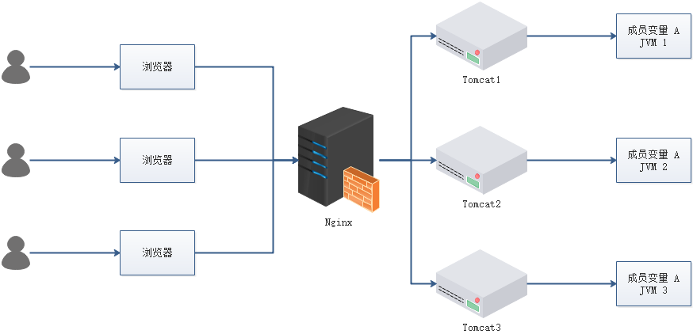

- 成员变量 A 存在 JVM1、JVM2、JVM3 三个 JVM 内存中
- 成员变量 A 同时都会在 JVM 分配一块内存，三个请求发过来同时对这个变量操作，显然结果是不对的
- 不是同时发过来，三个请求分别操作三个不同 JVM 内存区域的数据，变量 A 之间不存在共享，也不具有可见性，处理的结果也是不对的 注：该成员变量 A 是一个有状态的对象

如果我们业务中确实存在这个场景的话，我们就需要一种方法解决这个问题，**这就是分布式锁要解决的问题**


### 分布式锁要具备的条件

- 在分布式系统环境下，一个方法在同一时间只能被一个机器的一个线程执行
- 高可用的获取锁与释放锁
- 高性能的获取锁与释放锁
- 具备可重入特性（可理解为重新进入，由多于一个任务并发使用，而不必担心数据错误）
- 具备锁失效机制，防止死锁
- 具备非阻塞锁特性，即没有获取到锁将直接返回获取锁失败


### 分布式锁的实现

- Memcached：利用 Memcached 的 `add` 命令。此命令是原子性操作，只有在 `key` 不存在的情况下，才能 `add` 成功，也就意味着线程得到了锁。
- Redis：和 Memcached 的方式类似，利用 Redis 的 `setnx` 命令。此命令同样是原子性操作，只有在 `key` 不存在的情况下，才能 `set` 成功。
- **Zookeeper**：利用 Zookeeper 的顺序临时节点，来实现分布式锁和等待队列。Zookeeper 设计的初衷，就是为了实现分布式锁服务的。
- Chubby：Google 公司实现的粗粒度分布式锁服务，底层利用了 Paxos 一致性算法


### 通过 Redis 分布式锁的实现理解基本概念

分布式锁实现的三个核心要素


#### 三个核心要素


##### 加锁

最简单的方法是使用 `setnx` 命令。`key` 是锁的唯一标识，按业务来决定命名。比如想要给一种商品的秒杀活动加锁，可以给 `key` 命名为 “lock_sale_商品ID” 。而 `value` 设置成什么呢？我们可以姑且设置成 `1`。加锁的伪代码如下：

```text
setnx（lock_sale_商品ID，1）
```

当一个线程执行 `setnx` 返回 `1`，说明 `key` 原本不存在，该线程成功得到了锁；当一个线程执行 `setnx` 返回 `0`，说明 `key` 已经存在，该线程抢锁失败。


##### 解锁

有加锁就得有解锁。当得到锁的线程执行完任务，需要释放锁，以便其他线程可以进入。释放锁的最简单方式是执行 `del` 指令，伪代码如下：

```text
del（lock_sale_商品ID）
```

释放锁之后，其他线程就可以继续执行 `setnx` 命令来获得锁。


##### 锁超时

锁超时是什么意思呢？如果一个得到锁的线程在执行任务的过程中挂掉，来不及显式地释放锁，这块资源将会永远被锁住（**死锁**），别的线程再也别想进来。所以，`setnx` 的 `key` 必须设置一个超时时间，以保证即使没有被显式释放，这把锁也要在一定时间后自动释放。`setnx` 不支持超时参数，所以需要额外的指令，伪代码如下：

```text
expire（lock_sale_商品ID， 30）
```

综合伪代码如下：

```text
if（setnx（lock_sale_商品ID，1） == 1）{
    expire（lock_sale_商品ID，30）
    try {
        do something ......
    } finally {
        del（lock_sale_商品ID）
    }
}
```


#### 存在的问题

以上伪代码中存在三个致命问题


##### `setnx` 和 `expire` 的非原子性

设想一个极端场景，当某线程执行 `setnx`，成功得到了锁：


`setnx` 刚执行成功，还未来得及执行 `expire` 指令，节点 1 挂掉了。

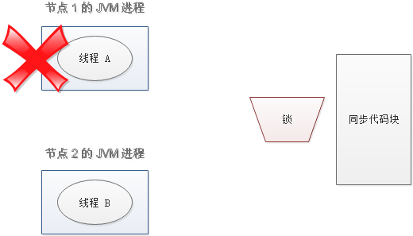

这样一来，这把锁就没有设置过期时间，变成**死锁**，别的线程再也无法获得锁了。

怎么解决呢？`setnx` 指令本身是不支持传入超时时间的，`set` 指令增加了可选参数，伪代码如下：

```text
set（lock_sale_商品ID，1，30，NX）
```

这样就可以取代 `setnx` 指令。


##### `del` 导致的误删

又是一个极端场景，假如某线程成功得到了锁，并且设置的超时时间是 30 秒。


如果某些原因导致线程 A 执行的很慢很慢，过了 30 秒都没执行完，这时候锁过期自动释放，线程 B 得到了锁。

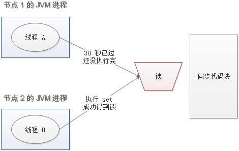

随后，线程 A 执行完了任务，线程 A 接着执行 `del` 指令来释放锁。但这时候线程 B 还没执行完，线程A实际上 `删除的是线程 B 加的锁`。

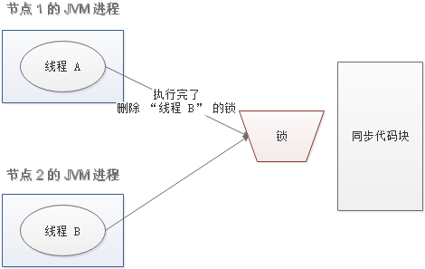

怎么避免这种情况呢？可以在 `del` 释放锁之前做一个判断，验证当前的锁是不是自己加的锁。至于具体的实现，可以在加锁的时候把当前的线程 ID 当做 `value`，并在删除之前验证 `key` 对应的 `value` 是不是自己线程的 ID。

加锁：

```text
String threadId = Thread.currentThread().getId()
set（key，threadId ，30，NX）
```

解锁：

```text
if（threadId .equals(redisClient.get(key))）{
    del(key)
}
```

但是，这样做又隐含了一个新的问题，判断和释放锁是两个独立操作，不是原子性。


##### 出现并发的可能性

还是刚才第二点所描述的场景，虽然我们避免了线程 A 误删掉 `key` 的情况，但是同一时间有 A，B 两个线程在访问代码块，仍然是不完美的。怎么办呢？我们可以让获得锁的线程开启一个**守护线程**，用来给快要过期的锁“续航”。


当过去了 29 秒，线程 A 还没执行完，这时候守护线程会执行 `expire` 指令，为这把锁“续命”20 秒。守护线程从第 29 秒开始执行，每 20 秒执行一次。

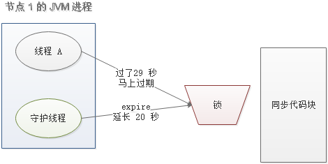

当线程 A 执行完任务，会显式关掉守护线程。


另一种情况，如果节点 1 忽然断电，由于线程 A 和守护线程在同一个进程，守护线程也会停下。这把锁到了超时的时候，没人给它续命，也就自动释放了。


#### redis实现小结

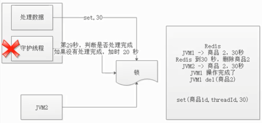

- 原理

  - 先去redis使用setnx(商品id,1) –> 1
    - 发现redis里有数据，说明已经加锁了
    - 发现redis里面没有数据，说明可以获取锁
  - 使用redis del 商品id
    - 显式调用
    - java调用redis setnx
    - java调用redis del
  - 锁超时，30s --> expire
    - java 调用 redis expire

- 3个问题

  - 非原子性操作

    - 原因
      - setnx –> 宕机 --> expire，造成死锁

    - 解决
      - 在redis2.6以上版本解决，提供set含有超时时间方法
      - set(key,value,expire)

  - 误删除

    - 原因
      - jvm1获取锁，数据没有操作完成，但是锁超时
      - jvm2在锁超时获取锁
      - jvm1数据操作完成释放锁 del(商品id)，但是删除的是jvm2的锁
    - 解决
      - 判断是否是自己的锁，是自己的锁则删除
      - set(商品id，threadId，30)

  - 基于第二个问题

    - 原因
      - 锁超时后，数据没有处理完不能释放，否则会造成数据异常
      - jvm1数据处理完成后才能释放锁
    - 解决
      - 增加守护线程，在快到超时时间时，判断数据是否处理完，没有处理完增加超时时间


## 什么是Zookeeper

ZooKeeper 是一种分布式协调服务，用于管理大型主机。在分布式环境中协调和管理服务是一个复杂的过程。ZooKeeper 通过其简单的架构和 API 解决了这个问题。ZooKeeper 允许开发人员专注于核心应用程序逻辑，而不必担心应用程序的分布式特性。

以下为 Zookeeper 的基本概念

### 数据模型

Zookeeper 的数据模型是什么样子呢？它很像数据结构当中的树，也很像文件系统的目录。

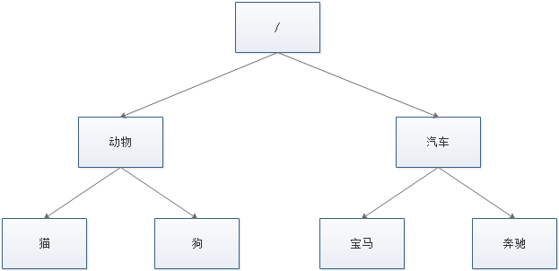

树是由节点所组成，Zookeeper 的数据存储也同样是基于节点，这种节点叫做 **Znode**

但是，不同于树的节点，Znode 的引用方式是路径引用，类似于文件路径：

```text
/动物/猫
/汽车/宝马
```

这样的层级结构，让每一个 Znode 节点拥有唯一的路径，就像命名空间一样对不同信息作出清晰的隔离。


### 组成元素

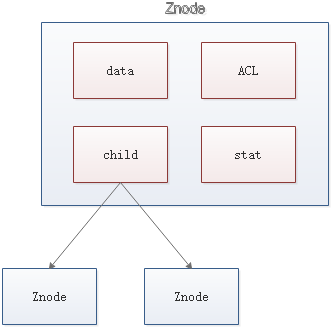

- data：Znode 存储的数据信息。
- ACL：记录 Znode 的访问权限，即哪些人或哪些 IP 可以访问本节点。
- stat：包含 Znode 的各种元数据，比如事务 ID、版本号、时间戳、大小等等。
- child：当前节点的子节点引用

Zookeeper 是为读多写少的场景所设计

Znode 并不是用来存储大规模业务数据，而是用于存储少量的状态和配置信息

==每个节点的数据最大不能超过 1MB==


### 基本操作

创建节点

```text
create
```

删除节点

```text
delete
```

判断节点是否存在

```text
exists
```

获得一个节点的数据

```text
getData
```

设置一个节点的数据

```text
setData
```

获取节点下的所有子节点

```text
getChildren
```

这其中，`exists`，`getData`，`getChildren` 属于读操作。Zookeeper 客户端在请求读操作的时候，可以选择是否设置 **Watch**


### 事件通知

我们可以把 **Watch** 理解成是注册在特定 Znode 上的触发器。当这个 Znode 发生改变，也就是调用了 `create`，`delete`，`setData` 方法的时候，将会触发 Znode 上注册的对应事件，请求 Watch 的客户端会接收到异步通知。

具体交互过程如下：

- 客户端调用 `getData` 方法，`watch` 参数是 `true`。服务端接到请求，返回节点数据，并且在对应的哈希表里插入被 Watch 的 Znode 路径，以及 Watcher 列表。

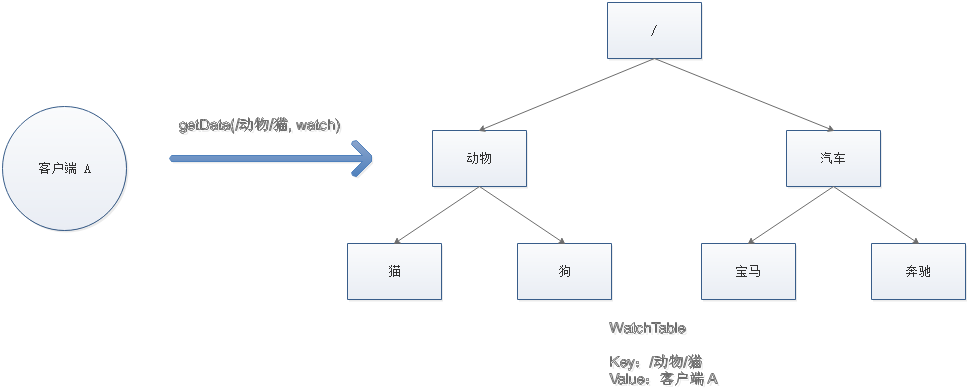

- 当被 Watch 的 Znode 已删除，服务端会查找哈希表，找到该 Znode 对应的所有 Watcher，异步通知客户端，并且删除哈希表中对应的 Key-Value。


### 一致性

Zookeeper 身为分布式系统协调服务，如果自身挂了如何处理呢？为了防止单机挂掉的情况，Zookeeper 维护了一个集群。如下图：


Zookeeper Service 集群是一主多从结构。

在更新数据时，首先更新到主节点（这里的节点是指服务器，不是 Znode），再同步到从节点。

在读取数据时，直接读取任意从节点。

为了保证主从节点的数据一致性，Zookeeper 采用了 **ZAB 协议**，这种协议非常类似于一致性算法 **Paxos**和 **Raft**。


#### ZAB协议

Zookeeper Atomic Broadcast，有效解决了 Zookeeper 集群崩溃恢复，以及主从同步数据的问题。


##### 三种节点状态

- Looking ：选举状态。
- Following ：Follower 节点（从节点）所处的状态。
- Leading ：Leader 节点（主节点）所处状态


##### 最大ZXID

最大 ZXID 也就是节点本地的最新事务编号，包含 epoch 和计数两部分。epoch 是纪元的意思，相当于 Raft 算法选主时候的 term


##### ZAB 的崩溃恢复

假如 Zookeeper 当前的主节点挂掉了，集群会进行崩溃恢复。ZAB 的崩溃恢复分成三个阶段：


###### Leader election

选举阶段，此时集群中的节点处于 Looking 状态。它们会各自向其他节点发起投票，投票当中包含自己的服务器 ID 和最新事务 ID（ZXID）。


接下来，节点会用自身的 ZXID 和从其他节点接收到的 ZXID 做比较，如果发现别人家的 ZXID 比自己大，也就是数据比自己新，那么就重新发起投票，投票给目前已知最大的 ZXID 所属节点。


每次投票后，服务器都会统计投票数量，判断是否有某个节点得到半数以上的投票。如果存在这样的节点，该节点将会成为准 Leader，状态变为 Leading。其他节点的状态变为 Following。


###### Discovery

发现阶段，用于在从节点中发现最新的 ZXID 和事务日志。或许有人会问：既然 Leader 被选为主节点，已经是集群里数据最新的了，为什么还要从节点中寻找最新事务呢？

这是为了防止某些意外情况，比如因网络原因在上一阶段产生多个 Leader 的情况。

所以这一阶段，Leader 集思广益，接收所有 Follower 发来各自的最新 epoch 值。Leader 从中选出最大的 epoch，基于此值加 1，生成新的 epoch 分发给各个 Follower。

各个 Follower 收到全新的 epoch 后，返回 ACK 给 Leader，带上各自最大的 ZXID 和历史事务日志。Leader 选出最大的 ZXID，并更新自身历史日志。


###### Synchronization

同步阶段，把 Leader 刚才收集得到的最新历史事务日志，同步给集群中所有的 Follower。只有当半数 Follower 同步成功，这个准 Leader 才能成为正式的 Leader。

自此，故障恢复正式完成。


##### ZAB 的数据写入


###### Broadcast

ZAB 的数据写入涉及到 Broadcast 阶段，简单来说，就是 Zookeeper 常规情况下更新数据的时候，由 Leader 广播到所有的 Follower。其过程如下：

- 客户端发出写入数据请求给任意 Follower。
- Follower 把写入数据请求转发给 Leader。
- Leader 采用二阶段提交方式，先发送 Propose 广播给 Follower。
- Follower 接到 Propose 消息，写入日志成功后，返回 ACK 消息给 Leader。
- Leader 接到半数以上ACK消息，返回成功给客户端，并且广播 Commit 请求给 Follower


ZAB 协议既不是强一致性，也不是弱一致性

而是处于两者之间的**单调一致性（顺序一致性）**

靠事务 ID 和版本号，保证了数据的更新和读取是有序的


### 应用场景


#### 服务注册与发现

利用 Znode 和 Watcher，可以实现分布式服务的注册和发现。最著名的应用就是阿里的分布式 RPC 框架 Dubbo。


#### 共享配置与状态信息

Redis 的分布式解决方案 Codis，就利用了 Zookeeper 来存放数据路由表和 codis-proxy 节点的元信息。同时 codis-config 发起的命令都会通过 ZooKeeper 同步到各个存活的 codis-proxy。

此外，Kafka、HBase、Hadoop，也都依靠Zookeeper同步节点信息，实现高可用


#### ZK实现分布式锁

这是雅虎研究员设计 Zookeeper 的初衷。利用 Zookeeper 的临时顺序节点，可以轻松实现分布式锁


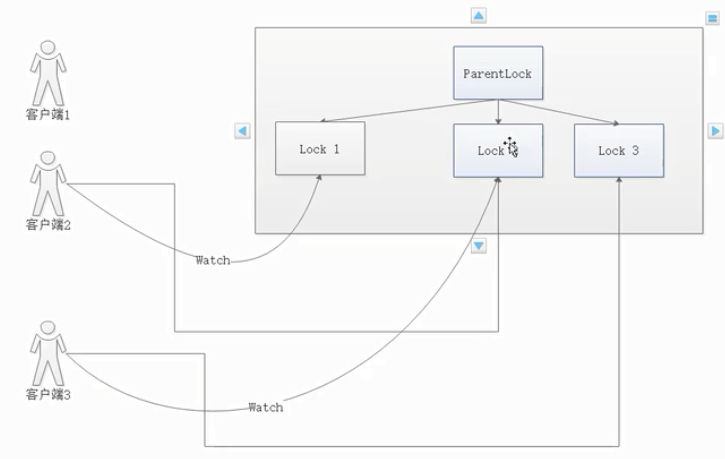

watch观察前一个节点

临时节点有序节点类型

- 解决加锁解锁
- watch解决锁超时问题


##### 什么是临时顺序节点？


Zookeeper 的数据存储结构就像一棵树，这棵树由节点组成，这种节点叫做 Znode


##### Znode 的四种类型


###### 持久节点（PERSISTENT）

默认的节点类型。创建节点的客户端与 Zookeeper 断开连接后，该节点依旧存在。


###### 持久节点顺序节点（PERSISTENT_SEQUENTIAL）

所谓顺序节点，就是在创建节点时，Zookeeper 根据创建的时间顺序给该节点名称进行编号：


###### 临时节点（EPHEMERAL）

和持久节点相反，当创建节点的客户端与 Zookeeper 断开连接后，临时节点会被删除：


###### 临时顺序节点（EPHEMERAL_SEQUENTIAL）

顾名思义，临时顺序节点结合和临时节点和顺序节点的特点：在创建节点时，Zookeeper 根据创建的时间顺序给该节点名称进行编号；当创建节点的客户端与 Zookeeper 断开连接后，临时节点会被删除。


##### Zookeeper 分布式锁的原理

Zookeeper 分布式锁恰恰应用了临时顺序节点。具体如何实现呢？让我们来看一看详细步骤：


###### 获取锁

首先，在 Zookeeper 当中创建一个持久节点 ParentLock。当第一个客户端想要获得锁时，需要在 ParentLock 这个节点下面创建一个**临时顺序节点** Lock1。


之后，Client1 查找 ParentLock 下面所有的临时顺序节点并排序，判断自己所创建的节点 Lock1 是不是顺序最靠前的一个。如果是第一个节点，则成功获得锁。


这时候，如果再有一个客户端 Client2 前来获取锁，则在 ParentLock 下载再创建一个临时顺序节点 Lock2。


Client2 查找 ParentLock 下面所有的临时顺序节点并排序，判断自己所创建的节点 Lock2 是不是顺序最靠前的一个，结果发现节点 Lock2 并不是最小的。

于是，Client2 向排序仅比它靠前的节点 Lock1 注册 Watcher，用于监听 Lock1 节点是否存在。这意味着 Client2 抢锁失败，进入了等待状态。


这时候，如果又有一个客户端 Client3 前来获取锁，则在 ParentLock 下载再创建一个临时顺序节点 Lock3。


Client3 查找 ParentLock 下面所有的临时顺序节点并排序，判断自己所创建的节点 Lock3 是不是顺序最靠前的一个，结果同样发现节点 Lock3 并不是最小的。

于是，Client3 向排序仅比它靠前的节点 Lock2 注册 Watcher，用于监听 Lock2 节点是否存在。这意味着 Client3 同样抢锁失败，进入了等待状态。


这样一来，Client1 得到了锁，Client2 监听了 Lock1，Client3 监听了 Lock2。这恰恰形成了一个等待队列，


###### 释放锁

>  释放锁分为两种情况

- 任务完成，客户端显示释放

当任务完成时，Client1 会显示调用删除节点 Lock1 的指令。


- 任务执行过程中，客户端崩溃

获得锁的 Client1 在任务执行过程中，如果崩溃，则会断开与 Zookeeper 服务端的链接。根据临时节点的特性，相关联的节点 Lock1 会随之自动删除。


由于 Client2 一直监听着 Lock1 的存在状态，当 Lock1 节点被删除，Client2 会立刻收到通知。这时候 Client2 会再次查询 ParentLock 下面的所有节点，确认自己创建的节点 Lock2 是不是目前最小的节点。如果是最小，则 Client2 顺理成章获得了锁。


同理，如果 Client2 也因为任务完成或者节点崩溃而删除了节点 Lock2，那么 Client3 就会接到通知。


最终，Client3 成功得到了锁。


##### ZK和Redis实现分布式锁对比

| 分布式锁  | 优点                                                         | 缺点                                                         |
| --------- | ------------------------------------------------------------ | ------------------------------------------------------------ |
| redis     | Set和Del指令性能高                                           | 实现复杂，需要考虑超时，原子性，误删除等场景；没有等待锁的队列，只能客户端自旋来等锁，效率低下。 |
| zookeeper | 有封装好的框架，容易实现；有等待锁的队列，提升了获取锁的效率 |                                                              |
|           |                                                              |                                                              |


## 安装

> 基于docker进行安装

Zookeeper 部署有三种方式，单机模式、集群模式、伪集群模式，以下采用 Docker 的方式部署

**注意：** 集群为大于等于3个奇数，如 3、5、7,不宜太多，集群机器多了选举和数据同步耗时长，不稳定

此处在docker-compose中的zookeeper的版本为3.4.13


### 单机模式

#### docker-compose.yml

```yaml
version: '3.1'
services:
    zoo1:
        image: zookeeper:3.4.13
        restart: always
        hostname: zoo1
        ports:
            - 2181:2181
        environment:
            ZOO_MY_ID: 1
            ZOO_SERVERS: server.1=zoo1:2888:3888
```

####  验证是否安装成功

- 以交互的方式进入容器

```text
docker exec -it zookeeper_zoo1_1 /bin/bash
```

- 使用客户端连接到服务端

```text
bash-4.3# ./bin/zkCli.sh -server 192.168.75.130:2181
Connecting to 192.168.75.130:2181
2017-11-09 07:45:58,365 [myid:] - INFO  [main:Environment@100] - Client environment:zookeeper.version=3.4.10-39d3a4f269333c922ed3db283be479f9deacaa0f, built on 03/23/2017 10:13 GMT
2017-11-09 07:45:58,374 [myid:] - INFO  [main:Environment@100] - Client environment:host.name=zoo1
2017-11-09 07:45:58,374 [myid:] - INFO  [main:Environment@100] - Client environment:java.version=1.8.0_131
2017-11-09 07:45:58,380 [myid:] - INFO  [main:Environment@100] - Client environment:java.vendor=Oracle Corporation
2017-11-09 07:45:58,381 [myid:] - INFO  [main:Environment@100] - Client environment:java.home=/usr/lib/jvm/java-1.8-openjdk/jre
2017-11-09 07:45:58,381 [myid:] - INFO  [main:Environment@100] - Client environment:java.class.path=/zookeeper-3.4.10/bin/../build/classes:/zookeeper-3.4.10/bin/../build/lib/*.jar:/zookeeper-3.4.10/bin/../lib/slf4j-log4j12-1.6.1.jar:/zookeeper-3.4.10/bin/../lib/slf4j-api-1.6.1.jar:/zookeeper-3.4.10/bin/../lib/netty-3.10.5.Final.jar:/zookeeper-3.4.10/bin/../lib/log4j-1.2.16.jar:/zookeeper-3.4.10/bin/../lib/jline-0.9.94.jar:/zookeeper-3.4.10/bin/../zookeeper-3.4.10.jar:/zookeeper-3.4.10/bin/../src/java/lib/*.jar:/conf:
2017-11-09 07:45:58,381 [myid:] - INFO  [main:Environment@100] - Client environment:java.library.path=/usr/lib/jvm/java-1.8-openjdk/jre/lib/amd64/server:/usr/lib/jvm/java-1.8-openjdk/jre/lib/amd64:/usr/lib/jvm/java-1.8-openjdk/jre/../lib/amd64:/usr/java/packages/lib/amd64:/usr/lib64:/lib64:/lib:/usr/lib
2017-11-09 07:45:58,381 [myid:] - INFO  [main:Environment@100] - Client environment:java.io.tmpdir=/tmp
2017-11-09 07:45:58,381 [myid:] - INFO  [main:Environment@100] - Client environment:java.compiler=<NA>
2017-11-09 07:45:58,381 [myid:] - INFO  [main:Environment@100] - Client environment:os.name=Linux
2017-11-09 07:45:58,382 [myid:] - INFO  [main:Environment@100] - Client environment:os.arch=amd64
2017-11-09 07:45:58,382 [myid:] - INFO  [main:Environment@100] - Client environment:os.version=4.4.0-98-generic
2017-11-09 07:45:58,386 [myid:] - INFO  [main:Environment@100] - Client environment:user.name=root
2017-11-09 07:45:58,386 [myid:] - INFO  [main:Environment@100] - Client environment:user.home=/root
2017-11-09 07:45:58,386 [myid:] - INFO  [main:Environment@100] - Client environment:user.dir=/zookeeper-3.4.10
2017-11-09 07:45:58,389 [myid:] - INFO  [main:ZooKeeper@438] - Initiating client connection, connectString=192.168.75.130:2181 sessionTimeout=30000 watcher=org.apache.zookeeper.ZooKeeperMain$MyWatcher@3eb07fd3
2017-11-09 07:45:58,428 [myid:] - INFO  [main-SendThread(192.168.75.130:2181):ClientCnxn$SendThread@1032] - Opening socket connection to server 192.168.75.130/192.168.75.130:2181. Will not attempt to authenticate using SASL (unknown error)
Welcome to ZooKeeper!
JLine support is enabled
2017-11-09 07:45:58,529 [myid:] - INFO  [main-SendThread(192.168.75.130:2181):ClientCnxn$SendThread@876] - Socket connection established to 192.168.75.130/192.168.75.130:2181, initiating session
[zk: 192.168.75.130:2181(CONNECTING) 0] 2017-11-09 07:45:58,573 [myid:] - INFO  [main-SendThread(192.168.75.130:2181):ClientCnxn$SendThread@1299] - Session establishment complete on server 192.168.75.130/192.168.75.130:2181, sessionid = 0x15f9fbc12ec0000, negotiated timeout = 30000

WATCHER::

WatchedEvent state:SyncConnected type:None path:null
```

- 使用服务端工具检查服务器状态

```text
bash-4.3# ./bin/zkServer.sh status
ZooKeeper JMX enabled by default
Using config: /conf/zoo.cfg
Mode: standalone

```


### 集群模式

准备 3 台 Ubuntu Server 系统，并分别配置 Zookeeper


#### 第一台主机

##### docker-compose.yml

```yaml
version: '3.1'
services:
    zoo1:
        image: zookeeper
        restart: always
        environment:
            ZOO_MY_ID: 1 #docker-compose 自动添加myid文件
            ZOO_SERVERS: server.1=192.168.75.130:2888:3888 server.2=192.168.75.134:2888:3888 server.3=192.168.75.135:2888:3888
        network_mode: host
```

##### 验证测试

```text
root@UbuntuBase:/usr/local/docker/zookeeper# docker exec -it zookeeper_zoo1_1 /bin/bash
bash-4.3# ./bin/zkServer.sh status
ZooKeeper JMX enabled by default
Using config: /conf/zoo.cfg
Mode: leader
```


#### 第二台主机

##### docker-compose.yml

```text
version: '3.1'
services:
    zoo2:
        image: zookeeper
        restart: always
        environment:
            ZOO_MY_ID: 2
            ZOO_SERVERS: server.1=192.168.75.130:2888:3888 server.2=192.168.75.134:2888:3888 server.3=192.168.75.135:2888:3888
        network_mode: host
```

##### 验证测试

```text
root@UbuntuBase:/usr/local/docker/zookeeper# docker exec -it zookeeper_zoo2_1 /bin/bash
bash-4.3# ./bin/zkServer.sh status
ZooKeeper JMX enabled by default
Using config: /conf/zoo.cfg
Mode: follower
```


#### 第三台主机

##### docker-compose.yml

```text
version: '3.1'
services:
    zoo3:
        image: zookeeper
        restart: always
        environment:
            ZOO_MY_ID: 3
            ZOO_SERVERS: server.1=192.168.75.130:2888:3888 server.2=192.168.75.134:2888:3888 server.3=192.168.75.135:2888:3888
        network_mode: host
```

##### 验证测试

```text
root@UbuntuBase:/usr/local/docker/zookeeper# docker exec -it zookeeper_zoo3_1 /bin/bash
bash-4.3# ./bin/zkServer.sh status
ZooKeeper JMX enabled by default
Using config: /conf/zoo.cfg
Mode: follower
```


### 伪集群模式

#### docker-compose.yml

```yaml
version: '3.1'
services:
    zoo1:
        image: zookeeper:3.4.13
        restart: always
        hostname: zoo1 #在局域网中可以用域名来访问，可以代替ip地址
        ports:
            - 2181:2181
        environment:
            ZOO_MY_ID: 1
            ZOO_SERVERS: server.1=zoo1:2888:3888 server.2=zoo2:2888:3888 server.3=zoo3:2888:3888

    zoo2:
        image: zookeeper:3.4.13
        restart: always
        hostname: zoo2
        ports:
            - 2182:2181
        environment:
            ZOO_MY_ID: 2
            ZOO_SERVERS: server.1=zoo1:2888:3888 server.2=zoo2:2888:3888 server.3=zoo3:2888:3888

    zoo3:
        image: zookeeper:3.4.13
        restart: always
        hostname: zoo3
        ports:
            - 2183:2181
        environment:
            ZOO_MY_ID: 3
            ZOO_SERVERS: server.1=zoo1:2888:3888 server.2=zoo2:2888:3888 server.3=zoo3:2888:3888
```


#### 验证是否安装成功

- 分别以交互方式进入容器查看

```text
docker exec -it zookeeper_zoo1_1 /bin/bash
```

```text
docker exec -it zookeeper_zoo2_1 /bin/bash
```

```text
docker exec -it zookeeper_zoo3_1 /bin/bash
```

- 使用服务端工具检查服务器状态

```shell
root@UbuntuBase:/usr/local/docker/zookeeper# docker exec -it zookeeper_zoo1_1 /bin/bash
bash-4.3# ./bin/zkServer.sh status
ZooKeeper JMX enabled by default
Using config: /conf/zoo.cfg
Mode: follower
```

```shell
root@UbuntuBase:/usr/local/docker/zookeeper# docker exec -it zookeeper_zoo2_1 /bin/bash
bash-4.3# ./bin/zkServer.sh status
ZooKeeper JMX enabled by default
Using config: /conf/zoo.cfg
Mode: follower
```

```shell
root@UbuntuBase:/usr/local/docker/zookeeper# docker exec -it zookeeper_zoo3_1 /bin/bash
bash-4.3# ./bin/zkServer.sh status
ZooKeeper JMX enabled by default
Using config: /conf/zoo.cfg
Mode: leader
```

从上面的验证结果可以看出：zoo1 为跟随者，zoo2 为跟随者，zoo3 为领导者


## 配置说明

### 三种工作模式

- 单机模式：存在单点故障
- 集群模式：在多台机器上部署 Zookeeper 集群，适合线上环境使用。
- 伪集群模式：在一台机器同时运行多个 Zookeeper 实例，仍然有单点故障问题，当然，其中配置的端口号要错开的，适合实验环境模拟集群使用


### 三种端口号

- 2181：客户端连接 Zookeeper 集群使用的监听端口号
- 2888：集群内机器通讯使用（Leader 和 Follower 之间数据同步使用的端口号，Leader 监听此端口）
- 3888：选举 leader 使用


### 单模式配置文件

配置文件路径：`/conf/zoo.cfg`

```text
clientPort=2181
dataDir=/data
dataLogDir=/datalog
tickTime=2000
```

- clientPort：这个端口就是客户端连接 Zookeeper 服务器的端口，Zookeeper 会监听这个端口，接受客户端的访问请求。
- dataDir：Zookeeper 保存数据的目录。
- dataLogDir：Zookeeper 保存日志的目录。
- tickTime：这个时间是作为 Zookeeper 服务器之间或客户端与服务器之间维持心跳的时间间隔，也就是每隔 tickTime 时间就会发送一个心跳


### 集群模式配置文件

配置文件路径：`/conf/zoo.cfg`

```text
clientPort=2181
dataDir=/data
dataLogDir=/datalog
tickTime=2000
initLimit=5
syncLimit=2
autopurge.snapRetainCount=3
autopurge.purgeInterval=0
maxClientCnxns=60
server.1=192.168.0.1:2888:3888
server.2=192.168.0.2:2888:3888
server.3=192.168.0.3:2888:3888
```

- initLimit：配置 Zookeeper 接受客户端（这里所说的客户端不是用户连接 Zookeeper 服务器的客户端，而是 Zookeeper 服务器集群中连接到 Leader 的 Follower 服务器）初始化连接时最长能忍受多少个心跳时间间隔数。当已经超过 initLimit（默认为 10） 个心跳的时间（也就是 tickTime）长度后 Zookeeper 服务器还没有收到客户端的返回信息，那么表明这个客户端连接失败。总的时间长度就是 `5 * 2000 = 10` 秒
- syncLimit：配置 Leader 与 Follower 之间发送消息，请求和应答时间长度，最长不能超过多少个 tickTime 的时间长度，总的时间长度就是 `2 * 2000 = 4` 秒
- ==定时清理==（Zookeeper 从 3.4.0 开始提供了自动清理快照和事务日志的功能）以下两个参数配合使用：
  - autopurge.purgeInterval：指定了清理频率，单位是小时，需要填写一个 1 或更大的整数，默认是 0，表示不开启自己清理功能。
  - autopurge.snapRetainCount：指定了需要保留的文件数目。默认是保留 3 个。
- maxClientCnxns：限制连接到 Zookeeper 的客户端的数量，限制并发连接的数量，它通过 IP 来区分不同的客户端。此配置选项可以用来阻止某些类别的 Dos 攻击。将它设置为 0 或者忽略而不进行设置将会取消对并发连接的限制。
- server.A=B：C：D：其中 A 是一个数字，表示这个是第几号服务器。B 是这个服务器的 IP 地址。C 表示的是这个服务器与集群中的 Leader 服务器交换信息的端口(`2888`)；D 表示的是万一集群中的 Leader 服务器挂了，需要一个端口来重新进行选举，选出一个新的 Leader，而这个端口就是用来执行选举时服务器相互通信的端口(`3888`)。如果是伪集群的配置方式，由于 B 都是一样，所以不同的 Zookeeper 实例通信端口号不能一样，所以要给它们分配不同的端口号。

**注意：** `server.A` 中的 A 是在 `dataDir` 配置的目录中创建一个名为 `myid` 的文件里的值（如：1）


### 常用命令

#### zkServer

- 启动服务
  - `./zkServer.sh start`
- 停止服务
  - `./zkServer.sh stop`
- 重启服务
  - `./zkServer.sh restart`
- 执行状态
  - `./zkServer.sh status`


#### zkClient

- 客户端连接服务器并进入bash模式

```shell
./zkCli.sh -server <ip>:<port>

# 命令参数
ZooKeeper -server host:port cmd args
	stat path [watch]
	set path data [version]
	ls path [watch]
	delquota [-n|-b] path
	ls2 path [watch]
	setAcl path acl
	setquota -n|-b val path
	history 
	redo cmdno
	printwatches on|off
	delete path [version]
	sync path
	listquota path
	rmr path
	get path [watch]
	create [-s] [-e] path data acl
	addauth scheme auth
	quit 
	getAcl path
	close 
	connect host:port
```

示例：

```shell
root@root:/usr/local/docker/zookeeper# docker exec -it zookeeper_zoo3_1 /bin/bash
bash-4.4# cd bin
bash-4.4# ./zkCli.sh -server localhost:2181
```

- 创建查看删除节点

```shell
[zk: localhost:2181(CONNECTED) 0] create /test "hello zookeeper"
Created /test
[zk: localhost:2181(CONNECTED) 1] get /test
hello zookeeper
cZxid = 0x100000002
ctime = Sat Jul 27 12:03:16 GMT 2019
mZxid = 0x100000002
mtime = Sat Jul 27 12:03:16 GMT 2019
pZxid = 0x100000002
cversion = 0
dataVersion = 0
aclVersion = 0
ephemeralOwner = 0x0
dataLength = 15
numChildren = 0
[zk: localhost:2181(CONNECTED) 2] delete /test
[zk: localhost:2181(CONNECTED) 3] get /test
Node does not exist: /test
```


## 和eureka

## 的区别

著名的CAP理论指出，一个分布式系统不可能同时满足C(一致性)、A(可用性)和P(分区容错性，系统部分节点故障后，其他节点依然可以正常使用)。由于分区容错性在是分布式系统中必须要保证的，因此我们只能在A和C之间进行权衡。在此Zookeeper保证的是CP, 而Eureka则是AP。

### ZK保证CP

基于==客户端==的服务注册和发现

当向注册中心查询服务列表时，可以容忍注册中心返回的是几分钟以前的注册信息，但不能接受服务直接down掉不可用。也就是说，服务注册功能对可用性的要求要高于一致性。但是zk会出现这样一种情况，当master节点因为网络故障与其他节点失去联系时，剩余节点会重新进行leader选举。问题在于，选举leader的时间太长，30 ~ 120s, 且选举期间整个zk集群都是不可用的，这就导致在选举期间注册服务瘫痪。在云部署的环境下，因网络问题使得zk集群失去master节点是较大概率会发生的事，虽然服务能够最终恢复，但是漫长的选举时间导致的注册长期不可用是不能容忍的。

### Eureka保证AP

基于==服务端==的注册和发现

Eureka看明白了这一点，因此在设计时就优先保证可用性。Eureka各个节点都是平等的，几个节点挂掉不会影响正常节点的工作，剩余的节点依然可以提供注册和查询服务。而Eureka的客户端在向某个Eureka注册或时如果发现连接失败，则会自动切换至其它节点，只要有一台Eureka还在，就能保证注册服务可用(保证可用性)，只不过查到的信息可能不是最新的(不保证强一致性)。除此之外，Eureka还有一种自我保护机制，如果在15分钟内超过85%的节点都没有正常的心跳，那么Eureka就认为客户端与注册中心出现了网络故障，此时会出现以下几种情况： 

- Eureka不再从注册列表中移除因为长时间没收到心跳而应该过期的服务 
- Eureka仍然能够接受新服务的注册和查询请求，但是不会被同步到其它节点上(即保证当前节点依然可用)
- 当网络稳定时，当前实例新的注册信息会被同步到其它节点中 

因此， Eureka可以很好的应对因网络故障导致部分节点失去联系的情况，而不会像zookeeper那样使整个注册服务瘫痪。

### 小结

Eureka作为单纯的服务注册中心来说要比zookeeper更加“专业”，因为注册服务更重要的是可用性，我们可以接受短期内达不到一致性的状况。不过Eureka目前1.X版本的实现是基于servlet的java web应用，它的极限性能肯定会受到影响。期待正在开发之中的2.X版本能够从servlet中独立出来成为单独可部署执行的服务


## zookeeper介绍


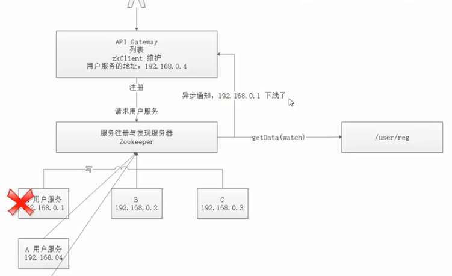


### zookeeper的数据一致性问题

