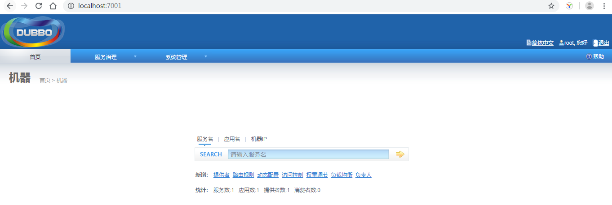
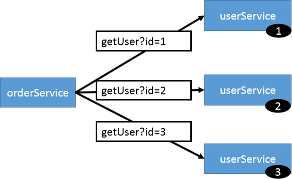

# Dubbo实践


## zookeeper


### 安装

#### window版本

##### 安装注册中心 zookeeper

- 下载zookeeper网址 https://archive.apache.org/dist/zookeeper/zookeeper-3.4.13/ 

- 解压zookeeper解压运行zkServer.cmd ，初次运行会报错，没有zoo.cfg配置文件

- 修改zoo.cfg配置文件将conf下的zoo_sample.cfg复制一份改名为zoo.cfg即可

  - dataDir=./   临时数据存储的目录（可写相对路径）如：../data
  - clientPort=2181   
  - zookeeper的端口号修改完成后再次启动zookeeper

- 使用zkCli.cmd测试

  - ls / 列出zookeeper根下保存的所有节点 

  - create –e /atguigu 123 创建一个atguigu==临时==节点，值为123

  - get /atguigu 获取/atguigu节点的值

    

##### 安装控制台（可不安装）

dubbo本身并不是一个服务软件。它其实就是一个jar包能够帮你的java程序连接到zookeeper，并利用zookeeper消费、提供服务。所以你不用在Linux上启动什么dubbo服务。但是为了让用户更好的管理监控众多的dubbo服务，官方提供了一个可视化的监控程序，不过这个监控即使不装也不影响使用。

- 下载dubbo-admin https://github.com/apache/incubator-dubbo-ops 

- 进入目录，修改dubbo-admin配置，修改 src\main\resources\application.properties 指定zookeeper地址

```properties
server.port=7001
spring.velocity.cache=false
spring.velocity.charset=UTF-8
spring.velocity.layout-url=/templates/default.vm
spring.messages.fallback-to-system-locale=false
spring.messages.basename=i18n/message
spring.root.password=root
spring.guest.password=guest
# 主要是修改注册地址
dubbo.registry.address=zookeeper://127.0.0.1:2181
```

- 打包`mvn clean package -Dmaven.test.skip=true`

- 运行`java -jar dubbo-admin-0.0.1-SNAPSHOT.jar`
  - 注意：【有可能控制台看着启动了，但是网页打不开，需要在控制台按下ctrl+c
  - 默认使用root/root 登陆
  
  



##### 安装监控中心

- 监控dubbo接口的调用情况

- 下载 dubbo-ops https://github.com/apache/incubator-dubbo-ops 

- 修改配置指定注册中心地址

  - 进入 dubbo-monitor-simple\src\main\resources\conf
  - 修改 dubbo.properties文件

  ```properties
  dubbo.container=log4j,spring,registry,jetty-monitor
  dubbo.application.name=simple-monitor
  dubbo.application.owner=dubbo
  #dubbo.registry.address=multicast://224.5.6.7:1234
  dubbo.registry.address=zookeeper://127.0.0.1:2181
  #dubbo.registry.address=redis://127.0.0.1:6379
  #dubbo.registry.address=dubbo://127.0.0.1:9090
  dubbo.protocol.port=7070
  dubbo.jetty.port=8080
  dubbo.jetty.directory=${user.home}/monitor
  dubbo.charts.directory=${user.home}/monitor/charts
  dubbo.statistics.directory=${user.home}/monitor/statistics
  dubbo.log4j.file=logs/dubbo-monitor-simple.log
  dubbo.log4j.level=WARN
  ```

- 打包 `mvn clean package -Dmaven.test.skip=true`

  - 注意生成的是`dubbo-monitor-simple-2.0.0-assembly.tar.gz`文件

- 解压该文件，得到部署文件夹`dubbo-monitor-simple-2.0.0`

- 运行`dubbo-monitor-simple-2.0.0-deploy\assembly.bin`下的 `start.bat` 文件
  
  - 若缺少servlet-api，自行导入servlet-api再访问监控中心


## 整合SpringBoot

### 依赖

```xml
<dependency>
    <groupId>com.alibaba.boot</groupId>
    <artifactId>dubbo-spring-boot-starter</artifactId>
    <version>0.2.0</version>
</dependency>
```


### 配置

```properties
#提供者配置：
dubbo.application.name=gmall-user
dubbo.registry.protocol=zookeeper
dubbo.registry.address=192.168.67.159:2181
dubbo.scan.base-package=com.atguigu.gmall
#protocol.name 是分布式固定是dubbo,不要改。使用dubbo协议，将服务暴露在20880端口
dubbo.protocol.name=dubbo
dubbo.protocol.port=20880
#application.name就是服务名，不能跟别的dubbo提供端重复
#registry.protocol 是指定注册中心协议
#registry.address 是注册中心的地址加端口号

#base-package  注解方式要扫描的包

#消费者配置：
dubbo.application.name=gmall-order-web
dubbo.registry.protocol=zookeeper
dubbo.registry.address=192.168.67.159:2181
dubbo.scan.base-package=com.atguigu.gmall
dubbo.protocol.name=dubbo
```


### 注解

- @Service 服务提供者使用

- @Reference 服务消费者使用

- @EnableDubbo 开启dubbo服务


## dubbo的配置

### 配置读取顺序


- JVM 启动 -D 参数优先，这样可以使用户在部署和启动时进行参数重写，比如在启动时需改变协议的端口。

- XML 次之，如果在 XML 中有配置，则 dubbo.properties 中的相应配置项无效。

- Properties 最后，相当于缺省值，只有 XML 没有配置时，application.properties  在前， dubbo.properties 的相应配置项才会生效，通常用于共享公共配置，比如应用名


### 启动时检查

- 参考http://dubbo.apache.org/zh-cn/docs/user/references/xml/dubbo-reference.html

- 消费者在启动时会自动检查提供者是否可用，不可用抛出异常
- 默认开启，check = “true”
- 如果服务是懒加载，或者服务不关系，或者出现了循环引用，或者测试环境，必须有一方先启动，可用关闭该检查
- 在消费者一端进行配置

```xml
<!--单独配置-->
<dubbo:reference interface=“com.stt.xxx” id="xxx" check="false"></dubbo:reference>
<!--配置当前消费者的统一规则-->
<dubbo:consumer check="false"></dubbo:consumer>
<!--配置是否检查注册中心存在,设置为false，那么在启动时找不到注册中心，则不报错-->
<dubbo:registry check="false"></dubbo:registry>
```


### 超时设置

- 默认值是`dubbo:consumer`中配置的timeout，值为1000ms
- 可以在`dubbo:feference`中单独设置timeout，覆盖默认值


#### XML配置的覆盖关系

以 timeout 为例，下图显示了配置的查找顺序，其它 retries, loadbalance, actives 等类似：

- 精确优先（方法级优先，接口级次之，全局配置再次之）
- 消费设置优先（若级别一样，则消费方优先，提供方次之）

其中，服务提供方配置，通过 URL 经由注册中心传递给消费方


### 重试次数

- reference的retries
- 缺省使用`<dubbo:consumer>`的retries
- 总共次数retries+1
- 如果有多个提供方，则会负载均衡的重试
  - 如果第一个服务提供方失败了，再调用第一个服务一次
  - 如果第一个服务再失败了，那么就调用第二个服务
- 幂等性接口（查询，删除，修改），可以设置重试次数
- 非幂等性接口（新增），不能设置重试次数
- 0 代表不重试


### 多版本

- version
- 一个服务提供方，一个接口由于升级含有2个实现（新旧实现）
- 使用版本进行调用控制
- 用于实现灰度发布
- 服务提供者先升级一部分，服务消费者升级全部，等测试通过，再将服务提供者全部升级


### 本地存根

远程服务后，客户端通常只剩下接口，而实现全在服务器端，但提供方有些时候想在客户端也执行部分逻辑，比如：做 ThreadLocal 缓存，提前验证参数，调用失败后伪造容错数据等等，此时就需要在 API 中带上 Stub，客户端生成 Proxy 实例，会把 Proxy 通过构造函数传给 Stub [[1\]](http://dubbo.apache.org/zh-cn/docs/user/demos/local-stub.html#fn1)，然后把 Stub 暴露给用户，Stub 可以决定要不要去调 Proxy。

- Stub 必须有可传入 Proxy 的构造函数
- 在 interface 旁边放一个 Stub 实现，它实现 BarService 接口，并有一个传入远程 BarService 实例的构造函数


```java
package com.foo;
public class BarServiceStub implements BarService {
    private final BarService barService;
    
    // 构造函数传入真正的远程代理对象
    public BarServiceStub(BarService barService){
        this.barService = barService;
    }
 
    public String sayHello(String name) {
        // 此代码在客户端执行, 你可以在客户端做ThreadLocal本地缓存，或预先验证参数是否合法，等等
        try {
            return barService.sayHello(name);
        } catch (Exception e) {
            // 你可以容错，可以做任何AOP拦截事项
            return "容错数据";
        }
    }
}
```

```xml
<dubbo:reference interface="com.foo.BarService" stub="com.foo.BarServiceStub" />
```

- 可以在服务提供者设置存根，也可以在服务消费者提供存根
- 本质上是一个静态代理模式
- 一般存根的代码放在接口的package中


### SpringBoot与dubbo整合的3种方式

- pom导入dubbo-starter，在application.properties中配置属性

  - 使用@Service 暴露服务
  - 使用@Reference 引用服务
  - 使用@EnableDubbo 扫描包路径

- pom导入dubbo-starter，保留dubbo.xml的配置文件

  - 使用xml配置功能比使用注解配置的方式功能更多
  - 使用@ImportResource(locations=“classpath:dubbo-provider.xml”)
  - 不使用@EnableDubbo等注解

- pom导入dubbo-starter，使用配置api进行配置

  - 将每个组件写在容器中，让dubbo来扫描每个组件
  - 需要使用@EnableDubbo等注解

  ```java
  package com.atguigu.gmall.config;
  
  import java.util.ArrayList;
  import java.util.List;
  
  import org.springframework.context.annotation.Bean;
  import org.springframework.context.annotation.Configuration;
  
  import com.alibaba.dubbo.config.ApplicationConfig;
  import com.alibaba.dubbo.config.MethodConfig;
  import com.alibaba.dubbo.config.MonitorConfig;
  import com.alibaba.dubbo.config.ProtocolConfig;
  import com.alibaba.dubbo.config.ProviderConfig;
  import com.alibaba.dubbo.config.RegistryConfig;
  import com.alibaba.dubbo.config.ServiceConfig;
  import com.atguigu.gmall.service.UserService;
  
  @Configuration
  public class MyDubboConfig {
  	
  	@Bean
  	public ApplicationConfig applicationConfig() {
  		ApplicationConfig applicationConfig = new ApplicationConfig();
  		applicationConfig.setName("boot-user-service-provider");
  		return applicationConfig;
  	}
  	
  	//<dubbo:registry protocol="zookeeper" address="127.0.0.1:2181"></dubbo:registry>
  	@Bean
  	public RegistryConfig registryConfig() {
  		RegistryConfig registryConfig = new RegistryConfig();
  		registryConfig.setProtocol("zookeeper");
  		registryConfig.setAddress("127.0.0.1:2181");
  		return registryConfig;
  	}
  	
  	//<dubbo:protocol name="dubbo" port="20882"></dubbo:protocol>
  	@Bean
  	public ProtocolConfig protocolConfig() {
  		ProtocolConfig protocolConfig = new ProtocolConfig();
  		protocolConfig.setName("dubbo");
  		protocolConfig.setPort(20882);
  		return protocolConfig;
  	}
  	
  	/**
  	 *<dubbo:service interface="com.atguigu.gmall.service.UserService" 
  		ref="userServiceImpl01" timeout="1000" version="1.0.0">
  		<dubbo:method name="getUserAddressList" timeout="1000"></dubbo:method>
  	</dubbo:service>
  	 */
  	@Bean
  	public ServiceConfig<UserService> userServiceConfig(UserService userService){
  		ServiceConfig<UserService> serviceConfig = new ServiceConfig<>();
  		serviceConfig.setInterface(UserService.class);
  		serviceConfig.setRef(userService);
  		serviceConfig.setVersion("1.0.0");
  		
  		//配置每一个method的信息
  		MethodConfig methodConfig = new MethodConfig();
  		methodConfig.setName("getUserAddressList");
  		methodConfig.setTimeout(1000);
  		
  		//将method的设置关联到service配置中
  		List<MethodConfig> methods = new ArrayList<>();
  		methods.add(methodConfig);
  		serviceConfig.setMethods(methods);
  		
  		//ProviderConfig
  		//MonitorConfig
  		return serviceConfig;
  	}
  }
  ```


## 高可用


### 特点

- 监控中心宕掉不影响使用，只是丢失部分采样数据

- 数据库宕掉后，注册中心仍能通过缓存提供服务列表查询，但不能注册新服务

- 注册中心对等集群，任意一台宕掉后，将自动切换到另一台
- 服务提供者全部宕掉后，服务消费者应用将无法使用，并无限次重连等待服务提供者恢复

- 服务提供者无状态，任意一台宕掉后，不影响使用


### ZK宕机

- zookeeper注册中心宕机，还可以消费dubbo暴露的服务
  - 注册中心全部宕掉后，服务提供者和服务消费者仍能通过==本地缓存==通讯


### dubbo直连

- 服务消费者直接连接服务提供者，跨过ZK
  - 在reference的url上填写服务提供者的ip:port


### 负载均衡

- 在提供者和消费者配置`dubbo:provider:loadbalance`配置
- 在@Reference的注解的loadbalance上进行配置

> 提供了多种均衡策略，缺省为 random 随机调用

- **Random**

  - 随机，按权重设置随机概率
  - 在一个截面上碰撞的概率高，但调用量越大分布越均匀，而且按概率使用权重后也比较均匀，有利于动态调整提供者权重
  - 依据权重，2/7的概率实在1号服务

  

  

- **RoundRobin**

  - 轮循，按公约后的权重设置轮循比率
  - 存在慢的==提供者累积请求==的问题，比如：第二台机器很慢，但没挂，当请求调到第二台时就卡在那，久而久之，所有请求都卡在调到第二台上
  - 第一次轮询获取权重，第二次轮询按照权重进行访问


- **LeastActive**

  - 最少活跃调用数，相同活跃数的随机
  - 活跃数指调用前后计数差。使慢的提供者收到更少请求，因为越慢的提供者的调用前后计数差会越大
  - 找到上次调用用时最短的那个服务

  

- **ConsistentHash**

  - 一致性 Hash，相同参数的请求总是发到同一提供者。当某一台提供者挂时，原本发往该提供者的请求，基于虚拟节点，平摊到其它提供者，不会引起剧烈变动。

  - 算法参见：http://en.wikipedia.org/wiki/Consistent_hashing

  - 缺省只对第一个参数 Hash，

    - 修改配置 <dubbo:parameter key="hash.arguments" value="0,1" />

    - 缺省用 160 份虚拟节点，修改配置 <dubbo:parameter key="hash.nodes" value="320" />




### 服务降级

- 当服务器压力剧增的情况下，根据实际业务情况及流量，对一些服务和页面有策略的不处理或换种简单的方式处理，从而释放服务器资源以保证核心交易正常运作或高效运作
- 通过服务降级功能临时屏蔽某个出错的非关键服务，并定义降级后的返回策略。


#### 使用dubbo配置

```java
RegistryFactory registryFactory = ExtensionLoader.getExtensionLoader(RegistryFactory.class).getAdaptiveExtension();
Registry registry = registryFactory.getRegistry(URL.valueOf("zookeeper://10.20.153.10:2181"));
registry.register(URL.valueOf("override://0.0.0.0/com.foo.BarService?category=configurators&dynamic=false&application=foo&mock=force:return+null"));
```

- mock=force:return+null

  - 消费方对该服务的方法调用都直接返回 null 值，不发起远程调用
  - 用来屏蔽不重要服务不可用时对调用方的影响

  - 页面操作，可以达到一样的效果

  

- mock=fail:return+null

  - 消费方对该服务的方法调用在失败后，再返回 null 值，==不抛异常==
  - 用来容忍不重要服务不稳定时对调用方的影响
  - 页面操作

  


### 集群容错

> 在集群调用失败时，Dubbo 提供了多种容错方案，缺省为 failover 重试


#### 类型

- Failover

  - 失败自动切换，当出现失败，重试其它服务器
  - 通常用于读操作，但重试会带来更长延迟
  - 可通过 retries="2" 来设置重试次数(不含第一次)
  - 重试次数配置如下

  ```xml
  <dubbo:service retries="2" />
  或
  <dubbo:reference retries="2" />
  或
  <dubbo:reference>
      <dubbo:method name="findFoo" retries="2" />
  </dubbo:reference>
  ```

- Failfast
  - 快速失败，只发起一次调用，失败立即报错
  - 通常用于非幂等性的写操作，比如新增记录

- Failsafe
  - 失败安全，出现异常时，直接忽略
  - 通常用于写入审计日志等操作

- Failback
  - 失败自动恢复，后台记录失败请求，定时重发
  - 通常用于消息通知操作

- Forking
  - 并行调用多个服务器，只要一个成功即返回
  - 通常用于实时性要求较高的读操作，但需要浪费更多服务资源
  - 可通过 forks="2" 来设置最大并行数
  
- Broadcast

  - 广播调用所有提供者，逐个调用，任意一台报错则报错 
  - 通常用于通知所有提供者更新缓存或日志等本地资源信息。

 

#### 配置

按照以下示例在服务提供方和消费方配置集群模式

```xml
<dubbo:service cluster="failsafe" />
或
<dubbo:reference cluster="failsafe" />
```


### 熔断处理

使用hystrix


## 原理


### RPC原理


一次完整的RPC调用流程（同步调用，异步另说）如下： 

**1）服务消费方（client）调用以本地调用方式调用服务；** 

2）client stub接收到调用后负责将方法、参数等组装成能够进行网络传输的消息体； 

3）client stub找到服务地址，并将消息发送到服务端； 

4）server stub收到消息后进行解码； 

5）server stub根据解码结果调用本地的服务； 

6）本地服务执行并将结果返回给server stub； 

7）server stub将返回结果打包成消息并发送至消费方； 

8）client stub接收到消息，并进行解码； 

**9）服务消费方得到最终结果。**

RPC框架的目标就是要2~8这些步骤都封装起来，这些细节对用户来说是透明的，不可见的。


### netty通信

Netty是一个异步事件驱动的网络应用程序框架， 用于快速开发可维护的高性能协议服务器和客户端。它极大地简化并简化了TCP和UDP套接字服务器等网络编程

#### BIO

Blocking  IO


#### NIO

Non-Blocking IO


Selector 一般称 为**选择器** ，也可以翻译为 **多路复用器，**

Connect（连接就绪）、Accept（接受就绪）、Read（读就绪）、Write（写就绪）

 

- 分为boss线程和worker线程

  - boss线程用于处理连接，用多路复用器处理连接的建立
  - worker线程用多路复用线程处理连接的读写数据操作

  

### dubbo原理


#### 框架设计


图例说明：

- 图中左边淡蓝背景的为服务消费方使用的接口，右边淡绿色背景的为服务提供方使用的接口，位于中轴线上的为双方都用到的接口。
- 图中从下至上分为十层，各层均为单向依赖，右边的黑色箭头代表层之间的依赖关系，每一层都可以剥离上层被复用，其中，Service 和 Config 层为 API，其它各层均为 SPI。
- 图中绿色小块的为扩展接口，蓝色小块为实现类，图中只显示用于关联各层的实现类。
- 图中蓝色虚线为初始化过程，即启动时组装链，红色实线为方法调用过程，即运行时调时链，紫色三角箭头为继承，可以把子类看作父类的同一个节点，线上的文字为调用的方法

##### 各层说明

- **config 配置层**：对外配置接口，以 `ServiceConfig`, `ReferenceConfig` 为中心，可以直接初始化配置类，也可以通过 spring 解析配置生成配置类
- **proxy 服务代理层**：服务接口透明代理，生成服务的客户端 Stub 和服务器端 Skeleton, 以 `ServiceProxy`为中心，扩展接口为 `ProxyFactory`
- **registry 注册中心层**：封装服务地址的注册与发现，以服务 URL 为中心，扩展接口为 `RegistryFactory`, `Registry`, `RegistryService`
- **cluster 路由层**：封装多个提供者的路由及负载均衡，并桥接注册中心，以 `Invoker` 为中心，扩展接口为 `Cluster`, `Directory`, `Router`, `LoadBalance`
- **monitor 监控层**：RPC 调用次数和调用时间监控，以 `Statistics` 为中心，扩展接口为 `MonitorFactory`, `Monitor`, `MonitorService`
- **protocol 远程调用层**：封装 RPC 调用，以 `Invocation`, `Result` 为中心，扩展接口为 `Protocol`, `Invoker`, `Exporter`
- **exchange 信息交换层**：封装请求响应模式，同步转异步，以 `Request`, `Response` 为中心，扩展接口为 `Exchanger`, `ExchangeChannel`, `ExchangeClient`, `ExchangeServer`
- **transport 网络传输层**：抽象 mina 和 netty 为统一接口，以 `Message` 为中心，扩展接口为 `Channel`, `Transporter`, `Client`, `Server`, `Codec`
- **serialize 数据序列化层**：可复用的一些工具，扩展接口为 `Serialization`, `ObjectInput`, `ObjectOutput`, `ThreadPool`


##### 关系说明

- 在 RPC 中，Protocol 是核心层，也就是只要有 Protocol + Invoker + Exporter 就可以完成非透明的 RPC 调用，然后在 Invoker 的主过程上 Filter 拦截点。
- 图中的 Consumer 和 Provider 是抽象概念，只是想让看图者更直观的了解哪些类分属于客户端与服务器端，不用 Client 和 Server 的原因是 Dubbo 在很多场景下都使用 Provider, Consumer, Registry, Monitor 划分逻辑拓普节点，保持统一概念。
- 而 Cluster 是外围概念，所以 Cluster 的目的是将多个 Invoker 伪装成一个 Invoker，这样其它人只要关注 Protocol 层 Invoker 即可，加上 Cluster 或者去掉 Cluster 对其它层都不会造成影响，因为只有一个提供者时，是不需要 Cluster 的。
- Proxy 层封装了所有接口的透明化代理，而在其它层都以 Invoker 为中心，只有到了暴露给用户使用时，才用 Proxy 将 Invoker 转成接口，或将接口实现转成 Invoker，也就是去掉 Proxy 层 RPC 是可以 Run 的，只是不那么透明，不那么看起来像调本地服务一样调远程服务。
- 而 Remoting 实现是 Dubbo 协议的实现，如果你选择 RMI 协议，整个 Remoting 都不会用上，Remoting 内部再划为 Transport 传输层和 Exchange 信息交换层，Transport 层只负责单向消息传输，是对 Mina, Netty, Grizzly 的抽象，它也可以扩展 UDP 传输，而 Exchange 层是在传输层之上封装了 Request-Response 语义。
- Registry 和 Monitor 实际上不算一层，而是一个独立的节点，只是为了全局概览，用层的方式画在一起。


##### 模块分包


模块说明：

- **dubbo-common 公共逻辑模块**：包括 Util 类和通用模型。
- **dubbo-remoting 远程通讯模块**：相当于 Dubbo 协议的实现，如果 RPC 用 RMI协议则不需要使用此包。
- **dubbo-rpc 远程调用模块**：抽象各种协议，以及动态代理，只包含一对一的调用，不关心集群的管理。
- **dubbo-cluster 集群模块**：将多个服务提供方伪装为一个提供方，包括：负载均衡, 容错，路由等，集群的地址列表可以是静态配置的，也可以是由注册中心下发。
- **dubbo-registry 注册中心模块**：基于注册中心下发地址的集群方式，以及对各种注册中心的抽象。
- **dubbo-monitor 监控模块**：统计服务调用次数，调用时间的，调用链跟踪的服务。
- **dubbo-config 配置模块**：是 Dubbo 对外的 API，用户通过 Config 使用Dubbo，隐藏 Dubbo 所有细节。
- **dubbo-container 容器模块**：是一个 Standlone 的容器，以简单的 Main 加载 Spring 启动，因为服务通常不需要 Tomcat/JBoss 等 Web 容器的特性，没必要用 Web 容器去加载服务。

整体上按照分层结构进行分包，与分层的不同点在于：

- container 为服务容器，用于部署运行服务，没有在层中画出。
- protocol 层和 proxy 层都放在 rpc 模块中，这两层是 rpc 的核心，在不需要集群也就是只有一个提供者时，可以只使用这两层完成 rpc 调用。
- transport 层和 exchange 层都放在 remoting 模块中，为 rpc 调用的通讯基础。
- serialize 层放在 common 模块中，以便更大程度复用。


##### 依赖关系


图例说明：

- 图中小方块 Protocol, Cluster, Proxy, Service, Container, Registry, Monitor 代表层或模块，蓝色的表示与业务有交互，绿色的表示只对 Dubbo 内部交互。
- 图中背景方块 Consumer, Provider, Registry, Monitor 代表部署逻辑拓扑节点。
- 图中蓝色虚线为初始化时调用，红色虚线为运行时异步调用，红色实线为运行时同步调用。
- 图中只包含 RPC 的层，不包含 Remoting 的层，Remoting 整体都隐含在 Protocol 中。


#### 启动解析，加载配置


#### 服务暴露

解析@Service或者dubbo:service的配置，并对外暴露对应的服务


展开总设计图左边服务提供方暴露服务的蓝色初始化链，时序图如下：


#### 服务引用

解析@Reference注解或者dubbo:reference配置，并引用外部的服务


展开总设计图右边服务消费方引用服务的蓝色初始化链，时序图如下：


#### 服务调用

##### 调用链

展开总设计图的红色调用链，如下：


#### 领域模型

在 Dubbo 的核心领域模型中：

- Protocol 是服务域，它是 Invoker 暴露和引用的主功能入口，它负责 Invoker 的生命周期管理。
- Invoker 是实体域，它是 Dubbo 的核心模型，其它模型都向它靠扰，或转换成它，它代表一个可执行体，可向它发起 invoke 调用，它有可能是一个本地的实现，也可能是一个远程的实现，也可能一个集群实现。
- Invocation 是会话域，它持有调用过程中的变量，比如方法名，参数等


#### 基本设计原则

- 采用 Microkernel + Plugin 模式，Microkernel 只负责组装 Plugin，Dubbo 自身的功能也是通过扩展点实现的，也就是 Dubbo 的所有功能点都可被用户自定义扩展所替换。
- 采用 URL 作为配置信息的统一格式，所有扩展点都通过传递 URL 携带配置信息

