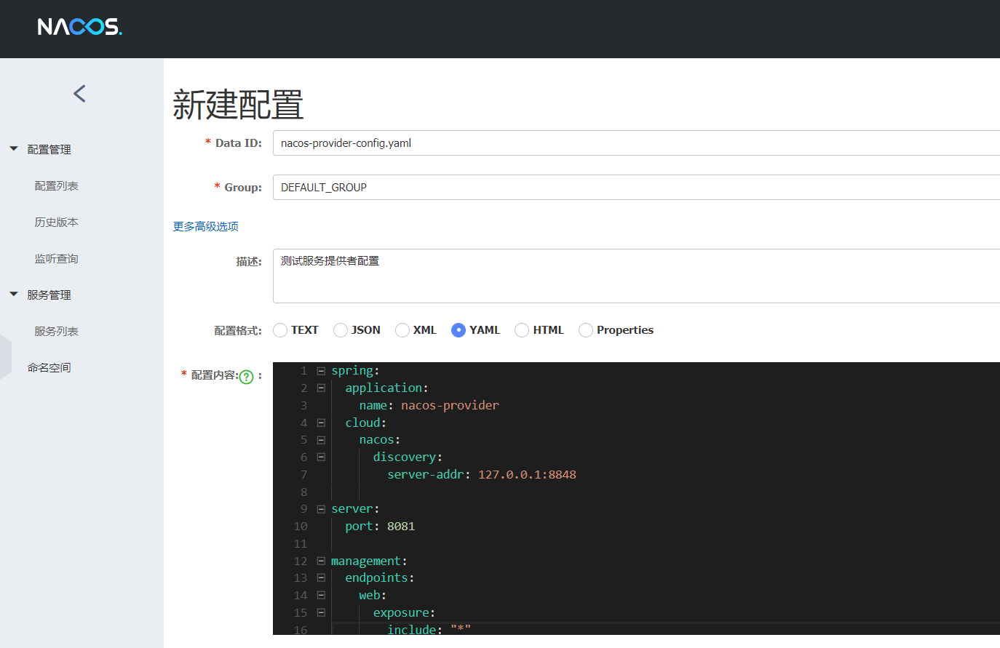

# Nacos 使用


## 服务注册与发现

在 Spring Cloud Netflix 阶段我们采用 Eureka 做作为我们的服务注册与发现服务器，现利用 Spring Cloud Alibaba 提供的 Nacos 组件替代该方案

https://nacos.io/zh-cn/

Nacos 致力于帮助您发现、配置和管理微服务。Nacos 提供了一组简单易用的特性集，帮助您快速实现动态服务发现、服务配置、服务元数据及流量管理。

Nacos 帮助您更敏捷和容易地构建、交付和管理微服务平台。 Nacos 是构建以“服务”为中心的现代应用架构 (例如微服务范式、云原生范式) 的服务基础设施


### 基本架构


#### 服务 Service

服务是指一个或一组软件功能（例如特定信息的检索或一组操作的执行），其目的是不同的客户端可以为不同的目的重用（例如通过跨进程的网络调用）。Nacos 支持主流的服务生态，如 Kubernetes Service、gRPC|Dubbo RPC Service 或者 Spring Cloud RESTful Service


#### 服务注册中心 Service Registry

服务注册中心，它是服务，其实例及元数据的数据库。服务实例在启动时注册到服务注册表，并在关闭时注销。服务和路由器的客户端查询服务注册表以查找服务的可用实例。服务注册中心可能会调用服务实例的健康检查 API 来验证它是否能够处理请求


#### 服务元数据 Service Metadata

服务元数据是指包括服务端点(endpoints)、服务标签、服务版本号、服务实例权重、路由规则、安全策略等描述服务的数据


#### 服务提供方 Service Provider

是指提供可复用和可调用服务的应用方


#### 服务消费方 Service Consumer

是指会发起对某个服务调用的应用方


#### 配置 Configuration

在系统开发过程中通常会将一些需要变更的参数、变量等从代码中分离出来独立管理，以独立的配置文件的形式存在。目的是让静态的系统工件或者交付物（如 WAR，JAR 包等）更好地和实际的物理运行环境进行适配。配置管理一般包含在系统部署的过程中，由系统管理员或者运维人员完成这个步骤。配置变更是调整系统运行时的行为的有效手段之一


#### 配置管理 Configuration Management

在数据中心中，系统中所有配置的编辑、存储、分发、变更管理、历史版本管理、变更审计等所有与配置相关的活动统称为配置管理


#### 配置服务 Configuration Service

在服务或者应用运行过程中，提供动态配置或者元数据以及配置管理的服务提供者。


#### 名字服务 Naming Service

提供分布式系统中所有对象(Object)、实体(Entity)的“名字”到关联的元数据之间的映射管理服务，例如 ServiceName -> Endpoints Info, Distributed Lock Name -> Lock Owner/Status Info, DNS Domain Name -> IP List, 服务发现和 DNS 就是名字服务的2大场景


### 安装

Nacos 依赖 Java 环境来运行。如果您是从代码开始构建并运行 Nacos，还需要为此配置 Maven 环境，请确保是在以下版本环境中安装使用:

- 64 bit OS，支持 Linux/Unix/Mac/Windows，推荐选用 Linux/Unix/Mac。
- 64 bit JDK 1.8+
- Maven 3.2.x+

```shell
# 下载源码
git clone https://github.com/alibaba/nacos.git

# 安装到本地仓库
cd nacos/
mvn -Prelease-nacos clean install -U
# U 是指使用最新jar包
# P 是指maven的profile release-nacos表示profile的那个版本，可以在代码中找到release-nacos.xml的配置
```


### 启动

```shell
cd distribution/target/nacos-server-0.7.0/nacos/bin

# Linux
./startup.sh -m standalone

# Windows
startup.cmd
```


### 访问

http://localhost:8848/nacos

账号和密码都是nacos


## 创建服务提供者

service-provider

### pom

```xml
<?xml version="1.0" encoding="UTF-8"?>
<project xmlns="http://maven.apache.org/POM/4.0.0" xmlns:xsi="http://www.w3.org/2001/XMLSchema-instance"
         xsi:schemaLocation="http://maven.apache.org/POM/4.0.0 http://maven.apache.org/xsd/maven-4.0.0.xsd">
    <modelVersion>4.0.0</modelVersion>

    <parent>
        <groupId>com.funtl</groupId>
        <artifactId>hello-spring-cloud-alibaba-dependencies</artifactId>
        <version>1.0.0-SNAPSHOT</version>
        <relativePath>../hello-spring-cloud-alibaba-dependencies/pom.xml</relativePath>
    </parent>

    <artifactId>hello-spring-cloud-alibaba-nacos-provider</artifactId>
    <packaging>jar</packaging>

    <name>hello-spring-cloud-alibaba-nacos-provider</name>
    <url>http://www.funtl.com</url>
    <inceptionYear>2018-Now</inceptionYear>

    <dependencies>
        <!-- Spring Boot Begin -->
        <dependency>
            <groupId>org.springframework.boot</groupId>
            <artifactId>spring-boot-starter-web</artifactId>
        </dependency>
        <dependency>
            <groupId>org.springframework.boot</groupId>
            <artifactId>spring-boot-starter-actuator</artifactId>
        </dependency>
        <dependency>
            <groupId>org.springframework.boot</groupId>
            <artifactId>spring-boot-starter-test</artifactId>
            <scope>test</scope>
        </dependency>
        <!-- Spring Boot End -->

        <!-- Spring Cloud Begin -->
        <dependency>
            <groupId>org.springframework.cloud</groupId>
            <artifactId>spring-cloud-starter-alibaba-nacos-discovery</artifactId>
        </dependency>
        <!-- Spring Cloud End -->
    </dependencies>

    <build>
        <plugins>
            <plugin>
                <groupId>org.springframework.boot</groupId>
                <artifactId>spring-boot-maven-plugin</artifactId>
                <configuration>
                    <mainClass>com.stt.NacosProviderApplication</mainClass>
                </configuration>
            </plugin>
        </plugins>
    </build>
</project>
```


### application

通过 `@EnableDiscoveryClient` 注解表明是一个 Nacos 客户端，该注解是 Spring Cloud 提供的原生注解

```java
package com.funtl.hello.spring.cloud.alibaba.nacos.provider;

import org.springframework.boot.SpringApplication;
import org.springframework.boot.autoconfigure.SpringBootApplication;
import org.springframework.cloud.client.discovery.EnableDiscoveryClient;
import org.springframework.web.bind.annotation.GetMapping;
import org.springframework.web.bind.annotation.PathVariable;
import org.springframework.web.bind.annotation.RestController;

@SpringBootApplication
@EnableDiscoveryClient
public class NacosProviderApplication {
    public static void main(String[] args) {
        SpringApplication.run(NacosProviderApplication.class, args);
    }

    @RestController
    public class EchoController {
        @GetMapping(value = "/echo/{message}")
        public String echo(@PathVariable String message) {
            return "Hello Nacos Discovery " + message;
        }
    }
}
```


### yml

```yaml
spring:
  application:
    name: nacos-provider
  cloud:
    nacos:
      discovery:
        server-addr: 127.0.0.1:8848

server:
  port: 8082

# 端点检查 单点故障会发送ping包，用于健康检查的配置
management:
  endpoints:
    web:
      exposure:
        include: "*"
```


#### 其他配置

| 配置项          | Key                                            | 默认值                     | 说明                                                         |
| --------------- | ---------------------------------------------- | -------------------------- | ------------------------------------------------------------ |
| 服务端地址      | spring.cloud.nacos.discovery.server-addr       | 无                         | Nacos Server 启动监听的ip地址和端口                          |
| 服务名          | spring.cloud.nacos.discovery.service           | ${spring.application.name} | 给当前的服务命名                                             |
| 权重            | spring.cloud.nacos.discovery.weight            | 1                          | 取值范围 1 到 100，数值越大，权重越大                        |
| 网卡名          | spring.cloud.nacos.discovery.network-interface | 无                         | 当IP未配置时，注册的IP为此网卡所对应的IP地址，如果此项也未配置，则默认取第一块网卡的地址 |
| 注册的IP地址    | spring.cloud.nacos.discovery.ip                | 无                         | 优先级最高                                                   |
| 注册的端口      | spring.cloud.nacos.discovery.port              | -1                         | 默认情况下不用配置，会自动探测                               |
| 命名空间        | spring.cloud.nacos.discovery.namespace         | 无                         | 常用场景之一是不同环境的注册的区分隔离，例如开发测试环境和生产环境的资源（如配置、服务）隔离等。 |
| AccessKey       | spring.cloud.nacos.discovery.access-key        | 无                         | 当要上阿里云时，阿里云上面的一个云账号名                     |
| SecretKey       | spring.cloud.nacos.discovery.secret-key        | 无                         | 当要上阿里云时，阿里云上面的一个云账号密码                   |
| Metadata        | spring.cloud.nacos.discovery.metadata          | 无                         | 使用 Map 格式配置，用户可以根据自己的需要自定义一些和服务相关的元数据信息 |
| 日志文件名      | spring.cloud.nacos.discovery.log-name          | 无                         |                                                              |
| 接入点          | spring.cloud.nacos.discovery.enpoint           | UTF-8                      | 地域的某个服务的入口域名，通过此域名可以动态地拿到服务端地址 |
| 是否集成 Ribbon | ribbon.nacos.enabled                           | true                       | 一般都设置成 true 即可                                       |


### controller

```java
package com.stt.service.provider.controller;
import org.springframework.web.bind.annotation.GetMapping;
import org.springframework.web.bind.annotation.PathVariable;
import org.springframework.web.bind.annotation.RestController;

@RestController
public class ServiceProviderController {
	
	@GetMapping("/echo/{message}")
	public String echo(@PathVariable(value = "message") String msg){
		return "hello: "+msg;
	}
}
```


### 健康检查

spring-cloud-starter-alibaba-nacos-discovery 在实现的时候提供了一个 EndPoint, EndPoint 的访问地址为 `http://ip:port/actuator/nacos-discovery`。 EndPoint 的信息主要提供了两类

- subscribe: 显示了当前有哪些服务订阅者
- NacosDiscoveryProperties: 显示了当前服务实例关于 Nacos 的基础配置

```json
{
    "subscribe":[
    ],
    "NacosDiscoveryProperties":{
        "serverAddr":"127.0.0.1:8848",
        "endpoint":"",
        "namespace":"",
        "logName":"",
        "service":"service-provider",
        "weight":1,
        "clusterName":"DEFAULT",
        "namingLoadCacheAtStart":"false",
        "metadata":{
        },
        "registerEnabled":true,
        "ip":"192.168.0.105",
        "networkInterface":"",
        "port":8082,
        "secure":false,
        "accessKey":"",
        "secretKey":""
    }
}
```


### 启动

通过浏览器访问 `http://localhost:8848/nacos`，即 Nacos Server 网址


你会发现一个服务已经注册在服务中了，服务名为 `nacos-provider`

这时打开 `http://localhost:8081/echo/hi` ，你会在浏览器上看到：

```html
Hello Nacos Discovery hi
```


## 创建服务消费者

服务消费者的创建与服务提供者大同小异，这里采用最原始的一种方式，即显示的使用 LoadBalanceClient 和 RestTemplate 结合的方式来访问

创建一个工程名为 `hello-spring-cloud-alibaba-nacos-consumer` 的服务消费者项目，`pom.xml` 配置如下：

### pom

```xml
<?xml version="1.0" encoding="UTF-8"?>
<project xmlns="http://maven.apache.org/POM/4.0.0" xmlns:xsi="http://www.w3.org/2001/XMLSchema-instance"
         xsi:schemaLocation="http://maven.apache.org/POM/4.0.0 http://maven.apache.org/xsd/maven-4.0.0.xsd">
    <modelVersion>4.0.0</modelVersion>

    <parent>
        <groupId>com.funtl</groupId>
        <artifactId>hello-spring-cloud-alibaba-dependencies</artifactId>
        <version>1.0.0-SNAPSHOT</version>
        <relativePath>../hello-spring-cloud-alibaba-dependencies/pom.xml</relativePath>
    </parent>

    <artifactId>hello-spring-cloud-alibaba-nacos-consumer</artifactId>
    <packaging>jar</packaging>

    <name>hello-spring-cloud-alibaba-nacos-consumer</name>
    <url>http://www.funtl.com</url>
    <inceptionYear>2018-Now</inceptionYear>

    <dependencies>
        <!-- Spring Boot Begin -->
        <dependency>
            <groupId>org.springframework.boot</groupId>
            <artifactId>spring-boot-starter-web</artifactId>
        </dependency>
        <dependency>
            <groupId>org.springframework.boot</groupId>
            <artifactId>spring-boot-starter-actuator</artifactId>
        </dependency>
        <dependency>
            <groupId>org.springframework.boot</groupId>
            <artifactId>spring-boot-starter-test</artifactId>
            <scope>test</scope>
        </dependency>
        <!-- Spring Boot End -->

        <!-- Spring Cloud Begin -->
        <dependency>
            <groupId>org.springframework.cloud</groupId>
            <artifactId>spring-cloud-starter-alibaba-nacos-discovery</artifactId>
        </dependency>
        <!-- Spring Cloud End -->
    </dependencies>

    <build>
        <plugins>
            <plugin>
                <groupId>org.springframework.boot</groupId>
                <artifactId>spring-boot-maven-plugin</artifactId>
                <configuration>
                    <mainClass>com.funtl.hello.spring.cloud.alibaba.nacos.consumer.NacosConsumerApplication</mainClass>
                </configuration>
            </plugin>
        </plugins>
    </build>
</project>
```


### application

```java
package com.funtl.hello.spring.cloud.alibaba.nacos.consumer;

import org.springframework.boot.SpringApplication;
import org.springframework.boot.autoconfigure.SpringBootApplication;
import org.springframework.cloud.client.discovery.EnableDiscoveryClient;

@SpringBootApplication
@EnableDiscoveryClient
public class NacosConsumerApplication {
    public static void main(String[] args) {
        SpringApplication.run(NacosConsumerApplication.class, args);
    }
}
```


### config

创建一个名为 `NacosConsumerConfiguration` 的 Java 配置类，主要作用是为了注入 `RestTemplate`

```java
package com.funtl.hello.spring.cloud.alibaba.nacos.consumer.config;

import org.springframework.context.annotation.Bean;
import org.springframework.context.annotation.Configuration;
import org.springframework.web.client.RestTemplate;

@Configuration
public class NacosConsumerConfiguration {

    @Bean
    public RestTemplate restTemplate() {
        return new RestTemplate();
    }
}
```


### controller

```java
package com.funtl.hello.spring.cloud.alibaba.nacos.consumer.controller;

import org.springframework.beans.factory.annotation.Autowired;
import org.springframework.beans.factory.annotation.Value;
import org.springframework.cloud.client.ServiceInstance;
import org.springframework.cloud.client.loadbalancer.LoadBalancerClient;
import org.springframework.web.bind.annotation.GetMapping;
import org.springframework.web.bind.annotation.RestController;
import org.springframework.web.client.RestTemplate;

@RestController
public class NacosConsumerController {

    @Autowired
    private LoadBalancerClient loadBalancerClient;

    @Autowired
    private RestTemplate restTemplate;

    @Value("${spring.application.name}")
    private String appName;

    @GetMapping(value = "/echo/app/name")
    public String echo() {
        //使用 LoadBalanceClient 和 RestTemplate 结合的方式来访问
        ServiceInstance serviceInstance = loadBalancerClient.choose("nacos-provider");
        String url = String.format("http://%s:%s/echo/%s", serviceInstance.getHost(), serviceInstance.getPort(), appName);
        return restTemplate.getForObject(url, String.class);
    }
}
```


### yml

```yaml
spring:
  application:
    name: nacos-consumer
  cloud:
    nacos:
      discovery:
        server-addr: 127.0.0.1:8848

server:
  port: 9091

management:
  endpoints:
    web:
      exposure:
        include: "*"
```


### 启动

通过浏览器访问 `http://localhost:8848/nacos`，即 Nacos Server 网址


你会发现多了一个名为 `nacos-consumer` 的服务

这时打开 `http://localhost:9091/echo/app/name` ，你会在浏览器上看到：

```html
Hello Nacos Discovery nacos-consumer
```

- 端点检查

通过浏览器访问 `http://localhost:9091/actuator/nacos-discovery` 你会在浏览器上看到：

```json
{
    "subscribe":[
        {
            "jsonFromServer":"{"metadata":{},"dom":"service-provider","cacheMillis":10000,"useSpecifiedURL":false,"hosts":[{"valid":true,"marked":false,"metadata":{},"instanceId":"192.168.0.105#8082#DEFAULT#DEFAULT_GROUP@@service-provider","port":8082,"healthy":true,"ip":"192.168.0.105","clusterName":"DEFAULT","weight":100.0,"ephemeral":true,"serviceName":"service-provider","enabled":true}],"name":"DEFAULT_GROUP@@service-provider","checksum":"6d6c31065cf4dd6e2da001010a9d15d3","lastRefTime":1565062872963,"env":"","clusters":""}",
            "name":"service-provider",
            "clusters":"",
            "cacheMillis":10000,
            "hosts":[
                {
                    "instanceId":"192.168.0.105#8082#DEFAULT#DEFAULT_GROUP@@service-provider",
                    "ip":"192.168.0.105",
                    "port":8082,
                    "weight":100,
                    "healthy":true,
                    "enabled":true,
                    "clusterName":"DEFAULT",
                    "serviceName":"service-provider",
                    "metadata":{

                    }
                }
            ],
            "lastRefTime":1565062872963,
            "checksum":"6d6c31065cf4dd6e2da001010a9d15d3",
            "allIPs":false,
            "key":"service-provider",
            "valid":true,
            "keyEncoded":"service-provider"
        }
    ],
    "NacosDiscoveryProperties":{
        "serverAddr":"127.0.0.1:8848",
        "endpoint":"",
        "namespace":"",
        "logName":"",
        "service":"service-consumer",
        "weight":1,
        "clusterName":"DEFAULT",
        "namingLoadCacheAtStart":"false",
        "metadata":{

        },
        "registerEnabled":true,
        "ip":"192.168.0.105",
        "networkInterface":"",
        "port":9091,
        "secure":false,
        "accessKey":"",
        "secretKey":""
    }
}
```


## 创建服务消费者 Feign

Feign 是一个声明式的伪 Http 客户端，它使得写 Http 客户端变得更简单。使用 Feign，只需要创建一个接口并注解。它具有可插拔的注解特性，可使用 Feign 注解和 JAX-RS 注解。Feign 支持可插拔的编码器和解码器。Feign 默认集成了 Ribbon，Nacos 也很好的兼容了 Feign，默认实现了负载均衡的效果

- Feign 采用的是基于接口的注解
- Feign 整合了 ribbon

### pom

创建一个工程名为 `hello-spring-cloud-alibaba-nacos-consumer-feign` 的服务消费者项目，`pom.xml` 配置如下：

```xml
<?xml version="1.0" encoding="UTF-8"?>
<project xmlns="http://maven.apache.org/POM/4.0.0" xmlns:xsi="http://www.w3.org/2001/XMLSchema-instance"
         xsi:schemaLocation="http://maven.apache.org/POM/4.0.0 http://maven.apache.org/xsd/maven-4.0.0.xsd">
    <modelVersion>4.0.0</modelVersion>
    <parent>
        <groupId>com.funtl</groupId>
        <artifactId>hello-spring-cloud-alibaba-dependencies</artifactId>
        <version>1.0.0-SNAPSHOT</version>
        <relativePath>../hello-spring-cloud-alibaba-dependencies/pom.xml</relativePath>
    </parent>

    <artifactId>hello-spring-cloud-alibaba-nacos-consumer-feign</artifactId>
    <packaging>jar</packaging>

    <name>hello-spring-cloud-alibaba-nacos-consumer-feign</name>
    <url>http://www.funtl.com</url>
    <inceptionYear>2018-Now</inceptionYear>

    <dependencies>
        <!-- Spring Boot Begin -->
        <dependency>
            <groupId>org.springframework.boot</groupId>
            <artifactId>spring-boot-starter-web</artifactId>
        </dependency>
        <dependency>
            <groupId>org.springframework.boot</groupId>
            <artifactId>spring-boot-starter-actuator</artifactId>
        </dependency>
        <dependency>
            <groupId>org.springframework.boot</groupId>
            <artifactId>spring-boot-starter-test</artifactId>
            <scope>test</scope>
        </dependency>
        <!-- Spring Boot End -->

        <!-- Spring Cloud Begin -->
        <dependency>
            <groupId>org.springframework.cloud</groupId>
            <artifactId>spring-cloud-starter-alibaba-nacos-discovery</artifactId>
        </dependency>
        <dependency>
            <groupId>org.springframework.cloud</groupId>
            <artifactId>spring-cloud-starter-openfeign</artifactId>
        </dependency>
        <!-- Spring Cloud End -->
    </dependencies>
    <build>
        <plugins>
            <plugin>
                <groupId>org.springframework.boot</groupId>
                <artifactId>spring-boot-maven-plugin</artifactId>
                <configuration>
                    <mainClass>com.stt.NacosConsumerFeignApplication</mainClass>
                </configuration>
            </plugin>
        </plugins>
    </build>
</project>
```

主要增加了 `org.springframework.cloud:spring-cloud-starter-openfeign` 依赖


### application

通过 `@EnableFeignClients` 注解开启 Feign 功能

```java
package com.funtl.hello.spring.cloud.alibaba.nacos.consumer.feign;

import org.springframework.boot.SpringApplication;
import org.springframework.boot.autoconfigure.SpringBootApplication;
import org.springframework.cloud.client.discovery.EnableDiscoveryClient;
import org.springframework.cloud.openfeign.EnableFeignClients;

@SpringBootApplication
@EnableDiscoveryClient
@EnableFeignClients
public class NacosConsumerFeignApplication {
    public static void main(String[] args) {
        SpringApplication.run(NacosConsumerFeignApplication.class, args);
    }
}
```


### 创建feign接口

通过 `@FeignClient("服务名")` 注解来指定调用哪个服务。代码如下

```java
package com.funtl.hello.spring.cloud.alibaba.nacos.consumer.feign.service;

import org.springframework.cloud.openfeign.FeignClient;
import org.springframework.web.bind.annotation.GetMapping;
import org.springframework.web.bind.annotation.PathVariable;

@FeignClient(value = "nacos-provider")
public interface EchoService {

    @GetMapping(value = "/echo/{message}")
    String echo(@PathVariable("message") String message);
}
```


### controller

```java
package com.funtl.hello.spring.cloud.alibaba.nacos.consumer.feign.controller;

import com.funtl.hello.spring.cloud.alibaba.nacos.consumer.feign.service.EchoService;
import org.springframework.beans.factory.annotation.Autowired;
import org.springframework.web.bind.annotation.GetMapping;
import org.springframework.web.bind.annotation.RestController;

@RestController
public class NacosConsumerFeignController {

    @Autowired
    private EchoService echoService;

    @GetMapping(value = "/echo/hi")
    public String echo() {
        return echoService.echo("Hi Feign");
    }
}
```


### yml

```yaml
spring:
  application:
    name: nacos-consumer-feign
  cloud:
    nacos:
      discovery:
        server-addr: 127.0.0.1:8848

server:
  port: 9092

management:
  endpoints:
    web:
      exposure:
        include: "*"
```


### 启动项目

通过浏览器访问 `http://localhost:8848/nacos`，即 Nacos Server 网址


你会发现多了一个名为 `nacos-consumer-feign` 的服务

这时打开 `http://localhost:9092/echo/hi` ，你会在浏览器上看到：

```html
Hello Nacos Discovery Hi Feign
```


### 测试负载均衡

- 启动多个 `consumer-provider` 实例，效果图如下：


- 修改 `consumer-provider` 项目中的 `Controller` 代码，用于确定负载均衡生效

```java
package com.funtl.hello.spring.cloud.alibaba.nacos.provider;

import org.springframework.beans.factory.annotation.Value;
import org.springframework.boot.SpringApplication;
import org.springframework.boot.autoconfigure.SpringBootApplication;
import org.springframework.cloud.client.discovery.EnableDiscoveryClient;
import org.springframework.web.bind.annotation.GetMapping;
import org.springframework.web.bind.annotation.PathVariable;
import org.springframework.web.bind.annotation.RestController;

@SpringBootApplication
@EnableDiscoveryClient
public class NacosProviderApplication {
    public static void main(String[] args) {
        SpringApplication.run(NacosProviderApplication.class, args);
    }

    @Value("${server.port}")
    private String port;

    @RestController
    public class EchoController {
        @GetMapping(value = "/echo/{message}")
        public String echo(@PathVariable String message) {
            return "Hello Nacos Discovery " + message + " i am from port " + port;
        }
    }
}
```


- 在浏览器上多次访问 `http://localhost:9092/echo/hi` ，浏览器交替显示：

```html
Hello Nacos Discovery Hi Feign i am from port 8081
Hello Nacos Discovery Hi Feign i am from port 8082
```


## 分布式配置中心

在分布式系统中，由于服务数量巨多，为了方便服务配置文件统一管理，实时更新，所以需要分布式配置中心组件


### Nacos Config

Nacos 提供用于存储配置和其他元数据的 key/value 存储，为分布式系统中的外部化配置提供服务器端和客户端支持。使用 Spring Cloud Alibaba Nacos Config，您可以在 Nacos Server 集中管理你 Spring Cloud 应用的外部属性配置。

Spring Cloud Alibaba Nacos Config 是 Spring Cloud Config Server 和 Client 的替代方案，客户端和服务器上的概念与 Spring Environment 和 PropertySource 有着一致的抽象，在特殊的 bootstrap 阶段，配置被加载到 Spring 环境中。当应用程序通过部署管道从开发到测试再到生产时，您可以管理这些环境之间的配置，并确保应用程序具有迁移时需要运行的所有内容


### 创建配置文件

需要在 Nacos Server 中创建配置文件，我们依然采用 YAML 的方式部署配置文件，操作流程如下：

- 浏览器打开 http://localhost:8848/nacos ，访问 Nacos Server


- 新建配置文件，此处我们以之前创建的 **服务提供者**项目为例




**注意：Data ID 的默认扩展名为 .properties ，希望使用 YAML 配置，此处必须指明是 .yaml**

- 发布成功后在 “配置列表” 一栏即可看到刚才创建的配置项


### 服务端配置

#### pom

此处我们以之前创建的 **服务提供者**项目为例

在 `pom.xml` 中增加 `org.springframework.cloud:spring-cloud-starter-alibaba-nacos-config` 依赖

```xml
<dependency>
    <groupId>org.springframework.cloud</groupId>
    <artifactId>spring-cloud-starter-alibaba-nacos-config</artifactId>
</dependency>
```

完整的 `pom.xml` 如下：

```xml
<?xml version="1.0" encoding="UTF-8"?>
<project xmlns="http://maven.apache.org/POM/4.0.0" xmlns:xsi="http://www.w3.org/2001/XMLSchema-instance"
         xsi:schemaLocation="http://maven.apache.org/POM/4.0.0 http://maven.apache.org/xsd/maven-4.0.0.xsd">
    <modelVersion>4.0.0</modelVersion>

    <parent>
        <groupId>com.funtl</groupId>
        <artifactId>hello-spring-cloud-alibaba-dependencies</artifactId>
        <version>1.0.0-SNAPSHOT</version>
        <relativePath>../hello-spring-cloud-alibaba-dependencies/pom.xml</relativePath>
    </parent>

    <artifactId>hello-spring-cloud-alibaba-nacos-provider</artifactId>
    <packaging>jar</packaging>

    <name>hello-spring-cloud-alibaba-nacos-provider</name>
    <url>http://www.funtl.com</url>
    <inceptionYear>2018-Now</inceptionYear>

    <dependencies>
        <!-- Spring Boot Begin -->
        <dependency>
            <groupId>org.springframework.boot</groupId>
            <artifactId>spring-boot-starter-web</artifactId>
        </dependency>
        <dependency>
            <groupId>org.springframework.boot</groupId>
            <artifactId>spring-boot-starter-actuator</artifactId>
        </dependency>
        <dependency>
            <groupId>org.springframework.boot</groupId>
            <artifactId>spring-boot-starter-test</artifactId>
            <scope>test</scope>
        </dependency>
        <!-- Spring Boot End -->

        <!-- Spring Cloud Begin -->
        <dependency>
            <groupId>org.springframework.cloud</groupId>
            <artifactId>spring-cloud-starter-alibaba-nacos-discovery</artifactId>
        </dependency>
        <dependency>
            <groupId>org.springframework.cloud</groupId>
            <artifactId>spring-cloud-starter-alibaba-nacos-config</artifactId>
        </dependency>
        <!-- Spring Cloud End -->
    </dependencies>

    <build>
        <plugins>
            <plugin>
                <groupId>org.springframework.boot</groupId>
                <artifactId>spring-boot-maven-plugin</artifactId>
                <configuration>
                    <mainClass>com.stt.provider.NacosProviderApplication</mainClass>
                </configuration>
            </plugin>
        </plugins>
    </build>
</project>
```


#### bootstrap.properties

创建名为 `bootstrap.properties` 的配置文件并删除之前创建的 `application.yml` 配置文件，由于已经在服务端配置，此处不再赘述

```properties
# 这里的应用名对应 Nacos Config 中的 Data ID，实际应用名称以配置中心的配置为准
spring.application.name=nacos-provider-config
# 指定查找名为 nacos-provider-config.yaml 的配置文件
spring.cloud.nacos.config.file-extension=yaml
# Nacos Server 的地址
spring.cloud.nacos.config.server-addr=127.0.0.1:8848
```

**注意：**在之前的 Spring Cloud Netflix 课程中有提到过 Spring Boot 配置文件的加载顺序，依次为 bootstrap.properties -> bootstrap.yml -> application.properties -> application.yml ，其中 bootstrap.properties 配置为最高优先级

nacos config 会根据name+file-extension 生成一个dataId去匹配配置文件


#### 启动

启动应用后我们可以通过日志看到，已经成功加载到了配置文件


#### 配置动态更新

Nacos Config 也支持配置的动态更新，操作流程如下：

- 修改服务端配置，增加一个 `user.name` 的属性


- 修改 Controller ，增加一个请求方法，测试配置更新效果

```java
// 注入配置文件上下文
@Autowired
private ConfigurableApplicationContext applicationContext;

// 从上下文中读取配置
@GetMapping(value = "/hi")
public String sayHi() {
    return "Hello " + applicationContext.getEnvironment().getProperty("user.name");
}
```

- 通过浏览器访问该接口，浏览器显示

```html
Hello Lusifer
```

- 修改服务端配置


此时观察控制台日志，你会发现我们已经成功刷新了配置


- 刷新浏览器，浏览器显示

```html
Hello LusiferLee
```

**注意：你可以使用 spring.cloud.nacos.config.refresh.enabled=false 来关闭动态刷新**


### 多环境配置


#### spring boot profile

我们在做项目开发的时候，生产环境和测试环境的一些配置可能会不一样，有时候一些功能也可能会不一样，所以我们可能会在上线的时候手工修改这些配置信息。但是 Spring 中为我们提供了 Profile 这个功能。我们只需要在启动的时候添加一个虚拟机参数，激活自己环境所要用的 Profile 就可以了。

操作起来很简单，只需要为不同的环境编写专门的配置文件，如：`application-dev.yml`、`application-prod.yml`， 启动项目时只需要增加一个命令参数 `--spring.profiles.active=环境配置` 即可，启动命令如下：

```bash
java -jar hello-spring-cloud-alibaba-nacos-provider-1.0.0-SNAPSHOT.jar --spring.profiles.active=prod
```


#### nacos config profile

>  类似于spring boot profile 需要在项目中增加如prod的配置文件，在nacos也配置相应的配置文件，在启动时进行配置选择

spring-cloud-starter-alibaba-nacos-config 在加载配置的时候，不仅仅加载了以 dataid 为 `${spring.application.name}.${file-extension:properties}` 为前缀的基础配置，还加载了 dataid 为 `${spring.application.name}-${profile}.${file-extension:properties}` 的基础配置。在日常开发中如果遇到多套环境下的不同配置，可以通过 Spring 提供的 `${spring.profiles.active}` 这个配置项来配置。

此处我们以之前创建的 **服务提供者**项目为例


##### 在 nacos增加配置

增加一个名为 `nacos-provider-config-prod.yaml` 的配置


**注意：此时，我将配置文件中的端口由 8081 -> 8082**


##### 在项目中增加配置

增加一个名为 `bootstrap-prod.properties` 的配置文件，内容如下：

```properties
spring.profiles.active=prod # 需要在此处增加环境
spring.application.name=nacos-provider-config
spring.cloud.nacos.config.file-extension=yaml
spring.cloud.nacos.config.server-addr=127.0.0.1:8848
```

主要增加了 `spring.profiles.active=prod` 配置，用于指定访问 Nacos Server 中的 `nacos-provider-config-prod.yaml` 配置


