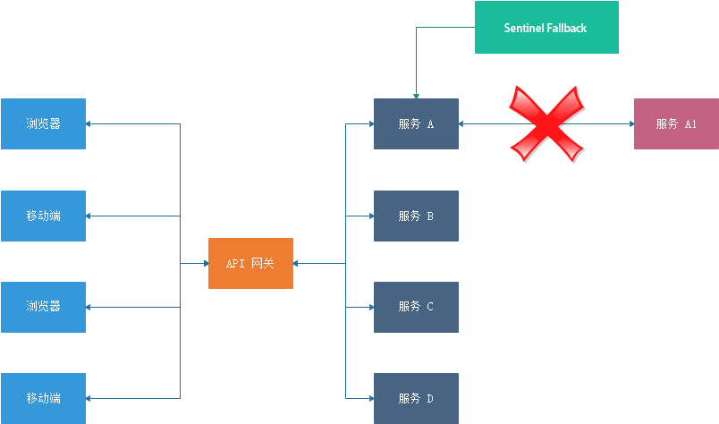
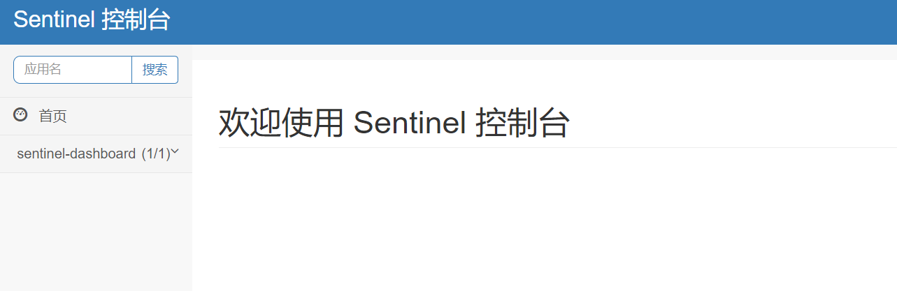
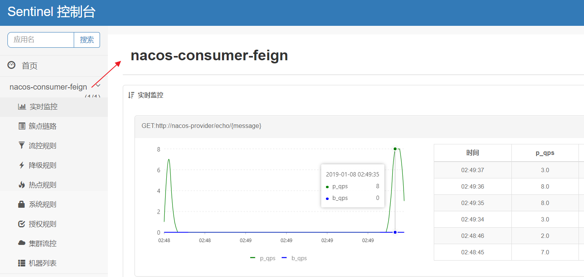

# Sentinel 使用


## 服务熔断 Sentinel

### 概述

在微服务架构中，根据业务来拆分成一个个的服务，服务与服务之间可以通过 `RPC` 相互调用，在 Spring Cloud 中可以用 `RestTemplate + LoadBalanceClient` 和 `Feign` 来调用。为了保证其高可用，单个服务通常会集群部署。由于网络原因或者自身的原因，服务并不能保证 100% 可用，如果单个服务出现问题，调用这个服务就会出现线程阻塞，此时若有大量的请求涌入，`Servlet` 容器的线程资源会被消耗完毕，导致服务瘫痪。服务与服务之间的依赖性，故障会传播，会对整个微服务系统造成灾难性的严重后果，这就是服务故障的 **“雪崩”** 效应。

为了解决这个问题，业界提出了熔断器模型。

阿里巴巴开源了 Sentinel 组件，实现了熔断器模式，Spring Cloud 对这一组件进行了整合。在微服务架构中，一个请求需要调用多个服务是非常常见的，如下图


较底层的服务如果出现故障，会导致连锁故障。当对特定的服务的调用的不可用达到一个阀值熔断器将会被打开。



熔断器打开后，为了避免连锁故障，通过 `fallback` 方法可以直接返回一个固定值


### 关于 Sentinel

随着微服务的流行，服务和服务之间的稳定性变得越来越重要

- Sentinel 以流量为切入点
- 从==流量控制==、熔断降级、系统负载保护等多个维度保护服务的稳定性
- 比Hystrix功能强大


### 特点

- **丰富的应用场景：** Sentinel 承接了阿里巴巴近 10 年的 **双十一大促流量** 的核心场景，例如秒杀（即突发流量控制在系统容量可以承受的范围）、消息削峰填谷、实时熔断下游不可用应用等。
- **完备的实时监控：** Sentinel 同时提供实时的监控功能。您可以在控制台中看到接入应用的单台机器秒级数据，甚至 500 台以下规模的集群的汇总运行情况。
- **广泛的开源生态：** Sentinel 提供开箱即用的与其它开源框架/库的整合模块，例如与 Spring Cloud、Dubbo、gRPC 的整合。您只需要引入相应的依赖并进行简单的配置即可快速地接入 Sentinel。
- **完善的 SPI 扩展点：** Sentinel 提供简单易用、完善的 SPI 扩展点。您可以通过实现扩展点，快速的定制逻辑。例如定制规则管理、适配数据源等


### 在Feign中使用

如果要在您的项目中引入 Sentinel，使用 group ID 为 `org.springframework.cloud` 和 artifact ID 为 `spring-cloud-starter-alibaba-sentinel` 的 starter。

```xml
<dependency>
    <groupId>org.springframework.cloud</groupId>
    <artifactId>spring-cloud-starter-alibaba-sentinel</artifactId>
</dependency>
```


Sentinel 适配了 Feign 组件。但默认是关闭的。需要在配置文件中配置打开它，在配置文件增加以下代码：

```yaml
feign:
  sentinel:
    enabled: true
```


#### 在 Service 中增加 fallback 指定类

```java
package com.funtl.hello.spring.cloud.alibaba.nacos.consumer.feign.service;

import com.stt.EchoServiceFallback;
import org.springframework.cloud.openfeign.FeignClient;
import org.springframework.web.bind.annotation.GetMapping;
import org.springframework.web.bind.annotation.PathVariable;

@FeignClient(value = "nacos-provider", fallback = EchoServiceFallback.class)
public interface EchoService {

    @GetMapping(value = "/echo/{message}")
    String echo(@PathVariable("message") String message);
}
```


#### 创建熔断器类并实现对应的 Feign 接口

```java
package com.funtl.hello.spring.cloud.alibaba.nacos.consumer.feign.service.fallback;

import com.funtl.hello.spring.cloud.alibaba.nacos.consumer.feign.service.EchoService;
import org.springframework.stereotype.Component;

@Component
public class EchoServiceFallback implements EchoService {
    @Override
    public String echo(String message) {
        return "echo fallback";
    }
}
```


#### 测试熔断器

此时我们关闭服务提供者，再次请求 http://localhost:9092/echo/hi 浏览器会显示：

```html
echo fallback
```


### 熔断器仪表盘

Sentinel 控制台提供一个轻量级的控制台，它提供机器发现、单机资源实时监控、集群资源汇总，以及规则管理的功能。您只需要对应用进行简单的配置，就可以使用这些功能。

**注意:** 集群资源汇总仅支持 500 台以下的应用集群，有大概 1 - 2 秒的延时


#### 下载

```shell
# 下载源码
git clone https://github.com/alibaba/Sentinel.git

# 编译打包
mvn clean package -DskipTests
```


#### 启动

Sentinel 控制台是一个标准的 SpringBoot 应用，以 SpringBoot 的方式运行 jar 包即可

```shell
cd sentinel-dashboard\target
java -Dserver.port=8080 -Dcsp.sentinel.dashboard.server=localhost:8080 -Dproject.name=sentinel-dashboard -jar sentinel-dashboard.jar
```

- 若 8080 端口冲突，可使用 `-Dserver.port=新端口` 进行设置。


#### 访问

打开浏览器访问：http://localhost:8080/#/dashboard/home



用户名和密码都是：sentinel


#### 服务端配置

`application.yml` 配置文件中增加如下配置

```yaml
spring:
  cloud:
    sentinel:
      transport:
        port: 8719 # 用于本服务监控的端口
        dashboard: localhost:8080
```

这里的 `spring.cloud.sentinel.transport.port` 端口配置会在应用对应的机器上启动一个 Http Server，该 Server 会与 Sentinel 控制台做交互。比如 Sentinel 控制台添加了 1 个限流规则，会把规则数据 push 给这个 Http Server 接收，Http Server 再将规则注册到 Sentinel 中


#### 测试

使用之前的 Feign 客户端，`application.yml` 完整配置如下：

```yaml
spring:
  application:
    name: nacos-consumer-feign
  cloud:
    nacos:
      discovery:
        server-addr: 127.0.0.1:8848
    sentinel:
      transport:
        port: 8720
        dashboard: localhost:8080

server:
  port: 9092

feign:
  sentinel:
    enabled: true

management:
  endpoints:
    web:
      exposure:
        include: "*"
```

**注：由于 8719 端口已被 sentinel-dashboard 占用，故这里修改端口号为 8720；不修改也能注册，会自动帮你在端口号上 + 1；**


打开浏览器访问：http://localhost:8080/#/dashboard/home

此时会多一个名为 `nacos-consumer-feign` 的服务




- 