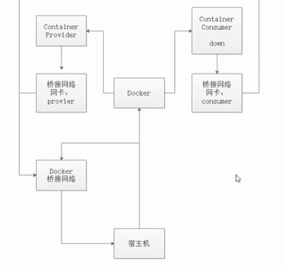

# 持续集成 dubbo

在创建了consumer和provider这2个容器

但是dubbo的调用方和提供方必须在同一个局域网，而每个容器则是一个网段，不在同一个局域网

因此需要在docker-compose.yml中配置相同局域网

```shell
networks:
  default:
    external:
      name: dubbo
```




查看docker网络

```shell
docker network ls
```


如果网络不存在需要创建docker网络，如创建dubbo网络

```shell
docker network create dubbo
```


