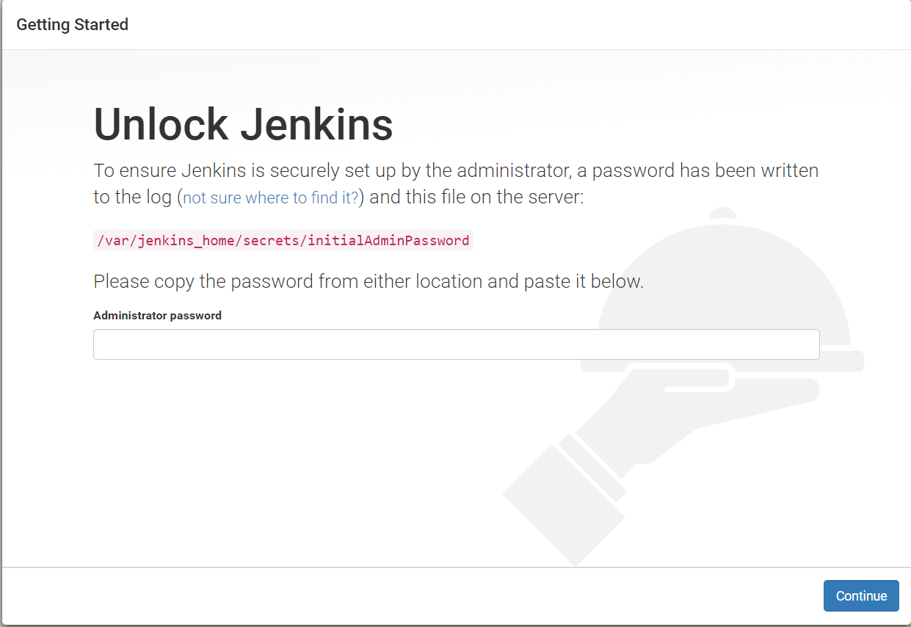
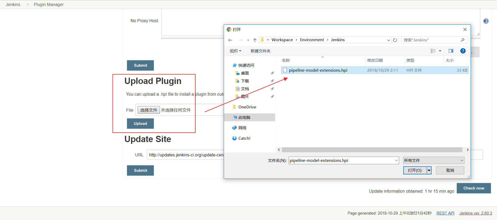
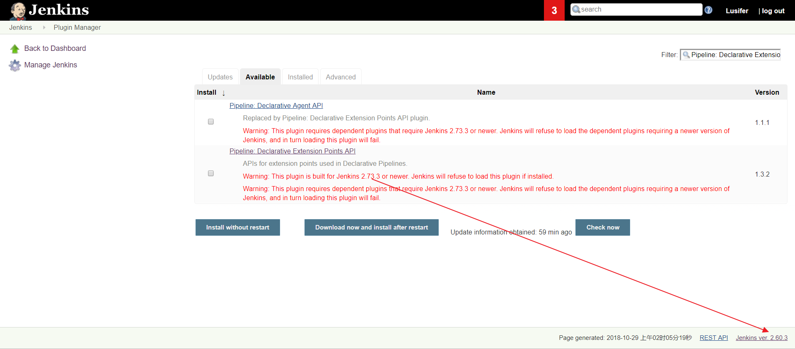
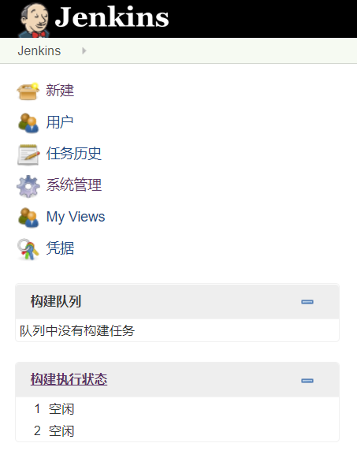

# Jenkins使用

Jenkins 是一个开源软件项目，是基于 Java 开发的一种持续集成工具，用于监控持续重复的工作，旨在提供一个开放易用的软件平台，使软件的持续集成变成可能。

官方网站：https://jenkins.io/


## 安装

Jenkins 是一个简单易用的持续集成软件平台，我们依然采用 Docker 的方式部署，`docker-compose.yml`配置文件如下：

### docker-compose.yml

```yaml
version: '3.1'
services:
  jenkins:
    restart: always
    image: jenkinsci/jenkins
    container_name: jenkins
    ports:
      # 发布端口
      - 8080:8080
      # 基于 JNLP 的 Jenkins 代理通过 TCP 端口 50000 与 Jenkins master 进行通信
      - 50000:50000
    environment:
      TZ: Asia/Shanghai
    volumes:
      - ./data:/var/jenkins_home
```

安装过程中会出现 `Docker 数据卷` 权限问题，用以下命令解决：

- 需要将数据卷的用户权限从root改为当前用户

```shell
chown -R 1000 /usr/local/docker/jenkins/data
```

- gitLab的持续集成和Jenkins的构建


## 解锁

访问http://192.168.119.134:8081

Jenkins 第一次启动时需要输入一个初始密码用以解锁安装流程，使用 `docker logs jenkins` 即可方便的查看到初始密码




**注意：** 安装时可能会因为网速等原因导致安装时间比较长，请大家耐心等待。如果长时间停留在安装页没反应，请尝试使用 `F5` 刷新一下


## 安装插件

插件是 Jenkins 的核心，其丰富的插件（截止到 `2018.10.29` 共有 `77350` 个插件）可以满足不同人群的不同需求

插件地址：https://plugins.jenkins.io/


勾选`Dashboard View` 插件

**注意：** 除了默认勾选的插件外，一定要勾选 `Publish over SSH` 插件，这是我们实现持续交付的重点插件。


**开始安装了，根据网络情况，安装时间可能会比较长，请耐心等待**


**很多插件装不上怎么办？不要慌，记住这些插件的名字，咱们稍后可以手动安装**


### 手动安装插件

#### 使用插件管理器安装

- `Manage Jenkins` -> `Manage Plugins` -> `Avaliable`

- 过滤出想要安装的插件，然后点击 `Download now and install after restart`

#### 手动上传 `.hpi` 文件

- 点击进入插件中心


- 点击 `Archives`


- 下载需要的版本


- 在插件管理器中选择 `Advanced`


- 选择上传即可




#### 重启 Jenkins

```text
docker-compose down
docker-compose up -d
```


注意： 请留意需要下载插件的警告信息，如果不满足安装条件，Jenkins 是会拒绝安装的。如下图：




### 安装maven集成插件

- 系统管理：插件管理：搜索 maven Integration ：安装插件：重启jenkins


## 配置


### 配置 JDK & Maven

- 上传 JDK 和 Maven 的 tar 包到服务器目录（这里是/usr/local/docker/jenkins/data），即容器数据卷目录,然后解压
- `Manage Jenkins` -> `Global Tool Configuration`
  - 系统管理：全局工具配置：新增JDK：去除自动安装：输入java_home配置（在容器内部的路径）
- 安装 JDK（`JAVA_HOME` **的路径是宿主机目录**）

```shell
/var/jenkins_home/jdk1.8.0_152
```


- 安装 Maven（`MAVEN_HOME` **的路径是宿主机目录，切记！不明白的看视频！**）

```text
/var/jenkins_home/apache-maven-3.6.1
```


- 别忘记保存


### 配置本地化（显示中文）

- 安装 `Locale` 插件


- `Manage Jenkins` -> `Configure System` -> `Locale`


- 本地化效果图



## 安装动态参数插件

`Extended Choice Parameter`

- 该插件的主要目的是为了方便我们后面在做项目构建时可以按照版本进行构建（支持一键==回滚==哦）


## 持续交付

Jenkins 的持续交付流程与 GitLab Runner 的持续集成差不多，但 GitLab Runner 已经默认是配置好了 Git，所以 Jenkins 需要额外配置多一个 GitLab 的 SSH 登录。按照之前 GitLab Runner 的持续集成流程，Jenkins 的持续交付流程大致如下：

- 拉取代码
- 打包构建
- 上传镜像
- 运行容器
- 维护清理


### 配置Jenkins与gitLab SSH 免密登录

- 交互式进入 Jenkins 容器

```text
docker exec -it jenkins /bin/bash
```

- 生成 SSH KEY

```text
ssh-keygen -t rsa -C "stt@163.com"
```

- 查看公钥

```text
cat /var/jenkins_home/.ssh/id_rsa.pub

jenkins@d5ec6ef99294:~/.ssh$ cat id_rsa.pub
ssh-rsa AAAAB3NzaC1yc2EAAAADAQABAAABAQCYKyqdHnW6vL0ibPvOFiilxn015nymtlqB+symtYORsIaLPityyFo6BSKdkUcUPQ04T/CRy9PfNbr1/GKh1xG08Ex37ZdplkSaYfR0I5mjqnhOYltSwVWPRgWtKymPj+cjcOykDAjL1GSkopIslo4OoyGTRfJxvxEe7iX5O+psmPzOxt0CkbwYMBZwuuWlYPnsFGIyinHbTr8+fTMU+MIEfbmt6SG71biU6srbMh2TsUFI1WC+47XZm1oe5Jsu0ZVZtOuMN3fFCKcaS3gwNnQET1mVeVlPRoYDp7vMQKROGCGgzbHfBVBEoj2rX7CqRLIXNod5Efq/l991N0T4/zJn stt@163.com
```

- 复制公钥到 GitLab
  - 头像：设置：SSH秘钥


- **手动克隆一次项目**，该步骤的主要作用是为了生成和服务器的验证信息


- 查看刚才生成的文件


### 配置Jenkins的Publish over SSH

- `系统管理` -> `系统设置` -> `Publish over SSH`
  - 填写服务器的用户名root
  - 填写服务器的密码123456
  - 注意==保存==


其中 `Remote Directory` 是指 Jenkins 可以在目标服务器操作的目录

- 测试是否能够正常通信


### 配置持续交付项目

由于我们所有项目的父工程都是依赖于 `myshop-dependencies`，所以我们的第一步是实现该项目的持续交付


#### 创建项目标签

在 GitLab 中为项目创建标签


#### 创建Jenkins的maven项目

在 Jenkins 中创建一个基于 Maven 的任务


##### 配置第一次构建

- 测试整个流程是否能生成jar包，放入maven仓库


##### 构建项目


- 查看构建日志


##### 查看构建结果

- 进入jenkins容器

```shell
docker exec -it jenkins bash
```

- 查看项目是否clone下来

```shell
jenkins@d5ec6ef99294:~$ cd workspace/
jenkins@d5ec6ef99294:~/workspace$ ls -al
total 12
drwxr-xr-x  3 jenkins jenkins 4096 Aug  3 16:08 .
drwxr-xr-x 23 jenkins root    4096 Aug  3 16:24 ..
drwxr-xr-x  4 jenkins jenkins 4096 Aug  3 16:08 myshop-dependencies
jenkins@d5ec6ef99294:~/workspace$ cd myshop-dependencies/
jenkins@d5ec6ef99294:~/workspace/myshop-dependencies$ ls -l
total 24
-rw-r--r-- 1 jenkins jenkins    19 Aug  3 16:08 README.md
drwxr-xr-x 3 jenkins jenkins  4096 Aug  3 16:08 default
-rw-r--r-- 1 jenkins jenkins 12646 Aug  3 16:08 pom.xml
```

- 查看maven中是否有打包的项目

```shell
jenkins@d5ec6ef99294:~/.m2/repository/com/stt/myshop-dependencies$ ls
1.0.0-SNAPSHOT	maven-metadata-local.xml
```


##### 配置正式构建

- 增加参数化构建过程


- 使用了 Groovy 脚本来查询最近的 tags 版本，代码如下：

```groovy
def ver_keys = [ 'bash', '-c', 'cd /var/jenkins_home/workspace/myshop-dependencies;git pull>/dev/null; git remote prune origin >/dev/null; git tag -l|sort -r |head -10 ' ]
ver_keys.execute().text.tokenize('\n')
```

- 关闭源码管理


- 增加构建步骤


```shell
echo $RELEASE_VERSION
cd /var/jenkins_home/workspace/myshop-dependencies
git checkout $RELEASE_VERSION
git pull origin $RELEASE_VERSION 
mvn clean intsall
```


- 使用参数化构建项目


- 查看构建日志


### 配置持续交付服务提供者

- 提供者先配置一个项目标签（仓库：标签）
- 在 Jenkins 中创建一个基于 Maven 的任务


#### 配置第一次构建


- 构建项目


- 查看构建日志


#### 配置正式构建

- 增加参数化构建过程


这里使用了 Groovy 脚本来查询最近的 tags 版本，代码如下：

```text
def ver_keys = [ 'bash', '-c', 'cd /var/jenkins_home/workspace/myshop-service-user-provider;git pull>/dev/null; git remote prune origin >/dev/null; git tag -l|sort -r |head -10 ' ]
ver_keys.execute().text.tokenize('\n')
```

- 关闭源码管理


- 增加构建步骤


- Execute Shell（本地执行 Shell 脚本）

```text
echo $RELEASE_VERSION
cd /var/jenkins_home/workspace/myshop-service-user-provider
git checkout $RELEASE_VERSION
git pull origin $RELEASE_VERSION
mvn clean package -Dmaven.test.skip=true
```

- Send files or execute commands over SSH（发送文件或执行远程命令）

  - Source files：需要传输到远程目标服务器的文件

  ```text
  `**/*.jar,docker/**`
  ```

  - Remove prefix：删除前缀。比如传输 `**/*.jar`，我们打包的 `.jar` 文件是在 `target` 目录下的，传输时会一并创建 `target` 目录，如果不希望创建 `target` 目录，则可以使用该参数屏蔽掉这些前缀文件夹。
  - Remote directory：在远程目标服务器创建操作目录

  ```text
  myshop-service-user-provider
  ```

  - Exec command：在远程目标服务器执行控制台命令

  ```text
  cd /usr/local/jenkins/myshop-service-user-provider
  cp target/myshop-service-user-provider-1.0.0-SNAPSHOT.jar docker
  cd docker
  docker build -t 192.168.10.133:5000/myshop-service-user-provider:v1.0.0 .
  docker push 192.168.10.133:5000/myshop-service-user-provider:v1.0.0
  docker-compose down
  docker-compose up -d
  docker image prune -f
  ```

- 使用参数化构建项目


- 查看构建日志


