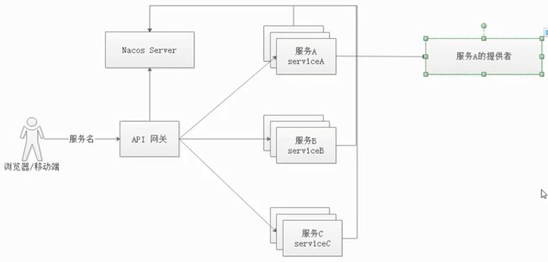

# spring cloud gateway

Spring Cloud Gateway 是 Spring 官方基于 Spring 5.0，Spring Boot 2.0 和 Project Reactor 等技术开发的网关，Spring Cloud Gateway 旨在为微服务架构提供一种简单而有效的统一的 API 路由管理方式。**Spring Cloud Gateway 作为 Spring Cloud 生态系中的网关，目标是替代 Netflix ZUUL**，其不仅提供统一的路由方式，并且基于 Filter 链的方式提供了网关基本的功能，例如：安全，监控/埋点，和限流等


## 特点

- 基于 Spring Framework 5，Project Reactor 和 Spring Boot 2.0
- 基于netty容器，使用响应式编程
- ==动态路由==，核心功能
- Predicates 和 Filters 作用于特定路由
- 集成 Hystrix 断路器
- 集成 Spring Cloud DiscoveryClient
- 易于编写的 Predicates 和 Filters
- 限流
- 路径重写
- ==异步非阻塞==
  - zuul-1.x 同步阻塞 


## 工作流程


客户端向 Spring Cloud Gateway 发出请求。然后在 Gateway Handler Mapping 中找到与请求相匹配的路由，将其发送到 Gateway Web Handler。Handler 再通过指定的过滤器链来将请求发送到我们实际的服务执行业务逻辑，然后返回。

过滤器之间用虚线分开是因为过滤器可能会在发送代理请求之前（`pre`）或之后（`post`）执行业务逻辑。




## 基本使用

### pom

```xml
<?xml version="1.0" encoding="UTF-8"?>
<project xmlns="http://maven.apache.org/POM/4.0.0" xmlns:xsi="http://www.w3.org/2001/XMLSchema-instance"
         xsi:schemaLocation="http://maven.apache.org/POM/4.0.0 http://maven.apache.org/xsd/maven-4.0.0.xsd">
    <modelVersion>4.0.0</modelVersion>

    <parent>
        <groupId>com.funtl</groupId>
        <artifactId>hello-spring-cloud-alibaba-dependencies</artifactId>
        <version>1.0.0-SNAPSHOT</version>
        <relativePath>../hello-spring-cloud-alibaba-dependencies/pom.xml</relativePath>
    </parent>

    <artifactId>hello-spring-cloud-gateway</artifactId>
    <packaging>jar</packaging>

    <name>hello-spring-cloud-gateway</name>
    <url>http://www.funtl.com</url>
    <inceptionYear>2018-Now</inceptionYear>

    <dependencies>
        <!-- Spring Boot Begin -->
        <dependency>
            <groupId>org.springframework.boot</groupId>
            <artifactId>spring-boot-starter-actuator</artifactId>
        </dependency>
        <dependency>
            <groupId>org.springframework.boot</groupId>
            <artifactId>spring-boot-starter-test</artifactId>
            <scope>test</scope>
        </dependency>
        <!-- Spring Boot End -->

        <!-- Spring Cloud Begin -->
        <dependency>
            <groupId>org.springframework.cloud</groupId>
            <artifactId>spring-cloud-starter-alibaba-nacos-discovery</artifactId>
        </dependency>
        <dependency>
            <groupId>org.springframework.cloud</groupId>
            <artifactId>spring-cloud-starter-alibaba-sentinel</artifactId>
        </dependency>
        <dependency>
            <groupId>org.springframework.cloud</groupId>
            <artifactId>spring-cloud-starter-openfeign</artifactId>
        </dependency>
        <dependency>
            <groupId>org.springframework.cloud</groupId>
            <artifactId>spring-cloud-starter-gateway</artifactId>
        </dependency>
        <!-- Spring Cloud End -->

        <!-- Commons Begin -->
        <dependency>
            <groupId>javax.servlet</groupId>
            <artifactId>javax.servlet-api</artifactId>
        </dependency>
        <!-- Commons Begin -->
    </dependencies>

    <build>
        <plugins>
            <plugin>
                <groupId>org.springframework.boot</groupId>
                <artifactId>spring-boot-maven-plugin</artifactId>
                <configuration>
                    <mainClass>com.stt.GatewayApplication</mainClass>
                </configuration>
            </plugin>
        </plugins>
    </build>
</project>
```

- 主要增加了 `org.springframework.cloud:spring-cloud-starter-gateway` 依赖

- Spring Cloud Gateway 不使用 Web 作为服务器，而是 **使用 WebFlux 作为服务器**，Gateway 项目已经依赖了 `starter-webflux`，所以这里 **千万不要依赖 starter-web**
- 由于过滤器等功能依然需要 Servlet 支持，故这里还需要依赖 `javax.servlet:javax.servlet-api`


### application

```java
package com.funtl.hello.spring.cloud.gateway;

import org.springframework.boot.SpringApplication;
import org.springframework.boot.autoconfigure.SpringBootApplication;
import org.springframework.cloud.client.discovery.EnableDiscoveryClient;
import org.springframework.cloud.openfeign.EnableFeignClients;

@SpringBootApplication
@EnableDiscoveryClient
@EnableFeignClients
public class GatewayApplication {
    public static void main(String[] args) {
        SpringApplication.run(GatewayApplication.class, args);
    }
}
```


### yml

```yaml
spring:
  application:
    # 应用名称
    name: spring-gateway
  cloud:
    # 使用 Naoos 作为服务注册发现
    nacos:
      discovery:
        server-addr: 127.0.0.1:8848
    # 使用 Sentinel 作为熔断器
    sentinel:
      transport:
        port: 8721
        dashboard: localhost:8080
    # 路由网关配置
    gateway:
      # 设置与服务注册发现组件结合，这样可以采用服务名的路由策略
      discovery:
        locator:
          enabled: true
      # 配置路由规则
      routes:
        # 采用自定义路由 ID（有固定用法，不同的 id 有不同的功能，详见：https://cloud.spring.io/spring-cloud-gateway/2.0.x/single/spring-cloud-gateway.html#gateway-route-filters）
        - id: NACOS-CONSUMER
          # 采用 LoadBalanceClient 方式请求，以 lb:// 开头，后面的是注册在 Nacos 上的服务名
          uri: lb://nacos-consumer
          # Predicate 翻译过来是“谓词”的意思，必须，主要作用是匹配用户的请求，有很多种用法
          predicates:
            # Method 方法谓词，这里是匹配 GET 和 POST 请求
            - Method=GET,POST
        - id: NACOS-CONSUMER-FEIGN
          uri: lb://nacos-consumer-feign
          predicates:
            - Method=GET,POST

server:
  port: 9000

# 目前无效
feign:
  sentinel:
    enabled: true

# 目前无效
management:
  endpoints:
    web:
      exposure:
        include: "*"

# 配置日志级别，方别调试
logging:
  level:
    org.springframework.cloud.gateway: debug
```


### 测试

依次运行 Nacos 服务、`NacosProviderApplication`、`NacosConsumerApplication`、`NacosConsumerFeignApplication`、`GatewayApplication`

打开浏览器访问：http://localhost:9000/nacos-consumer/echo/app/name 浏览器显示

```html
Hello Nacos Discovery nacos-consumer i am from port 8082
```

打开浏览器访问：http://localhost:9000/nacos-consumer-feign/echo/hi 浏览器显示

```html
Hello Nacos Discovery Hi Feign i am from port 8082
```

**注意：请求方式是 http://路由网关IP:路由网关Port/服务名/\****

至此说明 Spring Cloud Gateway 的路由功能配置成功


## 全局过滤

全局过滤器作用于所有的路由，不需要单独配置，我们可以用它来实现很多统一化处理的业务需求，比如权限认证，IP 访问限制等等。

**注意：截止博客发表时间 2019 年 01 月 10 日，Spring Cloud Gateway 正式版为 2.0.2 其文档并不完善，并且有些地方还要重新设计，这里仅提供一个基本的案例**


### 声明周期


Spring Cloud Gateway 基于 Project Reactor 和 WebFlux，采用响应式编程风格，打开它的 Filter 的接口 GlobalFilter 你会发现它只有一个方法 filter


### 创建全局过滤器

实现 `GlobalFilter`, `Ordered` 接口并在类上增加 `@Component` 注解就可以使用过滤功能了，非常简单方便

```java
package com.funtl.hello.spring.cloud.gateway.filters;

import com.fasterxml.jackson.core.JsonProcessingException;
import com.fasterxml.jackson.databind.ObjectMapper;
import com.google.common.collect.Maps;
import org.springframework.cloud.gateway.filter.GatewayFilterChain;
import org.springframework.cloud.gateway.filter.GlobalFilter;
import org.springframework.core.Ordered;
import org.springframework.core.io.buffer.DataBuffer;
import org.springframework.http.HttpStatus;
import org.springframework.http.server.reactive.ServerHttpResponse;
import org.springframework.stereotype.Component;
import org.springframework.web.server.ServerWebExchange;
import reactor.core.publisher.Mono;

import java.util.Map;

/**
 * 鉴权过滤器
 */
@Component
public class AuthFilter implements GlobalFilter, Ordered {
    @Override
    public Mono<Void> filter(ServerWebExchange exchange, GatewayFilterChain chain) {
        String token = exchange.getRequest().getQueryParams().getFirst("token");

        if (token == null || token.isEmpty()) {
            ServerHttpResponse response = exchange.getResponse();

            // 封装错误信息
            Map<String, Object> responseData = Maps.newHashMap();
            responseData.put("code", 401);
            responseData.put("message", "非法请求");
            responseData.put("cause", "Token is empty");

            try {
                // 将信息转换为 JSON
                ObjectMapper objectMapper = new ObjectMapper();
                byte[] data = objectMapper.writeValueAsBytes(responseData);

                // 输出错误信息到页面
                DataBuffer buffer = response.bufferFactory().wrap(data);
                response.setStatusCode(HttpStatus.UNAUTHORIZED);
                response.getHeaders().add("Content-Type", 
                                          "application/json;charset=UTF-8");
                return response.writeWith(Mono.just(buffer));
            } catch (JsonProcessingException e) {
                e.printStackTrace();
            }
        }
        return chain.filter(exchange);
    }

    /**
    * 设置过滤器的执行顺序 数字越小，优先级越高
    * @return 
    */
    @Override
    public int getOrder() {
        return Ordered.LOWEST_PRECEDENCE;
    }
}
```


### 测试

浏览器访问：http://localhost:9000/nacos-consumer/echo/app/name 网页显示

```json
{"code":401,"cause":"Token is empty","message":"非法请求"}
```

浏览器访问：http://localhost:9000/nacos-consumer/echo/app/name?token=123456 网页显示

```html
Hello Nacos Discovery nacos-consumer i am from port 8082
```


## 各个网关性能

Spring 官方人员提供的网关基准测试报告 [GitHub](https://github.com/spencergibb/spring-cloud-gateway-bench)

| Proxy    | Avg Latency | Avg Req/Sec/Thread |
| -------- | ----------- | ------------------ |
| gateway  | 6.61ms      | 3.24k              |
| linkered | 7.62ms      | 2.82k              |
| zuul     | 12.56ms     | 2.09k              |
| none     | 2.09ms      | 11.77k             |

### 说明

- 这里的 Zuul 为 1.x 版本，是一个基于阻塞 IO 的 API Gateway
- Zuul 已经发布了 Zuul 2.x，基于 Netty，非阻塞的，支持长连接，但 Spring Cloud 暂时还没有整合计划
- Linkerd 基于 Scala 实现的、目前市面上仅有的生产级别的 Service Mesh（其他诸如 **Istio、Conduit 暂时还不能用于生产**）。

