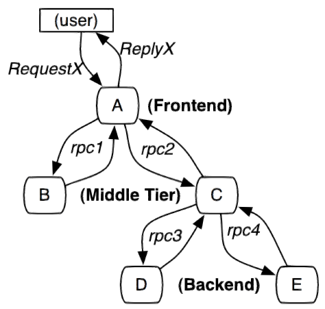
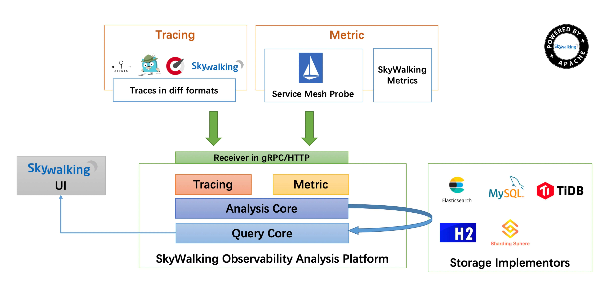
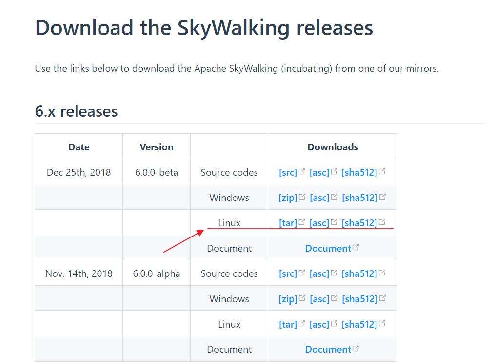
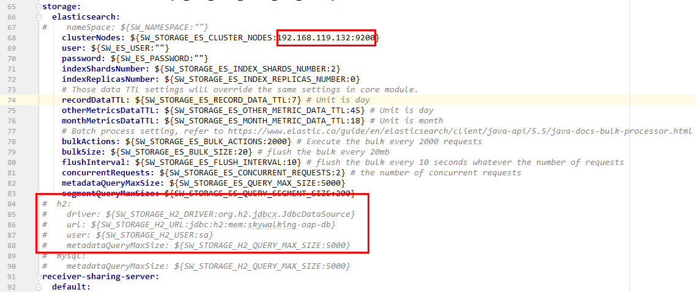
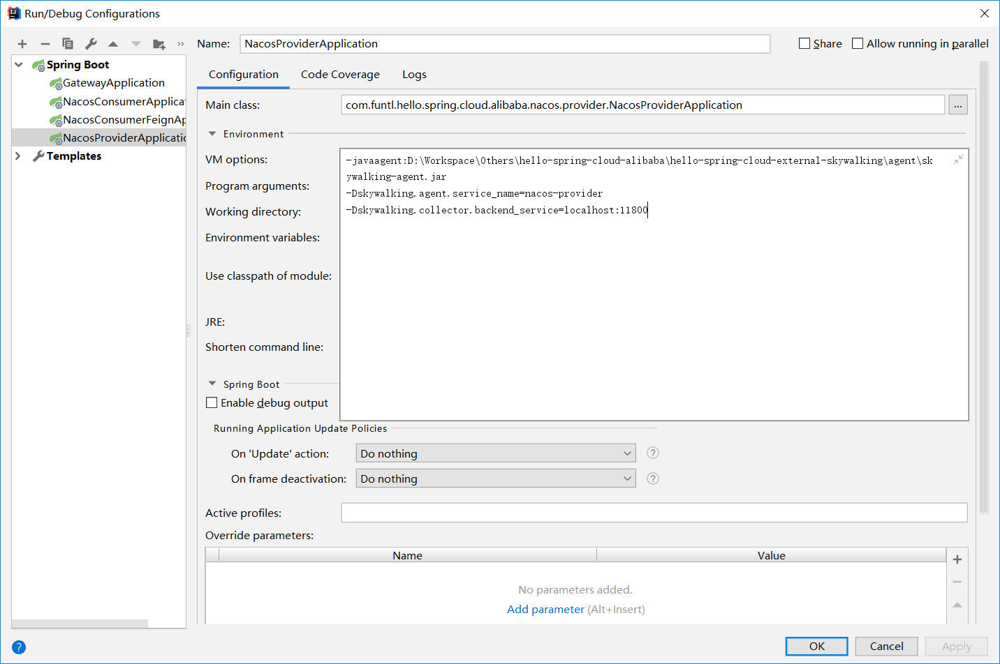
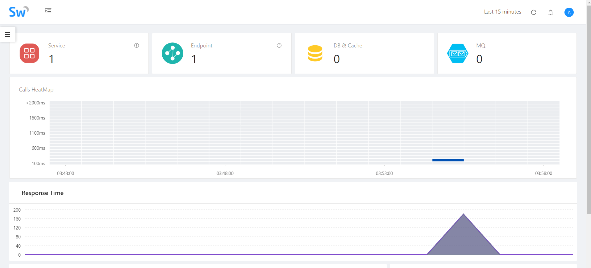
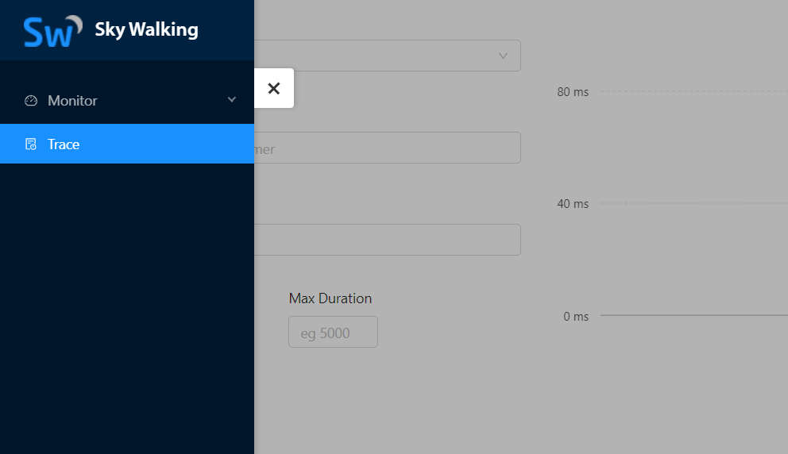
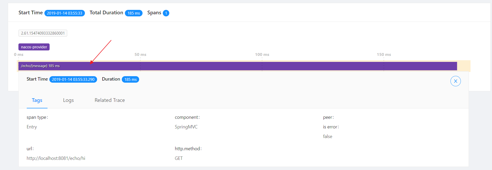
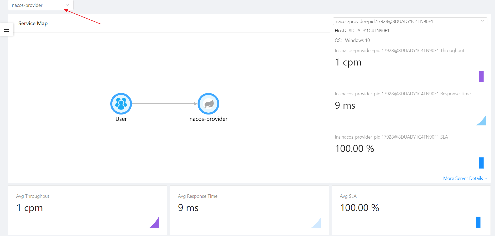
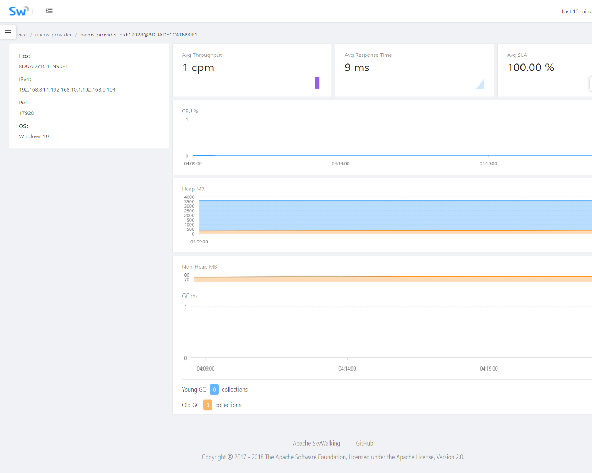

# SkyWalking 使用

http://skywalking.apache.org/


## 什么是链路追踪

微服务架构是通过业务来划分服务的，使用 REST 调用。对外暴露的一个接口，可能需要很多个服务协同才能完成这个接口功能，如果链路上任何一个服务出现问题或者网络超时，都会形成导致接口调用失败。随着业务的不断扩张，服务之间互相调用会越来越复杂。



随着服务的越来越多，对调用链的分析会越来越复杂。它们之间的调用关系也许如下：


面对以上情况，我们就需要一些可以帮助理解系统行为、用于分析性能问题的工具，以便发生故障的时候，能够快速定位和解决问题，这就是所谓的 APM（应用性能管理）


## 关于SkyWalking

- 目前主要的一些 APM 工具有: Cat、Zipkin、Pinpoint、SkyWalking

- Apache SkyWalking 是观察性分析平台和应用性能管理系统。提供分布式追踪、服务网格遥测分析、度量聚合和可视化一体化解决方案。



- **Skywalking Agent：** 使用 JavaAgent 做字节码植入，无侵入式的收集，并通过 HTTP 或者 gRPC 方式发送数据到 SkyWalking Collector。
- **SkyWalking Collector：** 链路数据收集器，对 agent 传过来的数据进行整合分析处理并落入相关的数据存储中。
- **Storage：** SkyWalking 的存储，时间更迭，SW 已经开发迭代到了 6.x 版本，在 6.x 版本中支持以 ==ElasticSearch==(支持 6.x)、Mysql、TiDB、H2、作为存储介质进行数据存储。
- **UI：** Web 可视化平台，用来展示落地的数据


## 功能特性

- 多种监控手段，语言探针和服务网格(Service Mesh)
- 多语言自动探针，Java，.NET Core 和 Node.JS
- 轻量高效，不需要大数据
- 模块化，UI、存储、集群管理多种机制可选
- 支持告警
- 优秀的可视化方案


## 基于docker安装ElasticSearch

官方推荐的方案是 ElasticSearch


### docker-compose.yml

```yaml
version: '3.3'
services:
  elasticsearch:
    image: wutang/elasticsearch-shanghai-zone:6.3.2 # 由于skywalking用的是6.3.2版本，但是官方镜像没有6.3.2，故使用第三方镜像
    container_name: elasticsearch
    restart: always
    ports:
      - 9200:9200
      - 9300:9300
    environment:
      cluster.name: elasticsearch
```

其中，`9200` 端口号为 SkyWalking 配置 ElasticSearch 所需端口号，`cluster.name` 为 SkyWalking 配置 ElasticSearch 集群的名称


### 测试

浏览器访问 http://elasticsearchIP:9200/ ，浏览器返回如下信息即表示成功启动

```json
{
  "name" : "QteENcv",
  "cluster_name" : "elasticsearch",
  "cluster_uuid" : "OaqnYTazSlam7oP6yIfiuw",
  "version" : {
    "number" : "6.3.2",
    "build_flavor" : "default",
    "build_type" : "tar",
    "build_hash" : "053779d",
    "build_date" : "2018-07-20T05:20:23.451332Z",
    "build_snapshot" : false,
    "lucene_version" : "7.3.1",
    "minimum_wire_compatibility_version" : "5.6.0",
    "minimum_index_compatibility_version" : "5.0.0"
  },
  "tagline" : "You Know, for Search"
}
```


## 安装服务端

### 注意

==**注意服务端安装的目录必须没有中文，否则会失败**==

官方已经为我们准备好了编译过的服务端版本，下载地址为 http://skywalking.apache.org/downloads/，这里我们需要下载 6.x releases 版本

可以使用docker安装，现阶段不稳定，手动在本地跑一下试试。




### 配置

下载完成后解压缩，进入 `apache-skywalking-apm-incubating/config` 目录并修改 `application.yml` 配置文件

- 注释 H2 存储方案
- 启用 ElasticSearch 存储方案
- 修改 ElasticSearch 服务器地址




### 启动

E:\千峰\apache-skywalking-apm-6.2.0\apache-skywalking-apm-bin\bin目录下

找到startup.bat点击启动

访问http://localhost:8080/

默认密码admin/admin


## 配置客户端

### java Agent 服务器探针

参考官网给出的帮助 [Setup java agent](https://github.com/apache/incubator-skywalking/blob/master/docs/en/setup/service-agent/java-agent/README.md)，我们需要使用官方提供的探针为我们达到监控的目的，按照实际情况我们需要实现三种部署方式

- IDEA 部署探针
- Java 启动方式部署探针（我们是 Spring Boot 应用程序，需要使用 `java -jar` 的方式启动应用）
- Docker 启动方式部署探针（需要做到一次构建到处运行的持续集成效果，本章节暂不提供解决方案，到后面的实战环节再实现）

探针文件在 `apache-skywalking-apm-incubating/agent` 目录下


修改项目的 VM 运行参数，点击菜单栏中的 `Run` -> `EditConfigurations...`，此处我们以 `nacos-provider` 项目为例，修改参数如下

```bash
-javaagent:E:\spring-cloud\code\spring-cloud-alibaba\skywalking-agent\agent\skywalking-agent.jar
-Dskywalking.agent.service_name=service-provider
-Dskywalking.collector.backend_service=localhost:11800 #skywalking 的collector运行的服务器地址
```



- `-javaagent`：用于指定探针路径
- `-Dskywalking.agent.service_name`：用于重写 `agent/config/agent.config` 配置文件中的服务名
- `-Dskywalking.collector.backend_service`：用于重写 `agent/config/agent.config` 配置文件中的服务地址


### 启动方式

```bash
java -javaagent:/path/to/skywalking-agent/skywalking-agent.jar -Dskywalking.agent.service_name=nacos-provider -Dskywalking.collector.backend_service=localhost:11800 -jar yourApp.jar
```


### 测试监控

启动 `nacos-provider` 项目，通过观察日志可以发现，已经成功加载探针


访问之前写好的接口 http://localhost:8081/echo/hi 之后再刷新 SkyWalking Web UI，你会发现 Service 与 Endpoint 已经成功检测到了




至此，表示 SkyWalking 链路追踪配置成功


## SkyWalking Trace 监控

SkyWalking 通过业务调用监控进行依赖分析，提供给我们了服务之间的服务调用拓扑关系、以及针对每个 Endpoint 的 Trace 记录。

### 调用链路监控

点击 `Trace` 菜单，进入追踪页



点击 `Trace ID` 展开详细信息




上图展示了一次正常的响应，总响应时间为 `185ms` 共有一个 Span（基本工作单元，表示一次完整的请求，包含响应，即请求并响应）

Span `/echo/{message}` 说明如下：

- Duration：响应时间 185 毫秒
- component：组件类型为 SpringMVC
- url：请求地址
- http.method：请求类型

### 服务性能指标监控

点击 `Service` 菜单，进入服务性能指标监控页


选择希望监控的服务



- **Avg SLA：** 服务可用性（主要是通过请求成功与失败次数来计算）
- **CPM：** 每分钟调用次数
- **Avg Response Time：** 平均响应时间

点击 `More Server Details...` 还可以查看详细信息




上图中展示了服务在一定时间范围内的相关数据，包括：

- 服务可用性指标 SLA
- 每分钟平均响应数
- 平均响应时间
- 服务进程 PID
- 服务所在物理机的 IP、Host、OS
- 运行时 CPU 使用率
- 运行时堆内存使用率
- 运行时非堆内存使用率
- GC 情况


## Maven Assembly插件

Assembly 插件目的是提供一个把工程依赖元素、模块、网站文档等其他文件存放到单个归档文件里

### 支持归档类型

- zip
- tar.gz
- tar.bz2
- jar
- dir
- war


### 使用步骤

此处以将 SkyWalking 探针打包为 `tar.gz` 为例，为后期持续集成时构建 Docker 镜像做好准备

使用ADD命令的时候自动解压


#### pom

在 `pom.xml` 中增加插件配置

```xml
<build>
    <plugins>
        <plugin>
            <groupId>org.apache.maven.plugins</groupId>
            <artifactId>maven-assembly-plugin</artifactId>
            <executions>
                <!-- 配置执行器 -->
                <execution>
                    <id>make-assembly</id>
                    <!-- 绑定到 package 生命周期阶段上 -->
                    <phase>package</phase>
                    <goals>
                        <!-- 只运行一次 -->
                        <goal>single</goal>
                    </goals>
                    <configuration>
                        <finalName>skywalking</finalName>
                        <descriptors>
                            <!-- 配置描述文件路径 -->
                            <descriptor>src/main/resources/assembly.xml</descriptor>
                        </descriptors>
                    </configuration>
                </execution>
            </executions>
        </plugin>
    </plugins>
</build>
```


#### assembly.xml

创建 `src/main/resources/assembly.xml` 配置文件

```xml
<assembly>
    <id>6.0.0-Beta</id>
    <formats>
        <!-- 打包的文件格式，支持 zip、tar.gz、tar.bz2、jar、dir、war -->
        <format>tar.gz</format>
    </formats>
    <!-- tar.gz 压缩包下是否生成和项目名相同的根目录，有需要请设置成 true -->
    <includeBaseDirectory>false</includeBaseDirectory>
    <dependencySets>
        <dependencySet>
            <!-- 是否把本项目添加到依赖文件夹下，有需要请设置成 true -->
            <useProjectArtifact>false</useProjectArtifact>
            <outputDirectory>lib</outputDirectory>
            <!-- 将 scope 为 runtime 的依赖包打包 -->
            <scope>runtime</scope>
        </dependencySet>
    </dependencySets>
    <fileSets>
        <fileSet>
            <!-- 设置需要打包的文件路径 -->
            <directory>agent</directory>
            <!-- 打包后的输出路径 -->
            <outputDirectory></outputDirectory>
        </fileSet>
    </fileSets>
</assembly>
```


#### 打包

```shell
mvn clean package
mvn clean install
```

- package：会在 target 目录下创建名为 `skywalking-6.0.0-Beta.tar.gz` 的压缩包
- install：会在本地仓库目录下创建名为 `hello-spring-cloud-external-skywalking-1.0.0-SNAPSHOT-6.0.0-Beta.tar.gz` 的压缩包

