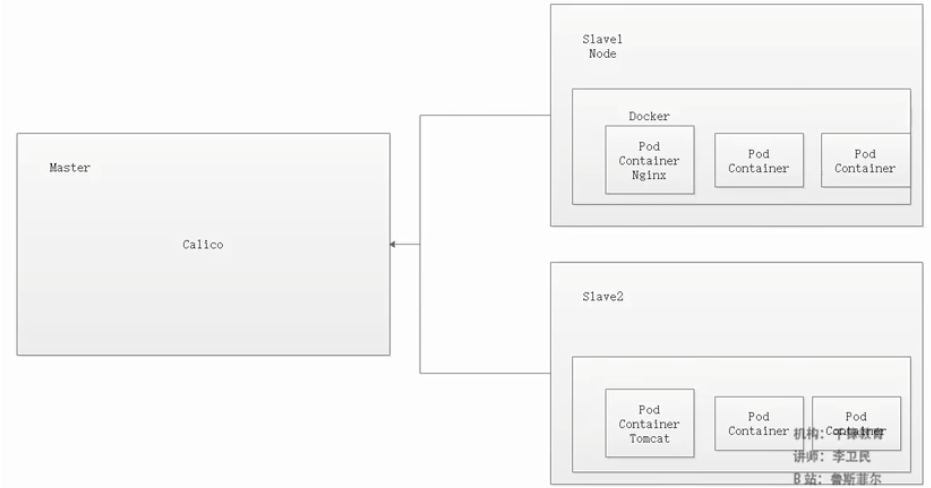

## Kubernetes 入门

Istio

- 负载均衡
- 限流
- 监控
- 弹性伸缩

谷歌微服务架构解决方案

- go + gRPC + Istio

Kubernetes

- 容器编排工具

- 安装Ubuntu 18.04LTS版本


## 关于服务网格

服务网格(Service Mesh)，最早使用由开发 Linkerd 的 Buoyant 公司提出，并在内部使用。2016 年 9 月 29 日第一次公开使用这个术语。2017 年的时候随着 Linkerd 的传入，Service Mesh 进入国内技术社区的视野。

服务网格是一个基础设施层，功能在于处理服务间通信，职责是负责实现请求的可靠传递。在实践中，服务网格通常实现为轻量级网络代理，通常与应用程序部署在一起，但是对应用程序透明。

服务网格称之为下一代微服务架构标准，按照我给出的三套微服务架构解决方案（Apache Dubbo Zookeeper、Spring Cloud Netflix、Spring Cloud Alibaba）不难看出都是在使用各种组件组合成为我们期望的微服务架构的样子。这就直接导致了咱们目前使用的微服务架构模型都是七拼八凑的并没有一个有效的标准去界定这到底算不算微服务。

于是由 Google、IBM 和 Lyft 联合打造的 **Istio** 应运而生，他是 Service Mesh 的集大成者。为了实现真正的微服务架构学习 Istio 是必须的。而它又与 Kubernetes 一脉相承，所以咱们服务网格化的第一课是 Kubernetes。


## 概述

Kubernetes 是 **Google 2014 年创建管理的**，是 Google 10 多年大规模容器管理技术 Borg 的开源版本。

Kubernetes 是容器集群管理系统，是一个开源的平台，可以实现容器集群的自动化部署、自动扩缩容、维护等功能。使用 Kubernetes 我们可以：

- 快速部署应用
- 快速扩展应用
- 无缝对接新的应用功能
- 节省资源，优化硬件资源的使用

Kubernetes 的目标是促进完善组件和工具的生态系统，以减轻应用程序在公有云或私有云中运行的负担


### 特点

- **可移植：** 支持公有云，私有云（openStack），混合云（公有云+私有云），多重云（多个公有云）
- **可扩展：** 模块化，插件化，可挂载，可组合
- **自动化：** 自动部署，自动重启，自动复制，自动伸缩/扩展


### 从传统到容器化部署


#### 传统的部署方式

传统的应用部署方式是通过插件或脚本来安装应用。这样做的缺点是应用的运行、配置、管理、所有生存周期将与当前操作系统绑定，这样做并不利于应用的升级更新/回滚等操作，当然也可以通过创建虚机的方式来实现某些功能，但是虚拟机非常重，并不利于可移植性。


#### 容器化部署的优势

- **快速创建/部署应用：** 与虚拟机相比，容器镜像的创建更加容易。
- **持续开发、集成和部署：** 提供可靠且频繁的容器镜像构建/部署，并使用快速和简单的回滚(由于镜像不可变性)。
- **开发和运行相分离：** 在 build 或者 release 阶段创建容器镜像，使得应用和基础设施解耦。
- **开发，测试和生产环境一致性：** 在本地或外网（生产环境）运行的一致性。
- **云平台或其他操作系统：** 可以在 Ubuntu、RHEL、CoreOS、on-prem、Google Container Engine 或其它任何环境中运行。
- **分布式，弹性，微服务化：** 应用程序分为更小的、独立的部件，可以动态部署和管理。
- **资源隔离**
- **资源利用更高效**


### 为什么需要 Kubernetes

可以在物理或虚拟机的 Kubernetes 集群上运行容器化应用，Kubernetes 能提供一个以 **“容器为中心的基础架构”**，满足在生产环境中运行应用的一些常见需求，如：

- 多个进程协同工作
- 存储系统挂载
- 应用健康检查
- 应用实例的复制
- 自动伸缩/扩展
- 注册与发现
- 负载均衡
- 滚动更新
- 资源监控
- 日志访问
- 调试应用程序
- 提供认证和授权


## 安装

本次安装采用 ==Ubuntu Server X64 18.04 LTS== 版本安装 kubernetes 集群环境，集群节点为 1 主 2 从模式，此次对虚拟机会有些基本要求，如下：

- OS：Ubuntu Server X64 18.04 LTS（16.04 版本步骤相同，再之前则不同）
- CPU：最低要求，1 CPU 2 核
- 内存：最低要求，2GB
- 磁盘：最低要求，20GB

创建三台虚拟机，分别命名如下：（==一主两从模式==）只是集群模式，不具备高可用

- Ubuntu Server 18.04 X64 Kubernetes Master
- Ubuntu Server 18.04 X64 Kubernetes Slave1
- Ubuntu Server 18.04 X64 Kubernetes Slave2


### 安装Ubuntu 

- 项目选择使用tab键

- 前期默认done，在配置软件镜像需要配置阿里镜像，注意2个都要配置

```shell
http://mirrors.aliyun.com/ubuntu
```

- 选择磁盘LVM


- 在虚拟机学习使用中，对LVM进行配置


- 直接修改为总分配的大小


- 输入用户名  stt，服务器名stt，密码123456


- 安装 OpenSSH


#### 配置权限

- 更新

```shell
sudo apt-get update
```

- 给root账户设置密码

```shell
stt@stt:/usr/local$ sudo passwd root
Enter new UNIX password: 
Retype new UNIX password: 
passwd: password updated successfully
```

- 切换账户

```shell
stt@stt:/usr/local$ su root
Password: 
root@stt:/usr/local# 
```

- 设置远程登录root账户

```shell
root@stt:/usr/local# vi /etc/ssh/sshd_config
# 设置如下
PermitRootLogin yes
# 重启服务
root@stt:/usr/local# service ssh restart
```


#### 关键配置

- 关闭交换空间：`sudo swapoff -a` ；k8s不支持交换空间配置，需要关闭

```shell
# 查看虚拟交换空间 Swap
root@stt:~# free -h
              total        used        free      shared  buff/cache   available
Mem:           1.9G        202M        1.1G        1.2M        641M        1.6G
Swap:          2.0G          0B        2.0G
# 关闭虚拟交换空间
root@stt:~# swapoff -a
root@stt:~# free -h
              total        used        free      shared  buff/cache   available
Mem:           1.9G        201M        1.1G        1.2M        641M        1.6G
Swap:            0B          0B          0B
```

- 避免开机启动交换空间：注释 `/etc/fstab` 中的 `swap`

```shell
root@stt:~# vim /etc/fstab 
------
UUID=06284789-a6d6-4e08-894d-a57cc5c8acc2 / ext4 defaults 0 0
UUID=6e5961f6-9cdd-4b58-85e8-a0148bb09477 /boot ext4 defaults 0 0
#/swap.img      none    swap    sw      0       0
```

- 关闭防火墙：`ufw disable`

```shell
root@stt:~# ufw disable
Firewall stopped and disabled on system startup
```


### 安装Docker

```shell
# 更新软件源
sudo apt-get update
# 安装所需依赖
sudo apt-get -y install apt-transport-https ca-certificates curl software-properties-common
# 安装 GPG 证书
curl -fsSL http://mirrors.aliyun.com/docker-ce/linux/ubuntu/gpg | sudo apt-key add -
# 新增软件源信息
sudo add-apt-repository "deb [arch=amd64] http://mirrors.aliyun.com/docker-ce/linux/ubuntu $(lsb_release -cs) stable"
# 再次更新软件源
sudo apt-get -y update
# 安装 Docker CE 版
sudo apt-get -y install docker-ce
```


#### 验证

```shell
docker version
Client:
...

Server: Docker Engine - Community
...
```


#### 配置加速器

对于使用 **systemd** 的系统，请在 `/etc/docker/daemon.json` 中写入如下内容（如果文件不存在请新建该文件）

https://cr.console.aliyun.com/cn-hangzhou/instances/mirrors

```json
{
  "registry-mirrors": [
    "https://o2qwaqgd.mirror.aliyuncs.com",
    "https://registry.docker-cn.com"
  ]
}
```

注意，一定要保证该文件符合 JSON 规范，否则 Docker 将不能启动。

验证是否成功

```shell
sudo systemctl restart docker
docker info
...
# 出现如下语句即表示配置成功
Registry Mirrors:
 https://registry.docker-cn.com/
...
```


#### 修改主机名(克隆之后进行)

在同一局域网中主机名不应该相同，所以我们需要做修改，下列操作步骤为修改 **18.04** 版本的 Hostname，如果是 16.04 或以下版本则直接修改 `/etc/hostname` 里的名称即可

- 查看当前主机名

```shell
# 查看当前主机名
hostnamectl
# 显示如下内容
   Static hostname: ubuntu
         Icon name: computer-vm
           Chassis: vm
        Machine ID: 33011e0a95094672b99a198eff07f652
           Boot ID: dc856039f0d24164a9f8a50c506be96d
    Virtualization: vmware
  Operating System: Ubuntu 18.04.2 LTS
            Kernel: Linux 4.15.0-48-generic
      Architecture: x86-64
```

- 修改主机名

```shell
# 使用 hostnamectl 命令修改，其中 kubernetes-master 为新的主机名
hostnamectl set-hostname kubernetes-master
```

##### 修改cloud.cfg

如果 `cloud-init package` 安装了，需要修改 `cloud.cfg` 文件。该软件包通常缺省安装用于处理 cloud

```bash
# 如果有该文件
vi /etc/cloud/cloud.cfg

# 该配置默认为 false，修改为 true 即可
preserve_hostname: true
```

验证

```bash
root@kubernetes-master:~# hostnamectl
   Static hostname: kubernetes-master
         Icon name: computer-vm
           Chassis: vm
        Machine ID: 33011e0a95094672b99a198eff07f652
           Boot ID: 8c0fd75d08c644abaad3df565e6e4cbd
    Virtualization: vmware
  Operating System: Ubuntu 18.04.2 LTS
            Kernel: Linux 4.15.0-48-generic
      Architecture: x86-64
```


### 安装kubeadm

kubeadm 是 kubernetes 的集群安装工具，能够快速安装 kubernetes 集群。


#### 配置软件源

```shell
# 安装系统工具
apt-get update && apt-get install -y apt-transport-https
# 安装 GPG 证书
curl https://mirrors.aliyun.com/kubernetes/apt/doc/apt-key.gpg | apt-key add -
# 写入软件源；注意：我们用系统代号为 bionic(在/etc/apt/sources.list中查看)，但目前阿里云不支持，所以沿用 16.04 的系统代号 xenial
cat << EOF >/etc/apt/sources.list.d/kubernetes.list
> deb https://mirrors.aliyun.com/kubernetes/apt/ kubernetes-xenial main
> EOF
```


#### 安装 kubelet kubeadm kubectl

- kubeadm：用于初始化 Kubernetes 集群
- kubelet：主要负责启动 Pod 和容器
- kubectl：Kubernetes 的命令行工具，主要作用是部署和管理应用，查看各种资源，创建，删除和更新组件

```bash
# 安装
apt-get update  
apt-get install -y kubelet kubeadm kubectl

# 安装过程如下，注意 kubeadm 的版本号
Reading package lists... Done
Building dependency tree       
Reading state information... Done
The following additional packages will be installed:
  conntrack cri-tools kubernetes-cni socat
The following NEW packages will be installed:
  conntrack cri-tools kubeadm kubectl kubelet kubernetes-cni socat
0 upgraded, 7 newly installed, 0 to remove and 96 not upgraded.
Need to get 50.6 MB of archives.
After this operation, 290 MB of additional disk space will be used.
Get:1 http://mirrors.aliyun.com/ubuntu bionic/main amd64 conntrack amd64 1:1.4.4+snapshot20161117-6ubuntu2 [30.6 kB]
Get:2 http://mirrors.aliyun.com/ubuntu bionic/main amd64 socat amd64 1.7.3.2-2ubuntu2 [342 kB]
Get:3 https://mirrors.aliyun.com/kubernetes/apt kubernetes-xenial/main amd64 cri-tools amd64 1.12.0-00 [5,343 kB]
Get:4 https://mirrors.aliyun.com/kubernetes/apt kubernetes-xenial/main amd64 kubernetes-cni amd64 0.7.5-00 [6,473 kB]
Get:5 https://mirrors.aliyun.com/kubernetes/apt kubernetes-xenial/main amd64 kubelet amd64 1.14.1-00 [21.5 MB]
Get:6 https://mirrors.aliyun.com/kubernetes/apt kubernetes-xenial/main amd64 kubectl amd64 1.14.1-00 [8,806 kB]
Get:7 https://mirrors.aliyun.com/kubernetes/apt kubernetes-xenial/main amd64 kubeadm amd64 1.14.1-00 [8,150 kB]
Fetched 50.6 MB in 5s (9,912 kB/s) 
Selecting previously unselected package conntrack.
(Reading database ... 67205 files and directories currently installed.)
Preparing to unpack .../0-conntrack_1%3a1.4.4+snapshot20161117-6ubuntu2_amd64.deb ...
Unpacking conntrack (1:1.4.4+snapshot20161117-6ubuntu2) ...
Selecting previously unselected package cri-tools.
Preparing to unpack .../1-cri-tools_1.12.0-00_amd64.deb ...
Unpacking cri-tools (1.12.0-00) ...
Selecting previously unselected package kubernetes-cni.
Preparing to unpack .../2-kubernetes-cni_0.7.5-00_amd64.deb ...
Unpacking kubernetes-cni (0.7.5-00) ...
Selecting previously unselected package socat.
Preparing to unpack .../3-socat_1.7.3.2-2ubuntu2_amd64.deb ...
Unpacking socat (1.7.3.2-2ubuntu2) ...
Selecting previously unselected package kubelet.
Preparing to unpack .../4-kubelet_1.14.1-00_amd64.deb ...
Unpacking kubelet (1.14.1-00) ...
Selecting previously unselected package kubectl.
Preparing to unpack .../5-kubectl_1.14.1-00_amd64.deb ...
Unpacking kubectl (1.14.1-00) ...
Selecting previously unselected package kubeadm.
Preparing to unpack .../6-kubeadm_1.14.1-00_amd64.deb ...
Unpacking kubeadm (1.14.1-00) ...
Setting up conntrack (1:1.4.4+snapshot20161117-6ubuntu2) ...
Setting up kubernetes-cni (0.7.5-00) ...
Setting up cri-tools (1.12.0-00) ...
Setting up socat (1.7.3.2-2ubuntu2) ...
Setting up kubelet (1.14.1-00) ...
Created symlink /etc/systemd/system/multi-user.target.wants/kubelet.service → /lib/systemd/system/kubelet.service.
Setting up kubectl (1.14.1-00) ...
Processing triggers for man-db (2.8.3-2ubuntu0.1) ...
# 注意这里的版本号，我们使用的是 kubernetes v1.14.1
Setting up kubeadm (1.14.1-00) ...
```

- Setting up kubeadm (1.15.2-00) ... 本机的版本

启动

```bash
# 设置 kubelet 自启动，并启动 kubelet
systemctl enable kubelet && systemctl start kubelet
```


#### 配置 kubeadm

安装 kubernetes 主要是安装它的各个镜像，而 kubeadm 已经为我们集成好了运行 kubernetes 所需的基本镜像。但由于国内的网络原因，在搭建环境时，无法拉取到这些镜像。此时我们只需要修改为阿里云提供的镜像服务即可解决该问题。

```bash
# 在自定义文件夹/usr/local/docker/kubernetes 目录下导出配置文件
root@kubernetes-master:/usr/local/docker/kubernetes# kubeadm config print init-defaults --kubeconfig ClusterConfiguration > kubeadm.yml
root@kubernetes-master:/usr/local/docker/kubernetes# ll
total 12
drwxr-xr-x 2 root root 4096 Aug  9 09:13 ./
drwxr-xr-x 3 root root 4096 Aug  9 09:13 ../
-rw-r--r-- 1 root root  837 Aug  9 09:13 kubeadm.yml
```

```yaml
# 修改配置为如下内容
apiVersion: kubeadm.k8s.io/v1beta1
bootstrapTokens:
- groups:
  - system:bootstrappers:kubeadm:default-node-token
  token: abcdef.0123456789abcdef
  ttl: 24h0m0s
  usages:
  - signing
  - authentication
kind: InitConfiguration
localAPIEndpoint:
  # 修改为主节点 IP
  advertiseAddress: 192.168.141.130 # 修改点
  bindPort: 6443
nodeRegistration:
  criSocket: /var/run/dockershim.sock
  name: kubernetes-master
  taints:
  - effect: NoSchedule
    key: node-role.kubernetes.io/master
---
apiServer:
  timeoutForControlPlane: 4m0s
apiVersion: kubeadm.k8s.io/v1beta1
certificatesDir: /etc/kubernetes/pki
clusterName: kubernetes
controlPlaneEndpoint: ""
controllerManager: {}
dns:
  type: CoreDNS
etcd:
  local:
    dataDir: /var/lib/etcd
# 国内不能访问 Google，修改为阿里云
imageRepository: registry.aliyuncs.com/google_containers
kind: ClusterConfiguration
# 修改版本号,一定要保持一致，本机使用的是1.15.2
kubernetesVersion: v1.14.1 
networking:
  dnsDomain: cluster.local
  # 配置成 Calico 的默认网段
  podSubnet: "192.168.0.0/16"
  serviceSubnet: 10.96.0.0/12
scheduler: {}
---
# 开启 IPVS 模式
apiVersion: kubeproxy.config.k8s.io/v1alpha1
kind: KubeProxyConfiguration
featureGates:
  SupportIPVSProxyMode: true
mode: ipvs
```

- 查看拉取镜像

```bash
# 查看所需镜像列表
root@kubernetes-master:/usr/local/docker/kubernetes# kubeadm config images list --config kubeadm.yml
registry.aliyuncs.com/google_containers/kube-apiserver:v1.15.2
registry.aliyuncs.com/google_containers/kube-controller-manager:v1.15.2
registry.aliyuncs.com/google_containers/kube-scheduler:v1.15.2
registry.aliyuncs.com/google_containers/kube-proxy:v1.15.2
registry.aliyuncs.com/google_containers/pause:3.1
registry.aliyuncs.com/google_containers/etcd:3.3.10
registry.aliyuncs.com/google_containers/coredns:1.3.1
```

```bash
# 拉取镜像
root@kubernetes-master:/usr/local/docker/kubernetes# kubeadm config images pull --config kubeadm.yml

root@kubernetes-master:/usr/local/docker/kubernetes# docker images
REPOSITORY                                                        TAG                 IMAGE ID            CREATED             SIZE
registry.aliyuncs.com/google_containers/kube-proxy                v1.15.2             167bbf6c9338        3 days ago          82.4MB
registry.aliyuncs.com/google_containers/kube-apiserver            v1.15.2             34a53be6c9a7        3 days ago          207MB
registry.aliyuncs.com/google_containers/kube-controller-manager   v1.15.2             9f5df470155d        3 days ago          159MB
registry.aliyuncs.com/google_containers/kube-scheduler            v1.15.2             88fa9cb27bd2        3 days ago          81.1MB
registry.aliyuncs.com/google_containers/coredns                   1.3.1               eb516548c180        6 months ago        40.3MB
registry.aliyuncs.com/google_containers/etcd                      3.3.10              2c4adeb21b4f        8 months ago        258MB
registry.aliyuncs.com/google_containers/pause                     3.1                 da86e6ba6ca1        19 months ago       742kB
```


## 用 kubeadm 搭建 kubernetes集群


### 安装kubernetes 主节点

执行以下命令初始化主节点，该命令指定了初始化时需要使用的配置文件，其中添加 `--experimental-upload-certs` 参数可以在后续执行加入节点时自动分发证书文件。追加的 `tee kubeadm-init.log` 用以输出日志。

```bash
# 初始化，自动分发证书，输出日志
kubeadm init --config=kubeadm.yml --experimental-upload-certs | tee kubeadm-init.log

# 安装成功则会有如下输出
[init] Using Kubernetes version: v1.14.1
[preflight] Running pre-flight checks
        [WARNING IsDockerSystemdCheck]: detected "cgroupfs" as the Docker cgroup driver. The recommended driver is "systemd". Please follow the guide at https://kubernetes.io/docs/setup/cri/
[preflight] Pulling images required for setting up a Kubernetes cluster
[preflight] This might take a minute or two, depending on the speed of your internet connection
[preflight] You can also perform this action in beforehand using 'kubeadm config images pull'
[kubelet-start] Writing kubelet environment file with flags to file "/var/lib/kubelet/kubeadm-flags.env"
[kubelet-start] Writing kubelet configuration to file "/var/lib/kubelet/config.yaml"
[kubelet-start] Activating the kubelet service
[certs] Using certificateDir folder "/etc/kubernetes/pki"
[certs] Generating "ca" certificate and key
[certs] Generating "apiserver" certificate and key
[certs] apiserver serving cert is signed for DNS names [kubernetes-master kubernetes kubernetes.default kubernetes.default.svc kubernetes.default.svc.cluster.local] and IPs [10.96.0.1 192.168.141.130]
[certs] Generating "apiserver-kubelet-client" certificate and key
[certs] Generating "front-proxy-ca" certificate and key
[certs] Generating "front-proxy-client" certificate and key
[certs] Generating "etcd/ca" certificate and key
[certs] Generating "etcd/peer" certificate and key
[certs] etcd/peer serving cert is signed for DNS names [kubernetes-master localhost] and IPs [192.168.141.130 127.0.0.1 ::1]
[certs] Generating "etcd/server" certificate and key
[certs] etcd/server serving cert is signed for DNS names [kubernetes-master localhost] and IPs [192.168.141.130 127.0.0.1 ::1]
[certs] Generating "etcd/healthcheck-client" certificate and key
[certs] Generating "apiserver-etcd-client" certificate and key
[certs] Generating "sa" key and public key
[kubeconfig] Using kubeconfig folder "/etc/kubernetes"
[kubeconfig] Writing "admin.conf" kubeconfig file
[kubeconfig] Writing "kubelet.conf" kubeconfig file
[kubeconfig] Writing "controller-manager.conf" kubeconfig file
[kubeconfig] Writing "scheduler.conf" kubeconfig file
[control-plane] Using manifest folder "/etc/kubernetes/manifests"
[control-plane] Creating static Pod manifest for "kube-apiserver"
[control-plane] Creating static Pod manifest for "kube-controller-manager"
[control-plane] Creating static Pod manifest for "kube-scheduler"
[etcd] Creating static Pod manifest for local etcd in "/etc/kubernetes/manifests"
[wait-control-plane] Waiting for the kubelet to boot up the control plane as static Pods from directory "/etc/kubernetes/manifests". This can take up to 4m0s
[apiclient] All control plane components are healthy after 20.003326 seconds
[upload-config] storing the configuration used in ConfigMap "kubeadm-config" in the "kube-system" Namespace
[kubelet] Creating a ConfigMap "kubelet-config-1.14" in namespace kube-system with the configuration for the kubelets in the cluster
[upload-certs] Storing the certificates in ConfigMap "kubeadm-certs" in the "kube-system" Namespace
[upload-certs] Using certificate key:
2cd5b86c4905c54d68cc7dfecc2bf87195e9d5d90b4fff9832d9b22fc5e73f96
[mark-control-plane] Marking the node kubernetes-master as control-plane by adding the label "node-role.kubernetes.io/master=''"
[mark-control-plane] Marking the node kubernetes-master as control-plane by adding the taints [node-role.kubernetes.io/master:NoSchedule]
[bootstrap-token] Using token: abcdef.0123456789abcdef
[bootstrap-token] Configuring bootstrap tokens, cluster-info ConfigMap, RBAC Roles
[bootstrap-token] configured RBAC rules to allow Node Bootstrap tokens to post CSRs in order for nodes to get long term certificate credentials
[bootstrap-token] configured RBAC rules to allow the csrapprover controller automatically approve CSRs from a Node Bootstrap Token
[bootstrap-token] configured RBAC rules to allow certificate rotation for all node client certificates in the cluster
[bootstrap-token] creating the "cluster-info" ConfigMap in the "kube-public" namespace
[addons] Applied essential addon: CoreDNS
[addons] Applied essential addon: kube-proxy

Your Kubernetes control-plane has initialized successfully!

To start using your cluster, you need to run the following as a regular user:
# 这里输出提示需要做的内容 $HOME 表示路径 ~
  mkdir -p $HOME/.kube
  sudo cp -i /etc/kubernetes/admin.conf $HOME/.kube/config
  sudo chown $(id -u):$(id -g) $HOME/.kube/config # 已经在root用户下就可以不用处理

You should now deploy a pod network to the cluster.
Run "kubectl apply -f [podnetwork].yaml" with one of the options listed at:
  https://kubernetes.io/docs/concepts/cluster-administration/addons/

Then you can join any number of worker nodes by running the following on each as root:
# 后面子节点加入需要如下命令，*****配置slave节点时使用*******
kubeadm join 192.168.119.142:6443 --token abcdef.0123456789abcdef \
    --discovery-token-ca-cert-hash sha256:4f5e320f9bda75a17f3bce983ed5f2a3465c951adf3a14ba1154983d71cb5a79 
```


#### 配置 kubectl

```bash
mkdir -p $HOME/.kube
cp -i /etc/kubernetes/admin.conf $HOME/.kube/config

# 非 ROOT 用户执行
chown $(id -u):$(id -g) $HOME/.kube/config
```


#### 查看启动日志

```bash
root@kubernetes-master:/usr/local/docker/kubernetes# cat kubeadm-init.log 
```


#### 验证

```bash
root@kubernetes-master:/home/stt# kubectl get nodes
NAME                STATUS     ROLES    AGE   VERSION
kubernetes-master   NotReady   master   25m   v1.15.2
```

> 注意：如果安装 kubernetes 版本和下载的镜像版本不统一则会出现 `timed out waiting for the condition` 错误。中途失败或是想修改配置可以使用 `kubeadm reset` 命令重置配置，再做初始化操作即可。


#### 关于重新安装

- 注意在k8s下启动的容器，使用docker stop是关闭不了的，需要使用kubectl 命令
- 如果安装失败了，但是已经安装的容器使用`kubeadm reset`关闭

```bash
kubeadm reset
```

- 删除原先日志文件

```bash
root@kubernetes-master:/usr/local/docker/kubernetes# rm -rf kubeadm-init.log 
```

- 重新启动

```bash
root@kubernetes-master:/usr/local/docker/kubernetes# kubeadm init --config=kubeadm.yml --experimental-upload-certs | tee kubeadm-init.log
```

- 再配置 kubectl 一次


#### 关于 kubeadm init 执行过程

- init：指定版本进行初始化操作
- preflight：初始化前的检查和下载所需要的 Docker 镜像文件
- kubelet-start：生成 kubelet 的配置文件 `var/lib/kubelet/config.yaml`，没有这个文件 kubelet 无法启动，所以初始化之前的 kubelet 实际上启动不会成功
- certificates：生成 Kubernetes 使用的证书，存放在 `/etc/kubernetes/pki` 目录中
- kubeconfig：生成 KubeConfig 文件，存放在 `/etc/kubernetes` 目录中，组件之间通信需要使用对应文件
- control-plane：使用 `/etc/kubernetes/manifest` 目录下的 YAML 文件，安装 Master 组件
- etcd：使用 `/etc/kubernetes/manifest/etcd.yaml` 安装 Etcd 服务
- wait-control-plane：等待 control-plan 部署的 Master 组件启动
- apiclient：检查 Master 组件服务状态。
- uploadconfig：更新配置
- kubelet：使用 configMap 配置 kubelet
- patchnode：更新 CNI 信息到 Node 上，通过注释的方式记录
- mark-control-plane：为当前节点打标签，打了角色 Master，和不可调度标签，这样默认就不会使用 Master 节点来运行 Pod
- bootstrap-token：生成 token 记录下来，后边使用 `kubeadm join` 往集群中添加节点时会用到
- addons：安装附加组件 CoreDNS 和 kube-proxy


### 用 kubeadm 配置 slave 节点

#### 安装slave节点

将 slave 节点加入到集群中很简单，只需要在 slave 服务器上安装 kubeadm，kubectl，kubelet 三个工具，然后使用 `kubeadm join` 命令加入即可。准备工作如下：

- 修改主机名
- 配置软件源
- 安装三个工具

```bash
apt-get update  
apt-get install -y kubelet kubeadm kubectl
```

由于之前章节已经说明了操作步骤，此处不再赘述

- 复制**master**节点在安装主节点后生成的日志信息的命令

```bash
kubeadm join 192.168.119.142:6443 --token abcdef.0123456789abcdef \
    --discovery-token-ca-cert-hash sha256:4f5e320f9bda75a17f3bce983ed5f2a3465c951adf3a14ba1154983d71cb5a79 
```

命令执行完成后返回如下信息

```bash
[preflight] Running pre-flight checks
	[WARNING IsDockerSystemdCheck]: detected "cgroupfs" as the Docker cgroup driver. The recommended driver is "systemd". Please follow the guide at https://kubernetes.io/docs/setup/cri/
	[WARNING SystemVerification]: this Docker version is not on the list of validated versions: 19.03.1. Latest validated version: 18.09
[preflight] Reading configuration from the cluster...
[preflight] FYI: You can look at this config file with 'kubectl -n kube-system get cm kubeadm-config -oyaml'
[kubelet-start] Downloading configuration for the kubelet from the "kubelet-config-1.15" ConfigMap in the kube-system namespace
[kubelet-start] Writing kubelet configuration to file "/var/lib/kubelet/config.yaml"
[kubelet-start] Writing kubelet environment file with flags to file "/var/lib/kubelet/kubeadm-flags.env"
[kubelet-start] Activating the kubelet service
[kubelet-start] Waiting for the kubelet to perform the TLS Bootstrap...

This node has joined the cluster:
* Certificate signing request was sent to apiserver and a response was received.
* The Kubelet was informed of the new secure connection details.

Run 'kubectl get nodes' on the control-plane to see this node join the cluster.
```


#### 关于token过期

- token
  - 可以通过安装 master 时的日志查看 token 信息
  - 可以通过 `kubeadm token list` 命令打印出 token 信息
  - 如果 token 过期，可以使用 `kubeadm token create` 命令创建新的 token
- discovery-token-ca-cert-hash
  - 可以通过安装 master 时的日志查看 sha256 信息
  - 可以通过 `openssl x509 -pubkey -in /etc/kubernetes/pki/ca.crt | openssl rsa -pubin -outform der 2>/dev/null | openssl dgst -sha256 -hex | sed 's/^.* //'` 命令查看 sha256 信息


#### 验证

- 在master主机上

```bash
root@kubernetes-master:/usr/local/docker/kubernetes# kubectl get nodes
NAME                STATUS     ROLES    AGE     VERSION
kubernetes-master   NotReady   master   174m    v1.15.2
kubernetes-slave2   NotReady   <none>   2m43s   v1.15.2
```

- 如果 slave 节点加入 master 时配置有问题可以在 slave 节点上使用 `kubeadm reset` 重置配置再使用 `kubeadm join` 命令重新加入即可。希望在 master 节点删除 node ，可以使用 `kubeadm delete nodes <NAME>` 删除。


#### 关于重新安装

- 在slave机上

```bash
kubeadm reset
```

- 在master机上删除节点

```bash
kubectl drain <node name> --delete-local-data --force --ignore-daemonsets
kubectl delete node <node name>
```

- 在重新执行`kubeadm join` 命令


#### 查看pod状态

- docker镜像容器是运行在pod上的

```bash
root@kubernetes-master:/usr/local/docker/kubernetes# kubectl get pod -n kube-system -o wide
NAME                                        READY   STATUS    RESTARTS   AGE     IP                NODE                NOMINATED NODE   READINESS GATES
coredns-bccdc95cf-h7hv5                     0/1     Pending   0          3h7m    <none>            <none>              <none>           <none>
coredns-bccdc95cf-lkf5p                     0/1     Pending   0          3h7m    <none>            <none>              <none>           <none>
etcd-kubernetes-master                      1/1     Running   0          6m12s   192.168.119.142   kubernetes-master   <none>           <none>
kube-apiserver-kubernetes-master            1/1     Running   0          6m12s   192.168.119.142   kubernetes-master   <none>           <none>
kube-controller-manager-kubernetes-master   1/1     Running   0          6m13s   192.168.119.142   kubernetes-master   <none>           <none>
kube-proxy-75m2z                            1/1     Running   0          64s     192.168.119.145   kubernetes-slave1   <none>           <none>
kube-proxy-xqxjw                            1/1     Running   0          3h7m    192.168.119.142   kubernetes-master   <none>           <none>
kube-proxy-zrrxf                            1/1     Running   1          16m     192.168.119.144   kubernetes-slave2   <none>           <none>
kube-scheduler-kubernetes-master            1/1     Running   0          6m12s   192.168.119.142   kubernetes-master   <none>           <none>
```

coredns-bccdc95cf-h7hv5 节点的IP，NODE 等信息是none，由此可以看出 coredns 尚未运行，此时我们还需要安装网络插件。


## 配置网络

### Docker 中的网络

容器网络是容器选择连接到其他容器、主机和外部网络的机制。容器的 runtime 提供了各种网络模式，每种模式都会产生不同的体验。例如，Docker 默认情况下可以为容器配置以下网络：

- **none：** 将容器添加到一个容器专门的网络堆栈中，没有对外连接。
- **host：** 将容器添加到主机的网络堆栈中，没有隔离。
- **default bridge：** 默认网络模式。每个容器可以通过 IP 地址相互连接。
- **自定义网桥：** 用户定义的网桥，具有更多的灵活性、隔离性和其他便利功能。

使用命令查看网络

```bash
root@kubernetes-master:/# docker network help

Usage:	docker network COMMAND

Manage networks

Commands:
  connect     Connect a container to a network
  create      Create a network
  disconnect  Disconnect a container from a network
  inspect     Display detailed information on one or more networks
  ls          List networks
  prune       Remove all unused networks
  rm          Remove one or more networks

Run 'docker network COMMAND --help' for more information on a command.
```

- 查看docker网络

```bash
root@kubernetes-master:/# docker network ls
NETWORK ID          NAME                DRIVER              SCOPE
c396ea387029        bridge              bridge              local
72d3ab79480e        host                host                local
0e99e9ba0b08        none                null                local
```

- 查看网络

```bash
root@kubernetes-master:/# ip a
1: lo: <LOOPBACK,UP,LOWER_UP> mtu 65536 qdisc noqueue state UNKNOWN group default qlen 1000
    link/loopback 00:00:00:00:00:00 brd 00:00:00:00:00:00
    inet 127.0.0.1/8 scope host lo
       valid_lft forever preferred_lft forever
    inet6 ::1/128 scope host 
       valid_lft forever preferred_lft forever
2: ens33: <BROADCAST,MULTICAST,UP,LOWER_UP> mtu 1500 qdisc fq_codel state UP group default qlen 1000
    link/ether 00:0c:29:50:93:6e brd ff:ff:ff:ff:ff:ff
    inet 192.168.119.142/24 brd 192.168.119.255 scope global dynamic ens33
       valid_lft 473sec preferred_lft 473sec
    inet6 fe80::20c:29ff:fe50:936e/64 scope link 
       valid_lft forever preferred_lft forever
3: docker0: <NO-CARRIER,BROADCAST,MULTICAST,UP> mtu 1500 qdisc noqueue state DOWN group default 
    link/ether 02:42:80:4c:4b:88 brd ff:ff:ff:ff:ff:ff
    # 可以看到docker虚拟了一个网络ip
    inet 172.17.0.1/16 brd 172.17.255.255 scope global docker0
       valid_lft forever preferred_lft forever
```

- docker有沙盒机制，每个容器一个ip

  - 如果是docker-compose 将3个服务安装在，那么docker-compose的集成安装可以将服务放在一个局域网中

  

  - 如果是独立部署容器，沙盒机制发挥作用，那么各个容器的网络是不互通的，需要进行桥接网络
  
  
  - 实际部署的时候，tomcat和mysql是不能暴露端口的
  


### Kubernetes中的网络

- Pod 运行在 Docker中，而Docker运行在Node上，每个Pod之间的网络通信需要通过Calico 进行
- Master是不能运行Docker以及Pod的




### 关于CNI

CNI(Container Network Interface) 是一个标准的，通用的接口。在容器平台，Docker，Kubernetes，Mesos 容器网络解决方案 flannel，calico，weave。只要提供一个标准的接口，就能为同样满足该协议的所有容器平台提供网络功能，而 CNI 正是这样的一个标准接口协议。


### kubernetes中的CNI插件

CNI 的初衷是创建一个框架，用于在配置或销毁容器时动态配置适当的网络配置和资源。插件负责为接口配置和管理 IP 地址，并且通常提供与 IP 管理、每个容器的 IP 分配、以及多主机连接相关的功能。容器运行时会调用网络插件，从而在容器启动时分配 IP 地址并配置网络，并在删除容器时再次调用它以清理这些资源。

运行时或协调器决定了容器应该加入哪个网络以及它需要调用哪个插件。然后，插件会将接口添加到容器网络命名空间中，作为一个 veth 对的一侧。接着，它会在主机上进行更改，包括将 veth 的其他部分连接到网桥。再之后，它会通过调用单独的 IPAM（IP地址管理）插件来分配 IP 地址并设置路由。

在 Kubernetes 中，kubelet 可以在适当的时间调用它找到的插件，为通过 kubelet 启动的 pod进行自动的网络配置。

Kubernetes 中可选的 CNI 插件如下：

- Flannel
- Calico
- Canal
- Weave


### 关于修改为固定IP和DNS

当关机后再启动虚拟机有时 IP 地址会自动更换，导致之前的配置不可用；配置完 Kubernetes 网络后虚拟机还会出现无法联网的情况，后经研究发现是 DNS 会被自动重写所致，Ubuntu Server 18.04 LTS 版本的 IP 和 DNS 配置也与之前的版本配置大相径庭，故在此说明下如何修改 IP 和 DNS


#### 修改固定IP

编辑 `vi /etc/netplan/50-cloud-init.yaml` 配置文件，注意这里的配置文件名未必和你机器上的相同，请根据实际情况修改。修改内容如下：

```yaml
network:
    ethernets:
        ens33:
          addresses: [192.168.141.134/24] # 24表示子网掩码 (8 16 24 32)
          gateway4: 192.168.141.2 # 网关地址
          nameservers:
            addresses: [192.168.141.2] # 域名服务地址
    version: 2
```

- 查询本机网关

```bash
root@kubernetes-master:~# netstat -rn
```

- 使配置生效

```bash
netplan apply
```

- 此时ip配置完成，还无法访问外网，需要配置DNS

关于子网掩码

- 24 表示 24个1，`11111111.11111111.11111111.00000000` = `255.255.255.0`


#### 修改DNS

- 方式1
  - 停止 `systemd-resolved` 服务：`systemctl stop systemd-resolved`
    - 该服务会动态重置resolv.conf内的配置内容
  - 修改 DNS：`vi /etc/resolv.conf`，将 `nameserver` 修改为如 `114.114.114.114` 可以正常使用的 DNS 地址

- 方式2

  - `vi /etc/systemd/resolved.conf`
- 把 DNS 取消注释，添加 DNS，保存退出，重启即可
  
```sh
  DNS=114.114.114.114
```


### 关于Ansible

- 运维使用，每台机器必装，打开ssh免密连接
- 当Ansible主节点进行操作，如apt-get update -> 分发给其他ansible主机
- 解决kubernetes slave的安装问题，如1000台slave的安装如何进行，以及更新操作


### 关于 Calico

Calico 为容器和虚拟机提供了安全的网络连接解决方案，并经过了大规模生产验证（在公有云和跨数千个集群节点中），可与 Kubernetes，OpenShift，Docker，Mesos，DC / OS 和 OpenStack 集成。

Calico 还提供网络安全规则的动态实施。使用 Calico 的简单策略语言，您可以实现对容器，虚拟机工作负载和裸机主机端点之间通信的细粒度控制


#### 安装

- 在master节点上安装
- 参考官方文档安装：https://docs.projectcalico.org/v3.7/getting-started/kubernetes/

```bash
# 在 Master 节点操作即可 -f 表示读取文件，后面可以是文件url或者路径
kubectl apply -f https://docs.projectcalico.org/v3.8/manifests/calico.yaml

# 安装时显示如下输出
configmap/calico-config created
customresourcedefinition.apiextensions.k8s.io/felixconfigurations.crd.projectcalico.org created
customresourcedefinition.apiextensions.k8s.io/ipamblocks.crd.projectcalico.org created
customresourcedefinition.apiextensions.k8s.io/blockaffinities.crd.projectcalico.org created
customresourcedefinition.apiextensions.k8s.io/ipamhandles.crd.projectcalico.org created
customresourcedefinition.apiextensions.k8s.io/ipamconfigs.crd.projectcalico.org created
customresourcedefinition.apiextensions.k8s.io/bgppeers.crd.projectcalico.org created
customresourcedefinition.apiextensions.k8s.io/bgpconfigurations.crd.projectcalico.org created
customresourcedefinition.apiextensions.k8s.io/ippools.crd.projectcalico.org created
customresourcedefinition.apiextensions.k8s.io/hostendpoints.crd.projectcalico.org created
customresourcedefinition.apiextensions.k8s.io/clusterinformations.crd.projectcalico.org created
customresourcedefinition.apiextensions.k8s.io/globalnetworkpolicies.crd.projectcalico.org created
customresourcedefinition.apiextensions.k8s.io/globalnetworksets.crd.projectcalico.org created
customresourcedefinition.apiextensions.k8s.io/networkpolicies.crd.projectcalico.org created
customresourcedefinition.apiextensions.k8s.io/networksets.crd.projectcalico.org created
clusterrole.rbac.authorization.k8s.io/calico-kube-controllers created
clusterrolebinding.rbac.authorization.k8s.io/calico-kube-controllers created
clusterrole.rbac.authorization.k8s.io/calico-node created
clusterrolebinding.rbac.authorization.k8s.io/calico-node created
daemonset.apps/calico-node created
serviceaccount/calico-node created
deployment.apps/calico-kube-controllers created
serviceaccount/calico-kube-controllers created
```

#### 验证

```bash
watch kubectl get pods --all-namespaces -o wide

# 使用 -o wide 可以显示ip以及slave名称
# 需要等待所有状态为 Running，注意时间可能较久，3 - 5 分钟的样子
Every 2.0s: kubectl get pods --all-namespaces                                                                                                    kubernetes-master: Fri May 10 18:16:51 2019

NAMESPACE     NAME                                        READY   STATUS    RESTARTS   AGE
kube-system   calico-kube-controllers-8646dd497f-g2lln    1/1     Running   0          50m
kube-system   calico-node-8jrtp                           1/1     Running   0          50m
kube-system   coredns-8686dcc4fd-mhwfn                    1/1     Running   0          51m
kube-system   coredns-8686dcc4fd-xsxwk                    1/1     Running   0          51m
kube-system   etcd-kubernetes-master                      1/1     Running   0          50m
kube-system   kube-apiserver-kubernetes-master            1/1     Running   0          51m
kube-system   kube-controller-manager-kubernetes-master   1/1     Running   0          51m
kube-system   kube-proxy-p8mdw                            1/1     Running   0          51m
kube-system   kube-scheduler-kubernetes-master            1/1     Running   0          51m
```


### 问题

#### 关于ImagePullBackOff

在使用 `watch kubectl get pods --all-namespaces` 命令观察 Pods 状态时如果出现 `ImagePullBackOff`无法 Running 的情况，请尝试使用如下步骤处理：

- Master 中删除 Nodes：`kubectl delete nodes <NAME>`
- Slave 中重置配置：`kubeadm reset`
- Slave 重启计算机：`reboot`
- Slave 重新加入集群：`kubeadm join`


#### 关于CrashLoopBackOff

- 通过命令获取异常容器

```bash
root@kubernetes-master:~# kubectl get pods -n kube-system | grep -v Running
NAME                                        READY   STATUS             RESTARTS   AGE
calico-kube-controllers-7bd78b474d-cbnnb    0/1     CrashLoopBackOff   126        10h
coredns-bccdc95cf-spfh6                     0/1     CrashLoopBackOff   119        10h
```

- 查找问题描述

```bash
root@kubernetes-master:~# kubectl describe pod coredns-bccdc95cf-spfh6 -n kube-system
....
Events:
  Type     Reason     Age                     From                        Message
  ----     ------     ----                    ----                        -------
  Warning  BackOff    8m52s (x2730 over 10h)  kubelet, kubernetes-slave1  Back-off restarting failed container
  Warning  Unhealthy  3m49s (x356 over 10h)   kubelet, kubernetes-slave1  Readiness probe failed: HTTP probe failed with statuscode: 503
```

说明服务不可用

- 查找日志

```bash
root@kubernetes-master:~# kubectl logs coredns-bccdc95cf-spfh6 -n kube-system
.:53
2019-08-10T02:17:59.707Z [INFO] CoreDNS-1.3.1
2019-08-10T02:17:59.707Z [INFO] linux/amd64, go1.11.4, 6b56a9c
CoreDNS-1.3.1
linux/amd64, go1.11.4, 6b56a9c
2019-08-10T02:17:59.708Z [INFO] plugin/reload: Running configuration MD5 = 5d5369fbc12f985709b924e721217843
2019-08-10T02:18:05.765Z [ERROR] plugin/errors: 2 7577619253031148205.6118293336142521604. HINFO: read udp 192.168.17.6:46881->192.168.119.2:53: i/o timeout
2019-08-10T02:18:08.710Z [ERROR] plugin/errors: 2 7577619253031148205.6118293336142521604. HINFO: read udp 192.168.17.6:46054->192.168.119.2:53: i/o timeout
2019-08-10T02:18:09.712Z [ERROR] plugin/errors: 2 7577619253031148205.6118293336142521604. HINFO: read udp 192.168.17.6:45269->192.168.119.2:53: i/o timeout
2019-08-10T02:18:10.711Z [ERROR] plugin/errors: 2 7577619253031148205.6118293336142521604. HINFO: read udp 192.168.17.6:45291->192.168.119.2:53: i/o timeout
2019-08-10T02:18:13.713Z [ERROR] plugin/errors: 2 7577619253031148205.6118293336142521604. HINFO: read udp 192.168.17.6:38993->192.168.119.2:53: i/o timeout
2019-08-10T02:18:16.714Z [ERROR] plugin/errors: 2 7577619253031148205.6118293336142521604. HINFO: read udp 192.168.17.6:35501->192.168.119.2:53: i/o timeout
2019-08-10T02:18:19.716Z [ERROR] plugin/errors: 2 7577619253031148205.6118293336142521604. HINFO: read udp 192.168.17.6:48872->192.168.119.2:53: i/o timeout
2019-08-10T02:18:22.717Z [ERROR] plugin/errors: 2 7577619253031148205.6118293336142521604. HINFO: read udp 192.168.17.6:35258->192.168.119.2:53: i/o timeout
E0810 02:18:24.695157       1 reflector.go:134] github.com/coredns/coredns/plugin/kubernetes/controller.go:322: Failed to list *v1.Namespace: Get https://10.96.0.1:443/api/v1/namespaces?limit=500&resourceVersion=0: dial tcp 10.96.0.1:443: i/o timeout
E0810 02:18:24.695157       1 reflector.go:134] github.com/coredns/coredns/plugin/kubernetes/controller.go:322: Failed to list *v1.Namespace: Get https://10.96.0.1:443/api/v1/namespaces?limit=500&resourceVersion=0: dial tcp 10.96.0.1:443: i/o timeout
log: exiting because of error: log: cannot create log: open /tmp/coredns.coredns-bccdc95cf-spfh6.unknownuser.log.ERROR.20190810-021824.1: no such file or directory
```

- 注意：DNS在Uubuntu18.04的情况下被改写，留意配置


## 运行第一个容器


### 检查组件运行状态

- 健康状态检查

```bash
root@kubernetes-master:~# kubectl get cs
# 输出如下
NAME                 STATUS    MESSAGE             ERROR
# 调度服务，主要作用是将 POD 调度到 Node
scheduler            Healthy   ok                  
# 自动化修复服务，主要作用是 Node 宕机后自动修复 Node 回到正常的工作状态
controller-manager   Healthy   ok                  
# 服务注册与发现
etcd-0               Healthy   {"health":"true"}  
```


### 检查 Master 状态

- 集群信息

```bash
root@kubernetes-master:~# kubectl cluster-info
# 输出如下
# 主节点状态
Kubernetes master is running at https://192.168.119.142:6443
# DNS 状态
KubeDNS is running at https://192.168.119.142:6443/api/v1/namespaces/kube-system/services/kube-dns:dns/proxy

To further debug and diagnose cluster problems, use 'kubectl cluster-info dump'.
```


### 检查 Nodes 状态

```bash
kubectl get nodes

# 输出如下，STATUS 为 Ready 即为正常状态
NAME                STATUS   ROLES    AGE     VERSION
kubernetes-master   Ready    master   44h     v1.14.1
kubernetes-slave1   Ready    <none>   3h38m   v1.14.1
kubernetes-slave2   Ready    <none>   3h37m   v1.14.1
```


### 运行第一个容器实例

- 运行2个pod上的nignx

```bash
# 使用 kubectl 命令创建两个监听 80 端口的 Nginx Pod（Kubernetes 运行容器的最小单元）
# 容器名是nginx
kubectl run nginx --image=nginx --replicas=2 --port=80

# 输出如下
kubectl run --generator=deployment/apps.v1 is DEPRECATED and will be removed in a future version. Use kubectl run --generator=run-pod/v1 or kubectl create instead.
deployment.apps/nginx created
```


### 查看全部Pods状态

```bash
root@kubernetes-master:~# kubectl get pods
NAME                     READY   STATUS    RESTARTS   AGE
nginx-7c45b84548-9zd28   1/1     Running   0          24m
nginx-7c45b84548-gqpmf   1/1     Running   0          24m
```


### 查看已部署的服务

```bash
root@kubernetes-master:~# kubectl get deployment
NAME    READY   UP-TO-DATE   AVAILABLE   AGE
nginx   2/2     2            2           70m
```


### 映射服务，让用户访问

```bash
root@kubernetes-master:~# kubectl expose deployment nginx --port=80 --type=LoadBalancer
service/nginx exposed
```


### 查看已发布的服务

```bash
root@kubernetes-master:~# kubectl get services
NAME         TYPE           CLUSTER-IP       EXTERNAL-IP   PORT(S)        AGE
kubernetes   ClusterIP      10.96.0.1        <none>        443/TCP        17h
# 由此可见，Nginx 服务已成功发布并将 80 端口映射为 32143
nginx        LoadBalancer   10.109.154.115   <pending>     80:32143/TCP   54s
```


### 查看服务详情

```bash
root@kubernetes-master:~# kubectl describe service nginx
Name:                     nginx
Namespace:                default
Labels:                   run=nginx
Annotations:              <none>
Selector:                 run=nginx
Type:                     LoadBalancer
IP:                       10.109.154.115
Port:                     <unset>  80/TCP
TargetPort:               80/TCP
NodePort:                 <unset>  32143/TCP
Endpoints:                192.168.17.3:80,192.168.17.4:80
Session Affinity:         None
External Traffic Policy:  Cluster
Events:                   <none>
```


### 验证

- 访问主节点：http://192.168.119.142:32143/

此时 Kubernetes 会以负载均衡的方式访问部署的 Nginx 服务，能够正常看到 Nginx 的欢迎页即表示成功。容器实际部署在其它 Node 节点上，通过访问 Node 节点的 IP:Port 也是可以的


### 停止服务

```bash
root@kubernetes-master:~# kubectl delete deployment nginx
deployment.extensions "nginx" deleted
```

```bash
root@kubernetes-master:~# kubectl delete service nginx
service "nginx" deleted
```


