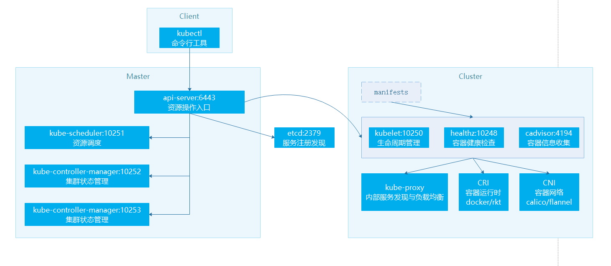

# Kubernetes 实践

https://blog.rj-bai.com/archives.html


## 概念总结


### 什么是Kubernetes

- 一个开源的 ==Docker 容器编排系统==
- 调度计算集群的节点，动态管理上面的作业
- 保证作业按用户期望的状态运行
- 使用「labels」和「pods」的概念 Kubernetes 将应用按逻辑单元进行分组，方便管理和服务发现。


- **pods：** 是一组紧密关联的容器集合，它们共享 IPC(进程间通信)、Network(网络) 和 UTS namespace(UTS 命名空间是 Linux 命名空间的一个子系统，主要作用是完成对容器 Hostname 和 Domain 的隔离，同时保存内核名称、版本、以及底层体系结构类型等信息)，是 Kubernetes 调度的基本单位。可以看成是一个docker-compose的部署，可以包含多个容器，各个容器间可以通过服务名代替ip地址访问。
- **labels：** 键值对(key/value)标签，可以被关联到如 Pod 这样的对象上，主要作用是给用户一个直观的感受，比如这个 Pod 是用来放置数据库的
- **GUI：** 用户图形界面，可以是 Web 用户界面，比如使用 `kubernetes-dashboard` 组件，用户可以通过 Dashboard 在 Kubernetes 集群中部署容器化的应用，可以查看集群中应用的运行情况，同时也能够基于 Dashboard 创建或修改部署、任务、服务等 Kubernetes 的资源。通过部署向导，用户能够对部署进行扩缩容，进行滚动更新、重启 Pod 和部署新应用。当然，通过 Dashboard 也能够查看 Kubernetes 资源的状态
- **kubectl：** 用于管理 Kubernetes 集群的命令行工具
- **Kubernetes Master：** Kubernetes 集群主节点，含有
  - kube-apiserver
    -  提供了资源操作的唯一入口，并提供认证、授权、访问控制、API 注册和发现等机制
  - kube-scheduler
  - kube-controller-manager
  - etcd
- **Kubernetes Node：** Kubernetes 集群子节点，含
  -  kubelet
  - kube-proxy
  - runtime
- **Image Registry：** 镜像仓库，比如：Ducker HUB 或 Docker 私服


### Kubernetes Master


- **kube-apiserver：** 提供了资源操作的唯一入口，并提供认证、授权、访问控制、API 注册和发现等机制
- **kube-scheduler：** 负责资源的调度，按照预定的调度策略将 Pod 调度到相应的机器上
- **kube-controller-manager：** 负责维护集群的状态，比如故障检测、自动扩展、滚动更新等
- **etcd：** CoreOS 基于 Raft 开发的分布式 key-value 存储，可用于服务发现、共享配置以及一致性保障（如数据库选主、分布式锁等），类似于zookeeper


### Kubernetes Node


- **runtime：** 负责镜像管理以及 Pod 和容器的真正运行（CRI，Container Runtime Interface），默认的容器运行时为 Docker，还支持 RKT 容器
- **kubelet：** 负责维持容器的生命周期，同时也负责 Volume（CVI，Container Volume Interface）和网络（CNI，Container Network Interface）的管理
- **kube-proxy：** 负责为 Service 提供 cluster 内部的服务发现和负载均衡


### 架构




## 高可用集群

- 负载均衡：能够实现轮询
- 集群：必须要实现数据同步
- 高可用：一直可以用，必须实现崩溃恢复
- 基数部署


在入门课程中我们部署的 Kubernetes 是 **集群模式**，但在实际生产中我们需要部署 **高可用集群** ，本章内容旨在指导大家如何部署 Kubernetes 高可用集群


### 统一环境配置（master，node都要统一）

#### 节点配置

| 主机名               | IP              | 角色                 | 系统                | CPU/内存 | 磁盘 |
| -------------------- | --------------- | -------------------- | ------------------- | -------- | ---- |
| kubernetes-master-01 | 192.168.119.142 | Master               | Ubuntu Server 18.04 | 2核2G    | 20G  |
| kubernetes-master-02 | 192.168.119.143 | Master               | Ubuntu Server 18.04 | 2核2G    | 20G  |
| kubernetes-master-03 | 192.168.119.144 | Master               | Ubuntu Server 18.04 | 2核2G    | 20G  |
| kubernetes-node-01   | 192.168.119.145 | Node                 | Ubuntu Server 18.04 | 2核4G    | 20G  |
| kubernetes-node-02   | 192.168.119.146 | Node                 | Ubuntu Server 18.04 | 2核4G    | 20G  |
| kubernetes-node-03   | 192.168.119.147 | Node                 | Ubuntu Server 18.04 | 2核4G    | 20G  |
| Kubernetes VIP       | 192.168.119.200 | 统一入口，keepAlived | -                   | -        | -    |

#### 对系统的配置

```bash
# 关闭交换空间
swapoff -a

#避免开机启动交换空间
# 注释 swap 开头的行
vi /etc/fstab

#关闭防火墙
ufw disable

# 配置DNS
# 取消 DNS 行注释，并增加 DNS 配置如：114.114.114.114，修改后重启下计算机
vi /etc/systemd/resolved.conf

# 安装Docker
# 更新软件源
sudo apt-get update
# 安装所需依赖
sudo apt-get -y install apt-transport-https ca-certificates curl software-properties-common
# 安装 GPG 证书
curl -fsSL http://mirrors.aliyun.com/docker-ce/linux/ubuntu/gpg | sudo apt-key add -
# 新增软件源信息
sudo add-apt-repository "deb [arch=amd64] http://mirrors.aliyun.com/docker-ce/linux/ubuntu $(lsb_release -cs) stable"
# 再次更新软件源
sudo apt-get -y update
# 安装 Docker CE 版
sudo apt-get -y install docker-ce

# 配置加速器
vi /etc/docker/daemon.json

{
  "registry-mirrors": [
    "https://xxxxxxx.com"
  ]
}

# 安装kubeadm，kubelet，kubectl
# 安装系统工具
apt-get update && apt-get install -y apt-transport-https

# 安装 GPG 证书
curl https://mirrors.aliyun.com/kubernetes/apt/doc/apt-key.gpg | apt-key add -

# 写入软件源；注意：我们用系统代号为 bionic，但目前阿里云不支持，所以沿用 16.04 的 xenial
cat << EOF >/etc/apt/sources.list.d/kubernetes.list
> deb https://mirrors.aliyun.com/kubernetes/apt/ kubernetes-xenial main
> EOF

# 安装
apt-get update && apt-get install -y kubelet kubeadm kubectl
```

##### 同步时间

- 设置时区

```bash
dpkg-reconfigure tzdata
```

- 选择亚洲 Asia
- 选择上海
- 时间同步

```bash
# 安装 ntpdate
apt-get install ntpdate

# 设置系统时间与网络时间同步（cn.pool.ntp.org 位于中国的公共 NTP 服务器）
ntpdate cn.pool.ntp.org

# 将系统时间写入硬件时间
hwclock --systohc
```

- 确认时间

```bash
date
# 输出自行对照与系统时间是否一致
```


#### 配置 IPVS（重启需再次运行）

```bash
# 安装系统工具
apt-get install -y ipset ipvsadm

# 配置并加载 IPVS 模块
mkdir -p /etc/sysconfig/modules/
vi /etc/sysconfig/modules/ipvs.modules

# 输入如下内容
#!/bin/bash
modprobe -- ip_vs
modprobe -- ip_vs_rr
modprobe -- ip_vs_wrr
modprobe -- ip_vs_sh
modprobe -- nf_conntrack_ipv4

# 执行脚本，注意：如果重启则需要重新运行该脚本
chmod 755 /etc/sysconfig/modules/ipvs.modules && bash /etc/sysconfig/modules/ipvs.modules && lsmod | grep -e ip_vs -e nf_conntrack_ipv4

# 执行脚本输出如下
ip_vs_sh               16384  0
ip_vs_wrr              16384  0
ip_vs_rr               16384  0
ip_vs                 147456  6 ip_vs_rr,ip_vs_sh,ip_vs_wrr
nf_conntrack_ipv4      16384  3
nf_defrag_ipv4         16384  1 nf_conntrack_ipv4
nf_conntrack          131072  8 xt_conntrack,nf_nat_masquerade_ipv4,nf_conntrack_ipv4,nf_nat,ipt_MASQUERADE,nf_nat_ipv4,nf_conntrack_netlink,ip_vs
libcrc32c              16384  4 nf_conntrack,nf_nat,raid456,ip_vs
```


#### 配置内核参数

```bash
# 配置参数
vi /etc/sysctl.d/k8s.conf

# 输入如下内容
net.bridge.bridge-nf-call-ip6tables = 1
net.bridge.bridge-nf-call-iptables = 1
net.ipv4.ip_nonlocal_bind = 1
net.ipv4.ip_forward = 1
vm.swappiness=0

# 应用参数
sysctl --system

# 应用参数输出如下（找到 Applying /etc/sysctl.d/k8s.conf 开头的日志）
* Applying /etc/sysctl.d/10-console-messages.conf ...
kernel.printk = 4 4 1 7
* Applying /etc/sysctl.d/10-ipv6-privacy.conf ...
* Applying /etc/sysctl.d/10-kernel-hardening.conf ...
kernel.kptr_restrict = 1
* Applying /etc/sysctl.d/10-link-restrictions.conf ...
fs.protected_hardlinks = 1
fs.protected_symlinks = 1
* Applying /etc/sysctl.d/10-lxd-inotify.conf ...
fs.inotify.max_user_instances = 1024
* Applying /etc/sysctl.d/10-magic-sysrq.conf ...
kernel.sysrq = 176
* Applying /etc/sysctl.d/10-network-security.conf ...
net.ipv4.conf.default.rp_filter = 1
net.ipv4.conf.all.rp_filter = 1
net.ipv4.tcp_syncookies = 1
* Applying /etc/sysctl.d/10-ptrace.conf ...
kernel.yama.ptrace_scope = 1
* Applying /etc/sysctl.d/10-zeropage.conf ...
vm.mmap_min_addr = 65536
* Applying /usr/lib/sysctl.d/50-default.conf ...
net.ipv4.conf.all.promote_secondaries = 1
net.core.default_qdisc = fq_codel
* Applying /etc/sysctl.d/99-sysctl.conf ...
* Applying /etc/sysctl.d/k8s.conf ...
net.bridge.bridge-nf-call-ip6tables = 1
net.bridge.bridge-nf-call-iptables = 1
net.ipv4.ip_nonlocal_bind = 1
net.ipv4.ip_forward = 1
vm.swappiness = 0
* Applying /etc/sysctl.conf ...
```


#### 修改cloud.cfg

```bash
vi /etc/cloud/cloud.cfg

# 该配置默认为 false，修改为 true 即可
preserve_hostname: true
```


#### 单独节点配置

- 注意：为 Master 和 Node 节点单独配置对应的 **IP** 和 **主机名**

##### 配置IP

- vi /etc/netplan/50-cloud-init.yaml

```yaml
network:
    ethernets:
        ens33:
          # 我的 Master 是 150 - 152，Node 是 160 - 162
          addresses: [192.168.141.150/24]
          gateway4: 192.168.141.2
          nameservers:
            addresses: [192.168.141.2]
    version: 2
```

使用 `netplan apply` 命令让配置生效

##### 配置主机名

```bash
# 修改主机名
hostnamectl set-hostname kubernetes-master-01
```

##### 配置hosts

```bash
# 配置 hosts
cat >> /etc/hosts << EOF
192.168.119.142 kubernetes-master-01
192.168.119.143 kubernetes-master-02
192.168.119.144 kubernetes-master-03
EOF
```


### 安装HAProxy + Keepalived

Kubernetes Master 节点运行组件如下：

- **kube-apiserver：** 提供了资源操作的唯一入口，并提供认证、授权、访问控制、API 注册和发现等机制
- **kube-scheduler：** 负责资源的调度，按照预定的调度策略将 Pod 调度到相应的机器上
- **kube-controller-manager：** 负责维护集群的状态，比如故障检测、自动扩展、滚动更新等
- **etcd：** CoreOS 基于 Raft 开发的分布式 key-value 存储，可用于服务发现、共享配置以及一致性保障（如数据库选主、分布式锁等）

`kube-scheduler` 和 `kube-controller-manager` 可以以集群模式运行，通过 leader 选举产生一个工作进程，其它进程处于阻塞模式。

**kube-apiserver 可以运行多个实例，但对其它组件需要提供统一的访问地址，本章节部署 Kubernetes 高可用集群实际就是利用 HAProxy + Keepalived 配置该组件**

配置的思路就是利用 HAProxy + Keepalived 实现 `kube-apiserver` 虚拟 IP 访问从而实现高可用和负载均衡，拆解如下：

- Keepalived 提供 `kube-apiserver` 对外服务的虚拟 IP（VIP）
- HAProxy 监听 Keepalived VIP
- 运行 Keepalived 和 HAProxy 的节点称为 LB（负载均衡） 节点
- Keepalived 是一主多备运行模式，故至少需要两个 LB 节点
- Keepalived 在运行过程中周期检查本机的 HAProxy 进程状态，如果检测到 HAProxy 进程异常，则触发重新选主的过程，VIP 将飘移到新选出来的主节点，从而实现 VIP 的高可用
- 所有组件（如 kubeclt、apiserver、controller-manager、scheduler 等）都通过 VIP +HAProxy 监听的 6444 端口访问 `kube-apiserver` 服务（**注意：kube-apiserver 默认端口为 6443，为了避免冲突我们将 HAProxy 端口设置为 6444，其它组件都是通过该端口统一请求 apiserver**）


#### 创建 HAProxy 启动脚本

- 在master01上先执行

```bash
mkdir -p /usr/local/kubernetes/lb
vi /usr/local/kubernetes/lb/start-haproxy.sh
```

- 脚本

```bash
# 输入内容如下
#!/bin/bash
# 修改为你自己的 Master 地址
MasterIP1=192.168.119.142
MasterIP2=192.168.119.143
MasterIP3=192.168.119.144
# 这是 kube-apiserver 默认端口，不用修改
MasterPort=6443

# 容器将 HAProxy 的 6444 端口暴露出去
docker run -d --restart=always --name HAProxy-K8S -p 6444:6444 \
        -e MasterIP1=$MasterIP1 \
        -e MasterIP2=$MasterIP2 \
        -e MasterIP3=$MasterIP3 \
        -e MasterPort=$MasterPort \
        wise2c/haproxy-k8s
```

- 设置权限

```bash
# 设置权限
chmod +x start-haproxy.sh
```


#### 创建 Keepalived 启动脚本

> 该步骤在 `kubernetes-master-01` 执行

```bash
mkdir -p /usr/local/kubernetes/lb
vi /usr/local/kubernetes/lb/start-keepalived.sh
```

- 脚本

```bash
# 输入内容如下
#!/bin/bash
# 修改为你自己的虚拟 IP 地址
VIRTUAL_IP=192.168.119.200
# 虚拟网卡设备名
INTERFACE=ens33
# 虚拟网卡的子网掩码
NETMASK_BIT=24
# HAProxy 暴露端口，内部指向 kube-apiserver 的 6443 端口
CHECK_PORT=6444
# 路由标识符
RID=10
# 虚拟路由标识符
VRID=160
# IPV4 多播地址，默认 224.0.0.18
MCAST_GROUP=224.0.0.18

docker run -itd --restart=always --name=Keepalived-K8S \
        --net=host --cap-add=NET_ADMIN \
        -e VIRTUAL_IP=$VIRTUAL_IP \
        -e INTERFACE=$INTERFACE \
        -e CHECK_PORT=$CHECK_PORT \
        -e RID=$RID \
        -e VRID=$VRID \
        -e NETMASK_BIT=$NETMASK_BIT \
        -e MCAST_GROUP=$MCAST_GROUP \
        wise2c/keepalived-k8s
```

- 设置权限

```bash
# 设置权限
chmod +x start-keepalived.sh
```


#### 复制脚本到其他master节点上

- 这里克隆了master01，生成了master02，master03

分别在 `kubernetes-master-02` 和 `kubernetes-master-03` 执行创建工作目录命令

```bash
mkdir -p /usr/local/kubernetes/lb
```

将 `kubernetes-master-01` 中的脚本拷贝至其它 Master

```bash
scp start-haproxy.sh start-keepalived.sh 192.168.119.143:/usr/local/kubernetes/lb
scp start-haproxy.sh start-keepalived.sh 192.168.119.144:/usr/local/kubernetes/lb
```


#### 执行脚本

分别在 3 个 Master 中启动容器（执行脚本）

```bash
sh /usr/local/kubernetes/lb/start-haproxy.sh && sh /usr/local/kubernetes/lb/start-keepalived.sh
```


#### 验证

- 查看容器

```bash
root@kubernetes-master-02:~# docker ps
CONTAINER ID        IMAGE                   COMMAND                  CREATED             STATUS                          PORTS                    NAMES
71cd063149f9        wise2c/keepalived-k8s   "/usr/bin/keepalived??   29 minutes ago      Restarting (1) 47 seconds ago                            Keepalived-K8S
1c8b21e84332        wise2c/haproxy-k8s      "/docker-entrypoint.??   32 minutes ago      Up 9 minutes                    0.0.0.0:6444->6444/tcp   HAProxy-K8S
```

- 查看绑定的虚拟ip
  - 可以看到虚拟ip的出现，当其他节点宕机时，ip进行了漂移

```bash
ip a | grep ens33

root@kubernetes-master-03:~# ip a | grep ens33
2: ens33: <BROADCAST,MULTICAST,UP,LOWER_UP> mtu 1500 qdisc fq_codel state UP group default qlen 1000
    inet 192.168.119.144/24 brd 192.168.119.255 scope global ens33
root@kubernetes-master-03:~# ip a | grep ens33
2: ens33: <BROADCAST,MULTICAST,UP,LOWER_UP> mtu 1500 qdisc fq_codel state UP group default qlen 1000
    inet 192.168.119.144/24 brd 192.168.119.255 scope global ens33
    inet 192.168.119.200/24 scope global secondary ens33
```


### 部署 Kubernetes 集群


#### 初始化master节点

- 创建工作目录并导出配置文件

```bash
# 创建工作目录
mkdir -p /usr/local/kubernetes/cluster

# 导出配置文件到工作目录
kubeadm config print init-defaults --kubeconfig ClusterConfiguration > kubeadm.yml
```

- 修改配置文件

```bash
root@kubernetes-master-01:/usr/local/kubernetes# vim kubeadm.yml 
```

```yaml
apiVersion: kubeadm.k8s.io/v1beta1
bootstrapTokens:
- groups:
  - system:bootstrappers:kubeadm:default-node-token
  token: abcdef.0123456789abcdef
  ttl: 24h0m0s
  usages:
  - signing
  - authentication
kind: InitConfiguration
localAPIEndpoint:
  # 修改为主节点 IP
  advertiseAddress: 192.168.119.142
  bindPort: 6443
nodeRegistration:
  criSocket: /var/run/dockershim.sock
  name: kubernetes-master
  taints:
  - effect: NoSchedule
    key: node-role.kubernetes.io/master
---
apiServer:
  timeoutForControlPlane: 4m0s
apiVersion: kubeadm.k8s.io/v1beta1
certificatesDir: /etc/kubernetes/pki
clusterName: kubernetes
# 配置 Keepalived 地址和 HAProxy 端口
controlPlaneEndpoint: "192.168.119.200:6444"
controllerManager: {}
dns:
  type: CoreDNS
etcd:
  local:
    dataDir: /var/lib/etcd
# 国内不能访问 Google，修改为阿里云
imageRepository: registry.aliyuncs.com/google_containers
kind: ClusterConfiguration
# 修改版本号
kubernetesVersion: v1.15.2
networking:
  dnsDomain: cluster.local
  # 配置成 Calico 的默认网段
  podSubnet: "192.168.0.0/16"
  serviceSubnet: 10.96.0.0/12
scheduler: {}
---
# 开启 IPVS 模式，比较快，默认是iptable，注意配置IPVS
apiVersion: kubeproxy.config.k8s.io/v1alpha1
kind: KubeProxyConfiguration
featureGates:
  SupportIPVSProxyMode: true
mode: ipvs
```

每个服务器启动后都要执行一下ipvs的配置

```bash
modprobe -- ip_vs
modprobe -- ip_vs_rr
modprobe -- ip_vs_wrr
modprobe -- ip_vs_sh
modprobe -- nf_conntrack_ipv4
```

- kubeadm 初始化

```bash
# kubeadm 初始化
kubeadm init --config=kubeadm.yml --experimental-upload-certs | tee kubeadm-init.log

# 输出
[addons] Applied essential addon: kube-proxy

Your Kubernetes control-plane has initialized successfully!

To start using your cluster, you need to run the following as a regular user:

  mkdir -p $HOME/.kube
  sudo cp -i /etc/kubernetes/admin.conf $HOME/.kube/config
  sudo chown $(id -u):$(id -g) $HOME/.kube/config

You should now deploy a pod network to the cluster.
Run "kubectl apply -f [podnetwork].yaml" with one of the options listed at:
  https://kubernetes.io/docs/concepts/cluster-administration/addons/

You can now join any number of the control-plane node running the following command on each as root:
# 添加master节点
  kubeadm join 192.168.119.200:6444 --token abcdef.0123456789abcdef \
    --discovery-token-ca-cert-hash sha256:0cd5c197b5c3b764d225e8d51e18900e6015b9b97b089733d17daac5f6d141c6 \
    --control-plane --certificate-key 59fe4f053a8cc12fc8e593c0dc16af1ae1a241de8d3e05a1fc1fa3b217b83595

Please note that the certificate-key gives access to cluster sensitive data, keep it secret!
As a safeguard, uploaded-certs will be deleted in two hours; If necessary, you can use 
"kubeadm init phase upload-certs --upload-certs" to reload certs afterward.

Then you can join any number of worker nodes by running the following on each as root:
# 添加node节点
kubeadm join 192.168.119.200:6444 --token abcdef.0123456789abcdef \
    --discovery-token-ca-cert-hash sha256:0cd5c197b5c3b764d225e8d51e18900e6015b9b97b089733d17daac5f6d141c6
```

- 配置 kubectl，否则会报错：Unable to connect to the server: x509

```bash
mkdir -p $HOME/.kube
cp -i /etc/kubernetes/admin.conf $HOME/.kube/config
chown $(id -u):$(id -g) $HOME/.kube/config
```

- 验证启动成功

```bash
root@kubernetes-master-01:/usr/local/kubernetes/cluster# kubectl get nodes
NAME                STATUS     ROLES    AGE     VERSION
kubernetes-master   NotReady   master   5m56s   v1.15.2
```

- 安装网络插件

```bash
# 安装 Calico
kubectl apply -f https://docs.projectcalico.org/v3.7/manifests/calico.yaml

# 验证安装是否成功
watch kubectl get pods --all-namespaces
```


#### 加入master节点

从 `kubeadm-init.log` 中获取命令，分别将 `kubernetes-master-02` 和 `kubernetes-master-03` 加入 Master

```bash
kubeadm join 192.168.119.200:6444 --token abcdef.0123456789abcdef \
    --discovery-token-ca-cert-hash sha256:0cd5c197b5c3b764d225e8d51e18900e6015b9b97b089733d17daac5f6d141c6 \
    --control-plane --certificate-key 59fe4f053a8cc12fc8e593c0dc16af1ae1a241de8d3e05a1fc1fa3b217b83595
```


#### 加入node节点

从 `kubeadm-init.log` 中获取命令，分别将 `kubernetes-node-01` 至 `kubernetes-node-03` 加入 Node

```bash
kubeadm join 192.168.119.200:6444 --token abcdef.0123456789abcdef \
    --discovery-token-ca-cert-hash sha256:0cd5c197b5c3b764d225e8d51e18900e6015b9b97b089733d17daac5f6d141c6
```


#### 验证集群状态

- 查看 Node

```bash
kubectl get nodes -o wide
```

- 查看 Pod

```bash
kubectl -n kube-system get pod -o wide
```

- 查看 Service

```bash
root@kubernetes-master-01:~# kubectl -n kube-system get svc
NAME       TYPE        CLUSTER-IP   EXTERNAL-IP   PORT(S)                  AGE
kube-dns   ClusterIP   10.96.0.10   <none>        53/UDP,53/TCP,9153/TCP   14m
```

- 验证 IPVS

查看 kube-proxy 日志，server_others.go:176] Using ipvs Proxier.

```bash
kubectl -n kube-system logs -f <kube-proxy 容器名>

# 容器名称通过 查看pod获取
root@kubernetes-master-01:~# kubectl -n kube-system logs -f kube-proxy-lbfjd
W0810 10:59:27.247181       1 feature_gate.go:208] Setting GA feature gate SupportIPVSProxyMode=true. It will be removed in a future release.
I0810 10:59:27.476853       1 server_others.go:170] Using ipvs Proxier.
W0810 10:59:27.481154       1 proxier.go:401] IPVS scheduler not specified, use rr by default
I0810 10:59:27.484560       1 server.go:534] Version: v1.15.2
```

- 查看代理规则

```bash
ipvsadm -ln
root@kubernetes-master-01:~# ipvsadm -ln
IP Virtual Server version 1.2.1 (size=4096)
Prot LocalAddress:Port Scheduler Flags
  -> RemoteAddress:Port           Forward Weight ActiveConn InActConn
TCP  10.96.0.1:443 rr
  -> 192.168.119.142:6443         Masq    1      5          0         
  -> 192.168.119.143:6443         Masq    1      0          0         
  -> 192.168.119.144:6443         Masq    1      0          0         
TCP  10.96.0.10:53 rr
  -> 192.168.237.1:53             Masq    1      0          0         
  -> 192.168.237.3:53             Masq    1      0          0         
TCP  10.96.0.10:9153 rr
  -> 192.168.237.1:9153           Masq    1      0          0         
  -> 192.168.237.3:9153           Masq    1      0          0         
UDP  10.96.0.10:53 rr
  -> 192.168.237.1:53             Masq    1      0          0         
  -> 192.168.237.3:53             Masq    1      0          0 
```

- 查看生效的配置

```bash
kubectl -n kube-system get cm kubeadm-config -oyaml
```

- 查看 etcd 集群

```bash
kubectl -n kube-system exec <etcd-kubernetes-master,通过pod的名称查询> -- etcdctl \
	--endpoints=https://192.168.119.142:2379 \
	--ca-file=/etc/kubernetes/pki/etcd/ca.crt \
	--cert-file=/etc/kubernetes/pki/etcd/server.crt \
	--key-file=/etc/kubernetes/pki/etcd/server.key cluster-health

# 输出如下
member ba74f1479d89e85 is healthy: got healthy result from https://192.168.119.142:2379
member 3a71b7b019967c4b is healthy: got healthy result from https://192.168.119.144:2379
member fd85f945466cdcf2 is healthy: got healthy result from https://192.168.119.143:2379
cluster is healthy
```


#### 验证高可用

- 注意：Keepalived 要求至少 2 个备用节点，故测试高可用至少需要 1 主 2 从模式验证，否则可能出现意想不到的问题

- 对任意一台 Master 机器执行关机操作

```bash
shutdown -h now
```

- 在任意一台 Master 节点上查看 Node 状态

```bash
kubectl get node

# 输出如下，除已关机那台状态为 NotReady 其余正常便表示成功
NAME                   STATUS   ROLES    AGE   VERSION
kubernetes-master-01   NotReady master   18m   v1.14.2
kubernetes-master-02   Ready    master   17m   v1.14.2
kubernetes-master-03   Ready    master   16m   v1.14.2
```

- 查看 VIP 漂移

```bash
ip a |grep ens33

# 输出如下
2: ens33: <BROADCAST,MULTICAST,UP,LOWER_UP> mtu 1500 qdisc fq_codel state UP group default qlen 1000
    inet 192.168.141.151/24 brd 192.168.141.255 scope global ens33
    inet 192.168.141.200/24 scope global secondary ens33
```


### 解决Node无法加入的问题

当我们使用 `kubeadm join` 命令将 Node 节点加入集群时，你会发现所有 `kubectl` 命令均不可用（呈现阻塞状态，并不会返回响应结果），我们可以在 Node 节点中通过 `kubeadm reset` 命令将 Node 节点下线，此时回到 Master 节点再使用 `watch kubectl get pods --all-namespaces` 可以看到下图中报错了，`coredns-xxx-xxx` 状态为 `CrashLoopBackOff`


#### 解决方案

从上面的错误信息不难看出应该是出现了网络问题，而我们在安装过程中只使用了一个网络插件 **Calico**，那么该错误是不是由 Calico 引起的呢？带着这个疑问我们去到 Calico 官网再看一下它的说明，官网地址：https://docs.projectcalico.org/v3.7/getting-started/kubernetes/

在它的 Quickstart 里有两段话（属于特别提醒），截图如下：


上面这段话的主要意思是：当 `kubeadm` 安装完成后不要关机，继续完成后续的安装步骤；这也说明了安装 Kubernetes 的过程不要出现中断一口气搞定（不过这不是重点）(*￣rǒ￣)


上面这段话的主要意思是：如果你的网络在 `192.168.0.0/16` 网段中，则必须选择一个不同的 Pod 网络；恰巧咱们的网络范围（我虚拟机的 IP 范围是 `192.168.141.0/24`）和该网段重叠 (ノへ￣、)；好吧，当时做单节点集群时因为没啥问题而忽略了 ♪(^∇^*)

so，能够遇到这个问题主要是因为虚拟机 IP 范围刚好和 Calico 默认网段重叠导致的，所以想要解决这个问题，咱们就需要修改 Calico 的网段了（当然也可以改虚拟机的），换句话说就是大家重装一下 o (一︿一 +) o

**按照以下标准步骤重装即可**


#### 重置 Kubernetes

```bash
kubeadm reset

# 输出如下
[reset] WARNING: Changes made to this host by 'kubeadm init' or 'kubeadm join' will be reverted.
[reset] Are you sure you want to proceed? [y/N]: y
[preflight] Running pre-flight checks
W0604 01:55:28.517280   22688 reset.go:234] [reset] No kubeadm config, using etcd pod spec to get data directory
[reset] No etcd config found. Assuming external etcd
[reset] Please manually reset etcd to prevent further issues
[reset] Stopping the kubelet service
[reset] unmounting mounted directories in "/var/lib/kubelet"
[reset] Deleting contents of stateful directories: [/var/lib/kubelet /etc/cni/net.d /var/lib/dockershim /var/run/kubernetes]
[reset] Deleting contents of config directories: [/etc/kubernetes/manifests /etc/kubernetes/pki]
[reset] Deleting files: [/etc/kubernetes/admin.conf /etc/kubernetes/kubelet.conf /etc/kubernetes/bootstrap-kubelet.conf /etc/kubernetes/controller-manager.conf /etc/kubernetes/scheduler.conf]

The reset process does not reset or clean up iptables rules or IPVS tables.
If you wish to reset iptables, you must do so manually.
For example:
iptables -F && iptables -t nat -F && iptables -t mangle -F && iptables -X

If your cluster was setup to utilize IPVS, run ipvsadm --clear (or similar)
to reset your system's IPVS tables.
```


#### 删除 kubectl 配置

```bash
rm -fr ~/.kube/
```


#### 启用 IPVS

```bash
modprobe -- ip_vs
modprobe -- ip_vs_rr
modprobe -- ip_vs_wrr
modprobe -- ip_vs_sh
modprobe -- nf_conntrack_ipv4
```


####  导出并修改配置文件

```bash
kubeadm config print init-defaults --kubeconfig ClusterConfiguration > kubeadm.yml
```

配置文件修改如下

```yaml
apiVersion: kubeadm.k8s.io/v1beta1
bootstrapTokens:
- groups:
  - system:bootstrappers:kubeadm:default-node-token
  token: abcdef.0123456789abcdef
  ttl: 24h0m0s
  usages:
  - signing
  - authentication
kind: InitConfiguration
localAPIEndpoint:
  advertiseAddress: 192.168.141.150
  bindPort: 6443
nodeRegistration:
  criSocket: /var/run/dockershim.sock
  name: kubernetes-master-01
  taints:
  - effect: NoSchedule
    key: node-role.kubernetes.io/master
---
apiServer:
  timeoutForControlPlane: 4m0s
apiVersion: kubeadm.k8s.io/v1beta1
certificatesDir: /etc/kubernetes/pki
clusterName: kubernetes
controlPlaneEndpoint: "192.168.141.200:6444"
controllerManager: {}
dns:
  type: CoreDNS
etcd:
  local:
    dataDir: /var/lib/etcd
imageRepository: registry.aliyuncs.com/google_containers
kind: ClusterConfiguration
kubernetesVersion: v1.14.2
networking:
  dnsDomain: cluster.local
  # 主要修改在这里，替换 Calico 网段为我们虚拟机不重叠的网段（这里用的是 Flannel 默认网段）
  podSubnet: "10.244.0.0/16"
  serviceSubnet: 10.96.0.0/12
scheduler: {}
---
apiVersion: kubeproxy.config.k8s.io/v1alpha1
kind: KubeProxyConfiguration
featureGates:
  SupportIPVSProxyMode: true
mode: ipvs
```

#### kubeadm 初始化

```bash
kubeadm init --config=kubeadm.yml --experimental-upload-certs | tee kubeadm-init.log

# 输出如下
[init] Using Kubernetes version: v1.14.2
[preflight] Running pre-flight checks
        [WARNING IsDockerSystemdCheck]: detected "cgroupfs" as the Docker cgroup driver. The recommended driver is "systemd". Please follow the guide at https://kubernetes.io/docs/setup/cri/
[preflight] Pulling images required for setting up a Kubernetes cluster
[preflight] This might take a minute or two, depending on the speed of your internet connection
[preflight] You can also perform this action in beforehand using 'kubeadm config images pull'
[kubelet-start] Writing kubelet environment file with flags to file "/var/lib/kubelet/kubeadm-flags.env"
[kubelet-start] Writing kubelet configuration to file "/var/lib/kubelet/config.yaml"
[kubelet-start] Activating the kubelet service
[certs] Using certificateDir folder "/etc/kubernetes/pki"
[certs] Generating "front-proxy-ca" certificate and key
[certs] Generating "front-proxy-client" certificate and key
[certs] Generating "etcd/ca" certificate and key
[certs] Generating "etcd/peer" certificate and key
[certs] etcd/peer serving cert is signed for DNS names [kubernetes-master-01 localhost] and IPs [192.168.141.150 127.0.0.1 ::1]
[certs] Generating "etcd/healthcheck-client" certificate and key
[certs] Generating "apiserver-etcd-client" certificate and key
[certs] Generating "etcd/server" certificate and key
[certs] etcd/server serving cert is signed for DNS names [kubernetes-master-01 localhost] and IPs [192.168.141.150 127.0.0.1 ::1]
[certs] Generating "ca" certificate and key
[certs] Generating "apiserver" certificate and key
[certs] apiserver serving cert is signed for DNS names [kubernetes-master-01 kubernetes kubernetes.default kubernetes.default.svc kubernetes.default.svc.cluster.local] and IPs [10.96.0.1 192.168.141.150 192.168.141.200]
[certs] Generating "apiserver-kubelet-client" certificate and key
[certs] Generating "sa" key and public key
[kubeconfig] Using kubeconfig folder "/etc/kubernetes"
[endpoint] WARNING: port specified in controlPlaneEndpoint overrides bindPort in the controlplane address
[kubeconfig] Writing "admin.conf" kubeconfig file
[endpoint] WARNING: port specified in controlPlaneEndpoint overrides bindPort in the controlplane address
[kubeconfig] Writing "kubelet.conf" kubeconfig file
[endpoint] WARNING: port specified in controlPlaneEndpoint overrides bindPort in the controlplane address
[kubeconfig] Writing "controller-manager.conf" kubeconfig file
[endpoint] WARNING: port specified in controlPlaneEndpoint overrides bindPort in the controlplane address
[kubeconfig] Writing "scheduler.conf" kubeconfig file
[control-plane] Using manifest folder "/etc/kubernetes/manifests"
[control-plane] Creating static Pod manifest for "kube-apiserver"
[control-plane] Creating static Pod manifest for "kube-controller-manager"
[control-plane] Creating static Pod manifest for "kube-scheduler"
[etcd] Creating static Pod manifest for local etcd in "/etc/kubernetes/manifests"
[wait-control-plane] Waiting for the kubelet to boot up the control plane as static Pods from directory "/etc/kubernetes/manifests". This can take up to 4m0s
[apiclient] All control plane components are healthy after 24.507568 seconds
[upload-config] storing the configuration used in ConfigMap "kubeadm-config" in the "kube-system" Namespace
[kubelet] Creating a ConfigMap "kubelet-config-1.14" in namespace kube-system with the configuration for the kubelets in the cluster
[upload-certs] Storing the certificates in ConfigMap "kubeadm-certs" in the "kube-system" Namespace
[upload-certs] Using certificate key:
a662b8364666f82c93cc5cd4fb4fabb623bbe9afdb182da353ac40f1752dfa4a
[mark-control-plane] Marking the node kubernetes-master-01 as control-plane by adding the label "node-role.kubernetes.io/master=''"
[mark-control-plane] Marking the node kubernetes-master-01 as control-plane by adding the taints [node-role.kubernetes.io/master:NoSchedule]
[bootstrap-token] Using token: abcdef.0123456789abcdef
[bootstrap-token] Configuring bootstrap tokens, cluster-info ConfigMap, RBAC Roles
[bootstrap-token] configured RBAC rules to allow Node Bootstrap tokens to post CSRs in order for nodes to get long term certificate credentials
[bootstrap-token] configured RBAC rules to allow the csrapprover controller automatically approve CSRs from a Node Bootstrap Token
[bootstrap-token] configured RBAC rules to allow certificate rotation for all node client certificates in the cluster
[bootstrap-token] creating the "cluster-info" ConfigMap in the "kube-public" namespace
[addons] Applied essential addon: CoreDNS
[endpoint] WARNING: port specified in controlPlaneEndpoint overrides bindPort in the controlplane address
[addons] Applied essential addon: kube-proxy

Your Kubernetes control-plane has initialized successfully!

To start using your cluster, you need to run the following as a regular user:

  mkdir -p $HOME/.kube
  sudo cp -i /etc/kubernetes/admin.conf $HOME/.kube/config
  sudo chown $(id -u):$(id -g) $HOME/.kube/config

You should now deploy a pod network to the cluster.
Run "kubectl apply -f [podnetwork].yaml" with one of the options listed at:
  https://kubernetes.io/docs/concepts/cluster-administration/addons/

You can now join any number of the control-plane node running the following command on each as root:

  kubeadm join 192.168.141.200:6444 --token abcdef.0123456789abcdef \
    --discovery-token-ca-cert-hash sha256:2ea8c138021fb1e184a24ed2a81c16c92f9f25c635c73918b1402df98f9c8aad \
    --experimental-control-plane --certificate-key a662b8364666f82c93cc5cd4fb4fabb623bbe9afdb182da353ac40f1752dfa4a

Please note that the certificate-key gives access to cluster sensitive data, keep it secret!
As a safeguard, uploaded-certs will be deleted in two hours; If necessary, you can use 
"kubeadm init phase upload-certs --experimental-upload-certs" to reload certs afterward.

Then you can join any number of worker nodes by running the following on each as root:

kubeadm join 192.168.141.200:6444 --token abcdef.0123456789abcdef \
    --discovery-token-ca-cert-hash sha256:2ea8c138021fb1e184a24ed2a81c16c92f9f25c635c73918b1402df98f9c8aad 
```


#### 配置 kubectl

```bash
# 配置 kubectl
mkdir -p $HOME/.kube
cp -i /etc/kubernetes/admin.conf $HOME/.kube/config
chown $(id -u):$(id -g) $HOME/.kube/config

# 验证是否成功
kubectl get node
```


#### 下载 Calico 配置文件并修改

```bash
wget https://docs.projectcalico.org/v3.7/manifests/calico.yaml

vi calico.yaml
```

修改第 611 行，将 `192.168.0.0/16` 修改为 `10.244.0.0/16`，可以通过如下命令快速查找

- 显示行号：`:set number`
- 查找字符：`/要查找的字符`，输入小写 `n` 下一个匹配项，输入大写 `N` 上一个匹配项


#### 安装 Calico

```bash
kubectl apply -f calico.yaml

# 输出如下
configmap/calico-config created
customresourcedefinition.apiextensions.k8s.io/felixconfigurations.crd.projectcalico.org created
customresourcedefinition.apiextensions.k8s.io/ipamblocks.crd.projectcalico.org created
customresourcedefinition.apiextensions.k8s.io/blockaffinities.crd.projectcalico.org created
customresourcedefinition.apiextensions.k8s.io/ipamhandles.crd.projectcalico.org created
customresourcedefinition.apiextensions.k8s.io/ipamconfigs.crd.projectcalico.org created
customresourcedefinition.apiextensions.k8s.io/bgppeers.crd.projectcalico.org created
customresourcedefinition.apiextensions.k8s.io/bgpconfigurations.crd.projectcalico.org created
customresourcedefinition.apiextensions.k8s.io/ippools.crd.projectcalico.org created
customresourcedefinition.apiextensions.k8s.io/hostendpoints.crd.projectcalico.org created
customresourcedefinition.apiextensions.k8s.io/clusterinformations.crd.projectcalico.org created
customresourcedefinition.apiextensions.k8s.io/globalnetworkpolicies.crd.projectcalico.org created
customresourcedefinition.apiextensions.k8s.io/globalnetworksets.crd.projectcalico.org created
customresourcedefinition.apiextensions.k8s.io/networkpolicies.crd.projectcalico.org created
customresourcedefinition.apiextensions.k8s.io/networksets.crd.projectcalico.org created
clusterrole.rbac.authorization.k8s.io/calico-kube-controllers created
clusterrolebinding.rbac.authorization.k8s.io/calico-kube-controllers created
clusterrole.rbac.authorization.k8s.io/calico-node created
clusterrolebinding.rbac.authorization.k8s.io/calico-node created
daemonset.extensions/calico-node created
serviceaccount/calico-node created
deployment.extensions/calico-kube-controllers created
serviceaccount/calico-kube-controllers created
```

#### 加入 master 节点

```bash
# 示例如下，别忘记两个备用节点都要加入哦
kubeadm join 192.168.141.200:6444 --token abcdef.0123456789abcdef \
    --discovery-token-ca-cert-hash sha256:2ea8c138021fb1e184a24ed2a81c16c92f9f25c635c73918b1402df98f9c8aad \
    --experimental-control-plane --certificate-key a662b8364666f82c93cc5cd4fb4fabb623bbe9afdb182da353ac40f1752dfa4a

# 输出如下
[preflight] Running pre-flight checks
        [WARNING IsDockerSystemdCheck]: detected "cgroupfs" as the Docker cgroup driver. The recommended driver is "systemd". Please follow the guide at https://kubernetes.io/docs/setup/cri/
[preflight] Reading configuration from the cluster...
[preflight] FYI: You can look at this config file with 'kubectl -n kube-system get cm kubeadm-config -oyaml'
[preflight] Running pre-flight checks before initializing the new control plane instance
[preflight] Pulling images required for setting up a Kubernetes cluster
[preflight] This might take a minute or two, depending on the speed of your internet connection
[preflight] You can also perform this action in beforehand using 'kubeadm config images pull'
[download-certs] Downloading the certificates in Secret "kubeadm-certs" in the "kube-system" Namespace
[certs] Using certificateDir folder "/etc/kubernetes/pki"
[certs] Generating "apiserver" certificate and key
[certs] apiserver serving cert is signed for DNS names [kubernetes-master-02 kubernetes kubernetes.default kubernetes.default.svc kubernetes.default.svc.cluster.local] and IPs [10.96.0.1 192.168.141.151 192.168.141.200]
[certs] Generating "apiserver-kubelet-client" certificate and key
[certs] Generating "front-proxy-client" certificate and key
[certs] Generating "etcd/server" certificate and key
[certs] etcd/server serving cert is signed for DNS names [kubernetes-master-02 localhost] and IPs [192.168.141.151 127.0.0.1 ::1]
[certs] Generating "etcd/peer" certificate and key
[certs] etcd/peer serving cert is signed for DNS names [kubernetes-master-02 localhost] and IPs [192.168.141.151 127.0.0.1 ::1]
[certs] Generating "etcd/healthcheck-client" certificate and key
[certs] Generating "apiserver-etcd-client" certificate and key
[certs] Valid certificates and keys now exist in "/etc/kubernetes/pki"
[certs] Using the existing "sa" key
[kubeconfig] Generating kubeconfig files
[kubeconfig] Using kubeconfig folder "/etc/kubernetes"
[endpoint] WARNING: port specified in controlPlaneEndpoint overrides bindPort in the controlplane address
[kubeconfig] Writing "admin.conf" kubeconfig file
[kubeconfig] Writing "controller-manager.conf" kubeconfig file
[kubeconfig] Writing "scheduler.conf" kubeconfig file
[control-plane] Using manifest folder "/etc/kubernetes/manifests"
[control-plane] Creating static Pod manifest for "kube-apiserver"
[control-plane] Creating static Pod manifest for "kube-controller-manager"
[control-plane] Creating static Pod manifest for "kube-scheduler"
[check-etcd] Checking that the etcd cluster is healthy
[kubelet-start] Downloading configuration for the kubelet from the "kubelet-config-1.14" ConfigMap in the kube-system namespace
[kubelet-start] Writing kubelet configuration to file "/var/lib/kubelet/config.yaml"
[kubelet-start] Writing kubelet environment file with flags to file "/var/lib/kubelet/kubeadm-flags.env"
[kubelet-start] Activating the kubelet service
[kubelet-start] Waiting for the kubelet to perform the TLS Bootstrap...
[etcd] Announced new etcd member joining to the existing etcd cluster
[etcd] Wrote Static Pod manifest for a local etcd member to "/etc/kubernetes/manifests/etcd.yaml"
[etcd] Waiting for the new etcd member to join the cluster. This can take up to 40s
[upload-config] storing the configuration used in ConfigMap "kubeadm-config" in the "kube-system" Namespace
[mark-control-plane] Marking the node kubernetes-master-02 as control-plane by adding the label "node-role.kubernetes.io/master=''"
[mark-control-plane] Marking the node kubernetes-master-02 as control-plane by adding the taints [node-role.kubernetes.io/master:NoSchedule]

This node has joined the cluster and a new control plane instance was created:

* Certificate signing request was sent to apiserver and approval was received.
* The Kubelet was informed of the new secure connection details.
* Control plane (master) label and taint were applied to the new node.
* The Kubernetes control plane instances scaled up.
* A new etcd member was added to the local/stacked etcd cluster.

To start administering your cluster from this node, you need to run the following as a regular user:

        mkdir -p $HOME/.kube
        sudo cp -i /etc/kubernetes/admin.conf $HOME/.kube/config
        sudo chown $(id -u):$(id -g) $HOME/.kube/config

Run 'kubectl get nodes' to see this node join the cluster.
```

#### 加入node节点

```bash
# 示例如下
kubeadm join 192.168.141.200:6444 --token abcdef.0123456789abcdef \
    --discovery-token-ca-cert-hash sha256:2ea8c138021fb1e184a24ed2a81c16c92f9f25c635c73918b1402df98f9c8aad

# 输出如下
>     --discovery-token-ca-cert-hash sha256:2ea8c138021fb1e184a24ed2a81c16c92f9f25c635c73918b1402df98f9c8aad 
[preflight] Running pre-flight checks
        [WARNING IsDockerSystemdCheck]: detected "cgroupfs" as the Docker cgroup driver. The recommended driver is "systemd". Please follow the guide at https://kubernetes.io/docs/setup/cri/
[preflight] Reading configuration from the cluster...
[preflight] FYI: You can look at this config file with 'kubectl -n kube-system get cm kubeadm-config -oyaml'
[kubelet-start] Downloading configuration for the kubelet from the "kubelet-config-1.14" ConfigMap in the kube-system namespace
[kubelet-start] Writing kubelet configuration to file "/var/lib/kubelet/config.yaml"
[kubelet-start] Writing kubelet environment file with flags to file "/var/lib/kubelet/kubeadm-flags.env"
[kubelet-start] Activating the kubelet service
[kubelet-start] Waiting for the kubelet to perform the TLS Bootstrap...

This node has joined the cluster:
* Certificate signing request was sent to apiserver and a response was received.
* The Kubelet was informed of the new secure connection details.

Run 'kubectl get nodes' on the control-plane to see this node join the cluster.
```

#### 验证

```bash
kubectl get node

# 输出如下，我们可以看到 Node 节点已经成功上线 ━━(￣ー￣*|||━━
NAME                   STATUS   ROLES    AGE     VERSION
kubernetes-master-01   Ready    master   19m     v1.14.2
kubernetes-master-02   Ready    master   4m46s   v1.14.2
kubernetes-master-03   Ready    master   3m23s   v1.14.2
kubernetes-node-01     Ready    <none>   74s     v1.14.2
```

```bash
watch kubectl get pods --all-namespaces
```


## 通过资源配置运行容器

- 启动顺序
  - Pod
  - Deployment 提供内部访问
  - Service 外部访问机制


通过 `run` 命令启动容器非常麻烦，Docker 提供了 Compose 为我们解决了这个问题。那 Kubernetes 是如何解决这个问题的呢？其实很简单，使用 `kubectl create` 命令就可以做到和 Compose 一样的效果了，该命令可以通过配置文件快速创建一个集群资源对象


### 创建yml配置文件

以部署 Nginx 为例


#### 部署 Deployment

创建一个名为 `nginx-deployment.yml` 的配置文件

- 再master节点上创建一个文件夹，使用vim进行编辑，如果格式粘贴有问题，使用:set paste

```yaml
# API 版本号
apiVersion: extensions/v1beta1 # 该版本不支持service
# 类型，如：Pod/ReplicationController/Deployment/Service/Ingress
kind: Deployment
# 元数据
metadata:
  # Kind 的名称
  name: nginx-app
spec:
  # 部署的实例数量
  replicas: 2
  template:
    metadata:
      labels:
        # 容器标签的名字，发布 Service 时，selector 需要和这里对应
        name: nginx
    spec:
      # 配置容器，数组类型，说明可以配置多个容器
      containers:
      # 容器名称
      - name: nginx
        # 容器镜像
        image: nginx
        # 暴露端口
        ports:
        # Pod 端口
        - containerPort: 80
```

- 执行

```bash
root@kubernetes-master-01:/usr/local/kubernetes/yml# kubectl create -f nginx-deployment.yml 
deployment.extensions/nginx-app created
```

- 验证

```bash
root@kubernetes-master-01:/usr/local/kubernetes/yml# kubectl get deployment
NAME        READY   UP-TO-DATE   AVAILABLE   AGE
nginx-app   2/2     2            2           21s
root@kubernetes-master-01:/usr/local/kubernetes/yml# kubectl get pod
NAME                        READY   STATUS    RESTARTS   AGE
nginx-app-995fc88bd-fq4n4   1/1     Running   0          24s
nginx-app-995fc88bd-fxqkc   1/1     Running   0          24s
```

- 删除

```bash
kubectl delete -f nginx-deployment.yml
```


#### 发布 Service

- 提供外部访问的方式

- 创建一个名为 `nginx-service.yml` 的配置文件

```bash
# API 版本号
apiVersion: v1 # 该版本不支持Deployment
# 类型，如：Pod/ReplicationController/Deployment/Service/Ingress
kind: Service
# 元数据
metadata:
  # Kind 的名称
  name: nginx-http
spec:
  # 暴露端口
  ports:
    ## Service 暴露的端口
    - port: 80
      ## Pod 上的端口，这里是将 Service 暴露的端口转发到 Pod 端口上
      targetPort: 80
      # nodePort:80 指定外部访问的接口
  # 类型
  type: LoadBalancer
  # 标签选择器，和Deployment中的Label对应
  selector:
    # 需要和上面部署的 Deployment 标签名对应
    name: nginx
```

- 部署

```bash
root@kubernetes-master-01:/usr/local/kubernetes/yml# kubectl create -f nginx-service.yml 
service/nginx-http created
```

- 删除

```bash
kubectl delete -f nginx-service.yml
```


##### 关于访问端口

- 配置targetPort：80 后，会随机一个端口与该80口进行映射
- 如果需要指定外部访问接口，那么需要增加配置 nodePort：80

```bash
root@kubernetes-master-01:/usr/local/kubernetes/yml# kubectl create -f nginx-service.yml 
The Service "nginx-http" is invalid: spec.ports[0].nodePort: Invalid value: 80: provided port is not in the valid range. The range of valid ports is 30000-32767
```

- 需要==修改默认的端口范围==


#### 验证

- 查看pod

```bash
kubectl get pods

# 输出如下
NAME                         READY   STATUS    RESTARTS   AGE
nginx-app-64bb598779-2pplx   1/1     Running   0          25m
nginx-app-64bb598779-824lc   1/1     Running   0          25m
```
-  查看Deployment 

```bash
kubectl get deployment

# 输出如下
NAME        READY   UP-TO-DATE   AVAILABLE   AGE
nginx-app   2/2     2            2           25m
```

- 查看service

```bash
root@kubernetes-master-01:/usr/local/kubernetes/yml# kubectl get service
NAME         TYPE           CLUSTER-IP      EXTERNAL-IP   PORT(S)        AGE
kubernetes   ClusterIP      10.96.0.1       <none>        443/TCP        101m
nginx-http   LoadBalancer   10.102.159.95   <pending>     80:32429/TCP   45s
```
- 查看Service详情

```bash
root@kubernetes-master-01:/usr/local/kubernetes/yml# kubectl describe service nginx-http
Name:                     nginx-http
Namespace:                default
Labels:                   <none>
Annotations:              <none>
Selector:                 name=nginx
Type:                     LoadBalancer
IP:                       10.102.159.95
Port:                     <unset>  80/TCP
TargetPort:               80/TCP
NodePort:                 <unset>  32429/TCP
Endpoints:                192.168.17.1:80,192.168.8.129:80
Session Affinity:         None
External Traffic Policy:  Cluster
Events:                   <none>
```

- 访问：http://192.168.119.142|143|144|145|146:32429/
  - type: LoadBalancer 模式，所有的服务器暴露相同的端口


### 集成环境部署

也可以不区分配置文件，一次性部署 Deployment 和 Service，创建一个名为 `nginx.yml` 的配置文件，配置内容如下：

```yaml
apiVersion: extensions/v1beta1
kind: Deployment
metadata:
  name: nginx-app
spec:
  replicas: 2
  template:
    metadata:
      labels:
        name: nginx
    spec:
      containers:
      - name: nginx
        image: nginx
        ports:
        - containerPort: 80
---
apiVersion: v1
kind: Service
metadata:
  name: nginx-http
spec:
  ports:
    - port: 80
      targetPort: 80
      # 可以指定 NodePort 端口，默认范围是：30000-32767
      # nodePort: 30080
  type: LoadBalancer
  selector:
    name: nginx
```

```bash
# 部署
kubectl create -f nginx.yml

# 删除
kubectl delete -f nginx.yml
```


### 修改默认的端口范围

Kubernetes 服务的 NodePort 默认端口范围是 30000-32767，在某些场合下，这个限制不太适用，我们可以自定义它的端口范围，操作步骤如下：

编辑 `vi /etc/kubernetes/manifests/kube-apiserver.yaml` 配置文件，增加配置 `--service-node-port-range=2-65535`

```yaml
apiVersion: v1
kind: Pod
metadata:
  creationTimestamp: null
  labels:
    component: kube-apiserver
    tier: control-plane
  name: kube-apiserver
  namespace: kube-system
spec:
  containers:
  - command:
    - kube-apiserver
    # 在这里增加配置即可
    - --service-node-port-range=2-65535
    - --advertise-address=192.168.141.150
    - --allow-privileged=true
    - --authorization-mode=Node,RBAC
    - --client-ca-file=/etc/kubernetes/pki/ca.crt
    - --enable-admission-plugins=NodeRestriction
    - --enable-bootstrap-token-auth=true
    - --etcd-cafile=/etc/kubernetes/pki/etcd/ca.crt
    - --etcd-certfile=/etc/kubernetes/pki/apiserver-etcd-client.crt
// 以下配置省略...
```

使用 `docker ps` 命令找到 `kube-apiserver` 容器，再使用 `docker restart <ApiServer 容器 ID>` 即可生效。


## Ingress 统一访问入口


### 术语

- **节点：** Kubernetes 集群中的服务器
- **集群：** Kubernetes 管理的一组服务器集合
- **边界路由器：** 为局域网和 Internet 路由数据包的路由器，执行防火墙保护局域网络
- **集群网络：** 遵循 Kubernetes 网络模型实现集群内的通信的具体实现，比如 Flannel 和 Calico
- **服务：** Kubernetes 的服务 (Service) 是使用标签选择器标识的一组 Pod Service (Deployment)。 **除非另有说明，否则服务的虚拟 IP 仅可在集群内部访问**


### 内部访问式ClusterIP

ClusterIP 服务是 Kubernetes 的默认服务。它给你一个集群内的服务，集群内的其它应用都可以访问该服务。集群外部无法访问它。在某些场景下我们可以使用 Kubernetes 的 Proxy 模式来访问服务，比如调试服务时。


### 三种外部访问方式

#### NodePort

NodePort 服务是引导外部流量到你的服务的最原始方式。NodePort，正如这个名字所示，**在所有节点（虚拟机）上开放一个特定端口**，任何发送到该端口的流量都被转发到对应服务。

NodePort 服务特征如下：

- 每个端口只能是一种服务
- 端口范围只能是 30000-32767（可调）
- 不在 YAML 配置文件中指定则会分配一个默认端口

> **建议：** 不要在生产环境中使用这种方式暴露服务，大多数时候我们应该让 Kubernetes 来选择端口


#### LoadBalancer

LoadBalancer 服务是暴露服务到 Internet 的标准方式。所有通往你指定的端口的流量都会被转发到对应的服务。它没有过滤条件，没有路由等。这意味着你几乎可以发送任何种类的流量到该服务，像 HTTP，TCP，UDP，WebSocket，gRPC 或其它任意种类


​	

#### Ingress (推荐)

Ingress 事实上不是一种服务类型。相反，它处于多个服务的前端，扮演着 “智能路由” 或者集群入口的角色。你可以用 Ingress 来做许多不同的事情，各种不同类型的 Ingress 控制器也有不同的能力。它允许你基于路径或者子域名来路由流量到后端服务。作用类似于网关

Ingress 可能是暴露服务的最强大方式，但同时也是最复杂的。Ingress 控制器有各种类型，包括 Google Cloud Load Balancer， Nginx，Contour，Istio，等等。它还有各种插件，比如 cert-manager (它可以为你的服务自动提供 SSL 证书)/

如果你想要使用同一个 IP 暴露多个服务，这些服务都是使用相同的七层协议（典型如 HTTP），你还可以获取各种开箱即用的特性（比如 SSL、认证、路由等等）


### 使用 Nginx Ingress Controller

通常情况下，Service 和 Pod 的 IP 仅可在集群内部访问。集群外部的请求需要通过负载均衡转发到 Service 在 Node 上暴露的 NodePort 上，然后再由 kube-proxy 通过边缘路由器 (edge router) 将其转发给相关的 Pod 或者丢弃。而 Ingress 就是为进入集群的请求提供路由规则的集合

Ingress 可以给 Service 提供集群外部访问的 URL、负载均衡、SSL 终止、HTTP 路由等。为了配置这些 Ingress 规则，集群管理员需要部署一个 Ingress Controller，它监听 Ingress 和 Service 的变化，并根据规则配置负载均衡并提供访问入口。


本次实践的主要目的就是将入口统一，不再通过 LoadBalancer 等方式将端口暴露出来，而是使用 Ingress 提供的反向代理负载均衡功能作为我们的唯一入口。通过以下步骤操作仔细体会。

> **注意：** 下面包含资源配置的步骤都是自行创建 YAML 配置文件通过 `kubectl create -f <YAML>` 和 `kubectl delete -f <YAML>` 部署和删除


#### 部署tomcat

部署 Tomcat 但仅允许在内网访问，我们要通过 Ingress 提供的反向代理功能路由到 Tomcat 之上

- 下面的配置文件是deployment+service的yaml的集合配置

```yml
root@kubernetes-master-01:/usr/local/kubernetes/yml# vi tomcat.yml

# 输入如下内容
apiVersion: extensions/v1beta1
kind: Deployment
metadata:
  name: tomcat-app
spec:
  replicas: 2
  template:
    metadata:
      labels:
        name: tomcat
    spec:
      containers:
      - name: tomcat
        image: tomcat
        ports:
        - containerPort: 8080 # 容器暴露的端口
---
apiVersion: v1
kind: Service
metadata:
  name: tomcat-http
spec:
  ports:
    - port: 8080 # serivce暴露的端口
      targetPort: 8080
  # ClusterIP, NodePort, LoadBalancer
  type: ClusterIP # 表示只在k8s内网中访问
  selector:
    name: tomcat
```

- 部署

```bash
root@kubernetes-master-01:/usr/local/kubernetes/yml# kubectl create -f tomcat.yml 
deployment.extensions/tomcat-app created
service/tomcat-http created
```

- 检测

```bash
root@kubernetes-master-02:/usr/local/kubernetes/lb# kubectl get pods
root@kubernetes-master-02:/usr/local/kubernetes/lb# kubectl get deployment
root@kubernetes-master-02:/usr/local/kubernetes/lb# kubectl get service
root@kubernetes-master-01:/usr/local/kubernetes/yml# watch kubectl get pods
```

- 验证

```bash
root@kubernetes-master-01:/usr/local/kubernetes/yml# kubectl get service
NAME          TYPE        CLUSTER-IP      EXTERNAL-IP   PORT(S)    AGE
kubernetes    ClusterIP   10.96.0.1       <none>        443/TCP    16h
tomcat-http   ClusterIP   10.104.156.91   <none>        8080/TCP   11m

root@kubernetes-master-01:/usr/local/kubernetes/yml# kubectl describe service tomcat-http
Name:              tomcat-http
Namespace:         default
Labels:            <none>
Annotations:       <none>
Selector:          name=tomcat
Type:              ClusterIP
IP:                10.104.156.91
Port:              <unset>  8080/TCP
TargetPort:        8080/TCP
Endpoints:         192.168.17.3:8080,192.168.8.130:8080 
Session Affinity:  None
Events:            <none>
```


#### 安装 Nginx Ingress Controller

Ingress Controller 有许多种，我们选择最熟悉的 Nginx 来处理请求，其它可以参考 [官方文档](https://kubernetes.io/docs/concepts/services-networking/ingress-controllers/)

- 下载 Nginx Ingress Controller 配置文件

```bash
root@kubernetes-master-01:/usr/local/kubernetes/yml# wget https://raw.githubusercontent.com/kubernetes/ingress-nginx/master/deploy/static/mandatory.yaml
```

- 修改配置文件，找到配置如下位置 (搜索 `serviceAccountName`) 在下面增加一句 `hostNetwork: true`

```yaml
apiVersion: apps/v1
kind: Deployment
metadata:
  name: nginx-ingress-controller
  namespace: ingress-nginx
  labels:
    app.kubernetes.io/name: ingress-nginx
    app.kubernetes.io/part-of: ingress-nginx
spec:
  # 可以部署多个实例
  replicas: 1
  selector:
    matchLabels:
      app.kubernetes.io/name: ingress-nginx
      app.kubernetes.io/part-of: ingress-nginx
  template:
    metadata:
      labels:
        app.kubernetes.io/name: ingress-nginx
        app.kubernetes.io/part-of: ingress-nginx
      annotations:
        prometheus.io/port: "10254"
        prometheus.io/scrape: "true"
    spec:
      serviceAccountName: nginx-ingress-serviceaccount
      # 增加 hostNetwork: true，意思是开启主机网络模式，暴露 Nginx 服务端口 80
      hostNetwork: true
      containers:
        - name: nginx-ingress-controller
          image: quay.io/kubernetes-ingress-controller/nginx-ingress-controller:0.24.1
          args:
            - /nginx-ingress-controller
            - --configmap=$(POD_NAMESPACE)/nginx-configuration
            - --tcp-services-configmap=$(POD_NAMESPACE)/tcp-services
            - --udp-services-configmap=$(POD_NAMESPACE)/udp-services
            - --publish-service=$(POD_NAMESPACE)/ingress-nginx
// 以下代码省略...
```

- 部署

```bash
root@kubernetes-master-01:/usr/local/kubernetes/yml# kubectl create -f mandatory.yaml 
```

- 验证

```bash
root@kubernetes-master-01:/usr/local/kubernetes/yml# kubectl get pods --all-namespaces
NAMESPACE       NAME                                           READY   STATUS             RESTARTS   AGE
ingress-nginx   nginx-ingress-controller-7f4b7d7b5f-kwfbk      0/1     ImagePullBackOff   0          96s
```

- 注意：镜像下载很慢 quay.io/kubernetes-ingress-controller/nginx-ingress-controller:0.25.0
  - 因此需要提前docker pull 一下


### 安装 Ingress 定义Http

Ingress 翻译过来是入口的意思，说白了就是个 API 网关（想想之前学的 Zuul 和 Spring Cloud Gateway）

- 创建文件

```bash
root@kubernetes-master-01:/usr/local/kubernetes/yml# vim ingress.yml
```

- 脚本

```yaml
apiVersion: networking.k8s.io/v1beta1
kind: Ingress
metadata:
  name: nginx-web
  annotations: # 配置nignx
    # 指定 Ingress Controller 的类型
    kubernetes.io/ingress.class: "nginx"
    # 指定我们的 rules 的 path 可以使用正则表达式
    nginx.ingress.kubernetes.io/use-regex: "true"
    # 连接超时时间，默认为 5s
    nginx.ingress.kubernetes.io/proxy-connect-timeout: "600"
    # 后端服务器回转数据超时时间，默认为 60s
    nginx.ingress.kubernetes.io/proxy-send-timeout: "600"
    # 后端服务器响应超时时间，默认为 60s
    nginx.ingress.kubernetes.io/proxy-read-timeout: "600"
    # 客户端上传文件，最大大小，默认为 20m
    nginx.ingress.kubernetes.io/proxy-body-size: "10m"
    # URL 重写
    nginx.ingress.kubernetes.io/rewrite-target: /
spec:
  # 路由规则
  rules:
  # 主机名，只能是域名，修改为你自己的，不能填写ip
  - host: k8s.test.com
    http:
      paths:
      - path: # 默认不写是 /
        backend:
          # 后台部署的 Service Name，与上面部署的 Tomcat 对应
          serviceName: tomcat-http
          # 后台部署的 Service Port，与上面部署的 Tomcat 对应
          servicePort: 8080
```

- 部署

```bash
root@kubernetes-master-01:/usr/local/kubernetes/yml# kubectl create -f ingress.yml 
ingress.networking.k8s.io/nginx-web created
```

- 查看 

```bash
root@kubernetes-master-01:/usr/local/kubernetes/yml# kubectl get ingress
NAME        HOSTS          ADDRESS   PORTS   AGE
nginx-web   k8s.test.com             80      36s
```


### 验证

#### 查看 Tomcat

```bash
kubectl get deployment
# 输出如下
NAME         READY   UP-TO-DATE   AVAILABLE   AGE
tomcat-app   2/2     2            2           88m
```

```bash
kubectl get service
# 输出如下
NAME          TYPE        CLUSTER-IP      EXTERNAL-IP   PORT(S)    AGE
kubernetes    ClusterIP   10.96.0.1       <none>        443/TCP    2d5h
tomcat-http   ClusterIP   10.97.222.179   <none>        8080/TCP   89m # 此时8080可以访问
```

#### 查看 Nginx Ingress Controller

- 查找ingress controller部署在哪个node上

```bash
# 注意下面的 IP 地址，就是我们实际访问地址
root@kubernetes-master-01:/usr/local/kubernetes/yml# kubectl get pods -n ingress-nginx -o wide
NAME                                        READY   STATUS    RESTARTS   AGE     IP                NODE                NOMINATED NODE   READINESS GATES
nginx-ingress-controller-7f4b7d7b5f-24lfq   1/1     Running   0          3m46s   192.168.119.146   kubernetes-slave2   <none>           <none>
```

#### 查看 Ingress

```bash
kubectl get ingress
# 输出如下
NAME        HOSTS          ADDRESS   PORTS   AGE
nginx-web   k8s.test.com             80      61m
```

#### 测试访问

成功代理到 Tomcat 即表示成功

```bash
# 不设置 Hosts 的方式请求地址，下面的 IP 和 Host 均在上面有配置
curl -v http://192.168.119.146 -H 'host: k8s.test.com'
```

配置hosts ，然后可以直接访问