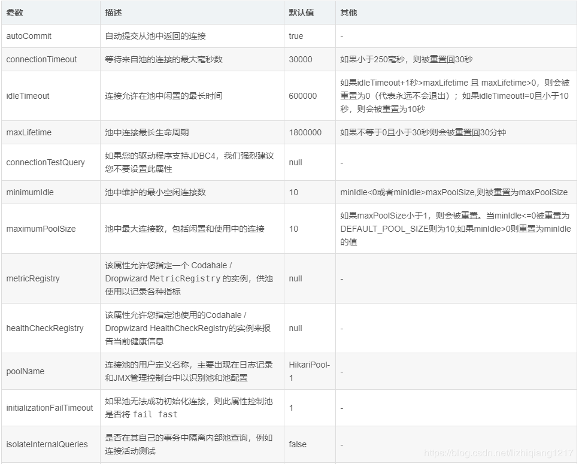
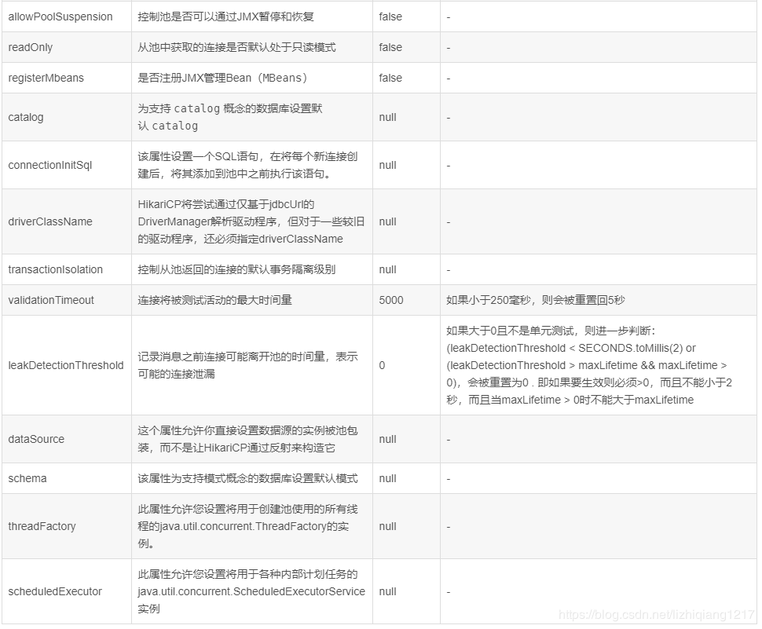

# 介绍

Hikari是一款非常强大，高效，并且号称“史上最快连接池”。并且在springboot2.0之后，采用的默认数据库连接池就是Hikari。不需要引入依赖，已经在SpringBoot中包含了。
 GitHub地址：https://github.com/brettwooldridge/HikariCP

```yml
# 数据库配置
spring:
  datasource:
  type: com.zaxxer.hikari.HikariDataSource
  driverClassName: com.mysql.jdbc.Driver
  url: jdbc:mysql://localhost:3306/ssm?useUnicode=true&characterEncoding=utf-8&useSSL=false
  username: root
  password: root
  # Hikari 连接池配置
  # 最小空闲连接数量
  hikari:
    minimum-idle: 5
    # 空闲连接存活最大时间，默认600000（10分钟）
    idle-timeout: 180000
    # 连接池最大连接数，默认是10
    maximum-pool-size: 10
    # 此属性控制从池返回的连接的默认自动提交行为,默认值：true
    auto-commit: true
    # 连接池名称
    pool-name: MyHikariCP
    # 此属性控制池中连接的最长生命周期，值0表示无限生命周期，默认1800000即30分钟
    max-lifetime: 1800000
    # 数据库连接超时时间,默认30秒，即30000
    connection-timeout: 30000
    connection-test-query: SELECT 1
```






# 注意

- 注意mysql连接器的版本

```yml
spring:
  datasource:
    url: jdbc:mysql://localhost:3306/user_center
    hikari:
      username: root
      password: 123456
      # connect的版本6.x 以上 com.mysql.cj.jdbc.Driver
      # 版本5.x 以下 com.mysql.jdbc.Driver
      driver-class-name: com.mysql.cj.jdbc.Driver
```

- 即使是高版本，写com.mysql.jdbc.Driver 也是会继承com.mysql.cj.jdbc.Driver，不过会有错误提示

```java
package com.mysql.jdbc;

import java.sql.SQLException;

public class Driver extends com.mysql.cj.jdbc.Driver {
    public Driver() throws SQLException {
    }

    static {
        System.err.println("Loading class `com.mysql.jdbc.Driver'. This is deprecated. The new driver class is `com.mysql.cj.jdbc.Driver'. The driver is automatically registered via the SPI and manual loading of the driver class is generally unnecessary.");
    }
}

```

