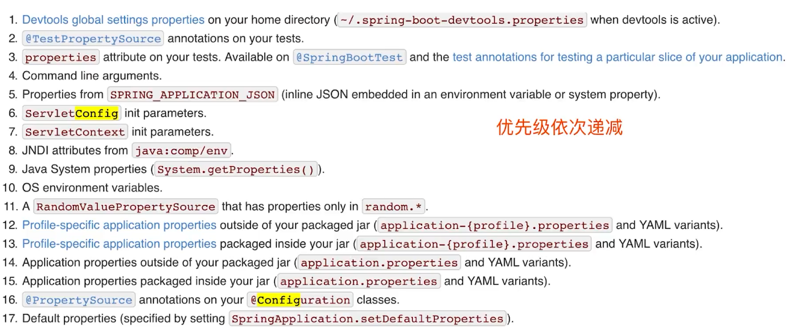
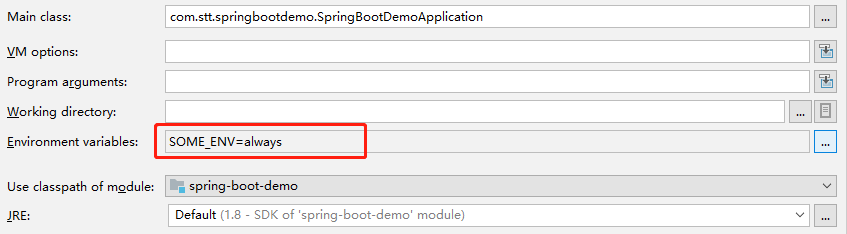

# 配置方式



- 配置文件
- 环境变量
  - 比配置文件优先级高
- 外部配置文件
  - 比jar包内部配置文件的优先级高
- 命令行参数
  - 如--server.port=8081可替换配置文件内部参数


## 环境变量

- 在yml文件中配置环境变量

```yml
management:
  endpoint:
    health:
      show-details: ${SOME_ENV}
  endpoints:
    web:
      exposure:
        include: '*'
#        include: metrics, health


info:
  app-name: spring-boot-demo
  author: stt
  email: work_stt@123.com
```

- 在启动时，可以在idea中进行配置



- 如果使用命令行启动，使用--指定变量名=变量值

```bash
java -jar xxx.jar --SOME_ENV=always
```


# 实践

- 让配置管理尽量简单


# profile

- 不同的环境使用不同的配置

```properties
management:
  endpoint:
    health:
      show-details: ${SOME_ENV}
  endpoints:
    web:
      exposure:
        include: '*'
#        include: metrics, health
spring:
  profiles:
    active: prod # 当前使用的环境

info:
  app-name: spring-boot-demo
  author: stt
  email: work_stt@123.com

# 连字符
---
spring:
  profiles: dev
  
---
spring:
  profiles: prod
server:
  tomcat:
    max-threads: 300
    max-connections: 1000
  port: 8989

```

- 可以使用不同的命名，如application-dev.yml，表示不同的环境的配置