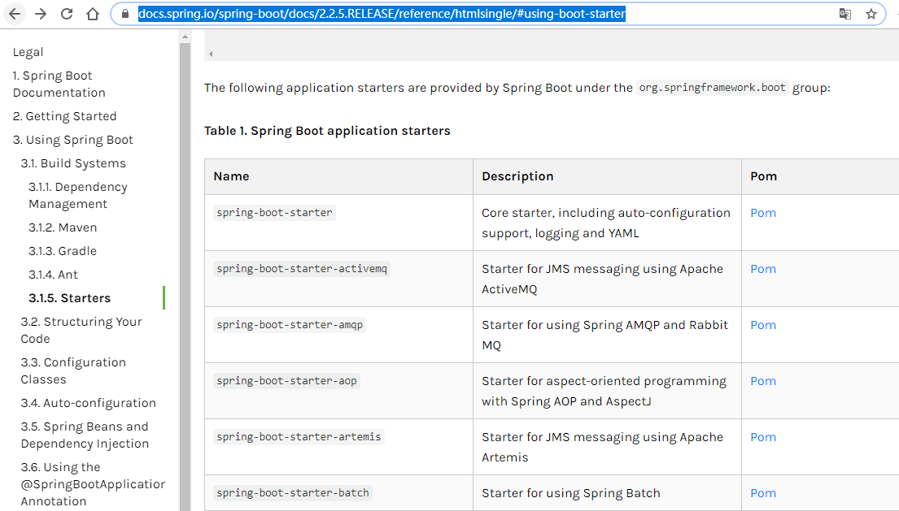
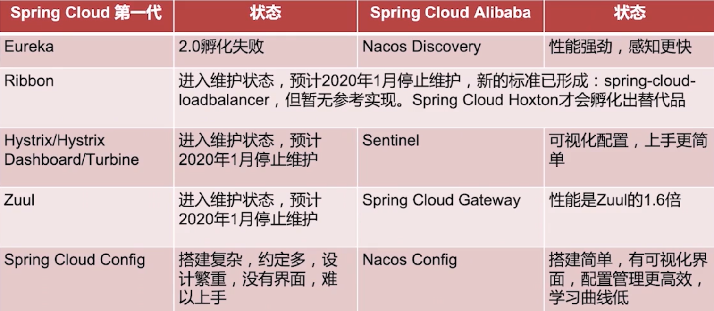
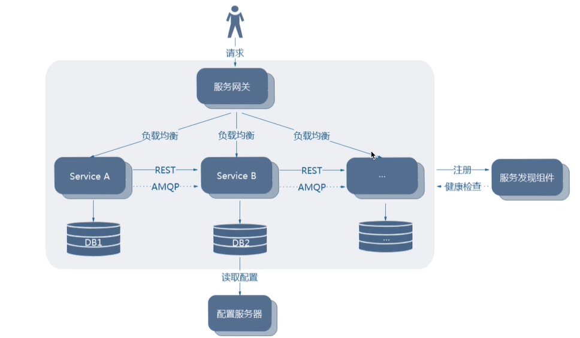
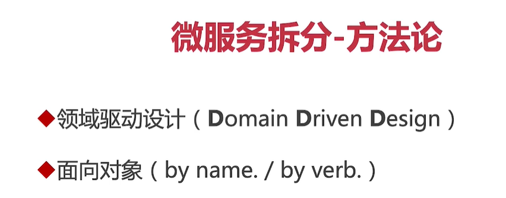
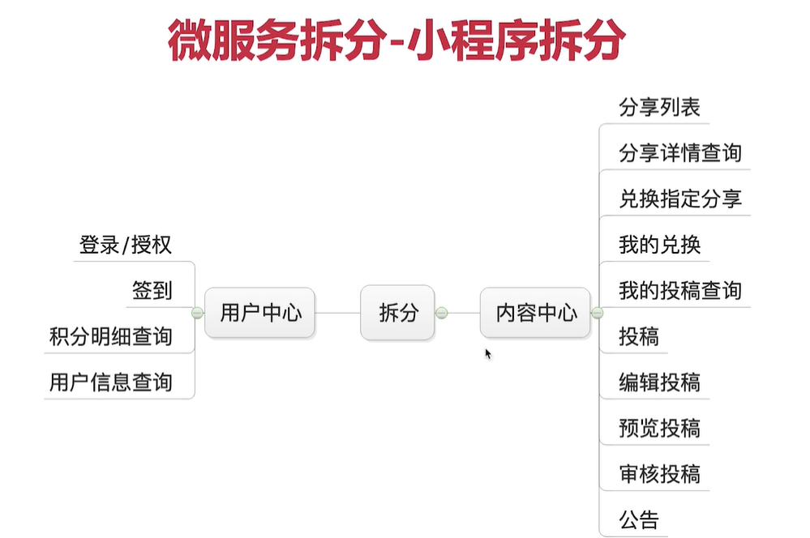
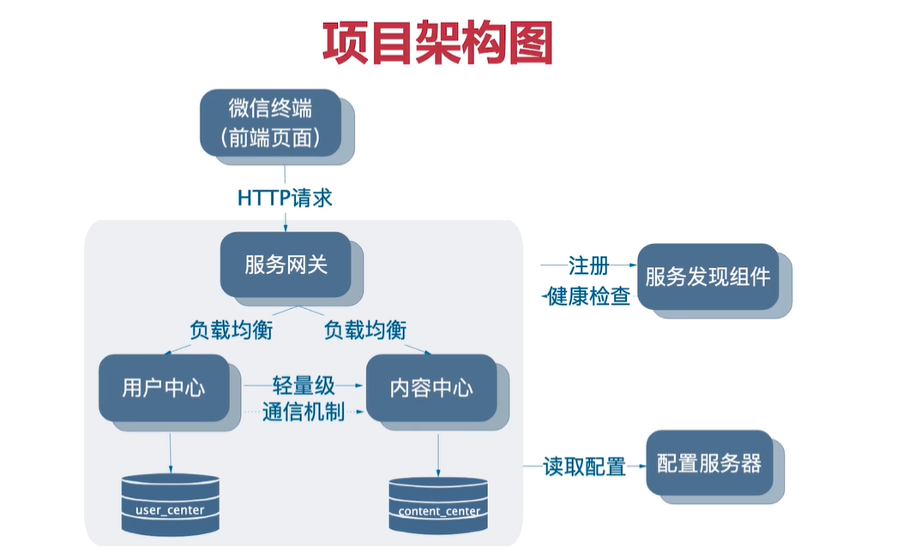
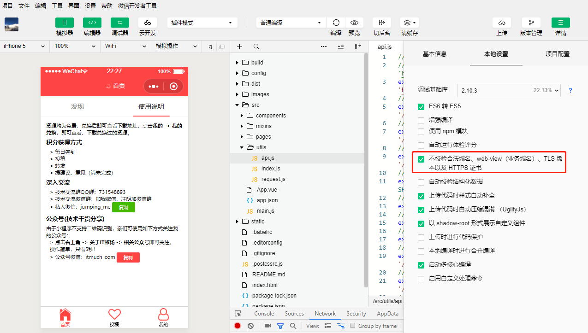
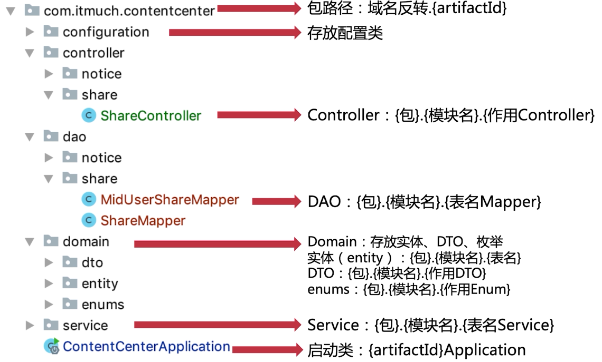
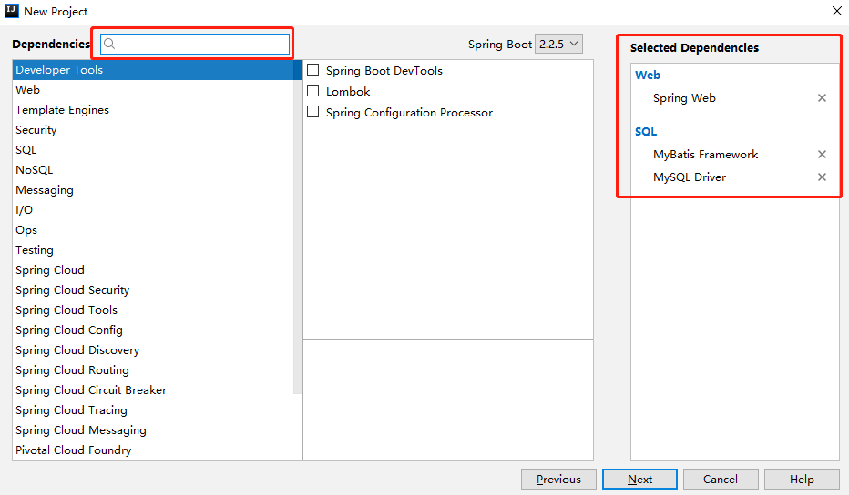
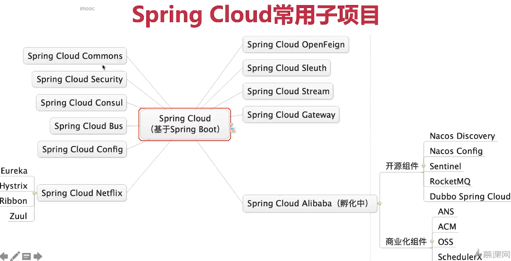

# springboot文档

- 查看spring-boot支持的starter




# 介绍




- 微服务全景架构图




  







# api文档

https://t.itmuch.com/doc.html


# 小程序注册账号

https://mp.weixin.qq.com

立即注册

重点：开发设置，开发者ID

wx6797dbdc8e87ed7c

761ed8c352e1279bdd4b8bfe53842e5d

# 小程序代码

https://github.com/eacdy/itmuch-miniapp

```bash
# 加速：
npm --registry https://registry.npm.taobao.org install
# 安装项目相关依赖
npm install


# 开发环境启动部署
npm run dev

# 生产环境构建
npm run build

# 其他，可参考：http://mpvue.com/build/
```


下载开发工具

https://developers.weixin.qq.com/miniprogram/dev/devtools/download.html


修改配置project.config.json

```json
"appid": "wx6797dbdc8e87ed7c",
"projectname": "stt-project",
```

修改访问地址 src/utils/api.js

```json
export const BASE_API_URL = 'http://localhost:8080';
```


注意勾选，否则开发环境不能运行




# 博客资料

http://www.itmuch.com/


# 工程结构规划




# 创建项目

- 在此处输入想要的jar包名称导入




# 关于通用mapper

https://github.com/abel533/Mapper

与springboot集成

https://github.com/abel533/Mapper/wiki/1.3-spring-boot


# 关于spring Cloud版本控制

- Angel
- Brixton
- Canden
- Dalston
- Edgware
- Finchley
- Greenwich 当前版本
- Hotxon 还未正式发布


SR

- Service Release
- bug修改


SR1

- 第一个bug修复


RELEASE

- 版本的第一个正式版


Greenwich RELEASE ：第一个正式版本 -->Greenwich SR1 ：第一个bug修复版本



