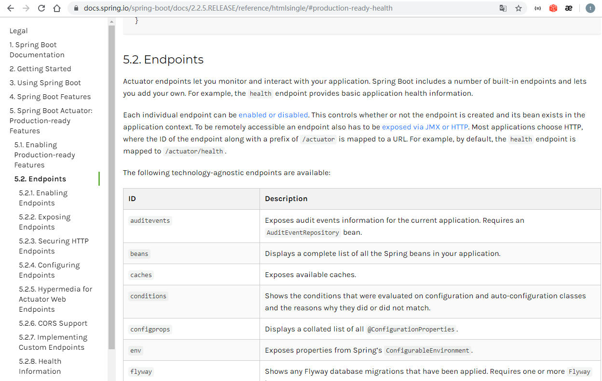

# 介绍

- 是什么？
  - 提供监控能力
  - actuaotr是spring boot项目中非常强大的一个功能，有助于对应用程序进行监控和管理，通过restful api请求来监管、审计、收集应用的运行情况，针对微服务而言它是必不可少的一个环节。
- 如何整合？
  - 添加依赖

```xml
<dependency>
    <groupId>org.springframework.boot</groupId>
    <artifactId>spring-boot-starter-actuator</artifactId>
</dependency>
```

- 启动时日志多出的信息

```bash
o.s.b.a.e.web.EndpointLinksResolver : Exposing 2 endpoint(s) beneath base path '/actuator'
```

- 访问actuator节点信息
  - 列出可以访问的所有端点

```json
// http://localhost:8080/actuator

{
  "_links": {
    "self": {
      "href": "http://localhost:8080/actuator",
      "templated": false
    },
    "health": { // 健康检查
      "href": "http://localhost:8080/actuator/health", 
      "templated": false
    },
    "health-path": {
      "href": "http://localhost:8080/actuator/health/{*path}",
      "templated": true
    },
    "info": {
      "href": "http://localhost:8080/actuator/info",
      "templated": false
    }
  }
}

// http://localhost:8080/actuator/health

{
  "status": "UP"
}
```


## Endpoints 端点信息

actuator的核心部分，它用来监视应用程序及交互，spring-boot-actuator中已经内置了非常多的Endpoints（health、info、beans、httptrace、shutdown）等等，同时也允许我们自己扩展自己的端点

spring boot 2.0中的端点和之前版本有较大不同，使用时需要注意。另外端点的监控机制也有很大不同，启用了不代表可以直接访问，还需要将其暴露出来，传统的management.security管理已被标记为不推荐

内置Endpoints

| id               | desc                                                         | Sensitive |
| ---------------- | ------------------------------------------------------------ | --------- |
| `auditevents`    | 显示当前应用程序的审计事件信息                               | Yes       |
| `beans`          | 显示应用Spring Beans的完整列表                               | Yes       |
| `caches`         | 显示可用缓存信息                                             | Yes       |
| `conditions`     | 显示自动装配类的状态及及应用信息                             | Yes       |
| `configprops`    | 显示所有 @ConfigurationProperties 列表                       | Yes       |
| `env`            | 显示 ConfigurableEnvironment 中的属性                        | Yes       |
| `flyway`         | 显示 Flyway 数据库迁移信息                                   | Yes       |
| `health`         | 显示应用的健康信息（未认证只显示`status`，认证显示全部信息详情） | No        |
| `info`           | 显示任意的应用信息（在资源文件写info.xxx即可）               | No        |
| `liquibase`      | 展示Liquibase 数据库迁移                                     | Yes       |
| `metrics`        | 展示当前应用的 metrics 信息                                  | Yes       |
| `mappings`       | 显示所有 @RequestMapping 路径集列表                          | Yes       |
| `scheduledtasks` | 显示应用程序中的计划任务                                     | Yes       |
| `sessions`       | 允许从Spring会话支持的会话存储中检索和删除用户会话。         | Yes       |
| `shutdown`       | 允许应用以优雅的方式关闭（默认情况下不启用）                 | Yes       |
| `threaddump`     | 执行一个线程dump                                             | Yes       |
| `httptrace`      | 显示HTTP跟踪信息（默认显示最后100个HTTP请求 - 响应交换）     | Yes       |





## actuator/health

- 添加配置，在properties中添加
- actuator都是以management开头配置

```properties
management.endpoint.health.show-details=always
```

- 此时再访问

```json
// http://localhost:8080/actuator/health

{
  "status": "UP",
  "components": {
    "diskSpace": { // 磁盘资源
      "status": "UP",
      "details": {
        "total": 392732565504, // 磁盘总大小
        "free": 242280890368, // 表示空闲的磁盘大小
        "threshold": 10485760 // 磁盘的空间如果低于此值，说明服务不健康
      }
    },
    "ping": {
      "status": "UP"
    }
  }
}
```

- status的取值
  - UP 表示正常
  - DOWN 表示遇到了问题，不正常
  - OUT_OF_SERVICE 资源未在使用，或不该使用
  - UNKNOWN 未知


## actuator/info

- 可以显示自定义服务信息

```properties
info.name = test
info.appid = 2222
```

- 访问

```json
// http://localhost:8080/actuator/info

{
  "name": "test",
  "appid": "2222"
}
```


# HealthIndicators

下列是依赖spring-boot-xxx-starter后相关HealthIndicator的实现（通过management.health.defaults.enabled属性可以禁用他们），但想要获取一些额外的信息时，自定义的作用就体现出来了

| 名称                           | 备注                                |
| ------------------------------ | ----------------------------------- |
| `CassandraHealthIndicator`     | 检查 `Cassandra` 数据库是否启动。   |
| `DiskSpaceHealthIndicator`     | 检查磁盘空间不足。                  |
| `DataSourceHealthIndicator`    | 检查是否可以获得连接 `DataSource`。 |
| `ElasticsearchHealthIndicator` | 检查 `Elasticsearch` 集群是否启动。 |
| `InfluxDbHealthIndicator`      | 检查 `InfluxDB` 服务器是否启动。    |
| `JmsHealthIndicator`           | 检查 `JMS` 代理是否启动。           |
| `MailHealthIndicator`          | 检查邮件服务器是否启动。            |
| `MongoHealthIndicator`         | 检查 `Mongo` 数据库是否启动。       |
| `Neo4jHealthIndicator`         | 检查 `Neo4j` 服务器是否启动。       |
| `RabbitHealthIndicator`        | 检查 `Rabbit` 服务器是否启动。      |
| `RedisHealthIndicator`         | 检查 `Redis` 服务器是否启动。       |
| `SolrHealthIndicator`          | 检查 `Solr` 服务器是否已启动。      |


## 自定义HealthIndicator

实现HealthIndicator接口，根据自己的需要判断返回的状态是UP还是DOWN，功能简单

```java
package com.stt.springbootdemo;

import org.springframework.boot.actuate.health.Health;
import org.springframework.boot.actuate.health.HealthIndicator;
import org.springframework.stereotype.Component;

@Component("myHealth")
public class MyHealthIndicator implements HealthIndicator {
	@Override
	public Health health() {

		int code = 0;
		if(code != 0){
			return Health.down().withDetail("code",code).withDetail("version",1.9).build();
		}

		return Health.up().withDetail("code",code).withDetail("version",1.2).build();
	}
}

```

- 访问

```json
// http://localhost:8080/actuator/health

{
  "status": "UP",
  "components": {
    "diskSpace": {
      "status": "UP",
      "details": {
        "total": 392732565504,
        "free": 242227019776,
        "threshold": 10485760
      }
    },
    "myHealth": {
      "status": "UP",
      "details": {
        "code": 0,
        "version": 1.2
      }
    },
    "ping": {
      "status": "UP"
    }
  }
}
```

- 或者

```json
// http://localhost:8080/actuator/health/myHealth

{
  "status": "UP",
  "details": {
    "code": 0,
    "version": 1.2
  }
}
```


# 激活所有监控信息

- 默认激活health 和 info信息，修改为*后可以监控所有信息

```properties
management.endpoints.web.exposure.include= *
```

- 访问

```json
// 20200311145223
// http://localhost:8080/actuator

{
  "_links": {
    "self": {
      "href": "http://localhost:8080/actuator",
      "templated": false
    },
    "beans": {
      "href": "http://localhost:8080/actuator/beans",
      "templated": false
    },
    "caches-cache": {
      "href": "http://localhost:8080/actuator/caches/{cache}",
      "templated": true
    },
    "caches": {
      "href": "http://localhost:8080/actuator/caches",
      "templated": false
    },
    "health-path": {
      "href": "http://localhost:8080/actuator/health/{*path}",
      "templated": true
    },
    "health": {
      "href": "http://localhost:8080/actuator/health",
      "templated": false
    },
    "info": {
      "href": "http://localhost:8080/actuator/info",
      "templated": false
    },
    "conditions": {
      "href": "http://localhost:8080/actuator/conditions",
      "templated": false
    },
    "configprops": { // 配置明细
      "href": "http://localhost:8080/actuator/configprops",
      "templated": false
    },
    "env": {
      "href": "http://localhost:8080/actuator/env",
      "templated": false
    },
    "env-toMatch": {
      "href": "http://localhost:8080/actuator/env/{toMatch}",
      "templated": true
    },
    "loggers": {
      "href": "http://localhost:8080/actuator/loggers",
      "templated": false
    },
    "loggers-name": {
      "href": "http://localhost:8080/actuator/loggers/{name}",
      "templated": true
    },
    "heapdump": {
      "href": "http://localhost:8080/actuator/heapdump",
      "templated": false
    },
    "threaddump": {
      "href": "http://localhost:8080/actuator/threaddump",
      "templated": false
    },
    "metrics": { // 指标明细
      "href": "http://localhost:8080/actuator/metrics",
      "templated": false
    },
    "metrics-requiredMetricName": {
      "href": "http://localhost:8080/actuator/metrics/{requiredMetricName}",
      "templated": true
    },
    "scheduledtasks": {
      "href": "http://localhost:8080/actuator/scheduledtasks",
      "templated": false
    },
    "mappings": {
      "href": "http://localhost:8080/actuator/mappings",
      "templated": false
    }
  }
}
```

- 如果访问部分信息

```properties
management.endpoints.web.exposure.include=health, info, metrics
```


# 关于metrics指标

- 显示所有可以查看的指标

```json
// 20200311145456
// http://localhost:8080/actuator/metrics

{
  "names": [
    "jvm.memory.max",
    "jvm.threads.states",
    "jvm.gc.memory.promoted",
    "jvm.memory.used",
    "jvm.gc.max.data.size",
    "jvm.memory.committed",
    "system.cpu.count",
    "logback.events",
    "jvm.buffer.memory.used",
    "tomcat.sessions.created",
    "jvm.threads.daemon",
    "system.cpu.usage",
    "jvm.gc.memory.allocated",
    "tomcat.sessions.expired",
    "jvm.threads.live",
    "jvm.threads.peak",
    "process.uptime",
    "tomcat.sessions.rejected",
    "process.cpu.usage",
    "http.server.requests",
    "jvm.classes.loaded",
    "jvm.gc.pause",
    "jvm.classes.unloaded",
    "tomcat.sessions.active.current",
    "tomcat.sessions.alive.max",
    "jvm.gc.live.data.size",
    "jvm.buffer.count",
    "jvm.buffer.total.capacity",
    "tomcat.sessions.active.max",
    "process.start.time"
  ]
}
```

- 查看jvm.threads.states

```json
// http://localhost:8080/actuator/metrics/jvm.threads.states

{
  "name": "jvm.threads.states",
  "description": "The current number of threads having TERMINATED state",
  "baseUnit": "threads",
  "measurements": [
    {
      "statistic": "VALUE",
      "value": 26.0
    }
  ],
  "availableTags": [
    {
      "tag": "state",
      "values": [
        "timed-waiting",
        "new",
        "runnable",
        "blocked",
        "waiting",
        "terminated"
      ]
    }
  ]
}
```

