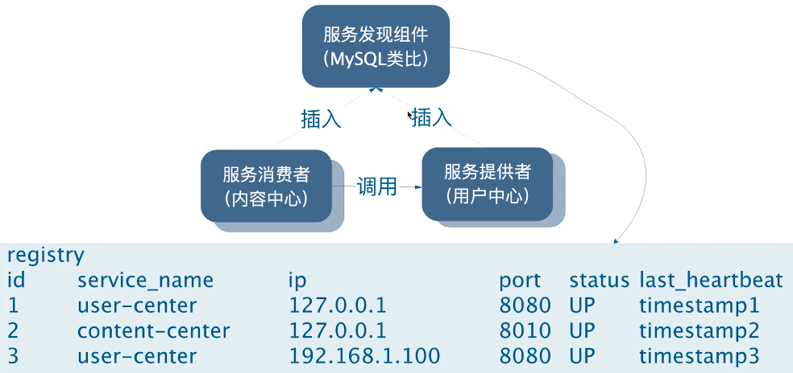
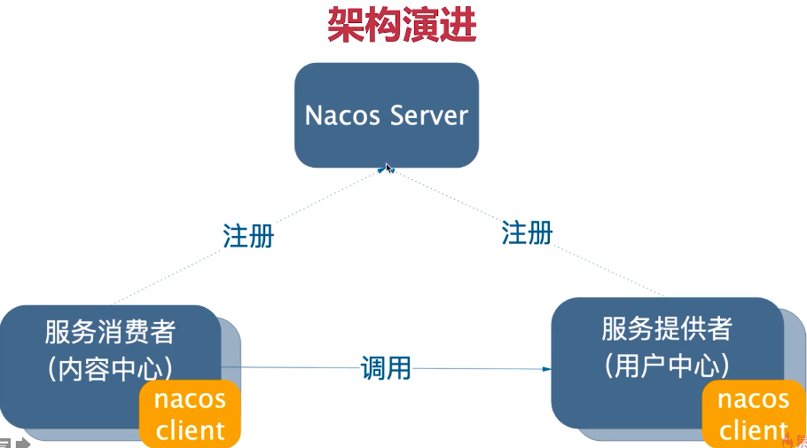
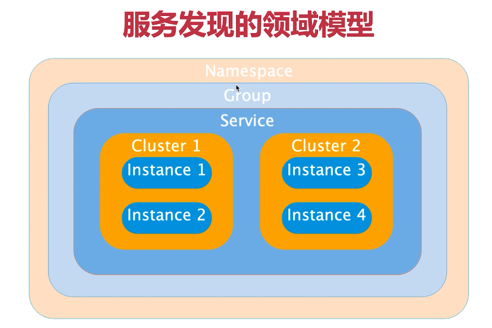
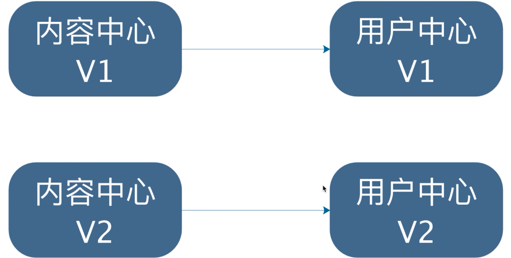
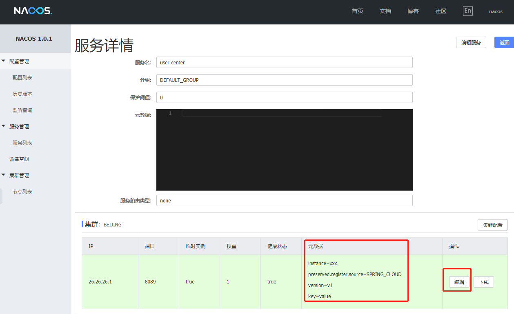

# 介绍

- 服务发现机制
  - 定时发送心跳
  - 存储所有服务的ip
  - 指定服务的名称
  - 服务的状态如果没有心跳则从up到down
  - 服务消费者从本地存储的映射名称和ip访问服务提供者
  - 服务消费者定时从服务发现组件获取最新的服务映射存储在本地缓存







# Nacos Server 下载

https://github.com/alibaba/nacos/releases

- 通过pom文件中的nacos-client的版本下载对应的nacos-server的版本

- pom

```xml
<properties>
    <java.version>1.8</java.version>
    <spring-cloud.version>Greenwich.SR1</spring-cloud.version>
    <spring-cloud-alibaba.version>0.9.0.RELEASE</spring-cloud-alibaba.version>
</properties>

<!--整合springCloud-->
<dependencyManagement>
    <dependencies>
        <dependency>
            <groupId>org.springframework.cloud</groupId>
            <artifactId>spring-cloud-dependencies</artifactId>
            <version>${spring-cloud.version}</version>
            <type>pom</type>
            <scope>import</scope>
        </dependency>
        <dependency>
            <groupId>org.springframework.cloud</groupId>
            <artifactId>spring-cloud-alibaba-dependencies</artifactId>
            <version>${spring-cloud-alibaba.version}</version>
            <type>pom</type>
            <scope>import</scope>
        </dependency>
    </dependencies>
</dependencyManagement>
```

- nacos-client

```xml
<nacos.client.version>1.0.0</nacos.client.version>
```


## 访问页面

- http://localhost:8848/nacos/#/login
  - 账户名/密码
  - nacos/nacos


# 注册服务到nacos

- 添加依赖

```xml
<!--spring-cloud-starter-{spring cloud子项目名称}-[{模块名称}]-->
<!--spring-cloud-starter-openfeign-->
<!--sentinel spring-cloud-starter-alibaba-sentinel-->
<dependency>
<groupId>org.springframework.cloud</groupId>
<artifactId>spring-cloud-starter-alibaba-nacos-discovery</artifactId>
</dependency>
```

- 添加注解，早期需要添加EnableDiscoveryClient，后期不需要
- 添加配置

```yml
spring:
  datasource:
    url: jdbc:mysql://localhost:3306/user_center?serverTimezone=GMT%2B8
    hikari:
      username: root
      password: 123456
      # connect的版本6.x 以上 com.mysql.cj.jdbc.Driver
      # 版本5.x 以下 com.mysql.jdbc.Driver
      driver-class-name: com.mysql.cj.jdbc.Driver
  cloud:
    nacos:
      discovery:
      # 指定nacos server的ip和端口
        server-addr: localhost:8848
  application:
  # 服务名称，不要用_，尽量使用-
    name: user-center
server:
  port: 8080
```


# 获取服务实例

- 代码

```java
@Autowired
private DiscoveryClient discoveryClient;

@GetMapping("/discovery")
public List<ServiceInstance> discoveryClient(){
    // 查询服务的所有用户微服务的实例的信息
    List<ServiceInstance> instances = discoveryClient.getInstances("user-center");

    // 查询注册了哪些微服务
    // List<String> services = discoveryClient.getServices();

    return instances;
}
```

- 测试

```json
// http://localhost:8010/test/discovery

[
  {
    "serviceId": "user-center",
    "host": "26.26.26.1",
    "port": 8080,
    "secure": false,
    "metadata": {
      "nacos.instanceId": "26.26.26.1#8080#DEFAULT#DEFAULT_GROUP@@user-center",
      "nacos.weight": "1.0",
      "nacos.cluster": "DEFAULT",
      "nacos.healthy": "true",
      "preserved.register.source": "SPRING_CLOUD"
    },
    "uri": "http://26.26.26.1:8080",
    "scheme": null,
    "instanceId": null
  }
]
```

- 关闭用户中心，再访问的结果是[]


# 手动调用服务

```java
public ShareDTO findById(Integer id){
    // 获取分享详情
    Share share = shareMapper.selectByPrimaryKey(id);
    // 获取userId然后获取user信息
    Integer userId = share.getUserId();

    // 手动方式使用nacos的注册信息
    List<ServiceInstance> instances = discoveryClient.getInstances("user-center");
    String url = instances.stream()
        .map(instance -> instance.getUri().toString())
        .findFirst()
        .orElseThrow(() -> new IllegalArgumentException("当前没有实例"));

    // 将json转换为dto
    UserDTO userDTO = restTemplate.getForObject(
        url+"users/{id}",
        UserDTO.class, userId
    );

    log.info("请求地址{}",url);
    ShareDTO shareDTO = new ShareDTO();
    // 消息的装配
    BeanUtils.copyProperties(share,shareDTO);
    shareDTO.setWxNickname(userDTO.getWxNickname());

    return shareDTO;
}
```


# 服务发现的领域模型

  

Namespace：实现隔离，默认public

- 需要在控制台的页面上新建Namespace
- 在yml文件中，需要配置Namespace的id

Group：不同的服务可以分到一个组，默认DEFAULT_GROUP

Service：微服务

Cluster：集群

- 对指定微服务的一个虚拟划分，默认DEFAULT

- 微服务的集群，如北京机房，南京机房
- 让南京机房的微服务调用南京机房的微服务

Instance：微服务实例


- 示例配置

```yml
spring:
  datasource:
    url: jdbc:mysql://localhost:3306/user_center?serverTimezone=GMT%2B8
    hikari:
      username: root
      password: 123456
      # connect的版本6.x 以上 com.mysql.cj.jdbc.Driver
      # 版本5.x 以下 com.mysql.jdbc.Driver
      driver-class-name: com.mysql.cj.jdbc.Driver
  cloud:
    nacos:
      discovery:
      # 指定nacos server的ip和端口
        server-addr: localhost:8848
        # 配置dev对应的namespace id
        namespace: de1f60d3-097f-4421-b3b2-cf1bad41656d 
        # 配置集群
        cluster-name: BEIJING 
  application:
  # 服务名称，不要用_，尽量使用-
    name: user-center
server:
  port: 8080
```


# 问题

- 知道了nacos的领域模型，如何通过领域模型实现目标？
  - 如何通过namespace实现环境之间的隔离
  - 如何通过cluster实现相同机房的优先调用
- 使用Ribbon实现


# 元数据

- 官方描述 https://nacos.io/zh-cn/docs/concepts.html
- 级别
  - 服务级别：暂时用不上
  - 集群级别：暂时用不上
  - 实例级别
- 作用
  - 描述微服务
  - 让微服的调用更加灵活
    - 控制微服务的版本

 

- 如何设置
  - 在控制台中设置
  - 在yml文件中设置

```yml
spring:
  datasource:
    url: jdbc:mysql://localhost:3306/user_center?serverTimezone=GMT%2B8
    hikari:
      username: root
      password: 123456
      # connect的版本6.x 以上 com.mysql.cj.jdbc.Driver
      # 版本5.x 以下 com.mysql.jdbc.Driver
      driver-class-name: com.mysql.cj.jdbc.Driver
  cloud:
    nacos:
      discovery:
      # 指定nacos server的ip和端口
        server-addr: localhost:8848
        namespace: de1f60d3-097f-4421-b3b2-cf1bad41656d
        cluster-name: BEIJING
        metadata:
          instance: xxx
          key: value
          version: v1
  application:
  # 服务名称，不要用_，尽量使用-
    name: user-center
server:
  port: 8080
```

