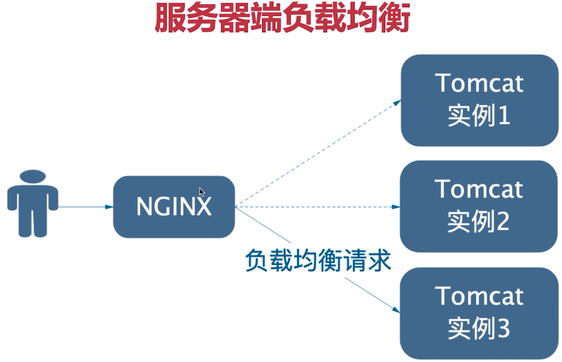
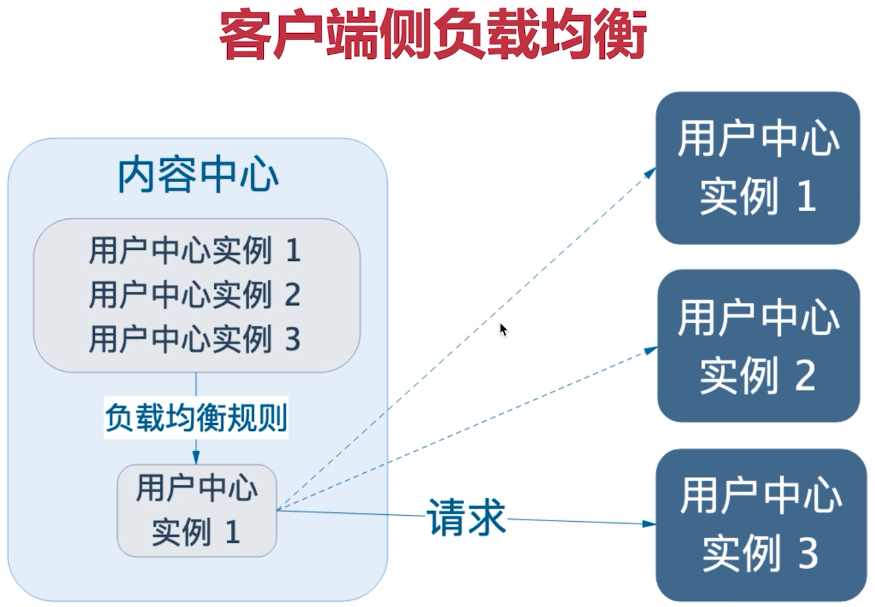
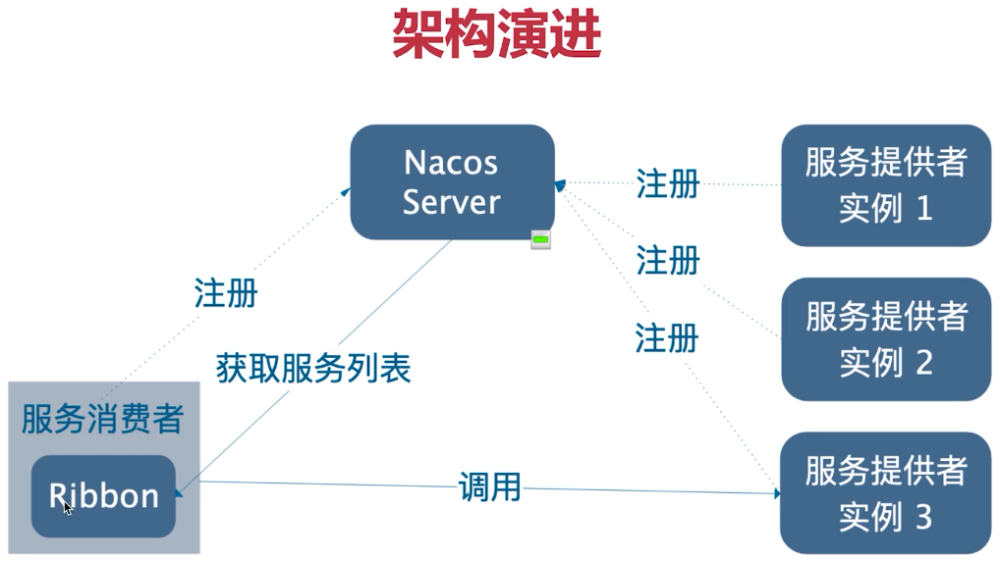
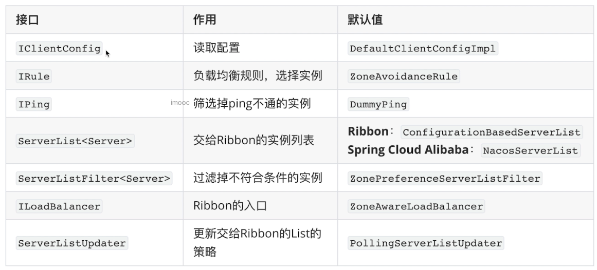
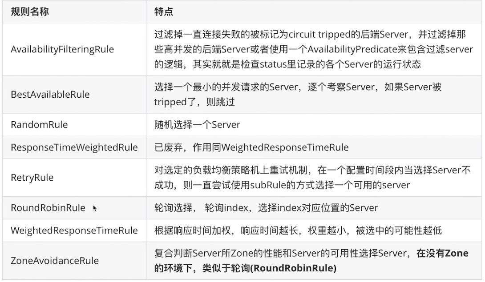
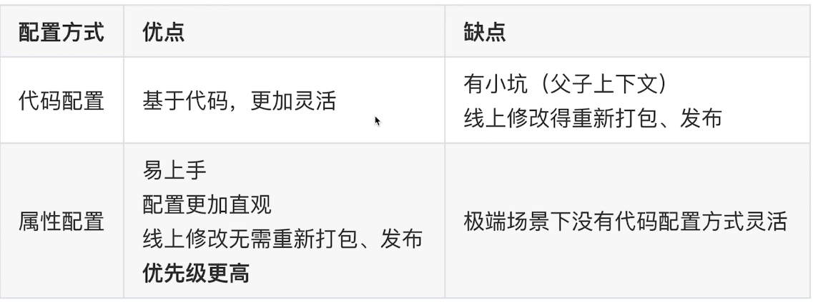
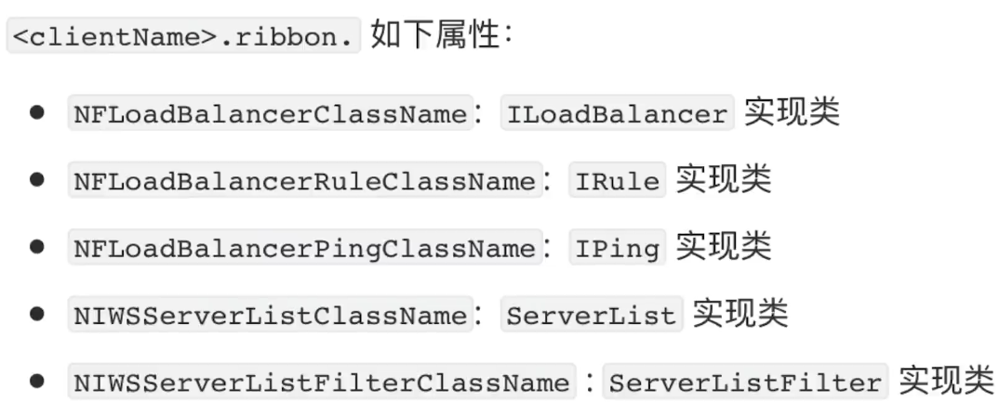

# 关于负载均衡






# 手动实现客户端负载

```java
public ShareDTO findById(Integer id){
    // 获取分享详情
    Share share = shareMapper.selectByPrimaryKey(id);
    // 获取userId然后获取user信息
    Integer userId = share.getUserId();

    // 手动方式使用nacos的注册信息
    List<ServiceInstance> instances = discoveryClient.getInstances("user-center");

    // 手动随机
    List<String> urls = instances.stream()
        .map(instance -> instance.getUri().toString())
        .collect(Collectors.toList());

    if(CollectionUtils.isEmpty(urls)){
        throw new IllegalArgumentException("结果为空");
    }

    String url = urls.get(new Random().nextInt(urls.size()));

    // 将json转换为dto
    UserDTO userDTO = restTemplate.getForObject(
        url+"users/{id}",
        UserDTO.class, userId
    );

    log.info("请求地址{}",url);
    ShareDTO shareDTO = new ShareDTO();
    // 消息的装配
    BeanUtils.copyProperties(share,shareDTO);
    shareDTO.setWxNickname(userDTO.getWxNickname());

    return shareDTO;
}
```


# 使用Ribbon实现负载均衡

- Ribbon是客户端负载均衡器
- 架构演进

 

- nacos-discovery包含了ribbon，不需要添加pom
- 添加注解，在RestTemplate上添加@LoadBalanced注解

```java
@Bean
@LoadBalanced
public RestTemplate restTemplate(){
    return new RestTemplate();
}
```

- 使用

```java
public ShareDTO findByIdFromRibbon(Integer id){
    // 获取分享详情
    Share share = shareMapper.selectByPrimaryKey(id);
    // 获取userId然后获取user信息
    Integer userId = share.getUserId();

    // ribbon会将user-center通过nacos转为ip和port进行解析
    UserDTO userDTO = restTemplate.getForObject(
        "http://user-center/users/{id}", // 使用ribbon
        UserDTO.class, userId
    );

    ShareDTO shareDTO = new ShareDTO();
    // 消息的装配
    BeanUtils.copyProperties(share,shareDTO);
    shareDTO.setWxNickname(userDTO.getWxNickname());

    return shareDTO;
}
```


# Ribbon的组成

- 了解用于以后的二次开发



- IRule是ribbon的核心组件，负载均衡规则
- DummyPing，是不做ping处理
- Zone可以看做是不同机房的不同机架，通过Zone可以获取相同机架或者机房内的实例列表
- ServerListUpdater
  - nacos中的实例列表是变化的，需要Ribbon定时更新
  - PollingServerListUpdater 定时更新


# 负载均衡规则



- 默认是ZoneAvoidanceRule


# 细粒度的配置Ribbon


## java代码配置

```java
package com.stt.contentcenter.configuration;

import org.springframework.cloud.netflix.ribbon.RibbonClient;
import org.springframework.context.annotation.Configuration;
import ribbon.configuration.RibbonConfiguration;

/**
 *
 * 配置usercenter的ribbon
 */
@Configuration
@RibbonClient(name = "user-center",configuration = RibbonConfiguration.class)
public class UserCenterRibbonConfiguration {

}
```

- 配置实现

```java
package ribbon.configuration; // 注意包结构

import com.netflix.loadbalancer.IRule;
import com.netflix.loadbalancer.RandomRule;
import org.springframework.context.annotation.Bean;
import org.springframework.context.annotation.Configuration;

// 配置随机规则
// 为什么要单独在Application的包外部配置，原因是防止注入后，更改其他通用配置
@Configuration
public class RibbonConfiguration {

	@Bean
	public IRule ribbonRule(){
		return new RandomRule();
	}
}
```


## 用配置属性配置

- 在yml中配置

```yml
user-center:
  ribbon:
    NFLoadBalancerRuleClassName: com.netflix.loadbalancer.RandomRule
```


## 方式对比

 


## 最佳实践

- 尽量使用属性配置，属性方式实现不了的情况下再考虑用代码配置
- 在同一个微服务内尽量保持单一性，如统一使用属性配置，不要两种方式混用增加代码的复杂性
- 简单就是美，减少配置的歧义


# 全局配置

- 方式一：让ComponentScan上下文重叠的方式，将配置归于spring ioc容器管理，不建议使用

- 方式二：使用@RibbonClients(defaultConfiguration=xxx.class)

```java
package com.stt.contentcenter.configuration;

import org.springframework.cloud.netflix.ribbon.RibbonClients;
import org.springframework.context.annotation.Configuration;
import ribbon.configuration.RibbonConfiguration;

/**
 *
 *  全局配置
 */
@Configuration
@RibbonClients(defaultConfiguration = RibbonConfiguration.class)
public class GlobalRibbonConfiguration {

}
```


# 支持的配置项

- 在Ribbon的组成中都可以进行配置
- 使用java的配置方式

```java
@Configuration
public class RibbonConfiguration {

	@Bean
	public IRule ribbonRule(){
		return new RandomRule();
	}

	@Bean
	public IPing ping(){
		return new PingUrl();
	}
}
```

- 使用yml的配置

 


# 饥饿加载

- 默认情况下，Ribbon是懒加载的
- 在第一次调用url时，才会创建一个该url的ribbonClient
- 使用饥饿加载可以提前加载好
- 添加配置，开启饥饿加载，支持细粒度的clients配置

```yml
ribbon:
  eager-load:
    enabled: true
    clients: user-center # 要支持多个，使用,号分隔
```

- 启动后日志

```bash
2020-03-14 14:47:20.879  INFO 6080 --- [main] c.n.l.DynamicServerListLoadBalancer : DynamicServerListLoadBalancer for client user-center initialized: DynamicServerListLoadBalancer:{NFLoadBalancer:name=user-center,current list of Servers=[26.26.26.1:8088, 26.26.26.1:8089],Load balancer stats=Zone stats: {unknown=[Zone:unknown;	Instance count:2;	Active connections count: 0;	Circuit breaker tripped count: 0;	Active connections per server: 0.0;]
},Server stats: [[Server:26.26.26.1:8088;	Zone:UNKNOWN;	Total Requests:0;	Successive connection failure:0;	Total blackout seconds:0;	Last connection made:Thu Jan 01 08:00:00 CST 1970;	First connection made: Thu Jan 01 08:00:00 CST 1970;	Active Connections:0;	total failure count in last (1000) msecs:0;	average resp time:0.0;	90 percentile resp time:0.0;	95 percentile resp time:0.0;	min resp time:0.0;	max resp time:0.0;	stddev resp time:0.0]
, [Server:26.26.26.1:8089;	Zone:UNKNOWN;	Total Requests:0;	Successive connection failure:0;	Total blackout seconds:0;	Last connection made:Thu Jan 01 08:00:00 CST 1970;	First connection made: Thu Jan 01 08:00:00 CST 1970;	Active Connections:0;	total failure count in last (1000) msecs:0;	average resp time:0.0;	90 percentile resp time:0.0;	95 percentile resp time:0.0;	min resp time:0.0;	max resp time:0.0;	stddev resp time:0.0]
]}ServerList:org.springframework.cloud.alibaba.nacos.ribbon.NacosServerList@5f631ca0
```


# 扩展


## 支持nacos权重

- 性能好的权重设置大一些
- ribbon是不支持nacos的权重的，需要自定义实现
- 在configuration包下创建Rule
  - 方式1，实现接口IRule
  - 方式2，继承AbstractLoadBalancerRule

```java
package com.stt.contentcenter.configuration;

import com.alibaba.nacos.api.exception.NacosException;
import com.alibaba.nacos.api.naming.NamingService;
import com.alibaba.nacos.api.naming.pojo.Instance;
import com.netflix.client.config.IClientConfig;
import com.netflix.loadbalancer.AbstractLoadBalancerRule;
import com.netflix.loadbalancer.BaseLoadBalancer;
import com.netflix.loadbalancer.Server;
import lombok.extern.slf4j.Slf4j;
import org.springframework.beans.factory.annotation.Autowired;
import org.springframework.cloud.alibaba.nacos.NacosDiscoveryProperties;
import org.springframework.cloud.alibaba.nacos.ribbon.NacosServer;

@Slf4j
public class NacosWeightedRule extends AbstractLoadBalancerRule {

	@Autowired
	private NacosDiscoveryProperties nacosDiscoveryProperties;

	@Override
	public void initWithNiwsConfig(IClientConfig iClientConfig) {
		// 读取配置文件并初始化
	}

	@Override
	public Server choose(Object o) {
		BaseLoadBalancer loadBalancer = (BaseLoadBalancer) getLoadBalancer();
		log.info("lb={}",loadBalancer.getName());

		// 要请求的微服务名称
		String name = loadBalancer.getName();

		// 实现负载均衡算法
		// 获取服务相关的API
		NamingService namingService = nacosDiscoveryProperties.namingServiceInstance();

		// 通过nacos client 通过基于权重的负载均衡算法，选择一个实例
		try {
			Instance instance = namingService.selectOneHealthyInstance(name);

			log.info("instance = {} port={}",instance,instance.getPort());

			return new NacosServer(instance);

		} catch (NacosException e) {
			e.printStackTrace();
		}

		return null;
	}
}
```

- 全局配置一下

```java
package ribbon.configuration;

import com.netflix.loadbalancer.IRule;
import com.stt.contentcenter.configuration.NacosWeightedRule;
import org.springframework.context.annotation.Bean;
import org.springframework.context.annotation.Configuration;

// 配置随机规则
// 为什么要单独在Application的包外部配置，原因是防止注入后，更改其他通用配置
@Configuration
public class RibbonConfiguration {

	@Bean
	public IRule ribbonRule(){
		return new NacosWeightedRule();
	}
}
```

```java
package com.stt.contentcenter.configuration;

import org.springframework.cloud.netflix.ribbon.RibbonClients;
import org.springframework.context.annotation.Configuration;
import ribbon.configuration.RibbonConfiguration;

/**
 *  全局配置
 */
@Configuration
@RibbonClients(defaultConfiguration = RibbonConfiguration.class)
public class GlobalRibbonConfiguration {

}
```

- 为什么nacos-client有基于权重，但没有直接使用该client，而是通过ribbon的IRule实现
  - spring cloud有一个spring cloud commons 的jar包，定义了通用功能
  - 同时commons下有一个spring cloud loadbalancer 的规范，但是没有权重
  - spring cloud alibaba遵守该规范，通过ribbon扩展（目前只有ribbon实现了loadbalancer）的方式实现

- 其他方式
  - https://www.imooc.com/article/288660


## 同一集群优先调用

- 如北京机房的节点优先调用，找不到再找南京机房

```java
package com.stt.contentcenter.configuration;

import com.alibaba.nacos.api.exception.NacosException;
import com.alibaba.nacos.api.naming.NamingService;
import com.alibaba.nacos.api.naming.pojo.Instance;
import com.alibaba.nacos.client.naming.core.Balancer;
import com.netflix.client.config.IClientConfig;
import com.netflix.loadbalancer.AbstractLoadBalancerRule;
import com.netflix.loadbalancer.BaseLoadBalancer;
import com.netflix.loadbalancer.Server;
import lombok.extern.slf4j.Slf4j;
import org.springframework.beans.factory.annotation.Autowired;
import org.springframework.cloud.alibaba.nacos.NacosDiscoveryProperties;
import org.springframework.cloud.alibaba.nacos.ribbon.NacosServer;
import org.springframework.util.CollectionUtils;

import java.util.List;
import java.util.stream.Collectors;

@Slf4j
public class NacosSameClusterWeightedRule extends AbstractLoadBalancerRule {

	@Autowired
	private NacosDiscoveryProperties nacosDiscoveryProperties;


	@Override
	public void initWithNiwsConfig(IClientConfig iClientConfig) {

	}

	@Override
	public Server choose(Object o) {
		// 找到指定服务的所有实例 A
		// 找到相同集群的所有实例 B
		// 如果B为空，则使用A
		// 基于权重，返回一个实例

		// 集群名称
		String clusterName = nacosDiscoveryProperties.getClusterName();
		BaseLoadBalancer loadBalancer = (BaseLoadBalancer) this.getLoadBalancer();
		// 服务名称
		String serverName = loadBalancer.getName();
		// 该服务相关api
		NamingService namingService = nacosDiscoveryProperties.namingServiceInstance();

		try {
			// 得到所有健康的节点
			List<Instance> allInstances = namingService.selectInstances(serverName, true);
			// 得到相同集群下的节点
			List<Instance> sameClusterInstances = allInstances.stream()
					.filter(instance -> instance.getClusterName().equals(clusterName))
					.collect(Collectors.toList());

			List<Instance> instancesToUse = sameClusterInstances;
			if(CollectionUtils.isEmpty(sameClusterInstances)){
				instancesToUse=allInstances;
				log.warn("发生跨集群的应用");
			}
			// 获取一个权重最大的实例
			Instance instance = ExtendBalancer.fetchHostByRandomWeight(instancesToUse);

			return new NacosServer(instance);
		} catch (NacosException e) {
			e.printStackTrace();
		}

		return null;
	}
}

// 通过查看selectOneHealthyInstance源码使用
class ExtendBalancer extends Balancer{
	public static Instance fetchHostByRandomWeight(List<Instance> hosts){
		return getHostByRandomWeight(hosts);
	}
}
```


## 基于元数据的版本控制

- 场景
  - 用户中心v1和内容中心的v1版本之间相互调用
  - 如果都是v2则不能相互调用

- 配置

```yml
spring:
  cloud:
    nacos:
        metadata: 
          # 自己这个实例的版本
          version: v1
          # 允许调用的提供者版本
          target-version: v1
```

- 实现

```java
@Slf4j
public class NacosFinalRule extends AbstractLoadBalancerRule {
    @Autowired
    private NacosDiscoveryProperties nacosDiscoveryProperties;

    @Override
    public Server choose(Object key) {
        // 负载均衡规则：优先选择同集群下，符合metadata的实例
        // 如果没有，就选择所有集群下，符合metadata的实例

        // 1. 查询所有实例 A
        // 2. 筛选元数据匹配的实例 B
        // 3. 筛选出同cluster下元数据匹配的实例 C
        // 4. 如果C为空，就用B
        // 5. 随机选择实例
        try {
            String clusterName = this.nacosDiscoveryProperties.getClusterName();
            String targetVersion = this.nacosDiscoveryProperties.getMetadata().get("target-version");

            DynamicServerListLoadBalancer loadBalancer = (DynamicServerListLoadBalancer) getLoadBalancer();
            String name = loadBalancer.getName();

            NamingService namingService = this.nacosDiscoveryProperties.namingServiceInstance();

            // 所有实例
            List<Instance> instances = namingService.selectInstances(name, true);

            List<Instance> metadataMatchInstances = instances;
            // 如果配置了版本映射，那么只调用元数据匹配的实例
            if (StringUtils.isNotBlank(targetVersion)) {
                metadataMatchInstances = instances.stream()
                        .filter(instance -> Objects.equals(targetVersion, instance.getMetadata().get("version")))
                        .collect(Collectors.toList());
                if (CollectionUtils.isEmpty(metadataMatchInstances)) {
                    log.warn("未找到元数据匹配的目标实例！请检查配置。targetVersion = {}, instance = {}", targetVersion, instances);
                    return null;
                }
            }

            List<Instance> clusterMetadataMatchInstances = metadataMatchInstances;
            // 如果配置了集群名称，需筛选同集群下元数据匹配的实例
            if (StringUtils.isNotBlank(clusterName)) {
                clusterMetadataMatchInstances = metadataMatchInstances.stream()
                        .filter(instance -> Objects.equals(clusterName, instance.getClusterName()))
                        .collect(Collectors.toList());
                if (CollectionUtils.isEmpty(clusterMetadataMatchInstances)) {
                    clusterMetadataMatchInstances = metadataMatchInstances;
                    log.warn("发生跨集群调用。clusterName = {}, targetVersion = {}, clusterMetadataMatchInstances = {}", clusterName, targetVersion, clusterMetadataMatchInstances);
                }
            }

            Instance instance = ExtendBalancer.getHostByRandomWeight2(clusterMetadataMatchInstances);
            return new NacosServer(instance);
        } catch (Exception e) {
            log.warn("发生异常", e);
            return null;
        }
    }

    @Override
    public void initWithNiwsConfig(IClientConfig iClientConfig) {
    }
}
```

