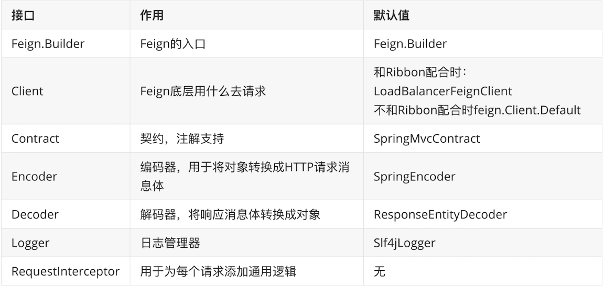
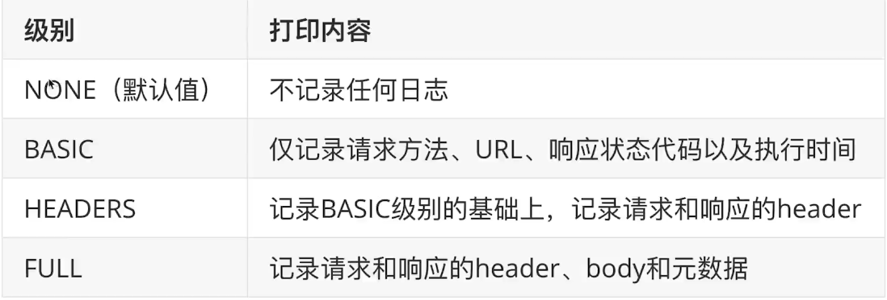
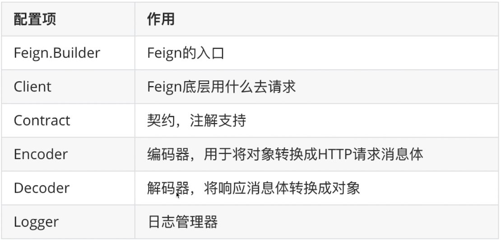
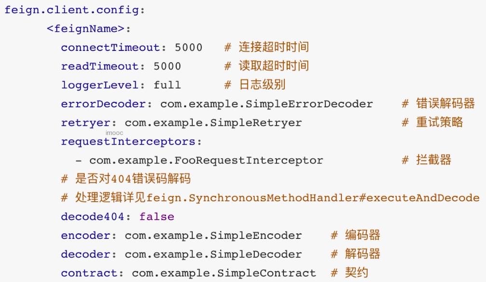
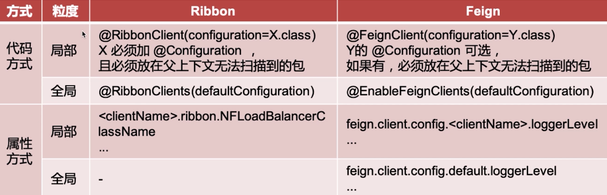
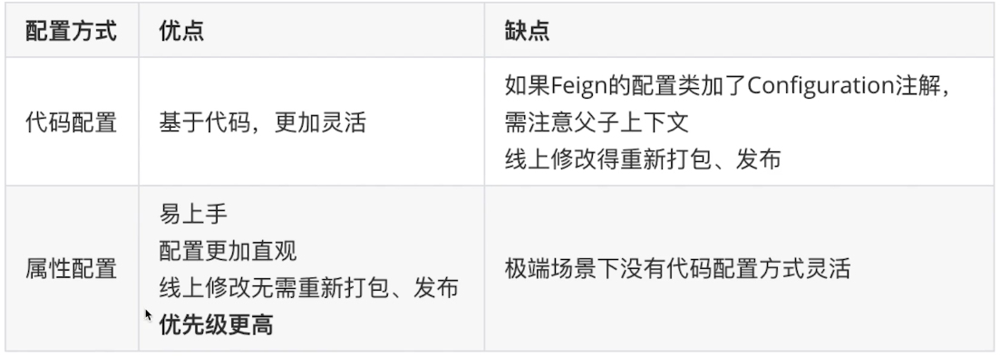
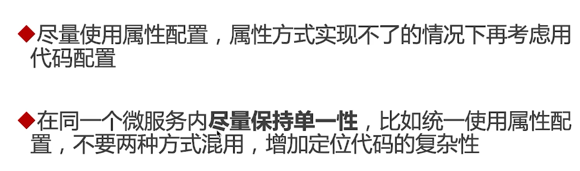
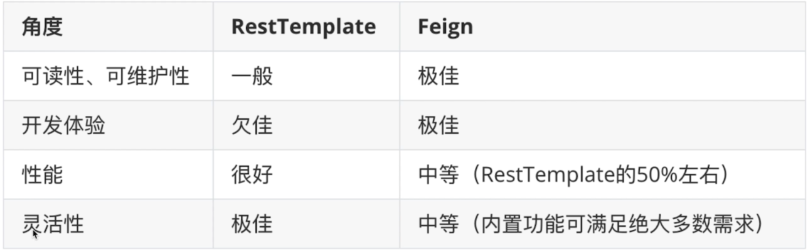

# 使用

- 使用feign实现远程调用

```xml
<dependency>
    <groupId>org.springframework.cloud</groupId>
    <artifactId>spring-cloud-starter-openfeign</artifactId>
</dependency>
```

- 在app启动类上添加注解

```java
@EnableFeignClients
```

- 编写接口

```java
package com.stt.contentcenter.feign.client;

import com.stt.contentcenter.domain.dto.user.UserDTO;
import org.springframework.cloud.openfeign.FeignClient;
import org.springframework.web.bind.annotation.GetMapping;
import org.springframework.web.bind.annotation.PathVariable;

@FeignClient(name="user-center")
@Component
public interface UserCenterFeignClient {

	/**
	 * http://user-center/users/{id}
	 * @param id
	 * @return
	 */
	@GetMapping("/users/{id}")
	UserDTO findById(@PathVariable(value="id") Integer id);
    // 注意一定要有value="id"的名称，否则报错
}
```

- 调用

```java
@Autowired
private UserCenterFeignClient userCenterFeignClient;

public ShareDTO findByIdFromFeign(Integer id){
    // 获取分享详情
    Share share = shareMapper.selectByPrimaryKey(id);
    // 获取userId然后获取user信息
    Integer userId = share.getUserId();

    UserDTO userDTO = userCenterFeignClient.findById(id);

    ShareDTO shareDTO = new ShareDTO();
    // 消息的装配
    BeanUtils.copyProperties(share,shareDTO);
    shareDTO.setWxNickname(userDTO.getWxNickname());

    return shareDTO;
}
```

- feign的负载均衡也是基于Ribbon的


# feign的组成



- 查看源码Feign.Default开始
  - 默认的是HttpUrlConnection
  - 使用LoadBalancerFeignClient底层也是HttpUrlConnection，没有连接池
- Contract，用于支持springmvc的注解
- RequestInterceptor可以添加head


# 细粒度配置自定义


## 自定义feign的日志级别

- 一般的配置日志级别

```yml
logging:
  level: 
    com.stt: debug # 该包下的日志以debug级别打印
```

- feign自己的日志级别

 

- basic适用于生产环境
- full适用于开发环境


### java代码方式配置

- 配置代码

```java
package com.stt.contentcenter.configuration;

import feign.Logger;
import org.springframework.context.annotation.Bean;
import org.springframework.context.annotation.Configuration;

//@Configuration 如果添加该注解，需要将该类添加到app起始类包的外部
// 父子上下文重复扫描的问题
public class UserCenterFeignConfiguration {

	@Bean
	public Logger.Level level(){
		// 让feign打印所有日志的细节
		return Logger.Level.FULL;
	}
}
```

- 配置feign

```java
package com.stt.contentcenter.feign.client;

import com.stt.contentcenter.configuration.UserCenterFeignConfiguration;
import com.stt.contentcenter.domain.dto.user.UserDTO;
import org.springframework.cloud.openfeign.FeignClient;
import org.springframework.stereotype.Component;
import org.springframework.web.bind.annotation.GetMapping;
import org.springframework.web.bind.annotation.PathVariable;

@Component
@FeignClient(name="user-center",configuration = UserCenterFeignConfiguration.class)
public interface UserCenterFeignClient {

	/**
	 * http://user-center/users/{id}
	 * @param id
	 * @return
	 */
	@GetMapping("/users/{id}")
	UserDTO findById(@PathVariable(value="id") Integer id);

}
```

- 配置yml

```yml
logging:
  level:
    com.stt.contentcenter.feign.client.UserCenterFeignClient: debug
    # feign的日志级别是建立在log日志的debug级别上的，如果是info则不会打印日志
```

- 测试

```bash
2020-03-14 17:52:34.842 DEBUG 21816 --- [nio-8010-exec-1] c.s.c.f.client.UserCenterFeignClient     : [UserCenterFeignClient#findById] <--- HTTP/1.1 200 (32ms)
2020-03-14 17:52:34.842 DEBUG 21816 --- [nio-8010-exec-1] c.s.c.f.client.UserCenterFeignClient     : [UserCenterFeignClient#findById] connection: keep-alive
2020-03-14 17:52:34.843 DEBUG 21816 --- [nio-8010-exec-1] c.s.c.f.client.UserCenterFeignClient     : [UserCenterFeignClient#findById] content-type: application/json
2020-03-14 17:52:34.843 DEBUG 21816 --- [nio-8010-exec-1] c.s.c.f.client.UserCenterFeignClient     : [UserCenterFeignClient#findById] date: Sat, 14 Mar 2020 09:52:34 GMT
2020-03-14 17:52:34.843 DEBUG 21816 --- [nio-8010-exec-1] c.s.c.f.client.UserCenterFeignClient     : [UserCenterFeignClient#findById] keep-alive: timeout=60
2020-03-14 17:52:34.843 DEBUG 21816 --- [nio-8010-exec-1] c.s.c.f.client.UserCenterFeignClient     : [UserCenterFeignClient#findById] transfer-encoding: chunked
2020-03-14 17:52:34.843 DEBUG 21816 --- [nio-8010-exec-1] c.s.c.f.client.UserCenterFeignClient     : [UserCenterFeignClient#findById] 
2020-03-14 17:52:34.843 DEBUG 21816 --- [nio-8010-exec-1] c.s.c.f.client.UserCenterFeignClient     : [UserCenterFeignClient#findById] {"id":1,"wxId":"33","wxNickname":"张三","roles":"admin","avatarUrl":"xxx","createTime":"2020-03-12T07:50:25.000+0000","updateTime":"2020-03-12T07:50:25.000+0000","bonus":222}
2020-03-14 17:52:34.843 DEBUG 21816 --- [nio-8010-exec-1] c.s.c.f.client.UserCenterFeignClient     : [UserCenterFeignClient#findById] <--- END HTTP (176-byte body)
```


### 配置方式

- 代码

```java
package com.stt.contentcenter.feign.client;

import com.stt.contentcenter.configuration.UserCenterFeignConfiguration;
import com.stt.contentcenter.domain.dto.user.UserDTO;
import org.springframework.cloud.openfeign.FeignClient;
import org.springframework.stereotype.Component;
import org.springframework.web.bind.annotation.GetMapping;
import org.springframework.web.bind.annotation.PathVariable;

@Component
@FeignClient(name="user-center")
public interface UserCenterFeignClient {

	/**
	 * http://user-center/users/{id}
	 * @param id
	 * @return
	 */
	@GetMapping("/users/{id}")
	UserDTO findById(@PathVariable(value="id") Integer id);
}
```

- 配置

```yml
logging:
  level:
    # feign的日志级别是建立在log日志的debug级别上的，如果是info则不会打印日志
    com.stt.contentcenter.feign.client.UserCenterFeignClient: debug
feign:
  client:
    config:
    # 调用的微服务的名称
      user-center:
        loggerLevel: full
```


# 全局配置自定义

java代码的方式

- 方式1：让父子上下文的ComponentScan重叠，不推荐
- 方式2：@EnableFeignClients(defaultConfiguration=xxx.class)

```java
@EnableFeignClients(defaultConfiguration = UserCenterFeignConfiguration.class)
```


属性方式

```yml
feign:
  client:
    config:
    # 全局配置
      default:
        loggerLevel: full
```


# 支持的配置项

代码方式




属性方式

 


# 配置最佳实践


## Ribbon配置 VS Feign配置

- Ribbon是一个负载均衡器，帮助选择实例
- Feign是一个HttpClient，方便实现http请求，不是一个产品，但是在配置方面有共同点




## Feign代码方式 VS 属性方式



- 优先级
  - 全局代码 < 全局属性 < 细粒度代码 < 细粒度属性


## 最佳实践

 


# feign的继承

- controller的方法和feign的接口的方法是一致的，抽取一个公共接口到一个公共模块，不同模块调用该共同模块
- 面向契约的编程方式
- 存在争议
  - 共享接口代码带来了紧耦合
- 官方：不建议使用
- 业界：很多公司使用
- 共享接口：代码重用，共享契约


# 多参数请求构造

https://www.imooc.com/article/289000

## get

方式1

- 示例
- 服务提供方

```java
@GetMapping("/test/q")
public User testQuery(User user){
    return user;
}
```

- 服务消费方
- 添加配置，当2个feignClient接口调用相同的name时

```yml
spring:
  main:
    allow-bean-definition-overriding: true
```

- feign接口

```java
package com.stt.contentcenter.feign.client;

import com.stt.contentcenter.domain.dto.user.UserDTO;
import org.springframework.cloud.openfeign.FeignClient;
import org.springframework.cloud.openfeign.SpringQueryMap;
import org.springframework.stereotype.Component;
import org.springframework.web.bind.annotation.GetMapping;

@Component
@FeignClient(name="user-center")
public interface TestUserCenterFeignClient {

	@GetMapping("/test/q")
	UserDTO query(@SpringQueryMap UserDTO userDTO);

}
```

- controller

```java
@Autowired
private TestUserCenterFeignClient testUserCenterFeignClient;

@GetMapping("/q")
public UserDTO query(UserDTO userDTO){
    return testUserCenterFeignClient.query(userDTO);
}
```

- 测试服务消费方

```json
// http://localhost:8010/test/q?id=2&roles=admin

{
  "id": 2,
  "wxId": null,
  "wxNickname": null,
  "roles": "admin",
  "avatarUrl": null,
  "createTime": null,
  "updateTime": null,
  "bonus": null
}
```

- 注意这里feign接口使用了@SpringQueryMap注解

- 不能将该接口抽取出一个jar包使用，此时可以考虑使用方式2


方式2

```java
@FeignClient(name = "microservice-provider-user")
public interface UserFeignClient {
  @RequestMapping(value = "/get", method = RequestMethod.GET)
  public User get1(@RequestParam("id") Long id, @RequestParam("username") String username);
}
```

方式3

- 不推荐，map的可读性差，接收到参数后，如name字段是null，那么在接收转换时，会变成""

```java
@FeignClient(name = "microservice-provider-user")
public interface UserFeignClient {
  @RequestMapping(value = "/get", method = RequestMethod.GET)
  public User get2(@RequestParam Map<String, Object> map);
}
```


## post

- 服务提供者

```java
@RestController
public class UserController {
  @PostMapping("/post")
  public User post(@RequestBody User user) {
    ...
  }
}
```

- 服务消费者

```java
@FeignClient(name = "microservice-provider-user")
public interface UserFeignClient {
  @RequestMapping(value = "/post", method = RequestMethod.POST)
  public User post(@RequestBody User user);
}
```


# feign脱离Ribbon使用

- 示例调用百度接口

```java
package com.stt.contentcenter.feign.client;

import org.springframework.cloud.openfeign.FeignClient;
import org.springframework.stereotype.Component;
import org.springframework.web.bind.annotation.GetMapping;

// 必须要有name属性
@Component
@FeignClient(name = "baidu",url="http://www.baidu.com")
public interface TestBaiduFeignClient {

	@GetMapping("")
	String index();
}
```


# 与RestTemplate的比较



如何选择

- 原则：尽量用Feign，杜绝使用RestTemplate
- 事无绝对，合理选择


# 性能优化


## 连接池

- 配置连接池，性能提升15%
  - 默认情况下没有连接池
  - 配置其他方式，apache httpClient，ok http 支持连接池
- 配置apache httpClient

```xml
<dependency>
    <groupId>io.github.openfeign</groupId>
    <artifactId>feign-httpclient</artifactId>
</dependency>
```

- yml

```yml
feign:
  client:
    config:
    # 全局配置
      default:
        loggerLevel: full
  httpclient:
  # 使用apache httpclient 而不是默认的urlConnection
    enabled: true
    # feign的最大连接数
    max-connections: 200
    # feign的单个路径的最大连接数
    max-connections-per-route: 50
```

- 如何决定max的值，需要压测决定

- 关于支持okhttp

```xml
<dependency>
    <groupId>io.github.openfeign</groupId>
    <artifactId>feign-okhttp</artifactId>
</dependency>
```

- 配置

```yml
feign:
  okhttp:
    enabled: true
    # feign的最大连接数
    max-connections: 200
    # feign的单个路径的最大连接数
    max-connections-per-route: 50
```


## 日志级别

生产设置为basic，不要设置为full


# 常见问题

https://www.imooc.com/article/289005