sentinel 哨兵

# 介绍

- 雪崩效应
  - 多个微服宕机，其他服务调用时会阻塞，不断的造成多个服务宕机
  - 级联失效，级联故障
  - 服务消费者没有做容错处理


# 常见容错方案

- 方案1：超时
  - 每次请求设置比较短的超时时间，无论是否成功，都释放线程
- 方案2：限流
  - 微服务是高并发的系统
  - 经过评估，某个服务最大的并发量是1000，那么服务调用超过1000时进行限流
- 方案3：仓壁模式
  - 每个controller有自己独立的线程池，那么当一个线程池满了，则会拒绝
  - 当某几个controller访问满了不会造成其他controller受到影响
- 方案4：断路器模式
  - https://martinfowler.com/bliki/CircuitBreaker.html
  - 5s以内的错误率，错误次数达到阈值等
  - 断路器的半开状态是中间状态，定时尝试恢复

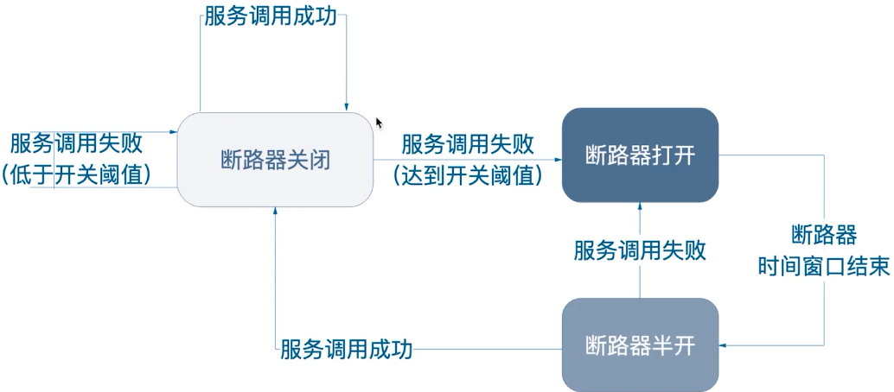 

## 断路器状态

- 断路器关闭
- 断路器打开
- 断路器半开
  - sentinel断路器没有半开状态


# 使用sentinel容错

- https://github.com/alibaba/Sentinel
  - 轻量级的流量控制，熔断降级java库

- 添加依赖

```xml
<!--/actuator/sentinel-->
<dependency>
    <groupId>org.springframework.cloud</groupId>
    <artifactId>spring-cloud-starter-alibaba-sentinel</artifactId>
</dependency>

<!--监控sentinel-->
<dependency>
    <groupId>org.springframework.boot</groupId>
    <artifactId>spring-boot-starter-actuator</artifactId>
</dependency>
```

- 配置actuator，查看sentinel信息

```yml
management:
  endpoints:
    web:
      exposure:
        include: '*'
```

- 访问

```json
// http://localhost:8010/actuator/sentinel

{
  "blockPage": null,
  "appName": "content-center",
  "consoleServer": null,
  "coldFactor": "3",
  "rules": {
    "systemRules": [
      
    ],
    "authorityRule": [
      
    ],
    "paramFlowRule": [
      
    ],
    "flowRules": [
      
    ],
    "degradeRules": [
      
    ]
  },
  "metricsFileCharset": "UTF-8",
  "filter": {
    "order": -2147483648,
    "urlPatterns": [
      "/*"
    ],
    "enabled": true
  },
  "totalMetricsFileCount": 6,
  "datasource": {
    
  },
  "clientIp": "26.26.26.1",
  "clientPort": "8719",
  "logUsePid": false,
  "metricsFileSize": 52428800,
  "logDir": "C:\\Users\\Administrator\\logs\\csp\\",
  "heartbeatIntervalMs": 10000
}
```


# sentinel控制台

- 下载地址
  - https://github.com/alibaba/Sentinel/releases
- 下载版本确定，依据core的版本，但是1.6.2的版本也是支持的，在生产环境还是要1.5.2防止兼容性问题

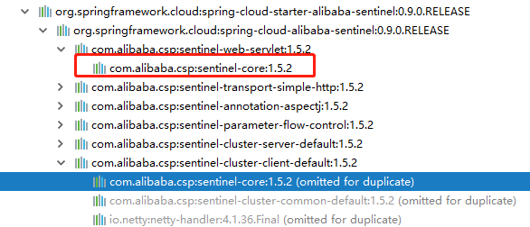 

- 启动

```yml
java -jar sentinel-dashboard-1.6.2.jar
```

- 访问 http://localhost:8080/#/login
  - 账号密码都是sentinel

- 配置控制台，在服务端

```yml
spring:
  datasource:
    url: jdbc:mysql://localhost:3306/content_center?serverTimezone=GMT%2B8
    hikari:
      username: root
      password: 123456
      # connect的版本6.x 以上 com.mysql.cj.jdbc.Driver
      # 版本5.x 以下 com.mysql.jdbc.Driver
      driver-class-name: com.mysql.cj.jdbc.Driver
  cloud:
    nacos:
      discovery:
      # 指定nacos server的ip和端口
        server-addr: localhost:8848
        namespace: de1f60d3-097f-4421-b3b2-cf1bad41656d #dev
        cluster-name: BEIJING
    sentinel:
      transport:
      # 指定sentinel控制台的地址 ******
        dashboard: localhost:8080
  main:
    allow-bean-definition-overriding: true
  application:
  # 服务名称，不要用_，尽量使用-
      name: content-center
server:
  port: 8010

ribbon:
  eager-load:
    enabled: true
    clients: user-center
    # 要支持多个，使用,号分隔

logging:
  level:
    # feign的日志级别是建立在log日志的debug级别上的，如果是info则不会打印日志
    com.stt.contentcenter.feign.client.UserCenterFeignClient: debug

feign:
  client:
    config:
    # 全局配置
      default:
        loggerLevel: full
  httpclient:
  # 使用apache httpclient 而不是默认的urlConnection
    enabled: true
    # feign的最大连接数
    max-connections: 200
    # feign的单个路径的最大连接数
    max-connections-per-route: 50

management:
  endpoints:
    web:
      exposure:
        include: '*'
```

- 首次启动服务，控制台没有信息显示，当有访问之后，控制台显示访问的信息
- sentinel是懒加载的，ribbon也是懒加载的


# 流控规则

- 对大并发流量的控制，从而保护微服务

- 访问测试http://localhost:8010/shares/1

简单设置流控规则

- 簇点链路：类似于访问的url的历史记录

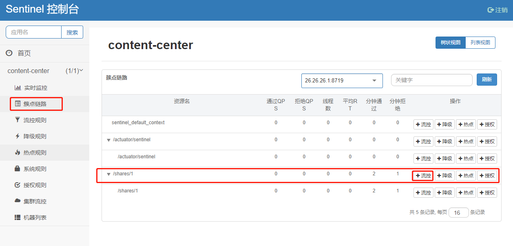


## 直接限流

- 可以设置单个访问某个资源的流控信息
  - 设置QPS指定并发量
  - 针对来源可以指定调用方，需要做其他的配置

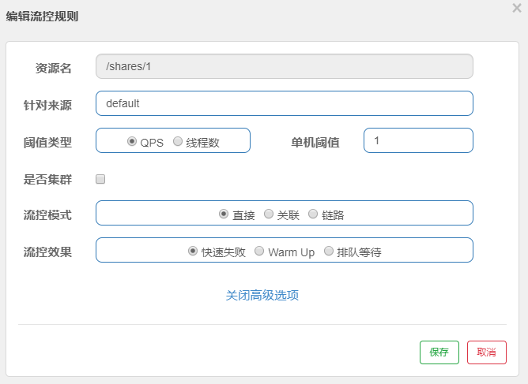 

- 多次快速访问http://localhost:8010/shares/1

```bash
Blocked by Sentinel (flow limiting)
```


## 关联限流

- 当关联的资源达到阈值，就限流自己

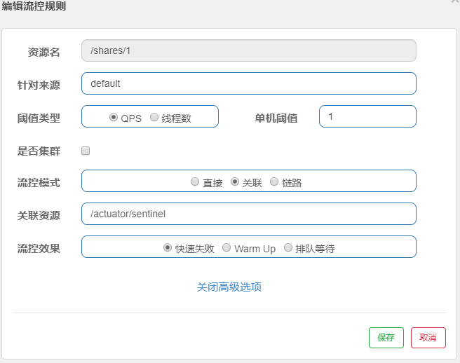 

- 当关联资源/actuator/sentinel的qps达到阈值后，就限流/shares/1

- 测试
  - 访问某个接口频繁，造成/shares/1的接口限流

```java
// 造成关联限流
public static void main(String[] args) throws InterruptedException {
    RestTemplate re = new RestTemplate();
    for (int i = 0; i < 1000; i++) {
        re.getForObject("http://localhost:8010/actuator/sentinel",String.class);
        Thread.sleep(400);
    }
}
```

- 再访问http://localhost:8010/shares/1

```bash
Blocked by Sentinel (flow limiting)
```

- 关联使用的场景
  - 当一个资源有读取的api，也有写的api
  - 如果有大量读取api的时候，写api该资源可能会阻塞，因此为了控制资源的访问，需要设置优先级
  - 如果是优先写的话，那么读api需要在写api的基础上做熔断，当写api的QPS超过多少时，读api不能操作，要等写api完成，此时配置关联写api，/shares/1就是一个读api

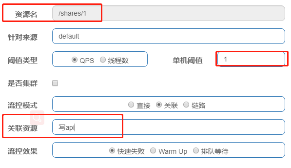


## 链路限流

- 只记录指定链路上的流量


示例

- controller

```java
@Autowired
private	TestService testService;

@GetMapping("/a")
public String testA(){
    testService.common();
    return "testA";
}

@GetMapping("/b")
public String testB(){
    testService.common();
    return "testB";
}
```

- service

```java
package com.stt.contentcenter;

import com.alibaba.csp.sentinel.annotation.SentinelResource;
import lombok.extern.slf4j.Slf4j;
import org.springframework.stereotype.Service;

@Slf4j
@Service
public class TestService {

	@SentinelResource("common")
	public String common(){
		log.info("common....");
		return "common";
	}
}
```


测试

- 访问http://localhost:8010/test/a 和 http://localhost:8010/test/b

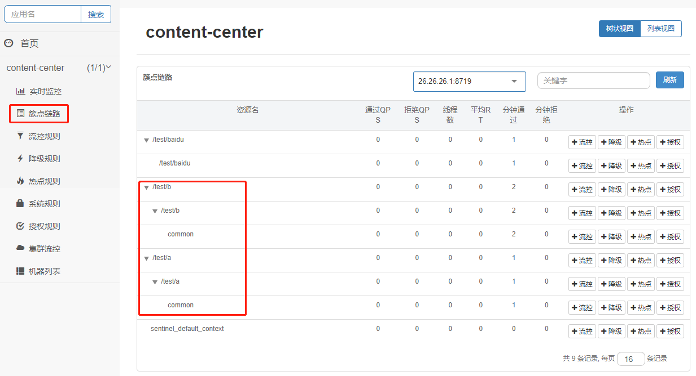

- 在common上点击流控

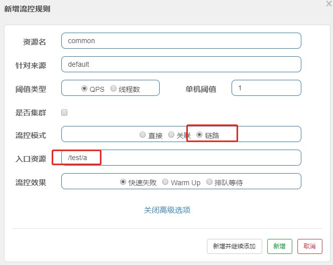 

- 此时访问/test/a超过阈值会被限流，而/test/b没有影响
  - 对于common的资源只统计/test/a
  - 是细粒度的针对来源，针对api级别的流量


# 流控效果


## 快速失败

- 直接失败，抛出异常
- 相关源码
  - com.alibaba.csp.sentinel.slots.block.flow.controller.DefaultController


## WarmUp 预热

- codeFactor 冷加载因子，默认值3
- 依据codeFactor的值，从 阈值/codeFactor ，经过预热时长到达设置的QPS阈值
- 如QPS的阈值是100，预热时长是10(单位s)，codeFactor是3
  - 100/3是初始阈值
  - 10s后达到100
- 应用场景
  - 秒杀微服务，平时的并发不高，在某一个秒杀活动开始时的瞬间，流量激增，如果不做处理会将微服务打崩
  - 使用Warm Up 使流量缓慢增加，在经过预热时长达到想要的QPS的值，保护微服务
- 原理
  - [https://github.com/alibaba/Sentinel/wiki/%E9%99%90%E6%B5%81---%E5%86%B7%E5%90%AF%E5%8A%A8](https://github.com/alibaba/Sentinel/wiki/限流---冷启动)

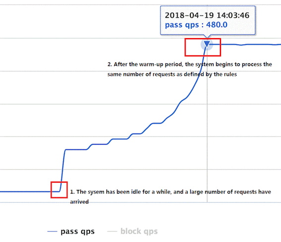 


## 排队等待

- 匀速排队，让请求以均匀的速度通过，阈值类型必须设置为QPS，否则无效

- 超时时间单位是ms

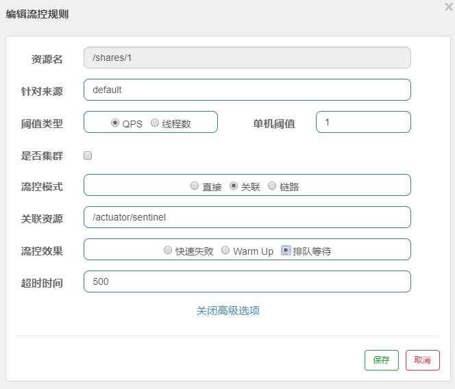 

- 适用场景
  - 应对突发流量的场景，在某一刻有很多流量，希望在空闲的时间进行处理流量
- [https://github.com/alibaba/Sentinel/wiki/%E6%B5%81%E9%87%8F%E6%8E%A7%E5%88%B6-%E5%8C%80%E9%80%9F%E6%8E%92%E9%98%9F%E6%A8%A1%E5%BC%8F](https://github.com/alibaba/Sentinel/wiki/流量控制-匀速排队模式)

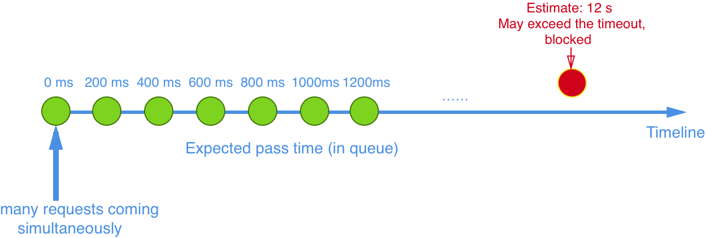


# 降级规则

- 出现异常时的保护措施

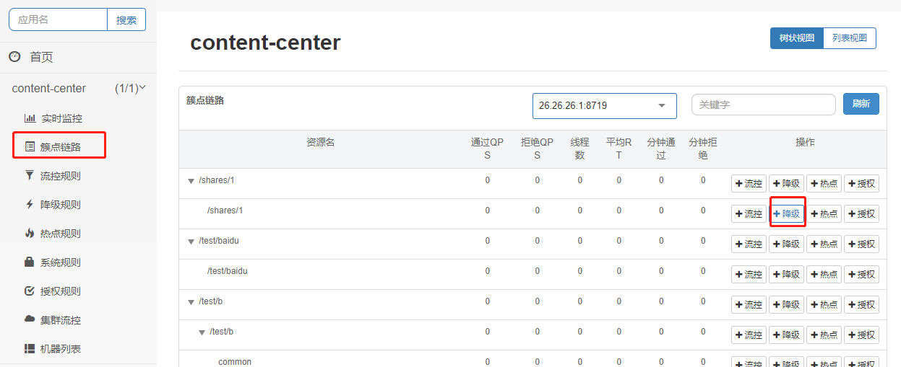


## RT

- 秒级平均响应时间
- 秒级别统计
- 示例：RT 1ms，时间窗口 5s

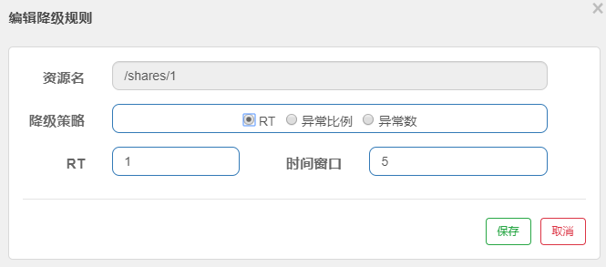 

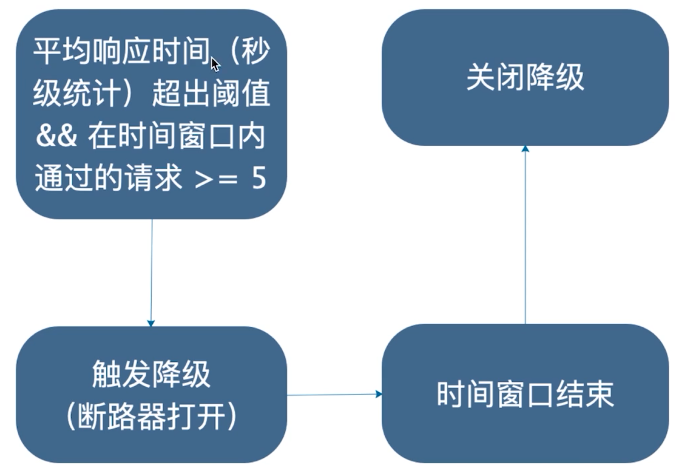 

- 访问http://localhost:8010/shares/1 

```bash
Blocked by Sentinel (flow limiting) # 提示不好，之后改为降级提示
```

- 注意
  - RT默认最大4900ms
  - 通过-Dscp.sentinel.statistic.max.rt=xxx修改


## 异常比例

- 秒级别统计

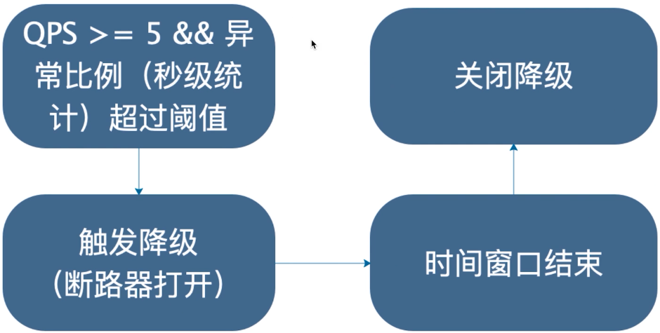 


## 异常数

- 分钟级别统计
- 时间窗口的作用在于时间窗口内没有触发降级规则则关闭降级
- 注意：时间窗口设置>60s

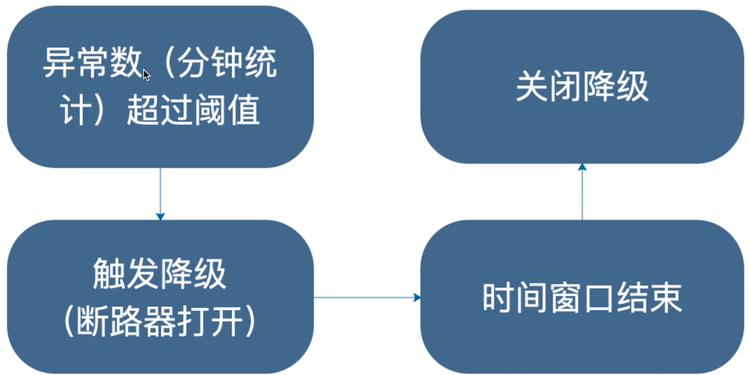 

- 源码
  - com.alibaba.csp.sentinel.slots.block.degrade.DegradeRule#passCheck


# 热点规则

- 针对热点数据进行限流操作，针对指定url参数进行限流

- 需要在代码中进行一些设置

```java
@GetMapping("/hot")
@SentinelResource("hot") // 需要设置热点
public String testHot(
    @RequestParam(required = false,name = "a") String a,
    @RequestParam(required = false,name = "b") String b){
    return a+":"+b;
}
```

- 配置

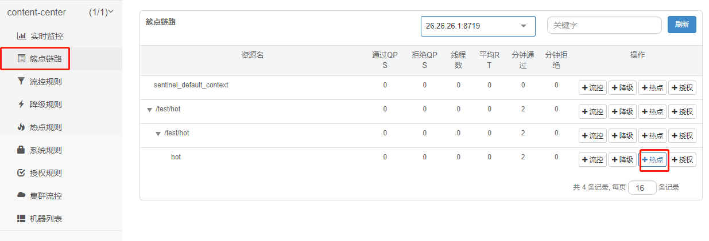

- 参数索引从0开始，0表示参数a
  - 表示该url的a参数不为null时，QPS并发量是1，超过1则熔断
  - http://localhost:8010/test/hot?b=3&a=1 qps超过1熔断
  - http://localhost:8010/test/hot?b=3 不做限制

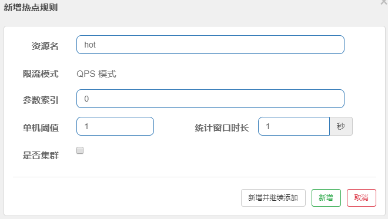 

- 例外参数配置
  - 表示a参数如果数值为5，则单独设置阈值熔断
  - http://localhost:8010/test/hot?b=3&a=5 qps是1000才熔断

 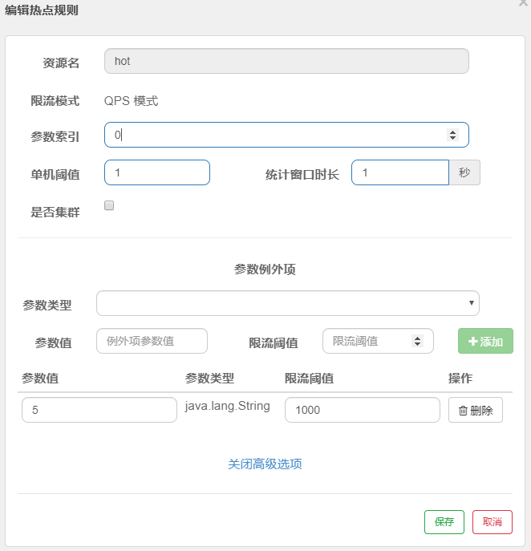


- 适用场景
  - 存在热点参数
  - 希望提升api可用性
- 注意
  - 参数类型必须是基本数据类型，或string
- 源码
  - com.alibaba.csp.sentinel.slots.block.flow.param.ParamFlowChecker#passCheck


# 系统规则


## LOAD

- 当系统load1(1分钟的load，1分钟的负载)超过阈值，且并发线程数超过系统容量时触发，建议设置为cpu核心数*2.5(对linux生效)

- 查看linux负载
  - 分别表示1分钟，5分钟，15分钟负载
  - 分别为load1,load5,load15

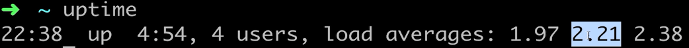

- 系统容量：sentinel计算的指标 
  - maxQps*minRt
  - maxQps：秒级统计出来的最大QPS
  - minRt：秒级统计出的最小响应时间
- 源码
  - com.alibaba.csp.sentinel.slots.system.SystemRuleManager#checkBbr


## RT

- 所有入口流量的平均RT达到阈值触发


## 线程数

- 所有入口流量的并发线程数达到阈值时触发


## 入口QPS

- 所有入口流量的QPS达到阈值触发


源码

- com.alibaba.csp.sentinel.slots.system.SystemRuleManager#checkSystem


# 授权规则

- 黑白名单设置

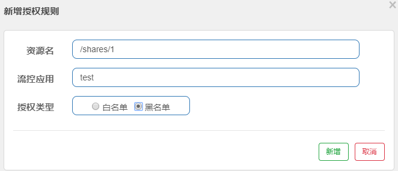 


# 代码配置规则

使用代码配置sentinel的规则

https://www.imooc.com/article/289345

```java
@GetMapping("/addflowrule")
public String testFlowQPSRule(){
    this.initFlowQpsRule();
    return "rule";
}

private void initFlowQpsRule() {
    List<FlowRule> rules = new ArrayList<>();
    FlowRule rule = new FlowRule("/shares/1");
    // set limit qps to 20
    rule.setCount(20);
    rule.setGrade(RuleConstant.FLOW_GRADE_QPS);
    rule.setLimitApp("default");
    rules.add(rule);
    FlowRuleManager.loadRules(rules);
}
```

- 访问http://localhost:8010/test/addflowrule
  - 可以看到新的流控规则

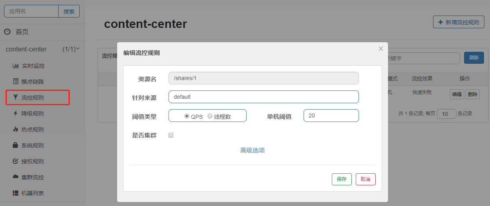


# 通信原理

- Sentinel 与控制台通信原理剖析
  - 控制台如何获取到微服务的监控信息?
  - 用控制台配置规则时，控制台是如何将规则发送到各个微服务的？

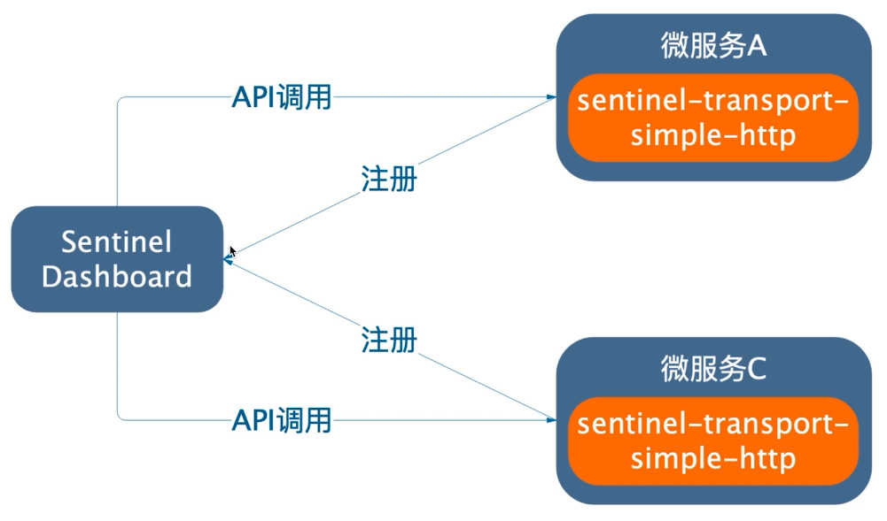 

- Sentinel有自身的服务发现机制

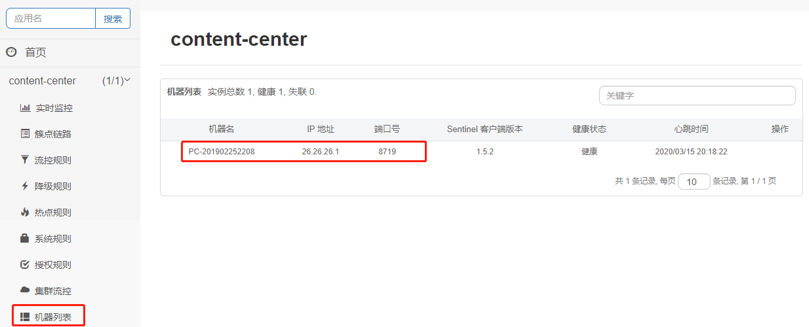

- 此处是content-center的8719端口是微服务与控制台通信的port

```json
// http://localhost:8719/api
[
 ...
  {
    "url": "/setRules", # 推送规则
    "desc": "modify the rules, accept param: type={ruleType}&data={ruleJson}"
  },
 
  {
    "url": "/metric", # 获取监控信息
    "desc": "get and aggregate metrics, accept param: startTime={startTime}&endTime={endTime}&maxLines={maxLines}&identify={resourceName}"
  },
 ...
]
```

- 查看基本信息

```json
// http://localhost:8010/actuator/sentinel

{
  "blockPage": null,
  "appName": "content-center",
  "consoleServer": "localhost:8080",
  "coldFactor": "3",
  "rules": {
    "systemRules": [ # 此处是配置的规则
      
    ],
    "authorityRule": [
      
    ],
    "paramFlowRule": [
      
    ],
    "flowRules": [
      {
        "resource": "/shares/1",
        "limitApp": "default",
        "grade": 1,
        "count": 20.0,
        "strategy": 0,
        "refResource": null,
        "controlBehavior": 0,
        "warmUpPeriodSec": 10,
        "maxQueueingTimeMs": 500,
        "clusterMode": false,
        "clusterConfig": null
      }
    ],
    "degradeRules": [
      
    ]
  },
  "metricsFileCharset": "UTF-8",
  "filter": {
    "order": -2147483648,
    "urlPatterns": [
      "/*"
    ],
    "enabled": true
  },
  "totalMetricsFileCount": 6,
  "datasource": {
    
  },
  "clientIp": "26.26.26.1", # 与sentinel通信的ip
  "clientPort": "8719", # 与sentinel通信的端口
  "logUsePid": false,
  "metricsFileSize": 52428800,
  "logDir": "C:\\Users\\Administrator\\logs\\csp\\",
  "heartbeatIntervalMs": 10000 # 与sentinel控制台之间的心跳
}
```

- 相关源码
  - 注册，心跳
    - com.alibaba.csp.sentinel.transport.heartbeat.SimpleHttpHeartbeatSender
  - 通信API
    - com.alibaba.csp.sentinel.command.Command.Handler的实现类


# 控制台配置项


## 应用端连接控制台配置项

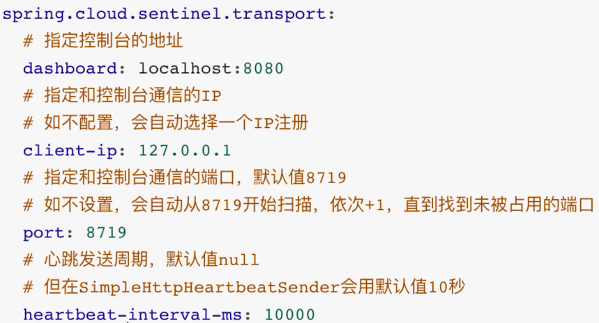 


## sentinel控制台配置

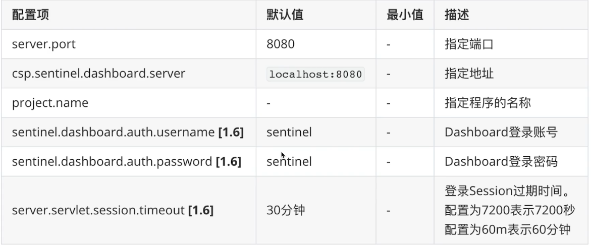

- 示例修改登录用户名

```bash
java -jar -Dsentinel.dashboard.auth.username=admin -Dsentinel.dashboard.auth.password=admin sentinel-dashboard-1.6.2.jar
```


# Sentinel API

- 使用API，将业务代码段纳入Sentinel的监控中

- 测试前关闭对springMVC的保护，所有的springMVC的接口都不会在Sentinel监控

```yml
spring:
  cloud:
    sentinel:
      transport:
      # 指定sentinel控制台的地址
        dashboard: localhost:8080
      filter:
        enabled: false
```

- 定义限流的业务代码

```java

@GetMapping("/sentinelapi")
public String testSentinelAPI(
    @RequestParam(required = false) String a){
    // 定义一个sentinel保护的资源，名称为test-sentinel-api 要求唯一
    Entry entry = null;
    try {
        entry = SphU.entry("test-sentinel-api");
        // 被保护的业务逻辑
        return a;
    } catch (BlockException e) { // sentinel只统计该异常，对该异常进行限流和降级
        // 如果被保护的资源被限流或者降级了，则抛出该异常
        e.printStackTrace();
        log.warn("限流，降级 {}",e);
        return "限流降级";
    }finally {
        if(entry != null){
            entry.exit();
        }
    }
}
```

- 访问 http://localhost:8010/test/sentinelapi?a=ddd
- 查看sentinel控制台页面，编辑限流

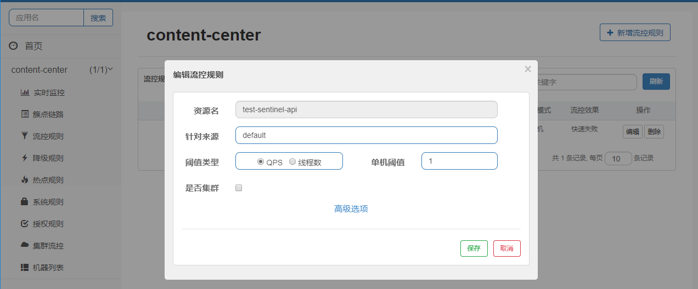

- 再多次访问http://localhost:8010/test/sentinelapi?a=ddd 则会有限流的现象


测试降级规则

- 代码：针对其他异常进行统计

```java
@GetMapping("/sentinelapi")
public String testSentinelAPI(
    @RequestParam(required = false) String a){
    // 定义一个sentinel保护的资源，名称为test-sentinel-api 要求唯一
    Entry entry = null;
    try {
        entry = SphU.entry("test-sentinel-api");
        // 被保护的业务逻辑
        if(StringUtils.isBlank(a)){
            throw new IllegalArgumentException("不能为空");
        }
        return a;
    } catch (BlockException e) {
        e.printStackTrace();
        log.warn("限流，降级 {}", e);
        return "限流降级";
    }catch (IllegalArgumentException e2){
        Tracer.trace(e2); // 针对非Block异常也进行统计
        return "异常降级"; 
    }finally {
        if(entry != null){
            entry.exit();
        }
    }
}
```

- 配置

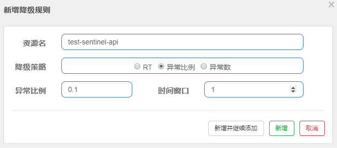 


## 针对来源

```java
@GetMapping("/sentinelapi")
public String testSentinelAPI(
    @RequestParam(required = false) String a){
    // 定义一个sentinel保护的资源，名称为test-sentinel-api 要求唯一

    String resourceName = "test-sentinel-api";
    // 指定来源 test-xxx
    ContextUtil.enter(resourceName,"test-xxx");
    Entry entry = null;
    try {
        entry = SphU.entry(resourceName);
        // 被保护的业务逻辑
        if(StringUtils.isBlank(a)){
            throw new IllegalArgumentException("不能为空");
        }

        return a;
    } catch (BlockException e) {
        // 如果被保护的资源被限流或者降级了，则抛出该异常
        e.printStackTrace();
        log.warn("限流，降级 {}", e);
        return "限流降级";
    }catch (IllegalArgumentException e2){
        Tracer.trace(e2);
        return "异常降级";
    }finally {
        if(entry != null){
            entry.exit();
        }
        ContextUtil.exit();
    }
}
```

- 配置

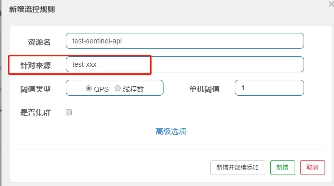 

- 访问http://localhost:8010/test/sentinelapi?a=ddd 频率过快就会降级，如果设置为其他来源，则不会降级


## SphU

- 核心API，定义资源，监控保护资源


## Tracer

- 对异常进行统计


## ContextUtil

- 实现调用来源，标记调用


# @SentinelResource注解

- 底层是SentinelAPI

- https://www.imooc.com/article/289384
- 基于Sentinel 1.6.2，理论支持1.4.0+

| 属性                      | 作用                                                         | 是否必须  |
| :------------------------ | :----------------------------------------------------------- | :-------- |
| value                     | 资源名称                                                     | 是        |
| entryType                 | entry类型，标记流量的方向，取值IN/OUT，默认是OUT             | 否        |
| blockHandler              | 处理BlockException的函数名称。函数要求： 1. 必须是 `public` 2.返回类型与原方法一致 3. 参数类型需要和原方法相匹配，**并在最后加 BlockException 类型的参数**。 4. 默认需和原方法在同一个类中。若希望使用其他类的函数，可配置 `blockHandlerClass` ，并指定blockHandlerClass里面的方法。 | 否        |
| blockHandlerClass         | 存放blockHandler的类。对应的处理函数必须static修饰，否则无法解析，其他要求：同blockHandler。 | 否        |
| fallback                  | 用于在抛出异常的时候提供fallback处理逻辑。fallback函数可以针对所有类型的异常（除了 `exceptionsToIgnore` 里面排除掉的异常类型）进行处理。函数要求： 1. 返回类型与原方法一致 2. 参数类型需要和原方法相匹配，**Sentinel 1.6开始，也可在方法最后**加 `Throwable` 类型的参数。 3.默认需和原方法在同一个类中。若希望使用其他类的函数，可配置 `fallbackClass` ，并指定fallbackClass里面的方法。 | 否        |
| fallbackClass【1.6】      | 存放fallback的类。对应的处理函数必须static修饰，否则无法解析，其他要求：同fallback。 | 否        |
| defaultFallback【1.6】    | 用于通用的 fallback 逻辑。默认fallback函数可以针对所有类型的异常（除了 `exceptionsToIgnore` 里面排除掉的异常类型）进行处理。若同时配置了 fallback 和 defaultFallback，以fallback为准。函数要求： 1. 返回类型与原方法一致 2. 方法参数列表为空，**或者有一个** `Throwable` 类型的参数。 3. 默认需要和原方法在同一个类中。若希望使用其他类的函数，可配置 `fallbackClass` ，并指定 `fallbackClass` 里面的方法。 | 否        |
| exceptionsToIgnore【1.6】 | 指定排除掉哪些异常。排除的异常不会计入异常统计，也不会进入fallback逻辑，而是原样抛出。 | 否        |
| exceptionsToTrace         | 需要trace的异常                                              | Throwable |

> **TIPS**
>
> - 1.6.0 之前的版本 fallback 函数只针对降级异常（`DegradeException`）进行处理，**不能针对业务异常进行处理**。
> - 若 blockHandler 和 fallback 都进行了配置，则被限流降级而抛出 `BlockException` 时只会进入 `blockHandler` 处理逻辑。若未配置 `blockHandler`、`fallback` 和 `defaultFallback`，则被限流降级时会将 `BlockException` **直接抛出**。
> - 从 1.4.0 版本开始，注解方式定义资源支持自动统计业务异常，无需手动调用 `Tracer.trace(ex)` 来记录业务异常。Sentinel 1.4.0 以前的版本需要自行调用 `Tracer.trace(ex)` 来记录业务异常。


示例：重复上一个例子

```java
@GetMapping("/sentinelapi2")
// 注解不支持来源
// 默认会捕获所有的异常
@SentinelResource(
    value = "test-sentinel-api2",
    blockHandler = "block",
    fallback = "fallback")
public String testSentinelAPI2(
    @RequestParam(required = false) String a){

    // 业务方法
    if(StringUtils.isBlank(a)){
        throw new IllegalArgumentException("不能为空");
    }
    return a;
}

// blockHandler对应的方法，需要入参和返回值同调用方法基本一致
public String block(String a,BlockException e){
    // 如果被保护的资源被限流或者降级了，则抛出该异常
    log.warn("限流，降级 {}", e);
    return "限流 block";
}

//处理降级，sentinel1.6可以传throwable类型参数
public String fallback(String a){
    return "降级";
}

```

- 访问http://localhost:8010/test/sentinelapi2?a=ddd 
  - 可以设置流量熔断以及降级规则


优化示例

- 将处理代码抽取出一个类

```java
package com.stt.contentcenter.sentinel.test;

import com.alibaba.csp.sentinel.slots.block.BlockException;
import lombok.extern.slf4j.Slf4j;

@Slf4j
public class TestControllerBlockHandlerClass {
	// blockHandler对应的方法，需要入参和返回值同调用方法基本一致
	public static String block(String a,BlockException e){
		// 如果被保护的资源被限流或者降级了，则抛出该异常
		log.warn("限流，降级 {}", e);
		return "限流 block";
	}
}
```

```java
@GetMapping("/sentinelapi3")
// 注解不支持来源
// 默认会捕获所有的异常
@SentinelResource(
    value = "test-sentinel-api3",
    blockHandler = "block",
    blockHandlerClass = TestControllerBlockHandlerClass.class,
    fallback = "fallback")
public String testSentinelAPI3( @RequestParam(required = false) String a){
    // 业务方法
    if(StringUtils.isBlank(a)){
        throw new IllegalArgumentException("不能为空");
    }
    return a;
}
```

- 源码
- com.alibaba.csp.sentinel.annotation.aspectj.SentinelResourceAspect
- com.alibaba.csp.sentinel.annotation.aspectj.AbstractSentinelAspectSupport


# RestTemplate整合Sentinel

- 使用@SentinelRestTemplate

```java
@Bean
@LoadBalanced
@SentinelRestTemplate(
    blockHandler = "block",
    fallback = "fallback",
    blockHandlerClass = BlockAndFallBack.class,
    fallbackClass = BlockAndFallBack.class
)
public RestTemplate restTemplate(){
    return new RestTemplate();
}
```

- 定义异常处理

```java
package com.stt.contentcenter.sentinel.test;

import com.alibaba.csp.sentinel.slots.block.BlockException;


import org.springframework.cloud.alibaba.sentinel.rest.SentinelClientHttpResponse;
import org.springframework.http.HttpRequest;
import org.springframework.http.client.ClientHttpRequestExecution;

public class BlockAndFallBack {
	public static SentinelClientHttpResponse block(HttpRequest httpRequest,
	                           byte[] bytes,
	                           ClientHttpRequestExecution clientHttpRequestExecution,
	                           BlockException e){
		return new SentinelClientHttpResponse("custom block info");
	}

	public static SentinelClientHttpResponse fallback(HttpRequest httpRequest,
	                              byte[] bytes,
	                              ClientHttpRequestExecution clientHttpRequestExecution,
	                              BlockException e){
		return new SentinelClientHttpResponse("custom fallback info");
	}
}
```

- 示例

```java
@Autowired
private RestTemplate restTemplate;

@GetMapping("/test/sentinelRestTemplate/{userId}")
public UserDTO testSentinelRestTemplate(@PathVariable Integer userId){
    return this.restTemplate.getForObject(
        "http://user-center/users/{userId}",
        UserDTO.class,
        userId
    );
}
```

- 访问http://localhost:8010/test/sentinelRestTemplate/1
- 查看控制台，设置流控，可以发现生效

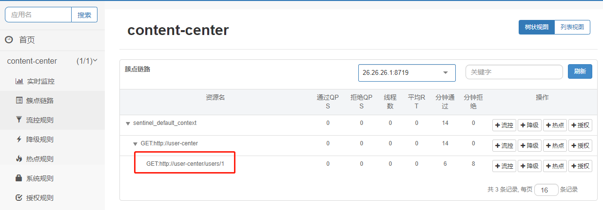


## 开关

- yml

```yml
resttemplate:
  sentinel:
  # 关闭SentinelRestTemplate注解
    enabled: false
```

- 关闭后在控制台资源就不可见了
- 作用：在开发时，不想被干扰


## 源码

- org.springframework.cloud.alibaba.sentinel.custom.SentinelBeanPostProcessor


# Feign整合Sentinel

- yml

```yml
feign:
  client:
    config:
    # 全局配置
      default:
        loggerLevel: full
  httpclient:
  # 使用apache httpclient 而不是默认的urlConnection
    enabled: true
    # feign的最大连接数
    max-connections: 200
    # feign的单个路径的最大连接数
    max-connections-per-route: 50
  sentinel:
  # 给feign整合sentinel
    enabled: true
```

- 访问http://localhost:8010/shares/1 可以看到控制台多出了连接信息

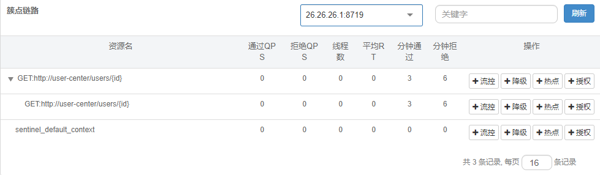

- 对feign进行自定义流控处理
- 方式1：无法获取到异常信息

```java
package com.stt.contentcenter.sentinel.test;

import com.stt.contentcenter.domain.dto.user.UserDTO;
import com.stt.contentcenter.feign.client.UserCenterFeignClient;
import org.springframework.context.annotation.Configuration;

@Component
public class UserFeignFallBack implements UserCenterFeignClient{
	@Override
	public UserDTO findById(Integer id) {
		UserDTO userDTO = new UserDTO();
		userDTO.setWxNickname("流控中");
		return userDTO;
	}
}
```

- 方式2：可以获取到异常信息

```java
package com.stt.contentcenter.sentinel.test;

import com.stt.contentcenter.domain.dto.user.UserDTO;
import com.stt.contentcenter.feign.client.UserCenterFeignClient;
import feign.hystrix.FallbackFactory;
import lombok.extern.slf4j.Slf4j;
import org.springframework.stereotype.Component;

@Slf4j
@Component
public class UserFeignFallBackFactory implements FallbackFactory<UserCenterFeignClient>{

	@Override
	public UserCenterFeignClient create(Throwable throwable) {
		return id -> {
			log.warn("远程限流或降级",throwable);
			UserDTO userDTO = new UserDTO();
			userDTO.setWxNickname("限流中");
			return userDTO;
		};
	}
}
```

- feign客户端

```java
package com.stt.contentcenter.feign.client;

import com.stt.contentcenter.configuration.UserCenterFeignConfiguration;
import com.stt.contentcenter.domain.dto.user.UserDTO;
import com.stt.contentcenter.sentinel.test.UserFeignFallBack;
import com.stt.contentcenter.sentinel.test.UserFeignFallBackFactory;
import org.springframework.cloud.openfeign.FeignClient;
import org.springframework.stereotype.Component;
import org.springframework.web.bind.annotation.GetMapping;
import org.springframework.web.bind.annotation.PathVariable;

@Component
@FeignClient(
		name="user-center",
// fallback拿不到异常，fallback与fallbackFactory只能存在一个
//		fallback = UserFeignFallBack.class
		fallbackFactory = UserFeignFallBackFactory.class
)
public interface UserCenterFeignClient {

	/**
	 * http://user-center/users/{id}
	 * @param id
	 * @return
	 */
	@GetMapping("/users/{id}")
	UserDTO findById(@PathVariable(value="id") Integer id);
}
```


## 源码

- org.springframework.cloud.alibaba.sentinel.feign.SentinelFeign


# 使用总结

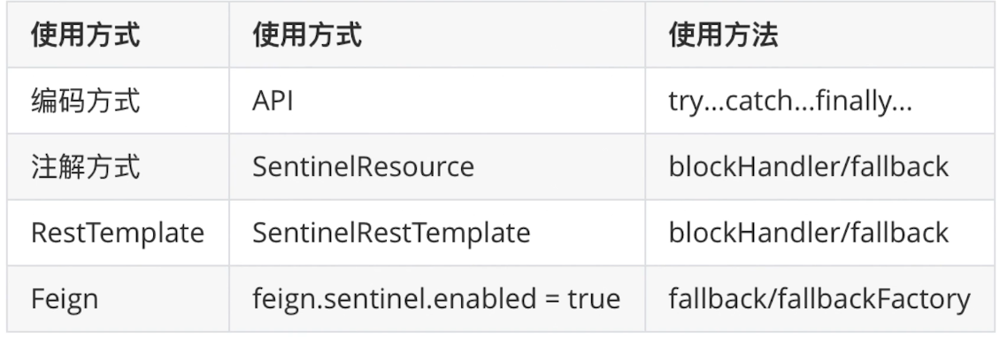 


# 规则持久化

- 将配置的规则持久化
- 2种模式的持久化
  - 拉模式 https://www.imooc.com/article/289402
  - 推模式 https://www.imooc.com/article/289464


## 拉模式

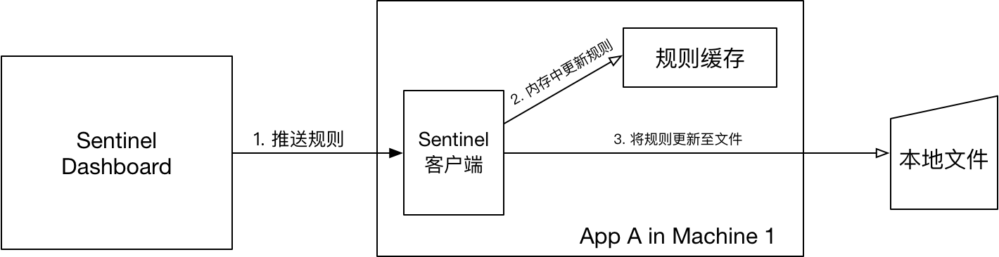

- 原理
  - FileRefreshableDataSource **定时**从指定文件中读取规则JSON文件【图中的本地文件】，如果发现文件发生变化，就更新规则缓存
  - FileWritableDataSource 接收控制台规则推送，并根据配置，修改规则JSON文件【图中的本地文件】

- pom

```xml
<dependency>
  <groupId>com.alibaba.csp</groupId>
  <artifactId>sentinel-datasource-extension</artifactId>
</dependency>
```

- 代码

```java
package com.stt.contentcenter.sentinel.test;

import com.alibaba.csp.sentinel.command.handler.ModifyParamFlowRulesCommandHandler;
import com.alibaba.csp.sentinel.datasource.*;
import com.alibaba.csp.sentinel.init.InitFunc;
import com.alibaba.csp.sentinel.slots.block.authority.AuthorityRule;
import com.alibaba.csp.sentinel.slots.block.authority.AuthorityRuleManager;
import com.alibaba.csp.sentinel.slots.block.degrade.DegradeRule;
import com.alibaba.csp.sentinel.slots.block.degrade.DegradeRuleManager;
import com.alibaba.csp.sentinel.slots.block.flow.FlowRule;
import com.alibaba.csp.sentinel.slots.block.flow.FlowRuleManager;
import com.alibaba.csp.sentinel.slots.block.flow.param.ParamFlowRule;
import com.alibaba.csp.sentinel.slots.block.flow.param.ParamFlowRuleManager;
import com.alibaba.csp.sentinel.slots.system.SystemRule;
import com.alibaba.csp.sentinel.slots.system.SystemRuleManager;
import com.alibaba.csp.sentinel.transport.util.WritableDataSourceRegistry;
import com.alibaba.fastjson.JSON;
import com.alibaba.fastjson.TypeReference;

import java.io.File;
import java.io.IOException;
import java.util.List;

/**
 * 拉模式规则持久化
 *
 * @author itmuch.com
 */
public class FileDataSourceInit implements InitFunc {

    @Override
    public void init() throws Exception {
        // TIPS: 如果你对这个路径不喜欢，可修改为你喜欢的路径
        String ruleDir = System.getProperty("user.home") + "/sentinel/rules";
        String flowRulePath = ruleDir + "/flow-rule.json";
        String degradeRulePath = ruleDir + "/degrade-rule.json";
        String systemRulePath = ruleDir + "/system-rule.json";
        String authorityRulePath = ruleDir + "/authority-rule.json";
        String paramFlowRulePath = ruleDir + "/param-flow-rule.json";

        this.mkdirIfNotExits(ruleDir);
        this.createFileIfNotExits(flowRulePath);
        this.createFileIfNotExits(degradeRulePath);
        this.createFileIfNotExits(systemRulePath);
        this.createFileIfNotExits(authorityRulePath);
        this.createFileIfNotExits(paramFlowRulePath);

        // 流控规则
        ReadableDataSource<String, List<FlowRule>> flowRuleRDS = new FileRefreshableDataSource<>(
            flowRulePath,
            flowRuleListParser
        );
        // 将可读数据源注册至FlowRuleManager
        // 这样当规则文件发生变化时，就会更新规则到内存
        FlowRuleManager.register2Property(flowRuleRDS.getProperty());
        WritableDataSource<List<FlowRule>> flowRuleWDS = new FileWritableDataSource<>(
            flowRulePath,
            this::encodeJson
        );
        // 将可写数据源注册至transport模块的WritableDataSourceRegistry中
        // 这样收到控制台推送的规则时，Sentinel会先更新到内存，然后将规则写入到文件中
        WritableDataSourceRegistry.registerFlowDataSource(flowRuleWDS);

        // 降级规则
        ReadableDataSource<String, List<DegradeRule>> degradeRuleRDS = new FileRefreshableDataSource<>(
            degradeRulePath,
            degradeRuleListParser
        );
        DegradeRuleManager.register2Property(degradeRuleRDS.getProperty());
        WritableDataSource<List<DegradeRule>> degradeRuleWDS = new FileWritableDataSource<>(
            degradeRulePath,
            this::encodeJson
        );
        WritableDataSourceRegistry.registerDegradeDataSource(degradeRuleWDS);

        // 系统规则
        ReadableDataSource<String, List<SystemRule>> systemRuleRDS = new FileRefreshableDataSource<>(
            systemRulePath,
            systemRuleListParser
        );
        SystemRuleManager.register2Property(systemRuleRDS.getProperty());
        WritableDataSource<List<SystemRule>> systemRuleWDS = new FileWritableDataSource<>(
            systemRulePath,
            this::encodeJson
        );
        WritableDataSourceRegistry.registerSystemDataSource(systemRuleWDS);

        // 授权规则
        ReadableDataSource<String, List<AuthorityRule>> authorityRuleRDS = new FileRefreshableDataSource<>(
            authorityRulePath,
            authorityRuleListParser
        );
        AuthorityRuleManager.register2Property(authorityRuleRDS.getProperty());
        WritableDataSource<List<AuthorityRule>> authorityRuleWDS = new FileWritableDataSource<>(
            authorityRulePath,
            this::encodeJson
        );
        WritableDataSourceRegistry.registerAuthorityDataSource(authorityRuleWDS);

        // 热点参数规则
        ReadableDataSource<String, List<ParamFlowRule>> paramFlowRuleRDS = new FileRefreshableDataSource<>(
            paramFlowRulePath,
            paramFlowRuleListParser
        );
        ParamFlowRuleManager.register2Property(paramFlowRuleRDS.getProperty());
        WritableDataSource<List<ParamFlowRule>> paramFlowRuleWDS = new FileWritableDataSource<>(
            paramFlowRulePath,
            this::encodeJson
        );
        ModifyParamFlowRulesCommandHandler.setWritableDataSource(paramFlowRuleWDS);
    }

    private Converter<String, List<FlowRule>> flowRuleListParser = source -> JSON.parseObject(
        source,
        new TypeReference<List<FlowRule>>() {
        }
    );
    private Converter<String, List<DegradeRule>> degradeRuleListParser = source -> JSON.parseObject(
        source,
        new TypeReference<List<DegradeRule>>() {
        }
    );
    private Converter<String, List<SystemRule>> systemRuleListParser = source -> JSON.parseObject(
        source,
        new TypeReference<List<SystemRule>>() {
        }
    );

    private Converter<String, List<AuthorityRule>> authorityRuleListParser = source -> JSON.parseObject(
        source,
        new TypeReference<List<AuthorityRule>>() {
        }
    );

    private Converter<String, List<ParamFlowRule>> paramFlowRuleListParser = source -> JSON.parseObject(
        source,
        new TypeReference<List<ParamFlowRule>>() {
        }
    );

    private void mkdirIfNotExits(String filePath) throws IOException {
        File file = new File(filePath);
        if (!file.exists()) {
            file.mkdirs();
        }
    }

    private void createFileIfNotExits(String filePath) throws IOException {
        File file = new File(filePath);
        if (!file.exists()) {
            file.createNewFile();
        }
    }

    private <T> String encodeJson(T t) {
        return JSON.toJSONString(t);
    }
}
```

- 配置
  - 在项目的 `resources/META-INF/services` 目录下创建文件，名为 `com.alibaba.csp.sentinel.init.InitFunc` ，内容为：

```
# 改成上面FileDataSourceInit的包名类名全路径即可。
com.stt.contentcenter.sentinel.test.FileDataSourceInit
```

- 测试，设置流控规则，关闭服务，关闭控制台后重启，查看是否依然存在


### 优缺点

优点

- 简单易懂
- 没有多余依赖（比如配置中心、缓存等）

缺点

- 由于规则是用 FileRefreshableDataSource 定时更新的，所以规则更新会有延迟。如果FileRefreshableDataSource定时时间过大，可能长时间延迟；如果FileRefreshableDataSource过小，又会影响性能；
- 规则存储在本地文件，如果有一天需要迁移微服务，那么需要把规则文件一起迁移，否则规则会丢失


## 推模式

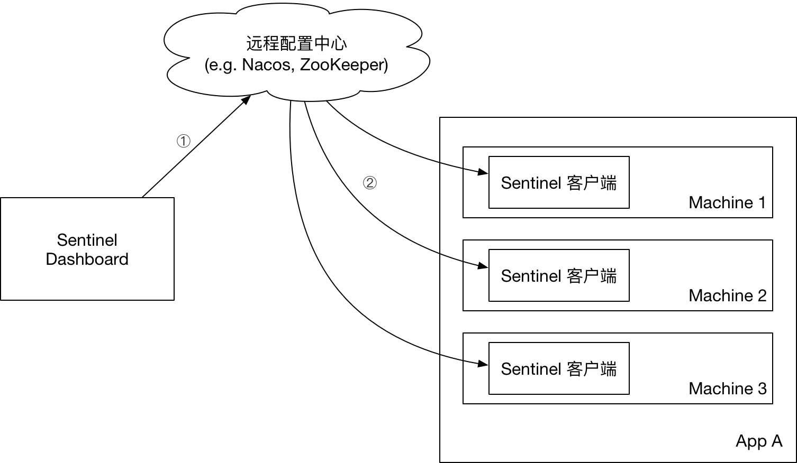

控制台推送规则

- 将规则推送到Nacos或其他远程配置中心
- Sentinel客户端链接Nacos，获取规则配置；并监听Nacos配置变化，如发生变化，就更新本地缓存（从而让本地缓存总是和Nacos一致）

控制台监听Nacos配置变化，如发生变化就更新本地缓存（从而让控制台本地缓存总是和Nacos一致）

- pom

```xml
<dependency>
    <groupId>com.alibaba.csp</groupId>
    <artifactId>sentinel-datasource-nacos</artifactId>
</dependency>
```

- yml

```yml
spring:
  cloud:
    sentinel:
      datasource:
        # 名称随意
        flow:
          nacos:
            server-addr: localhost:8848
            dataId: ${spring.application.name}-flow-rules
            groupId: SENTINEL_GROUP
            # 规则类型，取值见：
            # org.springframework.cloud.alibaba.sentinel.datasource.RuleType
            rule-type: flow
        degrade:
          nacos:
            server-addr: localhost:8848
            dataId: ${spring.application.name}-degrade-rules
            groupId: SENTINEL_GROUP
            rule-type: degrade
        system:
          nacos:
            server-addr: localhost:8848
            dataId: ${spring.application.name}-system-rules
            groupId: SENTINEL_GROUP
            rule-type: system
        authority:
          nacos:
            server-addr: localhost:8848
            dataId: ${spring.application.name}-authority-rules
            groupId: SENTINEL_GROUP
            rule-type: authority
        param-flow:
          nacos:
            server-addr: localhost:8848
            dataId: ${spring.application.name}-param-flow-rules
            groupId: SENTINEL_GROUP
            rule-type: param-flow
```

第三方集成 https://github.com/eacdy/Sentinel-Dashboard-Nacos

下载说明：https://github.com/eacdy/Sentinel-Dashboard-Nacos/releases

也可以和redis进行整合


# 生产环境使用

- 推模式更好
- AHAS：alibaba在线sentinel，可以进行持久化
  - 开通地址：https://ahas.console.aliyun.com/
  - 开通说明：https://help.aliyun.com/document_detail/90323.html
- pom

```xml
<dependency>
    <groupId>org.springframework.cloud</groupId>
    <artifactId>spring-cloud-starter-alibaba-sentinel</artifactId>
    <exclusions>
        <exclusion>
            <groupId>com.alibaba.csp</groupId>
            <artifactId>sentinel-transport-simple-http</artifactId>
        </exclusion>
    </exclusions>
</dependency>
```

- http接口埋点：jar包支持 springcloud alibaba支持
- 普通接口埋点：jar包支持
- yml

```yml
ahas.namespace :default
project.name: AppName
ahas.license: xxxxx
# 将原先的本地的sentinel的端口注释掉
```

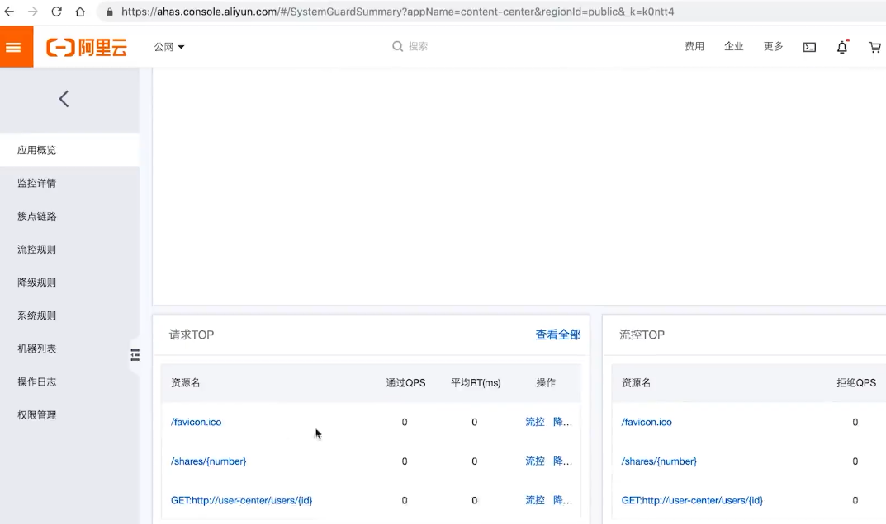


# 集群流控

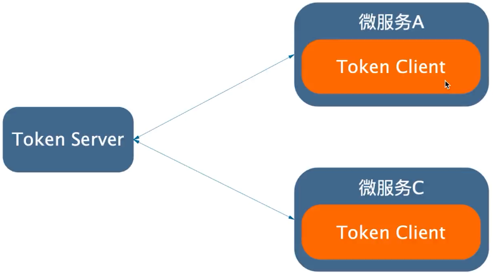 

官方文档：https://github.com/alibaba/Sentinel/wiki/集群流控

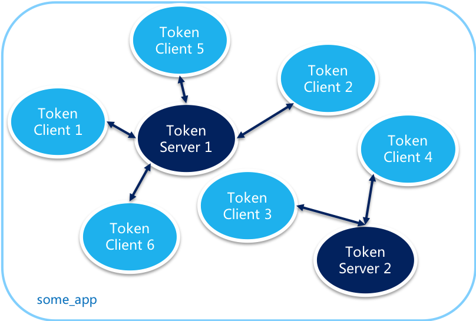 

为什么要使用集群流控呢？假设我们希望给某个用户限制调用某个 API 的总 QPS 为 50，但机器数可能很多（比如有 100 台）。这时候我们很自然地就想到，找一个 server 来专门来统计总的调用量，其它的实例都与这台 server 通信来判断是否可以调用。这就是最基础的集群流控的方式。

另外集群流控还可以解决流量不均匀导致总体限流效果不佳的问题。假设集群中有 10 台机器，我们给每台机器设置单机限流阈值为 10 QPS，理想情况下整个集群的限流阈值就为 100 QPS。不过实际情况下流量到每台机器可能会不均匀，会导致总量没有到的情况下某些机器就开始限流。因此仅靠单机维度去限制的话会无法精确地限制总体流量。而集群流控可以精确地控制整个集群的调用总量，结合单机限流兜底，可以更好地发挥流量控制的效果。

集群流控中共有两种身份：

- Token Client：集群流控客户端，用于向所属 Token Server 通信请求 token。集群限流服务端会返回给客户端结果，决定是否限流。
- Token Server：即集群流控服务端，处理来自 Token Client 的请求，根据配置的集群规则判断是否应该发放 token（是否允许通过）

tokenServer目前版本有单点故障，不支持转，选举等，还不适合生产

使用api网关可以实现集群流控的效果

- 其他实现
  - https://www.jianshu.com/p/bb198c08b418


# 扩展

 

## 错误页面优化

- UrlBlockHandler

```java
package com.stt.contentcenter.sentinel.test;

import com.alibaba.csp.sentinel.adapter.servlet.callback.UrlBlockHandler;
import com.alibaba.csp.sentinel.slots.block.BlockException;
import com.alibaba.csp.sentinel.slots.block.authority.AuthorityException;
import com.alibaba.csp.sentinel.slots.block.degrade.DegradeException;
import com.alibaba.csp.sentinel.slots.block.flow.FlowException;
import com.alibaba.csp.sentinel.slots.block.flow.param.ParamFlowException;
import com.alibaba.csp.sentinel.slots.system.SystemBlockException;
import com.fasterxml.jackson.databind.ObjectMapper;
import lombok.AllArgsConstructor;
import lombok.Builder;
import lombok.Data;
import lombok.NoArgsConstructor;
import org.springframework.stereotype.Component;

import javax.servlet.http.HttpServletRequest;
import javax.servlet.http.HttpServletResponse;
import java.io.IOException;

@Component
public class MyUrlBlockHandler implements UrlBlockHandler {
	@Override
	public void blocked(HttpServletRequest httpServletRequest,
	                    HttpServletResponse httpServletResponse,
	                    BlockException e) throws IOException {

		ErrorMsg msg = null;
		if (e instanceof FlowException){
			msg = ErrorMsg.builder().status(100).msg("限流").build();
		} else if(e instanceof DegradeException){
			msg = ErrorMsg.builder().status(101).msg("降级").build();
		} else if (e instanceof ParamFlowException) {
			msg = ErrorMsg.builder().status(102).msg("热点参数限流").build();
		} else if(e instanceof SystemBlockException){
			msg = ErrorMsg.builder().status(103).msg("系统参数限流").build();
		}else if (e instanceof AuthorityException) {
			msg = ErrorMsg.builder().status(103).msg("授权规则不通过").build();
		}
		httpServletResponse.setStatus(500);
		httpServletResponse.setCharacterEncoding("utf-8");
		httpServletResponse.setHeader("Content-Type","application/json;charset=utf-8");
		httpServletResponse.setContentType("application/json;charset=utf-8");
		// springmvc 自带的json操作工具
		new ObjectMapper().writeValue(
				httpServletResponse.getWriter(),msg
		);
	}
}

@Data
@Builder
@NoArgsConstructor
@AllArgsConstructor
class ErrorMsg {
	private Integer status;
	private String msg;
}
```

- 多次访问

```json
// http://localhost:8010/shares/1

{
  "status": 100,
  "msg": "限流"
}
```


## 区分来源

- 流控规则：针对来源
- 授权规则：流控应用，需要区分来源
- RequestOriginParser

```java
package com.stt.contentcenter.sentinel.test;

import com.alibaba.csp.sentinel.adapter.servlet.callback.RequestOriginParser;
import org.apache.commons.lang.StringUtils;
import org.springframework.stereotype.Component;

import javax.servlet.http.HttpServletRequest;


@Component
public class MyRequestOriginParser implements RequestOriginParser {

	@Override
	public String parseOrigin(HttpServletRequest request) {
		// 从请求参数中获取 origin的参数并返回
		// 如果获取不到origin参数，则抛出异常
		String origin = request.getParameter("the-origin");
		if(StringUtils.isBlank(origin)){
			throw new IllegalArgumentException("origin must be specified");
		}
		return origin;
	}
}
```

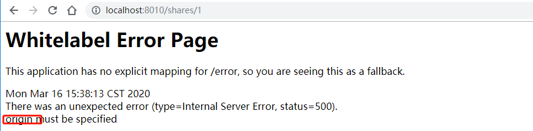

- 添加the-origin后访问成功http://localhost:8010/shares/1?the-origin=browser

- 对来源进行授权操作

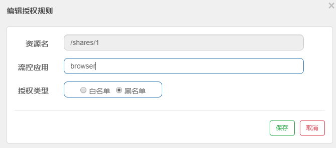  

```json
// http://localhost:8010/shares/1?the-origin=browser

{
  "status": 103,
  "msg": "授权规则不通过"
}
```

- 同理可以最针对来源进行限流

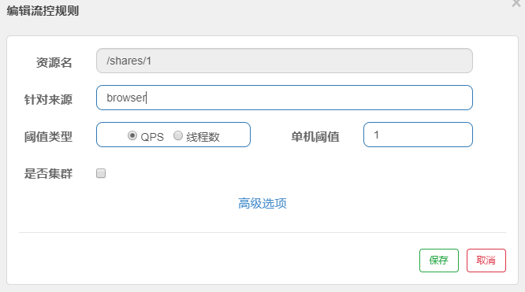 

- 实际项目中，将origin放在header中传递


## RestfulURL支持

- 对url进行通用配置
- UrlCleaner

```java
package com.stt.contentcenter.sentinel.test;

import com.alibaba.csp.sentinel.adapter.servlet.callback.UrlCleaner;
import lombok.extern.slf4j.Slf4j;
import org.apache.commons.lang.math.NumberUtils;
import org.springframework.stereotype.Component;

import java.util.Arrays;

@Component
@Slf4j
public class MyUrlCleaner implements UrlCleaner {

	@Override
	public String clean(String originUrl) {
		log.info("originUrl={}",originUrl);
		// 让shares/1与shares/2返回值相同

		String[] split = originUrl.split("/");

		String re = Arrays.stream(split).map(s -> {
			if(NumberUtils.isNumber(s)){
				return "{number}";
			}
			return s;
		}).reduce((a,b) -> a+"/"+b).orElse("");

		return re;
	}
}
```

- 此时控制台显示，此时对该url限流，则number参数都会被限流

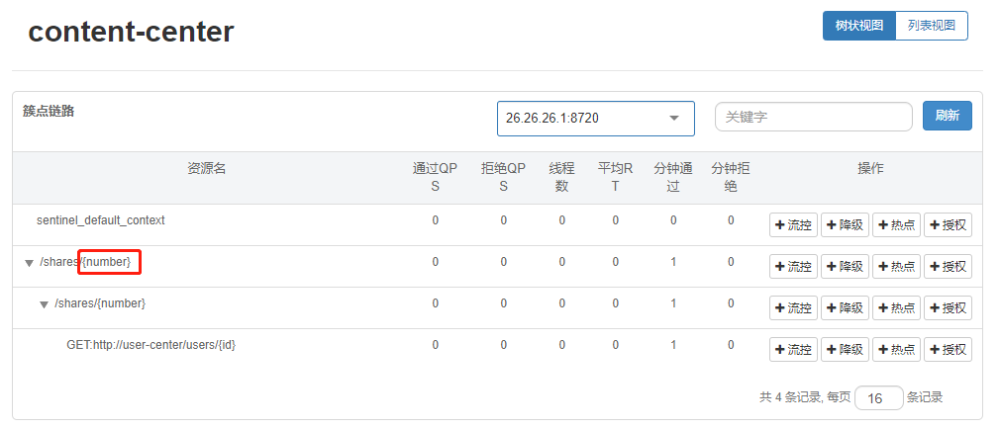

## 小结

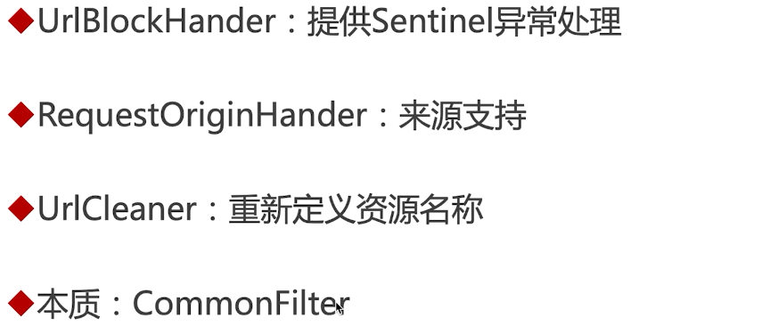 

- Serverlet的Filter
  - 如果扩展sentinel可以扩展该filter

```java
//
// Source code recreated from a .class file by IntelliJ IDEA
// (powered by Fernflower decompiler)
//

package com.alibaba.csp.sentinel.adapter.servlet;

import com.alibaba.csp.sentinel.Entry;
import com.alibaba.csp.sentinel.EntryType;
import com.alibaba.csp.sentinel.SphU;
import com.alibaba.csp.sentinel.Tracer;
import com.alibaba.csp.sentinel.adapter.servlet.callback.RequestOriginParser;
import com.alibaba.csp.sentinel.adapter.servlet.callback.UrlCleaner;
import com.alibaba.csp.sentinel.adapter.servlet.callback.WebCallbackManager;
import com.alibaba.csp.sentinel.adapter.servlet.util.FilterUtil;
import com.alibaba.csp.sentinel.context.ContextUtil;
import com.alibaba.csp.sentinel.slots.block.BlockException;
import com.alibaba.csp.sentinel.util.StringUtil;
import java.io.IOException;
import javax.servlet.Filter;
import javax.servlet.FilterChain;
import javax.servlet.FilterConfig;
import javax.servlet.ServletException;
import javax.servlet.ServletRequest;
import javax.servlet.ServletResponse;
import javax.servlet.http.HttpServletRequest;
import javax.servlet.http.HttpServletResponse;

public class CommonFilter implements Filter {
    private static final String HTTP_METHOD_SPECIFY = "HTTP_METHOD_SPECIFY";
    private static final String COLON = ":";
    private boolean httpMethodSpecify = false;
    private static final String EMPTY_ORIGIN = "";

    public CommonFilter() {
    }

    public void init(FilterConfig filterConfig) {
        this.httpMethodSpecify = Boolean.parseBoolean(filterConfig.getInitParameter("HTTP_METHOD_SPECIFY"));
    }

    public void doFilter(ServletRequest request, ServletResponse response, FilterChain chain) throws IOException, ServletException {
        HttpServletRequest sRequest = (HttpServletRequest)request;
        Entry entry = null;
        Entry methodEntry = null;

        try {
            String target = FilterUtil.filterTarget(sRequest);
            UrlCleaner urlCleaner = WebCallbackManager.getUrlCleaner();
            if (urlCleaner != null) {
                target = urlCleaner.clean(target);
            }

            String origin = this.parseOrigin(sRequest);
            ContextUtil.enter(target, origin);
            entry = SphU.entry(target, EntryType.IN);
            if (this.httpMethodSpecify) {
                methodEntry = SphU.entry(sRequest.getMethod().toUpperCase() + ":" + target, EntryType.IN);
            }

            chain.doFilter(request, response);
        } catch (BlockException var16) {
            HttpServletResponse sResponse = (HttpServletResponse)response;
            WebCallbackManager.getUrlBlockHandler().blocked(sRequest, sResponse, var16);
        } catch (IOException var17) {
            Tracer.trace(var17);
            throw var17;
        } catch (ServletException var18) {
            Tracer.trace(var18);
            throw var18;
        } catch (RuntimeException var19) {
            Tracer.trace(var19);
            throw var19;
        } finally {
            if (methodEntry != null) {
                methodEntry.exit();
            }
            if (entry != null) {
                entry.exit();
            }
            ContextUtil.exit();
        }
    }

    private String parseOrigin(HttpServletRequest request) {
        RequestOriginParser originParser = WebCallbackManager.getRequestOriginParser();
        String origin = "";
        if (originParser != null) {
            origin = originParser.parseOrigin(request);
            if (StringUtil.isEmpty(origin)) {
                return "";
            }
        }
        return origin;
    }
    public void destroy() {
    }
}
```


# 总结

- 配置总结 https://www.imooc.com/article/289562
- 常见容错方案
  - 限流
  - 超时
  - 仓壁模式：sentinel没有实现
    - 每个controller都有线程池，那么资源会浪费，性能会下降
  - 断路器