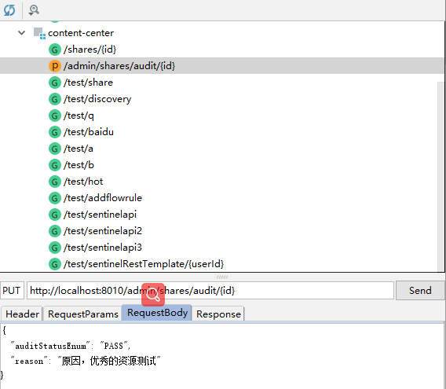

# Spring是实现异步的方式

- AsyncRestTemplate
  - https://blog.csdn.net/jiangchao858/article/details/86709750

- @Async注解
  - https://spring.io/guides/gs/async-method/

- WebClient(Spring 5.0引入)
  - 将来替代AsyncRestTemplate
- MQ

 

- MQ的使用场景
  - 异步处理
  - 流量削峰填谷
  - 解耦微服务
- MQ的选择
  - https://www.imooc.com/article/290040


# 搭建 RocketMQ

https://www.imooc.com/article/290089

http://rocketmq.apache.org/release_notes/release-notes-4.5.1/ ，下载 Binary

windows下安装https://www.jianshu.com/p/4a275e779afa

- 步骤1：环境变量

  变量名：ROCKETMQ_HOME

  变量值：MQ解压路径\MQ文件夹名

  %ROCKETMQ_HOME%\bin;

- 启动NAMESERVER，在bin文件夹下
  - start mqnamesrv.cmd
  - 启动NAMESERVER。成功后会弹出提示框

- 启动BROKER
  - Cmd命令框执行进入至‘MQ文件夹\bin’下，然后执行‘start mqbroker.cmd -n 127.0.0.1:9876 autoCreateTopicEnable=true’，启动BROKER。成功后会弹出提示框，此框勿关闭


# 搭建 RocketMQ控制台

https://www.imooc.com/article/290092

- 修改控制台（基于springboot）支持4.5.1
- 改造好的：https://github.com/eacdy/rocketmq-externals/releases

- 启动

```bash
java -jar rocketmq-console-ng-1.0.1.jar
```

- 访问http://localhost:17890/#/ 在配置中设置的是17890，原先默认的是8080

- 使用文档：https://github.com/eacdy/rocketmq-externals/blob/master/rocketmq-console/doc/1_0_0/UserGuide_CN.md


# 术语，概念


## Topic 主题

- 一类消息的集合，RocketMQ的基本订阅单位


## 消息模型

- Producer 生产者
- Consumer 消费者
- Broker 消息代理，存储消息，转发消息


## 部署结构

- Name Server 名字代理
  - 生产者、消费者通过名字服务查找各主题相应的Broker
  - 记录topic和broker之间的映射关系
- Broker Server 代理服务器
  - 消息中转的角色，负责存储消息，转发消息


## 消费模式

- Pull Consumer 拉取式消费
  - 应用调用Consumer 的拉取信息的方法从Broker中拉取消息
- Push Consumer 推动式消费
  - Broker 收到消息后，主动推送给消费端，实时性高


## Group 组

- Producer Group 生产者组
  - 同一类Producer的集合，该类Producer发送同一类消息
- Consumer Group 消费者组
  - 同一类Consumer的集合，该类Consumer通常消费同


## 消息的传播模式

- Clustering 集群
  - 相同Consumer Group 的每个Consumer实例平均分摊消息
- Broadcasting 广播
  - 相同Consumer Group 的每个Consumer实例都接收全量的消息


## 消息类型

- 普通消息
- 顺序消息
- 定时、延时消息
- 事务消息


# 进阶文档

https://github.com/apache/rocketmq/tree/master/docs/cn


# 编写生产者

- pom

```xml
<dependency>
    <groupId>org.apache.rocketmq</groupId>
    <artifactId>rocketmq-spring-boot-starter</artifactId>
    <!--默认版本是2.0.2，对应的是4.4.0 与使用的rocketmq4.5.1不是完全兼容-->
    <version>2.0.3</version>
</dependency>
```

- 配置

```yml
rocketmq:
  name-server: localhost:9876
  producer:
  # 必须指定group
    group: test-group
```

- 实现
- 消息体

```java
package com.stt.contentcenter.domain.msg;

import lombok.AllArgsConstructor;
import lombok.Builder;
import lombok.Data;
import lombok.NoArgsConstructor;

@Data
@NoArgsConstructor
@AllArgsConstructor
@Builder
public class UserAddBonusMsgDTO {

	// 给谁加积分
	Integer userId;
	// 加多少积分
	Integer bonus;

}
```

- 发送消息

```java
@Autowired
private RocketMQTemplate rocketMQTemplate;

public Share auditById(Integer id, ShareAuditDTO shareAuditDTO) {
    // 查询share是否存在，不存在或者audit_status != NOT_YET
    Share share = this.shareMapper.selectByPrimaryKey(id);
    if(share == null){
        throw new IllegalArgumentException("参数非法，该分享不存在");
    }
    if(!Objects.equals("NOT_YET",share.getAuditStatus())){
        throw new IllegalArgumentException("参数非法，该分享已审核通过，或审核不通过");
    }
    // 审核资源，设置状态为PASS/REJECT
    share.setAuditStatus(shareAuditDTO.getAuditStatusEnum().toString());
    this.shareMapper.updateByPrimaryKey(share);

    // 如果是PASS，则添加积分,添加积分可能是异步的
    // 发送消息给rocketmq
    // 参数1 topic 参数2 消息体
    rocketMQTemplate.convertAndSend("add-bonus",
                                    UserAddBonusMsgDTO.builder()
                                    .userId(share.getUserId())
                                    .bonus(50).
                                    build()
                                   );
    return share;
}
```

- 测试，在idea中安装插件RestfulToolkit

 

- 查看rocketMQ的控制台，消息已经发送成功


- 总结
  - RocketMQ：RocketMQTemplate
  - ActiveMQ/Artemis：JmsTemplate
  - RabbitMQ：AmqpTemplate
  - Kafka：KafkaTemplate


# 编写消费者

- 添加pom同上
- 编写收取消息代码user-content端

```java
package com.stt.contentcenter.rocketmq;

import com.stt.contentcenter.dao.user.BonusEventLogMapper;
import com.stt.contentcenter.dao.user.UserMapper;
import com.stt.contentcenter.domain.entity.user.BonusEventLog;
import com.stt.contentcenter.domain.entity.user.User;
import com.stt.contentcenter.domain.entity.user.dto.msg.UserAddBonusMsgDTO;
import org.apache.rocketmq.spring.annotation.RocketMQMessageListener;
import org.apache.rocketmq.spring.core.RocketMQListener;
import org.springframework.beans.factory.annotation.Autowired;
import org.springframework.stereotype.Service;

import java.util.Date;

// 接口的泛型是消息体，消费者的group写在代码中
@Service
@RocketMQMessageListener(topic = "add-bonus",consumerGroup = "consumer-group")
public class AddBonusListener implements RocketMQListener<UserAddBonusMsgDTO> {

	@Autowired
	UserMapper userMapper;

	@Autowired
	BonusEventLogMapper bonusEventLogMapper;

	@Override
	public void onMessage(UserAddBonusMsgDTO userAddBonusMsgDTO) {
		// 收到消息的时候，执行的业务
		// 1.为用户添加积分
		Integer userId = userAddBonusMsgDTO.getUserId();

		User user = userMapper.selectByPrimaryKey(userId);

		user.setBonus(user.getBonus()+userAddBonusMsgDTO.getBonus());

		userMapper.updateByPrimaryKeySelective(user);

		// 2.记录日志到bonus_event_log表中
		this.bonusEventLogMapper.insert(
				BonusEventLog.builder()
						.userId(userId)
						.value(userAddBonusMsgDTO.getBonus())
						.event("contribute")
						.createTime(new Date())
						.description("加积分")
						.build()
		);
	}
}
```

- 注解总结
  - RocketMQ：RocketMQMessageListener
  - ActiveMQ/Artemis：JmsListener
  - RabbitMQ：RabbitListener
  - Kafka：KafkaListener


# 分布式事务


  

- 半消息
  - Half Message
  - 暂时无法消费的消息，生产者将消息发送到了MQServer，但该消息会被标记为暂不能投递状态，存储起来
  - 消费者不会消费该消息
- 消息回查
  - Message Status Check
  - 网络断开或生产者重启可能会导致丢失事务消息的第二次确认
  - 当MQServer 发现消息长时间处于半消息状态时，将向消息生产者发送请求，询问该消息的最终状态（提交或回滚）
- 消息三态
  - Commit：提交事务消息，消费者可以消费此消息
  - Rollback：回滚事务消息，broker会删除该消息，消费者不能消费
  - UNKNOWN：broker需要回查确认该消息的状态


## 编码示例

- 建表

```sql
USE `content_center`;

-- -----------------------------------------------------
-- Table `rocketmq_transaction_log`
-- -----------------------------------------------------
create table rocketmq_transaction_log
(
  id             int auto_increment comment 'id' primary key,
  transaction_Id varchar(45) not null comment '事务id',
  log            varchar(45) not null comment '日志'
)comment 'RocketMQ事务日志表';
```

- 业务逻辑

```java
/**
	 * 分布式事务实现
	 * @param id
	 * @param shareAuditDTO
	 * @return
	 */
public Share auditById2(Integer id, ShareAuditDTO shareAuditDTO) {
    // 查询share是否存在，不存在或者audit_status != NOT_YET
    Share share = this.shareMapper.selectByPrimaryKey(id);
    if(share == null){
        throw new IllegalArgumentException("参数非法，该分享不存在");
    }
    if(!Objects.equals("NOT_YET",share.getAuditStatus())){
        throw new IllegalArgumentException("参数非法，该分享已审核通过，或审核不通过");
    }

    // 如果是PASS，那么发送消息给rocketmq 让用户中心消费
    if(AuditStatusEnum.PASS.equals(shareAuditDTO.getAuditStatusEnum())){
        // 发送半消息 rocketMQ的事务机制
        this.rocketMQTemplate.sendMessageInTransaction(
            "tx-add-bonus-group",//group
            "add-bonus",//topic
            MessageBuilder.withPayload(
                UserAddBonusMsgDTO.builder()
                .userId(share.getUserId())
                .bonus(50).build())
            .setHeader(RocketMQHeaders.TRANSACTION_ID, UUID.randomUUID().toString()) // 可以设置header
            .setHeader("shared_id",id) // header有关键作用
            .build(), // 消息体
            shareAuditDTO // arg
        );
    }else {
        this.auditByIdInDB(id,shareAuditDTO);
    }
    return share;
}

@Transactional(rollbackFor = Exception.class)
public void auditByIdInDB(Integer id,ShareAuditDTO shareAuditDTO){
    Share share = new Share();
    share.setId(id);
    // 审核资源，设置状态为PASS/REJECT
    share.setAuditStatus(shareAuditDTO.getAuditStatusEnum().toString());
    share.setReason(shareAuditDTO.getReason());
    this.shareMapper.updateByPrimaryKeySelective(share);
    // todo 把share写入缓存
}

@Autowired
RocketmqTransactionLogMapper rocketmqTransactionLogMapper;

@Transactional(rollbackFor = Exception.class)
public void aduitByIdWithRocketMqLog(Integer id,ShareAuditDTO auditDTO,String transactionId){
    this.auditByIdInDB(id,auditDTO);
    // 对本地事务进行rocketmq的日志记录
    rocketmqTransactionLogMapper.insertSelective(
        RocketmqTransactionLog.builder()
        .transactionId(transactionId)
        .log("审核分享")
        .build()
    );
}
```

- 监听器

```java
package com.stt.contentcenter.rocketmq;

import com.stt.contentcenter.dao.content.RocketmqTransactionLogMapper;
import com.stt.contentcenter.domain.dto.share.ShareAuditDTO;
import com.stt.contentcenter.domain.entity.content.RocketmqTransactionLog;
import com.stt.contentcenter.service.content.ShareService;
import lombok.extern.slf4j.Slf4j;
import org.apache.rocketmq.spring.annotation.RocketMQTransactionListener;
import org.apache.rocketmq.spring.core.RocketMQLocalTransactionListener;
import org.apache.rocketmq.spring.core.RocketMQLocalTransactionState;
import org.apache.rocketmq.spring.support.RocketMQHeaders;
import org.springframework.beans.factory.annotation.Autowired;
import org.springframework.messaging.Message;
import org.springframework.messaging.MessageHeaders;
import org.springframework.stereotype.Service;

@Service
@RocketMQTransactionListener(txProducerGroup = "tx-add-bonus-group")
@Slf4j
public class AddBonusTransactionListener implements RocketMQLocalTransactionListener{

	@Autowired
	private ShareService shareService;

	@Autowired
	private RocketmqTransactionLogMapper rocketmqTransactionLogMapper;

	// 本地事务
	@Override
	public RocketMQLocalTransactionState executeLocalTransaction(Message message, Object arg) {
		// message 是消息体，arg是auditDTO
		MessageHeaders headers = message.getHeaders();
		String transactionId = (String)headers.get(RocketMQHeaders.TRANSACTION_ID);
		Integer sharedId = Integer.valueOf((String)headers.get("shared_id"));

		try{
			shareService.aduitByIdWithRocketMqLog(sharedId,(ShareAuditDTO) arg,transactionId);
			// 为什么要进行回查，在此处挂了，那么commit就没有返回，但本地事务已经提交了
			return RocketMQLocalTransactionState.COMMIT;
		}catch (Exception e){
			e.printStackTrace();
			return RocketMQLocalTransactionState.ROLLBACK;
		}
	}

	// 本地事务的检查接口 第4步二次确认
	@Override
	public RocketMQLocalTransactionState checkLocalTransaction(Message message) {
		// 检查本地事务的状态，使用rocket的日志表
		MessageHeaders headers = message.getHeaders();
		String transactionId = (String)headers.get(RocketMQHeaders.TRANSACTION_ID);

		// select * from xxx where transaction_id = xxx
		RocketmqTransactionLog transactionLog = rocketmqTransactionLogMapper.selectOne(
				RocketmqTransactionLog.builder()
						.transactionId(transactionId)
						.build()
		);

		if(transactionLog != null){
			return RocketMQLocalTransactionState.COMMIT;
		}
		return RocketMQLocalTransactionState.ROLLBACK;
	}
}
```

