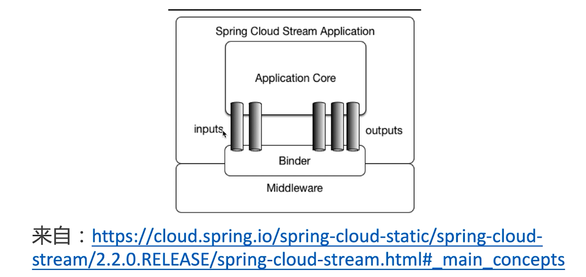
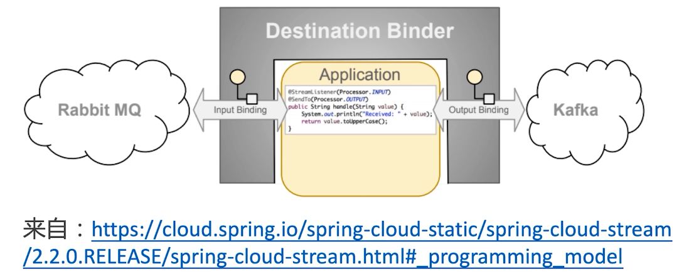
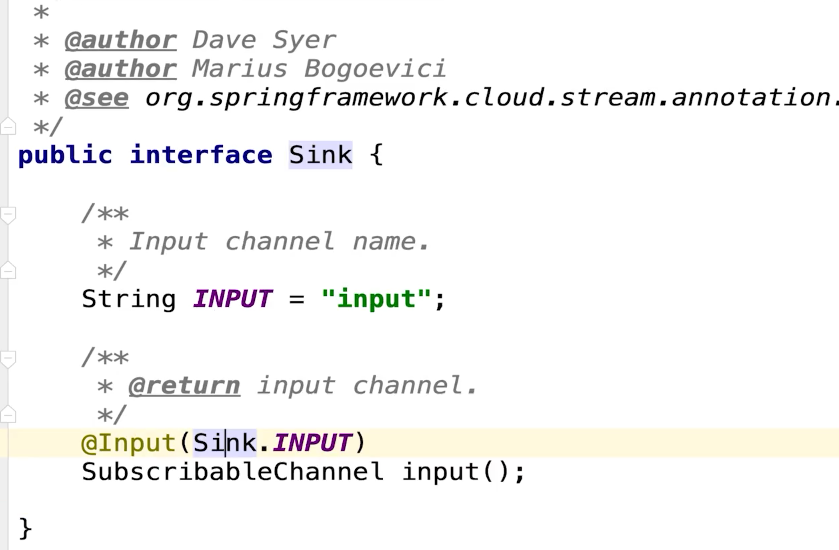

# 介绍

- 是什么？
  - 一个用于构架消息驱动的微服务框架
- 架构图
  - middleware
    - kafka
    - rabbitMQ
    - rocketMQ




# 编程模型

input 微服务接收消息

output 微服务消费消息



- Destination Binder
  - 目标绑定器
  - 与消息中间件通信的组件
- Destination Bindings
  - 目标绑定
  - Binding是连接应用程序和消息中间的桥梁
  - 用于消息的消费和生产
  - 由binder创建
- Message
  - 消息


# 编写生产者

- share-content

- pom

```xml
<dependency>
    <groupId>org.apache.rocketmq</groupId>
    <artifactId>rocketmq-spring-boot-starter</artifactId>
    <!--默认版本是2.0.2，对应的是4.4.0 与使用的rocketmq4.5.1不是完全兼容-->
    <version>2.0.3</version>
</dependency>

<dependency>
    <groupId>org.springframework.cloud</groupId>
    <artifactId>spring-cloud-starter-stream-rocketmq</artifactId>
</dependency>
```

- yml

```yml
spring:
  cloud:
    stream:
      rocketmq:
        binder:
          name-server: localhost:9876
      bindings:
        output:
        # 用于指定topic
          destination: stream-test-topic

logging:
  level:
    # feign的日志级别是建立在log日志的debug级别上的，如果是info则不会打印日志
    com.stt.contentcenter.feign.client.UserCenterFeignClient: debug
    com.alibaba.nacos: error # 避免一直打印nacos的心跳信息          
```

- 问题，日志中不断打印nacos的心跳，由于stream的jar包导致

- 启用

```java
package com.stt.contentcenter.configuration;

import org.springframework.cloud.stream.annotation.EnableBinding;
import org.springframework.cloud.stream.messaging.Source;
import org.springframework.context.annotation.Configuration;

@Configuration
@EnableBinding(Source.class)
public class StreamSourceConfig {
}
```

- 实现

```java
@Autowired(required = false)
private Source source;

@GetMapping("/stream")
public String testStream(){
    this.source.output().send(
        MessageBuilder.withPayload("测试消息").build()
    );
    return "success";
}
```

- 在rocketMQ后台管理可看到相应的记录


# 编写消费者

- user-content
- yml

```yml
spring:
  cloud:
    stream:
      rocketmq:
        binder:
          name-server: localhost:9876
      bindings:
        input:
          destination: stream-test-topic
          group: bind-group # 注意需要一个group，否则启动失败，如果不是rocketMQ则可以留空
```

- 启用

```java
package com.stt.contentcenter.configuration;

import org.springframework.cloud.stream.annotation.EnableBinding;
import org.springframework.cloud.stream.messaging.Sink;
import org.springframework.context.annotation.Configuration;

@Configuration
@EnableBinding(Sink.class)
public class StreamSinkConfig {
}
```

- 测试

```java
package com.stt.contentcenter.rocketmq;

import lombok.extern.slf4j.Slf4j;
import org.springframework.cloud.stream.annotation.StreamListener;
import org.springframework.cloud.stream.messaging.Sink;
import org.springframework.stereotype.Service;

@Service
@Slf4j
public class TestStreamConsumer {

	@StreamListener(Sink.INPUT)
	public void receive(String messageBody){
		log.info("通过stream收到了消息 msg:{}",messageBody);
	}
}
```


# 自定义接口-发送消息

- 定义接口

```java
package com.stt.contentcenter.rocketmq;

import org.springframework.cloud.stream.annotation.Output;
import org.springframework.messaging.MessageChannel;

public interface MySource {

	@Output("my-output")
	MessageChannel output();

}
```

- 配置

```java
package com.stt.contentcenter.configuration;

import com.stt.contentcenter.rocketmq.MySource;
import org.springframework.cloud.stream.annotation.EnableBinding;
import org.springframework.cloud.stream.messaging.Source;
import org.springframework.context.annotation.Configuration;

@Configuration
@EnableBinding({Source.class, MySource.class})
public class StreamSourceConfig {
}

```

- yml

```yml
spring:  
  cloud:  
    stream:
      rocketmq:
        binder:
          name-server: localhost:9876
      bindings:
        output:
        # 用于指定topic
          destination: stream-test-topic
        my-output:
          destination: stream-my-topic
```

- 测试

```java
@Autowired(required = false)
private MySource mySource;

@GetMapping("/stream2")
public String testStream2(){
    this.mySource.output().send(
        MessageBuilder.withPayload("测试消息2").build()
    );
    return "success";
}
```

- 问题：测试时发现了mybatis异常
  - 原因：配置mybatis扫描包的时候，将该接口包含，而该接口没有xml的sql实现，因此需要缩小mybatis扫描范围缩小

```bash
org.apache.ibatis.binding.BindingException: Invalid bound statement (not found): com.stt.contentcenter.rocketmq.MySource.output
	at org.apache.ibatis.binding.MapperMethod$SqlCommand.<init>(MapperMethod.java:227) ~[mybatis-3.4.6.jar:3.4.6]
```


# 自定义接口-收取消息

- 定义

```java
package com.stt.contentcenter.rocketmq;

import org.springframework.cloud.stream.annotation.Input;
import org.springframework.messaging.SubscribableChannel;
public interface MySink {
	String MY_INPUT = "my-input";

	@Input(MY_INPUT)
	SubscribableChannel input();
}
```

- 配置

```java
package com.stt.contentcenter.configuration;

import com.stt.contentcenter.rocketmq.MySink;
import org.springframework.cloud.stream.annotation.EnableBinding;
import org.springframework.cloud.stream.messaging.Sink;
import org.springframework.context.annotation.Configuration;

@Configuration
@EnableBinding({Sink.class, MySink.class})
public class StreamSinkConfig {
}
```

- yml

```yml
spring:  
  cloud:  
    stream:
      rocketmq:
        binder:
          name-server: localhost:9876
      bindings:
        input:
          destination: stream-test-topic
          group: bind-group # 注意需要一个group，否则启动失败，如果不是rocketMQ则可以留空
        my-input:
          destination: stream-my-topic
          group: my-group
```

- 测试

```java
package com.stt.contentcenter.rocketmq;

import lombok.extern.slf4j.Slf4j;
import org.springframework.cloud.stream.annotation.StreamListener;
import org.springframework.stereotype.Service;

@Service
@Slf4j
public class MyTestStreamConsumer {

	@StreamListener(MySink.MY_INPUT)
	public void receive(String msgBody){
		log.info("自定义接口消费：{}",msgBody);
	}
}
```


# 原理

 

- 使用Processor可以收发

```java
public interface Processor extends Source,Sink{}
```

- 为什么yml中配置的bindings是my-output，由于Source被IOC注入的名为my-output对象，在yml中可以读到该对象的名称，从而完成参数的注入


# 消息过滤

https://www.imooc.com/article/290424

```java
@Autowired
private Source source;

public String testStream() {
  this.source.output()
    .send(
    MessageBuilder
    .withPayload("消息体")
    .setHeader("my-header","你的header")
    .build()
  );
  return "success";
}

@Service
@Slf4j
public class TestStreamConsumer {
    @StreamListener(value = Sink.INPUT
                    ,condition = "headers['my-header']=='你的header'")
    public void receive(String messageBody) {
        log.info("通过stream收到了消息：messageBody ={}", messageBody);
    }
}

```


# 监控

- actuator

```json
// http://localhost:8010/actuator

{
  "_links": {
...
    "bindings-name": {
      "href": "http://localhost:8010/actuator/bindings/{name}",
      "templated": true
    },
    "bindings": {
      "href": "http://localhost:8010/actuator/bindings",
      "templated": false
    },
    "channels": {
      "href": "http://localhost:8010/actuator/channels",
      "templated": false
    }
  }
}
```

- 关于channel
  - outputs和my-output就是channel

```json
// http://localhost:8010/actuator/channels

{
  "outputs": {
    "output": {
      "destination": "stream-test-topic",
      "producer": {
        
      }
    },
    "my-output": {
      "destination": "stream-my-topic",
      "producer": {
        
      }
    }
  }
}
```

- 使用actuator/health可以监控rocketmq健康问题，需要配置show-details：always

```yml
management:
  endpoints:
    web:
      exposure:
        include: '*'
  endpoint:
    health:
      show-details: always #
```


# 异常处理

https://www.imooc.com/article/290435


## 全局处理

```java
package com.stt.contentcenter.rocketmq;

import lombok.extern.slf4j.Slf4j;
import org.springframework.cloud.stream.annotation.StreamListener;
import org.springframework.messaging.Message;
import org.springframework.messaging.support.ErrorMessage;
import org.springframework.stereotype.Service;

@Service
@Slf4j
public class MyTestStreamConsumer {

	@StreamListener(MySink.MY_INPUT)
	public void receive(String msgBody){
		log.info("自定义接口消费：{}",msgBody);
		throw new IllegalArgumentException("模拟抛异常");
	}

	// 全局异常处理
	// 发生异常的消息
	@StreamListener("errorChannel")
	public void error(Message<?> msg){
		ErrorMessage errorMessage = (ErrorMessage) msg;
		log.warn("发生异常：{}",errorMessage);
	}
}
```


## 局部处理

```java
@Slf4j
@SpringBootApplication
@EnableBinding({Processor.class})
@EnableScheduling
public class ConsumerApplication {
    public static void main(String[] args) {
        SpringApplication.run(ConsumerApplication.class, args);
    }

    @StreamListener(value = Processor.INPUT)
    public void handle(String body) {
        throw new RuntimeException("x");
    }

    @ServiceActivator(inputChannel = "my-destination.my-group.errors")
    public void handleError(ErrorMessage message) {
        Throwable throwable = message.getPayload();
        log.error("截获异常", throwable);

        Message<?> originalMessage = message.getOriginalMessage();
        assert originalMessage != null;

        log.info("原始消息体 = {}", new String((byte[]) originalMessage.getPayload()));
    }

    @Bean
    @InboundChannelAdapter(value = Processor.OUTPUT,
            poller = @Poller(fixedDelay = "1000", maxMessagesPerPoll = "1"))
    public MessageSource<String> test() {
        return () -> new GenericMessage<>("adfdfdsafdsfa");
    }
}
```


# 分布式事务-生产者

- 使用spring-cloud-stream实现分布式事务

- 指定output

```java
package com.stt.contentcenter.rocketmq;

import org.springframework.cloud.stream.annotation.Output;
import org.springframework.messaging.MessageChannel;

public interface MySource {

	@Output("tx-add-bonus-output")
	MessageChannel txOutput();

}
```

- 配置yml

```yml
spring:  
  cloud:  
    stream:
      rocketmq:
        binder:
          name-server: localhost:9876
        bindings: # 注意在rocketmq中的bindins
          tx-add-bonus-output:
            producer:
              transactional: true # 说明是事务消息
              group: tx-add-bonus-group # 设置group
      bindings:
        output:
        # 用于指定topic
          destination: stream-test-topic
        my-output:
          destination: stream-my-topic
        tx-add-bonus-output:
          destination: add-bonus
```

- 发送

```java
@Autowired
private MySource mySource;

public Share auditById3(Integer id, ShareAuditDTO shareAuditDTO) {
    // 查询share是否存在，不存在或者audit_status != NOT_YET
    Share share = this.shareMapper.selectByPrimaryKey(id);
    if(share == null){
        throw new IllegalArgumentException("参数非法，该分享不存在");
    }
    if(!Objects.equals("NOT_YET",share.getAuditStatus())){
        throw new IllegalArgumentException("参数非法，该分享已审核通过，或审核不通过");
    }

    // 如果是PASS，那么发送消息给rocketmq 让用户中心消费
    if(AuditStatusEnum.PASS.equals(shareAuditDTO.getAuditStatusEnum())){
        // 发送半消息 rocketMQ的事务机制
        mySource.txOutput().send(
            MessageBuilder.withPayload(
                UserAddBonusMsgDTO.builder()
                .userId(share.getUserId())
                .bonus(50).build())
            .setHeader(RocketMQHeaders.TRANSACTION_ID, UUID.randomUUID().toString()) // 可以设置header
            .setHeader("shared_id",id) // header有关键作用
            .setHeader("auditDTO", JSON.toJSONString(shareAuditDTO))
            .build() // 消息体
        );
    }else {
        this.auditByIdInDB(id,shareAuditDTO);
    }
    return share;
}
```

- 监听

```java
package com.stt.contentcenter.rocketmq;

import com.alibaba.fastjson.JSON;
import com.stt.contentcenter.dao.content.RocketmqTransactionLogMapper;
import com.stt.contentcenter.domain.dto.share.ShareAuditDTO;
import com.stt.contentcenter.domain.entity.content.RocketmqTransactionLog;
import com.stt.contentcenter.service.content.ShareService;
import lombok.extern.slf4j.Slf4j;
import org.apache.rocketmq.spring.annotation.RocketMQTransactionListener;
import org.apache.rocketmq.spring.core.RocketMQLocalTransactionListener;
import org.apache.rocketmq.spring.core.RocketMQLocalTransactionState;
import org.apache.rocketmq.spring.support.RocketMQHeaders;
import org.springframework.beans.factory.annotation.Autowired;
import org.springframework.messaging.Message;
import org.springframework.messaging.MessageHeaders;
import org.springframework.stereotype.Service;

@Slf4j
@RocketMQTransactionListener(txProducerGroup = "tx-add-bonus-group")
public class AddBonusTransactionListenerByStream implements RocketMQLocalTransactionListener{

	@Autowired
	private ShareService shareService;

	@Autowired
	private RocketmqTransactionLogMapper rocketmqTransactionLogMapper;

	// 本地事务
	@Override
	public RocketMQLocalTransactionState executeLocalTransaction(Message message, Object arg) {
		// message 是消息体，arg是null
		MessageHeaders headers = message.getHeaders();
		String transactionId = (String)headers.get(RocketMQHeaders.TRANSACTION_ID);
		Integer sharedId = Integer.valueOf((String)headers.get("shared_id"));

		ShareAuditDTO auditDTO =
				JSON.toJavaObject(JSON.parseObject(headers.get("auditDTO").toString()), ShareAuditDTO.class);

		try{
			shareService.aduitByIdWithRocketMqLog(sharedId,auditDTO,transactionId);
			// 为什么要进行回查，在此处挂了，那么commit就没有返回，但本地事务已经提交了
			return RocketMQLocalTransactionState.COMMIT;
		}catch (Exception e){
			e.printStackTrace();
			return RocketMQLocalTransactionState.ROLLBACK;
		}
	}

	// 本地事务的检查接口 第4步二次确认
	@Override
	public RocketMQLocalTransactionState checkLocalTransaction(Message message) {
		// 检查本地事务的状态，使用rocket的日志表
		MessageHeaders headers = message.getHeaders();
		String transactionId = (String)headers.get(RocketMQHeaders.TRANSACTION_ID);

		// select * from xxx where transaction_id = xxx
		RocketmqTransactionLog transactionLog = rocketmqTransactionLogMapper.selectOne(
				RocketmqTransactionLog.builder()
						.transactionId(transactionId)
						.build()
		);

		if(transactionLog != null){
			return RocketMQLocalTransactionState.COMMIT;
		}
		return RocketMQLocalTransactionState.ROLLBACK;
	}
}
```


# 分布式事务-消费者

- 指定input

```java
package com.stt.contentcenter.rocketmq;

import org.springframework.cloud.stream.annotation.Input;
import org.springframework.messaging.SubscribableChannel;

public interface MySink {
	String MY_TX_INPUT="my-tx-input";
	@Input(MY_TX_INPUT)
	SubscribableChannel txInput();
}
```

- 配置yml

```yml
spring:  
  cloud:  
    stream:
      rocketmq:
        binder:
          name-server: localhost:9876
      bindings:
        input:
          destination: stream-test-topic
          group: bind-group # 注意需要一个group，否则启动失败，如果不是rocketMQ则可以留空
        my-input:
          destination: stream-my-topic
          group: my-group
        my-tx-input: # 配置消费者
           destination: add-bonus # topic
           group: consumer-group
```


# 总结

https://www.imooc.com/article/290489