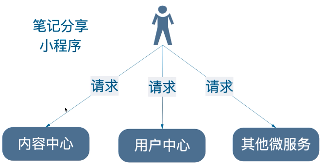
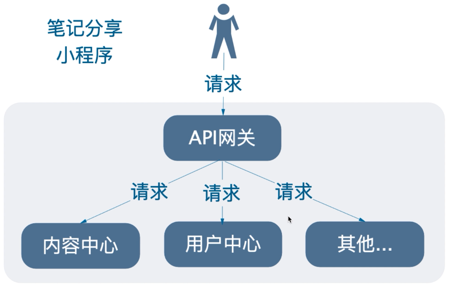
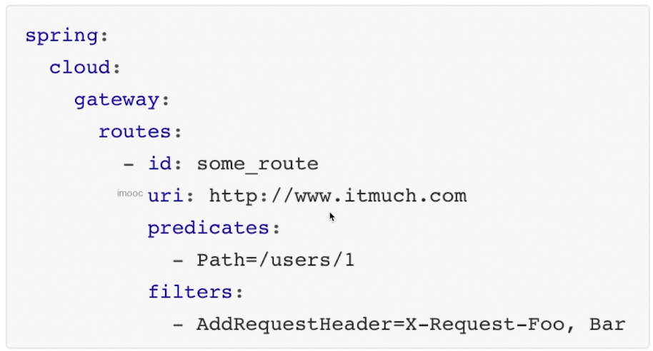
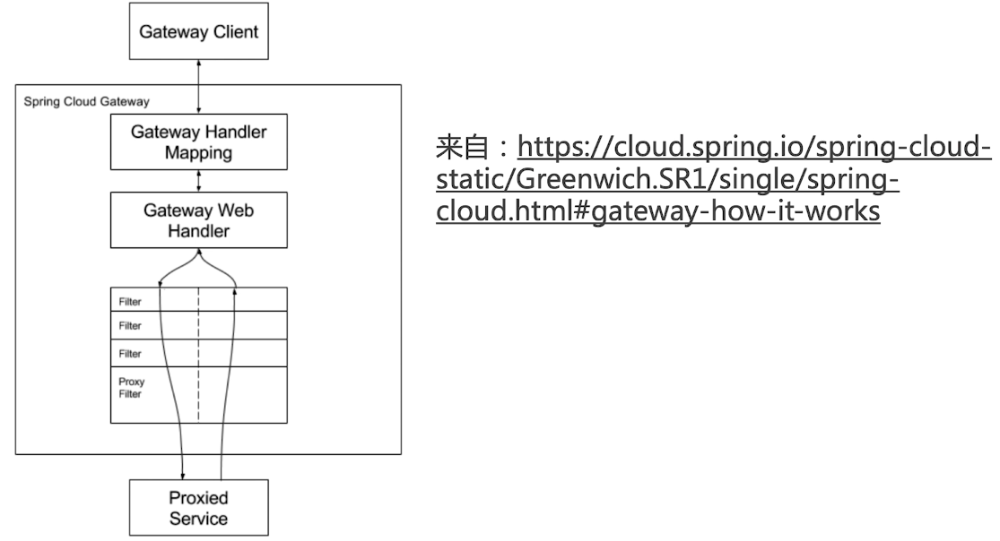
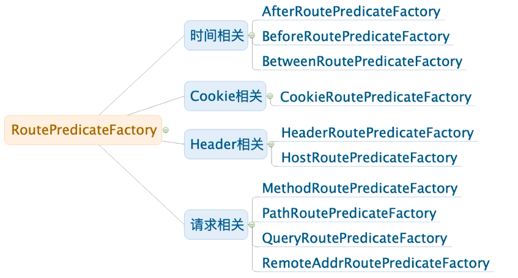
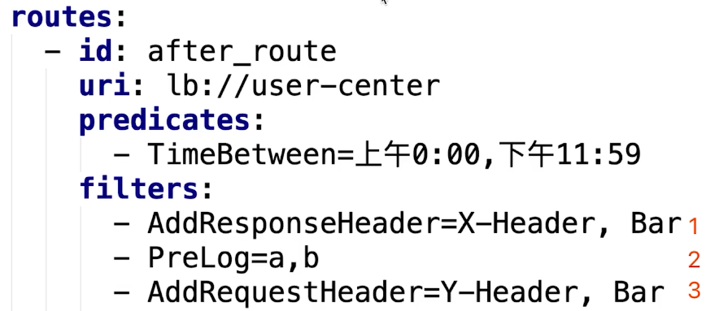
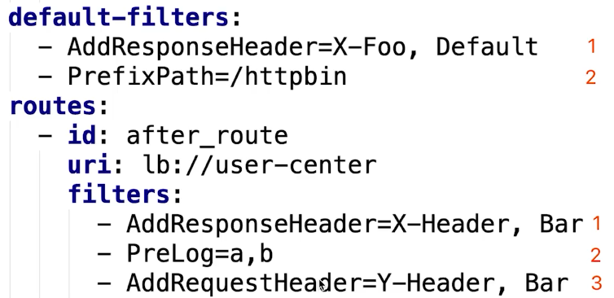

# 介绍

- 服务网关
  - 如果不使用网关，带来的问题
    - 登录认证复杂
    - 影响客户端的重构
    - 其他协议无法访问

 

- 使用服务网关

 

- spring-cloud的第二代网关，替代zuul
  - 优点
    - 基于Netty，Reactor，WebFlux构建
      - Netty是网络通信框架
      - Reactor是Reactive编程模型的实现
      - WebFlux是Reactive的实现框架
    - 是zuul的1.6倍
      - 测试：https://www.imooc.com/article/285068
    - 功能强大
      - 内置转发，监控，限流
    - 设计优雅，易扩展
  - 缺点
    - 依赖Netty和WebFlux，不是Servlet编程模型，有学习成本
    - 不能在Servlet容器下工作，不能创建war包
    - 不支持spring boot 1.x


# 使用

- pom

```xml
<?xml version="1.0" encoding="UTF-8"?>
<project xmlns="http://maven.apache.org/POM/4.0.0" xmlns:xsi="http://www.w3.org/2001/XMLSchema-instance"
	xsi:schemaLocation="http://maven.apache.org/POM/4.0.0 https://maven.apache.org/xsd/maven-4.0.0.xsd">
	<modelVersion>4.0.0</modelVersion>
	<parent>
		<groupId>org.springframework.boot</groupId>
		<artifactId>spring-boot-starter-parent</artifactId>
		<version>2.1.5.RELEASE</version>
		<relativePath/> <!-- lookup parent from repository -->
	</parent>
	<groupId>com.stt</groupId>
	<artifactId>gateway</artifactId>
	<version>0.0.1-SNAPSHOT</version>
	<name>gateway</name>
	<description>小程序网关</description>

	<properties>
		<java.version>1.8</java.version>
		<spring-cloud.version>Greenwich.SR1</spring-cloud.version>
		<spring-cloud-alibaba.version>0.9.0.RELEASE</spring-cloud-alibaba.version>
	</properties>

	<dependencies>
		<dependency>
			<groupId>org.projectlombok</groupId>
			<artifactId>lombok</artifactId>
			<optional>true</optional>
		</dependency>
		<dependency>
			<groupId>org.springframework.boot</groupId>
			<artifactId>spring-boot-starter-test</artifactId>
			<scope>test</scope>
			<exclusions>
				<exclusion>
					<groupId>org.junit.vintage</groupId>
					<artifactId>junit-vintage-engine</artifactId>
				</exclusion>
			</exclusions>
		</dependency>

		<dependency>
			<groupId>org.springframework.cloud</groupId>
			<artifactId>spring-cloud-starter-gateway</artifactId>
		</dependency>

		<dependency>
			<groupId>org.springframework.cloud</groupId>
			<artifactId>spring-cloud-starter-alibaba-nacos-discovery</artifactId>
		</dependency>

		<dependency>
			<groupId>org.springframework.boot</groupId>
			<artifactId>spring-boot-starter-actuator</artifactId>
		</dependency>


	</dependencies>

	<dependencyManagement>
		<dependencies>
			<dependency>
				<groupId>org.springframework.cloud</groupId>
				<artifactId>spring-cloud-dependencies</artifactId>
				<version>${spring-cloud.version}</version>
				<type>pom</type>
				<scope>import</scope>
			</dependency>
			<dependency>
				<groupId>org.springframework.cloud</groupId>
				<artifactId>spring-cloud-alibaba-dependencies</artifactId>
				<version>${spring-cloud-alibaba.version}</version>
				<type>pom</type>
				<scope>import</scope>
			</dependency>
		</dependencies>
	</dependencyManagement>

	<build>
		<plugins>
			<plugin>
				<groupId>org.springframework.boot</groupId>
				<artifactId>spring-boot-maven-plugin</artifactId>
			</plugin>
		</plugins>
	</build>

</project>
```

- yml

```yml
server:
  port: 8040
spring:
  application:
    # 注册到nacos的服务名称
    name: gateway
  cloud:
    nacos:
      discovery:
        server-addr: localhost:8848
        namespace: de1f60d3-097f-4421-b3b2-cf1bad41656d #dev
    gateway:
      discovery:
        locator:
        # 让gateway通过服务发现组件找到其他微服务
          enabled: true

# actuator的配置
management:
  endpoints:
    web:
      exposure:
        include: '*'
  endpoint:
    health:
      show-details: always
```

- 测试

```json
// http://localhost:8040/user-center/users/1

{
  "id": 1,
  "wxId": "33",
  "wxNickname": "张三",
  "roles": "admin",
  "avatarUrl": "xxx",
  "createTime": "2020-03-12T07:50:25.000+0000",
  "updateTime": "2020-03-12T07:50:25.000+0000",
  "bonus": 150
}


// http://localhost:8040/content-center/shares/1

{
  "id": 1,
  "userId": 1,
  "title": "spring",
  "createTime": "2020-03-12T08:04:24.000+0000",
  "updateTime": "2020-03-12T08:04:24.000+0000",
  "isOriginal": false,
  "author": "stt",
  "cover": "fff",
  "summary": "",
  "price": 0,
  "downloadUrl": "",
  "buyCount": 1,
  "showFlag": false,
  "auditStatus": "PASS",
  "reason": "ffff",
  "wxNickname": "张三"
}
```

- 转发规律
  - 访问${GATEWAY_URL}/{微服务X}/** 
    - 会转发到该微服务X的 /**路径


# 核心概念

- Route 路由
  - 基础元素
  - 转发的规则
  - 包含ID，目标URL，Predicate 集合，filter集合
- Predicate 谓词
  - 断言是否转发
  - java.util.funcition.Predicate
  - gateway使用Predicate实现路由的匹配条件
- filter 过滤器
  - 修改请求以及响应

- 配置实例
  - id表示该路由的标识
  - 访问/users/1则会进入该路由配置
  - 使用AddRequestHeader过滤器进行处理
  - 处理完的请求转发到uri中

 


# 架构

 

- org.springframework.cloud.gateway.handler.RoutePredicateHandlerMapping
- org.springframework.cloud.gateway.handler.FilteringWebHandler


# 路由谓词工厂

https://www.imooc.com/article/290804



after示例

```yml
spring:
  cloud:
    gateway:
      routes:
        - id: after_route
          uri: lb://user-center # 所有访问都走user-center
          predicates:
            # 当且仅当请求时的时间After配置的时间时，才会转发到用户微服务
            # 目前配置不会进该路由配置，所以返回404
            # 将时间改成 < now的时间，则访问localhost:8040/** -> user-center/**
            # eg. 访问http://localhost:8040/users/1 -> user-center/users/1
            - After=2030-01-20T17:42:47.789-07:00[America/Denver]
```


# 自定义谓词工厂

- 示例：限制9:00-17:00才能访问
- 谓词配置类

```java
package com.stt.gateway;

import lombok.Data;

import java.time.LocalTime;

@Data
public class TimeBetweenConfig {
	private LocalTime start;
	private LocalTime end;
}
```

- 编写谓词工厂

```java
 package com.stt.gateway;

import org.springframework.cloud.gateway.handler.predicate.AbstractRoutePredicateFactory;
import org.springframework.stereotype.Component;
import org.springframework.web.server.ServerWebExchange;

import java.time.LocalTime;
import java.util.Arrays;
import java.util.List;
import java.util.function.Predicate;

@Component
// 注意命名必须是RoutePredicateFactory结尾
public class TimeBetweenRoutePredicateFactory
		extends AbstractRoutePredicateFactory<TimeBetweenConfig> {

	public TimeBetweenRoutePredicateFactory(){
		super(TimeBetweenConfig.class);
	}

	@Override
	public Predicate<ServerWebExchange> apply(TimeBetweenConfig config) {
		// 返回断言，是否满足路由转发条件
		return new Predicate<ServerWebExchange>() {
			@Override
			public boolean test(ServerWebExchange serverWebExchange) {
				LocalTime now = LocalTime.now();
				return now.isAfter(config.getStart()) && now.isBefore(config.getEnd());
			}
		};
	}

	/**
	 * 用于控制配置类和配置文件的映射关系
	 * @return
	 */
	@Override
	public List<String> shortcutFieldOrder() {
		// TimeBetweenConfig内的字段名称顺序和yml中配置赋值的顺序一致
		return Arrays.asList("start","end");
	}
}

```

- yml

```yml
server:
  port: 8040
spring:
  application:
    # 注册到nacos的服务名称
    name: gateway
  cloud:
    nacos:
      discovery:
        server-addr: localhost:8848
        namespace: de1f60d3-097f-4421-b3b2-cf1bad41656d #dev
    gateway:
      routes:
       - id: my-route
         uri: lb://user-center
         predicates:
           - TimeBetween=上午10:00,下午6:00 # 注意日期格式的配置
```

- 测试

```json
// http://localhost:8040/users/1

{
  "id": 1,
  "wxId": "33",
  "wxNickname": "张三",
  "roles": "admin",
  "avatarUrl": "xxx",
  "createTime": "2020-03-12T07:50:25.000+0000",
  "updateTime": "2020-03-12T07:50:25.000+0000",
  "bonus": 150
}
```

- 如果访问不在该时间范围则返回404

- 注意：**命名必须是RoutePredicateFactory结尾**


# 过滤器工厂

https://www.imooc.com/article/290816

1 AddRequestHeader GatewayFilter Factory
2 AddRequestParameter GatewayFilter Factory
3 AddResponseHeader GatewayFilter Factory
4 DedupeResponseHeader GatewayFilter Factory
5 Hystrix GatewayFilter Factory
6 FallbackHeaders GatewayFilter Factory
7 PrefixPath GatewayFilter Factory
8 PreserveHostHeader GatewayFilter Factory
9 RequestRateLimiter GatewayFilter Factory
10 RedirectTo GatewayFilter Factory
11 RemoveHopByHopHeadersFilter GatewayFilter Factory
12 RemoveRequestHeader GatewayFilter Factory
13 RemoveResponseHeader GatewayFilter Factory
14 RewritePath GatewayFilter Factory
15 RewriteResponseHeader GatewayFilter Factory
16 SaveSession GatewayFilter Factory
17 SecureHeaders GatewayFilter Factory
18 SetPath GatewayFilter Factory
19 SetResponseHeader GatewayFilter Factory
20 SetStatus GatewayFilter Factory
21 StripPrefix GatewayFilter Factory
22 Retry GatewayFilter Factory
23 RequestSize GatewayFilter Factory
24 Modify Request Body GatewayFilter Factory
25 Modify Response Body GatewayFilter Factory
26 Default Filters

- 测试在NettyRoutingFilter的filter方法上设置断点，查看信息

```yml
spring:
  application:
    # 注册到nacos的服务名称
    name: gateway
  cloud:
    nacos:
      discovery:
        server-addr: localhost:8848
        namespace: de1f60d3-097f-4421-b3b2-cf1bad41656d #dev
    gateway:
      routes:
       - id: my-route
         uri: lb://user-center
         predicates:
           - TimeBetween=上午1:00,下午11:00
         filters:
         # 在header头部添加一个header，名称X-Request-Foo 值是Bar
           - AddRequestHeader=X-Request-Foo,Bar
```


# 自定义过滤器工厂

- 过滤器生命周期

  - pre：Gateway转发请求之前
  - post：Gateway转发请求之后

- 自定义过滤工厂方式

  - 方式1：继承AbstractGatewayFilterFactory

    - 参考org.springframework.cloud.gateway.filter.factory.RequestSizeGatewayFilterFactory
    - 配置形式

    ```yml
    spring:
    	cloud:
    		gateway:
    			routes:
    				filters:
    				- name: RequestSize
                      args:
                      	maxSize: 50000
    ```

  - 方式2：继承AbstractNameValueGatewayFilterFactory

    - 参考org.springframework.cloud.gateway.filter.factory.AddRequestHeaderGatewayFilterFactory
    - 配置形式

    ```yml
    spring:
    	cloud:
    		gateway:
    			routes:
    				filters:
    				- AddRequestHeader=S-Header, Bar
    ```

    - 本质上是第一种方式的变种

- 核心API

  - exchange.getRequest().mutate().xxx// 修改request
  - exchange.mutate().xxx // 修改exchange
  - chain.filter(exchange) // 传递给下一个过滤器处理
  - exchange.getResponse() // 获得响应

- 示例：记录日志

```java
package com.stt.gateway;

import lombok.extern.slf4j.Slf4j;
import org.springframework.cloud.gateway.filter.GatewayFilter;
import org.springframework.cloud.gateway.filter.GatewayFilterChain;
import org.springframework.cloud.gateway.filter.factory.AbstractNameValueGatewayFilterFactory;
import org.springframework.http.server.reactive.ServerHttpRequest;
import org.springframework.stereotype.Component;
import org.springframework.web.server.ServerWebExchange;
import reactor.core.publisher.Mono;

// 注意必须要使用GatewayFilterFactory结尾
@Slf4j
@Component
public class PreLogGatewayFilterFactory extends AbstractNameValueGatewayFilterFactory{

	@Override
	public GatewayFilter apply(NameValueConfig config) {
		return new GatewayFilter() {
			@Override
			public Mono<Void> filter(ServerWebExchange exchange, GatewayFilterChain chain) {
				// 对日志的操作需要在匿名内部类中
				log.info("记录日志,配置参数：{}，{}",config.getName(),config.getValue());
				// 可修改请求
				ServerHttpRequest request = exchange.getRequest().mutate().build();
				ServerWebExchange modifiedExchange = exchange.mutate().request(request).build();
				// 交给下一个过滤器
				return chain.filter(modifiedExchange);
			}
		};
	}
}
```

- yml

```yml
server:
  port: 8040
spring:
  application:
    # 注册到nacos的服务名称
    name: gateway
  cloud:
    nacos:
      discovery:
        server-addr: localhost:8848
        namespace: de1f60d3-097f-4421-b3b2-cf1bad41656d #dev
    gateway:
      routes:
       - id: my-route
         uri: lb://user-center
         predicates:
           - TimeBetween=上午1:00,下午11:00
         filters:
         # 在header头部添加一个header，名称X-Request-Foo 值是Bar
           - AddRequestHeader=X-Request-Foo,Bar
           - PreLog=paramName,paramValue # 自定义filter
#      discovery:
#        locator:
#        # 让gateway通过服务发现组件找到其他微服务
#          enabled: true

# actuator的配置
management:
  endpoints:
    web:
      exposure:
        include: '*'
  endpoint:
    health:
      show-details: always
```

- 注意：**必须要使用GatewayFilterFactory结尾**


# 全局过滤器

https://www.imooc.com/article/290821

https://cloud.spring.io/spring-cloud-static/Greenwich.SR2/single/spring-cloud.html#_global_filters

当请求到来时，`Filtering Web Handler` 处理器会添加所有 `GlobalFilter` 实例和匹配的 `GatewayFilter` 实例到过滤器链中。

过滤器链会使用 `org.springframework.core.Ordered` 注解所指定的顺序，进行排序。Spring Cloud Gateway区分了过滤器逻辑执行的”pre”和”post”阶段，所以优先级高的过滤器将会在pre阶段最先执行，优先级最低的过滤器则在post阶段最后执行


6 RouteToRequestUrl Filter
7 Websocket Routing Filter
8 Gateway Metrics Filter
9 Marking An Exchange As Routed


## Combined Global Filter and GatewayFilter Ordering

- 全局过滤器有执行顺序的配置
  - 数值越小越靠前

```java
@Bean
@Order(-1)
public GlobalFilter a() {
    return (exchange, chain) -> {
        log.info("first pre filter");
        return chain.filter(exchange).then(Mono.fromRunnable(() -> {
            log.info("third post filter");
        }));
    };
}

@Bean
@Order(0)
public GlobalFilter b() {
    return (exchange, chain) -> {
        log.info("second pre filter");
        return chain.filter(exchange).then(Mono.fromRunnable(() -> {
            log.info("second post filter");
        }));
    };
}

@Bean
@Order(1)
public GlobalFilter c() {
    return (exchange, chain) -> {
        log.info("third pre filter");
        return chain.filter(exchange).then(Mono.fromRunnable(() -> {
            log.info("first post filter");
        }));
    };
}
// result
first pre filter
second pre filter
third pre filter
first post filter
second post filter
third post filter
```


## Forward Routing Filter

`ForwardRoutingFilter` 会查看exchange的属性 `ServerWebExchangeUtils.GATEWAY_REQUEST_URL_ATTR` 的值（一个URI），如果该值l的scheme是 `forward`，比如：`forward://localendpoint`，则它会使用Spirng的`DispatcherHandler` 处理该请求。请求URL的路径部分，会被forward URL中的路径覆盖。未修改的原始URL，会被追加到 `ServerWebExchangeUtils.GATEWAY_ORIGINAL_REQUEST_URL_ATTR` 属性中

## LoadBalancerClient Filter

`LoadBalancerClientFilter` 会查看exchange的属性 `ServerWebExchangeUtils.GATEWAY_REQUEST_URL_ATTR` 的值（一个URI），如果该值的scheme是 `lb`，比如：`lb://myservice` ，它将会使用Spring Cloud的`LoadBalancerClient` 来将 `myservice` 解析成实际的host和port，并替换掉 `ServerWebExchangeUtils.GATEWAY_REQUEST_URL_ATTR` 的内容。原始地址会追加到 `ServerWebExchangeUtils.GATEWAY_ORIGINAL_REQUEST_URL_ATTR` 中。该过滤器还会查看 `ServerWebExchangeUtils.GATEWAY_SCHEME_PREFIX_ATTR` 属性，如果发现该属性的值是 `lb` ，也会执行相同逻辑

```yml
spring:
  cloud:
    gateway:
      routes:
      - id: myRoute
        uri: lb://service
        predicates:
        - Path=/service/**
```

> 默认情况下，如果无法在 `LoadBalancer` 找到指定服务的实例，那么会返回503（对应如上的例子，找不到service实例，就返回503）；可使用 `spring.cloud.gateway.loadbalancer.use404=true` 让其返回404
>
> `LoadBalancer` 返回的 `ServiceInstance` 的 `isSecure` 的值，会覆盖请求的scheme。举个例子，如果请求打到Gateway上使用的是 `HTTPS` ，但 `ServiceInstance` 的 `isSecure` 是false，那么下游收到的则是HTTP请求，反之亦然。然而，如果该路由指定了 `GATEWAY_SCHEME_PREFIX_ATTR` 属性，那么前缀将会被剥离，并且路由URL中的scheme会覆盖 `ServiceInstance` 的配置

- 该filter用于整合ribbon做负载均衡


## Netty Routing Filter 重点

如果 `ServerWebExchangeUtils.GATEWAY_REQUEST_URL_ATTR` 的值的scheme是 `http` 或 `https` ，则运行Netty Routing Filter 。它使用Netty `HttpClient` 向下游发送代理请求。获得的响应将放在exchange的 `ServerWebExchangeUtils.CLIENT_RESPONSE_ATTR` 属性中，以便在后面的filter中使用。（有一个实验性的过滤器： `WebClientHttpRoutingFilter` 可实现相同功能，但无需Netty）


## Netty Write Response Filter

如果exchange中的 `ServerWebExchangeUtils.CLIENT_RESPONSE_ATTR` 属性中有 `HttpClientResponse` ，则运行 `NettyWriteResponseFilter` 。该过滤器在所有其他过滤器执行完成后执行，并将代理响应协会网关的客户端侧。（有一个实验性的过滤器： `WebClientWriteResponseFilter` 可实现相同功能，但无需Netty）


# 监控

https://www.imooc.com/article/290822

- 配置pom actuator
- 配置yml

```yml
management:
  endpoints:
    web:
      exposure:
        include: gateway
```

- 测试

```json
// http://localhost:8040/actuator

{
  "_links": {
    "self": {
      "href": "http://localhost:8040/actuator",
      "templated": false
    },
    "gateway": {
      "href": "http://localhost:8040/actuator/gateway",
      "templated": false
    }
  }
}
```

- 查看路由

```json
// http://localhost:8040/actuator/gateway/routes

[
  {
    "route_id": "my-route",
    "route_definition": {
      "id": "my-route",
      "predicates": [
        {
          "name": "TimeBetween",
          "args": {
            "_genkey_0": "上午1:00",
            "_genkey_1": "下午11:00"
          }
        }
      ],
      "filters": [
        {
          "name": "AddRequestHeader",
          "args": {
            "_genkey_0": "X-Request-Foo",
            "_genkey_1": "Bar"
          }
        },
        {
          "name": "PreLog",
          "args": {
            "_genkey_0": "paramName",
            "_genkey_1": "paramValue"
          }
        }
      ],
      "uri": "lb://user-center",
      "order": 0
    },
    "order": 0
  }
]
```

- 其他参数查看

| ID              | HTTP Method        | Description                                     |
| :-------------- | :----------------- | :---------------------------------------------- |
| `globalfilters` | GET                | 展示所有的全局过滤器                            |
| `routefilters`  | GET                | 展示所有的过滤器工厂（GatewayFilter factories） |
| `refresh`       | POST【无消息体】   | 清空路由缓存                                    |
| `routes`        | GET                | 展示路由列表                                    |
| `routes/{id}`   | GET                | 展示指定id的路由的信息                          |
| `routes/{id}`   | POST【消息体如下】 | 新增、修改一个路由                              |
| `routes/{id}`   | DELETE【无消息体】 | 删除一个路由                                    |

- 全局过滤器
  - 数字越小优先级越高

```json
// http://localhost:8040/actuator/gateway/globalfilters

{
  "org.springframework.cloud.gateway.filter.WebsocketRoutingFilter@4fa9ab6": 2147483646,
  "org.springframework.cloud.gateway.filter.NettyWriteResponseFilter@7d3fb0ef": -1,
  "org.springframework.cloud.gateway.filter.ForwardPathFilter@8bd86c8": 0,
  "org.springframework.cloud.gateway.filter.NettyRoutingFilter@58434b19": 2147483647,
  "org.springframework.cloud.gateway.filter.ForwardRoutingFilter@885e7ff": 2147483647,
  "org.springframework.cloud.gateway.filter.AdaptCachedBodyGlobalFilter@7dbe2ebf": -2147482648,
  "org.springframework.cloud.gateway.filter.GatewayMetricsFilter@2d3ef181": -2147473648,
  "org.springframework.cloud.gateway.filter.RouteToRequestUrlFilter@4adc663e": 10000,
  "org.springframework.cloud.gateway.filter.LoadBalancerClientFilter@3240b2a4": 10100
}
```


# 动态添加路由

- post请求：http://localhost:8040/actuator/routes/new_routeId

```json
{
  "predicates": [
    {
      "name": "Path",
      "args": {
        "_genkey_0": "/test"
      }
    }
  ],
  "filters": [
    {
      "name": "AddRequestHeader",
      "args": {
        "_genkey_0": "X-Request-Foo",
        "_genkey_1": "Bar"
      }
    },
    {
      "name": "PreLog",
      "args": {
        "_genkey_0": "a",
        "_genkey_1": "b"
      }
    }
  ],
  "uri": "https://www.itmuch.com",
  "order": 0
}
```

- 添加完成后刷新一下路由的缓存


# 排查问题

- https://www.imooc.com/article/290824

- 方式1：借助Actuator的监控端点，可分析全局过滤器、过滤器工厂、路由详情

- 方式2：日志

  - 加日志，按需将如下包的日志级别设置成 `debug` 或 `trace` ，总有一款对你有用。
    - `org.springframework.cloud.gateway`
    - `org.springframework.http.server.reactive`
    - `org.springframework.web.reactive`
    - `org.springframework.boot.autoconfigure.web`
    - `reactor.netty`
    - `redisratelimiter`

  ```yml
  logging:
    level:
      org.springframework.cloud.gateway: trace
  ```

- 方式3：Wiretap

  - Greenwich SR3 才支持
  - wiretap其实是Reactor Netty的概念，作用是，打印对端之间的流量详情，相关文档


# 过滤器执行顺序

- Order越小越靠前
- 过滤工厂的Order按配置顺序从1开始递增

 

- 如果配置了默认过滤器，先执行相同Order的默认过滤器
  - 1,1,2,2,3的执行顺序

 

- 如果需要自行控制Order，需要返回OrderedGatewayFilter

```java
package com.stt.gateway;

import lombok.extern.slf4j.Slf4j;
import org.springframework.cloud.gateway.filter.GatewayFilter;
import org.springframework.cloud.gateway.filter.GatewayFilterChain;
import org.springframework.cloud.gateway.filter.OrderedGatewayFilter;
import org.springframework.cloud.gateway.filter.factory.AbstractNameValueGatewayFilterFactory;
import org.springframework.http.server.reactive.ServerHttpRequest;
import org.springframework.stereotype.Component;
import org.springframework.web.server.ServerWebExchange;
import reactor.core.publisher.Mono;

@Slf4j
@Component
public class PreLogGatewayFilterFactory extends AbstractNameValueGatewayFilterFactory{

	@Override
	public GatewayFilter apply(NameValueConfig config) {
		GatewayFilter gatewayFilter = new GatewayFilter() {
			@Override
			public Mono<Void> filter(ServerWebExchange exchange, GatewayFilterChain chain) {
				// 对日志的操作需要在匿名内部类中
				log.info("记录日志,配置参数：{}，{}",config.getName(),config.getValue());
				// 可修改请求
				ServerHttpRequest request = exchange.getRequest().mutate().build();
				ServerWebExchange modifiedExchange = exchange.mutate().request(request).build();
				// 交给下一个过滤器
				return chain.filter(modifiedExchange);
			}
		};	
        // 1000是order值
		return  new OrderedGatewayFilter(gatewayFilter,1000);
	}
}
```

- 相关源码

 


# 限流

- 可以实现sentinel的集群限流，使用gateway限流比较简单，但是原理相似
  - 使用sentinel需要使用token server
  - gateway中redis就类似于token server的作用

https://www.imooc.com/article/290828

> **漏桶算法**：
>
> 想象有一个水桶，水桶以一定的速度出水（以一定速率消费请求），当水流速度过大水会溢出（访问速率超过响应速率，就直接拒绝）。
>
> 漏桶算法的两个变量：
>
> - 水桶漏洞的大小：rate
> - 最多可以存多少的水：burst
>
> **令牌桶算法**：
>
> 系统按照恒定间隔向水桶里加入令牌（Token），如果桶满了的话，就不加了。每个请求来的时候，会拿走1个令牌，如果没有令牌可拿，那么就拒绝服务。
>
> **TIPS**
>
> - Redis Rate Limiter的实现基于这篇文章： [Stripe](https://stripe.com/blog/rate-limiters)
> - Spring官方引用的令牌桶算法文章： [Token Bucket Algorithm](https://en.wikipedia.org/wiki/Token_bucket) 


## 写代码

- 加依赖：

  ```xml
  <dependency>
      <groupId>org.springframework.boot</groupId>
      <artifactId>spring-boot-starter-data-redis-reactive</artifactId>
  </dependency>
  ```

- 写配置：

  ```yaml
  spring:
    cloud:
      gateway:
        routes:
          - id: after_route
            uri: lb://user-center
            predicates:
              - TimeBetween=上午0:00,下午11:59
            filters:
              - AddRequestHeader=X-Request-Foo, Bar
              - name: RequestRateLimiter
                args:
                  # 令牌桶每秒填充平均速率
                  redis-rate-limiter.replenishRate: 1
                  # 令牌桶的上限
                  redis-rate-limiter.burstCapacity: 2
                  # 使用SpEL表达式从Spring容器中获取Bean对象
                  key-resolver: "#{@pathKeyResolver}"
    redis:
      host: 127.0.0.1
      port: 6379
  ```

- 写代码：按照X限流，就写一个针对X的KeyResolver。

  ```java
  @Configuration
  public class Raonfiguration {
      /**
       * 按照Path限流
       *
       * @return key
       */
      @Bean
      public KeyResolver pathKeyResolver() {
          return exchange -> Mono.just(
              exchange.getRequest()
                  .getPath()
                  .toString()
          );
      }
  }
  ```

- 这样，限流规则即可作用在路径上。

  ```properties
  例如：
  # 访问：http://${GATEWAY_URL}/users/1，对于这个路径，它的redis-rate-limiter.replenishRate = 1，redis-rate-limiter.burstCapacity = 2；
  # 访问：http://${GATEWAY_URL}/shares/1，对这个路径，它的redis-rate-limiter.replenishRate = 1，redis-rate-limiter.burstCapacity = 2；
  ```


## 测试

持续高速访问某个路径，速度过快时，返回 `HTTP ERROR 429` 。


## 拓展

你也可以实现针对用户的限流：

```java
@Bean
public KeyResolver userKeyResolver() {
    return exchange -> Mono.just(exchange.getRequest().getQueryParams().getFirst("user"));
}
```

针对来源IP的限流：

```java
@Bean
public KeyResolver ipKeyResolver() {
  return exchange -> Mono.just(
    exchange.getRequest()
    .getHeaders()
    .getFirst("X-Forwarded-For")
  );
}
```


# 总结

- 路由，路由谓词，过滤工厂，全局过滤器
- 网关集大成
  - 注册到nacos
  - 集成ribbon
  - 容错（默认Hystrix，也可以用Sentinel）