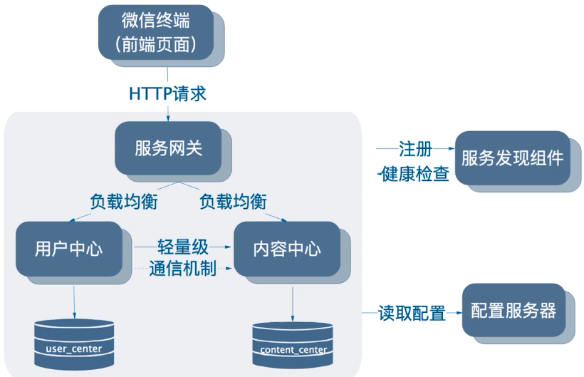
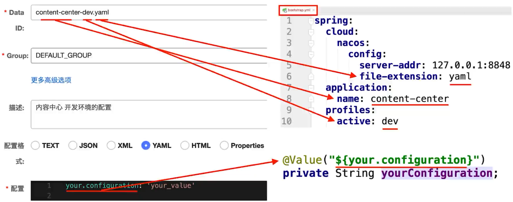
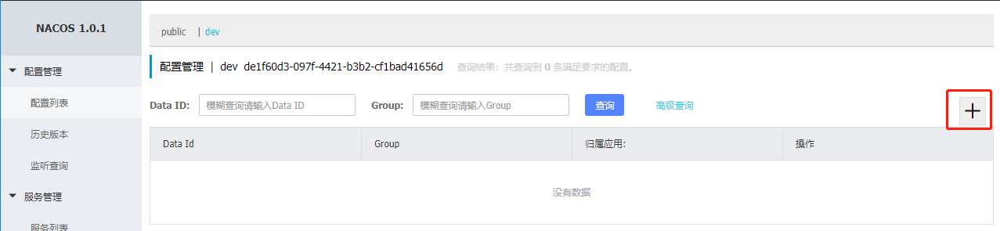
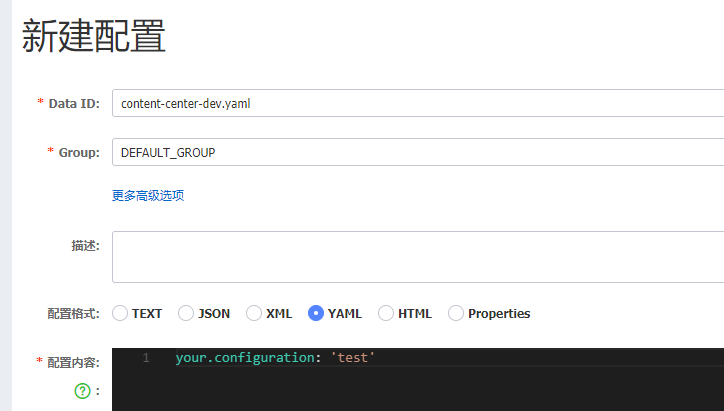
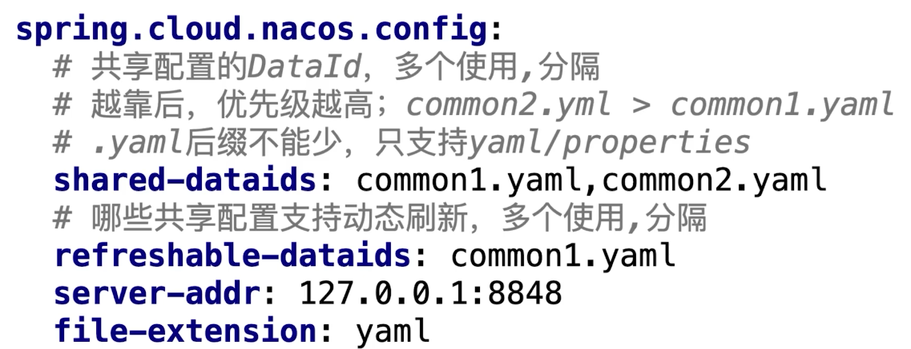
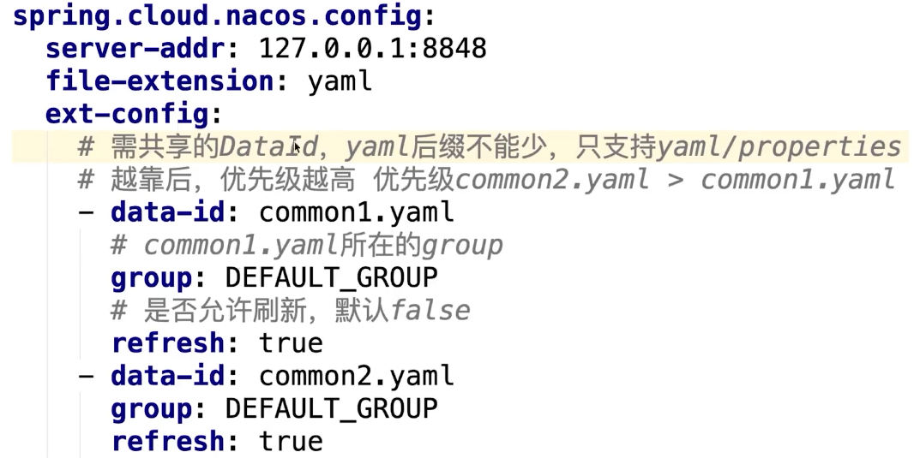
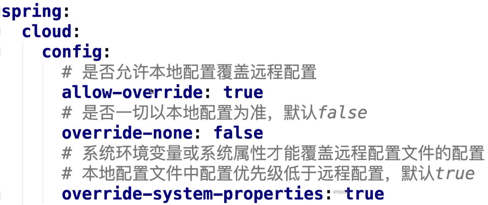
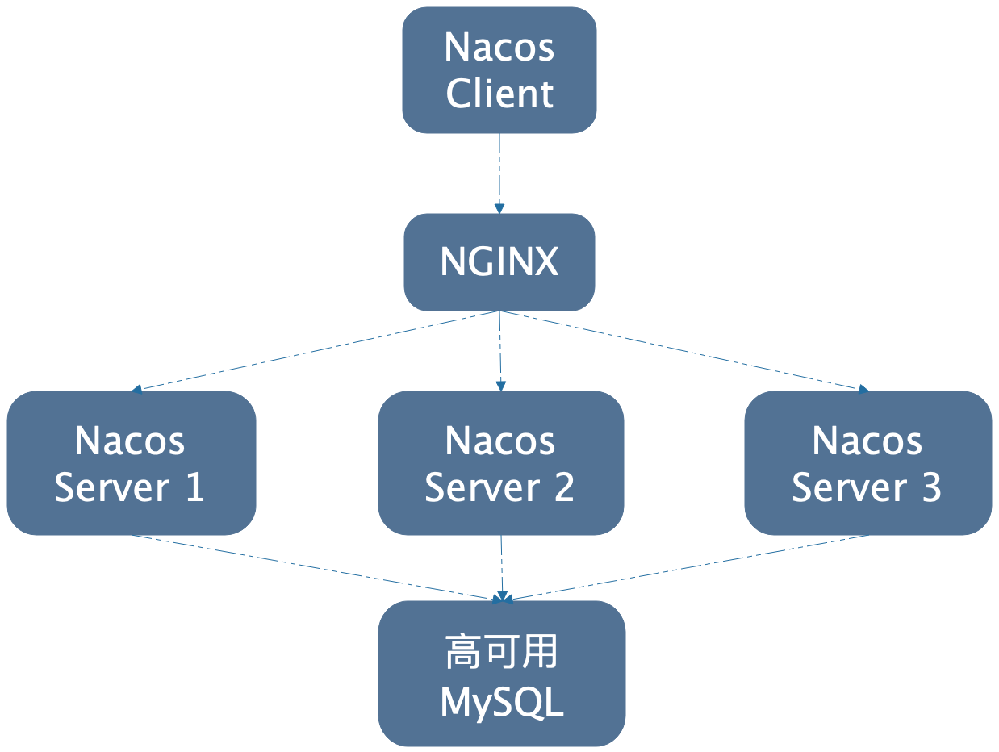

# 实现配置管理

- 不同环境不同配置
  - jwt秘钥在生产环境需要变化
  - 连接池的大小动态变化，即时生效，不需要重启
- 如何处理
  - 引入配置服务器

 


# 使用nacos配置管理

- nacos的名称配置是约定的




- pom

```xml
<dependency>
    <groupId>org.springframework.cloud</groupId>
    <artifactId>spring-cloud-starter-alibaba-nacos-config</artifactId>
</dependency>
```

- controller

```java
@Value("${your.configuration}")
private String nacosConfig;

@GetMapping("/test/config")
public String getConfig(){
    return nacosConfig;
}
```

- bootstrap.yml

```yml
spring:
  cloud:
    nacos:
      config:
        server-addr: localhost:8848
        namespace: de1f60d3-097f-4421-b3b2-cf1bad41656d #dev
        file-extension: yaml
  application:
    name: content-center
  profiles:
    active: dev
```

- 在nacos页面上进行配置



  

- 访问http://localhost:8010/test/config
  - 如果更改了页面中的配置，再访问不会更新


# 配置属性的动态刷新和回滚

- 添加@RefreshScope，在调用的controller类上
  - 可以实现动态修改后，访问到最新的配置
- bug：配置成功后，如果要回滚，并且回滚到第一个配置，那么客户端访问该配置会报错，在nacos1.2会改正


# 配置共享


## 公共配置


- 配置抽取
- 创建一个content-center.yaml，存放通用配置
- 启动时：nacos config先找content-center.yaml，然后再找content-center-dev.yaml

```log
2020-03-21 17:19:06.057  INFO 44204 --- [main] o.s.c.a.n.c.NacosPropertySourceBuilder   : Loading nacos data, dataId: 'content-center.yaml', group: 'DEFAULT_GROUP'
2020-03-21 17:19:06.062  INFO 44204 --- [main] o.s.c.a.n.c.NacosPropertySourceBuilder   : Loading nacos data, dataId: 'content-center-dev.yaml', group: 'DEFAULT_GROUP'
```

- 注意：读取dev.yaml的配置的时候，如果和公共配置有相同字段配置，那么dev.yaml的优先级高于通用配置，会覆盖


## 应用间的共享


### shared-dataid

 


### ext-config

 


# 优先级

自动 > ext-config > shared-dataids


## 远程配置与本地配置的优先级

- 该配置必须在远程配置中才生效

 


# 引导上下文

- bootstrap.yml
  - 连接配置服务器，读取外部配置
  - 连接nacos，读取nacos的配置
  - 是Application Context的父上下文


# 数据持久化

- nacos将数据存储在本地

- 服务发现

  - ~/nacos/naming

  - C:\Users\Administrator\nacos\naming

    - 示例打开文件C:\Users\Administrator\nacos\naming\public\DEFAULT_GROUP%40%40user-center

    ```json
    {"metadata":{},"dom":"DEFAULT_GROUP@@user-center",
     "cacheMillis":10000,"useSpecifiedURL":false,"hosts":[],
     "name":"DEFAULT_GROUP@@user-center",
     "checksum":"7d1a19f2d054b8223c14653cbd1527aa",
     "lastRefTime":1584112082520,"env":"","clusters":""}
    ```

- 配置服务器
  - 配置数据：$NACOS_HOME/data/derby-data
    - 使用内嵌数据库derby
    - derby只支持单个连接
    - 如果访问需要关闭nacos，可使用idea连接数据库
    - 不能用于生产环境
  - 快照：~/nacos/config
    - 提升性能，做容灾


## 使用mysql做数据持久化

https://www.imooc.com/article/288153



# 小结

- 配置可以放在本地，不放远程
  - 定位问题方便
  - 配置在本地，有idea错误提升
  - 不要滥用配置服务器
- 尽量避免优先级
- 定规范，所有配置属性都要加上注释
- 配置管理人员尽量少，nacos的权限非细粒度