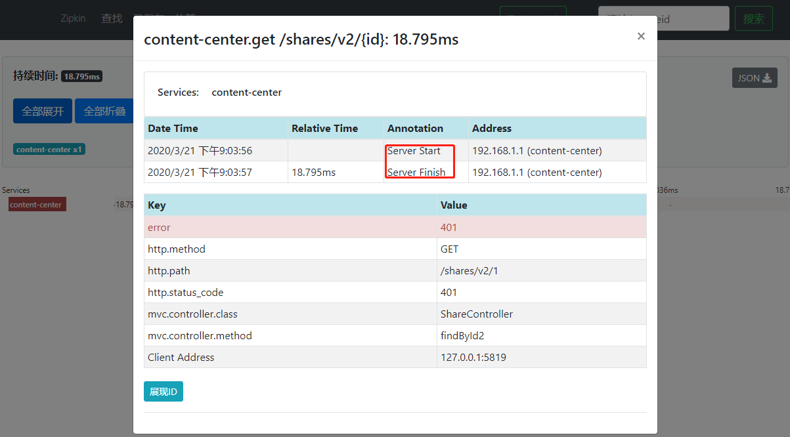

# 需求

- 跨微服务API调用异常，快速定位
- 跨微服务API调用发生性能瓶颈，要求迅速定位出系统瓶颈

- 使用Spring Cloud Sleuth + Zipkin
- Skywalking，Pinpoint

# 调用链监控原理

 

- 自关联数据库
- stage表示各个阶段，cs是client send
- pspan_id 表示 parent_span_id

- 分析调用异常
  - 调用正常，则数据库有4条记录
  - 如果调用只有3条记录，说明content-center响应有问题
  - 如果调用只有2条记录，说明user-center没有成功返回，user-center可能有异常
  - 如果调用只有1条记录，说明user-center可能宕机，或者网络异常
- 分析性能瓶颈
  - 使用timestamp计算时间间隔，得到网络延时
  - t2-t1 请求时候的网络延时
  - t3-t2 可以得到user-center的处理耗时
  - t4-t3  返回时的耗时
  - t4-t1 处理总耗时


# 整合Sleuth

- Sleuth 侦探
  - Spring Cloud 的分布式跟踪解决方案
  - 可以认为是调用链的客户端，在每个微服务节点上
  - 术语
    - Span 跨度
      - Sleuth的基本工作单元，64位id的唯一标识
      - 除了id以外还有描述，时间戳事件，键值对的标注（CS，SR，SS，CR），SpanID，Span父ID等
    - trace 跟踪
      - 一组span组成的树状结构，类似于上记录的4条数据
    - Annotation 标注
      - CS：Client Sent 客户端发送
        - 客户端发起一个请求，该annotation描述了span的开始
      - SR：Server Received 服务端接收
        - 服务端获取请求并准备处理
      - SS：Server Sent 服务端发送
        - 表明完成请求处理，当响应发回客户端时
      - CR：Client Received 客户端接收
        - span结束的标识，客户端成功接收到服务端的响应

整合

- pom

```xml
<dependency>
    <groupId>org.springframework.cloud</groupId>
    <artifactId>spring-cloud-starter-sleuth</artifactId>
</dependency>
```

- 添加jar即可，不需要配置

- 访问http://localhost:8088/users/1
- 查看日志，发现不同点

```log
2020-03-21 20:08:50.538  INFO [user-center,,,] 14876 --- [nio-8088-exec-1] o.s.web.servlet.DispatcherServlet        : Completed initialization in 17 ms
2020-03-21 20:08:50.581 ERROR [user-center,47fa7f6f05c899e4,47fa7f6f05c899e4,false] 14876 --- [nio-8088-exec-1] com.stt.contentcenter.util.JwtOperator   : token解析错误

[user-center,47fa7f6f05c899e4,47fa7f6f05c899e4,false]  
[应用名称,traceId,spanId,是否上传zipkin]
```

- 如果要打印更多的日志，便于排错

```yml
logging:
  level:
    com.stt: debug
    com.alibaba.nacos: error
    org.springframework.cloud.sleuth: debug
```


# 整合 Zipkin

## Server

- Zipkin

  - Twitter开源的分布式追踪系统，收集系统的时序数据，追踪系统的调用问题

- 搭建Zipkin Server

  - https://www.imooc.com/article/291572
  - 下载zipkin-server-2.12.9-exec.jar
    - https://search.maven.org/remote_content?g=io.zipkin.java&a=zipkin-server&v=LATEST&c=exec
  - 启动

  ```bash
  java -jar zipkin-server-2.12.9-exec.jar
  ```

  - 访问 http://localhost:9411


## Client

- 添加依赖，去除Sleuth，zipkin自带Sleuth

```xml
<dependency>
    <groupId>org.springframework.cloud</groupId>
    <artifactId>spring-cloud-starter-zipkin</artifactId>
</dependency>
```

- 配置

```yml
spring:  
  zipkin:
    base-url: http://localhost:9411/
    discoveryClientEnabled: false
  sleuth:
    sampler:
    # 抽样率，默认是0.1, 配置1.0，则所有的请求都会上报给zipkin
      probability: 1.0
```

- 访问http://localhost:8010/shares/v2/1
  - 有ServerStart，和ServerFinish，但是没有ClientSent和ClientReceive
  - 由于是通过浏览器客户端访问，而不是微服务内部访问，因此Client端的操作没有走Sleuth，因此无法记录
  - 返回不是200的算作失败访问
  - 点击Services 每条span的中间位置，双击可以弹出访问的记录明细



- 正常的情况


## 解决与nacos整合异常

https://www.imooc.com/article/291578

```bash
2019-08-24 23:10:25.330 ERROR [user-center,,,] 48628 --- [.naming.updater] com.alibaba.nacos.client.naming          : [NA] failed to update serviceName: DEFAULT_GROUP@@localhost

java.lang.IllegalStateException: failed to req API:/nacos/v1/ns/instance/list after all servers([localhost:8848]) tried: failed to req API:http://localhost:8848/nacos/v1/ns/instance/list. code:404 msg: service not found: DEFAULT_GROUP@@localhost
	at com
```

- 原因
  - Spring Cloud把 `http://localhost:9411/` 当作了服务发现组件里面的服务名称；于是，Nacos Client尝试从Nacos Server寻找一个名为 `localhost:9411` 的服务…这个服务根本不存在啊，于是就疯狂报异常（因为Nacos Client本地定时任务，刷新本地服务发现缓存）
    

- 解决

  - 让Spring Cloud 正确识别 `http://localhost:9411/` ，当成一个URL，而不要当做服务名
    - 修改配置

  ```yml
  spring:
    zipkin:
      base-url: http://localhost:9411/
      discovery-client-enabled: false # 正确的配置，但是不生效，bug，Greenwich.SR3解决
  
  spring:
    zipkin:
      base-url: http://localhost:9411/
      discoveryClientEnabled: false # 生效的配置
  
  # 原因，源码编写按照驼峰获取
  @Configuration
  @ConditionalOnProperty(value = "spring.zipkin.discoveryClientEnabled", havingValue = "false")
  static class ZipkinClientNoOpConfiguration {
    ...
  }
  ```

  - 把Zipkin Server注册到Nacos
    - 官方不支持


# 链路跟踪测试

- 将gateway，content-center，user-center都加入zipkin

- 通过网关访问：http://localhost:8040/shares/v2/{id}


- 为什么有2个content-conter的记录？
- 第一个是controller层


- 第二层是service调用feign记录的数据


# Zipkin持久化

- MySql

  - 有性能问题

- ElasticSearch

  - 建议使用
  - 版本选择ES5\6\7
  - 下载ES6.8 
    - 7以后要JDK11
  - 配置

  

  - 启动

  ```bash
  STORAGE_TYPE=elasticsearch ES_HOSTS=localhost:9200 java -jar zipkin-server-2.12.9-exec.jar
  ```

- Cassandra

- 相关文档：https://github.com/openzipkin/zipkin#storage-componet

- 其他环境变量：https://github.com/openzipkin/tree/master/zipkin-server#environment-variables


# 依赖关系图

- 如果使用了ElasticSearch，则需要使用zipkin dependencies服务


- 执行


- 注意该命令执行完后，会停止，那么在实际生产中需要定时执行该命令


