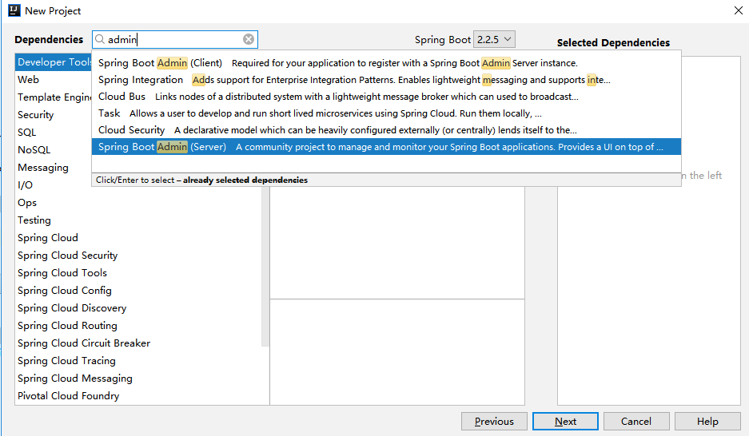
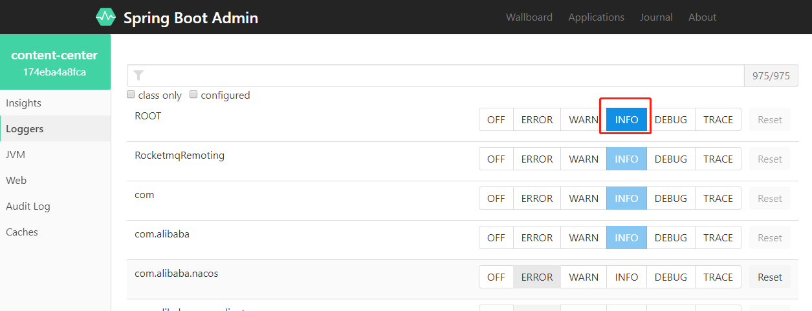
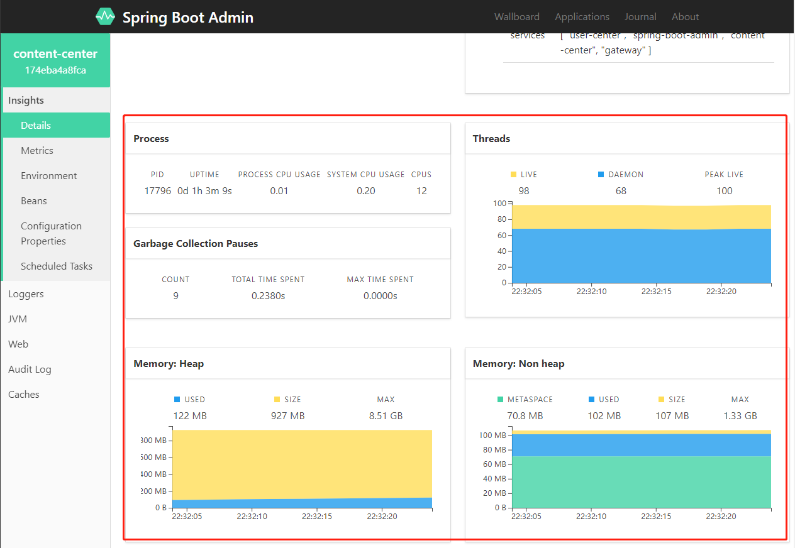
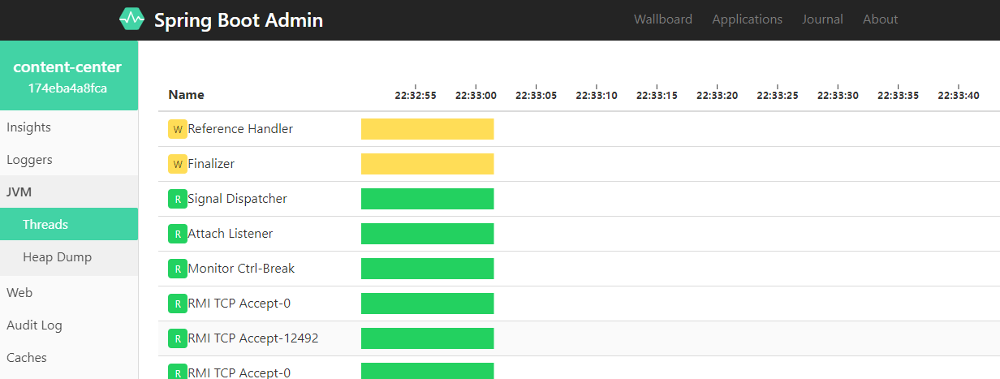
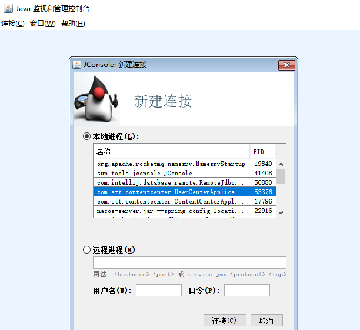
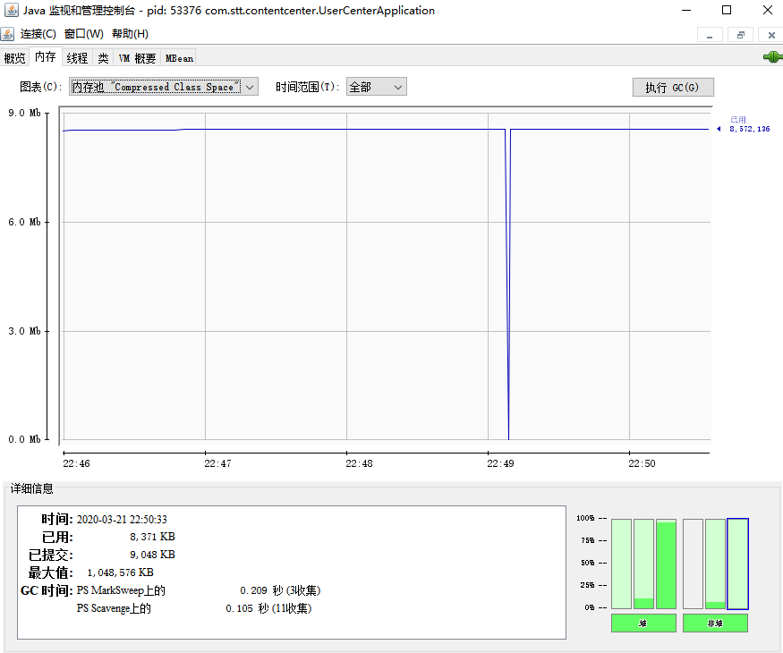
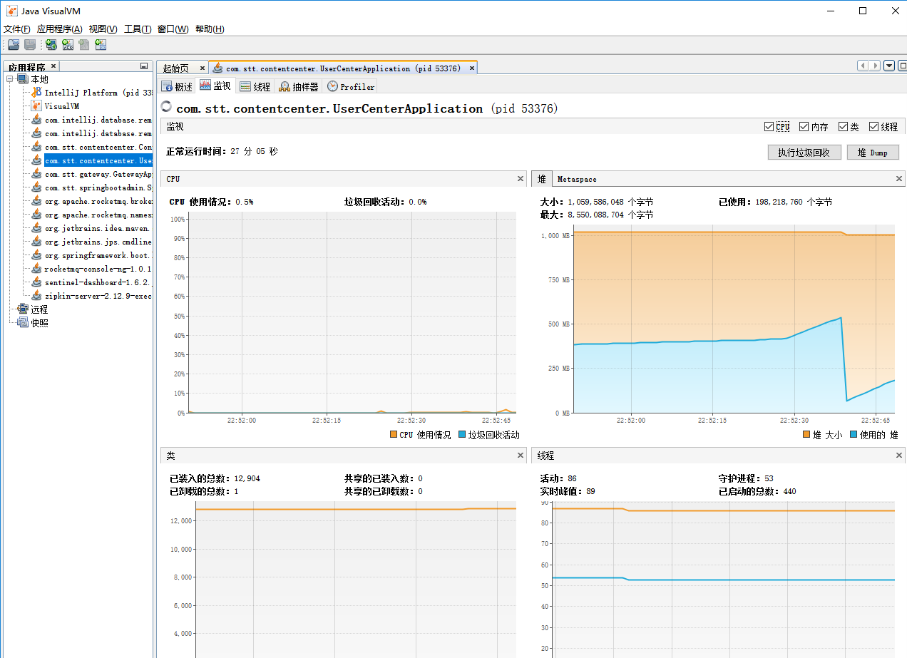

# 微服务监控

- Spring Boot Actuator
- Sentinel Dashboard
- Spring Cloud Sleuth +Zipkin


# Spring Boot Admin

- 给SpringBoot使用的简单易用的数据监控工具
- https://github.com/codecentric/spring-boot-admin
- http://codecentric.github.io/spring-boot-admin/2.1.6/


## 使用

- 创建项目
  - 选择server



- pom

```xml
<?xml version="1.0" encoding="UTF-8"?>
<project xmlns="http://maven.apache.org/POM/4.0.0" xmlns:xsi="http://www.w3.org/2001/XMLSchema-instance"
	xsi:schemaLocation="http://maven.apache.org/POM/4.0.0 https://maven.apache.org/xsd/maven-4.0.0.xsd">
	<modelVersion>4.0.0</modelVersion>
	<parent>
		<groupId>org.springframework.boot</groupId>
		<artifactId>spring-boot-starter-parent</artifactId>
		<version>2.1.5.RELEASE</version>
		<relativePath/> <!-- lookup parent from repository -->
	</parent>
	<groupId>com.stt</groupId>
	<artifactId>spring-boot-admin</artifactId>
	<version>0.0.1-SNAPSHOT</version>
	<name>spring-boot-admin</name>
	<description>Demo project for Spring Boot</description>

	<properties>
		<java.version>1.8</java.version>
		<spring-boot-admin.version>2.1.5</spring-boot-admin.version>
		<spring-cloud.version>Greenwich.SR1</spring-cloud.version>
	</properties>

	<dependencies>

		<dependency>
			<groupId>de.codecentric</groupId>
			<artifactId>spring-boot-admin-starter-server</artifactId>
		</dependency>

		<dependency>
			<groupId>org.springframework.cloud</groupId>
			<artifactId>spring-cloud-starter-alibaba-nacos-discovery</artifactId>
			<version>0.9.0.RELEASE</version>
		</dependency>

		<dependency>
			<groupId>org.springframework.boot</groupId>
			<artifactId>spring-boot-starter-test</artifactId>
			<scope>test</scope>
			<exclusions>
				<exclusion>
					<groupId>org.junit.vintage</groupId>
					<artifactId>junit-vintage-engine</artifactId>
				</exclusion>
			</exclusions>
		</dependency>
	</dependencies>

	<dependencyManagement>
		<dependencies>
			<dependency>
				<groupId>org.springframework.cloud</groupId>
				<artifactId>spring-cloud-dependencies</artifactId>
				<version>${spring-cloud-alibaba.version}</version>
				<type>pom</type>
				<scope>import</scope>
			</dependency>
			<dependency>
				<groupId>de.codecentric</groupId>
				<artifactId>spring-boot-admin-dependencies</artifactId>
				<version>${spring-boot-admin.version}</version>
				<type>pom</type>
				<scope>import</scope>
			</dependency>
		</dependencies>
	</dependencyManagement>

	<build>
		<plugins>
			<plugin>
				<groupId>org.springframework.boot</groupId>
				<artifactId>spring-boot-maven-plugin</artifactId>
			</plugin>
		</plugins>
	</build>

</project>
```

- yml

```yml
server:
  port: 8020
spring:
  application:
    name: spring-boot-admin
  cloud:
    nacos:
      discovery:
        server-addr: localhost:8848
        namespace: de1f60d3-097f-4421-b3b2-cf1bad41656d #dev
```


## 日志级别

- 可以动态的调节日志级别，调节后，应用的日志级别改变，可以查看故障，然后调节回来




## JVM监控

- Spring Boot Actuator : metric，heapdump，threaddump



- 查看线程



- java自带jvm工具
  - jconsole
  - jvisualvm


### jconsole

```bash
D:\study\spring-cloud-study\code\spring-cloud-alibaba-pro01>jconsole
```

 




### jvisualvm

```bash
D:\study\spring-cloud-study\code\spring-cloud-alibaba-pro01>jvisualvm
```




## GC日志

- 启动参数，打印gc日志

```bash
-Xmx5m -XX:+PrintGCDetails -Xloggc:gc.log # 将gc的详情打印的到gc.log中
```

- 通过网页工具分析
  - https://gceasy.io/
  - FastThread：https://fastthread.io/  分析线程Dump日志
  - HeapHero：https://heaphero.io/ 分析堆Dump日志

