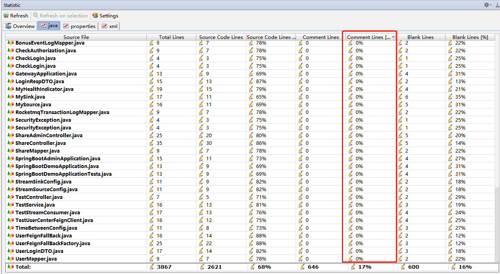

# 注释原则

- 每一步业务主要流程
- 核心方法
- 条件，分支，判断前加注释

# Statistic

- idea插件，下载statistic插件
- 可以指定注释率要求，比如35%

# Alibaba 规约 P3C

https://github.com/alibaba/p3c

- 下载alibaba插件

# SonarQube

https://www.imooc.com/article/291857

