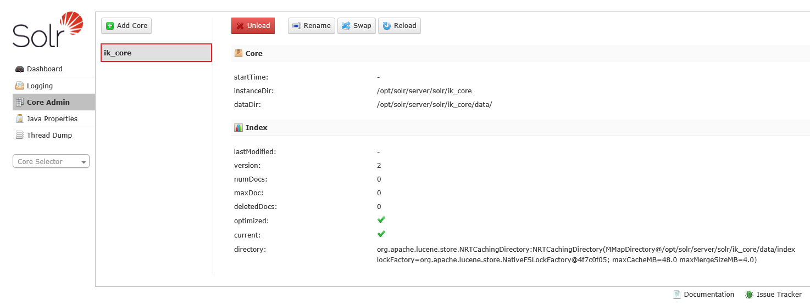

# Solr使用

## 概述

Solr 是一个开源搜索平台，用于构建搜索应用程序。它建立在 Lucene (全文搜索引擎)之上。Solr 是企业级的，快速的和高度可扩展的。使用 Solr 构建的应用程序非常复杂，可提供高性能。

为了在 CNET 网络的公司网站上添加搜索功能，Yonik Seely 于 2004 年创建了 Solr。并在 2006 年 1 月，它成为 Apache 软件基金会下的一个开源项目。并于2016年发布最新版本 Solr 6.0，支持并行SQL查询的执行。

Solr 可以和 Hadoop 一起使用。由于 Hadoop 处理大量数据，Solr 帮助我们从这么大的源中找到所需的信息。不仅限于搜索，Solr 也可以用于存储目的。像其他 NoSQL 数据库一样，它是一种非关系数据存储和处理技术。

总之，Solr 是一个可扩展的，可部署，搜索/存储引擎，优化搜索大量以文本为中心的数据库


### 特点

Solr 是 Lucene 的 Java API 的包装。因此，使用 Solr，可以利用 Lucene 的所有功能。

- Restful APIs − 要与 Solr 通信，并非一定需要有 Java 编程技能。相反，您可以使用 RESTful 服务与它通信。可使用文件格式(如XML，JSON和.CSV)在 Solr 中作为输入文档，并以相同的文件格式获取结果。
- 全文搜索 - Solr 提供了全文搜索所需的所有功能，例如令牌，短语，拼写检查，通配符和自动完成。
- 企业准备 - 根据企业/组织的需要，Solr 可以部署在任何类型的系统(大或小)，如独立，分布式，云等。
- 灵活和可扩展 - 通过扩展 Java 类并相应配置，可以轻松地定制 Solr 的组件。
- NoSQL 数据库 - Solr 也可以用作大数据量级的 NOSQL 数据库，可以沿着集群分布搜索任务。
- 管理界面 - Solr 提供了一个易于使用，用户友好，功能强大的用户界面，使用它可以执行所有可能的任务，如管理日志，添加，删除，更新和搜索文档。
- 高度可扩展 - 在使用 Solr 与 Hadoop 时，我们可以通过添加副本来扩展其容量。
- 以文本为中心并按相关性排序 - Solr 主要用于搜索文本文档，结果根据与用户查询的相关性按顺序传送。

与 Lucene 不同，在使用 Apache Solr 时，可不需要具有 Java 编程技能。它提供了一个完整的准备部署服务，以构建一个自动完成的搜索框，Lucene 是不提供的。 使用 Solr 可以扩展，分配和管理大规模(大数据)应用程序的索引。


### 结构

- mysql
  - 数据库（多个）
    - 表
      - 字段（多个）
- redis
  - db0-15
    - key
    - value

- solr
  - 数据库（一个）
    - 域（等价于表） ：控制版面的core，一个core表示一个域
      - 域字段（大量）


## 搜索引擎

搜索引擎是指一个庞大的互联网资源数据库，如网页，新闻组，程序，图像等。它有助于在万维网上定位信息。用户可以通过以关键字或短语的形式将查询传递到搜索引擎中来搜索信息。然后搜索引擎搜索其数据库并向用户返回相关链接。


### 组件

一般来说，搜索引擎有三个基本组件

- Web爬虫 - Web爬虫也称为蜘蛛或机器人。 它是一个收集网络信息的软件组件。
- 数据库 - Web上的所有信息都存储在数据库中。它们包含大量的 Web 资源。
- 搜索接口 - 此组件是用户和数据库之间的接口。它帮助用户搜索数据库


### 流程

任何搜索应用程序都需要执行以下一些或全部操作

- 获取原始内容
  - 任何搜索应用程序的第一步是收集要进行搜索的目标内容
- 构建文档
  - 从原始内容构建文档，让搜索应用程序可以很容易地理解和解释
- 分析文档
  - 在索引开始之前，将对文档进行分析
- 索引文档
  - 当文档被构建和分析后，下一步是对它们建立索引，以便可以基于特定键而不是文档的全部内容来检索该文档。索引类似于在书开始页或末尾处的目录索引，其中常见单词以其页码显示，使得这些单词可以快速跟踪，而不是搜索整本书
- 用于搜索的用户接口
  - 当索引数据库就绪，应用程序可以执行搜索操作。 为了帮助用户进行搜索，应用必须提供用户接口，用户可以在其中输入文本并启动搜索过程
- 构建查询
  - 当用户做出搜索文本的请求，应用程序应该使用该文本来准备查询对象，然后可以使用该查询对象来查询索引数据库以获得相关的细节
-   搜索查询
  - 使用查询对象，检查索引数据库以获取相关详细信息和内容文档
-   渲染结果
  - 当收到所需的结果，应用程序应决定如何使用其用户界面向用户显示结果


## 分词技术

分词技术就是搜索引擎针对用户提交查询的关键词串进行的查询处理后根据用户的关键词串用各种匹配方法进行分词的一种技术。


### 中文分词算法


#### 基于字符串匹配

基于字符串匹配，即扫描字符串，如果发现字符串的子串和词相同，就算匹配，这类分词通常会加入一些启发式规则，比如“正向/反向最大匹配”,“长词优先”等策略，这类算法优点是速度块，都是O(n)时间复杂度，实现简单，效果尚可。缺点，就是对歧义和未登录词处理不好

歧义的列子：歧义的例子很简单"长春市/长春/药店" "长春/市长/春药/店" 未登录：即词典中没有出现的词，当然也就处理不好

ikanalyzer, paoding 等就是==基于字符串匹配==的分词


##### IKAnalyzer 

IKAnalyzer 是一个开源的，基于 Java 语言开发的轻量级的中文分词工具包，基于文本匹配，不需要投入大量人力进行训练和标注可以自定词典，方便加入特定领域的词语，能分出多粒度的结果


#### 基于统计以及机器学习的分词方式

这类分词基于人工标注的词性和统计特征，对中文进行建模，即根据观测到的数据（标注好的语料）对模型参数进行估计，即训练。在分词阶段再通过模型计算各种分词出现的概率，将概率最大的分词结果作为最终结果。常见的序列标注模型有 HMM 和 CRF。

这类分词算法能很好处理歧义和未登录词问题，效果比前一类效果好，但是需要大量的人工标注数据，以及较慢的分词速度


## 安装

### 基本部署

#### docker-compose.yml

```yaml
version: '3.1'
services:
  solr:
    image: solr
    restart: always
    container_name: solr
    ports:
      - 8983:8983
```

- 访问 地址http://192.168.119.134:8983/solr


### 安装IKAnalyzer部署

创建一个名为 `/usr/local/docker/solr/ikanalyzer` 目录

- `/usr/local/docker/solr`：用于存放 docker-compose.yml 配置文件
- `/usr/local/docker/solr/ikanalyzer`：用于存放 Dockerfile 镜像配置文件

将配置文件的jar包解压到对应的`ikanalyzer`目录下


#### docker-compose.yml

```yaml
version: '3.1'
services:
  solr:
    build: ikanalyzer
    restart: always
    container_name: solr
    ports:
      - 8983:8983
    volumes:
      - ./solrdata:/opt/solrdata
```


#### Dockerfile

- 注意：最新的版本在创建文件夹的时候有权限问题

```shell
FROM solr：7.5.0

# 创建 Core
WORKDIR /opt/solr/server/solr
RUN mkdir ik_core
WORKDIR /opt/solr/server/solr/ik_core
RUN echo 'name=ik_core' > core.properties
RUN mkdir data
RUN cp -r ../configsets/sample_techproducts_configs/conf/ .

# 安装中文分词
WORKDIR /opt/solr/server/solr-webapp/webapp/WEB-INF/lib
ADD ik-analyzer-solr5-5.x.jar .
ADD solr-analyzer-ik-5.1.0.jar .
WORKDIR /opt/solr/server/solr-webapp/webapp/WEB-INF
ADD ext.dic .
ADD stopword.dic .
ADD IKAnalyzer.cfg.xml .

# 增加分词配置
COPY managed-schema /opt/solr/server/solr/ik_core/conf

WORKDIR /opt/solr
```

- 访问地址：http://192.168.10.131:8983/




## 基本使用

